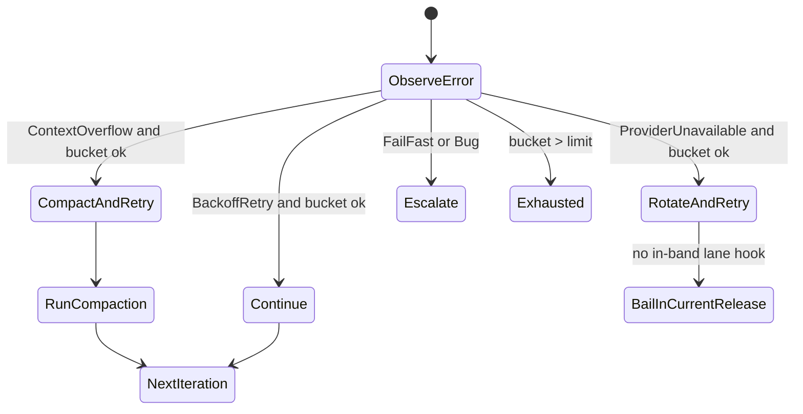
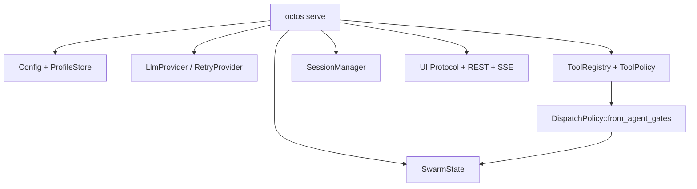
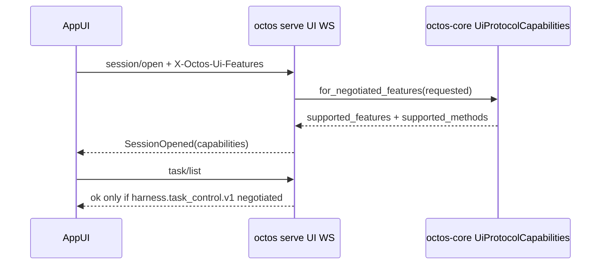
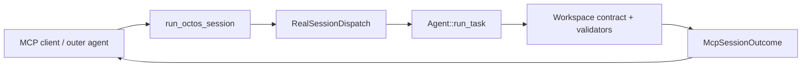
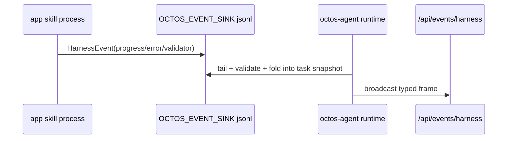

# Agent Loop / CLI / Harness 工程化源码深挖

> Source baseline: `../octos` HEAD `0eec0286`, clean worktree.
> Scope: `crates/octos-agent`, `crates/octos-cli`, `crates/octos-core::ui_protocol`, `crates/app-skills/harness-starter-*`.
> Goal: 挖掘当前书稿还可以更新、增补、加图的工程内容，重点是准确性和深度。

## 1. 总体判断

Agent loop、CLI 和 Harness 现在已经不是三个孤立章节的素材，而是一条完整工程链路：

```mermaid
flowchart LR
    CLI[octos-cli: chat/serve/gateway/mcp-serve] --> A[octos-agent loop]
    A --> H[HarnessError + LoopRetryState]
    A --> C[Compaction / workspace contract]
    A --> V[Validators + artifact gates]
    A --> E[HarnessEvent sink]
    E --> API[/api/events/harness + UI Protocol]
    CLI --> MCP[MCP server: run_octos_session]
    CLI --> UI[AppUI capability negotiation]
```

书稿可以把这条链路写成一个“工程化闭环”：CLI 负责启动、配置、暴露控制面；agent loop 负责执行和恢复；harness 负责把运行时事实变成可验证、可观测、可兼容升级的契约。

## 2. Agent Loop：从“循环执行”升级为 typed recovery state machine

### 2.1 HarnessError 是 loop 的错误边界

`HarnessError` 明确列出 loop 能识别的失败类型，包括 `RateLimited`、`ContextOverflow`、`Authentication`、`InvalidRequest`、`ContentFiltered`、`ProviderUnavailable`、`Network`、`Timeout`、`ToolExecution`、`PluginSpawn`、`PluginTimeout`、`PluginProtocol`、`DelegateDepthExceeded` 和 `Internal`（`crates/octos-agent/src/harness_errors.rs:93`）。每个 variant 都有稳定 `variant_name()` 和唯一 `RecoveryHint`（`crates/octos-agent/src/harness_errors.rs:205-233`）。

这可以更新 Ch5：不要再把 loop 错误写成“异常 -> 重试/退出”的粗粒度逻辑，而应强调它是“typed error -> recovery hint -> loop decision”的控制流。

可写入表格：

| HarnessError | RecoveryHint | LoopDecision | 章节含义 |
|---|---|---|---|
| `RateLimited` / `Network` / `Timeout` | `BackoffRetry` | `Continue` |  transient failure，不重塑 prompt |
| `ContextOverflow` | `CompactContext` | `CompactAndRetry` | 唯一恢复路径是压缩上下文 |
| `ProviderUnavailable` | `SwitchProvider` | `RotateAndRetry` | 语义上应换 provider lane |
| `Authentication` / `InvalidRequest` / `ContentFiltered` | `FailFast` | `Escalate` | 配置或请求本身不可恢复 |
| `DelegateDepthExceeded` | `FailFast` | `Escalate` | 防止子任务递归扩散 |
| `Internal` | `Bug` | `Escalate` | 运行时 invariant broken |

注意一个重要细节：`RotateAndRetry` 在 `handle_loop_error_with_dispatch` 中目前没有 agent 内部轮转 hook，代码会记录 warning 并 bail（`crates/octos-agent/src/agent/loop_runner.rs:336-350`）。这值得在书中说明为“语义已经建模，但当前 release 的 lane rotation 仍由外层 provider chain 承担”。这样比直接写“会自动切换 provider”更准确。

### 2.2 LoopRetryState 是 bounded bucket，不是无限 retry counter

`LoopRetryState` 为每个错误 variant 维护独立 bucket 和 hard limit（`crates/octos-agent/src/agent/loop_state.rs:70-104`, `:171-190`）。`observe()` 会先 bump counter，再根据 `RecoveryHint` 得到 `LoopDecision`；超过 limit 就返回 `Exhausted`（`crates/octos-agent/src/agent/loop_state.rs:238-253`）。

这可以补 Ch5 的深度：octos 的 loop resilience 不是“尽量多试几次”，而是用 Rust 类型把可恢复性拆成有限状态。尤其需要写：

- `ContextOverflow` 默认限制是 2，不会无限 compact。
- `DelegateDepthExceeded` 默认限制是 1，递归越界立即收敛。
- `Shell spiral` 虽不是 `HarnessError`，也通过同一状态机处理（`SHELL_SPIRAL_VARIANT`）。
- 每次观察都会更新 `octos_loop_retry_total{variant,decision}`，并可发 `HarnessEventPayload::Retry`。

图表建议放 Ch5：



### 2.3 PersistentRetryStateGuard 让 retry state 跨 turn 存活

`PersistentRetryStateGuard` 会在构造时从 `Arc<Mutex<LoopRetryState>>` hydrate，drop 时写回（`crates/octos-agent/src/agent/loop_runner.rs:126-170`）。`Agent` 通过 `with_persistent_retry_state` 暴露这个能力，测试 `tests/retry_state_persistence.rs` 明确验证跨 `process_message` / `run_task` 的 bucket counters 不会每轮重置。

这可更新 Ch5 / Ch8 的连接：上下文压缩和多轮任务不是“把所有状态塞进 prompt”，一部分控制状态在 Rust runtime 中持久化。书中可以区分：

- prompt-visible state：messages、summary、workspace contract。
- runtime control state：retry buckets、grace eligibility、task lifecycle。
- durable evidence state：validator ledger、harness event sink、cost ledger。

### 2.4 CompactAndRetry 已经接入 loop，不是未来设计

`handle_loop_error_with_dispatch` 对 `LoopDecision::CompactAndRetry` 会直接调用 `maybe_run_turn_compaction(messages, iteration)` 后返回 `Retry`（`crates/octos-agent/src/agent/loop_runner.rs:321-339`）。`loop_runner.rs` 的测试覆盖了 CompactAndRetry 必须触发 summarizer（`crates/octos-agent/src/agent/loop_runner.rs:3310`, `:3468-3559`）。

这可以让 Ch8 更准确：compaction 不只是 token 预算优化，而是 loop-level error recovery 的一部分。建议 Ch5 先引入 `CompactAndRetry`，Ch8 再展开 compaction policy、summary 与 validator preservation。

## 3. CLI：运行入口已经变成控制面汇聚层

### 3.1 `octos serve` 不只是 REST server，而是 AppState 汇聚点

`serve.rs` 在启动时会构建 provider、tool registry、session manager、metrics reporter、SSE broadcaster、profile store、dashboard auth 和 swarm state。特别是 swarm state 会从 `config.tool_policy` 和注入型环境变量 denylist 构建 `DispatchPolicy::from_agent_gates(tool_policy, true)`（`crates/octos-cli/src/commands/serve.rs:1128-1156`）。

可更新 Ch13 / Ch14：Serve 模式不是“把 chat 包成 HTTP”，而是生产控制面的汇聚点：

- AppUI / REST / SSE / UI Protocol 共用 AppState。
- dashboard auth 可从 profile email config 推导（`serve.rs` 的 `derive_dashboard_auth_from_profiles`）。
- swarm dispatch policy 在 serve 启动时被注入，避免 MCP / CLI swarm backend 绕过 native tool policy。

图表建议放 Ch13：



### 3.2 UI Protocol capability negotiation 是 CLI/API 的工程边界

`UiProtocolCapabilities::for_negotiated_features` 会把 client 请求的 features 与 server known features 取交集，并且只有在协商到 `harness.task_control.v1` 时才把 `task/list`、`task/cancel`、`task/restart_from_node` 放进 `supported_methods`（`crates/octos-core/src/ui_protocol.rs:712-825`）。CLI WebSocket 侧通过 `ConnectionUiFeatures::negotiated_capabilities()` 在 `SessionOpened` 中返回协商结果（`crates/octos-cli/src/api/ui_protocol.rs:479-534`, `:1440-1475`）。

这可以深化 Ch14 已有 UI Protocol 内容：能力协商不是为了“前端知道有啥 API”，而是防止半升级客户端误调用后台任务控制方法。它还区分：

- 没有 header：返回 `first_server_slice`，方便旧客户端 discovery。
- 发送了 header：只返回请求且被支持的 feature，未知 feature 会被丢弃。
- capability-gated methods 不会在未协商时出现在 method list。

图表建议放 Ch14：



### 3.3 `/api/events/harness` 是 typed event 的筛选面

`GET /api/events/harness` 从 broadcaster 订阅事件，并支持 `kinds` 过滤；过滤会把 `SwarmDispatch`、`swarm_dispatch`、`swarm-dispatch` 归一化成同一个 key（`crates/octos-cli/src/api/events_harness.rs:32-130`）。它也兼容 top-level `"kind"` 和 nested `"payload.kind"` 两种 frame 形态。

这可以补 Ch14 的可观测性：harness event SSE 不是通用 log stream，而是面向 dashboard / validator / live gate 的 typed event stream。读者应理解它和普通 tracing/Prometheus 的边界：

- tracing：开发者调试。
- Prometheus metrics：聚合统计。
- `/api/events/harness`：任务/子 Agent/swarm 的结构化实时事件。

### 3.4 `octos mcp-serve` 是 session-level tool，不暴露内部工具

`mcp_server.rs` 明确说明只暴露一个 MCP tool：`run_octos_session`，每次调用运行完整 octos session，外层 caller 只看到 aggregate result，不会看到内部 tool calls / iteration events / progress stream（`crates/octos-agent/src/mcp_server.rs:1-34`）。HTTP transport 需要 `OCTOS_MCP_SERVER_TOKEN`，stdio transport 使用 parent-trust auth（`crates/octos-agent/src/mcp_server.rs:36-69`）。

`commands/mcp_serve.rs` 进一步说明 `RealSessionDispatch` 复用 config loading、provider factory、Agent loop、workspace contract enforcement，并按 `Running -> Verifying -> Ready/Failed` 更新 lifecycle（`crates/octos-cli/src/commands/mcp_serve.rs:1-35`）。

这可以纠正 Ch13 / Ch11 的一个潜在误解：MCP serve 不是把 octos 的每个内部工具暴露给外层编排器，而是把“整次 octos session”暴露成一个 coarse-grained sub-agent tool。这个边界对安全和可观测性都重要。

图表建议放 Ch13：



## 4. Harness 工程化：ABI、事件、validator、starter skill

### 4.1 ABI schema versioning 是扩展稳定性的中心

`abi_schema.rs` 集中维护 `WorkspacePolicy`、`CompactionPolicy`、`HookPayload`、`ProgressEvent`、`TaskResult`、`SessionSummary`、swarm events、cost attribution、routing decision、credential pool config、harness error events 等 schema version（`crates/octos-agent/src/abi_schema.rs:1-142`）。`check_supported(kind, found, supported)` 对未来版本返回 typed error，而不是 silently truncate（`crates/octos-agent/src/abi_schema.rs:144-186`）。

这可以更新 Ch9：Harness 的扩展稳定性不是靠文档约定，而是靠每个 durable payload 的 `schema_version` 和统一校验函数。建议新增“ABI 版本不是 plugin manifest version”的小节：

- manifest version 描述 skill/plugin 自身版本。
- schema_version 描述 octos runtime 能理解的 payload 形状。
- future schema version 必须 fail closed，避免旧 runtime 错读新字段。

### 4.2 HarnessEvent sink 是本地 JSONL ABI，不是日志旁路

`harness_events.rs` 定义 `OCTOS_EVENT_SINK`、`OCTOS_SESSION_ID`、`OCTOS_TASK_ID`、`OCTOS_HARNESS_SESSION_ID`、`OCTOS_HARNESS_TASK_ID` 等环境变量，以及 16 KiB 的单行事件大小上限（`crates/octos-agent/src/harness_events.rs:1-38`）。`write_event_to_sink` 会 validate `HarnessEvent` 后 append JSONL（`crates/octos-agent/src/harness_events.rs:116-132`）。

这可以写进 Ch9 / Ch14：外部 app skill 不需要链接 octos runtime，也能通过环境变量发现 event sink，并写入结构化 progress / error / validator / cost / swarm events。与普通 stdout 的区别是：

- stdout 是工具结果协议。
- `OCTOS_EVENT_SINK` 是 side-channel 事件 ABI。
- runtime 会把事件折叠进 durable task snapshots 和 dashboard live view。

图表建议：



### 4.3 Validator runner 已经是安全执行器

`validators.rs` 的模块注释列出安全 invariant：命令 validator 走 `SafePolicy`，会 strip `BLOCKED_ENV_VARS`，无 `Command::new("sh")` escape hatch；超时会 SIGTERM -> SIGKILL / Windows `taskkill`; evidence 放在 `<workspace_root>/.octos/validator-evidence/`; outcome 以 schema version JSONL 持久化（`crates/octos-agent/src/validators.rs:1-24`）。

这可以补 Ch8 / Ch9 / Ch12：validator 不是“执行测试命令”的简单 hook，而是 workspace contract 的安全、持久、可回放证据层。建议把 validator 分成：

- turn-end validators：中间状态检查。
- completion validators：阻止 terminal success。
- optional validators：不阻塞但产生 warnings。
- evidence files：给 operator 复盘。

### 4.4 Starter app skills 已经内置工程质量门

`harness-starter-audio` 的 smoke test 不仅检查 manifest 能解析，还检查 `synthesize_clip` 必须声明 `concurrency_class = "exclusive"`，因为它写入 `audio/<slug>.wav`，否则 mutating tools 会被并行调度（`crates/app-skills/harness-starter-audio/tests/harness_smoke.rs:23-42`）。同一个 test 还验证 workspace policy 声明 `primary_audio` artifact 和 `file_size_min:$primary_audio:4096` validator（`crates/app-skills/harness-starter-audio/tests/harness_smoke.rs:46-79`）。

`harness-starter-report/workspace-policy.toml` 则展示了一个更小的 report artifact contract：`reports/*.md`、completion `file_exists`、verify `file_size_min`、failure notification（`crates/app-skills/harness-starter-report/workspace-policy.toml:1-29`）。

这可以更新 Ch9：starter skill 不是“示例项目”，而是 harness 工程契约的模板。每个 starter 都同时示范：

- manifest tool definition。
- concurrency class。
- workspace artifact binding。
- validator。
- task lifecycle smoke test。

## 5. 推荐写入章节

| 章节 | 建议新增内容 | 主要证据 |
|---|---|---|
| Ch5 Agent Loop | `HarnessError -> RecoveryHint -> LoopDecision`；bounded retry buckets；persistent retry state；`CompactAndRetry` 实际接入 | `harness_errors.rs`, `loop_state.rs`, `loop_runner.rs`, `tests/loop_retry_state.rs` |
| Ch8 Context | compaction 是 loop recovery；runtime control state 与 prompt-visible state 的边界 | `loop_runner.rs`, `compaction_tiered.rs`, `summarizer.rs` |
| Ch9 Extension | ABI schema versioning；event sink JSONL ABI；validator runner；starter app skills 的工程质量门 | `abi_schema.rs`, `harness_events.rs`, `validators.rs`, `app-skills/harness-starter-*` |
| Ch13 Runtime Modes | `mcp-serve` 是 coarse-grained `run_octos_session`，不是内部工具暴露；Serve 是 AppState/control-plane 汇聚点 | `commands/mcp_serve.rs`, `mcp_server.rs`, `commands/serve.rs` |
| Ch14 Production | UI Protocol capability negotiation；`/api/events/harness` typed SSE；Prometheus/tracing/harness events 三层观测边界 | `ui_protocol.rs`, `api/ui_protocol.rs`, `api/events_harness.rs` |
| Ch11 Concurrency | `TaskSupervisor` 与 MCP server lifecycle、background task、swarm events 的关系 | `task_supervisor.rs`, `mcp_server.rs`, `api/swarm.rs` |

## 6. 图表 Backlog

1. Agent loop typed recovery state machine：放 Ch5，用 state diagram。
2. Serve control-plane composition：放 Ch13，展示 config/profile/provider/tools/sessions/UI/swarm。
3. UI Protocol capability negotiation：放 Ch14，用 sequence diagram。
4. MCP serve session-level dispatch：放 Ch13，用 flowchart 区分 coarse-grained session tool 和 internal tools。
5. Harness event sink side-channel：放 Ch9/Ch14，用 sequence diagram。
6. Validator runner safety path：放 Ch9/Ch12，展示 workspace policy -> validator runner -> evidence ledger -> terminal gate。
7. Starter skill engineering checklist：放 Ch9，用 manifest/workspace-policy/tests 三列矩阵。

## 7. 写作注意事项

- 不要写“ProviderUnavailable 会在当前 agent loop 内自动切换 provider”。源码当前的 `RotateAndRetry` 没有 in-band hook，会 bail，并说明 lane rotation 由外层 provider chain 承担。
- 不要把 MCP serve 写成“暴露所有 octos tools”。它只暴露 `run_octos_session`。
- 不要把 `OCTOS_EVENT_SINK` 写成普通日志文件。它是受 schema 校验的 JSONL event ABI。
- 不要把 validator 写成 shell hook。command validator 复用安全策略、环境清理、超时 kill 和 evidence ledger。
- 不要把 starter skill 写成玩具 demo。它们现在是 manifest、concurrency、artifact、validator、lifecycle 的 reference implementation。
