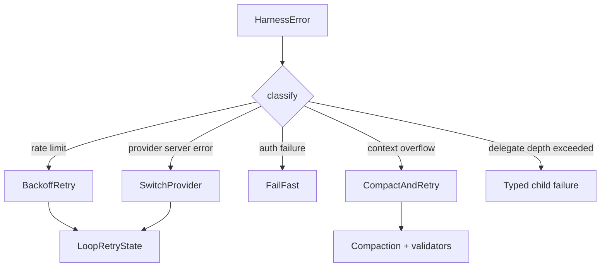
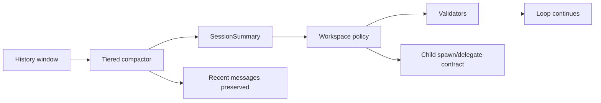
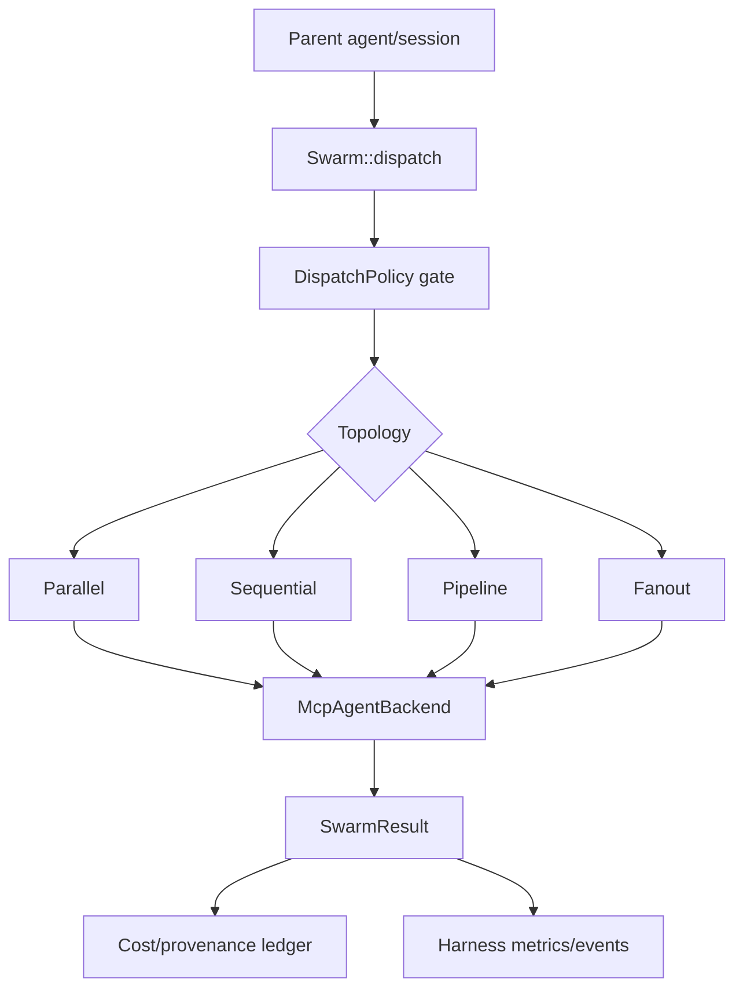

# octos 源码逐章审查：剩余更新与图表候选

> Source baseline: `../octos` HEAD `0eec0286`, clean worktree, workspace version `0.1.1`.
> Book baseline: `octos-book` `main` after commits `46c4d98`, `262c7c9`, `5fee1de`.
> Method: compare current Chinese/English book chapters against source modules and tests in `../octos`; focus on accuracy and depth, not code/word-count ratio.

## 1. 审查结论

已经同步过的内容包括 Serve 默认端口 `50080`、`octos mcp-serve`、UI Protocol capability gating、多租户子账号继承、Plugin `risk/env_allowlist/concurrency_class`、Profile `config.llm` schema、Ch11 的 `TaskSupervisor` 概念，以及中英文 Ch1/Ch9/Ch13/Ch14/Appendix C 的主线更新。

剩余需要补强的不是“新增小事实”，而是几个已经成为 octos 主干设计的子系统：

| 优先级 | 章节 | 缺口 | 源码证据 |
|---|---|---|---|
| P0 | Ch5 Agent Loop | 缺 `HarnessError` taxonomy、retry bucket、`CompactAndRetry`、持久化 retry state 与 `DelegateTool` 的关系 | `crates/octos-agent/src/harness_errors.rs:93`, `crates/octos-agent/src/agent/loop_state.rs`, `crates/octos-agent/tests/harness_errors.rs`, `crates/octos-agent/tests/retry_state_persistence.rs` |
| P0 | Ch8 Context | 缺 contract-gated / tiered compaction、typed `SessionSummary`、validator preservation、父子任务契约传播 | `crates/octos-agent/src/summarizer.rs`, `crates/octos-agent/src/workspace_git.rs`, `crates/octos-agent/src/validators.rs`, `crates/octos-agent/tests/tiered_compaction_loop.rs` |
| P0 | Ch11 Concurrency | 现有 `TaskSupervisor` 只是第一层，缺 `octos-swarm`、topology、`DispatchPolicy`、cost/provenance ledger、child-session lifecycle metrics | `crates/octos-swarm/src/topology.rs:98`, `crates/octos-swarm/src/gate.rs:68`, `crates/octos-swarm/src/gate.rs:185`, `crates/octos-agent/src/cost_ledger.rs`, `crates/octos-cli/src/api/metrics.rs` |
| P0 | Ch12 Pipeline | 缺 workflow family registry、production `HostContext`、run dir / typed events、hardware lifecycle 与 checkpoint/deadline 的关系 | `crates/octos-cli/src/workflow_families/registry.rs:12`, `crates/octos-pipeline/src/host_context.rs`, `crates/octos-pipeline/src/run_dir.rs`, `crates/octos-plugin/src/lifecycle.rs` |
| P1 | Ch6 Tool System | 缺同步 `DelegateTool`、MCP agent backend、robot tool groups；旧工具速查还需确保不再提 `take_photo` | `crates/octos-agent/src/tools/delegate.rs:55`, `crates/octos-agent/src/tools/delegate.rs:236`, `crates/octos-agent/src/tools/mcp_agent.rs`, `crates/octos-agent/src/tools/robot_groups.rs` |
| P1 | Ch7 Security | 需要把 AppContainer / per-profile sandbox 与 swarm dispatch gate、robot `SafetyTier` 统一进安全边界，而不是各自孤立描述 | `crates/octos-agent/src/permissions.rs:17`, `crates/octos-agent/src/tools/robot_groups.rs`, `crates/octos-swarm/src/gate.rs:68`, `crates/octos-cli/src/commands/serve.rs:1150` |
| P1 | Ch10 Bus | 缺 Matrix swarm supervisor、WeCom Group Robot WebSocket、topic-aware replay / dedup 的新频道能力 | `crates/octos-bus/src/matrix_channel.rs`, `crates/octos-bus/tests/matrix_swarm_supervisor.rs`, `crates/octos-bus/src/wecom_channel.rs`, `crates/octos-bus/src/wecom_bot_channel.rs`, `crates/octos-bus/src/dedup.rs` |
| P1 | Ch14 Production | 已有 UI Protocol 和多租户，但还可补 Setup Wizard / admin token / SMTP secret / operator metrics / cloud scripts 的生产闭环图 | `crates/octos-cli/src/admin_token_store.rs:56`, `crates/octos-cli/src/api/admin_setup.rs:4`, `crates/octos-cli/src/smtp_secret_store.rs:1`, `dashboard/src/components/BootstrapGate.tsx:8` |
| P2 | Ch1 + Appendix A | Crate 拓扑仍需按当前 workspace 收敛：`octos-swarm`、14 个 app-skills、1 个 platform-skill、删除 `octos-dora-mcp` | `Cargo.toml` workspace members |
| P2 | Ch3 + Appendix C | 需要补 credential pool、content classifier、adaptive routing、pipeline-guard 读取 `config.llm.primary/fallbacks` 的最新 schema | `crates/octos-llm/src/credential_pool.rs`, `crates/octos-llm/src/content_classifier.rs`, `crates/app-skills/pipeline-guard` |
| P2 | Appendix B/D/E | 工具速查、feature flags、构建贡献说明需要跟随当前 crate/feature/skill 二进制变化 | `crates/octos-agent/src/tools/mod.rs`, `crates/octos-cli/Cargo.toml`, `Cargo.toml` |

## 2. 逐章审查

### Ch1 为什么 Rust？为什么 Agent OS？

当前章节已经提到 `app-skills + platform-skills`，但数字仍旧偏旧：源码 workspace 已经包含 14 个 `crates/app-skills/*` 成员、1 个 `platform-skills/voice`，并新增 `octos-swarm`。建议把“11 个核心 crate”改成“核心库 crate + app/platform skill 二进制 + swarm 编排 crate”的分层表，不再把所有二进制 skill 混进核心 crate 数量。

图表建议：更新“Crate 拓扑图”，把 `octos-swarm` 放在 `octos-agent` / `octos-cli` 之间的编排层，把 `app-skills` 和 `platform-skills` 作为扩展执行层。

### Ch2 octos-core

本章不是最大缺口，但 UI Protocol 类型已经进入 `octos-core`，尤其是 capability negotiation、`SessionOpened.capabilities`、`is_snapshot_projection`、`TurnInterruptResult.ack_timeout`。Ch14 已经介绍 UI Protocol，Ch2 可以补一小节说明：`octos-core` 不只是基础消息类型，还承载前后端协议 schema 的稳定性边界。

图表建议：新增“domain type vs protocol type”的二维图：`Task/Message/Profile` 是领域模型，`UiProtocol*` 是跨进程/跨前端的 API contract。

### Ch3 octos-llm

本章需要增加深度的点不是 provider 列表，而是路由策略：credential pool 的持久化冷却、content-classified routing、adaptive cost-aware QoS。近期 `pipeline-guard` 修复也说明配置读取已经转向 `config.llm.primary/fallbacks` schema，Appendix C 已更新 schema，但 Ch3 可解释为什么这个 schema 对 fallback 与 guard 一致性重要。

图表建议：补“model selection pipeline”：profile config -> content classifier -> credential pool -> adaptive router -> provider request -> metrics feedback。

### Ch4 octos-memory

没有发现必须重写的主线。可在后续核对 Episode 写入时机、summary 与 memory 的边界，避免读者把 `SessionSummary` 误解为长期记忆。若篇幅有限，本章可以不动。

### Ch5 Agent Loop

这是当前剩余最大准确性缺口。源码已经把失败处理从“错误后重试”升级为 typed taxonomy + dispatch action：

- `HarnessError` 在 `crates/octos-agent/src/harness_errors.rs:93` 定义结构化错误类别。
- retry bucket / loop state 在 `crates/octos-agent/src/agent/loop_state.rs` 中维护，并有 `tests/retry_state_persistence.rs` 验证跨 dispatch 的持久化。
- loop runner 中存在 `CompactAndRetry` 路径，和 Ch8 的 compaction contract 绑定。
- `DelegateTool` 的 depth guard 错误属于 agent loop 要能识别和收敛的失败类型。

建议增加一节“错误不是字符串：HarnessError 到 LoopAction 的路由”，并把 `rate_limit`、`context_overflow`、`auth_failure`、`provider_server_error`、`delegate_depth_exceeded` 分别映射到 backoff、compact、fail-fast、provider switch、typed child failure。

图表建议：

### Ch6 工具系统

需要把工具系统从“内置工具 catalog”推进到“带策略和契约的执行面”：

- `DelegateTool` 是同步、阻塞、带 `MAX_DEPTH = 2` 的子任务工具（`crates/octos-agent/src/tools/delegate.rs:55`, `:236`），不是 `spawn_only` 的别名。
- delegated child policy 会禁用再次 delegation、background spawning、给用户发文件/消息等能力，避免递归失控。
- `mcp_agent` backend 让 `SpawnTool` / swarm dispatch 可以把 MCP agent 当作后端。
- `robot_groups` 把机器人能力建模为 tool policy group，而不是散落在单个工具上。

图表建议：工具执行链路图：LLM tool call -> `ToolRegistry::execute_with_context` -> policy / approval / sandbox / env -> tool backend。

### Ch7 安全

本章已经补过 AppContainer，但安全模型仍可深化：同一个 `ToolPolicy` 思想现在同时覆盖本地工具、机器人安全等级和 swarm dispatch gate。`SafetyTier` 在 `crates/octos-agent/src/permissions.rs:17` 定义，`DispatchPolicy` 在 `crates/octos-swarm/src/gate.rs:68` 定义，Serve 在 `crates/octos-cli/src/commands/serve.rs:1150` 将 agent gates 注入 swarm。

建议补一节“同一策略面覆盖 native tool 和 swarm backend”。重点说明 `DispatchPolicy::from_agent_gates` 不是 deny-all，而是把 operator-configured tool policy 与 injection env denylist 投射到 swarm dispatch，避免 MCP/CLI 后端绕过 native execution 的安全边界。

图表建议：安全边界同心圆：profile config -> tool policy -> approval -> sandbox/env -> backend transport。

### Ch8 上下文管理

本章需要重写一部分核心论证。现在上下文压缩不是简单“摘要旧消息”，而是 contract-gated compaction：

- `summarizer.rs` 提供 typed `SessionSummary` 和 LLM iterative summarizer。
- `compaction_tiered.rs` / `tests/tiered_compaction_loop.rs` 表明 loop 已接入三层 compaction。
- `workspace_git.rs`、`validators.rs` 与 child `spawn/delegate` 的契约传播一起保证压缩后仍保留 validator / workspace policy 约束。

建议把“压缩策略”拆成三层：保留最近交互、将历史折叠为 typed summary、用 validator / workspace contract 防止压缩丢失任务约束。

图表建议：

### Ch9 扩展机制

Ch9 已经同步了 plugin manifest 风险字段、env allowlist、concurrency class 和 Harness 主线，但后续可以再加深两个点：

- starter app skills 不只是示例，而是 harness contract 的最小实现模板。
- ABI versioning / skill compatibility gate / validator runner 共同组成“扩展升级的兼容性边界”。

图表建议：Harness 兼容性门禁图：manifest -> ABI schema -> validator runner -> dashboard/operator surface。

### Ch10 octos-bus

本章还停留在多频道统一抽象，缺少“频道也能成为 supervisor UI”的新角色。Matrix swarm supervisor tests、WeCom group robot channel、topic-aware replay / dedup 都说明 bus 不只是消息转发层，已经承担编排观察、审批、事件重放的控制面。

建议新增一节“从消息通道到 supervisor channel”，把 Matrix、WeCom、background event replay 放在同一个控制流里讲：external event -> bus dedup -> session actor / swarm supervisor -> approval / task events -> channel response。

图表建议：频道事件控制流 sequence diagram，尤其标出 dedup 和 task/swarms events 的分叉。

### Ch11 并发

Ch11 已补 `TaskSupervisor`，但还没有覆盖当前主干里最重要的新并发抽象：`octos-swarm`。源码 `SwarmTopology` 支持 `parallel`、`sequential`、`pipeline`、`fanout`（`crates/octos-swarm/src/topology.rs:98`），`MAX_CONTRACTS_PER_DISPATCH = 128`，并通过 redb-backed dispatch state 持久化状态。`DispatchPolicy` 在 dispatch 前执行 gate，并将失败作为 `SubtaskOutcome` 进入 metrics 和 typed harness events。

建议新增大节“Swarm：从 spawn 到拓扑化 dispatch”。重点区分：

- `join_all`：单轮工具并发。
- `spawn/spawn_only`：后台子 Agent。
- `delegate_task`：同步子任务。
- `octos-swarm`：跨 backend 的拓扑化 contract dispatch。

图表建议：

### Ch12 Pipeline

本章需要跟当前 workflow runtime 对齐。`WORKFLOW_FAMILIES` 当前只有四类：`deep_research`、`research_podcast`、`slides`、`site`（`crates/octos-cli/src/workflow_families/registry.rs:12`），不是泛泛的“任意 pipeline 模板”。`octos-pipeline/src/host_context.rs` 表明生产 pipeline 需要 host context 接入 task supervisor 和 cost accountant；`run_dir.rs` 和 `events.rs` 则是可恢复、可观测执行的基础。

建议增加“workflow family registry”小节，并把 DOT pipeline 与 app-level workflow family 区分开：前者是图执行引擎，后者是产品化工作流入口。

图表建议：pipeline production path：workflow family -> plan request -> graph/runtime -> HostContext -> run_dir/events -> dashboard/API。

### Ch13 运行模式

Ch13 已经覆盖四种运行模式、`mcp-serve`、Serve `50080`、UI Protocol。剩余可补的是 Setup Wizard 与 deployment modes 如何影响运行模式选择：`BootstrapGate` 会在未完成初始化时拦截 dashboard；admin setup routes 写入 setup state、SMTP secret 和 deployment mode。

图表建议：首次启动流程图：`octos serve` -> auth/bootstrap gate -> rotate admin token -> LLM provider -> SMTP -> deployment mode -> profile/channel。

### Ch14 生产化

Ch14 已经补 UI Protocol 与多租户，但生产闭环还可加一张“控制面总图”：admin token、setup state、SMTP secret、operator dashboard、metrics、cloud deployment scripts。源码证据包括 `AdminTokenStore`（`crates/octos-cli/src/admin_token_store.rs:56`）、`admin_setup` routes、`SmtpSecretStore`（`crates/octos-cli/src/smtp_secret_store.rs:1`）和 dashboard `BootstrapGate`。

建议把多租户子账号内容和 Setup Wizard 内容连接起来：前者描述运行后的权限/继承边界，后者描述首次配置和云/租户部署的安全入口。

图表建议：生产控制面图：admin UI -> setup/admin APIs -> stores (`admin_token.json`, `setup_state`, `smtp_secret.json`) -> profile config -> gateway/serve/process manager。

## 3. 附录审查

### Appendix A Crate Graph

需要更新为 workspace `0.1.1` 当前成员：

- 核心库：`octos-core`、`octos-memory`、`octos-llm`、`octos-agent`、`octos-bus`、`octos-cli`、`octos-pipeline`、`octos-plugin`、`octos-sandbox`、`octos-swarm`。
- app skills：`news`、`deep-search`、`deep-crawl`、`send-email`、`account-manager`、`time`、`weather`、`wechat-bridge`、`pipeline-guard`、`skill-evolve`、`harness-starter-generic`、`harness-starter-report`、`harness-starter-audio`、`harness-starter-coding`。
- platform skills：`voice`。

### Appendix B Tool Reference

需要核对当前 `tools/mod.rs` 导出，重点确认：

- 不再列 `take_photo`。
- 增加 `delegate_task` / `DelegateTool`。
- 增加 MCP agent backend 相关说明，但不要把 backend 误写成普通用户工具。
- 增加 robot group / `SafetyTier` 的 policy 语义。

### Appendix C Config Reference

已更新 `config.llm` 和 Serve port，但还可以补：

- `admin_token.json` 不是明文 token，是 hash store。
- `smtp_secret.json` 优先于 SMTP env var。
- setup state / deployment mode 影响 bootstrap 与 dashboard。
- swarm dispatch policy 继承 workspace tool policy 与 injection env denylist。
- credential pool / content classifier / QoS routing 的配置入口。

### Appendix D Feature Flags

需要用当前 `Cargo.toml` 重新生成，不应手工沿用 v0.1.0 列表。尤其要确认 API、dashboard/static bundle、MCP server、platform skill、robotics/swarm 相关 feature 是否有显式 flag，还是已经变成默认 workspace 成员。

### Appendix E Contributing

需要补三点：

- dashboard 静态资源是 ephemeral bundle，不应假设构建产物入库。
- 新增 app/platform skills 后，贡献者要知道 skill binary 的测试/兼容性 gate。
- 若加入 `octos-swarm` 或 workflow family，需要同步 typed events、metrics、policy gate，而不是只加 dispatcher 代码。

## 4. 推荐执行顺序

1. Ch5 + Ch8：先修运行时内核和上下文压缩，否则后续工具、swarm、pipeline 的描述没有可靠基础。
2. Ch11 + Ch12：补 `octos-swarm` 和 workflow family，这是当前主干最影响架构图的部分。
3. Ch6 + Ch7：补 `DelegateTool`、robot groups、swarm dispatch gate 的策略面。
4. Ch10 + Ch14：补 supervisor channel、Setup Wizard、admin token / SMTP secret / operator metrics 的生产闭环。
5. Ch1 + Appendices：最后统一 crate graph、tool reference、feature flags、config reference，避免早改后又被章节更新推翻。

## 5. 图表 Backlog

| 图表 | 放置位置 | 价值 |
|---|---|---|
| HarnessError -> LoopAction routing | Ch5 | 解释为什么错误处理是 typed control flow，不是字符串匹配 |
| Contract-gated tiered compaction | Ch8 | 解释 summary、validator、workspace policy 如何共同防止压缩丢约束 |
| Tool execution policy chain | Ch6/Ch7 | 把 tool policy、approval、sandbox、env gate 放到同一张图 |
| Swarm topology dispatch | Ch11 | 区分 `join_all`、`spawn`、`delegate`、`swarm` 四种并发层 |
| Workflow family production path | Ch12 | 区分 DOT engine 与产品化 workflow family |
| Channel supervisor control flow | Ch10 | 展示 Matrix/WeCom 从消息通道升级为监督控制面 |
| Setup Wizard bootstrap path | Ch13/Ch14 | 连接首次启动、admin token、SMTP、deployment mode 和 profile 创建 |
| Current crate graph | Ch1/Appendix A | 防止书中架构图落后于 workspace `0.1.1` |

## 6. 完成标准建议

后续真正修改书稿时，建议每一批按以下标准验收：

- 中文 `chapters/` 与 `book/src/` 同步。
- 英文 `book-en/src/` 同步，除非明确只做中文版。
- 每个新增事实都带 `../octos` 源码文件引用，关键行为带测试引用。
- 每个新增图表至少对应一个源码入口或测试文件，不画纯概念图。
- 修改后运行 `mdbook build book` 与 `mdbook build book-en`，再检查 `rg` 中旧术语和旧端口残留。
