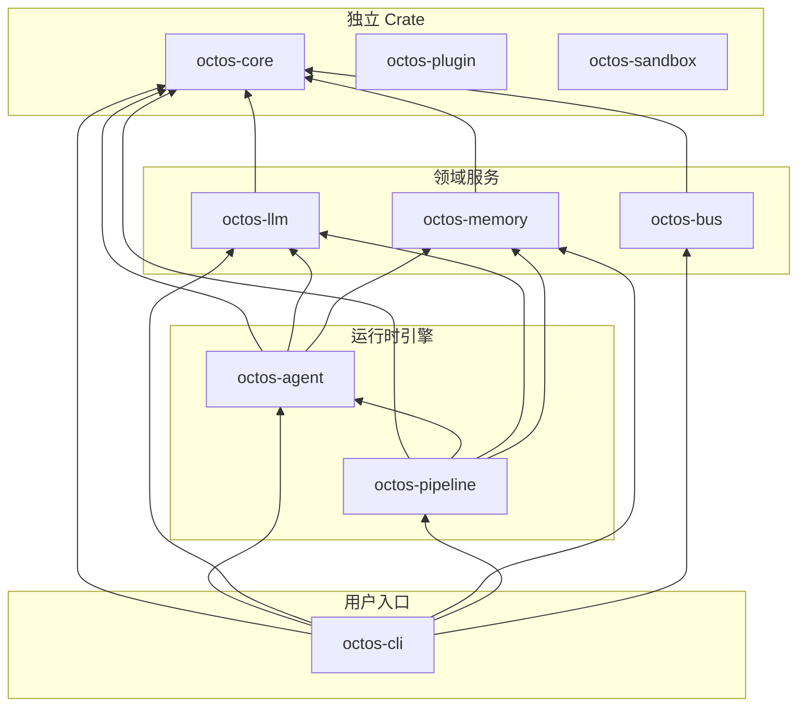

# 附录 A：octos 完整 Crate 依赖图

## 内部 Crate 依赖拓扑

## 各 Crate 关键外部依赖

| Crate | 关键依赖 | 版本 | 用途 |
|-------|---------|------|------|
| **octos-core** | serde, serde_json, chrono, uuid, eyre | 1.x, 1.x, 0.4, 1.x, 0.6 | 序列化、时间、ID、错误 |
| **octos-llm** | reqwest, async-trait, futures, hnsw_rs | 0.12, 0.1, 0.3, 0.3 | HTTP、异步 trait、流、向量索引 |
| **octos-memory** | redb, bincode, hnsw_rs | 2.x, 1.x, 0.3 | 嵌入式 DB、序列化、向量搜索 |
| **octos-agent** | tokio, lru, libc, glob, regex | 1.x, 0.16, 0.2, 0.3, 1.x | 异步运行时、缓存、系统调用、文件搜索 |
| **octos-bus** | teloxide*, serenity*, tokio-tungstenite* | 0.17, 0.12, 0.26 | Telegram/Discord/WebSocket（*feature-gated） |
| **octos-cli** | clap, axum*, tower-http*, rustyline | 4.x, 0.8, 0.6, 15.x | CLI 解析、Web 服务、readline |
| **octos-pipeline** | 继承自 octos-agent 依赖 | — | 无独立重依赖 |
| **octos-plugin** | serde, serde_json, eyre, which | 1.x, 1.x, 0.6, 7.x | 序列化、错误、可执行文件发现 |
| **octos-sandbox** | clap, eyre | 4.x, 0.6 | CLI 解析、错误（仅 Windows） |

*标注 `*` 的依赖通过 feature flags 按需引入。*

## Workspace 共享依赖

以下依赖在 `[workspace.dependencies]` 中统一定义，所有 crate 使用相同版本：

- **tokio 1.x**（full features）：异步运行时
- **serde 1.x**（derive）：序列化框架
- **eyre 0.6 / color-eyre 0.6**：错误处理
- **tracing 0.1 / tracing-subscriber 0.3**：结构化日志
- **reqwest 0.12**（rustls-tls）：HTTP 客户端（纯 Rust TLS）
