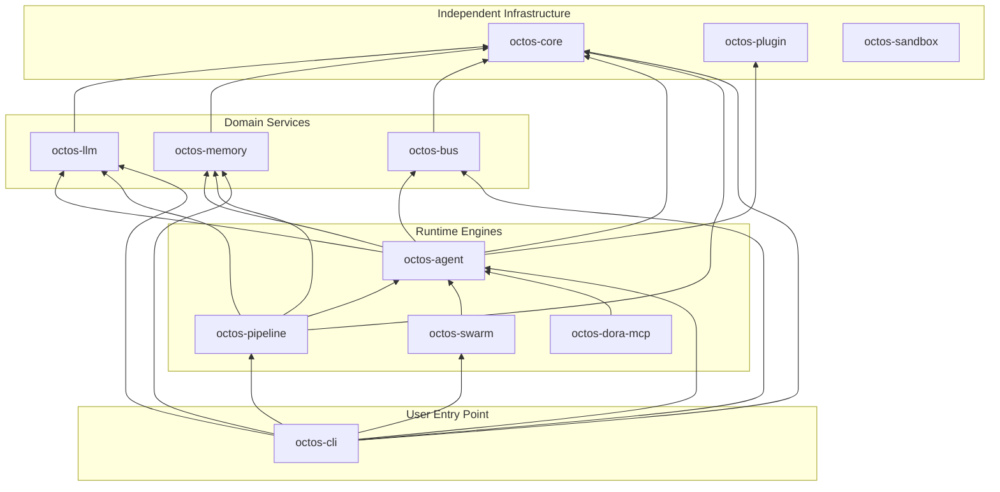

# Appendix A: Complete octos Crate Dependency Graph

This appendix reflects the current `../octos` main branch and uses the workspace `Cargo.toml` files as the source of truth. The graph expands the 11 `octos-*` core crates. `app-skills` and `platform-skills` are also workspace members, but they are capability binaries rather than core library crates, so they are not expanded in the core dependency graph.

## Internal Crate Dependency Topology

Arrow direction means "depends on." For example, `cli --> agent` means `octos-cli` depends on `octos-agent` in its `Cargo.toml`. `octos-sandbox` is a Windows AppContainer helper crate and is not directly depended on by other core crates today.

## Key External Dependencies by Crate

| Crate | Key Dependencies | Version | Purpose |
|-------|------------------|---------|---------|
| **octos-core** | serde, serde_json, chrono, uuid, eyre | 1.x, 1.x, 0.4, 1.x, 0.6 | Serialization, time, IDs, errors |
| **octos-llm** | reqwest, async-trait, futures, secrecy, redb, metrics | 0.12, 0.1, 0.3, 0.10, 2.x, 0.24 | HTTP, async traits, streaming, secrets, credential pool state, metrics |
| **octos-memory** | redb, hnsw_rs, bincode, tokio, uuid | 2.x, 0.3, 1.x, 1.x, 1.x | Embedded DB, vector search, serialization, async, IDs |
| **octos-bus** | tokio, lru, cron, subtle, aes/cbc, teloxide*, serenity*, axum* | 1.x, 0.16, 0.15, 2.x, 0.8/0.1, 0.17, 0.12, 0.8 | Async, cache, scheduling, constant-time compare, crypto, channel/API integrations |
| **octos-agent** | tokio, async-trait, reqwest, chromiumoxide, gix*, tree-sitter* | 1.x, 0.1, 0.12, 0.9, 0.79, 0.24 | Agent async runtime, tool HTTP, browser automation, Git/AST features |
| **octos-pipeline** | async-trait, tokio, futures, regex, glob | 0.1, 1.x, 0.3, 1.x, 0.3 | Handler abstraction, async execution, concurrency, pattern matching, file matching |
| **octos-swarm** | async-trait, redb, uuid, metrics, tokio | 0.1, 2.x, 1.x, 0.24, 1.x | Sub-agent orchestration, persistence, IDs, metrics, async |
| **octos-dora-mcp** | async-trait, tokio, serde, serde_json, eyre | 0.1, 1.x, 1.x, 1.x, 0.6 | Dora/MCP bridge, async, serialization, errors |
| **octos-cli** | clap, rustyline, axum*, tower-http*, rust-embed*, keyring, metrics-exporter-prometheus* | 4.x, 15.x, 0.8, 0.6, 8.x, 3.x, 0.16 | CLI, interactive input, Web/API, static assets, system credentials, Prometheus |
| **octos-plugin** | serde, serde_json, eyre, which, tokio, metrics | 1.x, 1.x, 0.6, 7.x, 1.x, 0.24 | Manifest parsing, errors, executable discovery, async, metrics |
| **octos-sandbox** | clap, eyre, rappct**, windows** | 4.x, 0.6, 0.13, 0.62 | CLI, errors, Windows AppContainer |

`*` marks feature-gated dependencies; `**` marks Windows-target-only dependencies.

## Workspace Shared Dependencies

These dependencies are centralized in `[workspace.dependencies]`, so crates using workspace dependencies share the same versions:

- **tokio 1.x** (full features): async runtime
- **serde 1.x** (derive) / **serde_json 1.x**: serialization
- **eyre 0.6 / color-eyre 0.6**: error handling
- **tracing 0.1 / tracing-subscriber 0.3**: structured logging
- **reqwest 0.12** (rustls-tls): HTTP client with pure Rust TLS
- **redb 2.x**: embedded persistence
- **axum 0.8 / tower-http 0.6**: optional Web/API entry points
