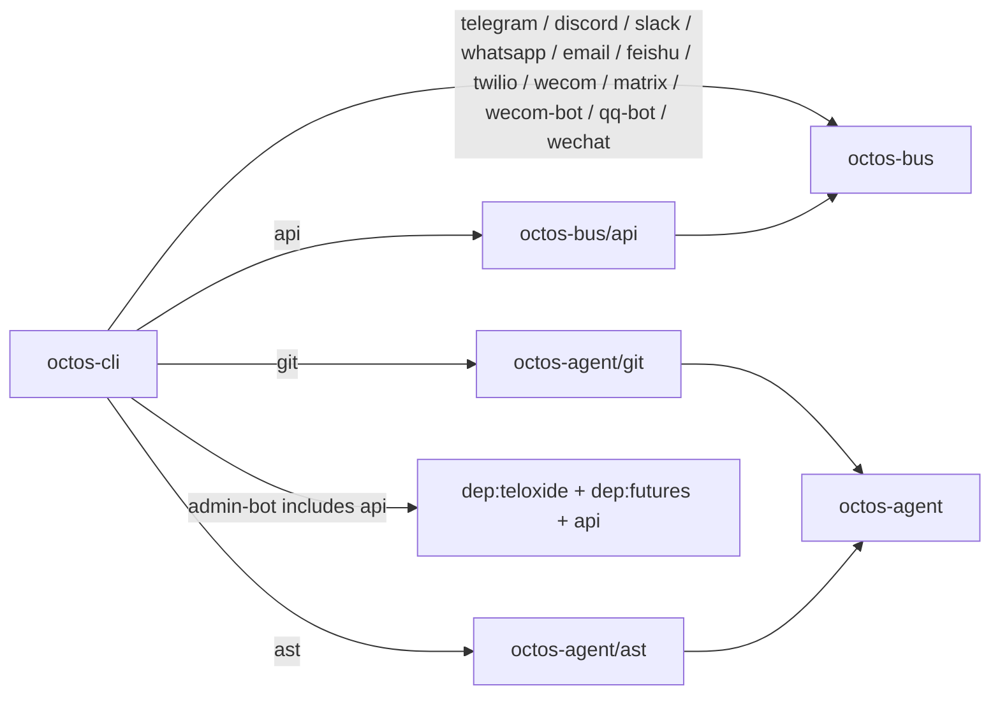

# Appendix D: Feature Flags Overview

This appendix reflects the current `../octos` main branch Cargo workspace. The source review covers the root `Cargo.toml` `members` list and the `[features]` sections in `octos-cli`, `octos-bus`, and `octos-agent`. The workspace follows a minimal-by-default strategy: `default = []`, and production builds explicitly select API, channel, admin bot, and optional tool capabilities.

## Feature Propagation Diagram



The diagram shows three layers:

1. `octos-cli` is the final binary entry point and forwards user-selected features to downstream crates.
2. `octos-bus` owns multi-channel integration; most channel features are CLI-to-bus forwarding switches.
3. `octos-agent` owns optional tool capabilities; `git` and `ast` are exposed to final builds through CLI features.

## octos-cli Feature Flags

| Feature | Enabled capability | Extra dependencies / downstream features | Enabled by default |
|---------|--------------------|------------------------------------------|--------------------|
| `default` | Minimal CLI build | — | Yes, empty |
| `api` | Web API, dashboard, SSE/WebSocket, monitoring, OTP login, Prometheus exporter, user/profile management | `dep:axum`, `dep:tower-http`, `dep:futures`, `dep:rust-embed`, `dep:metrics-exporter-prometheus`, `dep:lettre`, `dep:rand`, `dep:sysinfo`, `dep:subtle`, `octos-bus/api` | No |
| `admin-bot` | Admin bot; depends on API mode | `dep:teloxide`, `dep:futures`, `api` | No |
| `telegram` | Telegram channel integration | `octos-bus/telegram` | No |
| `discord` | Discord channel integration | `octos-bus/discord` | No |
| `slack` | Slack channel integration | `octos-bus/slack` | No |
| `whatsapp` | WhatsApp channel integration | `octos-bus/whatsapp` | No |
| `email` | Email channel integration | `octos-bus/email` | No |
| `feishu` | Feishu channel integration | `octos-bus/feishu` | No |
| `twilio` | Twilio channel integration | `octos-bus/twilio` | No |
| `wecom` | WeCom callback channel | `octos-bus/wecom` | No |
| `matrix` | Matrix channel integration | `octos-bus/matrix` | No |
| `wecom-bot` | WeCom Bot WebSocket channel | `octos-bus/wecom-bot` | No |
| `qq-bot` | QQ Bot WebSocket channel | `octos-bus/qq-bot` | No |
| `wechat` | WeChat WebSocket bridge channel | `octos-bus/wechat` | No |
| `git` | Agent Git tool capability | `octos-agent/git` | No |
| `ast` | Agent AST code-structure analysis capability | `octos-agent/ast` | No |

## octos-bus Feature Flags

| Feature | Enabled capability | Extra dependencies | Enabled by default |
|---------|--------------------|--------------------|--------------------|
| `default` | Minimal bus build | — | Yes, empty |
| `api` | Bus types required by API/SSE/WebSocket ingress | `axum` | No |
| `telegram` | Telegram channel implementation | `teloxide` | No |
| `discord` | Discord channel implementation | `serenity` | No |
| `slack` | Slack WebSocket channel implementation | `tokio-tungstenite` | No |
| `whatsapp` | WhatsApp WebSocket channel implementation | `tokio-tungstenite` | No |
| `feishu` | Feishu channel and callback ingress | `tokio-tungstenite`, `axum`, `rustls`, `rustls-native-certs` | No |
| `twilio` | Twilio webhook/API channel | `axum` | No |
| `wecom` | WeCom webhook/API channel | `axum` | No |
| `matrix` | Matrix webhook/API channel | `axum` | No |
| `wecom-bot` | WeCom Bot WebSocket channel | `tokio-tungstenite`, `rustls`, `rustls-native-certs` | No |
| `qq-bot` | QQ Bot WebSocket channel | `tokio-tungstenite`, `rustls`, `rustls-native-certs` | No |
| `wechat` | WeChat bridge WebSocket channel | `tokio-tungstenite` | No |
| `email` | Email channel with IMAP/SMTP and message parsing | `async-imap`, `tokio-rustls`, `rustls`, `webpki-roots`, `lettre`, `mailparse` | No |

## octos-agent Feature Flags

| Feature | Enabled capability | Extra dependencies | Enabled by default |
|---------|--------------------|--------------------|--------------------|
| `git` | Git operations and diff support | `dep:gix`, `dep:similar` | No |
| `ast` | AST code-structure analysis for Rust/Python/JavaScript/TypeScript parsers | `dep:tree-sitter`, `dep:tree-sitter-rust`, `dep:tree-sitter-python`, `dep:tree-sitter-javascript`, `dep:tree-sitter-typescript` | No |

`octos-agent` currently has no explicit `default = []` line. That still means no default feature is declared; `git` and `ast` compile only when enabled by an upstream build.

## Crates Without `[features]`

These crates currently define no Cargo feature flags. They either compile as core libraries, or maintain their dependency boundary as standalone app-skill / platform-skill binaries:

| Category | Crates |
|----------|--------|
| Core libraries | `octos-core`, `octos-memory`, `octos-llm`, `octos-pipeline`, `octos-plugin`, `octos-swarm`, `octos-dora-mcp` |
| Platform / sandbox | `octos-sandbox`, `platform-skills/voice` |
| App skills | `news`, `deep-search`, `deep-crawl`, `send-email`, `account-manager`, `time`, `weather`, `wechat-bridge`, `pipeline-guard`, `skill-evolve` |
| Harness starter skills | `harness-starter-generic`, `harness-starter-report`, `harness-starter-audio`, `harness-starter-coding` |

## Build Examples

```bash
# Minimal CLI: no API, channel integration, Git tool, or AST tool
cargo build -p octos-cli --release

# CLI + Web API / Dashboard
cargo build -p octos-cli --release --features api

# API + admin bot
cargo build -p octos-cli --release --features admin-bot

# Common gateway multi-channel build
cargo build -p octos-cli --release --features "api,telegram,slack,email,feishu,wecom-bot,qq-bot,wechat"

# Full developer build: API, all channels, Git/AST tools
cargo build -p octos-cli --release --all-features
```

## Design Principles

Feature flags in this workspace are dependency-tree cut points, not just feature-category labels:

1. Channel integrations live in `octos-bus`; the CLI mostly forwards features and avoids knowing every channel's low-level dependencies.
2. `api` is a server capability switch. It enables more than `axum`: dashboard embedding, Prometheus exporter, OTP/email dependencies, and the bus API layer come with it.
3. `admin-bot` explicitly depends on `api` because it is an admin-plane entry point, not a standalone chat channel.
4. `git` / `ast` live in `octos-agent` and are exposed through CLI features, keeping heavy Git and tree-sitter dependencies out of the default build.
5. App-skill binaries do not use Cargo features; their distribution boundary is the workspace member plus skill manifest, not mixed compilation through the main CLI feature set.
