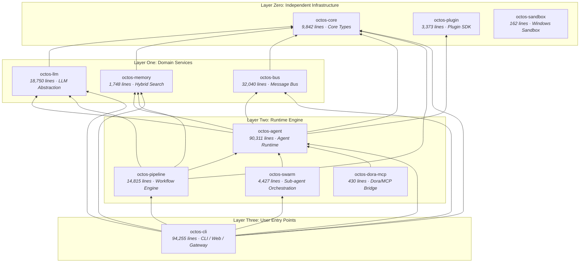

# Chapter 1: Why Rust? Why Agent OS?

> **Positioning**: This is the opening chapter of the book, answering a fundamental question -- why build a multi-tenant AI Agent platform in Rust? Prerequisites: None. Applicable to any reader who wants to understand why the octos project exists, whether you are a Rust beginner (Reader A), an experienced Rust developer (Reader B), or an AI application developer coming from the Python/Go ecosystem (Reader C).

When you first open the octos code repository and see nearly 280,000 lines of Rust, 400+ Rust source files, and a Cargo workspace composed of 11 octos-* core crates, 14 app skills, and 1 platform skill, a question inevitably arises: Why not Python? Aren't LangChain and AutoGen mature enough? Why not Go? Isn't its concurrency model simpler?

This is not a question about language preference. When you push "AI Agent" from a single-user toy to a multi-tenant production platform, you face a set of intertwined engineering constraints: security isolation, concurrency control, and performance budgets. Any one of these constraints is not hard to solve on its own, but when all three appear simultaneously in a single system, language selection is no longer a matter of taste -- it becomes an architectural decision.

This chapter starts from the problem space, explains why these three challenges are so difficult, then argues why Rust is currently the best-suited language for this set of constraints, and finally lays out the octos workspace topology, establishing a global map for the remaining 13 chapters.

---

## 1.1 Problem Space: Three Challenges of a Multi-Tenant AI Agent Platform

To understand octos's design decisions, you first need to understand the problems it tries to solve. octos is not a chatbot framework -- it is a multi-tenant AI Agent operating system that needs to simultaneously serve multiple users and multiple Agent instances, where each Agent can invoke tools with side effects such as file system operations, Shell commands, and network requests.

### 1.1.1 Challenge One: Security Isolation

Imagine a scenario: Tenant A's Agent is hit by a prompt injection attack, and the malicious instruction tries to read Tenant B's session history, or execute `rm -rf /` to destroy the host machine. In a multi-tenant environment, this is not a theoretical risk but an everyday threat.

Security isolation for AI Agents is more complex than traditional web services, for three reasons:

1. **Tool invocation is a core capability of Agents.** Agents don't just generate text -- they execute Shell commands, read and write files, and make network requests. Every tool invocation is a potential attack surface. octos's default tool registry includes built-in Shell/File/Web/Browser tools; enabling `git` / `ast` features or entering Gateway/Serve runtime paths adds memory, model switching, research, and administration tools (`../octos/crates/octos-agent/src/tools/registry.rs`; `../octos/crates/octos-cli/src/commands/gateway/gateway_runtime.rs`). Each tool class needs an independent security policy.

2. **Prompt injection is a new attack vector.** Unlike traditional SQL injection, prompt injection occurs at the natural language level, making it harder to intercept with regular expressions or WAF rules. Attackers can embed instructions in seemingly harmless documents, luring the Agent into performing unauthorized operations.

3. **Isolation granularity requires fine-grained control.** Different tenants need different permission boundaries: some allow access to Git repositories, some allow only read-only file operations, and some require full sandbox isolation. A one-size-fits-all isolation policy is either too loose (security risk) or too tight (functionality constrained).

octos's approach is defense in depth -- from eliminating memory safety vulnerabilities at the Rust language level, to providing process-level isolation through three sandbox backends (Linux bwrap / macOS sandbox-exec / Docker), to implementing fine-grained permission control through a tool-level deny-wins policy engine, building multiple layers of security barriers (see Chapter 7 for details).

Here's a concrete example: when an Agent executes a Shell command, octos's `ShellTool` first checks through `SafePolicy` whether the command is on the dangerous command blacklist (such as `rm -rf /`, `dd`, `mkfs`, fork bombs, etc.), then submits the command for execution in a sandbox environment. Even if prompt injection successfully induces the LLM to generate a malicious command, these two lines of defense can still intercept it. The sandbox implementation itself relies on Rust's type system to ensure resource handles don't leak -- file descriptors are automatically closed on `Drop`, avoiding the resource leak problems common in C/C++.

### 1.1.2 Challenge Two: Concurrency Control

A production-grade Agent platform needs to handle a large number of concurrent requests simultaneously. Consider the following scenario:

- 10 users chatting with their respective Agents simultaneously
- Each Agent may invoke 3-5 tools in parallel during a single iteration
- Each tool invocation may involve async HTTP requests, file I/O, and subprocess management
- Background Cron tasks and Heartbeat timers trigger new Agent sessions

This means hundreds of async tasks may exist simultaneously in the system. Concurrency itself is not the problem -- the problem is correctness under concurrency:

- **Session-level serialization**: Messages from the same user must be processed in order; two messages cannot modify the same session state simultaneously. Serve/API paths converge session state into shared managers protected by `Arc<tokio::sync::Mutex<_>>`, preventing concurrent state stomping (`../octos/crates/octos-cli/src/commands/serve.rs`).
- **Tool-level parallelism**: Within a single Agent iteration, multiple unrelated tool invocations should execute in parallel to reduce latency. The current implementation aggregates tool task handles with `futures::future::join_all` and wraps execution with `tokio::time::timeout` (`../octos/crates/octos-agent/src/agent/execution.rs`).
- **Resource throttling**: Unlimited concurrency will exhaust system resources. octos uses `tokio::sync::Semaphore` to limit concurrent sessions; defaults live in configuration and Gateway instantiates the semaphore during startup (`../octos/crates/octos-cli/src/config.rs`; `../octos/crates/octos-cli/src/commands/gateway/gateway_runtime.rs`).
- **Graceful shutdown**: When receiving SIGTERM/CTRL-C, you cannot brutally kill ongoing Agent conversations. octos uses an `AtomicBool` shutdown flag: Gateway writes it on the signal path, and the Agent Loop reads it from budget checks and streaming paths so in-progress conversations can finish naturally (`../octos/crates/octos-cli/src/commands/gateway/gateway_runtime.rs`; `../octos/crates/octos-agent/src/agent/budget.rs`; `../octos/crates/octos-agent/src/agent/streaming.rs`).

Python can achieve CPU parallelism through `multiprocessing` or `concurrent.futures.ProcessPoolExecutor`, but the serialization overhead of inter-process communication makes it unsuitable for the fine-grained shared-state concurrency patterns described above. Go's goroutine model can implement these patterns, but data races can only be detected through the `-race` runtime detector -- although Go's race detector, based on the happens-before algorithm, is quite effective in practice, it fundamentally depends on test coverage and cannot provide compile-time completeness guarantees. Rust's `Send`/`Sync` traits eliminate entire classes of data races at compile time (see Chapter 11 for details).

### 1.1.3 Challenge Three: Performance Budget

The primary latency bottleneck for AI Agents is LLM API calls (typically 1-10 seconds), which leads many people to believe that Agent framework performance is irrelevant. This is a dangerous misconception.

**First, latency is cumulative.** A single Agent execution may include up to 50 iterations (octos's default limit), with each iteration involving message construction, tool invocation, and context compaction. If the framework adds 50ms of overhead per iteration, 50 iterations amounts to 2.5 seconds -- for streaming interaction scenarios, this is user-perceptible latency.

**Second, memory is a hard constraint for multi-tenancy.** Each Agent session needs to maintain conversation history, tool state, and context window. If each session uses 100MB of memory (not uncommon in Python applications), 10 concurrent sessions is 1GB, and 100 is 10GB. octos's core data structures are designed for zero-copy and minimal allocation -- for example, the `truncate_utf8` function (`../octos/crates/octos-core/src/utils.rs`) achieves safe truncation through UTF-8 character boundary detection, avoiding unnecessary string copies.

**Finally, SSE streaming parsing requires sustained CPU efficiency.** LLM streaming responses are transmitted in Server-Sent Events (SSE) format, and the framework needs to parse and forward them within milliseconds of token arrival. In multi-tenant scenarios, the platform may maintain dozens of SSE connections simultaneously, each lasting tens of seconds. If the parser triggers heap allocation for every event, allocation pressure under high concurrency leads to latency spikes.

octos-llm's stateful SSE parser (`../octos/crates/octos-llm/src/sse.rs:5-72`) sets a 1MB buffer cap and uses an incremental parsing strategy: data is appended to a byte buffer and converted to UTF-8 only at complete event boundaries. This design avoids the cascading effect common in GC languages where "parsing triggers GC, GC blocks all connections," and it prevents CJK multi-byte characters from being corrupted by arbitrary chunk boundaries.

**An often-overlooked cost: context compaction.** When conversation history approaches the LLM's context window limit (typically 128K-200K tokens), octos needs to perform Context Compaction -- summarizing old messages to free up space (see Chapter 8 for details). This operation involves heavy string processing and token counting, which in GC languages easily produces large amounts of temporary objects and GC pressure. octos minimizes memory overhead on these hot paths through UTF-8-safe utility functions like `truncate_utf8` (`../octos/crates/octos-core/src/utils.rs`) and JSON size estimation paths in the tool registry (`../octos/crates/octos-agent/src/tools/registry.rs`).

---

## 1.2 Language Selection: Why Rust

With the problem space understood, we can compare candidate languages across three dimensions: safety, concurrency model, and runtime performance.

### 1.2.1 Safety Dimension

| Feature | Python | Go | Rust |
|---------|--------|----|------|
| Memory safety | GC-guaranteed, but C extensions unprotected | GC-guaranteed | Ownership system, compile-time guarantee |
| Type safety | Dynamic typing, runtime errors | Static typing, but `any` bypasses compile checks | Strong static typing + exhaustive enum matching |
| unsafe control | No such concept | `unsafe` package, but no compiler constraints | `unsafe` blocks + workspace-level `deny(unsafe_code)` |
| Dependency security | PyPI has no signature verification | go.sum checksums | Cargo checksums + `cargo-audit` |

octos sets `unsafe_code = "deny"` in the workspace root `Cargo.toml` (`../octos/Cargo.toml` under `[workspace.lints.rust]`), meaning the core crates and skill programs inherit the same safety baseline. This is not a lint suggestion but a compile-time hard constraint. Any code containing `unsafe` blocks cannot pass `cargo build`.

For an Agent platform that needs to execute Shell commands and read/write the file system, the significance of this constraint is that all interactions with the operating system go through the standard library's safe abstractions, eliminating the possibility of buffer overflows, use-after-free, and other memory safety vulnerabilities.

In comparison, Python's AI frameworks extensively use C extensions (numpy, tokenizers, etc.), and this C code is not protected by Python's GC. Go has memory safety guarantees, but there is no compiler-level global prohibition mechanism for `unsafe` package usage.

### 1.2.2 Concurrency Model Dimension

| Feature | Python | Go | Rust (Tokio) |
|---------|--------|----|--------------|
| Concurrency primitives | asyncio (single-threaded event loop) | goroutine + channel | async/await + Tokio multi-threaded runtime |
| CPU parallelism | GIL limitation, requires multiprocessing | Native support | Native support |
| Data race detection | None | `-race` runtime detection | `Send`/`Sync` compile-time guarantee |
| Structured concurrency | Limited (`TaskGroup`) | No built-in support | `tokio::select!` + `JoinSet` |

Rust's core advantage lies in the compile-time thread safety guarantees provided by the `Send` and `Sync` traits. Consider a typical scenario in octos: the Agent configuration (`AgentConfig`) needs to be shared across multiple async tasks. In Go, you might pass the configuration with a plain pointer, until one day a data race is triggered under high concurrency. Go's race detector, while based on the mature happens-before algorithm and effective at detecting races on actually executed code paths, is fundamentally a runtime tool -- only code paths covered by tests can be detected.

In Rust, if you try to share a non-`Send` type across threads, the compiler rejects it outright:

```rust
// Illustrative code -- Rc is not Send, this won't compile
let config = Rc::new(AgentConfig::default());
tokio::spawn(async move {
    let _ = config.max_iterations; // Compile error: Rc<AgentConfig> cannot be sent between threads safely
});

// octos's actual approach: use Arc for thread-safe sharing
let config = Arc::new(AgentConfig::default());
tokio::spawn(async move {
    let _ = config.max_iterations; // Compiles: Arc<AgentConfig> is Send + Sync
});
```

This means entire classes of concurrency bugs (data races, use-after-free across threads) are completely eliminated by the compiler in octos, rather than relying on test coverage and runtime detection.

### 1.2.3 Performance Dimension

| Metric | Python | Go | Rust |
|--------|--------|----|------|
| Startup time | 200-500ms (import overhead) | 10-50ms | 5-20ms |
| Memory footprint (typical Agent process) | 50-150MB | 15-30MB | 5-15MB |
| GC pauses | Predictable but frequent | Sub-millisecond (Go 1.19+) | No GC |

*The above figures are order-of-magnitude estimates for typical AI Agent scenarios; exact values vary by implementation, workload, and hardware. Python memory footprint includes overhead from common dependencies (requests, json, etc.).*

For an AI Agent platform, the most critical performance metric is not peak throughput but **tail latency (P99 latency)**. Since Go 1.19, GC pauses have been optimized to sub-millisecond levels (typically < 100 microseconds), which is good enough for most scenarios. But in multi-tenant, high-concurrency scenarios -- dozens of Agents simultaneously performing SSE streaming parsing and forwarding -- even sub-millisecond GC pauses accumulate and amplify in P99 tail latency. Rust has no GC; memory allocation and deallocation are fully deterministic, allowing octos to maintain stable and predictable tail latency in extreme scenarios.

From a memory efficiency perspective, no GC means no heap fragmentation issues and no need to reserve 2-3x heap space for GC use. For a multi-tenant system that needs to simultaneously maintain a large number of session states, this directly impacts the number of concurrent sessions a single machine can support.

### 1.2.4 The Cost of This Choice

To be fair, choosing Rust also comes with clear costs:

- **Learning curve**: Ownership and lifetimes are concepts unique to Rust, requiring 2-4 weeks of adaptation for new developers. This is not just a syntax issue -- understanding when to use `&`, `&mut`, `Box`, `Rc`, `Arc` requires building a new mental model.
- **Async programming complexity**: The interaction between Rust's async/await and the ownership system produces unique complexity. `Pin<Box<dyn Future>>`, lifetime annotations in async traits, and restrictions on holding references across `.await` points -- none of these exist in Python's or Go's async models. octos extensively uses the `async-trait` crate and `Arc` sharing to work around these limitations.
- **Compile time**: A clean build of octos takes several minutes; incremental compilation typically takes 10-30 seconds. Compared to Go's sub-second compilation, this is a noticeable efficiency loss during rapid iteration phases.
- **Ecosystem maturity**: The AI/ML ecosystem is far less rich than Python's. octos needs to implement BM25 search itself (`crates/octos-memory/`) and integrate the HNSW vector index (`hnsw_rs` crate), rather than simply calling scikit-learn or FAISS.
- **Development speed**: Rust code for equivalent functionality is typically 30-50% more lines than Python, mainly due to error handling (`Result`/`?` chains) and type annotations.

The octos team considers these costs worthwhile: for a multi-tenant production platform that needs to run long-term, runtime correctness and performance are more important than development convenience. The extra 30 seconds the compiler spends during development buys the absence of memory leaks, data races, and undefined behavior in production. And while the complexity of async programming raises the entry barrier, once code compiles, its concurrency correctness has compile-time guarantees -- which is crucial for a 24/7 Agent platform.

---

## 1.3 Workspace Topology: Layered Architecture of 11 Core Crates

octos uses a Cargo workspace to organize its code. In the current main branch, the main architecture consists of 11 octos-* core crates, plus 14 app skills and 1 platform skill that provide concrete capabilities. The workspace root `Cargo.toml` is the source of truth for this topology.

### 1.3.1 Four-Layer Architecture

**Layer Zero: Independent Infrastructure**

Crates in this layer have no internal dependencies and provide standalone foundational capabilities:

- **octos-core** (9,842 lines): Core type definitions -- `Task`, `Message`, `MessageRole`, `AgentId`, `SessionKey`, etc. This is the "domain language" of the entire system; all other crates share these type definitions. The zero-internal-dependency design ensures the stability of type definitions.
- **octos-plugin** (3,373 lines): Plugin SDK -- manifest.json parsing, plugin discovery (directory scanning + priority rules), triple-gate checks (binary/env/OS). It is now depended on by octos-agent, separating plugin discovery and gating from the main loop.
- **octos-sandbox** (162 lines): Windows platform AppContainer sandbox helper. Minimal implementation, platform-specific.

**Layer One: Domain Services**

Depends on octos-core, providing domain-specific capabilities:

- **octos-llm** (18,750 lines): LLM Provider abstraction layer. Unifies the calling interfaces of Anthropic (Claude), OpenAI (GPT-4), Google Gemini, Ollama, and other Providers. Includes a three-tier fault-tolerance chain (RetryProvider -> ProviderChain -> AdaptiveRouter), credential pools, content classification, SSE streaming parser, model catalog, and pricing calculation.
- **octos-memory** (1,748 lines): Hybrid search memory system. Implements BM25 full-text search and HNSW vector indexing based on the redb embedded database, supporting Episode Store (task completion summaries with a 7-day window memory).
- **octos-bus** (32,040 lines): Message bus and channel integration. Supports messaging channels including Telegram, Discord, Slack, WhatsApp, Feishu, Email, and more. Provides session management, multi-tenant account binding, admin tokens, and message chunking strategies.

**Layer Two: Runtime Engine**

Depends on Layer Zero and Layer One, implementing core runtime logic:

- **octos-agent** (90,311 lines): Agent runtime -- the heart of the entire system. Contains the Agent main loop, tool registration and execution, command approval policies, sandbox integration, MCP client, Hook system, loop detection, context compaction, and more. Depends on octos-core, octos-llm, octos-memory, octos-bus, and octos-plugin.
- **octos-pipeline** (14,815 lines): Workflow engine. Defines workflow topology using Graphviz DOT syntax. The current main path supports handler kinds such as `Codergen`, `Shell`, `Gate`, `Noop`, `Parallel`, and `DynamicParallel`. Depends on octos-core, octos-agent, octos-llm, and octos-memory.
- **octos-swarm** (4,427 lines): Multi-sub-agent orchestration primitive. It persists swarm plans for fan-out, sequence, and pipeline patterns, using octos-agent underneath to run MCP-backed sub-agents.
- **octos-dora-mcp** (430 lines): Dora-RS to MCP tool bridge. It depends on octos-agent and wraps external dataflow/node capabilities as MCP tools callable by Agents.

**Layer Three: User Entry Points**

- **octos-cli** (94,255 lines): CLI, Web, and MCP Server entry point -- the "front door" of the entire system. Provides `chat`, `gateway`, `serve`, `mcp-serve`, and related modes, and carries the Web Dashboard, REST/API/AppUI, production control plane, and swarm command entry points. Controls compilation of each channel integration (telegram, discord, slack, etc.) through feature flags. Depends on octos-core, octos-agent, octos-llm, octos-memory, octos-pipeline, octos-bus, and octos-swarm.

### 1.3.2 Dependency Topology Diagram



**Figure 1-1: octos workspace dependency topology.** Arrow direction indicates "depends on," i.e., upper layers depend on lower layers. octos-cli has hard dependencies on octos-bus and octos-swarm, while individual channel integrations within bus (Telegram, Discord, etc.) are enabled on demand through feature flags. octos-plugin is now part of the Agent runtime dependency chain; octos-sandbox remains a platform helper crate not directly depended on by other core crates.

### 1.3.3 Code Size Overview

| Crate | Lines of Code | Percentage | Core Responsibility |
|-------|--------------|------------|-------------------|
| octos-cli | 94,255 | 33.3% | Runtime modes + Web UI + REST API + MCP Serve + control plane |
| octos-agent | 90,311 | 31.9% | Agent main loop + Tool system + Security policies |
| octos-bus | 32,040 | 11.3% | Multi-channel integration + session/account management |
| octos-llm | 18,750 | 6.6% | Multi-Provider abstraction + Fault tolerance + Streaming |
| octos-pipeline | 14,815 | 5.2% | DOT workflow engine |
| octos-core | 9,842 | 3.5% | Core type definitions |
| octos-swarm | 4,427 | 1.6% | Sub-agent orchestration primitive |
| octos-plugin | 3,373 | 1.2% | Plugin discovery and gating |
| octos-memory | 1,748 | 0.6% | Embedded hybrid search |
| octos-dora-mcp | 430 | 0.2% | Dora-RS / MCP bridge |
| octos-sandbox | 162 | 0.1% | Windows sandbox |
| app-skills + platform-skills | 12,844 | 4.5% | 15 skill binary programs |
| **Total** | **282,997** | **100%** | 11 octos-* crates + 15 skill programs |

**Table 1-1: octos code size distribution.** Total of 282,997 lines of Rust code across 444 Rust source files. Line counts are useful for scale, not as a quality metric; the current main branch is much larger than v0.1.0 because of the Web/API control plane, swarm, and harness starter skills.

In addition to the 11 core crates, octos includes two categories of skill binary programs:

- **app-skills** (14): Application-level capabilities -- news aggregation, deep search, deep crawling, email sending, account management, time query, weather query, WeChat bridge, Pipeline approval, skill evolution, and generic/report/audio/coding harness starters. Each skill is a standalone binary program that interacts with the Agent through a stdin/stdout JSON protocol.
- **platform-skills** (1): Platform-level capability -- voice skill, providing ASR/TTS model management on Apple Silicon.

---

> ### Engineering Decision Sidebar: Mono-repo vs Multi-repo
>
> octos chose Cargo workspace (mono-repo) rather than publishing each crate as an independent repository. This decision is worth exploring in detail.
>
> **Option One: Multi-repo (each crate in its own repository)**
>
> Advantages:
> - Each crate can be independently published to crates.io, and other projects can reference them as needed
> - Each crate has its own issue tracker and CI pipeline
> - Permissions can be controlled at repository granularity
>
> Disadvantages:
> - Cross-crate refactoring becomes multi-repo coordination; renaming a single type requires publishing 5+ crates in dependency order
> - Version compatibility nightmare: octos-agent v0.3 depends on octos-core v0.2, but octos-cli v0.4 depends on octos-core v0.3, resulting in diamond dependencies
> - CI tests cannot atomically verify cross-crate changes
>
> **Option Two: Mono-repo + Cargo workspace**
>
> Advantages:
> - Cross-crate refactoring is one commit, one PR, with atomicity guaranteed
> - All crates share unified dependency versions (`[workspace.dependencies]`), eliminating version fragmentation
> - A single `cargo test --workspace` verifies compatibility across all workspace members
> - Workspace-level lint configuration (e.g., `deny(unsafe_code)`) automatically applies to all crates
>
> Disadvantages:
> - Repository size grows over time
> - Not suitable for external users who want to reference individual crates
>
> **octos's choice: workspace, for three reasons.**
>
> First, octos's core crates are highly coupled -- octos-agent depends on octos-core, octos-bus, octos-llm, octos-memory, and octos-plugin simultaneously. Any change to a core type or event protocol ripples across multiple crates. In multi-repo mode, a field change to the `Message` type might require multiple release waves: core -> bus/llm/memory/plugin -> agent -> pipeline/swarm/dora -> cli, with each version waiting for upstream publication before it can begin. In a workspace, this is a single commit.
>
> Second, `[workspace.dependencies]` ensures all crates use exactly the same versions of tokio, serde, reqwest, and other critical dependencies, avoiding linking multiple versions of a runtime within the same program.
>
> Third, workspace-level `[workspace.lints.rust]` makes the `deny(unsafe_code)` policy automatically cover crates that inherit workspace lints, without needing to repeat the declaration in each crate's `lib.rs`. This ensures consistency of the security policy -- no crate can accidentally omit this constraint.

---

## 1.4 Chapter Summary

This chapter presented the design foundations of octos across three dimensions:

1. **Problem space**: A multi-tenant AI Agent platform faces three intertwined challenges: security isolation, concurrency control, and performance budgets. The simultaneous presence of these three constraints means language selection is not a matter of taste.

2. **Language selection**: Rust is best suited for this set of constraints across three dimensions: safety (`deny(unsafe_code)` + ownership system), concurrency model (`Send`/`Sync` compile-time guarantees), and performance (no GC, deterministic latency). The cost is a steeper learning curve and longer compile times.

3. **Workspace topology**: 11 octos-* core crates are organized into four layers -- Independent Infrastructure (core/plugin/sandbox) -> Domain Services (llm/memory/bus) -> Runtime Engine (agent/pipeline/swarm/dora-mcp) -> User Entry Points (cli). Dependencies generally flow from upper layers to lower layers, app/platform skills add concrete binary capabilities, and channel integrations are enabled on demand through feature flags.

Starting from the next chapter, we will work bottom-up, beginning with octos-core's type system and diving deeper into the design and implementation of each crate, layer by layer.

---

## Further Reading

- **Rust Ownership System**: *The Rust Programming Language* Chapter 4 "Understanding Ownership," https://doc.rust-lang.org/book/ch04-00-understanding-ownership.html
- **Cargo Workspace**: Cargo official documentation "Workspaces" section, https://doc.rust-lang.org/cargo/reference/workspaces.html
- **Tokio Async Runtime**: Tokio official tutorial, https://tokio.rs/tokio/tutorial
- **DDIA Design Philosophy**: Martin Kleppmann, *Designing Data-Intensive Applications* (O'Reilly, 2017) -- this book's writing style draws from DDIA's "problem first, then solution" narrative structure
- **AI Agent Security**: OWASP Top 10 for LLM Applications, https://owasp.org/www-project-top-10-for-large-language-model-applications/

## Discussion Questions

1. **Boundaries of security isolation**: If you were designing a multi-tenant Agent platform, would you choose process-level isolation or container-level isolation? What are the performance and security trade-offs of each?

2. **Real-world impact of GC vs no GC**: This chapter mentioned that Rust's absence of GC provides deterministic latency. But in AI Agent scenarios, LLM API call latency (1-10 seconds) far exceeds GC pause times (millisecond-level). Under what circumstances would GC pauses become a real problem? (Hint: Consider multi-tenant, high-concurrency, SSE streaming forwarding scenarios.)

3. **Workspace design exercise**: Suppose you need to add a new storage backend to octos (e.g., PostgreSQL replacing redb). Would you put it in an existing crate, or create a new one? Why?

4. **Language selection revisited**: If octos did not need multi-tenant support (serving only a single user), would the language selection conclusion change? Which constraints would relax, and which would remain important?

---

> **Version Evolution Note**
> This chapter's analysis is based on the current `../octos` main branch (workspace definition in `Cargo.toml`, edition = "2024", rust-version = "1.85.0"). Compared with v0.1.0, the core topology now includes `octos-swarm` and `octos-dora-mcp`, and skill programs have expanded to 15; this chapter follows the current workspace.
