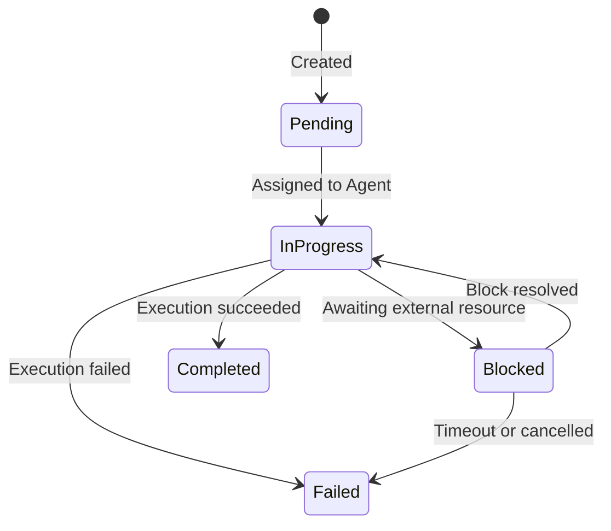

# Chapter 2: octos-core: Defining a Domain Language with the Type System

> **Positioning**: This chapter dives into octos's lowest-level crate -- octos-core (approximately 1,800 lines), showing how to build the domain language for an AI Agent platform using Rust's type system. Prerequisites: Chapter 1. Applicable to all readers who want to understand octos's type foundation, especially those who want to learn Rust enum and error handling design through a real-world project (Reader A), and experienced developers who want to understand the "zero-dependency core crate" design philosophy (Reader B).

If we compare octos to a city, octos-core is its language -- not the buildings, not the roads, but the vocabulary and grammar that residents use to communicate. `Task`, `Message`, `MessageRole`, `Error` -- these types define how all components in the system describe their state and intent. All other 8 crates in octos depend on these types, but octos-core itself does not depend on any other crate in the workspace.

This zero-dependency constraint is not accidental. It is a deliberate architectural decision that ensures the stability of the domain language: when octos-llm refactors its Provider implementation or octos-bus adds new channels, the core types don't need to change. This chapter starts with the Task state machine, analyzes these foundational types one by one, and concludes by discussing the engineering significance of this zero-dependency strategy.

---

## 2.1 Task State Machine: Encoding Legal States with Enums

Every piece of work executed by an AI Agent is modeled as a `Task` in octos. Task is the system's unit of work -- from "write me some code" to "review this diff," all user requests are ultimately transformed into Tasks.

### 2.1.1 Task Struct

The Task definition is located at `crates/octos-core/src/task.rs:11-29`:

```rust
pub struct Task {
    pub id: TaskId,                      // UUID v7, with built-in time ordering
    pub parent_id: Option<TaskId>,       // Subtask hierarchy
    pub status: TaskStatus,              // Current state
    pub kind: TaskKind,                  // Task type
    pub context: TaskContext,            // Execution context
    pub result: Option<TaskResult>,      // Result after completion
    pub created_at: DateTime<Utc>,
    pub updated_at: DateTime<Utc>,
}
```

A few noteworthy design choices:

**`TaskId` uses UUID v7 instead of v4** (`crates/octos-core/src/types.rs:14`). UUID v4 is purely random, while v7 encodes a millisecond-precision timestamp in its first 48 bits. This means TaskIds are naturally ordered by creation time -- when debugging and analyzing logs, you can determine the order of tasks directly from their IDs without querying the `created_at` field.

**`parent_id: Option<TaskId>`** supports task hierarchies. When a complex task needs to be decomposed into multiple subtasks (e.g., multi-step execution in a Pipeline), each subtask points to the parent task through `parent_id`, forming a tree structure.

**`result: Option<TaskResult>`** only exists after the Task completes. This leverages Rust's `Option` type to force callers at compile time to handle the case where "the result may not exist" -- you cannot access the result of a Pending-status Task without checking first.

### 2.1.2 TaskStatus: Preventing Illegal Transitions at Compile Time

TaskStatus is an enum with associated data (`crates/octos-core/src/task.rs:63-77`):

```rust
pub enum TaskStatus {
    Pending,
    InProgress { agent_id: AgentId },
    Blocked { reason: String },
    Completed,
    Failed { error: String },
}
```

Note that the `InProgress` variant carries `agent_id` -- this is not just a status marker but also records who is executing the task. Similarly, `Blocked` carries the blocking reason, and `Failed` carries the error message. This combination of "state + contextual data" is the core advantage of Rust enums over enums in other languages (such as Go's `iota` constants or Java's traditional enums).

In Python, you might express the same semantics with a string field `status: str` plus several optional fields `agent_id: Optional[str]`, `error: Optional[str]`. But this design allows illegal states -- such as a Task with `status="pending"` but `agent_id="agent-1"`, or a Task with `status="completed"` but `error="something failed"`. Rust's enums make these states impossible at the type level.

### 2.1.3 State Transition Diagram

The legal state transitions for a Task are as follows:



**Figure 2-1: Task state machine.** Each state transition corresponds to a specific business event. Note that Pending can only transition to InProgress (it cannot jump directly to Completed), and InProgress is the only path that can reach Completed -- this ensures every completed task has gone through an execution phase.

### 2.1.4 TaskKind: Five Task Types

TaskKind defines five types of work (`crates/octos-core/src/task.rs:79-99`):

```rust
pub enum TaskKind {
    Plan { goal: String },
    Code { instruction: String, files: Vec<PathBuf> },
    Review { diff: String },
    Test { command: String },
    Custom { name: String, params: serde_json::Value },
}
```

The first four are predefined common scenarios: planning (Plan), coding (Code), reviewing (Review), and testing (Test). The fifth, `Custom`, is an extension point -- it identifies the task type via `name` and carries arbitrary JSON data via `params`. This pattern of "limited predefinition + open extension" recurs throughout octos (see Chapter 6 for the tool system and Chapter 9 for the extension mechanism).

### 2.1.5 TaskContext and TaskResult

TaskContext (`crates/octos-core/src/task.rs:102-115`) is an environment snapshot at the time of task execution:

```rust
pub struct TaskContext {
    pub working_dir: PathBuf,
    pub git_state: Option<GitState>,      // Branch, uncommitted changes, HEAD commit
    pub working_memory: Vec<Message>,      // Recent conversation turns
    pub episodic_refs: Vec<EpisodeRef>,    // Past episode references
    pub files_in_scope: Vec<PathBuf>,
}
```

The distinction between `working_memory` and `episodic_refs` is worth noting: `working_memory` is the short-term memory of the current session (recent conversation turns), while `episodic_refs` are relevant fragments retrieved from long-term memory (see Chapter 4 for details). This dual-memory architecture mirrors the distinction between human working memory and episodic memory.

TaskResult (`crates/octos-core/src/task.rs:126-138`) records the output of a task:

```rust
pub struct TaskResult {
    pub success: bool,
    pub output: String,
    pub files_modified: Vec<PathBuf>,
    pub subtasks: Vec<TaskId>,
    pub token_usage: TokenUsage,
}
```

TokenUsage (`crates/octos-core/src/task.rs:141-154`) deserves special attention. It tracks not just input/output tokens but also `reasoning_tokens` (chain-of-thought tokens, for reasoning models like o1 and kimi-k2.5) and `cache_read_tokens`/`cache_write_tokens` (Provider cache hits/writes). These five dimensions allow upper layers to precisely calculate costs and optimize caching strategies. During serialization, zero-valued fields are skipped to avoid JSON bloat.

---

## 2.2 Message and MessageRole: Unified Abstraction Across Providers

An AI Agent platform needs to interface with multiple LLM Providers -- Anthropic's Claude, OpenAI's GPT-4, Google's Gemini, local Ollama. Each Provider's API has slightly different naming and semantics for message roles. octos-core defines unified `Message` and `MessageRole` types as the common denominator across all Providers.

### 2.2.1 Message Struct

The Message definition is located at `crates/octos-core/src/types.rs:55-70`:

```rust
pub struct Message {
    pub role: MessageRole,
    pub content: String,
    pub media: Vec<String>,                         // Image/audio file paths
    pub tool_calls: Option<Vec<ToolCall>>,           // Tool calls requested by LLM
    pub tool_call_id: Option<String>,                // Call ID for tool response
    pub reasoning_content: Option<String>,           // Chain-of-thought content
    pub timestamp: DateTime<Utc>,
}
```

The `media` field (`types.rs:61`) supports multimodality: when users send images or voice, file paths are stored here, and octos-llm converts them to the appropriate Provider format (base64 encoding or URL reference) when building API requests. Empty `media` vectors are skipped during serialization.

`reasoning_content` (`types.rs:68`) is designed for reasoning models (such as OpenAI o1, Kimi k2.5) -- these models first output an internal reasoning process before giving a final answer. Storing reasoning content separately from the formal response lets upper layers choose whether to display the chain of thought.

### 2.2.2 MessageRole: Dual Implementation of as_str() and Display

MessageRole has only four variants (`crates/octos-core/src/types.rs:113-120`):

```rust
pub enum MessageRole {
    System,
    User,
    Assistant,
    Tool,
}
```

The key lies in its two method implementations. `as_str()` (`types.rs:124-131`) returns `&'static str`:

```rust
impl MessageRole {
    pub fn as_str(self) -> &'static str {
        match self {
            Self::System => "system",
            Self::User => "user",
            Self::Assistant => "assistant",
            Self::Tool => "tool",
        }
    }
}
```

The `Display` trait implementation (`types.rs:134-138`) delegates directly to `as_str()`:

```rust
impl fmt::Display for MessageRole {
    fn fmt(&self, f: &mut fmt::Formatter<'_>) -> fmt::Result {
        f.write_str(self.as_str())
    }
}
```

Why implement both? Because they serve different scenarios:

- `as_str()` takes `self` (by value) and returns `&'static str`. This is feasible because `MessageRole` implements the `Copy` trait -- the enum has only four data-free variants, so the copy cost is equivalent to copying a single byte. Pass-by-value is used in zero-allocation scenarios -- such as setting a JSON field value when building API requests.
- `Display` is used for string formatting (`format!()`, `println!()`, etc.) and is the standard interface in the Rust ecosystem.

This pattern ensures cross-Provider consistency: regardless of whether a message is sent to Anthropic or OpenAI, message roles are always serialized as the four lowercase strings `"system"`, `"user"`, `"assistant"`, `"tool"`. Differences between Providers (such as Anthropic treating the system message as a separate field rather than part of the message array) are handled in octos-llm and do not leak into the core type layer.

### 2.2.3 ToolCall and Metadata Extension

ToolCall (`crates/octos-core/src/types.rs:140-148`) is the data structure used when the LLM requests a tool invocation:

```rust
pub struct ToolCall {
    pub id: String,
    pub name: String,
    pub arguments: serde_json::Value,
    pub metadata: Option<serde_json::Value>,
}
```

The `metadata` field (`types.rs:145`) is an extension point reserved for Provider-specific data. For example, Google Gemini's tool calls include a `thought_signature` field used to verify whether the tool call originates from the model's reasoning process. By storing this heterogeneous data in `Option<Value>`, the core types don't need Provider-specific fields.

### 2.2.4 Convenience Constructors

Message provides three convenience constructors (`types.rs:73-111`):

```rust
impl Message {
    pub fn user(content: impl Into<String>) -> Self { /* ... */ }
    pub fn assistant(content: impl Into<String>) -> Self { /* ... */ }
    pub fn system(content: impl Into<String>) -> Self { /* ... */ }
}
```

Note the parameter type is `impl Into<String>` rather than `String` or `&str`. This lets callers pass `String`, `&str`, or even `Cow<str>`, and the compiler automatically chooses the most efficient conversion path. This is a common API design pattern in Rust -- using generics to reduce the caller's type conversion burden.

---

## 2.3 Error Design: Why eyre Instead of anyhow

The Rust ecosystem has two mainstream error handling libraries: `anyhow` and `eyre`. Both provide type-erased error reporting (`anyhow::Error` / `eyre::Report`), but octos chose `eyre`/`color-eyre`. This choice deserves in-depth analysis.

### 2.3.1 octos's Error Type

octos-core's Error is defined in `crates/octos-core/src/error.rs:10-17`:

```rust
pub struct Error {
    pub kind: ErrorKind,
    pub context: Option<String>,
    pub suggestion: Option<String>,
}
```

The key design here is the **three-layer structure**: `kind` categorizes the error type, `context` adds execution context, and `suggestion` provides actionable remediation advice.

ErrorKind is a 15-variant enum (`error.rs:20-56`), covering all error categories in the system:

```rust
pub enum ErrorKind {
    TaskNotFound(String),
    AgentNotFound(String),
    InvalidStateTransition { from: String, to: String },
    LlmError { provider: String, message: String },
    ApiError { provider: String, status: u16, body: String },
    ToolError { tool: String, message: String },
    ConfigError(String),
    ApiKeyNotSet { provider: String, env_var: String },
    UnknownProvider(String),
    Timeout { operation: String, seconds: u64 },
    ChannelError { channel: String, message: String },
    SessionError(String),
    IoError(std::io::Error),
    SerializationError(String),
    Other(eyre::Report),
}
```

Note the last variant `Other(eyre::Report)` -- this uses `eyre::Report` rather than `anyhow::Error`.

### 2.3.2 eyre vs anyhow: Selection Rationale

The core APIs of `anyhow` and `eyre` are nearly identical, but there are two key differences:

**Difference One: Custom error reporters.** `eyre` supports installing custom error reporters via `eyre::set_hook()`. `color-eyre` is one such reporter -- it automatically captures `std::backtrace::Backtrace` and `tracing_error::SpanTrace` when an error occurs, and outputs them in colorized format. For a CLI tool, when an Agent execution fails, developers can immediately see the color-highlighted error chain and call stack, providing a better debugging experience than anyhow's plain text output.

**Difference Two: Ecosystem alignment.** octos's workspace dependency declarations use both `eyre` and `color-eyre` (`Cargo.toml:71-72`). This is because `color-eyre` is initialized at the CLI entry point (calling `color_eyre::install()` in `main()`), while `eyre::Report` is used as the general error type throughout the codebase. If `anyhow::Error` and `eyre::Report` were mixed, conversions at boundaries would add unnecessary complexity.

### 2.3.3 Actionable Error Messages

The most worthwhile lesson from octos's error design is not the library choice but the philosophy of "making error messages actionable." Look at some of the convenience constructor implementations (`error.rs:80-173`):

```rust
pub fn api_key_not_set(provider: impl Into<String>, env_var: impl Into<String>) -> Self {
    Self {
        kind: ErrorKind::ApiKeyNotSet {
            provider: provider.to_string(),
            env_var: env_var.to_string(),
        },
        context: None,
        suggestion: Some(format!(
            "Set the {} environment variable or configure it in config.json",
            env_var
        )),
    }
}
```

When a user forgets to set an API key, the error message doesn't just say "key not set" -- it tells you "set the `ANTHROPIC_API_KEY` environment variable, or configure it in config.json." Similarly, `api_error()` provides different suggestions based on the HTTP status code -- 401 suggests checking the key, 429 suggests rate limiting, and 504 suggests a timeout.

The Display implementation (`error.rs:175-228`) formats these three layers of information into user-friendly output, using `truncated_utf8()` to safely truncate overly long API response bodies, avoiding giant JSON dumps in error logs.

---

## 2.4 truncate_utf8: The UTF-8 Safety Philosophy Behind a Small Function

`truncate_utf8` is one of the smallest yet most elegant functions in octos-core. It is only 10 lines of code (`crates/octos-core/src/utils.rs:6-16`), yet it solves a problem that is extremely common in multilingual AI applications: how to safely truncate strings that may contain Chinese characters, Japanese characters, emoji, and other multi-byte characters.

### 2.4.1 The Problem: UTF-8's Multi-Byte Trap

UTF-8 is a variable-length encoding: ASCII characters occupy 1 byte, Chinese characters occupy 3 bytes, and emoji occupy 4 bytes. When you need to truncate a string to N bytes, the truncation point may fall in the middle of a multi-byte character.

```
UTF-8 encoding of "你好世界":
你 = [E4 BD A0]  (3 bytes)
好 = [E5 A5 BD]  (3 bytes)
世 = [E4 B8 96]  (3 bytes)
界 = [E7 95 8C]  (3 bytes)
Total: 12 bytes

If truncated to 7 bytes:
[E4 BD A0] [E5 A5 BD] [E4]  ← The last byte is the first byte of "世"
                              This is not a valid UTF-8 sequence!
```

In C/C++, such truncation produces an invalid UTF-8 string that may cause downstream parsing to crash. Python's `str[:7]` truncates by character rather than byte, avoiding this problem but unable to precisely control the byte budget.

### 2.4.2 Two Variants: In-Place and Copying

octos provides two truncation functions:

**`truncate_utf8`** (`utils.rs:6-16`) -- in-place truncation, modifies the original string:

```rust
pub fn truncate_utf8(s: &mut String, max_len: usize, suffix: &str) {
    if s.len() <= max_len {
        return;
    }
    let mut limit = max_len;
    while limit > 0 && !s.is_char_boundary(limit) {
        limit -= 1;
    }
    s.truncate(limit);
    s.push_str(suffix);
}
```

**`truncated_utf8`** (`utils.rs:21-30`) -- returns a new string, does not modify the original data:

```rust
pub fn truncated_utf8(s: &str, max_len: usize, suffix: &str) -> String {
    if s.len() <= max_len {
        return s.to_string();
    }
    let mut limit = max_len;
    while limit > 0 && !s.is_char_boundary(limit) {
        limit -= 1;
    }
    format!("{}{}", &s[..limit], suffix)
}
```

The core algorithm is the same: step backward from the `max_len` position until a valid UTF-8 character boundary is found (`is_char_boundary()`). After truncation, the suffix is appended. Note that `max_len` in both functions does not include the suffix length -- the final string may exceed `max_len` after appending the suffix. This is intentional: `max_len` controls the upper bound of retained content, and the suffix is an additional marker. Callers need to reserve space for the suffix when setting `max_len`.

The difference between the two variants lies in ownership semantics:
- `truncate_utf8` takes `&mut String`, modifying in place with zero additional allocation (except for suffix appending)
- `truncated_utf8` takes `&str` (immutable reference) and returns a new `String`, requiring one heap allocation

Callers choose based on the scenario: if you own the string and no longer need the original content, use the in-place version; if the string is borrowed (e.g., an `&str` from an API response), use the copying version.

### 2.4.3 truncate_head_tail: Smart Truncation Preserving Head and Tail

For tool output and error messages, preserving only the beginning is often insufficient -- the error information or conclusions at the end are equally important. `truncate_head_tail` (`utils.rs:37-70`) solves this problem:

```rust
pub fn truncate_head_tail(s: &str, max_len: usize, head_ratio: f32) -> String
```

It allocates the byte budget between head and tail according to `head_ratio` (default 0.5, clamped to [0.1, 0.9]), connecting them with `\n\n... [N bytes omitted] ...\n\n`. Truncation points on both ends use `is_char_boundary()` to ensure UTF-8 safety.

This function is used in multiple scenarios throughout octos:
- Tool output truncation (stdout/stderr from Shell commands)
- API response body truncation in error messages (`error.rs`)
- Message summarization during context compaction (see Chapter 8 for details)

### 2.4.4 tool_output_limit: Per-Tool Truncation Policies

`tool_output_limit` (`utils.rs:73-85`) sets different character limits for different tools:

| Tool | Limit | Rationale |
|------|-------|-----------|
| `read_file` | 50,000 | Source code files can be large |
| `shell`, `grep` | 30,000 | Command output is typically more concise |
| `web_fetch` | 40,000 | Web content is moderate |
| `web_search` | 20,000 | Search results are summaries |
| `deep_search`, `deep_research`, `spawn` | 50,000 | Deep tasks need more context |
| Default | 50,000 | Safe upper bound |

These limits are not arbitrary -- they reflect differences in information density across tool outputs. Search results have high information density (each result is a useful summary), so 20,000 characters suffices; source code files have uneven information distribution (you may need to see a complete function body), so they get 50,000 characters. These limits work in conjunction with the LLM context window budget (see Chapter 8 on context management).

---

## 2.5 SessionKey: Multi-Tenant Session Identifier Design

SessionKey (`crates/octos-core/src/types.rs:159-236`) is key to session routing in a multi-tenant system. Its design evolution reflects the expansion of requirements from single-channel to multi-channel, and from single-Profile to multi-Profile.

### 2.5.1 Format Evolution

SessionKey supports four formats, with backward compatibility:

| Format | Example | Scenario |
|--------|---------|----------|
| `channel:chat_id` | `telegram:12345` | Basic: single Profile |
| `profile:channel:chat_id` | `work:telegram:12345` | Multi-Profile isolation |
| `channel:chat_id#topic` | `telegram:12345#research` | Multiple topics within the same session |
| `profile:channel:chat_id#topic` | `work:telegram:12345#research` | Complete form |

The `base_key()` method (`types.rs:195`) returns the part without the `#topic` suffix, used for session persistence (different topics under the same base_key share the persistence file). The `topic()` method (`types.rs:200`) extracts the topic suffix.

### 2.5.2 Channel Validation

SessionKey's constructor validates the channel name through `is_valid_channel()` (`types.rs:238-257`), checking against a whitelist. This whitelist contains 15 known channels, covering all integrations supported by octos:

```
api, cli, discord, email, feishu, matrix, qq-bot, slack,
system, telegram, test, twilio, wecom, wecom-bot, whatsapp
```

Validation is performed at construction time (not at usage time). This is a common pattern in Rust's type system -- "make invalid states unconstructable." Once you hold a `SessionKey`, you can be certain its channel name is valid.

---

## 2.6 AgentMessage: Inter-Agent Coordination Protocol

AgentMessage (`crates/octos-core/src/message.rs:10-29`) defines the coordination protocol between Agents:

```rust
pub enum AgentMessage {
    TaskAssign { task: Box<Task> },
    TaskUpdate { task_id: TaskId, status: TaskStatus },
    TaskComplete { task_id: TaskId, result: TaskResult },
    ContextRequest { task_id: TaskId, query: String },
    ContextResponse { task_id: TaskId, context: Vec<Message> },
}
```

The five message types cover the core scenarios of Agent coordination: task assignment, status updates, completion notification, context requests, and context responses. Note the `Box<Task>` in `TaskAssign` -- the Task struct is relatively large, and using `Box` for heap allocation avoids the memory waste that would result from size disparity between enum variants.

The `task_id()` method (`message.rs:31-42`) returns `Option<&TaskId>`, providing a unified task ID access interface for all variants. Callers don't need to pattern-match on each variant to get the associated task ID -- they only need to handle the `Option`.

---

## 2.7 abort: Multilingual Interruption Detection

An interesting small module: `abort.rs` implements multilingual Agent interruption detection. When a user sends an interruption signal during Agent execution -- such as "stop" (English), "停" (Chinese), "やめて" (Japanese), "стоп" (Russian) -- the system needs to immediately recognize and terminate the current operation.

The `ABORT_TRIGGERS` array (`abort.rs:32-71`) contains 30 trigger words across 9 languages. `is_abort_trigger()` (`abort.rs:6-13`) performs trim + lowercase followed by exact matching on the input. `abort_response()` (`abort.rs:15-30`) returns a localized cancellation confirmation matching the trigger language.

Worth noting are the **deliberately excluded words**: code comments document that "wait," "exit," "para," and others were excluded -- they appear too frequently in normal conversation and would cause false positives. This is a pragmatic design choice: it's better to miss some interruption signals (the user can say it again) than to falsely trigger interruptions during normal conversation.

---

> ### Engineering Decision Sidebar: Why the Core Crate Has Zero Internal Dependencies
>
> octos-core is the only foundational crate in the workspace that doesn't depend on any other octos crate (octos-plugin and octos-sandbox also have no internal dependencies, but they are not depended upon by other crates). This "zero internal dependency" constraint is a deliberate design choice.
>
> **Option One: Fat core (push more logic down into core)**
>
> Advantages:
> - All shared logic concentrated in one place, reducing duplication across crates
> - Downstream crates only need to depend on core to get most capabilities
>
> Disadvantages:
> - Core's compile time grows as features expand, affecting incremental compilation speed for all crates that depend on it
> - Core's change frequency increases; every modification triggers a full workspace recompile
> - Unrelated features become coupled -- modifying LLM-related logic could affect Task types
>
> **Option Two: Thin core (only type definitions and the most basic utility functions)**
>
> Advantages:
> - Very few changes, providing a stable type foundation
> - Fast compilation (octos-core is only 1,793 lines)
> - Clear dependency graph: all crates depend on core's types, but core depends on no one
>
> Disadvantages:
> - Shared logic across crates needs to go elsewhere (e.g., utility functions in octos-agent)
> - Types that "should be in core" might end up defined in upper-layer crates
>
> **octos's choice: thin core, for the following reasons.**
>
> octos-core's external dependencies are limited to `serde`, `serde_json`, `chrono`, `uuid`, and `eyre` -- all industry-standard libraries for serialization, time, and error handling. This means octos-core's compile time is extremely short, and all crates that depend on it (octos-llm, octos-memory, octos-agent, octos-bus, octos-pipeline, octos-cli) benefit from this fast compilation.
>
> More importantly, there's a stability guarantee. Throughout octos's development history, octos-llm has undergone multiple Provider refactorings, octos-agent's tool system has continuously expanded, and octos-bus has added multiple channels -- but octos-core's core types (Task, Message, Error) have remained highly stable. The thin core strategy makes this stability possible.

---

## 2.8 Chapter Summary

octos-core defines the entire system's domain language in 1,793 lines of code:

1. **Task state machine**: Uses Rust enums to encode legal states and transitions, eliminating illegal state combinations at the type level. UUID v7 provides time ordering, and five-dimensional TokenUsage supports fine-grained cost tracking.

2. **Message abstraction**: Four-role unified model (System/User/Assistant/Tool) + dual `as_str()`/`Display` implementation, ensuring serialization consistency across Providers. The `metadata` extension point accommodates Provider-specific data.

3. **Error design**: Chose eyre/color-eyre for colorized error reports and SpanTrace support. The three-layer structure (kind + context + suggestion) makes error messages actionable.

4. **UTF-8 safety utilities**: Two variants of `truncate_utf8` (in-place and copying) ensure safe truncation through `is_char_boundary()`. `truncate_head_tail` preserves head and tail information.

5. **Zero-dependency design**: The thin core strategy ensures a stable type foundation with fast compilation, supporting the independent evolution of upper-layer crates.

In the next chapter, we will enter octos-llm and see how these core types are used to tame the chaotic interfaces of multiple LLM Providers.

---

## Further Reading

- **Rust Enums and Pattern Matching**: *The Rust Programming Language* Chapter 6 "Enums and Pattern Matching," https://doc.rust-lang.org/book/ch06-00-enums.html
- **eyre Error Handling**: eyre crate documentation, https://docs.rs/eyre/latest/eyre/
- **color-eyre**: color-eyre crate documentation, https://docs.rs/color-eyre/latest/color_eyre/
- **UUID v7 Specification**: RFC 9562 "Universally Unique IDentifiers (UUIDs)," Section 5.7
- **UTF-8 Encoding**: *The Unicode Standard* Chapter 3 "Conformance" -- understanding UTF-8 variable-length encoding is essential for safe truncation

## Discussion Questions

1. **State machine extension**: If you need to add a `Cancelled` state to Task (for user-initiated cancellation), from which states should it be reachable? What impact would adding this state have on existing `match` expressions?

2. **Fat core vs thin core**: Suppose octos-core also included the `LlmProvider` trait (since all upper-layer crates need it). What problems would this cause? Hint: Consider the transitive dependency effects of `async-trait`, `reqwest`, and similar crates.

3. **Error design trade-offs**: octos's `ErrorKind` has 15 variants. If the system continues to grow to 50 variants, what problems would this design encounter? How would you refactor it?

4. **Alternative truncation strategies**: `truncate_utf8` truncates by bytes and falls back to character boundaries. An alternative approach is truncating by Unicode grapheme clusters. How do these two approaches differ when handling emoji combining sequences (such as 👨‍👩‍👧‍👦)? Which is more suitable for LLM context management scenarios?

---

> **Version Evolution Note**
> This chapter's analysis is based on octos v0.1.0. The octos-core crate is located at `crates/octos-core/src/`. As of the time of writing, the core types (Task, Message, Error) have not undergone any major structural changes. TokenUsage may gain additional tracking dimensions in future versions (such as a breakdown of reasoning_tokens).
