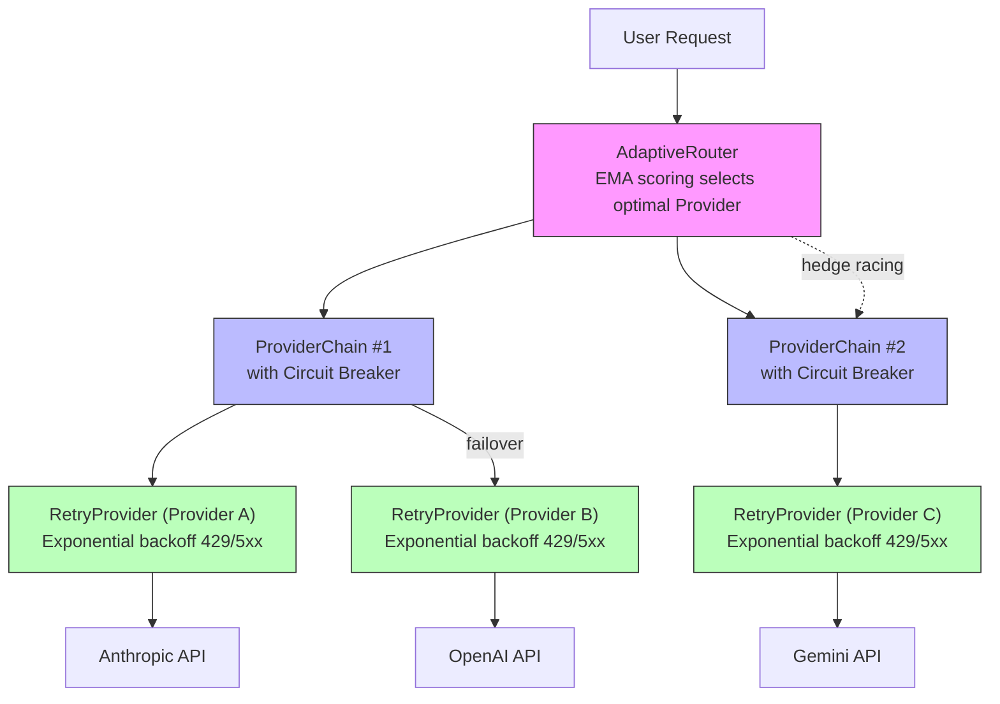

# Chapter 3: octos-llm: Taming the Chaos of LLM Providers

> **Positioning**: This chapter dives into the octos-llm crate (~15,700 lines), showing how Rust traits can unify the chaotic interfaces of multiple LLM Providers into a single abstraction, and how a three-tier fault tolerance chain achieves production-grade reliability. Prerequisite: Chapter 2. Target audience: AI application developers who want to understand multi-Provider architecture design (Reader C), and Rust developers interested in trait objects and async fault tolerance patterns (Reader B).

Every LLM Provider has its own API style: Anthropic treats the system message as a standalone field, OpenAI embeds it in the message array; Gemini's tool calling format differs entirely from the other two; Ollama runs locally, but octos reaches it through the OpenAI-compatible adapter. When you need to support a few native protocol implementations plus many OpenAI/Anthropic-compatible Providers, chaos is inevitable unless you establish the right abstraction at the right layer.

octos-llm's solution has three layers: the `LlmProvider` trait at the bottom unifies the calling interface, the Provider registry in the middle enables automatic model name detection and factory-based creation, and the three-tier fault tolerance chain at the top (RetryProvider -> ProviderChain -> AdaptiveRouter) provides production-grade reliability. This chapter builds up from the bottom layer by layer.

---

## 3.1 LlmProvider Trait: A Minimal Unified Interface

### 3.1.1 Trait Signature

The definition of `LlmProvider` is located at `crates/octos-llm/src/provider.rs:11-81`:

```rust
#[async_trait]
pub trait LlmProvider: Send + Sync {
    // Core method: non-streaming chat
    async fn chat(
        &self,
        messages: &[Message],
        tools: &[ToolSpec],
        config: &ChatConfig,
    ) -> Result<ChatResponse>;

    // Streaming chat (has a default implementation)
    async fn chat_stream(
        &self,
        messages: &[Message],
        tools: &[ToolSpec],
        config: &ChatConfig,
    ) -> Result<ChatStream>;

    // Metadata queries
    fn context_window(&self) -> u32;
    fn max_output_tokens(&self) -> u32;
    fn model_id(&self) -> &str;
    fn provider_name(&self) -> &str;

    // Optional: metrics reporting
    fn export_metrics(&self) -> Option<serde_json::Value> { None }
    fn report_late_failure(&self) {}
    fn report_stream_metrics(&self, _output_tokens: u32, _stream_duration_us: u64) {}
}
```

This trait follows the "minimal necessary interface" principle (the comment at `provider.rs:13` makes this explicit): define only the capabilities common to all Providers, and handle differences within each implementation.

Several design choices are worth noting:

**The `Send + Sync` bound.** The trait requires implementors to be thread-safe, because Provider instances are shared across multiple async tasks via `Arc`. This constraint guarantees at compile time that a single-threaded Provider implementation won't accidentally be used in a multi-threaded context.

**The default implementation of `chat_stream()`.** Not all Providers natively support streaming responses. The default implementation (`provider.rs:32-49`) calls the non-streaming `chat()` method and then wraps the complete response as a synthetic stream with a single event. This lets new Providers get basic functionality by implementing only `chat()`, with streaming support added later as an optimization.

**Metrics reporting methods.** The three methods `export_metrics()`, `report_late_failure()`, and `report_stream_metrics()` all have empty default implementations. They provide data sources for the AdaptiveRouter's EMA scoring system (see Section 3.4), but don't force all Providers to implement them. This "optional hook" pattern prevents trait bloat.

### 3.1.2 Core Data Types

`ChatConfig` (`crates/octos-llm/src/config.rs`) encapsulates all tunable parameters:

- `model`: model ID
- `temperature`: sampling temperature
- `max_tokens`: maximum output token count
- `system_prompt`: system prompt
- `response_format`: response format constraint (text/JSON/structured output)
- `tool_choice`: tool selection strategy (auto/required/none/specific tool)

`ChatResponse` contains the complete information returned by the LLM: content, stop reason, tool call requests, and token usage. `ChatStream` is an async stream (`Pin<Box<dyn Stream<Item = Result<StreamEvent>>>>`), yielding streaming response events one at a time.

---

## 3.2 Provider Registry: Automatic Model Name Detection

When a user configures `model: "claude-sonnet-4"`, octos needs to automatically determine that the Anthropic Provider should be used. This mapping is implemented by the Provider registry (`crates/octos-llm/src/registry/mod.rs`).

### 3.2.1 Detection Mechanism

Each Provider declares its detection patterns when registering (`registry/mod.rs:80`):

```rust
struct ProviderEntry {
    name: &'static str,
    detect_patterns: &'static [&'static str],
    // ...
}
```

The `detect_provider()` method (`registry/mod.rs:131-150`) iterates through all Providers in priority order, checking whether the model name contains a detection pattern:

| Provider | Detection Pattern | Match Examples |
|----------|------------------|----------------|
| Anthropic | `"claude"` | claude-sonnet-4, claude-haiku-4-5 |
| OpenAI | `"gpt"`, `"chatgpt"` | gpt-4o, gpt-4-turbo |
| Gemini | `"gemini"` | gemini-2.5-flash, gemini-2.5-pro |
| DeepSeek | `"deepseek"` | deepseek-chat, deepseek-coder |
| Groq | `"groq"` | groq-llama-3 |
| Ollama | `"ollama"` | ollama-llama3 |
| OpenRouter | `"openrouter"` | openrouter/meta-llama |

**Special handling: O-series models.** OpenAI's o1, o3, and o4 series require prefix matching rather than substring matching (`registry/mod.rs:137-140`), because "o1" as a substring could match model names from other Providers (e.g., a hypothetical model name like `ro1and`).

### 3.2.2 Complete Provider Registry

octos supports 15+ Providers, detected in priority order (`registry/mod.rs:89-105`):

| Priority | Provider | Protocol | Detection Pattern | Example Models |
|----------|---------|----------|------------------|----------------|
| 1 | Anthropic | Native | `claude` | claude-sonnet-4, claude-haiku-4-5 |
| 2 | OpenAI | Native | `gpt`, `chatgpt`, `o1`/`o3`/`o4`(prefix) | gpt-4o, o4-mini |
| 3 | Gemini | Native | `gemini` | gemini-2.5-flash, gemini-2.5-pro |
| 4 | R9s (Azure) | OpenAI-compatible | `r9s` | r9s-gpt-4 |
| 5 | OpenRouter | Meta-router | `openrouter` | openrouter/meta-llama |
| 6 | DeepSeek | OpenAI-compatible | `deepseek` | deepseek-chat |
| 7 | Groq | OpenAI-compatible | `groq` | groq-llama-3 |
| 8 | Moonshot | OpenAI-compatible | `moonshot` | moonshot-v1 |
| 9 | Dashscope | OpenAI-compatible | `dashscope`, `qwen` | qwen-max |
| 10 | Minimax | OpenAI-compatible | `minimax` | minimax-abab6 |
| 11 | Zhipu | OpenAI-compatible | `zhipu`, `glm` | glm-4 |
| 12 | Zai | OpenAI-compatible | `zai` | zai-llama |
| 13 | NVIDIA | OpenAI-compatible | `nvidia` | nvidia/llama-3 |
| 14 | Ollama | OpenAI-compatible | `ollama` | ollama-llama3 |
| 15 | vLLM | OpenAI-compatible | `vllm` | vllm-mistral |

The current registry has 15 Providers. Anthropic, OpenAI, and Gemini use dedicated implementations; most other entries connect through compatibility layers. Ollama, vLLM, OpenRouter, DeepSeek, and similar Providers reuse `OpenAIProvider`; Z.AI reuses the Anthropic Messages API; R9s chooses between Anthropic and OpenAI-style protocols by model family. This "few native implementations + many compatible adapters" architecture keeps the cost of onboarding new Providers low. In many cases, adding a registry entry is enough.

### 3.2.3 Provider Factory

Once a Provider is detected, the registry creates the concrete instance via a factory function. Each factory function reads the corresponding environment variables (`ANTHROPIC_API_KEY`, `OPENAI_API_KEY`, etc.) or credentials from a configuration file, and constructs an HTTP client with the correct base URL and authentication headers.

The type returned by the factory is `Arc<dyn LlmProvider>`—this is the key point of dynamic dispatch. The registry doesn't know (and doesn't need to know) the concrete Provider type; it only knows that it implements the `LlmProvider` trait. This allows upper-layer code to handle all Providers uniformly, including placing them in the fault tolerance chain.

---

## 3.3 Three-Tier Fault Tolerance Chain

In production environments, LLM API calls can fail for many reasons: rate limiting (429), server overload (503/529), authentication failure (401), and network timeouts. octos-llm handles these failures with a three-tier fault tolerance chain, where each tier addresses a different level of failure.



**Figure 3-1: Three-tier fault tolerance chain architecture.** Requests enter through the AdaptiveRouter, are routed via ProviderChain to specific Providers, and each Provider is wrapped in a RetryProvider to handle transient failures.

### 3.3.1 Tier 1: RetryProvider — Exponential Backoff

RetryProvider (`crates/octos-llm/src/retry.rs:40-226`) handles transient failures for a single Provider.

**Backoff algorithm** (`retry.rs:149-154`):

```rust
fn calculate_delay(&self, attempt: u32) -> Duration {
    let delay = self.config.initial_delay.as_secs_f64()
        * self.config.backoff_multiplier.powi(attempt as i32);
    let delay = Duration::from_secs_f64(delay);
    std::cmp::min(delay, self.config.max_delay)
}
```

Default configuration (`retry.rs:28-37`): up to 3 retries, initial delay of 1 second, backoff multiplier of 2.0, maximum delay of 60 seconds. The actual backoff sequence is 1s -> 2s -> 4s -> 8s (clamped by the 60s upper bound).

**Which errors are retryable?** (`retry.rs:107-147`)

| HTTP Status Code | Meaning | Retry? | Trigger Failover? |
|-----------------|---------|--------|-------------------|
| 429 | Rate limit | Yes (parse retry-after) | Yes |
| 500, 502, 503 | Server error | Yes | Yes |
| 529 | Overloaded | Yes | Yes |
| 401, 403 | Authentication error | No | Yes (immediate failover) |
| 504 | Gateway timeout | Yes (server may recover) | Yes |
| 408 | Request timeout | Depends | Yes |
| reqwest timeout | Network timeout | No (don't retry locally) | Yes (immediate failover) |
| 400 | Bad request | Depends on message | Partial |

Note the special handling for reqwest-level network timeouts (connection timeout, read timeout): they are not retried locally (because the same Provider will most likely time out again), but instead immediately trigger a failover to the upper layer, letting ProviderChain switch to a different Provider. HTTP 504 (Gateway Timeout), on the other hand, is treated as retryable—the server may recover after a brief overload.

**Rate limit parsing** (`retry.rs:159-185`): When a 429 response is received, RetryProvider attempts to parse the recommended wait time from the error message (e.g., "Please try again in 29.159s"), adds a 1-second buffer, and waits. If parsing fails, it falls back to a fixed 30-second wait.

### 3.3.2 Tier 2: ProviderChain — Ordered Failover

ProviderChain (`crates/octos-llm/src/failover.rs:36-249`) manages the failover order for a group of Providers.

**Circuit Breaker design** (`failover.rs:23-26`):

```rust
struct ProviderSlot {
    provider: Arc<dyn LlmProvider>,
    failures: AtomicU32,  // consecutive failure counter
}
```

Each Provider maintains an atomic counter tracking consecutive failures. When the failure count reaches the threshold (default 3), the Provider is marked as "degraded." A successful call resets the counter to 0 (`failover.rs:104`).

**Failover logic** (`failover.rs:85-99`):

1. First, try the first non-degraded Provider
2. If all Providers are degraded, select the one with the fewest failures
3. Skip degraded Providers unless it's the last option

**Late failure reporting** (`failover.rs:245-248`): `report_late_failure()` handles a subtle scenario—a Provider returns a 200 response, but after streaming and parsing, the content turns out to be empty or malformed. In this case, the Provider needs to be retroactively penalized by incrementing its failure counter, causing subsequent requests to prefer other Providers.

### 3.3.3 Tier 3: AdaptiveRouter — EMA Scoring and Hedge Racing

AdaptiveRouter (`crates/octos-llm/src/adaptive.rs:470-1200+`) is the top tier of the fault tolerance chain, implementing intelligent routing.

**Three modes** (`adaptive.rs:416-449`):

- **Off (0)**: Static priority ordering + circuit breaker; simplest and most reliable
- **Hedge (1)**: Score-based selection + hedge racing
- **Lane (2)**: Score-based lane switching; more cost-efficient than hedging

#### EMA Scoring System

AdaptiveRouter maintains a real-time score for each Provider, based on a weighted combination of four factors (`adaptive.rs:886-951`):

| Factor | Weight | Meaning | Data Source |
|--------|--------|---------|-------------|
| Stability (error_rate) | 30% | Error rate | Real-time stats + catalog baseline blend |
| Quality (latency) | 30% | Output quality | 60% deep search token count + 40% throughput |
| Priority (priority) | 20% | Configuration order | User configuration |
| Cost (cost) | 20% | Price | Model catalog |

**Blended weight design** (`adaptive.rs:886-920`): The stability factor uses a "catalog baseline + real-time data" blended calculation. The blending weight increases with the number of calls: `min(total_calls / 20.0, 0.5)`, meaning the catalog baseline always retains at least 50% influence. This design prevents the "cold start" problem—when a new Provider has only a few calls, one or two chance failures won't cause it to be judged unreliable.

#### Hedge Racing

In Hedge mode, AdaptiveRouter simultaneously sends requests to two Providers and takes whichever responds first (`adaptive.rs:1059-1158`):

```rust
// Simplified logic
tokio::select! {
    result = primary_future => {
        // Primary Provider responded first
        // The alternate Provider's future is dropped (cancelled)
        result
    }
    result = alternate_future => {
        // Alternate Provider responded first
        // The primary Provider's future is dropped (cancelled)
        result
    }
}
```

The alternate Provider selection (`adaptive.rs:1086-1105`) prefers the cheapest option (to reduce redundancy cost) and must have a different name from the primary (to avoid sending duplicate requests to the same API).

The cost of hedge racing is double the API call cost (the losing request still consumes tokens—even if cancelled, the Provider has typically already started processing). Therefore, Hedge mode is suited for latency-sensitive, cost-insensitive scenarios. Lane mode achieves similar routing optimization through score-based ordering but without sending redundant requests.

#### Probe Strategy

To keep backup Providers' scoring data fresh, AdaptiveRouter sends "probe" requests to non-optimal Providers with a certain probability (default 10%, `adaptive.rs:1013-1028`), refreshing their performance metrics. The probe interval defaults to 60 seconds, avoiding the cost of frequent probing.

---

## 3.4 SSE Streaming Parser: A Byte-Safe Stateful Parser

LLM streaming responses are transmitted via the Server-Sent Events (SSE) protocol. SSE appears simple—events are delimited by `\n\n`, and each line is prefixed with `data:` to mark data—but in production, several engineering challenges need to be addressed.

### 3.4.1 Why Stateful Parsing Is Needed

HTTP response bodies arrive as arbitrarily sized byte chunks. A single SSE event may span multiple chunks, and a single chunk may contain multiple events. More subtly, chunk boundaries may split a multi-byte UTF-8 character right in the middle.

Consider the following scenario:

```
Chunk 1: data: {"text": "任务完
Chunk 2: 成后请检查结果"}\n\n
```

There's no problem between "完" and "成" (each is a complete UTF-8 character), but if the chunk boundary falls in the middle of the three bytes of "完":

```
Chunk 1: data: {"text": "任务\xe5\xae
Chunk 2: \x8c成后请检查结果"}\n\n
```

Here, the `\xe5\xae` at the end of Chunk 1 is the first two bytes of "完"—not valid UTF-8. If you do `String::from_utf8()` per chunk, you'll get a parse error or a replacement character (U+FFFD).

### 3.4.2 octos's Byte-Safe Parser

The SSE parser in octos-llm (`crates/octos-llm/src/sse.rs:21-72`) uses a byte-level buffering strategy:

1. **Raw byte accumulation**: Append each chunk's raw bytes to a `Vec<u8>` buffer without UTF-8 conversion
2. **Event boundary detection**: Search for `\n\n` or `\r\n\r\n` delimiters in the raw bytes
3. **Per-event conversion**: Only convert a byte block to a UTF-8 string after a complete event is found
4. **Remaining bytes retention**: Trailing bytes that don't form a complete event stay in the buffer

This design ensures that UTF-8 conversion only happens on complete events—the SSE protocol guarantees that event boundaries won't fall in the middle of a UTF-8 character (because `\n` is a single-byte ASCII character).

The parser is built as an async stream using `stream::unfold()`, carrying state (byte stream + buffer) between event yields.

### 3.4.3 1MB Buffer Limit

Safety consideration: if a malicious or misbehaving LLM Provider sends an extremely long response that never contains `\n\n`, the buffer would grow without bound. `MAX_BUFFER_SIZE` (`sse.rs:6-7`) is set to 1MB; exceeding it causes the parser to emit an error event and clear the buffer.

```rust
const MAX_BUFFER_SIZE: usize = 1024 * 1024; // 1MB
```

1MB is more than sufficient for a single SSE event—in normal LLM streaming responses, each event is typically only a few dozen to a few hundred bytes (the JSON representation of a single token).

### 3.4.4 UTF-8 Split Test: Why Byte-Level Buffering Is Non-Optional

The test in `sse.rs` (`sse.rs:261-281`) constructs a precise multi-byte split scenario:

```
UTF-8 encoding of "完成后":
完 = [E5 AE 8C]   (3 bytes)
成 = [E6 88 90]   (3 bytes)
后 = [E5 90 8E]   (3 bytes)

Deliberately split in the middle of "成":
Chunk 1: data: {"text": "完[E6 88          ← first 2 bytes of "成"
Chunk 2: 90]后"}\n\n                       ← 3rd byte of "成" + "后"
```

If you do `String::from_utf8()` per chunk, the `[E6 88]` at the end of Chunk 1 is not valid UTF-8—it would be replaced with `U+FFFD` (the replacement character), and the character "成" would be permanently lost.

The byte-level buffering strategy avoids this problem: the raw bytes from both chunks are concatenated, then converted as a whole at the `\n\n` boundary, correctly reassembling "完成后".

This is not a theoretical risk—when an LLM streams Chinese-language responses, each SSE event typically contains only 1-3 tokens. HTTP's chunked transfer encoding can split at any byte position, regardless of token boundaries. For an Agent platform serving Chinese, Japanese, and Korean users, byte-level buffering is a **necessity**, not an optimization.

---

## 3.5 Model Catalog and Cost Tracking

ModelCatalog (`crates/octos-llm/src/catalog.rs:48-275`) maintains metadata for each known model:

```rust
pub struct ModelInfo {
    pub id: String,
    pub name: String,
    pub provider: String,
    pub context_window: u32,
    pub capabilities: ModelCapabilities,  // vision, tool_use, streaming, reasoning
    pub cost: ModelCost,                  // input/output/cache price per million tokens
    pub aliases: Vec<String>,
}
```

**Alias system**: In addition to the full model ID (e.g., `claude-sonnet-4-20250514`), the catalog also supports alias lookups (e.g., `sonnet` -> `claude-sonnet-4-20250514`). Lookup order (`catalog.rs:72-74`): exact ID match -> alias match -> None.

**Cost tracking**: `ModelCost` records the per-million-token price for three token types: input, output, and cache reads. The AdaptiveRouter's scoring system uses this data to calculate the cost factor (see Section 3.3.3), making trade-offs between latency and cost.

---

> ### Engineering Decision Sidebar: Arc\<dyn Trait\> vs Generics vs Enum Dispatch
>
> octos-llm uses `Arc<dyn LlmProvider>` extensively in the Provider abstraction layer. This choice is worth comparing with two alternatives.
>
> **Option 1: Generics (`impl LlmProvider` / `T: LlmProvider`)**
>
> Advantages:
> - Zero runtime overhead—the compiler generates specialized code at each call site (monomorphization)
> - Method calls can be inlined
>
> Disadvantages:
> - Wrappers like RetryProvider, ProviderChain, etc. would need generic parameter propagation: `RetryProvider<T: LlmProvider>`
> - Composing the fault tolerance chain would cause type explosion: `AdaptiveRouter<ProviderChain<RetryProvider<AnthropicProvider>>, ProviderChain<RetryProvider<OpenAIProvider>>>`
> - Cannot dynamically select Providers at runtime based on user configuration—generics fix the concrete type at compile time
>
> **Option 2: Enum Dispatch (`enum Provider { Anthropic(...), OpenAI(...), ... }`)**
>
> Advantages:
> - All variants are known at compile time; more branch-prediction friendly
> - No vtable indirect call overhead
>
> Disadvantages:
> - Every new Provider requires modifying the enum definition and all match expressions
> - With 15+ Providers, match blocks become enormous
> - Cannot support user-defined Providers (unless a `Custom` variant degenerates back into a trait object)
>
> **octos's choice: `Arc<dyn LlmProvider>`, for the following reasons.**
>
> In AI Agent scenarios, the network latency of LLM calls (100ms-10s) far exceeds the overhead of vtable indirect calls (<1ns). The performance cost of dynamic dispatch is completely negligible here.
>
> More importantly, composability. octos's fault tolerance chain is essentially nested decorator pattern composition: RetryProvider wraps any Provider, ProviderChain manages a group of Providers, and AdaptiveRouter routes across multiple Chains. `Arc<dyn LlmProvider>` allows these wrappers to compose freely, unconstrained by generic parameters.
>
> Finally, the set of Providers is determined at runtime—users specify which Providers to use via configuration files, and the registry factory dynamically creates instances. This "runtime polymorphism" is precisely the core use case for trait objects.

---

## 3.6 Chapter Summary

octos-llm solves the core challenges of LLM Provider integration in 15,728 lines of code:

1. **LlmProvider trait**: A minimal unified interface with dual-method design (`chat()` + `chat_stream()`), `Send + Sync` bounds for thread safety. Default implementations allow new Providers to be onboarded quickly.

2. **Provider registry**: Automatic Provider detection via model name substring matching, with factory pattern dynamic creation of `Arc<dyn LlmProvider>` instances. Special handling for O-series model prefix matching.

3. **Three-tier fault tolerance chain**:
   - RetryProvider: Exponential backoff (1s->2s->4s), intelligent parsing of 429 response retry-after headers
   - ProviderChain: Ordered failover + circuit breaker (3 consecutive failures trigger degradation)
   - AdaptiveRouter: Four-factor EMA scoring (stability 30% + quality 30% + priority 20% + cost 20%) + hedge racing + probe strategy

4. **SSE streaming parser**: Byte-level buffering to avoid UTF-8 split issues, 1MB limit to prevent memory exhaustion, `stream::unfold()` to build a stateful async stream.

5. **`Arc<dyn Trait>` choice**: Network latency far exceeds vtable overhead; the composability and runtime flexibility gained from dynamic dispatch are well worth the trade-off.

The next chapter moves into octos-memory, where we'll see how hybrid search (BM25 + HNSW vector index) gives Agents long-term memory capabilities.

---

## Further Reading

- **async-trait crate**: https://docs.rs/async-trait/latest/async_trait/ — Learn how the `#[async_trait]` macro compiles async methods into trait-object-compatible form
- **SSE protocol specification**: HTML Living Standard "Server-Sent Events" section, https://html.spec.whatwg.org/multipage/server-sent-events.html
- **Exponential backoff algorithm**: Google Cloud's "Truncated exponential backoff" documentation, https://cloud.google.com/storage/docs/exponential-backoff
- **Circuit Breaker pattern**: Martin Fowler, "CircuitBreaker," https://martinfowler.com/bliki/CircuitBreaker.html
- **Rust dynamic dispatch**: *The Rust Programming Language* Chapter 17, "Using Trait Objects That Allow for Values of Different Types"

## Discussion Questions

1. **Fault tolerance layer design**: In octos's three-tier fault tolerance chain, what would happen if you merged RetryProvider and ProviderChain into a single tier? What are the benefits of keeping them separate?

2. **Cost model for hedge racing**: Suppose you have two Providers: Provider A costs $10/M tokens with an average latency of 500ms; Provider B costs $3/M tokens with an average latency of 1500ms. Under what conditions is enabling hedge racing cost-effective?

3. **Alternative approaches to the SSE parser**: If instead of byte-level buffering, you used `String::from_utf8_lossy()` to process each chunk, what problems would arise? In what scenarios would these problems become observable?

4. **Generics vs trait objects boundary**: If octos only needed to support 3 Providers (Anthropic, OpenAI, Gemini), would enum dispatch be a better choice? At how many Providers does dynamic dispatch start to win?

---

> **Version Evolution Note**
> This chapter's analysis is based on octos v0.1.0, with the octos-llm crate located at `crates/octos-llm/src/`. As of the time of writing, the Provider registry's detection patterns and the AdaptiveRouter's scoring weights may be adjusted as new Providers are added, but the three-tier fault tolerance architecture itself has seen no major changes.
