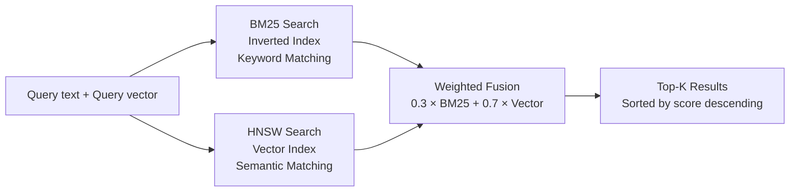

# Chapter 4: octos-memory: Engineering Hybrid Search

> **Positioning**: This chapter dives into the octos-memory crate (approximately 1,750 lines), showing how to build an embedded BM25 + HNSW hybrid search engine in pure Rust to give Agents long-term memory. Prerequisite: Chapter 2. Target audience: AI application developers who want to understand the internals of RAG (Retrieval-Augmented Generation) (Reader C), and Rust developers interested in embedded databases and search algorithms (Reader B).

One fundamental difference between an AI Agent and a chatbot is memory. Every chatbot conversation is independent—the code it helped you write last time, the decisions it made, the pitfalls it encountered are all forgotten by the next session. An Agent needs memory to accumulate experience: What coding style did the user prefer last time? Which files in this repository were recently modified? What strategy was used three days ago to fix a similar bug?

octos-memory implements this memory system in 1,750 lines of code. It depends on no external services—no Qdrant, no Milvus, no PostgreSQL. A single redb embedded database file plus an in-memory hybrid search index is everything it needs. This chapter starts from the storage layer and progressively dives into the engineering implementation of BM25 full-text search, HNSW vector indexing, and hybrid rank fusion.

---

## 4.1 Storage Selection: The redb Embedded Database

### 4.1.1 Why redb

The persistence layer of octos-memory uses redb (`crates/octos-memory/src/store.rs`), a pure Rust embedded key-value database. The most obvious alternative during the selection process was SQLite—the Rust ecosystem has a mature `rusqlite` binding.

The advantages of redb over SQLite are clear-cut in octos's context:

**Zero C dependencies.** SQLite is implemented in C, and `rusqlite` requires compiling C code or linking against a system library. This conflicts with octos's workspace-level `deny(unsafe_code)` policy—while SQLite's C code is of exceptionally high quality, it falls outside the Rust compiler's safety checks. redb is a pure Rust implementation, fully within the protection of `deny(unsafe_code)`.

**ACID transactions.** redb provides full ACID transaction support (with separate read and write transactions), sufficient for the persistence needs of episode storage. octos does not need SQL queries—all searching is performed on the in-memory hybrid index.

**Single-file deployment.** A redb database is a single file (`episodes.redb`), with no need for additional WAL or SHM files. This simplifies deployment and backup.

### 4.1.2 Three-Table Schema

The Episode Store defines three tables in redb (`store.rs:14-20`):

| Table Name | Key Type | Value Type | Purpose |
|------|---------|-----------|------|
| `EPISODES_TABLE` | `&str` (episode_id) | `&str` (JSON) | Episode metadata |
| `CWD_INDEX_TABLE` | `&str` (working directory path) | `&str` (JSON array) | Directory → Episode index |
| `EMBEDDINGS_TABLE` | `&str` (episode_id) | `&[u8]` (bincode) | Vector embeddings |

This design stores Episode data and vector embeddings separately. The benefit is that when vector search is not needed (e.g., when the embedding provider is unavailable), Episode storage and retrieval remain unaffected. Vector embeddings are serialized with `bincode` (much more compact than JSON), reducing storage and I/O overhead.

`CWD_INDEX_TABLE` is an auxiliary index that aggregates Episode IDs by working directory. When an Agent is working in a particular project directory, it prioritizes retrieving historical episodes from that directory, improving relevance.

---

## 4.2 Episode: The Agent's Experience Record

### 4.2.1 The Episode Struct

An Episode is an experience summary created after an Agent completes a task (`crates/octos-memory/src/episode.rs:21-43`):

```rust
pub struct Episode {
    pub schema_version: u32,     // Data format version
    pub id: String,              // UUID v7
    pub task_id: TaskId,
    pub agent_id: AgentId,
    pub working_dir: PathBuf,    // Task execution directory
    pub summary: String,         // Task summary
    pub outcome: EpisodeOutcome, // Result
    pub key_decisions: Vec<String>,  // Key decision records
    pub files_modified: Vec<PathBuf>,
    pub created_at: DateTime<Utc>,
}
```

**EpisodeOutcome** (`episode.rs:72-81`) has four variants: `Success`, `Failure`, `Blocked`, and `Cancelled`. These variants are close to the terminal-state vocabulary used by tasks, but they do not imply that every terminal task is automatically persisted as an Episode. Persistence depends on the upper-layer call path; the current main Agent loop writes `Success` episodes on normal end-turn paths when `save_episodes` is enabled.

The **`schema_version`** field (`episode.rs:24`) is key to forward compatibility. When the Episode format needs to be upgraded (e.g., adding new fields), older data can still be parsed correctly using the version number. The default value is `1` (`episode.rs:16-17`); during deserialization, if this field is missing from the JSON, the default value is automatically populated.

### 4.2.2 Write Timing

On the current main Agent path, Episodes are created and stored when an LLM response ends normally with `StopReason::EndTurn` or `StopSequence` and `save_episodes` is enabled (`crates/octos-agent/src/agent/loop_runner.rs:368-395`; storage is in `crates/octos-memory/src/store.rs:87-151`). The write process:

1. Serialize the Episode to JSON and store it in `EPISODES_TABLE`
2. Update `CWD_INDEX_TABLE` by appending the Episode ID to the list for the corresponding working directory
3. Update the in-memory hybrid search index (text portion)

Embeddings are not written synchronously by `store()`. The current implementation splits episode text and embedding into two phases: `store()` writes JSON and updates BM25; `store_embedding()` serializes the `Vec<f32>` with bincode into `EMBEDDINGS_TABLE` and calls `HybridIndex::add_embedding()` to attach an HNSW vector to an existing document. This keeps episode persistence independent from embedding-provider availability.

At startup, `EpisodeStore::open()` scans `EPISODES_TABLE` and `EMBEDDINGS_TABLE` and rebuilds the in-memory `HybridIndex`. redb is therefore the persistent source of truth; HNSW and the inverted index are rebuildable caches.

**Corruption recovery** (`store.rs:109-127`): The values in `CWD_INDEX_TABLE` are JSON arrays (`["id1", "id2", ...]`). If a previous write was interrupted by a crash, the JSON might be corrupted. The code attempts to salvage Episode IDs from corrupted JSON by splitting on quotation marks, rather than discarding the entire index. This defensive programming ensures that index data is not lost even after abnormal shutdowns.

**Deletion path** (`store.rs:291-370`): `delete_by_id()` removes the episode from `EPISODES_TABLE`, `CWD_INDEX_TABLE`, and `EMBEDDINGS_TABLE`. On the in-memory index side it calls `HybridIndex::remove()`, but that does not reorder the HNSW doc index. Instead it clears `ids[pos]` as a tombstone and search filters empty IDs. This is a common ANN-index trade-off: deletion is fast and indices remain stable, at the cost of needing a future rebuild to compact tombstones.

---

## 4.3 BM25 Full-Text Search

BM25 (Best Matching 25) is one of the most classic ranking algorithms in information retrieval. octos-memory maintains an inverted index in memory to implement BM25 search (`crates/octos-memory/src/hybrid_search.rs`).

### 4.3.1 Inverted Index Structure

```rust
// hybrid_search.rs:8-28 (simplified)
struct HybridIndex {
    inverted: HashMap<String, Vec<(usize, u32)>>,  // term -> [(doc_id, term_freq)]
    doc_lengths: Vec<usize>,                         // Length of each document
    total_len: usize,                                // Sum of all document lengths
    avg_dl: f64,                                     // Average document length
    ids: Vec<String>,                                // Episode ID list
    // ... HNSW-related fields
}
```

`inverted` is the core of the inverted index: given a term (e.g., "refactor"), it can quickly find all documents containing that term along with its occurrence frequency.

**Tokenization strategy** (`hybrid_search.rs:288-295`):

```rust
fn tokenize(text: &str) -> Vec<String> {
    text.to_lowercase()
        .split(|c: char| !c.is_alphanumeric())
        .filter(|s| s.len() >= 2)
        .map(String::from)
        .collect()
}
```

This uses the simplest possible tokenization: lowercase the text, split on non-alphanumeric characters, and filter out tokens shorter than 2 characters. For Chinese text, this does **not** automatically split every character. A continuous Chinese span such as `中文测试` remains one token; `中文 测试` becomes two tokens because the space is a delimiter. Mixed Chinese/English spans such as `重构parser模块` also remain one token. This is weaker than a specialized tokenizer such as jieba, but it keeps the memory layer dependency-free and predictable for short experience summaries.

### 4.3.2 The BM25 Scoring Formula

The core BM25 formula (`hybrid_search.rs:251-285`):

```
score(q, d) = Σ IDF(qi) × (tf(qi, d) × (K1 + 1)) / (tf(qi, d) + K1 × (1 - B + B × |d| / avgdl))
```

Parameters used by octos (`hybrid_search.rs:31-32`):

| Parameter | Value | Meaning |
|------|-----|------|
| K1 | 1.2 | Term frequency saturation control. Higher values give more weight to high-frequency terms |
| B | 0.75 | Document length normalization. B=0 ignores length differences; B=1 fully normalizes by length |

These two parameter values are classic defaults validated through decades of practice in information retrieval (originating from TREC evaluation experiments). octos adopts them directly rather than performing custom tuning.

**IDF calculation** (`hybrid_search.rs:259`):

```rust
let idf = ((n as f64 - df as f64 + 0.5) / (df as f64 + 0.5) + 1.0).ln();
```

IDF (Inverse Document Frequency) measures how discriminative a term is: terms that appear in many documents (e.g., "code", "modify") have lower IDF, while terms that appear in fewer documents (e.g., "deadlock", "HNSW") have higher IDF.

### 4.3.3 Epsilon Guard Against NaN

The BM25 score normalization step (`hybrid_search.rs:271-284`) contains a subtle engineering detail:

```rust
let max_score = bm25_scores.values().cloned().fold(f64::NEG_INFINITY, f64::max);
if max_score < 1e-10 {
    return HashMap::new(); // All scores near zero; return empty results
}
// Normalize to [0, 1]
let normalized = score / max_score;
```

The `1e-10` threshold check prevents division by a near-zero number. When all documents have extremely small BM25 scores (e.g., when query terms do not appear in any document), dividing by `max_score` directly would amplify floating-point noise. By returning empty results early, this problem is avoided.

This may seem like a trivial detail, but NaN propagation is extremely aggressive—once a NaN appears, all subsequent sorting and fusion operations produce incorrect results, and no error is raised (in floating-point arithmetic, comparisons with NaN always return false). This class of bug is extremely difficult to track down.

---

## 4.4 HNSW Vector Index

### 4.4.1 A Brief Introduction to HNSW

HNSW (Hierarchical Navigable Small World) is one of the most popular approximate nearest neighbor (ANN) search algorithms today. It builds a multi-layer graph structure:

- **Bottom layer (Layer 0)**: Contains all data points, with each point connected to at most M nearest neighbors
- **Upper layers (Layer 1, 2, ...)**: Contain only a subset of data points, forming "highways"—search begins at the highest layer, quickly locating the target region, then descends layer by layer for fine-grained search

This hierarchical structure reduces search complexity from linear O(N) to logarithmic O(log N).

### 4.4.2 HNSW Configuration in octos

octos uses the `hnsw_rs` crate to build the vector index (`hybrid_search.rs:41-47`):

| Parameter | Value | Meaning |
|------|-----|------|
| `max_nb_connection` | 16 | Maximum number of edges per node (M parameter) |
| `capacity` | 10,000 | Pre-allocated slot count |
| `ef_construction` | 200 | Search width during construction (higher = more accurate but slower) |
| `max_layer` | 16 | Maximum number of layers |

A capacity of 10,000 is more than sufficient for an Agent's experience storage—even at 10 tasks per day, it would take nearly 3 years to reach the limit. The index prints warnings when capacity reaches 80% and 100% (`hybrid_search.rs:86-98`).

### 4.4.3 L2 Normalization and Cosine Similarity

The distance metric for vector search uses cosine similarity, but internally HNSW uses `DistCosine` distance (`hybrid_search.rs:137`). The relationship between the two is:

```
similarity = 1.0 - distance
```

To ensure the correctness of cosine similarity, all embedding vectors are L2-normalized before insertion into the index (`hybrid_search.rs:297-305`):

```rust
fn l2_normalize(v: &[f32]) -> Option<Vec<f32>> {
    let norm: f32 = v.iter().map(|x| x * x).sum::<f32>().sqrt();
    if norm < f32::EPSILON {
        return None;  // Zero vectors cannot be normalized
    }
    Some(v.iter().map(|x| x / norm).collect())
}
```

**Zero vector protection**: The `norm < f32::EPSILON` check (`hybrid_search.rs:301`) prevents division by zero. When an embedding provider returns an all-zero vector (possibly due to a model error or empty input), the normalization function returns `None`, and the document is not added to the vector index (but can still be found via BM25 search).

---

## 4.5 Hybrid Rank Fusion

The core value of hybrid search lies in combining BM25's precise keyword matching with vector search's semantic understanding. octos employs a simple weighted fusion strategy.

### 4.5.1 Fusion Pipeline



**Figure 4-1: Hybrid search pipeline.** The query is processed through both BM25 and HNSW paths simultaneously, and the results are fused via weighted summation.

### 4.5.2 Weight Configuration

Default weights (`hybrid_search.rs:35-37`):

```rust
const DEFAULT_VECTOR_WEIGHT: f32 = 0.7;
const DEFAULT_BM25_WEIGHT: f32 = 0.3;
```

The vector search weight (0.7) is higher than BM25 (0.3) because semantic similarity is generally more valuable than exact keyword matching in Agent experience retrieval. For example, a query for "how to resolve a concurrency deadlock" should be able to find a previously recorded episode about "using Mutex ordering to avoid circular waits," even though the two share no common keywords.

Weights can be configured via the `with_weights()` method (`hybrid_search.rs:72-76`) to adapt to different use cases.

### 4.5.3 Fusion Algorithm

Fusion logic (`hybrid_search.rs:221-237`):

```rust
// For each candidate document, calculate the final score
for doc_id in all_candidates {
    let vec_score = vector_scores.get(doc_id).unwrap_or(&0.0);
    let bm25_score = bm25_scores.get(doc_id).unwrap_or(&0.0);
    let score = self.vector_weight * vec_score + self.bm25_weight * bm25_score;
    results.push((doc_id, score));
}
```

The candidate set is the union of results from both search paths—even if a document appears only in the BM25 results (with a vector score of 0), it can still enter the final ranking through its BM25 score. This ensures that precise keyword matches are not completely drowned out by semantic search.

The current implementation has one more important detail: it only applies `vector_weight` / `bm25_weight` when `vector_scores` is non-empty. If there are no usable vector results, it uses the normalized BM25 score directly instead of multiplying BM25 by 0.3. This avoids artificially suppressing all scores in the BM25-only fallback path.

### 4.5.4 Degradation Strategy Without Embeddings

When the embedding provider is unavailable (API key not configured, or provider temporarily unreachable), the system automatically degrades to pure BM25 search:

1. **At insertion time**: `insert()` accepts `embedding: Option<&[f32]>`; when None, only the inverted index is updated
2. **At search time**: When `query_embedding` is None, all vector scores are 0, and the final score is determined entirely by BM25
3. **When the index is empty**: If the hybrid index contains no documents, it falls back to directly scanning the redb database (`store.rs:171-187`), providing basic retrieval through CWD indexing and term matching

This three-tier degradation (hybrid search → BM25 only → DB scan) ensures that the memory system can always provide results under any conditions, with precision decreasing at each level.

---

## 4.6 MemoryStore: Markdown-Based Persistent Memory

In addition to the Episode Store's structured memory, octos-memory also provides MemoryStore (`crates/octos-memory/src/memory_store.rs`)—a simple memory system based on Markdown files.

### 4.6.1 Three Forms of Memory

| Form | File | Characteristics |
|------|------|------|
| Long-term memory | `MEMORY.md` | Single file, full replacement |
| Daily notes | `YYYY-MM-DD.md` | One file per day, append-only |
| Entity bank | `bank/entities/<slug>.md` | One file per topic, with summary injection and on-demand full recall |

### 4.6.2 7-Day Memory Window

`get_memory_context()` (`memory_store.rs:102-147`) reads the most recent 7 days of notes when building the Agent's memory context (`memory_store.rs:110`):

```rust
let recent = self.read_recent(7).await?;
```

The 7-day window is a pragmatic choice: too short (e.g., 1 day) loses recent context; too long (e.g., 30 days) introduces too much noise and consumes the LLM's context window. Seven days roughly corresponds to a work week and covers most "I did something similar last time" memory needs.

Experiences older than 7 days do not disappear—they still exist in the Episode Store and can be retrieved through hybrid search. The 7-day window only affects the amount of context automatically injected into the system prompt.

### 4.6.3 Memory Bank: Two-Level Retrieval

The current MemoryStore also includes an entity bank (`memory_store.rs:153-241`). It stores stable facts as Markdown files under `memory/bank/entities/<slug>.md`. This is not full-text search; it is a two-level prompt mechanism:

1. **Level 1: Summary index.** `get_bank_summary()` scans all entity files, skips YAML frontmatter, extracts the first non-empty non-heading line as a 100-character abstract, and injects `- **name**: abstract` into the system prompt. Both `chat` and `gateway` append this Memory Bank summary after long-term memory and daily notes.
2. **Level 2: On-demand full content.** When the abstract is insufficient, the Agent calls the `recall_memory` tool to load the full entity page. The tool trims the requested name, lowercases it, replaces spaces with `-`, and reads the corresponding Markdown file through `read_entity()`.

Writes go through the `save_memory` tool. It expects content to start with a heading and a one-line summary. When updating an existing entity, it first reads the previous content and returns it in the tool result, warning the caller not to discard existing facts. `save_memory` has `Exclusive` concurrency class so reads/writes to the Memory Bank are serialized within a tool batch.

---

> ### Engineering Decision Sidebar: Why Not Use an External Vector Database Like Qdrant/Milvus
>
> In the AI application space, vector databases like Qdrant, Milvus, and Pinecone are mainstream choices. octos chose an embedded solution over these for the following reasons.
>
> **Option A: External Vector Database (Qdrant/Milvus/Pinecone)**
>
> Advantages:
> - Supports millions or even billions of vectors
> - Rich index types and query capabilities (filtering, multi-vector, sparse vectors)
> - Distributed scaling capabilities
> - Mature operational tooling and monitoring
>
> Disadvantages:
> - Increases deployment complexity—users need to run an additional service
> - Network latency (even local deployments incur IPC overhead)
> - Operational costs (backup, upgrades, monitoring)
> - Startup dependency—if the vector database is unavailable, the entire Agent cannot function
>
> **Option B: Embedded Solution (redb + hnsw_rs)**
>
> Advantages:
> - Zero deployment dependencies—`cargo install` or download a binary and you're ready to go
> - Zero network latency—search completes within the process
> - Zero operations—the database is a single file that is backed up and migrated alongside the Agent
> - Graceful degradation—even without an embedding provider, BM25 search remains available
>
> Disadvantages:
> - Scale ceiling (10,000 vectors, limited by single-machine memory)
> - Limited search functionality (no filtering, no multi-vector support)
> - Non-distributed (single instance)
>
> **octos's choice: the embedded solution.**
>
> The key insight is the difference in scale requirements. RAG applications need to search across millions of documents—that is the home turf of external vector databases. But an Agent's experience memory accumulates incrementally: a few to a few dozen episodes per day, potentially only a few thousand over a year. The 10,000 capacity ceiling is more than sufficient for the vast majority of use cases.
>
> More importantly, consider the deployment experience. octos's target users include individual developers and small teams—they may just want to start an Agent with a single command, not deploy a vector database infrastructure first. The embedded solution lets octos maintain its "download and run" simplicity.

---

## 4.7 Chapter Summary

octos-memory builds a self-contained Agent memory system in 1,748 lines of code:

1. **redb embedded storage**: Three tables (Episodes / CWD index / vector embeddings), pure Rust implementation, ACID transaction guarantees, single-file deployment.

2. **BM25 full-text search**: Classic K1=1.2 / B=0.75 parameters, inverted index + IDF weighting, epsilon guard against NaN during normalization.

3. **HNSW vector index**: The `hnsw_rs` crate provides hierarchical graph search, L2 normalization ensures cosine similarity correctness, and zero vector protection prevents index pollution.

4. **Hybrid rank fusion**: 0.7 vector + 0.3 BM25 weighted summation, candidate set as the union of both paths, three-tier degradation (hybrid → BM25 → DB scan) ensures results are returned under any conditions.

5. **Markdown + Memory Bank**: `MEMORY.md`, daily notes, and the entity bank form prompt-side memory. Entity abstracts are injected automatically; full pages are loaded on demand through `recall_memory`.

The next chapter moves into octos-agent, where we will see how the Agent main loop uses these types and memory capabilities to orchestrate a complete conversation.

---

## Further Reading

- **BM25 algorithm**: Robertson & Zaragoza, "The Probabilistic Relevance Framework: BM25 and Beyond" (Foundation and Trends in IR, 2009)
- **HNSW algorithm**: Malkov & Yashunin, "Efficient and Robust Approximate Nearest Neighbor using Hierarchical Navigable Small World Graphs" (IEEE TPAMI, 2020)
- **redb**: https://docs.rs/redb/latest/redb/ — Pure Rust embedded database
- **hnsw_rs**: https://docs.rs/hnsw_rs/latest/hnsw_rs/ — Rust HNSW implementation
- **Hybrid search**: Anthropic's "Contextual Retrieval" blog post discusses the complementary value of BM25 + vector search

## Discussion Questions

1. **BM25 parameter tuning**: If an Agent primarily handles Chinese-language tasks, do the K1 and B parameters need adjustment? How does the granularity of Chinese tokenization (single characters vs. word segments) affect BM25 retrieval effectiveness?

2. **Embedding dimension selection**: octos defaults to 1536-dimensional vectors (OpenAI text-embedding-3-small). If switching to a lightweight 384-dimensional model, what are the respective impacts on retrieval quality and memory usage?

3. **Dynamic weight adjustment for hybrid search**: Is the fixed 0.7/0.3 weight split optimal? Imagine a strategy that dynamically adjusts weights based on query type—keyword-exact queries lean toward BM25, while open-ended semantic queries lean toward vector search. What architectural changes would this require?

4. **Scale bottleneck**: If octos needed to support enterprise-scale deployment (100,000 episodes), what modifications would the current embedded solution require? Is there a middle ground between "embedded" and "external database"?

---

> **Version Evolution Note**
> This chapter is based on the current `../octos` main branch. The octos-memory crate lives under `crates/octos-memory/src/` and contains 1,748 lines. Compared with earlier versions, the MemoryStore entity bank is now wired into `save_memory` / `recall_memory` tools and system-prompt summary injection; EpisodeStore also supports post-write embeddings and tombstone deletion.
