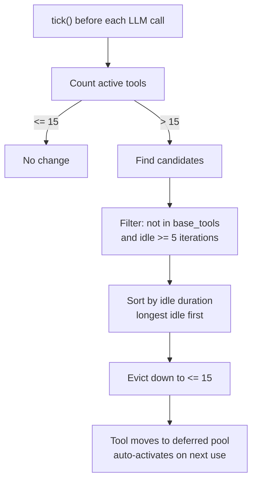

# Chapter 6: Tool System: Design Patterns of Built-in Tools

> **Positioning**: This chapter dives deep into the core of the "act" phase in the Agent Loop -- the tool system. It presents the design of the `Tool` trait, the ToolRegistry's registration and LRU eviction mechanism, ToolPolicy's deny-wins security semantics, and parameter safety measures. Prerequisites: Chapter 5. Applicable to AI application developers who want to understand Agent tool architecture (Reader C), and developers who want to contribute new tools to octos (Reader D).

An Agent's "intelligence" comes from the LLM, but an Agent's "capability" comes from tools. Without tools, an Agent can only generate text; with tools, an Agent can read and write files, execute commands, search the web, and manage Git repositories. octos ships with 13 core tools (plus feature-gated `git` and `code_structure`), along with management and research utility tools.

But tools bring risk alongside capability: every tool call is a potential attack surface. How do you provide open capabilities while controlling risk? octos's answer is three lines of defense: ToolPolicy controls which tools are available, parameter validation controls input safety, and symlink-safe I/O controls filesystem access boundaries.

---

## 6.1 Tool Trait: The Minimal Tool Interface

The Tool trait (`crates/octos-agent/src/tools/mod.rs:56-82`) defines the unified interface for all tools:

```rust
pub trait Tool: Send + Sync {
    fn name(&self) -> &str;
    fn description(&self) -> &str;
    fn input_schema(&self) -> serde_json::Value;
    fn tags(&self) -> &[&str] { &[] }
    async fn execute(&self, args: &serde_json::Value) -> Result<ToolResult>;
}
```

Conceptually, the `Tool` trait can be understood in two parts:

**The declaration part** (`name()` + `description()` + `input_schema()`) constitutes a `ToolSpec`, which is sent to the LLM so it knows what tools are available and how to call them. `input_schema()` returns a parameter description in JSON Schema format.

**The execution part** (`execute()`) receives the parameter JSON from the LLM, performs the actual operation, and returns a `ToolResult`:

```rust
pub struct ToolResult {
    pub output: String,              // Text output returned to the LLM
    pub success: bool,               // Whether the operation succeeded
    pub file_modified: Option<PathBuf>, // File that was modified
    pub files_to_send: Vec<PathBuf>,  // Files that need to be sent to the user
    pub tokens_used: Option<TokenUsage>, // Token consumption from sub-Agent tools
}
```

`tags()` supports tool categorization (e.g., `["fs"]`, `["web"]`), working in conjunction with ToolPolicy's tag filtering. The default returns an empty slice, indicating the tool is general-purpose and not subject to tag restrictions.

---

## 6.2 ToolRegistry: Registration and LRU Eviction

### 6.2.1 Registration Mechanism

ToolRegistry (`crates/octos-agent/src/tools/registry.rs:56-705`) is the central manager for tools. `with_builtins_and_sandbox()` (`registry.rs:606-625`) registers all built-in tools:

| Tool Name | Type | Function |
|-----------|------|----------|
| `shell` | ShellTool | Execute shell commands (sandboxed) |
| `read_file` | ReadFileTool | Read file contents |
| `write_file` | WriteFileTool | Write to files |
| `edit_file` | EditFileTool | Edit files (exact replacement) |
| `diff_edit` | DiffEditTool | Diff-format editing |
| `glob` | GlobTool | File pattern search |
| `grep` | GrepTool | Content search |
| `list_dir` | ListDirTool | Directory listing |
| `web_search` | WebSearchTool | Web search |
| `web_fetch` | WebFetchTool | Fetch web page content |
| `browser` | BrowserTool | Browser automation |
| `git` | GitTool | Git operations (feature: git) |
| `code_structure` | CodeStructureTool | AST code structure (feature: ast) |

Additionally, there are lazily activated utility tools: `spawn` (background tasks), `deep_search` (deep search), `recall_memory`/`save_memory` (memory operations), `manage_skills` (skill management), and others.

### 6.2.2 LRU Eviction Mechanism

LLM tool calling works by including ToolSpecs in the request -- each ToolSpec consumes tokens from the context window. When 30+ tools are registered, tool declarations alone can consume thousands of tokens. The LRU eviction mechanism solves this problem.

ToolLifecycle (`mod.rs:88-99`) manages tool activation states:

```rust
pub struct ToolLifecycle {
    pub(crate) last_used: HashMap<String, u32>,  // Tool name -> last used iteration number
    pub(crate) iteration: u32,                   // Current iteration counter
    pub(crate) base_tools: HashSet<String>,      // Core tools that are never evicted
    pub(crate) max_active: usize,                // Default 15
    pub(crate) idle_threshold: u32,              // Default 5
}
```

| Parameter | Default | Description |
|-----------|---------|-------------|
| `max_active` | 15 | Maximum number of simultaneously active tools |
| `idle_threshold` | 5 | Eligible for eviction after N idle iterations |



**Figure 6-1: LRU tool eviction flow.** Evicted tools are not deleted -- they move to a deferred pool and are automatically reactivated when the LLM requests them next.

### 6.2.3 Eviction Algorithm Source Walkthrough

`tick()` is minimal -- it increments the iteration counter before each LLM call (`mod.rs:130-132`):

```rust
pub fn tick(&mut self) { self.iteration += 1; }
```

The core logic is in `find_evictable()` (`mod.rs:137-160`):

```rust
pub fn find_evictable(&self, active_tools: &[&str]) -> Vec<String> {
    if active_tools.len() <= self.max_active {
        return Vec::new();  // Under limit, no eviction
    }

    let mut candidates: Vec<(&str, u32)> = active_tools.iter()
        .filter(|name| !self.base_tools.contains(**name))   // Exclude core tools
        .map(|name| (*name, self.last_used.get(*name).copied().unwrap_or(0)))
        .filter(|(_, last)| self.iteration.saturating_sub(*last) >= self.idle_threshold)
        .collect();                                          // Only take idle >= 5

    candidates.sort_by_key(|(_, last)| *last);              // Oldest first for eviction
    let to_evict = active_tools.len().saturating_sub(self.max_active);
    candidates.into_iter().take(to_evict)                   // Only evict the excess
        .map(|(name, _)| name.to_string()).collect()
}
```

Three key design choices:

**`base_tools` filtering.** Core tools like `shell` and `read_file` are never eviction candidates -- even if all 15 slots are occupied by core tools.

**`idle_threshold` protection.** Only tools idle for >= 5 iterations are considered. This prevents the "evicted right after use" thrashing problem.

**Minimal eviction.** Only `active_count - max_active` tools are evicted -- just enough to bring the active count back down to 15, rather than aggressively clearing all candidates.

**Where do evicted tools go?** They move to the registry's `deferred` set. The next time the LLM requests an evicted tool, `activate_on_demand()` automatically moves it from deferred back to active. This reactivation is completely transparent to the LLM.

**LRU state is per-session.** In Gateway/Serve mode, each session actor holds its own ToolRegistry (see Chapter 11), and LRU counters are completely independent between sessions.

**`spawn_only`** tools (such as background task tools) are permanently in the deferred state -- they don't appear in the LLM's tool list, don't consume active slots, and only execute when invoked by specific workflows.

---

## 6.3 ToolPolicy: deny-wins Security Semantics

ToolPolicy (`crates/octos-agent/src/tools/policy.rs`) controls which tools are available and which are forbidden.

### 6.3.1 The deny-wins Rule

```rust
pub fn is_allowed(&self, tool_name: &str) -> bool {
    // 1. Check deny list first -- deny always takes priority
    for entry in &self.deny {
        if entry_matches(entry, tool_name) {
            return false;
        }
    }
    // 2. Empty allow list = allow all tools not denied
    if self.allow.is_empty() {
        return true;
    }
    // 3. Non-empty allow list = only allow listed tools
    self.allow.iter().any(|entry| entry_matches(entry, tool_name))
}
```

deny-wins means: if a tool appears in both the allow and deny lists, it is forbidden. This is a fundamental principle of security policy -- explicitly forbidden rules should never be overridden by any allow rule.

### 6.3.2 Wildcards and Groups

The policy supports two matching extensions:

**Wildcards**: `web_*` matches `web_search`, `web_fetch`. Only trailing wildcards (prefix matching) are supported.

**Groups**: `group:fs` expands to `["read_file", "write_file", "edit_file", "diff_edit"]`. Predefined groups include:

| Group | Included Tools |
|-------|---------------|
| `group:fs` | read_file, write_file, edit_file, diff_edit |
| `group:runtime` | shell |
| `group:web` | web_search, web_fetch, browser |
| `group:search` | glob, grep, list_dir |
| `group:sessions` | spawn |
| `group:memory` | recall_memory, save_memory |

### 6.3.3 Provider-Level Policy

The `tools.byProvider` configuration allows setting different tool policies per LLM Provider. For example, you can restrict more expensive Providers to only basic tools:

```json
{
  "tools": {
    "byProvider": {
      "anthropic": { "deny": ["browser", "deep_search"] },
      "ollama": { "allow": ["read_file", "shell", "grep"] }
    }
  }
}
```

Provider-level policies are applied through `set_provider_policy()`, affecting both `specs()` output (hiding tools from the LLM's perspective) and `execute()` calls (blocking execution of forbidden tools).

---

## 6.4 Parameter Safety: 1MB Limit and Zero-Allocation Estimation

### 6.4.1 1MB Parameter Size Limit

Tool call parameter size is limited to 1MB (`registry.rs:576`):

```rust
const MAX_ARGS_SIZE: usize = 1_048_576; // 1 MB
```

This prevents the LLM from generating enormous parameters (such as passing an entire file's content as an `edit_file` argument), avoiding memory exhaustion or downstream processing timeouts.

### 6.4.2 estimate_json_size: Zero-Allocation Size Estimation

The parameter size check doesn't serialize via `serde_json::to_string()` and then measure the length (which would allocate a complete JSON string). Instead, it recursively traverses the JSON value tree to estimate the size (`registry.rs:25-54`):

```rust
fn estimate_json_size(value: &serde_json::Value) -> usize {
    match value {
        Null => 4,           // "null"
        Bool(true) => 4,     // "true"
        Bool(false) => 5,    // "false"
        Number(n) => n.to_string().len(),
        String(s) => s.len() + escape_count(s) + 2, // content + escapes + quotes
        Array(arr) => 2 + arr.iter().map(estimate_json_size).sum::<usize>() + commas,
        Object(obj) => 2 + obj.iter().map(|(k, v)| k.len() + 3 + estimate_json_size(v)).sum::<usize>() + commas,
    }
}
```

This estimation runs in O(N) time with O(depth) stack space -- no heap allocation, just traversing the existing JSON tree. For a 1MB-level check, byte-level accuracy doesn't matter; order-of-magnitude correctness is sufficient.

### 6.4.3 Symlink-safe I/O: O_NOFOLLOW

File operation tools (`read_file`, `write_file`, etc.) use the `O_NOFOLLOW` flag when opening files (`mod.rs:314-376`):

```rust
// Unix platform
opts.custom_flags(libc::O_NOFOLLOW);
```

`O_NOFOLLOW` causes the `open()` system call to return an `ELOOP` error immediately when the target is a symbolic link, rather than following the link to open the target file. This eliminates TOCTOU (Time-of-Check-Time-of-Use) race conditions:

Without `O_NOFOLLOW`:
1. Check that `/workspace/config.json` is within the allowed scope -- PASS
2. Attacker replaces `/workspace/config.json` with a symlink pointing to `/etc/passwd`
3. Open `/workspace/config.json`, which actually reads `/etc/passwd`

With `O_NOFOLLOW`:
1. Open `/workspace/config.json` -- if it's a symlink, immediately return `ELOOP` -- BLOCKED

The check and open are merged into a single atomic operation, eliminating the race window.

---

> ### Engineering Decision Sidebar: Why LRU Eviction Rather Than Full Registration
>
> There are three possible strategies for tool management:
>
> **Option A: Full Registration (all tools always visible)**
>
> Advantages:
> - Simple -- no eviction logic needed
> - LLM can always call any tool
>
> Disadvantages:
> - ToolSpecs for 30+ tools can consume 3,000-5,000 tokens from the context window
> - For 128K-window models, 5,000 tokens of tool declarations is a small fraction, but for 8K-window small models it's unacceptable
> - Too many choices can cause LLM decision paralysis ("tool overload")
>
> **Option B: On-Demand Loading (only load when LLM requests)**
>
> Advantages:
> - Most context-window efficient
>
> Disadvantages:
> - LLM cannot request tools it doesn't know about -- requires an additional "discovery" mechanism
> - Increases interaction rounds (discover first, then use)
>
> **Option C: LRU Eviction (octos's choice)**
>
> 15 active slots is a balance point -- enough to cover a typical task's tool needs (file operations + shell + search = roughly 8-10 tools), while leaving room for dynamically activated research and management tools. The 5-iteration idle eviction threshold ensures tools aren't evicted just because of brief non-use -- only persistently inactive tools are reclaimed.
>
> The key design is automatic reactivation: evicted tools don't disappear. The LLM can reactivate them through the `activate_tools` tool or by requesting them directly. This makes LRU eviction nearly transparent to the LLM -- it doesn't need to know about tool management details.

---

## 6.5 Chapter Summary

The tool system is the vehicle for Agent capabilities:

1. **Tool trait**: `name()`/`description()`/`input_schema()` form the LLM-visible ToolSpec, while `execute()` performs the actual operation. The minimal interface means developing a new tool only requires implementing these few methods.

2. **ToolRegistry**: Centralized registration + LRU eviction. 15 active slots balance context window cost against tool availability. Evicted tools are automatically reactivated.

3. **ToolPolicy**: deny-wins semantics ensure security policies cannot be overridden. Wildcards and groups simplify policy configuration. Provider-level policies enable differentiated access control.

4. **Parameter safety**: 1MB size limit + zero-allocation estimation prevent DoS. `O_NOFOLLOW` eliminates symlink TOCTOU races.

The next chapter dives deeper into other layers of the security system -- from sandbox isolation to prompt injection defense (see Chapter 7).

---

## Further Reading

- **JSON Schema**: https://json-schema.org/ -- understanding the tool parameter description format returned by `input_schema()`
- **TOCTOU Races**: CWE-367 "Time-of-check Time-of-use" -- understanding the attack pattern defended against by `O_NOFOLLOW`
- **LLM Tool Calling**: Anthropic "Tool use" documentation -- understanding how LLMs select and invoke tools
- **LRU Cache Algorithm**: The classic Least Recently Used eviction strategy

## Discussion Questions

1. **Token cost of tool declarations**: Assuming each ToolSpec consumes an average of 150 tokens, 15 active tools consume 2,250 tokens. If the context window is only 8K tokens, tool declarations account for 28%. How would you further compress the token footprint of ToolSpecs?

2. **Limitations of deny-wins**: The deny-wins policy can prevent a tool from being called directly, but if the Agent uses the `shell` tool to run a `curl` command as a substitute for the denied `web_fetch`, the policy is bypassed. How would you address this kind of indirect invocation?

3. **Security review of custom tools**: If users add custom tools via MCP or Plugins, those tools are not protected by octos's `O_NOFOLLOW`. How would you design a tool sandbox to isolate third-party tools?

---

> **Version Evolution Note**
> This chapter's analysis is based on octos v0.1.0, with the tool system located in `crates/octos-agent/src/tools/`. As of the time of writing, the built-in tool list may expand with version updates, but the core designs of Tool trait, ToolPolicy, and the LRU mechanism have not undergone major changes.
