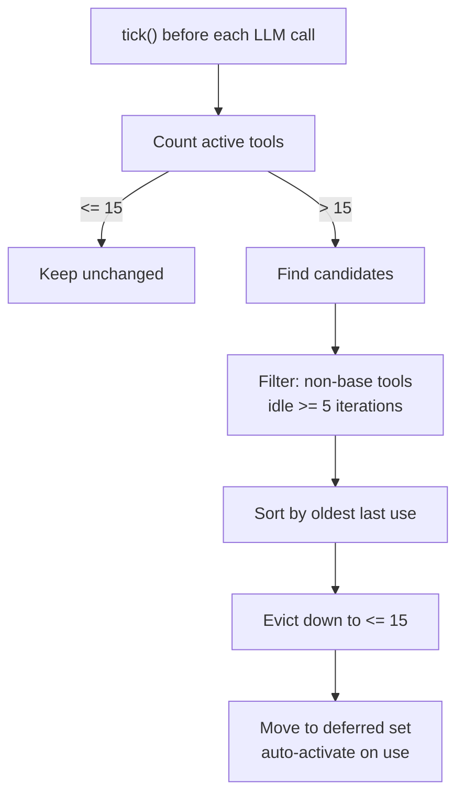

# Chapter 6: Tool System: Design Patterns of Built-in Tools

> **Positioning**: This chapter dives into the "act" phase of the Agent Loop: the tool system. It explains the `Tool` trait, layered `ToolRegistry` registration, LRU-style tool exposure control, ToolPolicy's deny-wins semantics, and parameter safety. Prerequisite: Chapter 5. Use when you need to understand octos tool architecture or contribute a new tool.

An Agent's intelligence comes from the LLM, but its capability comes from tools. Without tools, an Agent can only generate text. With tools, it can read and write files, run commands, search the web, and manage repositories. The current source does not have one stable "total tool count": `ToolRegistry::with_builtins_and_sandbox()` registers 11 base tools, `git` and `code_structure` are Cargo-feature gated, `configure_tool` is injected by configuration, and tools such as `spawn`, `message`, `send_file`, `deep_search`, `manage_skills`, and `model_check` are added by chat, gateway, and session actors in different runtime modes (`../octos/crates/octos-agent/src/tools/registry.rs:605-624`, `../octos/crates/octos-agent/src/tools/registry.rs:688-703`, `../octos/crates/octos-cli/src/commands/chat.rs:162-269`, `../octos/crates/octos-cli/src/commands/gateway/gateway_runtime.rs:797-870`, `../octos/crates/octos-cli/src/session_actor.rs:515-590`). Understanding this layered registration model is more important than memorizing a fixed number.

Tools also expand the attack surface. octos uses three main lines of defense: ToolPolicy controls which tools are available, parameter validation controls input size and shape, and symlink-safe I/O controls filesystem boundaries.

---

## 6.1 Tool Trait: A Minimal Tool Interface

The `Tool` trait (`../octos/crates/octos-agent/src/tools/mod.rs:56-81`) defines the shared interface for all tools:

```rust
pub trait Tool: Send + Sync {
    fn name(&self) -> &str;
    fn description(&self) -> &str;
    fn input_schema(&self) -> serde_json::Value;
    fn tags(&self) -> &[&str] { &[] }
    async fn execute(&self, args: &serde_json::Value) -> Result<ToolResult>;
    fn as_any(&self) -> &dyn std::any::Any { &() }
}
```

The trait has three responsibilities.

**Declaration**: `name()`, `description()`, and `input_schema()` form the `ToolSpec` sent to the LLM. The schema is JSON Schema describing how to call the tool.

**Execution**: `execute()` receives model-generated JSON arguments and returns a `ToolResult`:

```rust
pub struct ToolResult {
    pub output: String,
    pub success: bool,
    pub file_modified: Option<PathBuf>,
    pub files_to_send: Vec<PathBuf>,
    pub tokens_used: Option<TokenUsage>,
}
```

**Integration**: `tags()` labels tool capabilities, while `as_any()` gives the framework a narrow downcast escape hatch. For example, `activate_tools` needs a back-reference to `ToolRegistry` after the Agent is built (`../octos/crates/octos-agent/src/agent/mod.rs:190-198`).

`tags()` affects at least two filters:

- `ToolPolicy::require_tags` filters provider-visible tools through `is_allowed_with_tags()`.
- `ToolRegistry::set_context_filter()` filters the `specs()` output by context tags.

Both paths treat tools with no tags as universal tools, so they remain visible unless a name policy denies them (`../octos/crates/octos-agent/src/tools/policy.rs:45-72`, `../octos/crates/octos-agent/src/tools/registry.rs:222-257`).

Tool execution also keeps the trait small by not passing reporter handles or progress callbacks through the method signature. Long-running tools receive that state through the task-local `TOOL_CTX` (`../octos/crates/octos-agent/src/tools/mod.rs:13-25`).

---

## 6.2 ToolRegistry: Registration and LRU Eviction

### 6.2.1 Registration

`ToolRegistry` (`../octos/crates/octos-agent/src/tools/registry.rs:56-703`) is not "all tools registered once". It provides a base registry, and chat, gateway, and session actors layer additional tools on top.

`with_builtins_and_sandbox()` registers 11 base tools plus two feature-gated tools:

| Tool | Type | Role |
|------|------|------|
| `shell` | ShellTool | Run shell commands under sandbox policy |
| `read_file` | ReadFileTool | Read file contents |
| `write_file` | WriteFileTool | Write files |
| `edit_file` | EditFileTool | Exact replacement editing |
| `diff_edit` | DiffEditTool | Diff-style editing |
| `glob` | GlobTool | File pattern search |
| `grep` | GrepTool | Content search |
| `list_dir` | ListDirTool | Directory listing |
| `web_search` | WebSearchTool | Web search |
| `web_fetch` | WebFetchTool | Fetch web content |
| `browser` | BrowserTool | Browser automation |
| `git` | GitTool | Git operations, gated by feature `git` |
| `code_structure` | CodeStructureTool | AST structure, gated by feature `ast` |

Runtime registration is layered:

| Layer | Location | Typical tools |
|-------|----------|---------------|
| Base | `../octos/crates/octos-agent/src/tools/registry.rs:605-624` | `shell`, `read_file`, `web_search`, `browser` |
| Config | `../octos/crates/octos-agent/src/tools/registry.rs:688-703` | `configure_tool`, configured web tools |
| Chat additions | `../octos/crates/octos-cli/src/commands/chat.rs:184-255` | `spawn`, `synthesize_research`, `recall_memory`, `save_memory`, `run_pipeline` |
| Gateway additions | `../octos/crates/octos-cli/src/commands/gateway/gateway_runtime.rs:797-870` | `manage_skills`, `synthesize_research`, `recall_memory`, `save_memory`, `model_check` |
| Per-session additions | `../octos/crates/octos-cli/src/session_actor.rs:515-590` | `message`, `send_file`, `spawn`, `cron`, per-session `run_pipeline` |

This is why `tools/mod.rs` can mislead readers. It exports available tool types; it is not the default runtime registry (`../octos/crates/octos-agent/src/tools/mod.rs:174-237`).

The registry also caches `specs()` output and invalidates that cache only when the registry changes (`../octos/crates/octos-agent/src/tools/registry.rs:64-65`, `../octos/crates/octos-agent/src/tools/registry.rs:222-257`, `../octos/crates/octos-agent/src/tools/registry.rs:518-529`). It also distinguishes cwd-bound tools from shared tools: `rebind_cwd()` rebuilds only the cwd-bound tools when switching to a per-user workspace (`../octos/crates/octos-agent/src/tools/registry.rs:627-665`).

### 6.2.2 Exposure Control: Pre-Defer + LRU + Auto-Activation

LLM tool calling includes ToolSpecs in the request, and every ToolSpec consumes context-window tokens. Current octos does not rely on one mechanism to control tool growth. It combines three:

1. Startup pre-defers low-frequency groups with `defer_group()`.
2. Runtime LRU moves idle non-core tools into the deferred set.
3. `execute()` auto-activates a deferred tool's group when the model actually calls it.

The LRU state is held in `ToolLifecycle` (`../octos/crates/octos-agent/src/tools/mod.rs:84-160`):

```rust
pub struct ToolLifecycle {
    pub(crate) last_used: HashMap<String, u32>,
    pub(crate) iteration: u32,
    pub(crate) base_tools: HashSet<String>,
    pub(crate) max_active: usize,
    pub(crate) idle_threshold: u32,
}
```

| Parameter | Default | Meaning |
|-----------|---------|---------|
| `max_active` | 15 | Maximum simultaneously active tools |
| `idle_threshold` | 5 | Idle iterations before eviction eligibility |



`tick()` runs before each LLM request; `auto_evict()` then applies `find_evictable()` before the next ToolSpec list is built (`../octos/crates/octos-agent/src/agent/loop_runner.rs:127-128`, `../octos/crates/octos-agent/src/tools/registry.rs:480-514`).

The algorithm has three important properties:

- `base_tools` are never evicted, even if they occupy all active slots.
- `idle_threshold` prevents recently used tools from thrashing in and out.
- Eviction is minimal: only `active_count - max_active` tools are moved.

Reactivation is not a separate `activate_on_demand()` API. It happens inside `ToolRegistry::execute()`: if the target tool is deferred, the registry finds its group, calls `activate()`, then performs argument checking and execution (`../octos/crates/octos-agent/src/tools/registry.rs:532-595`).

`activate_tools` is optional. It exposes deferred tools to the LLM for explicit discovery and batch preloading, but it is not the only way to wake a tool. Gateway/ProfileFactory register it only when deferred tools exist, and `wire_activate_tools()` fills the registry back-reference after Agent construction (`../octos/crates/octos-cli/src/commands/gateway/gateway_runtime.rs:999-1001`, `../octos/crates/octos-cli/src/commands/gateway/profile_factory.rs:520-522`, `../octos/crates/octos-agent/src/tools/activate_tools.rs:9-107`, `../octos/crates/octos-agent/src/agent/mod.rs:190-198`).

LRU state is per-session. In Gateway/Serve mode, each session actor has its own `ToolRegistry`, so one session's tool usage does not affect another session.

`spawn_only` is not part of deferred/LRU. PluginLoader marks such tools as `spawn_only`; when the main Agent sees the call, it rewrites it into a background task and immediately returns a "task started" tool message. Inside subagents, `SpawnTool` calls `clear_spawn_only()` so those tools execute normally, because the subagent itself is already a background context (`../octos/crates/octos-agent/src/plugins/loader.rs:90-112`, `../octos/crates/octos-agent/src/agent/execution.rs:105-237`, `../octos/crates/octos-agent/src/tools/spawn.rs:338-360`, `../octos/crates/octos-agent/src/tools/spawn.rs:419-440`).

Gateway also pins some names before the per-session tools exist. It adds `message`, `send_file`, `spawn`, and `activate_tools` to `base_tools` on the base registry. Because `ToolLifecycle` pins by name and `snapshot_excluding()` copies the base set, those tools remain non-evictable once injected by the session actor (`../octos/crates/octos-cli/src/commands/gateway/gateway_runtime.rs:953-971`, `../octos/crates/octos-agent/src/tools/registry.rs:316-356`, `../octos/crates/octos-cli/src/session_actor.rs:542-590`).

---

## 6.3 ToolPolicy: Deny-Wins Semantics

`ToolPolicy` (`../octos/crates/octos-agent/src/tools/policy.rs:5-152`) controls availability through three dimensions:

```rust
pub struct ToolPolicy {
    pub allow: Vec<String>,
    pub deny: Vec<String>,
    pub require_tags: Vec<String>,
}
```

`allow` and `deny` decide name-level visibility. `require_tags` decides tag-level visibility. Combined evaluation still follows deny-wins (`../octos/crates/octos-agent/src/tools/policy.rs:5-72`).

### 6.3.1 The Deny-Wins Rule

```rust
pub fn is_allowed(&self, tool_name: &str) -> bool {
    for entry in &self.deny {
        if entry_matches(entry, tool_name) {
            return false;
        }
    }
    if self.allow.is_empty() {
        return true;
    }
    self.allow.iter().any(|entry| entry_matches(entry, tool_name))
}
```

If a tool is both allowed and denied, it is denied. Explicit deny rules must not be overridden by broad allow rules.

### 6.3.2 Wildcards, Groups, and Tags

Policies support:

- Trailing wildcard: `web_*` matches `web_search` and `web_fetch`.
- Groups: `group:fs` expands to filesystem tools.
- Tag requirements: if `require_tags` is non-empty, tagged tools must match at least one required tag; untagged tools remain universal (`../octos/crates/octos-agent/src/tools/policy.rs:45-67`).

Current predefined groups include:

| Group | Tools |
|-------|-------|
| `group:fs` | read_file, write_file, edit_file, diff_edit |
| `group:runtime` | shell |
| `group:web` | web_search, web_fetch, browser |
| `group:search` | glob, grep, list_dir |
| `group:sessions` | spawn |
| `group:memory` | recall_memory, save_memory |
| `group:research` | deep_search, synthesize_research, deep_crawl |
| `group:admin` | manage_skills, configure_tool, model_check |
| `group:media` | mofa_comic, mofa_slides, mofa_infographic, mofa_cards, fm_tts, fm_voice_list |

Groups are a global policy vocabulary, not a guarantee that every listed tool is registered in the current mode. For example, `group:admin` includes `manage_skills`, `configure_tool`, and `model_check`, but chat mode typically has only `configure_tool`; gateway mode may have all three. `defer_group()` and `activate()` both skip names absent from the current registry (`../octos/crates/octos-agent/src/tools/policy.rs:98-152`, `../octos/crates/octos-agent/src/tools/registry.rs:373-406`).

### 6.3.3 Provider-Level Policy

The current config field is top-level `tool_policy_by_provider`, not the older `tools.byProvider`. Matching prefers exact model ID first, then provider name (`../octos/crates/octos-cli/src/config.rs:62-69`, `../octos/crates/octos-cli/src/commands/chat.rs:451-469`):

```json
{
  "tool_policy_by_provider": {
    "claude-sonnet-4-20250514": {
      "deny": ["browser", "deep_search"]
    },
    "gemini": {
      "allow": ["group:fs", "group:search"],
      "require_tags": ["code"]
    }
  }
}
```

Two APIs have different semantics:

- `apply_policy()` is a hard cut. It physically retains only allowed tools.
- `set_provider_policy()` is a soft filter. Tool objects stay in the registry, but `specs()` hides them and `execute()` rejects forbidden calls.

This lets global `tool_policy` enforce least privilege while `tool_policy_by_provider` adjusts visibility for different models without destroying the underlying registry (`../octos/crates/octos-agent/src/tools/registry.rs:280-303`, `../octos/crates/octos-agent/src/tools/registry.rs:532-595`).

---

## 6.4 Parameter Safety: 1MB Limit and Symlink-Safe I/O

### 6.4.1 Parameter Size Limit

Tool arguments are limited to 1MB (`../octos/crates/octos-agent/src/tools/registry.rs:575-584`):

```rust
const MAX_ARGS_SIZE: usize = 1_048_576; // 1 MB
```

This prevents the LLM from sending huge arguments, such as embedding an entire file into an edit request, and reduces memory exhaustion or downstream timeout risk.

### 6.4.2 `estimate_json_size`: Zero-Allocation Estimation

The size check does not allocate a serialized JSON string with `serde_json::to_string()`. It recursively walks the existing JSON tree and estimates the serialized size (`../octos/crates/octos-agent/src/tools/registry.rs:23-54`):

```rust
fn estimate_json_size(value: &serde_json::Value) -> usize {
    match value {
        serde_json::Value::Null => 4,
        serde_json::Value::Bool(true) => 4,
        serde_json::Value::Bool(false) => 5,
        serde_json::Value::Number(n) => n.to_string().len(),
        serde_json::Value::String(s) => {
            let escapes = s.bytes()
                .filter(|&b| matches!(b, b'\"' | b'\\' | b'\n' | b'\r' | b'\t'))
                .count();
            s.len() + escapes + 2
        }
        serde_json::Value::Array(arr) => {
            2 + arr.iter().map(estimate_json_size).sum::<usize>() + arr.len().saturating_sub(1)
        }
        serde_json::Value::Object(obj) => {
            2 + obj.iter().map(|(k, v)| k.len() + 3 + estimate_json_size(v)).sum::<usize>()
                + obj.len().saturating_sub(1)
        }
    }
}
```

The estimate is O(N) time and O(depth) stack space. Exact byte precision is less important than avoiding allocation while enforcing a safe upper bound.

### 6.4.3 Symlink-Safe I/O

Filesystem protection has two layers:

- `resolve_path()` normalizes paths and blocks absolute paths or `..` traversal. It does not touch the filesystem and does not resolve symlinks.
- `read_no_follow()` and `write_no_follow()` perform actual I/O and use `O_NOFOLLOW` on Unix to reject symlinks atomically. Directory tools such as `list_dir` add `reject_symlink()` as a defensive check.

The helpers live in `../octos/crates/octos-agent/src/tools/mod.rs:241-299` and `../octos/crates/octos-agent/src/tools/mod.rs:314-399`. `read_file`, `write_file`, and `edit_file` call these helpers rather than reimplementing path safety (`../octos/crates/octos-agent/src/tools/read_file.rs:65-107`, `../octos/crates/octos-agent/src/tools/write_file.rs:59-89`, `../octos/crates/octos-agent/src/tools/edit_file.rs:64-115`).

On Unix, the key flag is:

```rust
opts.custom_flags(libc::O_NOFOLLOW);
```

Without `O_NOFOLLOW`, a file can be checked first and then swapped for a symlink before open, creating a TOCTOU race. With `O_NOFOLLOW`, the open itself fails with `ELOOP` when the target is a symlink, so check and use collapse into one atomic operation.

---

> ### Engineering Sidebar: Why Pre-Defer + LRU
>
> Full registration is simple and gives the LLM every tool, but ToolSpecs for 30+ tools can consume thousands of tokens and overload smaller-context models.
>
> Pure manual loading saves context, but the model cannot ask for a tool it cannot see without an additional discovery round.
>
> octos therefore uses a hybrid: Gateway/ProfileFactory pre-defers lower-frequency groups such as `admin`, `sessions`, `web`, `runtime`, and `media`; runtime LRU reclaims idle non-core tools; direct execution of a deferred tool auto-activates its group (`../octos/crates/octos-cli/src/commands/gateway/gateway_runtime.rs:977-1001`, `../octos/crates/octos-cli/src/commands/gateway/profile_factory.rs:507-522`). `activate_tools` remains useful for explicit discovery and prewarming, but it is not the only path.

---

## 6.5 Chapter Summary

1. **Tool trait**: `name()`, `description()`, and `input_schema()` form the LLM-visible `ToolSpec`; `execute()` performs work; `tags()` and `as_any()` support filtering and framework integration.

2. **ToolRegistry**: The key is layered registration, not a fixed tool count. Base registry, configuration injection, chat/gateway additions, and per-session additions jointly define the current tool surface.

3. **Tool exposure control**: Current behavior is pre-defer + LRU + auto-activation, not pure LRU. `activate_tools` is an explicit discovery entry point, but direct calls to deferred tools also wake their group.

4. **ToolPolicy**: Deny-wins covers `allow`, `deny`, and `require_tags`. `apply_policy()` is hard pruning; `set_provider_policy()` is soft provider filtering.

5. **Parameter and file safety**: 1MB argument limits and zero-allocation size estimation reduce DoS risk. `resolve_path()` blocks traversal, while `O_NOFOLLOW` prevents symlink TOCTOU during file I/O.

The next chapter expands the security model from tool-level controls to sandboxing, SSRF prevention, and prompt injection defense.

---

## Further Reading

- **JSON Schema**: https://json-schema.org/
- **TOCTOU race**: CWE-367 "Time-of-check Time-of-use"
- **LLM tool calling**: Anthropic "Tool use" documentation
- **LRU cache algorithm**: least recently used eviction

## Discussion Questions

1. If each ToolSpec averages 150 tokens, 15 active tools cost about 2,250 tokens. How would you reduce ToolSpec token cost for an 8K context model?

2. Deny-wins blocks direct tool calls, but a model may use `shell` to run `curl` instead of `web_fetch`. Which layer should handle this indirect bypass: ToolPolicy, SafePolicy, sandbox, or network egress control?

3. MCP and Plugin tools do not automatically inherit octos's `O_NOFOLLOW` helpers. What interface would you require from third-party tools before exposing them to the Agent?

---

> **Version Evolution Note**
> This chapter follows the current source. When reading future versions, verify the real registration paths in `../octos/crates/octos-agent/src/tools/registry.rs:605-703`, `../octos/crates/octos-cli/src/commands/chat.rs:162-269`, `../octos/crates/octos-cli/src/commands/gateway/gateway_runtime.rs:797-1001`, and `../octos/crates/octos-cli/src/session_actor.rs:515-590`, rather than relying on `tools/mod.rs` exports alone. Tool types will keep changing; layered registration, soft/hard policies, and pre-defer plus runtime activation are the more stable design lines.
