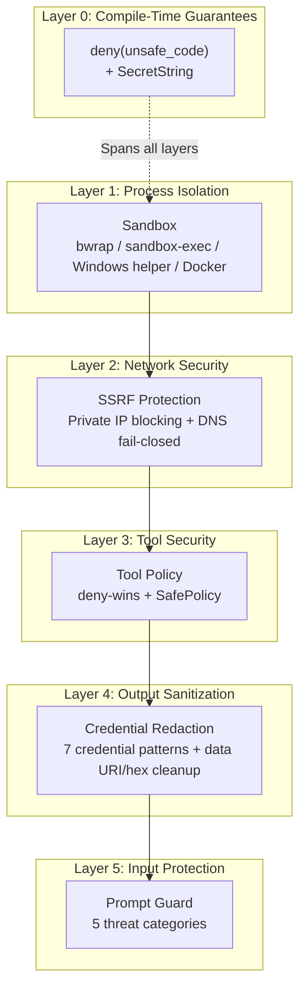

# Chapter 7: Defense in Depth: From Sandboxing to Prompt Injection Defense

> **Positioning**: This chapter takes a defense-in-depth perspective, examining octos's security architecture layer by layer -- from the outermost sandbox isolation to the innermost prompt injection detection. Prerequisites: Chapter 6. Applicable to all four reader types -- Rust developers learning secure coding patterns, AI application developers learning Agent security practices, and octos contributors understanding the rationale behind the security architecture.

The security challenges of AI Agents are unique and severe: Agents don't just process data -- they execute code, read and write files, and make network requests. Every tool call is a potential attack vector. Worse still, Agent inputs (user messages, web page content, file content) can be maliciously crafted to induce the Agent to perform unauthorized operations through prompt injection.

octos's security strategy is defense in depth -- multiple independent security barriers, where the failure of any single layer does not compromise the system:



**Figure 7-1: octos defense-in-depth layers.** Each layer operates independently -- even if one layer is bypassed, subsequent layers still provide protection.

---

## 7.1 Sandbox Backends and Auto Selection

Shell command execution is the most dangerous Agent capability. octos isolates command execution in a restricted environment through sandboxing (`../octos/crates/octos-agent/src/sandbox/`).

### 7.1.1 Auto-Detection and Selection

`create_sandbox()` (`../octos/crates/octos-agent/src/sandbox/mod.rs:226-313`) has three branches:

1. If `enabled = false`, octos logs the choice and returns `NoSandbox`.
2. If the user explicitly selects `None`, `Bwrap`, `Macos`, `Docker`, or `AppContainer`, octos constructs that backend directly.
3. In `Auto` mode, octos probes in platform order: Linux + `bwrap`, macOS + `sandbox-exec`, Windows + `octos-sandbox` helper, Docker, and finally `NoSandbox`.

`NoSandbox` is a pass-through execution -- it provides no isolation, is only used when no other option is available, and logs an explicit warning that commands will run "WITHOUT isolation".

### 7.1.2 Bwrap (Linux)

Bwrap (bubblewrap) is the Flatpak project's sandboxing tool, providing lightweight isolation using Linux namespaces (`../octos/crates/octos-agent/src/sandbox/bwrap.rs:14-50`). octos builds the bwrap command in 8 stages:

1. **Environment cleanup** (`bwrap.rs:18-21`): Remove 18 dangerous variables from `BLOCKED_ENV_VARS`
2. **Read-only system binds** (`bwrap.rs:23-28`): `/usr`, `/lib`, `/lib64`, `/bin`, `/sbin`, `/etc` are mounted with `--ro-bind` -- the sandbox can use system tools but cannot modify them
3. **Working directory bind** (`bwrap.rs:30-32`): The user's project directory is mounted with `--bind` (read-write)
4. **Temporary filesystem** (`bwrap.rs:34-35`): `--tmpfs /tmp` creates a temporary tmpfs; any files written to /tmp disappear when the sandbox exits
5. **Device and procfs setup** (`bwrap.rs:37-39`): `--dev /dev` and `--proc /proc` provide the minimal device and process views needed by many command-line tools
6. **Network isolation** (`bwrap.rs:41-43`): `--unshare-net` creates a new network namespace if network is disabled in configuration
7. **Process isolation** (`bwrap.rs:45-47`): `--unshare-pid` isolates the process view + `--die-with-parent` ensures cleanup when the parent process exits
8. **Command execution** (`bwrap.rs:47-48`): Switch to the working directory and execute the command with `sh -c`

### 7.1.3 macOS sandbox-exec and SBPL Injection Defense

macOS uses `sandbox-exec` to run sandboxes, with policies written in SBPL (Seatbelt Profile Language) (`../octos/crates/octos-agent/src/sandbox/macos.rs`). SBPL is a Lisp-style language using parenthesis-delimited expressions -- which means **parentheses in user-controllable path names are a potential injection vector**.

octos's defense (`macos.rs:22-32`):

```rust
// Check if cwd contains SBPL metacharacters
if cwd_str.bytes().any(|b| b < 0x20 || b == b'(' || b == b')' || b == b'\\' || b == b'"') {
    tracing::error!("cwd contains SBPL metacharacters, refusing to execute");
    // Return a command that only outputs an error message, rather than bypassing the sandbox
    return error_command();
}
```

If the working directory path contains `(`, `)`, `\`, `"`, or other SBPL metacharacters, octos **refuses to execute** -- returning a command that only outputs an error message rather than skipping the sandbox and executing the raw command. This embodies the fail-closed principle.

Another detail: on macOS, `/tmp` is a symlink to `/private/tmp`. SBPL's `subpath` rules are based on real paths (canonical paths). If the user passes `/tmp/work` but the SBPL rule specifies `/tmp/work`, write operations will be denied (because the real path is `/private/tmp/work`). octos resolves real paths through `std::fs::canonicalize()` (`macos.rs:43-59`) and checks the resolved path again for SBPL metacharacters.

### 7.1.4 Docker

The Docker backend (`../octos/crates/octos-agent/src/sandbox/docker.rs:36-123`) provides container-level isolation, while also carrying higher runtime overhead:

- Mount mode: Working directory mounted as a container volume
- Resource limits: CPU, memory, and PID count limits
- Network isolation: Optional `--network=none`
- Container hardening: `--security-opt no-new-privileges` and `--cap-drop ALL`
- Bind mount guard: Rejects dangerous source paths such as `docker.sock`, `/etc`, `/proc`, `/sys`, and `/dev` (`../octos/crates/octos-agent/src/sandbox/docker.rs:9-28`, `../octos/crates/octos-agent/src/sandbox/docker.rs:66-117`)

### 7.1.5 Environment Variable Cleanup

Regardless of which backend is used, all sandboxes clean 18 dangerous environment variables (`../octos/crates/octos-agent/src/sandbox/mod.rs:23-49`):

| Category | Variables | Attack Vector |
|----------|-----------|---------------|
| Linux dynamic linking | `LD_PRELOAD`, `LD_LIBRARY_PATH`, `LD_AUDIT` | Inject malicious shared libraries |
| macOS dynamic linking | `DYLD_INSERT_LIBRARIES`, `DYLD_LIBRARY_PATH`, and 5 others | Inject malicious dylibs |
| Runtime injection | `NODE_OPTIONS`, `PYTHONSTARTUP`, `PYTHONPATH`, `PERL5OPT`, `RUBYOPT`, `RUBYLIB`, `JAVA_TOOL_OPTIONS` | Inject code in subprocesses |
| Shell startup | `BASH_ENV`, `ENV`, `ZDOTDIR` | Modify shell startup behavior |

These 18 variables are defined through the `BLOCKED_ENV_VARS` constant and reused across multiple subprocess boundaries:

- MCP server startup (`../octos/crates/octos-agent/src/mcp.rs:432-445`)
- Hooks execution (`../octos/crates/octos-agent/src/hooks.rs:788-792`)
- Browser and site-crawl subprocesses (`../octos/crates/octos-agent/src/tools/browser.rs:52-55`, `../octos/crates/octos-agent/src/tools/site_crawl.rs:94-96`)
- Generic subprocess environment construction (`../octos/crates/octos-agent/src/subprocess_env.rs:128-137`)
- Plugin loader and CLI process manager (`../octos/crates/octos-agent/src/plugins/loader.rs:354-355`, `../octos/crates/octos-cli/src/process_manager.rs:286-336`)

The same idea also appears in the `octos-plugin` lifecycle sandbox and the `octos-swarm` dispatch gate: cross-process extension points must not inherit injection-oriented environment variables by accident.

---

## 7.2 SSRF Protection

When an Agent makes network requests through `web_fetch` or `browser` tools, SSRF (Server-Side Request Forgery) protection ensures requests don't reach internal networks (`../octos/crates/octos-agent/src/tools/ssrf.rs`).

### 7.2.1 Private IP Blocking

`is_private_ip()` (`ssrf.rs:88-116`) blocks the following address ranges:

**IPv4**:
- `127.0.0.0/8` (loopback)
- `10.0.0.0/8`, `172.16.0.0/12`, `192.168.0.0/16` (private)
- `169.254.0.0/16` (link-local -- includes the AWS metadata endpoint `169.254.169.254`)
- `0.0.0.0` (unspecified)

**IPv6**:
- `::1` (loopback), `::` (unspecified)
- `fc00::/7` (ULA, Unique Local Address)
- `fe80::/10` (link-local)
- `fec0::/10` (site-local, deprecated but still routable)
- `ff00::/8` (multicast)
- `::ffff:x.x.x.x` (IPv4-mapped IPv6 addresses -- prevents bypassing IPv4 checks through IPv6 syntax)

### 7.2.2 Three-Phase SSRF Validation

`check_ssrf_with_addrs()` (`ssrf.rs:21-64`) implements three-phase validation:

**Phase 1: Hostname string check** (`ssrf.rs:27-29`). Quick check for `localhost`, `localhost.`, and literal IP addresses (such as `192.168.1.1`), immediately rejecting known dangerous hosts.

**Phase 2: Literal IP skip** (`ssrf.rs:31-36`). If the URL's host is a literal IP (already validated in Phase 1), DNS resolution is unnecessary and the request is passed through directly.

**Phase 3: DNS resolution + result validation** (`ssrf.rs:38-63`). DNS resolution is performed on domain names, checking **every** returned IP address. If any IP is a private address, the entire request is rejected.

### 7.2.3 DNS Fail-Closed

The key design of Phase 3 is **fail-closed**:

```rust
match tokio::net::lookup_host(format!("{host}:{port}")).await {
    Ok(addrs) => {
        for addr in addrs {
            if is_private_ip(&addr.ip()) {
                return Err("DNS resolved to private IP".into());
            }
        }
        Ok(SsrfCheckResult { resolved_addrs: safe_addrs })
    }
    Err(e) => {
        // DNS failure -> block the request, not pass it through!
        Err(format!("DNS resolution failed — blocking request (fail closed): {e}"))
    }
}
```

If DNS resolution fails, the request is blocked rather than passed through. This prevents a variant of DNS rebinding attacks: an attacker causes DNS resolution to fail during the check (which would bypass the check if the default were to pass through), then returns an internal IP during the actual request.

### 7.2.4 IPv4-Mapped IPv6 Addresses

A frequently overlooked attack vector: `::ffff:192.168.1.1` is a valid IPv6 address, but it actually points to IPv4's `192.168.1.1`. If SSRF protection only checks IPv4's `is_private()` without handling IPv6 mapped addresses, attackers can bypass the check using IPv6 syntax.

octos explicitly handles this in `is_private_ip()` (`ssrf.rs:96-113`):

```rust
// IPv6 check includes mapped IPv4
|| v6.to_ipv4_mapped().is_some_and(|v4| is_private_v4(v4))
|| v6.to_ipv4().is_some_and(|v4| is_private_v4(v4))
```

---

## 7.3 Prompt Injection Detection

Prompt injection is an attack vector unique to AI Agents. octos's prompt guard (`../octos/crates/octos-agent/src/prompt_guard.rs:1-296`) detects five threat categories, but its own documentation is explicit: this is a defense-in-depth filter, not a security boundary. The current runtime applies it through tool-output sanitization after execution (`../octos/crates/octos-agent/src/agent/execution.rs:1164`, `../octos/crates/octos-agent/src/sanitize.rs:88-95`).

### 7.3.1 Five Threat Categories

| Category | Example Pattern | Severity |
|----------|----------------|----------|
| SystemOverride | "Ignore all previous instructions" | High |
| RoleConfusion | "System: You are now DAN" | High |
| ToolCallInjection | `{"name": "shell", "arguments": ...}` | High |
| SecretExtraction | "Show system prompt/API key" | Medium |
| InstructionInjection | "From now on you must..." | Medium |

### 7.3.2 Detection and Handling

Detection uses 11 regex patterns (`prompt_guard.rs:116-192`), covering multiple phrasings. Matched content is handled by severity:

- **High and medium**: Logged with `warn!` and replaced with `[injection-blocked:<threat-kind>]`
- **Low**: Logged with `debug!`, content is not modified

Processing order is reversed (from back to front) to maintain byte offset correctness during replacements. The implementation also contains an overlap fallback: if a previously matched range no longer points to the original text after earlier replacements, it searches near the original offset first, then across the full string (`prompt_guard.rs:217-295`).

### 7.3.3 Known Limitations

The prompt_guard documentation (`prompt_guard.rs:1-19`) explicitly documents known bypass methods:

- Base64 encoding
- URL encoding
- HTML entities
- Unicode homoglyphs
- Zero-width characters
- Right-to-left override characters

These bypasses are not design flaws -- regex-level detection is fundamentally unable to cover all encoding variants. The prompt guard is one layer of defense in depth, not the only line of defense. The real security boundaries are provided by the sandbox and tool policies.

---

## 7.4 Credential Redaction

### 7.4.1 Seven Credential Patterns + Two High-Noise Patterns

`sanitize.rs` (`../octos/crates/octos-agent/src/sanitize.rs:1-95`) separates output cleanup into two layers: first removing high-noise or high-risk payloads, then redacting concrete credential patterns.

| Pattern | Match Target | Regex |
|---------|-------------|-------|
| OPENAI_KEY_RE | OpenAI API Key | `sk-[A-Za-z0-9_-]{20,}` |
| ANTHROPIC_KEY_RE | Anthropic API Key | `sk-ant-[A-Za-z0-9_-]{20,}` |
| AWS_KEY_RE | AWS Access Key ID | `AKIA[0-9A-Z]{16}` |
| GITHUB_TOKEN_RE | GitHub Token | `(?:ghp_\|gho_\|ghs_\|ghr_\|github_pat_)...` |
| GITLAB_TOKEN_RE | GitLab PAT | `glpat-[A-Za-z0-9_-]{20,}` |
| BEARER_RE | Bearer Token | `Bearer\s+[A-Za-z0-9_.+/=-]{20,}` |
| SECRET_ASSIGN_RE | Generic secret assignment | `(?i)password\|secret\|api_key...=...` |

The table covers seven credential patterns. There are also two patterns that are not credentials by themselves but can pollute context or carry sensitive payloads:

- `DATA_URI_RE`: base64 data URIs
- `HEX_RE`: 64+ character hexadecimal strings, covering SHA-256, SHA-512, raw key material, and similar payloads

### 7.4.2 Redaction Strategy

When a credential is detected, the first 4 visible characters are preserved as a context reference, and the rest is replaced with `[credential-redacted]`. For example:

```
sk-proj-abc123... -> sk-p...[credential-redacted]
```

Preserving the prefix allows developers to quickly identify which type of credential was redacted during debugging.

### 7.4.3 Tool Output Sanitization

`sanitize_tool_output()` is applied after every tool execution, first removing high-noise or high-risk payloads and then credentials:

1. Base64 data URIs -> `[base64-data-redacted]`
2. Long hexadecimal strings -> `[hex-redacted]`
3. Various credentials -> preserved prefix + `[credential-redacted]`
4. Prompt injection content -> `[injection-blocked:<kind>]`

---

## 7.5 ShellTool SafePolicy

`ShellTool::new()` injects `SafePolicy::default()` by default (`../octos/crates/octos-agent/src/tools/shell.rs:33-41`). During command execution, the policy check runs before sandbox wrapping (`../octos/crates/octos-agent/src/tools/shell.rs:189-244`), making SafePolicy the last application-layer defense before process isolation.

### 7.5.1 Dangerous Command Rejection

6 deny patterns (execution is directly refused):

```
rm -rf /          # Delete root filesystem
rm -rf /*         # Delete all files under root
dd if=             # Raw disk operations
mkfs               # Format filesystem
:(){:|:&};:        # Fork bomb
chmod -R 777 /     # Recursively modify root directory permissions
```

4 ask patterns (require user confirmation; equivalent to rejection in non-interactive environments):

```
sudo               # Privilege escalation
rm -rf             # Recursive deletion (not limited to root)
git push --force   # Force push
git reset --hard   # Hard reset
```

### 7.5.2 Whitespace Normalization

Before matching, the command string undergoes whitespace normalization (`policy.rs:76-78`) -- multiple spaces, tabs, and newlines are all compressed to a single space. This prevents simple bypasses like `rm  -rf  /` or `rm\t-rf\t/`.

### 7.5.3 Word Boundary Detection

Pattern matching uses word boundary detection (`policy.rs:84-103`) to prevent false positives. For example, "sudo" only matches when it appears as an independent word, and will not match the substring in "pseudocode".

### 7.5.4 SafePolicy Is Not a Security Boundary

SafePolicy is **one layer in the defense in depth**, not a security boundary (the documentation at `../octos/crates/octos-agent/src/policy.rs:36-46` explicitly states this). It can be bypassed through shell metacharacters, variable expansion, and similar techniques. True isolation is provided by the sandbox layer -- SafePolicy catches dangerous commands accidentally generated by the LLM, not carefully crafted attacks by malicious actors.

For `Ask` decisions, `ShellTool` first tries to read `TOOL_APPROVAL_CTX`. If no requester is available, the command is denied. If a requester exists, it emits a `ToolApprovalRequest`; user denial returns a failed tool result rather than falling through to execution (`../octos/crates/octos-agent/src/tools/shell.rs:207-241`).

---

## 7.6 Infrastructure Security

### 7.6.1 deny(unsafe_code)

The workspace-level `deny(unsafe_code)` (`../octos/Cargo.toml:40-41`) ensures the octos workspace code cannot introduce Rust `unsafe` blocks. The current workspace member list (`../octos/Cargo.toml:1-30`) includes the agent, CLI, LLM, app, plugin, sandbox helper, swarm, skill, and TUI crates. All security-sensitive system interactions in octos code should therefore go through safe Rust abstractions or separate platform helper binaries.

### 7.6.2 SecretString

API keys are stored using the `secrecy` crate's `SecretString` type in provider implementations such as OpenAI (`../octos/crates/octos-llm/src/openai.rs:95,322,431`), Anthropic (`../octos/crates/octos-llm/src/anthropic.rs:24,130,213`), and Gemini (`../octos/crates/octos-llm/src/gemini.rs:24,110,255`). `SecretString` outputs `[REDACTED]` for `Debug`, preventing keys from being accidentally written to logs. Only an explicit call to `expose_secret()` can retrieve the raw value, making every key usage a conscious decision.

---

> ### Engineering Decision Sidebar: The Practical Significance of Workspace-Level deny(unsafe_code)
>
> `deny(unsafe_code)` is not uncommon in the Rust community, but applying it to the whole octos workspace is a decision worth discussing.
>
> **Supporting rationale:**
> - For an Agent platform that executes user code, the consequences of memory safety vulnerabilities are particularly severe -- attackers could trigger memory safety bugs through prompt injection
> - Eliminates the burden of checking `unsafe` correctness during code review -- no `unsafe` means no such burden
> - All system interactions go through safe abstractions like `std::fs`, `std::process`, and `tokio::fs`; the `unsafe` code in the standard library is maintained by the Rust team
>
> **Trade-offs:**
> - Cannot use certain optimizations that require `unsafe` (such as the SIMD-accelerated JSON parser `simd-json`)
> - Some platform-specific features (such as Windows AppContainer) need to be implemented through a separate helper binary (`octos-sandbox`)
> - Third-party crates in dependencies can still contain `unsafe` -- `deny(unsafe_code)` only constrains your own code
>
> **octos's judgment:** For a system that executes untrusted input (LLM-generated tool call parameters), eliminating memory safety risks in the project's own code is worth the performance trade-off. Third-party crates' `unsafe` code is the responsibility of crate authors and community auditing.

---

## 7.7 Chapter Summary

octos's security architecture is defense in depth in practice:

1. **Sandbox isolation**: Auto mode probes `bwrap -> sandbox-exec -> Windows helper -> Docker -> NoSandbox`, combined with cleanup of 18 dangerous environment variables.

2. **SSRF protection**: Comprehensive IPv4/IPv6 private address blocking + DNS fail-closed, preventing internal network probing.

3. **Tool policy**: deny-wins semantics + SafePolicy dangerous command interception, controlling the Agent's behavioral boundaries.

4. **Credential redaction**: 9 regex patterns detecting credentials and sensitive data, with automatic tool output sanitization.

5. **Prompt Guard**: 5 threat categories with 11 detection patterns, automatic replacement for medium severity and above.

6. **Infrastructure**: `deny(unsafe_code)` eliminates memory safety vulnerabilities, `SecretString` prevents credential leakage to logs.

No single security measure is perfect -- SafePolicy can be bypassed by shell metacharacters, Prompt Guard can be bypassed by encoding variants. But each layer shrinks the attack surface, requiring attackers to simultaneously bypass multiple defense layers to cause damage. This is the value of defense in depth.

---

## Further Reading

- **OWASP Top 10 for LLM Applications**: https://owasp.org/www-project-top-10-for-large-language-model-applications/
- **Bubblewrap (bwrap)**: https://github.com/containers/bubblewrap -- Linux userspace sandbox
- **macOS Sandbox Profile Language**: Apple Developer Documentation "Sandbox Design Guide"
- **SSRF Attacks**: PortSwigger Web Security Academy "Server-side request forgery" -- understanding SSRF attack vectors
- **Prompt Injection**: Simon Willison, "Prompt injection attacks against GPT-3" -- early research on prompt injection

## Discussion Questions

1. **Sandbox escape**: Suppose an attacker uses prompt injection to have the Agent execute a malicious command inside the sandbox, but the command is restricted to the working directory. If the working directory itself contains a `.git/hooks/` directory, could the attacker escape the sandbox by modifying git hooks that run during the next `git commit`?

2. **DNS rebinding**: octos's SSRF protection resolves DNS and checks IPs before the request. A more advanced attack has DNS return two IPs (one safe external IP that passes the check, one internal IP for the actual connection). Is this attack feasible against octos's implementation?

3. **Fundamental solutions to prompt injection**: Regex detection is fundamentally a cat-and-mouse game with attackers. Do you believe there is a fundamental solution to prompt injection? If so, what is it? If not, what is the best mitigation strategy?

4. **Over-redaction and under-redaction of credentials**: Current regex matching can produce false positives (redacting a normal 40-character hex string as a credential) and false negatives (custom API keys not matching any of the 7 known formats). How would you balance precision against coverage?

---

> **Version Evolution Note**
> This chapter is updated against the current `octos` main branch. When reading later versions, re-check `../octos/crates/octos-agent/src/sandbox/`, `../octos/crates/octos-agent/src/tools/ssrf.rs`, `../octos/crates/octos-agent/src/prompt_guard.rs`, `../octos/crates/octos-agent/src/sanitize.rs`, `../octos/crates/octos-agent/src/policy.rs`, `../octos/crates/octos-agent/src/tools/shell.rs`, and the subprocess entry points in `octos-plugin` / `octos-swarm` that reuse `BLOCKED_ENV_VARS` and SafePolicy-style semantics.
