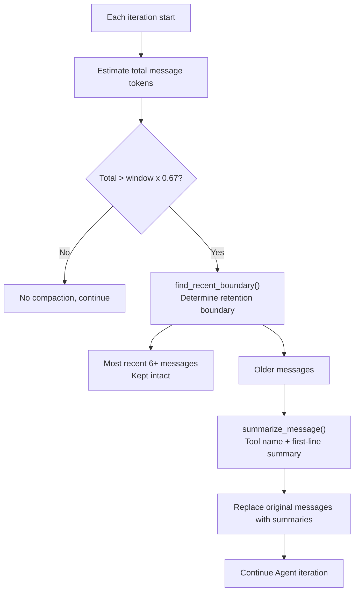
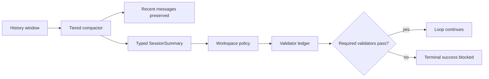

# Chapter 8: Context Management: Enabling Agents to Work Efficiently Within Limited Windows

> **Positioning**: This chapter demonstrates how octos works efficiently within limited LLM context windows through four mechanisms: context compaction, fidelity grading, prompt layer construction, and system prompt tamper protection (prompt guard). Prerequisites: Chapter 5. Applicable to AI application developers who want to understand context window management strategies (Reader C), and developers who need to optimize Agent context usage (Reader B/D).

The LLM's context window is a scarce resource. Even a 200K token window can be exhausted after 10-20 iterations of a complex task -- tool call parameters and results accumulate with each iteration. When the window nears capacity, there are two choices: stop (abandon the unfinished task), or compress (discard some information but continue working). octos chose the latter.

---

## 8.1 Context Compaction: The 80% Trigger Threshold

### 8.1.1 Trigger Condition

When the conversation history's token count reaches 80% of the context window, compaction triggers automatically. This threshold is implemented in `crates/octos-agent/src/compaction.rs` through `SAFETY_MARGIN = 1.2` (`compaction.rs:11`) -- reserving a 20% safety margin for the next iteration's input and output.

### 8.1.2 Trigger Logic Source Walkthrough

The actual check code for the 80% threshold (in `agent/loop_runner.rs` calling `trim_to_context_window()`):

```rust
let window = self.llm.context_window();
let budget = (window as f64 * 0.8 / SAFETY_MARGIN) as u32;

let total: u32 = messages.iter().map(estimate_message_tokens).sum();
if total <= budget {
    return;  // Under budget, no compression needed
}
```

Note that the actual budget is `window * 0.8 / 1.2 = approximately window * 0.67` -- the 80% threshold divided by the 1.2 safety factor, because token estimation is not perfectly precise. For a 128K-window model, the actual trigger point is approximately 85K tokens.

### 8.1.3 Determining the Retention Boundary

`find_recent_boundary()` (`compaction.rs:23-48`) is the core of the compaction algorithm -- it determines which messages are kept intact and which are compressed:

```rust
pub(crate) fn find_recent_boundary(messages: &[Message], budget: u32, system_tokens: u32) -> usize {
    let mut recent_tokens = 0u32;
    let mut count = 0usize;
    let mut split = messages.len();

    // Scan from the last message backward
    for i in (1..messages.len()).rev() {
        let msg_tokens = estimate_message_tokens(&messages[i]);
        count += 1;

        // Keep at least 6 messages, and don't exceed half the budget
        if count >= MIN_RECENT_MESSAGES
            && system_tokens + recent_tokens + msg_tokens > budget / 2
        {
            break;
        }
        recent_tokens += msg_tokens;
        split = i;
    }

    // Critical: don't split in the middle of a tool call group
    while split > 1 && messages[split].role == MessageRole::Tool {
        split -= 1;  // Back up to include the Assistant message paired with the Tool message
    }

    split
}
```

The core insight of this code is **asymmetric protection**: the most recent 6 messages are unconditionally kept (the budget isn't checked until `count >= MIN_RECENT_MESSAGES`), but recent messages are not allowed to exceed half the budget (`budget / 2`). This ensures there is still enough space for the summary of older messages after compaction.

**Tool groups are indivisible.** The final `while` loop backs up to ensure the split point doesn't land on a Tool message. If the split points to a Tool message, it belongs to an Assistant->Tool pair -- splitting would create orphaned Tool messages that confuse the LLM.

### 8.1.3 Compaction Strategy

The compaction target is to compress old messages to 40% of the budget (`BASE_CHUNK_RATIO = 0.4`, `compaction.rs:17`). For each old message, `summarize_message()` is called (`compaction.rs:93-138`):

| Message Type | Compression Method |
|-------------|-------------------|
| User | `"> User: {content}"` + `[media omitted]` |
| Assistant (with tool calls) | `"Called {tool_name}"` |
| Assistant (text only) | First-line summary (truncated to 100 characters) |
| Tool result | Status (ok/error) + first 100 characters of output |
| System | Preserved as context summary |

### 8.1.4 Compaction Trigger Flow



**Figure 8-1: Compaction trigger flow.** 80% x 1/1.2 = approximately 67% is the actual trigger point. The retention boundary never splits in the middle of a tool call group.

### 8.1.5 Compaction Strategy Source Walkthrough

`summarize_message()` (`compaction.rs:93-137`) applies different compression strategies for each message type:

```rust
fn summarize_message(msg: &Message, context: &[Message]) -> String {
    match msg.role {
        MessageRole::User => {
            // User message: first line + media marker
            let media_note = if msg.media.is_empty() { "" } else { " [media omitted]" };
            format!("> User: {}{}", first_line(&msg.content, 200), media_note)
        }
        MessageRole::Assistant => {
            let mut parts = Vec::new();
            if let Some(ref calls) = msg.tool_calls {
                for call in calls {
                    // Key: keep only tool name, discard parameters entirely
                    parts.push(format!("- Called {}", call.name));
                }
            }
            if !msg.content.is_empty() {
                parts.push(format!("> Assistant: {}", first_line(&msg.content, 200)));
            }
            parts.join("\n")
        }
        MessageRole::Tool => {
            let tool_name = find_tool_name(msg, context);
            let status = if msg.content.starts_with("Error:") { "error" } else { "ok" };
            // Tool result: status + first 100 characters
            format!("  -> {}: {} - {}", tool_name, status, first_line(&msg.content, 100))
        }
        MessageRole::System => {
            format!("> Context: {}", first_line(&msg.content, 200))
        }
    }
}
```

**Tool parameter stripping** is the most effective compression technique. Consider a `write_file` tool call -- the parameters might contain hundreds of lines of code file content (thousands of tokens). After compression, it becomes a single line `"- Called write_file"` (roughly 5 tokens), achieving a compression ratio of up to 200:1.

Tests verify this behavior (`compaction.rs:261-272`):

```rust
fn test_compact_strips_tool_arguments() {
    let messages = vec![
        assistant_tool_call("write_file", "tc1"),  // Parameters contain "/secret/file"
        tool_result("tc1", "File written."),
    ];
    let summary = compact_messages(&messages, 10000);
    assert!(summary.contains("Called write_file"));    // Tool name preserved
    assert!(!summary.contains("/secret/file"));        // Parameters completely gone
}
```

**First-line summary** (`compaction.rs:141-153`): The `first_line()` function extracts the first non-empty line of text from the message, UTF-8-safely truncated to the specified character count (200 characters for user messages, 100 characters for tool results). Information density is highest in the first line -- LLM responses typically begin with a conclusion or summary.

### 8.1.4 Four Fidelity Levels

Post-compaction message fidelity can be divided into four levels:

| Level | Retained Content | Discarded Content | Applicable Scenario |
|-------|-----------------|-------------------|---------------------|
| Full | Complete message | None | Most recent 6 messages |
| Truncate | Content truncated to N characters | Trailing content | Moderately important history messages |
| Compact | First line + tool names | Parameters, detailed output | Distant history |
| Summary | Single-sentence summary | Almost all original content | Very distant history |

In the current implementation, compaction primarily uses the Compact level (first-line summary + tool names). The Summary level (LLM-generated summaries) is reserved as a future optimization direction.

---

## 8.2 Prompt Layer: Layered System Prompt Construction

The system prompt is not a static string -- it is assembled from multiple layers of information. PromptLayerBuilder (`crates/octos-agent/src/prompt_layer.rs:22-102`) handles this assembly process.

### 8.2.1 Auto-Discovery

The `discover()` method (`prompt_layer.rs:58-80`) automatically discovers project instruction files from the working directory:

| Filename | Purpose |
|----------|---------|
| `CLAUDE.md` | Project-level instructions (highest priority) |
| `.octos/instructions.md` | octos-specific instructions |
| `.claude/instructions.md` | Claude format compatibility |
| `AGENTS.md` | Available Agent descriptions |

Discovered files are layered by priority -- later-discovered files with the same name override earlier ones. The final result is concatenated in order through the `build()` method (`prompt_layer.rs:83-102`) into a complete system prompt.

### 8.2.2 Size Limit

`MAX_PROMPT_FILE_SIZE = 64 * 1024` (`prompt_layer.rs:11`) -- a single prompt file is limited to 64KB. This prevents malicious or accidentally enormous files from exhausting the context window.

---

## 8.3 Steering: In-Session Message Injection

Steering (`crates/octos-agent/src/steering.rs:20-29`) allows injecting additional guidance messages during Agent execution:

```rust
pub enum SteeringMessage {
    FollowUp(Message),      // Inject user follow-up question
    SystemReminder(String), // System-level reminder
    RequestPause,           // Pause and wait for user input
    Cancel,                 // Cancel current task
}
```

Steering is implemented through an async channel (buffer size 16, `steering.rs:37`). The Agent Loop collects all pending messages non-blockingly via `drain_pending()` at the start of each iteration.

Typical use cases: a user sends supplementary instructions through the UI while the Agent is executing a multi-step task ("Pause for now, let me look at the current results"), or the system injects a reminder when the Agent is about to time out.

---

## 8.4 Prompt Guard: System Prompt Tamper Protection

Prompt Guard was introduced in Chapter 7 for its prompt injection detection capabilities. From the context management perspective, it also serves another purpose: ensuring system prompt integrity.

When tool output or user input contains forged system prompt markers (such as `[SYSTEM]`, `[INST]`), prompt guard detects and replaces these markers, preventing the LLM from being misled into believing this content comes from the system level. This protects the authority of the system prompt -- only content constructed through prompt_layer is treated as system instructions.

---

> ### Engineering Decision Sidebar: Why 80% Rather Than a Dynamic Threshold
>
> **Option A: Dynamic Threshold (adjusted based on task complexity)**
>
> Advantages:
> - Simple tasks can defer compression (e.g., Q&A scenarios don't need much history preservation)
> - Complex tasks compress earlier (reserving more space for subsequent iterations)
>
> Disadvantages:
> - Requires predicting remaining iteration count -- which is nearly impossible to predict accurately
> - Complexity assessment itself consumes context and computational resources
> - Additional tunable parameters increase configuration burden and unpredictability
>
> **Option B: Predictive Compression (based on historical token growth rate)**
>
> Advantages:
> - Dynamically adjusts based on actual growth trends
>
> Disadvantages:
> - Token growth rate is unstable (tool call output sizes are highly variable)
> - Prediction errors can lead to premature compression (information loss) or delayed compression (overflow risk)
>
> **Option C: Fixed 80% Threshold (octos's choice)**
>
> 80% is a balance point validated through practice: the 20% reserved space is sufficient for one typical iteration (system prompt + user message + LLM response + one tool call result), while not triggering compression so early as to cause unnecessary information loss.
>
> The core advantage of a fixed threshold is predictability -- developers and users can know exactly when compression will occur, without needing to understand complex dynamic logic. In an AI Agent system that is inherently full of uncertainty, determinism at the infrastructure level is precious.

---

## 8.5 Mainline Evolution: Contract-Gated Compaction

As Chapter 5 showed, `ContextOverflow` is no longer just a generic failure. It routes to `LoopDecision::CompactAndRetry`, causing the main loop to run the turn compaction helper before continuing. Compaction is now part of Agent Loop recovery, not merely a token-budget optimization (`crates/octos-agent/src/agent/loop_runner.rs:321-339`).

This changes the boundary of context management. A compressed state cannot be just a natural-language summary; otherwise task constraints, artifact bindings, or validator outcomes can disappear. The current source separates state into three layers:

| State layer | Examples | Should be written into the prompt? |
|-------------|----------|-------------------------------------|
| prompt-visible state | messages, typed `SessionSummary`, workspace contract summary | Yes |
| runtime control state | `LoopRetryState`, grace eligibility, task lifecycle | No |
| durable evidence state | validator ledger, harness event sink, cost ledger | Not directly, but must be replayable |

`SessionSummary` is therefore not long-term memory and not a generic chat summary. It is a typed compaction summary that preserves the goal, constraints, decisions, files, and next steps within a limited context window (`crates/octos-agent/src/summarizer.rs`; `crates/octos-core/src/task.rs:233`). Long-term memory remains the responsibility of Chapter 4's memory system.



Validator preservation is the key. `validators.rs` persists outcomes as schema-versioned JSONL; required validator failures block terminal success, while optional failures only produce warnings (`crates/octos-agent/src/validators.rs:84-123`, `crates/octos-agent/src/workspace_git.rs:662-750`). The goal of compaction is not "make the prompt as short as possible"; it is "make it shorter while preserving the verifiable contract". This is also the foundation for Chapter 9's harness validator runner and Chapter 12's workflow artifact gates.

## 8.6 Chapter Summary

1. **Context Compaction**: Triggers at 80%, preserves the most recent 6 messages intact, and compresses old messages to 40% of the budget. Tool parameter stripping and first-line summaries are the primary compression techniques.

2. **Four Fidelity Levels**: Full (complete) -> Truncate (truncated) -> Compact (first-line summary) -> Summary (single-sentence summary), with fidelity decreasing from recent to distant history.

3. **Prompt Layer**: Auto-discovers CLAUDE.md/AGENTS.md and other project instruction files, constructs system prompts in layers, with a 64KB size limit to prevent resource exhaustion.

4. **Steering**: Async channel enables in-session message injection, supporting follow-up instructions, system reminders, pausing, and cancellation.

5. **Prompt Guard**: System prompt tamper protection, detecting forged system markers and protecting the integrity of the prompt hierarchy.

6. **Contract-gated compaction**: The current main branch connects compaction to `CompactAndRetry` and uses typed `SessionSummary`, workspace policy, and validator ledgers to preserve task constraints after compression.

---

## Further Reading

- **Context Window Management**: Anthropic "Long context window tips" -- best practices for long context usage
- **RAG vs Long Context**: Comparing the trade-offs between retrieval-augmented generation and large-window direct input
- **Summarization in Information Retrieval**: Luhn's automatic summarization method -- the theoretical foundation of first-line summarization

## Discussion Questions

1. **Recovering compressed information**: Current compaction is irreversible -- compressed messages cannot be restored to their original content. If the Agent needs to review the detailed parameters of an earlier tool call after compaction, what should be done?

2. **Abstractive vs extractive summarization**: Current compression is extractive (first lines, tool names). If LLM-generated abstractive summaries were used, could more information be preserved within the same token budget? What would be the cost?

3. **Multi-Agent context sharing**: If two Agents are collaborating on the same task, how should their context windows be shared? Independent compression or coordinated compression?

---

> **Version Evolution Note**
> This chapter's analysis is based on octos v0.1.0, with context management code located in `crates/octos-agent/src/compaction.rs`, `prompt_layer.rs`, `steering.rs`, and `prompt_guard.rs`. As of the time of writing, the 80% threshold and 6-message retention policy have not undergone major changes. The Summary fidelity level (LLM-generated summaries) may be implemented in future versions.
