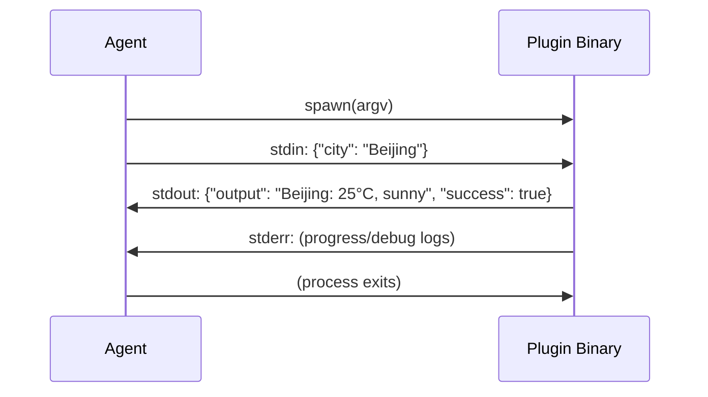

# Chapter 9: Extension Mechanisms: The Skills and Plugins Dual Track

> **Positioning**: This chapter presents octos's three extension mechanisms -- Skills (Markdown declarative), Plugins (binary executable), and MCP (standardized protocol) -- and explains why three are needed instead of one. Prerequisites: Chapter 6. Applicable to contributors who want to write custom extensions for octos (Reader D), and developers who want to understand Agent extension architecture design (Reader B/C).

An Agent's value comes from its ability to adapt to different scenarios. A general-purpose AI Agent needs customization to deliver maximum effectiveness in specific domains -- legal document review requires legal knowledge injection, DevOps automation requires CI/CD tool integration, and customer service Agents need business FAQ retrieval.

octos provides three extension mechanisms, each at a different level of abstraction and suited to different use cases. This chapter covers each one in turn.

---

## 9.1 Skills Track: Markdown Declarative Extensions

Skills are the lightest-weight extension mechanism -- a single SKILL.md file constitutes a skill.

### 9.1.1 SKILL.md Format

```markdown
---
name: code-review
description: Review code changes for bugs, security issues, and style
version: 1.0.0
---

When reviewing code, focus on:
1. Security vulnerabilities (SQL injection, XSS, etc.)
2. Error handling completeness
3. Performance implications
...
```

The frontmatter (YAML header delimited by `---`) declares the skill's metadata, and the body is the prompt content injected to the LLM. SkillsLoader parses this format through `split_frontmatter()` (`crates/octos-agent/src/skills.rs:235-276`).

### 9.1.2 SkillsLoader and Workspace Overrides

SkillsLoader (`skills.rs:31-176`) loads skills from multiple directories, sorted by priority:

1. **Workspace skills** (`.octos/skills/`): Highest priority
2. **User global skills** (`~/.config/octos/skills/`): Medium priority
3. **Built-in skills**: Lowest priority

Skills with the same name are overridden by priority -- a workspace `code-review` skill overrides the built-in version. This allows users to customize behavior for specific projects without affecting global configuration.

### 9.1.3 XML Skill Index

`build_skills_summary()` (`skills.rs:138-154`) generates an XML-format index of all available skills, injected into the system prompt:

```xml
<skills>
  <skill name="code-review" available="true" tools="false">Review code changes...</skill>
  <skill name="deep-search" available="true" tools="true">Deep web research...</skill>
</skills>
```

The `available` attribute is based on the skill's dependency check (whether required command-line tools are installed, whether necessary environment variables are set). The LLM uses this to decide which skills can be used.

### 9.1.4 spawn_only Tools

Certain skills have associated tools marked as `spawn_only` -- they don't execute directly in the Agent's main loop but run asynchronously in the background. A typical scenario is deep research skills: the user requests "deeply research technology X," the Agent launches a background task to perform the research while continuing to handle other requests.

spawn_only tools don't appear in the LLM's ToolSpec list (they don't consume context window space) but can be triggered through specific workflows. Their SKILL.md content is injected into the background Agent's system prompt.

---

## 9.2 Plugins Track: Binary Executable Extensions

Plugins are a more powerful extension mechanism -- an independent binary program that interacts with the Agent through a stdin/stdout JSON protocol.

### 9.2.1 manifest.json

Each Plugin directory must contain a `manifest.json` (`crates/octos-agent/src/plugins/manifest.rs`):

```json
{
  "name": "weather",
  "version": "1.0.0",
  "tools": [
    {
      "name": "get_weather",
      "description": "Get current weather for a location",
      "input_schema": { "type": "object", "properties": { "city": { "type": "string" } } }
    }
  ],
  "sha256": "a1b2c3...",
  "requires_network": true,
  "timeout_secs": 30
}
```

### 9.2.2 Binary Protocol



**Figure 9-1: Plugin binary protocol sequence diagram.** The Agent starts the Plugin process via argv, sends JSON parameters through stdin, reads JSON results from stdout, and stderr is used for real-time progress reporting.

The core advantage of this protocol is language independence -- Plugins can be implemented in any language (Python, Go, shell scripts), as long as they can read JSON from stdin and write JSON to stdout.

### 9.2.3 Security Measures

**SHA-256 Integrity Verification and TOCTOU Defense** (`plugins/loader.rs:220-280`):

This is the most elegant design in Plugin security. The problem: if you verify the hash first and then execute the file, an attacker can replace the file between the two steps (a Time-of-Check-Time-of-Use attack). octos's solution is "read once, verify once, write a verified copy":

```rust
// 1. Read file bytes into memory -- read only once
let exe_bytes = std::fs::read(&executable)?;

// 2. Compute hash on the in-memory bytes
let actual_hash = format!("{:x}", Sha256::digest(&exe_bytes));
if actual_hash != expected_hash.to_lowercase() {
    eyre::bail!("plugin '{}' failed integrity check (hash mismatch)", manifest.name);
}

// 3. Write the verified bytes to a new file
let verified_exe = plugin_dir.join(format!(".{}_verified", exe_name));
let _ = std::fs::remove_file(&verified_exe);  // Old copy has 0o500 permissions, must delete first
std::fs::write(&verified_exe, &exe_bytes)?;

// 4. Set read-only+executable permissions to prevent subsequent tampering
#[cfg(unix)]
std::fs::set_permissions(&verified_exe, Permissions::from_mode(0o500))?;
```

**Key insight**: The same bytes are verified and executed (read into memory first, verify the in-memory data, then write it out). The original file can be arbitrarily modified after verification -- it doesn't matter because PluginTool executes the `.{exe}_verified` copy. The `0o500` permission (owner read-only + executable) prevents the copy itself from being overwritten.

If the manifest doesn't contain a `sha256` field, the Plugin can still be loaded but a warning is printed -- this is a progressive security design that doesn't block users but continuously reminds them.

**Environment variable cleanup**: When a Plugin process starts, the 18 variables in `BLOCKED_ENV_VARS` are removed (using the same constant list as the sandbox, see Chapter 7).

**100MB executable size limit** (`loader.rs:214`): Prevents enormous binary files from exhausting disk and memory.

**Symlink rejection** (`loader.rs:339`): Plugin executables cannot be symbolic links, preventing link substitution attacks.

### 9.2.4 Discovery and Gating

**Plugin Discovery** (`crates/octos-plugin/src/discovery.rs`) scans configured directory lists, deduplicating by priority (same-named Plugins prefer the first one scanned).

**Triple Gating Check** (`crates/octos-plugin/src/gating.rs`) validates runtime conditions before loading a Plugin:

| Check | Method | Failure Handling |
|-------|--------|-----------------|
| Binary | `which` command checks if dependency programs are installed | Skip, non-fatal |
| Env | Checks if required environment variables are set | Skip, non-fatal |
| OS | Checks if current operating system matches | Skip, non-fatal |

"Skip on failure, non-fatal" is the key design -- a macOS-only Plugin is skipped on Linux without affecting other Plugin loading. This allows the Plugin ecosystem to develop cross-platform: users install a set of Plugins and they work on any platform (certain Plugins simply auto-disable on unsupported platforms).

---

## 9.3 MCP Integration: Standardized Protocol

MCP (Model Context Protocol) is a standardized Agent tool integration protocol proposed by Anthropic. octos's MCP client (`crates/octos-agent/src/mcp.rs`) supports two transport methods.

### 9.3.1 Stdio vs HTTP-SSE

| Feature | Stdio Transport | HTTP-SSE Transport |
|---------|----------------|-------------------|
| Connection method | Local subprocess | HTTP POST + SSE |
| Latency | Very low (IPC) | Network latency |
| Security | Process isolation | SSRF protection + DNS pinning |
| Use case | Local tool servers | Remote service integration |

**Stdio transport** (`mcp.rs:74-116`): Starts a subprocess and transmits JSON-RPC 2.0 messages through stdin/stdout.

`read_line_limited()` (`mcp.rs:119-143`) is critical for MCP protocol security -- it checks the size limit **before** extending the buffer:

```rust
async fn read_line_limited(reader: &mut BufReader<ChildStdout>, limit: usize) -> Result<String> {
    let mut buf = Vec::with_capacity(4096);
    loop {
        let available = reader.fill_buf().await?;
        if available.is_empty() {
            eyre::bail!("MCP server closed connection");
        }
        if let Some(pos) = available.iter().position(|&b| b == b'\n') {
            buf.extend_from_slice(&available[..=pos]);
            reader.consume(pos + 1);
            break;
        }
        // Critical: check size BEFORE extending buffer
        if buf.len() + available.len() > limit {
            eyre::bail!("MCP response exceeds {}KB limit", limit / 1024);
        }
        let len = available.len();
        buf.extend_from_slice(available);
        reader.consume(len);
    }
    String::from_utf8(buf).wrap_err("MCP response is not valid UTF-8")
}
```

Why "check before extend" rather than "extend then check"? If a malicious MCP server sends a 1GB response without any `\n`, the latter approach would have already allocated 1GB of memory before the check. The former rejects the request before allocation.

**HTTP-SSE transport** (`mcp.rs:153-243`): Sends requests via HTTP POST and receives responses via SSE. Performs an SSRF check at startup (`check_ssrf_with_addrs()`), and pins DNS resolution results to prevent DNS rebinding attacks.

### 9.3.2 Security Constraints

| Constraint | Value | Purpose |
|-----------|-------|---------|
| Schema max depth | 10 levels | Prevent deep nesting DoS |
| Schema max size | 64KB | Prevent huge schemas from exhausting memory |
| Response max size | 1MB | Prevent tools from returning massive data |
| RPC timeout | 60 seconds | Prevent hanging servers |

### 9.3.3 Tool Name Protection

The `PROTECTED_NAMES` list (`mcp.rs:455-475`) contains 19 built-in tool names. Tools registered by MCP servers cannot use these names -- preventing external MCP servers from hijacking core tools (such as `shell`, `read_file`) through name collisions.

---

> ### Engineering Decision Sidebar: Why Three Extension Mechanisms Are Needed
>
> | Dimension | Skills | Plugins | MCP |
> |-----------|--------|---------|-----|
> | Implementation complexity | Very low (a single .md file) | Medium (binary + manifest) | Higher (requires JSON-RPC implementation) |
> | Capability scope | Prompt injection (behavior modification) | Full tools (action execution) | Full tools + context provision |
> | Language restriction | None (plain text) | None (any language) | Must implement MCP protocol |
> | Deployment method | Copy .md file | Install binary | Run server |
> | Security boundary | None (just prompt text) | SHA-256 + env cleanup | SSRF + Schema validation |
> | Use case | Behavior customization, knowledge injection | Standalone tool capabilities | Ecosystem integration |
>
> **Why not unify into a single mechanism?**
>
> Skills and Plugins serve different abstraction levels. Skills change the Agent's "way of thinking" (through prompt injection) and require no code execution capability. Implementing Skills as Plugins would introduce unnecessary binary dependencies and security risks. Conversely, Plugins need to perform actual operations (network requests, file processing), which is impossible with pure text prompts.
>
> MCP and Plugins both provide tool capabilities, but MCP's standardized protocol allows cross-Agent-platform reuse -- a single MCP server can be used simultaneously by octos, Claude Desktop, and other MCP-supporting Agents. The Plugin stdin/stdout protocol is simpler but lacks cross-platform reusability.
>
> The three mechanisms cover the full spectrum from "zero-code customization" to "complete tool development" to "ecosystem integration," enabling users at different skill levels to extend octos.

---

## 9.4 Chapter Summary

1. **Skills**: Markdown declarative extensions, injecting prompts through SKILL.md. SkillsLoader layers by priority, with workspace overriding built-in. XML index lets the LLM be aware of available skills.

2. **Plugins**: Binary executable extensions, using argv + stdin JSON + stdout JSON protocol. SHA-256 integrity verification + environment variable cleanup + triple Gating check. Failure skips are non-fatal.

3. **MCP**: Standardized protocol integration, with Stdio + HTTP-SSE dual transport. Schema validation (depth 10, 64KB) + 1MB response limit + SSRF protection + DNS pinning. Tool name protection prevents hijacking.

4. **Design principle**: Three mechanisms cover different abstraction levels -- from zero-code prompt customization to complete tool development to cross-platform ecosystem integration.

Part 2 concludes here. The next chapter begins Part 3 -- the architectural upgrade from single-machine to multi-tenant platform, starting with octos-bus's message bus design (see Chapter 10).

---

## Further Reading

- **Model Context Protocol**: https://modelcontextprotocol.io/ -- MCP official specification
- **JSON-RPC 2.0**: https://www.jsonrpc.org/specification -- MCP underlying transport protocol
- **Plugin Architecture Pattern**: *Patterns of Enterprise Application Architecture* "Plugin" chapter

## Discussion Questions

1. **Skills vs System Prompt**: Skills are essentially prompt injection. Why not put all skill content directly in the system prompt instead of designing a loading mechanism?

2. **Plugin security boundary**: Current SHA-256 verification prevents TOCTOU attacks, but if the manifest.json itself is tampered with (hash and binary replaced together), verification fails. How would you strengthen the Plugin's chain of trust?

3. **MCP and Plugin convergence**: If a tool needs both local execution (low latency) and cross-platform reuse (standard protocol), would you choose Plugin or MCP? Could you design a hybrid approach?

---

> **Version Evolution Note**
> This chapter's analysis is based on octos v0.1.0, with extension-related code located in `crates/octos-agent/src/skills.rs`, `plugins/`, `mcp.rs`, and `crates/octos-plugin/src/`. As of the time of writing, MCP integration transport methods and security constraints have not undergone major changes. Skills and Plugins discovery directories and priority rules may be adjusted across versions.
