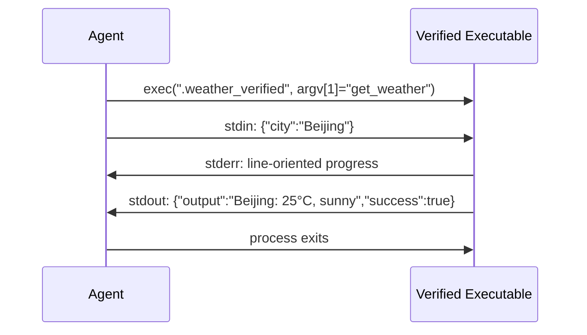
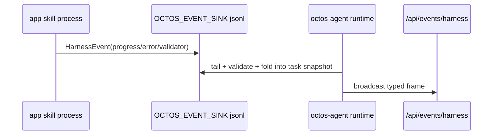

# Chapter 9: Extension Mechanisms: Skills, Plugins, and MCP

> **Positioning**: This chapter presents octos's current three extension tracks: Skills (Markdown declarative), Plugins (local executable tools / skill package extras), and MCP (standardized protocol integration). Prerequisites: Chapter 6. Applicable to contributors who want to write custom extensions for octos, and developers who want to understand Agent extension architecture design.

An Agent's value comes from its ability to adapt to different scenarios. Legal document review needs legal prompts, research Agents need long-running background work, and remote service integration needs a standard protocol. Forcing all of those needs into one extension mechanism would either over-engineer simple cases or under-specify complex ones.

octos's answer is not "one universal plugin system" but three complementary tracks:

- **Skills**: change the Agent's prompt and context
- **Plugins**: wrap local executables as Tools and carry skill package extras
- **MCP**: connect external tool servers through a standard protocol

---

## 9.1 Skills Track: Markdown Declarative Extensions

Skills are the lightest-weight extension mechanism. A skill is centered on a `SKILL.md` file, plus an optional `manifest.json`.

### 9.1.1 SKILL.md Format

```markdown
---
name: code-review
description: Review code changes for bugs, security issues, and style
version: 1.0.0
requires_bins: rg,git
requires_env: GITHUB_TOKEN
---

When reviewing code, focus on:
1. Security vulnerabilities
2. Error handling completeness
3. Behavior regressions
```

`SkillsLoader` does not implement a full YAML parser. It performs two simple operations:

1. `split_frontmatter()` finds the frontmatter block between the first pair of `---` delimiters (`../octos/crates/octos-agent/src/skills.rs:235-252`).
2. `fm_value()` reads simple `key: value` lines such as `name`, `description`, `requires_bins`, `requires_env`, and `always` (`../octos/crates/octos-agent/src/skills.rs:178-232,255-276`).

`available` is derived from this metadata: every command listed in `requires_bins` must exist, and every environment variable listed in `requires_env` must be present (`../octos/crates/octos-agent/src/skills.rs:196-212`).

### 9.1.2 SkillsLoader and Layered Overrides

`SkillsLoader` itself only maintains a list of skill directories; the actual priority is assembled by runtime code (`../octos/crates/octos-agent/src/skills.rs:31-176`). The current gateway path layers:

1. `data_dir/skills`
2. `project_dir/skills`
3. `project_dir/bundled-app-skills`
4. extra directories from `OCTOS_SKILLS_PATH`
5. built-in skills compiled into the binary

This layering comes from `../octos/crates/octos-cli/src/commands/gateway/gateway_runtime.rs:526-527,646-667` and `../octos/crates/octos-cli/src/commands/gateway/profile_factory.rs:538-617`. The implementation scans lower-priority directories first and higher-priority directories later, removing older same-name skills through `retain` (`../octos/crates/octos-agent/src/skills.rs:68-108`).

Configuration inheritance and local skill inheritance must be separated. Sub-accounts can inherit parent profile LLM/search/apps/email configuration, but customer-installed skills do **not** inherit from the parent account. `skills_scope.rs` scopes account skills and plugin dirs to the current account's own `data_dir/skills` (`../octos/crates/octos-cli/src/skills_scope.rs:1-38`).

### 9.1.3 XML Skill Index

`build_skills_summary()` converts the visible skill set into XML and injects it into the system prompt (`../octos/crates/octos-agent/src/skills.rs:137-154`):

```xml
<skills>
  <skill available="true" tools="true">
    <name>deep-search</name>
    <description>Deep web research...</description>
    <location>/.../SKILL.md</location>
  </skill>
</skills>
```

Three details are easy to get wrong:

- The current XML does not use a `name="..."` attribute; it uses a `<name>` child node.
- `tools="true"` means the skill directory contains `manifest.json`, not that the skill is currently executing tools.
- `location` exposes the real skill source path to the model, helping it distinguish built-ins from external skills.

### 9.1.4 spawn_only Tools

`spawn_only` is a marker on tool entries in plugin/skill manifests (`../octos/crates/octos-agent/src/plugins/manifest.rs:98-116`). Its runtime semantics live in the registry and execution loop:

- `PluginLoader` registers these tools as `spawn_only` (`../octos/crates/octos-agent/src/plugins/loader.rs:93-113`).
- `ToolRegistry` keeps custom prompt text and task tracking state for them (`../octos/crates/octos-agent/src/tools/registry.rs:123-178`).
- When the main Agent calls a `spawn_only` tool, it does not run it synchronously. It starts a background task and immediately returns the `spawn_only_message` to the model (`../octos/crates/octos-agent/src/agent/execution.rs:105-245`).

`spawn_only` tools are **not hidden from ToolSpec**. They remain registered and visible to the model; the difference is that invocation is automatically backgrounded.

When a skill package contains `spawn_only` tools, `resolve_extras()` also injects that package's `SKILL.md` as prompt fragments (`../octos/crates/octos-agent/src/plugins/extras.rs:52-61`). In subagent contexts, `clear_spawn_only()` removes the marker because the subagent is already a background context, so the tool executes like a normal tool (`../octos/crates/octos-agent/src/tools/registry.rs:136-143`).

---

## 9.2 Plugins Track: Binary Executable Extensions

Plugins let the Agent call external programs. In the current runtime, the manifest is more than a pure tool declaration; it can also carry skill package extras.

### 9.2.1 manifest.json

The runtime hot path uses `../octos/crates/octos-agent/src/plugins/manifest.rs`:

```json
{
  "name": "weather",
  "version": "1.0.0",
  "tools": [
    {
      "name": "get_weather",
      "description": "Get current weather for a location",
      "input_schema": { "type": "object", "properties": { "city": { "type": "string" } } },
      "env": ["WEATHER_API_KEY"],
      "risk": "medium",
      "concurrency_class": "safe"
    }
  ],
  "sha256": "a1b2c3...",
  "timeout_secs": 600,
  "requires_network": true
}
```

Current runtime manifests can also include `mcp_servers`, `hooks`, `prompts.include`, `binaries`, `spawn_only`, `spawn_only_message`, `env` / `env_allowlist`, `risk`, and `concurrency_class`. If `manifest.tools` is empty but MCP servers, hooks, or prompt fragments are present, `PluginLoader` skips executable discovery and still loads the extras (`../octos/crates/octos-agent/src/plugins/loader.rs:167-179`).

### 9.2.2 Binary Protocol



**Figure 9-1: Plugin binary protocol sequence diagram.** The runtime executes a hash-verified copy, passes the tool name as argv[1], sends JSON arguments through stdin, converts stderr lines to progress events, and parses stdout as structured JSON when possible.

Structured stdout supports more semantics than `output` / `success`, including `file_modified` and `files_to_send`. Runtime also tries to detect generated files from arguments or output text and trigger automatic file return (`../octos/crates/octos-agent/src/plugins/tool.rs:321-403`).

### 9.2.3 Security Measures

**SHA-256 integrity verification and TOCTOU defense**:

This is the most elegant design in Plugin security. The problem: if you verify the hash first and then execute the file, an attacker can replace the file between the two steps (a Time-of-Check-Time-of-Use attack). octos's solution is "read once, verify once, write a verified copy":

```rust
// 1. Read file bytes into memory -- read only once
let exe_bytes = std::fs::read(&executable)?;

// 2. Compute hash on the in-memory bytes
let actual_hash = format!("{:x}", Sha256::digest(&exe_bytes));
if actual_hash != expected_hash.to_lowercase() {
    eyre::bail!("plugin '{}' failed integrity check (hash mismatch)", manifest.name);
}

// 3. Write the verified bytes to a new file
let verified_exe = plugin_dir.join(format!(".{}_verified", exe_name));
let _ = std::fs::remove_file(&verified_exe);  // Old copy has 0o500 permissions, must delete first
std::fs::write(&verified_exe, &exe_bytes)?;

// 4. Set read-only+executable permissions to prevent subsequent tampering
#[cfg(unix)]
std::fs::set_permissions(&verified_exe, Permissions::from_mode(0o500))?;
```

**Key insight**: The same bytes are verified and executed (read into memory first, verify the in-memory data, then write it out). The original file can be arbitrarily modified after verification -- it doesn't matter because PluginTool executes the `.{exe}_verified` copy. The `0o500` permission (owner read-only + executable) prevents the copy itself from being overwritten.

If the manifest doesn't contain a `sha256` field, the Plugin can still be loaded but a warning is printed -- this is a progressive security design that doesn't block users but continuously reminds them.

**Environment and resource constraints**:

- 100MB executable size limit (`../octos/crates/octos-agent/src/plugins/loader.rs:213-224`)
- `BLOCKED_ENV_VARS` inheritance (`../octos/crates/octos-agent/src/plugins/loader.rs:273-275`, `../octos/crates/octos-agent/src/plugins/tool.rs:140-148`)
- tool-level `env` / `env_allowlist`: if explicitly listed, only those environment variables are passed; without an explicit list, legacy behavior remains, but secret-like extra env vars must be allowlisted (`../octos/crates/octos-agent/src/plugins/tool.rs:859-893`)
- `OCTOS_WORK_DIR` is injected for plugin output files (`../octos/crates/octos-agent/src/plugins/tool.rs:150-164`)
- default timeout is 600 seconds, not 30 seconds (`../octos/crates/octos-agent/src/plugins/tool.rs:35-48`)

**Risk and concurrency class**:

`risk` affects runtime approval. `high` / `critical` tools force interactive approval; if no approval bridge exists, runtime denies safely. `low` does not request approval by default, while `medium` and unknown values are surfaced but not hard-gated (`../octos/crates/octos-agent/src/plugins/manifest.rs:136-144`, `../octos/crates/octos-agent/src/plugins/tool.rs:772-820`).

`concurrency_class` recognizes `safe` and `exclusive`. Unknown values fail closed to `Exclusive`, preventing a misdeclared plugin from being executed concurrently against shared state (`../octos/crates/octos-agent/src/plugins/manifest.rs:220-263`, `../octos/crates/octos-agent/src/plugins/tool.rs:711-730`).

**Symlink rejection**: Unix executable discovery uses `symlink_metadata()` and accepts only regular files, rejecting symbolic links (`../octos/crates/octos-agent/src/plugins/loader.rs:332-340`).

### 9.2.4 Runtime PluginLoader vs `octos-plugin` SDK

Do not conflate the two layers:

**The current runtime hot path** is `../octos/crates/octos-agent/src/plugins/loader.rs`. It scans caller-provided directories, loads each subdirectory manifest, resolves extras, finds and verifies executables, creates verified copies, registers tools, and treats a single plugin failure as a warning instead of failing the entire load (`../octos/crates/octos-agent/src/plugins/loader.rs:73-140`).

**`../octos/crates/octos-plugin` is an SDK/tooling crate**, with discovery and gating abstractions:

- `discover_plugins()` scans source directories by priority and deduplicates (`../octos/crates/octos-plugin/src/discovery.rs:20-56`)
- `check_requirements()` gates by required binaries, env vars, and OS (`../octos/crates/octos-plugin/src/gating.rs:37-123`)
- its richer manifest includes fields such as `id`, `type`, `requires`, and `install`

The two layers are related, but the main Agent runtime does not first call `octos-plugin::discover_plugins()` for every plugin load. Runtime tool behavior should be read from `octos-agent/src/plugins/*`; marketplace, installer, and offline discovery behavior should be read from `octos-plugin`.

---

## 9.3 MCP Integration: Standardized Protocol

MCP (Model Context Protocol) is a standardized Agent tool integration protocol proposed by Anthropic. octos's MCP client (`../octos/crates/octos-agent/src/mcp.rs`) supports two transport methods.

### 9.3.1 Stdio vs HTTP POST

| Feature | Stdio Transport | HTTP Transport |
|---------|----------------|-------------------|
| Connection method | Local subprocess | HTTP POST; response can be JSON or `text/event-stream` |
| Latency | Very low (IPC) | Network latency |
| Security | Process isolation | SSRF protection + DNS pinning |
| Use case | Local tool servers | Remote service integration |

**Stdio transport** (`mcp.rs:74-116`): Starts a subprocess and transmits JSON-RPC 2.0 messages through stdin/stdout.

`read_line_limited()` (`mcp.rs:119-143`) is critical for MCP protocol security -- it checks the size limit **before** extending the buffer:

```rust
async fn read_line_limited(reader: &mut BufReader<ChildStdout>, limit: usize) -> Result<String> {
    let mut buf = Vec::with_capacity(4096);
    loop {
        let available = reader.fill_buf().await?;
        if available.is_empty() {
            eyre::bail!("MCP server closed connection");
        }
        if let Some(pos) = available.iter().position(|&b| b == b'\n') {
            buf.extend_from_slice(&available[..=pos]);
            reader.consume(pos + 1);
            break;
        }
        // Critical: check size BEFORE extending buffer
        if buf.len() + available.len() > limit {
            eyre::bail!("MCP response exceeds {}KB limit", limit / 1024);
        }
        let len = available.len();
        buf.extend_from_slice(available);
        reader.consume(len);
    }
    String::from_utf8(buf).wrap_err("MCP response is not valid UTF-8")
}
```

Why "check before extend" rather than "extend then check"? If a malicious MCP server sends a 1GB response without any `\n`, the latter approach would have already allocated 1GB of memory before the check. The former rejects the request before allocation.

**HTTP transport**: Sends requests via HTTP POST. Responses can be ordinary JSON or `text/event-stream`. HTTP startup performs SSRF checks and DNS pinning, and session affinity uses `mcp-session-id` / `Mcp-Session-Id` headers.

### 9.3.2 Security Constraints

| Constraint | Value | Purpose |
|-----------|-------|---------|
| Schema max depth | 10 levels | Prevent deep nesting DoS |
| Schema max size | 64KB | Prevent huge schemas from exhausting memory |
| Stdio single-line response max size | 1MB | Prevent local stdio servers from returning unbounded lines |
| `tools/call` timeout | 60 seconds | Prevent hanging servers |

### 9.3.3 Tool Name Protection

The `PROTECTED_NAMES` list (`mcp.rs:455-475`) contains 19 built-in tool names. Tools registered by MCP servers cannot use these names -- preventing external MCP servers from hijacking core tools (such as `shell`, `read_file`) through name collisions.

---

> ### Engineering Decision Sidebar: Why Three Extension Mechanisms Are Needed
>
> | Dimension | Skills | Plugins | MCP |
> |-----------|--------|---------|-----|
> | Implementation complexity | Very low (a single .md file) | Medium (binary + manifest) | Higher (requires JSON-RPC implementation) |
> | Capability scope | Prompt injection (behavior modification) | Full tools (action execution) | Full tools + context provision |
> | Language restriction | None (plain text) | None (any language) | Must implement MCP protocol |
> | Deployment method | Copy .md file | Install binary | Run server |
> | Security boundary | None (just prompt text) | SHA-256 + env cleanup | SSRF + Schema validation |
> | Use case | Behavior customization, knowledge injection | Standalone tool capabilities | Ecosystem integration |
>
> **Why not unify into a single mechanism?**
>
> Skills and Plugins serve different abstraction levels. Skills change the Agent's "way of thinking" (through prompt injection) and require no code execution capability. Implementing Skills as Plugins would introduce unnecessary binary dependencies and security risks. Conversely, Plugins need to perform actual operations (network requests, file processing), which is impossible with pure text prompts.
>
> MCP and Plugins both provide tool capabilities, but MCP's standardized protocol allows cross-Agent-platform reuse -- a single MCP server can be used simultaneously by octos, Claude Desktop, and other MCP-supporting Agents. The Plugin stdin/stdout protocol is simpler but lacks cross-platform reusability.
>
> The three mechanisms cover the full spectrum from "zero-code customization" to "complete tool development" to "ecosystem integration," enabling users at different skill levels to extend octos.

---

## 9.4 Harness Engineering Contract: ABI, Events, Validators

Skills, Plugins, and MCP answer the question "how does a capability enter octos?" Harness answers a different question: after a capability runs, how does its result become verifiable, observable, and upgrade-safe engineering evidence?

### 9.4.1 ABI versioning: `schema_version` is not manifest version

`abi_schema.rs` centralizes runtime payload schema versions for `WorkspacePolicy`, `CompactionPolicy`, `HookPayload`, `ProgressEvent`, `TaskResult`, `SessionSummary`, swarm dispatch, cost attribution, routing decisions, credential-pool config, and harness error events (`../octos/crates/octos-agent/src/abi_schema.rs:1-142`). These versions describe the serialized shapes the octos runtime can understand, not the release version of a plugin or skill.

The key rule is fail-closed compatibility. `check_supported(kind, found, supported)` returns a typed error for future versions instead of silently ignoring unknown fields (`../octos/crates/octos-agent/src/abi_schema.rs:144-186`). This lets external skills evolve with the runtime while preventing old runtimes from misreading new payloads.

### 9.4.2 `OCTOS_EVENT_SINK`: structured side-channel

An external app skill does not have to link the octos runtime, but it still needs a way to report progress, errors, validator results, cost, or swarm events. Harness exposes that path through environment variables: `OCTOS_EVENT_SINK` points to a local JSONL sink, while `OCTOS_SESSION_ID` / `OCTOS_TASK_ID` and `OCTOS_HARNESS_SESSION_ID` / `OCTOS_HARNESS_TASK_ID` provide correlation context (`../octos/crates/octos-agent/src/harness_events.rs:1-38`).

This is not a log file. stdout remains the tool result protocol. The event sink is a structured event ABI validated as `HarnessEvent`; each event line has a size limit and is validated before being appended to JSONL (`../octos/crates/octos-agent/src/harness_events.rs:116-132`).



### 9.4.3 Validator runner: not a shell hook

The validator runner is the safe executor for workspace contracts. Command validators reuse `SafePolicy`, strip `BLOCKED_ENV_VARS`, terminate timed-out children, and write evidence under `<workspace_root>/.octos/validator-evidence/` (`../octos/crates/octos-agent/src/validators.rs:1-24`). Outcomes are persisted as schema-versioned JSONL; required validator failures block terminal success, while optional failures produce warnings.

This differs from ordinary hooks. Hooks mainly alter pre/post execution control flow; validators provide replayable evidence for artifacts and workspace contracts. They are the shared foundation behind Chapter 8's contract-gated compaction and Chapter 12's workflow artifact gates.

### 9.4.4 Starter app skills as reference implementations

`harness-starter-*` crates are not toy demos. They are reference implementations for manifest declarations, concurrency class, artifact bindings, validators, and lifecycle smoke tests. The `harness-starter-audio` smoke test checks not only that the manifest parses, but also that `synthesize_clip` declares `concurrency_class = "exclusive"` because it writes `audio/<slug>.wav`; the same test verifies the `primary_audio` artifact and `file_size_min:$primary_audio:4096` validator (`../octos/crates/app-skills/harness-starter-audio/tests/harness_smoke.rs:23-79`).

`harness-starter-report` shows a smaller report contract: `reports/*.md`, completion `file_exists`, verification `file_size_min`, and failure notification (`../octos/crates/app-skills/harness-starter-report/workspace-policy.toml:1-29`). When writing a new app skill, treat these starters as an engineering checklist, not just business-code examples.

| File | Role | What to check |
|------|------|---------------|
| `manifest.json` | Tool declaration | name, input schema, risk, concurrency class |
| `workspace-policy.toml` | Artifact contract | primary artifact, completion validator, failure action |
| `tests/harness_smoke.rs` | Quality gate | manifest parses, artifact matches, validator can pass, lifecycle projects |

## 9.5 Chapter Summary

1. **Skills**: Markdown declarative extensions that inject prompt context through `SKILL.md`. The runtime builds a layered skill view; current-account skills have highest priority, while parent-account customer skills do not enter sub-accounts.

2. **Plugins**: Local executables wrapped as Tools and skill package extras. Runtime `PluginLoader` handles discovery, SHA-256 verified copies, env allowlists, risk, concurrency class, work-dir injection, and non-fatal skips.

3. **MCP**: Standardized protocol integration through stdio and HTTP POST. Schema validation, stdio line limits, `tools/call` timeout, SSRF protection, DNS pinning, and tool name protection constrain risk.

4. **Design principle**: Three mechanisms cover different abstraction levels -- from zero-code prompt customization to complete tool development to cross-platform ecosystem integration.

5. **Harness**: ABI versioning, event sinks, validator runners, and starter app skills define the extension engineering contract, making external capabilities verifiable, observable, and upgrade-safe.

Part 2 concludes here. The next chapter begins Part 3 -- the architectural upgrade from single-machine to multi-tenant platform, starting with octos-bus's message bus design (see Chapter 10).

---

## Further Reading

- **Model Context Protocol**: https://modelcontextprotocol.io/ -- MCP official specification
- **JSON-RPC 2.0**: https://www.jsonrpc.org/specification -- MCP underlying transport protocol
- **Plugin Architecture Pattern**: *Patterns of Enterprise Application Architecture* "Plugin" chapter

## Discussion Questions

1. **Skills vs System Prompt**: Skills are essentially prompt injection. Why not put all skill content directly in the system prompt instead of designing a loading mechanism?

2. **Plugin security boundary**: Current SHA-256 verification prevents TOCTOU attacks, but if the manifest.json itself is tampered with (hash and binary replaced together), verification fails. How would you strengthen the Plugin's chain of trust?

3. **MCP and Plugin convergence**: If a tool needs both local execution (low latency) and cross-platform reuse (standard protocol), would you choose Plugin or MCP? Could you design a hybrid approach?

---

> **Version Evolution Note**
> This chapter is updated against the current `octos` main branch. When reading later versions, re-check `../octos/crates/octos-agent/src/skills.rs`, `../octos/crates/octos-agent/src/plugins/`, `../octos/crates/octos-agent/src/mcp.rs`, `../octos/crates/octos-agent/src/abi_schema.rs`, `../octos/crates/octos-agent/src/harness_events.rs`, `../octos/crates/octos-agent/src/validators.rs`, `../octos/crates/octos-plugin/src/`, and `../octos/crates/app-skills/harness-starter-*`.
