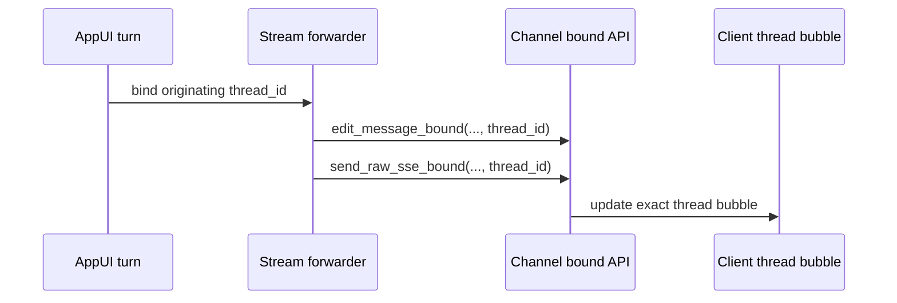
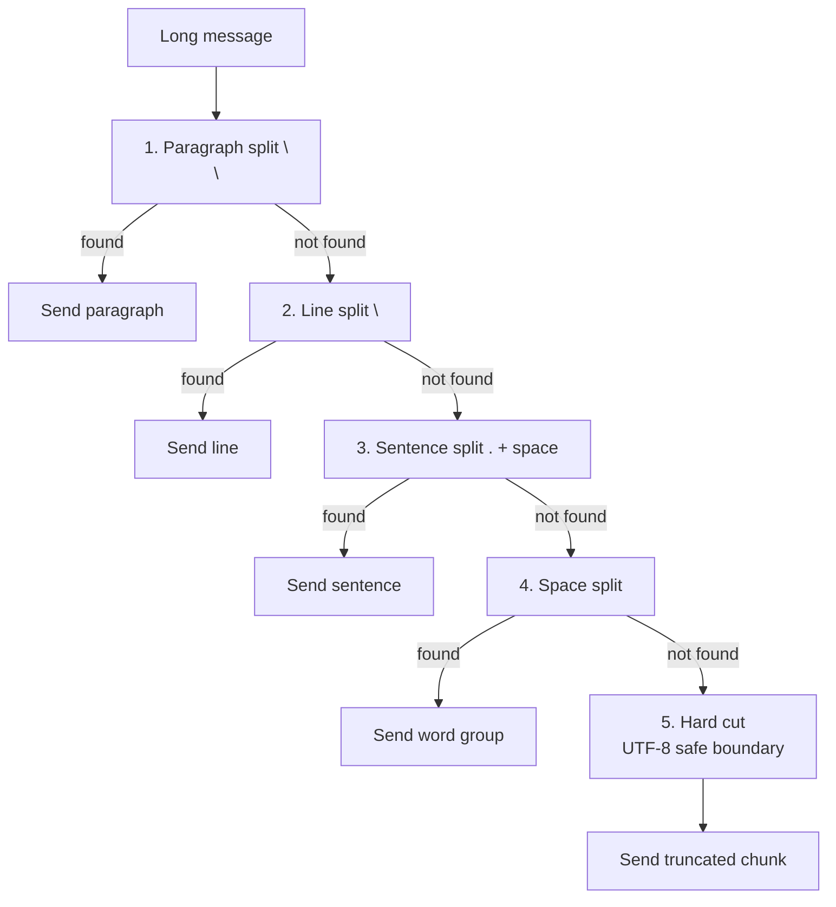
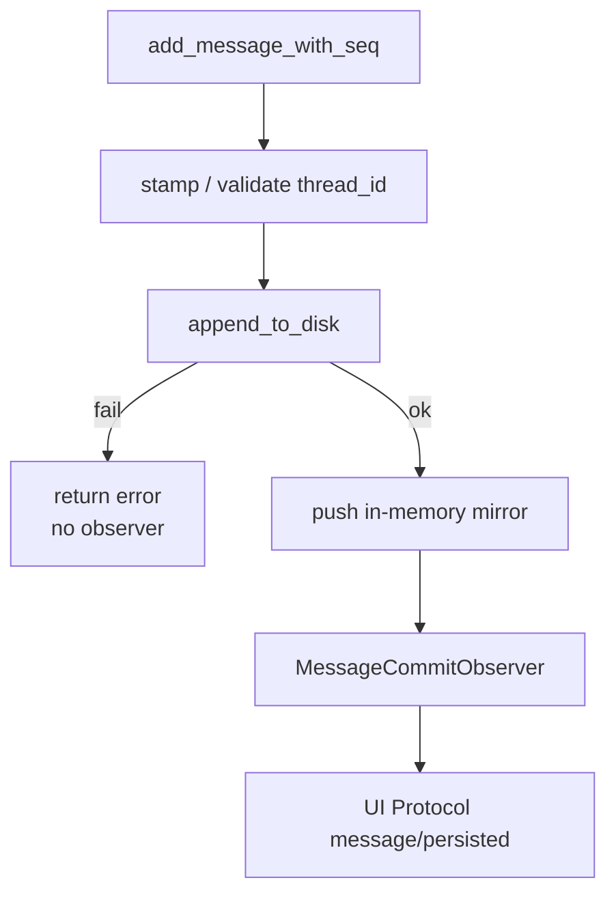

# Chapter 10: octos-bus: Unified Message Abstraction for 14 Channels

> **Positioning**: This chapter dives into the octos-bus crate (~19,600 lines), showing how the `Channel` trait provides a unified abstraction over 14 message channels, along with session management and message chunking. Prerequisites: Chapter 5. Target audience: developers seeking to understand multi-channel messaging platform architecture (Reader B), and contributors who need to integrate new channels (Reader D).

When an Agent moves from a single-user CLI to a multi-user platform, the complexity of the message ingestion layer increases dramatically. Telegram's message length limit is 4,000 characters, Discord's is 1,900; Slack uses Block Kit for message formatting, Feishu uses Rich Text; email is asynchronous, and WhatsApp requires template messages. octos-bus unifies all these differences with a single `Channel` trait.

---

## 10.1 Channel Trait: A Unified Message Interface

The Channel trait (`crates/octos-bus/src/channel.rs:17-230`) defines the unified interface for all channels:

The Channel trait is wide, but only `name()`, `start()`, and `send()` have no default implementation. Everything else is an opt-in capability:

```rust
#[async_trait]
pub trait Channel: Send + Sync {
    fn name(&self) -> &str;
    async fn start(&self, inbound_tx: mpsc::Sender<InboundMessage>) -> Result<()>;
    async fn send(&self, msg: &OutboundMessage) -> Result<()>;
    fn max_message_length(&self) -> usize;  // defaults to 4000
    fn is_allowed(&self, _sender_id: &str) -> bool { true }
    async fn send_typing(&self, _chat_id: &str) -> Result<()> { Ok(()) }
    fn supports_edit(&self) -> bool { false }
    async fn send_with_id(&self, msg: &OutboundMessage) -> Result<Option<String>> { ... }
    async fn edit_message(&self, ...) -> Result<()> { ... }
    async fn finish_stream(&self, ...) -> Result<()> { ... }
    async fn edit_message_bound(&self, ..., thread_id: Option<&str>) -> Result<()> { ... }
    async fn send_raw_sse_bound(&self, ..., thread_id: Option<&str>) -> Result<()> { ... }
    async fn health_check(&self) -> Result<ChannelHealth> { ... }
}
```

This "large trait + many defaults" design lets simple channels implement only 3 methods, while mature channels override `max_message_length()`, `supports_edit()`, `send_with_id()`, `edit_message()`, `format_outbound()`, or `health_check()` as needed. The tradeoff is a wide trait surface; the benefit is that Gateway can route many platform capabilities through one abstraction.

Key methods: `start()` receives an `mpsc::Sender<InboundMessage>`, through which the channel sends received user messages to the Agent processing layer. `send()` is responsible for delivering the Agent's response to the target channel. `max_message_length()` returns the platform-specific character limit (default 4000).

`send_with_id()` returns a message ID, enabling subsequent edits (in streaming output scenarios, a placeholder message is sent first, then progressively updated). The default implementation delegates to `send()` and returns `None`.

### 10.1.1 Three-Step Streaming Edit

For channels that support message editing (`supports_edit()` returns `true`), octos uses a three-step approach for streaming output:

1. **`send_with_id()`**: Send the initial message (possibly just a few tokens), returning the platform message ID
2. **`edit_message()`**: As the LLM streams output, continuously update the same message's content (`channel.rs:85-95`)
3. **`finish_stream()`**: After the stream ends, send the final version to ensure message completeness (`channel.rs:100-107`)

This pattern lets users see the Agent's reply being generated progressively, rather than waiting for the complete response to appear all at once. Both Telegram and Discord support this pattern. For channels that don't support editing (such as email), it falls back to waiting for the complete response before sending it all at once.

### 10.1.2 Thread-Bound Streaming: Bind the Turn Explicitly

The current streaming edit interface adds bound variants:

- `edit_message_bound(chat_id, message_id, content, thread_id)`
- `finish_stream_bound(chat_id, message_id, content, thread_id)`
- `send_raw_sse_bound(chat_id, json, thread_id)`

The important part is the explicit originating `thread_id`. In rapid-fire Web turns, the old path could recover thread identity from a decoded message id or a per-chat sticky map. If a later turn rotated the sticky map before an earlier turn's late delta arrived, that delta could land in the wrong bubble. The bound API says: if the caller already knows the turn, do not infer it from shared state (`crates/octos-bus/src/channel.rs:85-177`).



The default implementation still delegates to `edit_message()` or `send_raw_sse()`, so Telegram, Discord, and other channels that do not track AppUI threads remain compatible. API/SSE channels can override the bound methods and route every frame to the correct thread. `health_check()` gives the admin dashboard one unified way to ask channels for operational status (`crates/octos-bus/src/channel.rs:216-230`).

### 10.1.3 AgentHandle Symmetric Design

The message bus uses `AgentHandle` (`crates/octos-bus/src/bus.rs`) to connect channels and the Agent processing layer:

```rust
// AgentHandle contains bidirectional channels
struct AgentHandle {
    inbound_tx: Sender<InboundMessage>,   // Channel → Agent
    outbound_rx: Receiver<OutboundMessage>, // Agent → Channel
}

struct BusPublisher {
    inbound_rx: Receiver<InboundMessage>,  // Agent receives messages here
    outbound_tx: Sender<OutboundMessage>,  // Agent sends responses here
}
```

The advantage of this symmetric design is: when all Channels close (all `inbound_tx` are dropped), `inbound_rx.recv()` returns `None`, and the Agent processing layer automatically detects that there are no more messages and can exit gracefully. No additional shutdown signal is needed.

### 10.1.4 is_allowed: Sender Authorization

`is_allowed()` (`channel.rs:28`) checks whether a sender is authorized to use the Agent before routing a message. The default implementation returns `true` (allowing everyone), and each channel can override it to implement custom authorization logic — for example, Telegram can restrict access to only users with specific chat_ids.

---

## 10.2 Message Coalescing: 5-Level Split Strategy

When the Agent's reply exceeds a channel's character limit, the long message needs to be split into multiple shorter messages. octos-bus's coalescing algorithm (`crates/octos-bus/src/coalesce.rs:29-80`) attempts splitting at 5 priority levels:



**Figure 10-1: 5-level message split strategy.** Splits preferentially at semantic boundaries; hard cutting is the last resort.

**MAX_CHUNKS = 50**: Prevents extremely long messages from being split into hundreds of small messages causing DoS. After 50 chunks, the code appends a standalone marker in the form `[message truncated - N chars omitted]`.

**UTF-8 Safety**: When hard cutting, `is_char_boundary()` is used to fall back to a safe character boundary (using the same strategy as octos-core's `truncate_utf8`, see Chapter 2).

**Platform-specific limits** (`coalesce.rs:6-24`):

| Channel | Character Limit | Configuration Method |
|---------|----------------|---------------------|
| Telegram | 4,000 | `ChunkConfig::telegram()` |
| Discord | 1,900 | `ChunkConfig::discord()` |
| Slack | 3,900 | `ChunkConfig::slack()` (slack_channel.rs:148) |
| Email | Unlimited | Coalescing not invoked |
| Default | 4,000 | `ChunkConfig::default_limit()` |

### 10.2.1 find_break_point: Core Split Logic

`find_break_point()` (`coalesce.rs:84-120`) is the core of the splitting — it finds the optimal break point within a given string slice:

```rust
fn find_break_point(text: &str, max_len: usize) -> usize {
    // 1. Try to split at paragraph boundary
    if let Some(pos) = text[..max_len].rfind("\n\n") {
        return pos + 2;  // include the newline
    }
    // 2. Try to split at line boundary
    if let Some(pos) = text[..max_len].rfind('\n') {
        return pos + 1;
    }
    // 3. Try to split at sentence boundary
    if let Some(pos) = text[..max_len].rfind(". ") {
        return pos + 2;
    }
    // 4. Try to split at space
    if let Some(pos) = text[..max_len].rfind(' ') {
        return pos + 1;
    }
    // 5. Hard cut — fall back to UTF-8 safe boundary
    let mut limit = max_len;
    while limit > 0 && !text.is_char_boundary(limit) {
        limit -= 1;
    }
    limit
}
```

Note that every level uses `rfind()` (searching right to left) — this ensures the split point is as close to `max_len` as possible, maximizing the content in each message chunk. If `find()` (left to right) were used, the first paragraph break might be near the beginning of the message, resulting in excessively small chunks.

---

## 10.3 Session Management

### 10.3.1 Session Struct

Session (`crates/octos-bus/src/session.rs:68-79`) is the persistence unit for conversations:

```rust
pub struct Session {
    pub key: SessionKey,               // session identifier (channel:chat_id)
    pub parent_key: Option<SessionKey>, // fork origin
    pub topic: Option<String>,          // multi-topic support
    pub messages: Vec<Message>,         // conversation history
    pub summary: Option<String>,        // session summary
    pub created_at: DateTime<Utc>,
    pub updated_at: DateTime<Utc>,
}
```

### 10.3.2 JSONL Persistence and File Naming

Session persistence is slightly more precise than "one JSON message record per line". The first JSONL line is `SessionMeta`; subsequent lines are `Message` records. The code also supports both legacy and per-user layouts:

1. Legacy flat layout: `data/sessions/{encoded-key}[_{hash}]?.jsonl`
2. Per-user layout: `data/users/{encoded_base_key}/sessions/{topic_or_default}.jsonl`

Only the legacy flat layout uses the percent-encoded SessionKey plus optional FNV-1a hash suffix (`crates/octos-bus/src/session.rs:16-40`, `crates/octos-bus/src/session.rs:269-319`). The per-user layout moves the topic into a separate session file under the encoded user base key.

**Schema version**: `CURRENT_SESSION_SCHEMA = 1` (`session.rs:14`), reserved for future format migration.

Normal appends use `append_to_disk()`, which writes metadata first for new files and then appends one message line. Full session rewrites use write-then-rename (`crates/octos-bus/src/session.rs:430-533`).

The rewrite temp path now includes process PID plus a monotonic counter: `{target}.jsonl.{pid}-{seq}.tmp` (`crates/octos-bus/src/session.rs:101-114`). This prevents concurrent rewrites of the same parent session from sharing one `.tmp` file. Without that uniqueness, two background child tasks can truncate each other's temp file and one child can be incorrectly marked orphaned.

**10MB file limit**: A single session file is capped at 10MB, preventing runaway conversation histories from exhausting disk space.

### 10.3.3 `/new` Fork Mechanism

When a user sends `/new`, the underlying operation is `fork(parent_key, new_chat_id, copy_messages)` (`crates/octos-bus/src/session.rs:536-572`). It copies the latest `copy_messages` records, records `parent_key`, and writes a new session file. So `/new` is a branch with recent context, not only a fresh empty session.

### 10.3.4 SessionManager and LRU Cache

SessionManager (`session.rs:125`) manages the lifecycle of all sessions:

- **LRU in-memory cache**: Active sessions are kept in memory to reduce disk I/O
- **Lazy loading**: Inactive sessions are loaded from disk on demand
- **Concurrency safety**: Each session file is independent; reads and writes to different sessions don't block each other

### 10.3.5 `thread_id` Persistence: Fail Closed for New Writes

AppUI now groups messages by thread, not only by session. The rules are implemented in `derive_thread_id_for_new_write()` and `synthesize_thread_ids()` (`crates/octos-bus/src/session.rs:265-359`):

| Path | User | Assistant / Tool | System |
|------|------|------------------|--------|
| new write | `client_message_id`, or UUIDv7 if absent | caller must pre-stamp `thread_id`, otherwise write is rejected | `None` |
| legacy load | old `client_message_id`, or `synth_{seq}` | inherits current thread, or synthesizes a stable id | `None` |

The split is intentional. The old "look backward for the most recent user" derivation is wrong under concurrent rapid-fire turns: a sibling user can mutate in-memory history between a turn's user write and its assistant write. The new write path therefore fails closed for unbound Assistant/Tool rows and records `octos_session_persist_total{outcome="rejected_unbound_assistant"}` (`crates/octos-bus/src/session.rs:1034-1095`, `crates/octos-bus/src/session.rs:2053-2098`).

Legacy JSONL records cannot be rejected just because they predate `thread_id`. On load, `synthesize_thread_ids()` fills thread ids in memory so old transcripts can render as threads; future writes use the stricter new-write path.

### 10.3.6 Durable Commit Observer: `message/persisted` Means Committed

`MessageCommitObserver` is the durable commit hook from Session persistence to UI Protocol (`crates/octos-bus/src/session.rs:19-75`). `add_message_with_seq()` runs in this order:

1. Stamp or validate `thread_id`.
2. Call `append_to_disk()`. If it fails, return before notifying.
3. Push the message into the in-memory `Session::messages` mirror.
4. Notify the observer with `SessionKey`, `Message`, and committed sequence.



Observer failure or panic does not roll back the row; the durable commit already happened (`crates/octos-bus/src/session.rs:69-85`). So `message/persisted` should be read as "this row is durably visible", not "about to be written". UI Protocol tests lock this ordering and dedup behavior (`crates/octos-cli/src/api/ui_protocol.rs:10680-10880`).

### 10.3.7 Child-Session Contract

Session metadata also persists `ChildSessionContract` for background spawn and subagent lifecycle (`crates/octos-bus/src/session.rs:382-464`). It records:

- `task_id`, `task_label`
- `parent_session_key`, `child_session_key`
- `workflow_kind`, `current_phase`
- `terminal_state`: `Completed`, `RetryableFailure`, or `TerminalFailure`
- `join_state`: `Joined` or `Orphaned`
- `failure_action`: `Retry` or `Escalate`
- `output_files`

This means a child session is not tracked only by ordinary message history. The parent session needs a durable contract to know whether a background task finished, whether it joined back, and what to do with failures. This also explains why rewrite temp paths must be unique: multiple child tasks can finish and rewrite the same parent session metadata concurrently.

---

## 10.4 Coalescing Source Code Walkthrough

Let's dive into the complete implementation of `split_message()` (`coalesce.rs:34-82`) to understand how it balances safety and readability:

```rust
pub fn split_message(text: &str, config: &ChunkConfig) -> Vec<String> {
    if text.len() <= config.max_chars {
        return if text.is_empty() {
            vec![]
        } else {
            vec![text.to_string()]
        };
    }

    let mut chunks = Vec::new();
    let mut remaining = text;

    while !remaining.is_empty() {
        if chunks.len() >= MAX_CHUNKS {
            chunks.push(format!(
                "[message truncated - {} chars omitted]",
                remaining.len()
            ));
            break;
        }

        if remaining.len() <= config.max_chars {
            chunks.push(remaining.to_string());
            break;
        }

        let mut limit = config.max_chars.min(remaining.len());
        while limit > 0 && !remaining.is_char_boundary(limit) {
            limit -= 1;
        }
        let search = &remaining[..limit];
        let break_at = find_break_point(search);

        chunks.push(remaining[..break_at].trim_end().to_string());
        remaining = remaining[break_at..].trim_start_matches('\n');
        if remaining.starts_with(' ') && !remaining.starts_with("  ") {
            remaining = &remaining[1..];
        }
    }

    chunks
}
```

Key design points:

1. **Early return**: Empty input returns an empty vector; short input returns one chunk.
2. **UTF-8 safe search window first**: The code finds a safe boundary before looking for semantic break points.
3. **Boundary cleanup**: `trim_end()`, leading-newline removal, and single-space skipping keep chunks visually clean.
4. **MAX_CHUNKS protection**: Once 50 chunks have been produced, the function adds a standalone truncation marker rather than silently dropping the tail.

### 10.4.1 Unicode-Safe Boundary Detection

The hard-cut branch (level 5) of `find_break_point()` uses the same character boundary fallback algorithm as octos-core's `truncate_utf8`:

```rust
// Hard cut — retreat from max_len to a safe UTF-8 character boundary
let mut limit = max_len;
while limit > 0 && !text.is_char_boundary(limit) {
    limit -= 1;
}
limit
```

This guarantees that even when splitting at arbitrary positions within multi-byte characters such as Chinese, Japanese, or emoji, no invalid UTF-8 sequences are produced. Consider a message containing Chinese and emoji being split within Telegram's 4,000 character limit — without this protection, the split point might land in the middle of a 4-byte emoji, causing subsequent API calls to fail due to invalid UTF-8.

---

## 10.5 Channel Implementation Overview

octos-bus compiles each channel implementation on demand through feature flags. Each channel implements the specific methods of the `Channel` trait:

| Channel | Connection Method | Special Capabilities |
|---------|------------------|---------------------|
| Telegram | Long polling (teloxide) | Message editing, `AtomicBool` graceful shutdown |
| Discord | WebSocket gateway (serenity) | Message deduplication (MessageDedup) |
| Slack | WebSocket (tokio-tungstenite) | Block Kit format support |
| Feishu | HTTP webhook | Encrypted message verification |
| WhatsApp | HTTP API | Template messages |
| Email | IMAP/SMTP (async-imap + lettre) | Asynchronous send/receive, attachments |
| Matrix | HTTP API | AppService mode, multi-user bridging |
| WeCom | HTTP webhook | Encrypted messages |
| CLI | Terminal stdin/stdout | readline interaction |
| API | REST/SSE (axum) | Programmatic access |

Each channel implementation is independent — a bug in the Telegram channel won't affect Discord, because they are separate code paths compiled through different feature flags. This isolation design is the reason most of octos-bus's 19,600 lines of code come from independent channel implementations.

---

> ### Engineering Decision Sidebar: Why JSONL Instead of SQLite
>
> **Option 1: SQLite**
>
> Advantages: Structured queries, indexes, transactions
> Disadvantages: C dependency (conflicts with `deny(unsafe_code)`), single-file locking (concurrent writes require WAL mode), session backup requires export
>
> **Option 2: JSONL (octos's choice)**
>
> Advantages:
> - Plain text, pure Rust (zero C dependencies)
> - One file per session — natural concurrency isolation, reads and writes to different sessions never block each other
> - Backup = copy files, migration = move files
> - append-only + write-then-rename achieves atomic writes
>
> Disadvantages:
> - No indexes, cross-session queries require scanning all files
> - No transaction guarantees (but the single-file append-only scenario doesn't need transactions)
>
> **Rationale:** The access pattern for session storage is "read/write a single session by key," which doesn't require cross-session queries. JSONL's simplicity and concurrency safety are a perfect match for this pattern.

---

## 10.6 Engineering Details of Session Persistence

### 10.6.1 FNV-1a Hash

Session filenames use the FNV-1a 64-bit hash (`session.rs:18-27`) — a non-cryptographic hash function whose advantage lies in its minimalist implementation (10 lines of code) and uniform distribution. It is not used for security purposes (it doesn't defend against collision attacks), only for filename deduplication.

```rust
fn fnv1a_64(data: &[u8]) -> u64 {
    let mut hash: u64 = 0xcbf29ce484222325;  // FNV offset basis
    for &byte in data {
        hash ^= byte as u64;
        hash = hash.wrapping_mul(0x100000001b3);  // FNV prime
    }
    hash
}
```

### 10.6.2 Percent-encoding

`encode_path_component()` (`session.rs:31`) encodes special characters in the SessionKey to a URL-safe format. This prevents a key like `telegram:12345` from being interpreted as a directory path by the filesystem (since `:` is a special character on some filesystems).

### 10.6.3 write-then-rename Atomicity

The atomicity of JSONL writes is achieved through a two-step operation:

1. Write to a temporary file `{session_file}.tmp`
2. `rename()` the temporary file to the final file

On Unix/Linux, `rename()` is an atomic operation — it either succeeds completely (the new file replaces the old one) or fails completely (the old file remains unchanged). Even if the process crashes before `rename()`, it only leaves behind an orphaned `.tmp` file without affecting the actual session file.

---

## 10.7 Chapter Summary

1. **Channel trait**: A wide interface with only 3 required methods. `send_with_id()` + `edit_message()` + `finish_stream()` support streaming edits; bound variants carry explicit `thread_id` for concurrent AppUI turns.
2. **Coalescing**: 5-level semantic splitting (paragraph → newline → sentence → space → hard cut), MAX_CHUNKS=50 to prevent DoS, UTF-8 safe.
3. **Session**: JSONL first stores metadata, then message rows. The implementation supports both legacy flat layout and per-user layout, with unique rewrite temp paths for concurrent metadata rewrites.
4. **Thread binding**: New writes require Assistant/Tool messages to be pre-stamped with `thread_id`; legacy loads synthesize thread ids in memory for old transcripts.
5. **Durable observer and child contract**: `message/persisted` fires only after durable commit; background children persist terminal/join/failure state through `ChildSessionContract`.

---

## Further Reading

- **Server-Sent Events**: MDN "Using server-sent events" — Understanding the streaming message push pattern
- **Telegram Bot API**: https://core.telegram.org/bots/api — API details for the Telegram channel
- **JSONL Format**: https://jsonlines.org/ — Line-delimited JSON format specification

## Discussion Questions

1. **Boundaries of channel abstraction**: Some channels support rich text (Slack Block Kit, Feishu Rich Text), but `Channel::send()` only accepts plain text. How would you extend the trait to support rich text while maintaining backward compatibility?
2. **Session recovery**: If the octos process crashes, the last line of a JSONL file might be incomplete. How would you implement crash recovery?

---

> **Version Evolution Note**
> This chapter follows the current `../octos/crates/octos-bus/src/` source. When reading future versions, verify the `Channel` bound streaming methods, `Session` thread-id write rules, and `MessageCommitObserver` ordering before assuming message/thread behavior.
