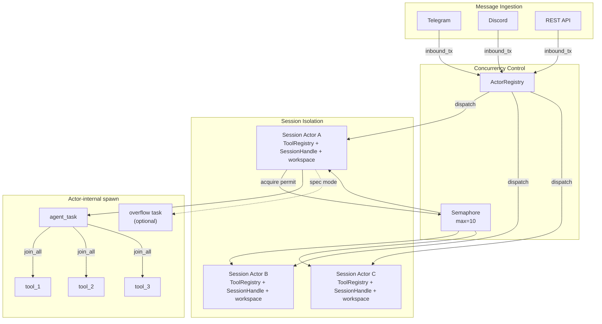
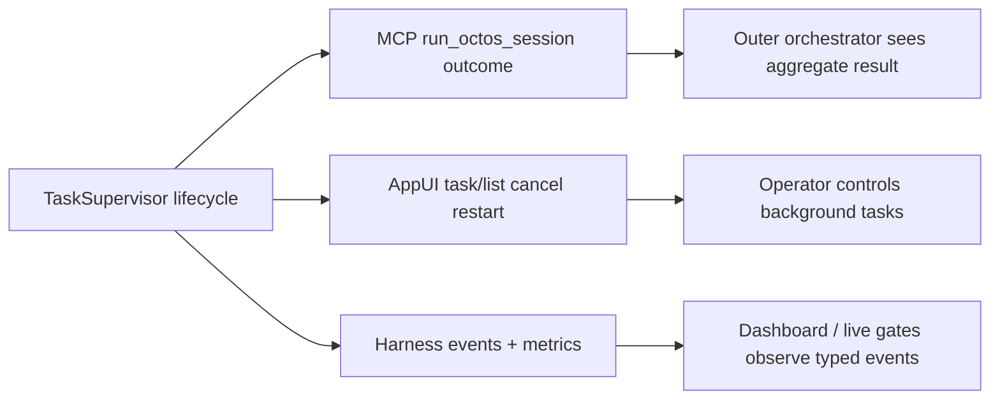

# Chapter 11: Concurrency Model: Tokio Async Architecture in Practice

> **Positioning**: This chapter shows how octos uses Tokio for production-grade concurrency: per-session actors, actor-internal agent tasks, tool fan-out, supervised background subagents, semaphore limits, and graceful shutdown. Prerequisites: Chapter 5, Chapter 10. Target audience: developers seeking to understand practical Rust async concurrency patterns (Reader B), and operators who need to tune concurrency parameters (Reader D).

In single-user CLI mode, the Agent executes sequentially. In Gateway or Serve mode, multiple users can send messages concurrently, each session can receive cancellation, background-task results, SSE updates, and speculative overflow messages, and a single LLM turn can invoke several tools. The current source is no longer the early "spawn each message plus shared Mutex" model; it is a layered concurrency structure: Gateway receives messages, `ActorRegistry` owns session lifecycle, each session actor owns its tool registry, session file handle, workspace, and cancellation state, and the actor explicitly spawns agent tasks, tool tasks, and background subagents when needed.

---

## 11.1 Layered Spawn: Session, Message, Tool, and Child Agent

`tokio::spawn()` appears at several layers:

1. **Session actor**: `ActorRegistry` creates a long-lived per-session actor via `ActorFactory::spawn()` and `tokio::spawn(actor.run())` (`../octos/crates/octos-cli/src/session_actor.rs:1494-1608`, `../octos/crates/octos-cli/src/session_actor.rs:2505-2559`).
2. **Message-level agent task**: API/speculative paths spawn the active Agent call so the actor can keep polling its inbox for cancellation, overflow, background results, and status changes (`../octos/crates/octos-cli/src/session_actor.rs:4280-4535`).
3. **Tool-level task**: a single LLM iteration can spawn one task per tool call and fan results back in (`../octos/crates/octos-agent/src/agent/execution.rs:44-60`, `../octos/crates/octos-agent/src/agent/execution.rs:105-245`).
4. **Background subagent / spawn_only**: background `spawn` and `spawn_only` tools start long-running work outside the foreground turn (`../octos/crates/octos-agent/src/tools/spawn.rs:2282-3024`, `../octos/crates/octos-agent/src/agent/execution.rs:220-455`).

The benefit is explicit ownership at every boundary: session actors own session state, message tasks keep the actor responsive, tool tasks improve single-turn latency, and background subagents move long work out of the foreground conversation. `spawn_only` is not fire-and-forget; visible state is maintained by `TaskSupervisor`.

## 11.2 Session Actor: Session-Level State Ownership

Messages from different users can run in parallel, but each session's core state needs one owner. Otherwise concurrent turns can race over message history, tool registry state, workspace state, cancellation, and background-task routing.

octos uses a session actor (`../octos/crates/octos-cli/src/session_actor.rs`) for that owner semantics:

```rust
// session_actor.rs key constants
const ACTOR_INBOX_SIZE: usize = 32;          // actor mailbox capacity
pub const DEFAULT_IDLE_TIMEOUT_SECS: u64 = 1800; // 30 minutes idle
const MAX_OVERFLOW_TASKS: u32 = 5;           // max overflow tasks per session
const MAX_PENDING_PER_SESSION: usize = 50;   // inactive-session outbound buffer
```

Each actor owns more than a queue: it holds a `ToolRegistry`, `SessionHandle`, per-user workspace, cancellation flags, streaming reporter wiring, and background-task plumbing (`../octos/crates/octos-cli/src/session_actor.rs:2428-2560`).

### 11.2.1 ActorMessage: Type-Safe Message Dispatch

Session actors receive messages through the `ActorMessage` enum (`../octos/crates/octos-cli/src/session_actor.rs:1412-1468`):

```rust
pub enum ActorMessage {
    /// User message — triggers Agent iteration
    Inbound {
        message: InboundMessage,
        image_media: Vec<String>,
        attachment_media: Vec<String>,
        attachment_prompt: Option<String>,
    },
    /// Background sub-Agent result — injected as system message, does not trigger additional LLM calls
    BackgroundResult {
        task_label: String,
        content: String,
        kind: BackgroundResultKind,
        media: Vec<String>,
        originating_thread_id: Option<String>,
        ack: Option<oneshot::Sender<bool>>,
    },
    /// Background task status change — pushed to SSE
    TaskStatusChanged { task_json: String },
    /// Cancel current operation
    Cancel,
    /// spawn_only failure recovery hint
    RecoveryHint { /* task_id, tool_name, prompt, originating_client_message_id */ },
}
```

Rust's enum makes the actor's accepted messages explicit. The current enum also shows the runtime's scope: user input, attachments, background results, task-status updates, cancellation, and recovery hints all flow through the same owner.

### 11.2.2 ActorRegistry: Session Lifecycle Management

`ActorRegistry` (`../octos/crates/octos-cli/src/session_actor.rs:1494-1735`) manages actor lifecycle:

```rust
pub struct ActorRegistry {
    actors: HashMap<String, ActorHandle>,        // active actor table
    factory: Arc<ActorFactory>,                  // default Agent factory
    profile_factories: HashMap<String, Arc<ActorFactory>>,  // profile-specific factories
    semaphore: Arc<Semaphore>,                   // concurrency limit
    out_tx: mpsc::Sender<OutboundMessage>,       // output channel
    pending_messages: PendingMessages,           // buffered messages
}
```

When a new message arrives, `dispatch()` resolves the actor key from session key plus profile, then:

- **Finished actor**: remove it before sending to a dead mailbox (`../octos/crates/octos-cli/src/session_actor.rs:1568-1573`).
- **Missing actor**: call `factory.spawn(...)`, preserving `system_prompt_override`, `sender_user_id`, and profile factory key for respawn (`../octos/crates/octos-cli/src/session_actor.rs:1575-1598`).
- **Existing actor**: first `try_send()`; if the inbox is full, send a backpressure notice and then await `send()` (`../octos/crates/octos-cli/src/session_actor.rs:1608-1626`).

`ActorHandle::is_finished()` checks `JoinHandle::is_finished()` to determine if the actor has exited — this is zero-overhead and requires no additional heartbeat mechanism.

### 11.2.3 Mailbox, Backpressure, and Overflow Are Different

The limits have similar names but different semantics:

1. **`ACTOR_INBOX_SIZE = 32`**: actor mailbox capacity.
2. **`MAX_PENDING_PER_SESSION = 50`**: outbound reply buffering for inactive sessions, not inbound user-message queueing (`../octos/crates/octos-cli/src/session_actor.rs:80-102`, `../octos/crates/octos-cli/src/session_actor.rs:2608-2616`).
3. **`MAX_OVERFLOW_TASKS = 5`**: speculative mode's per-session concurrent overflow-agent cap; over the cap, octos returns a busy response instead of queueing forever (`../octos/crates/octos-cli/src/session_actor.rs:5268-5300`).

These protect different resources: mailbox capacity, inactive-session outbound buffering, and controlled concurrency inside one session.

### 11.2.4 Concurrency Model Overview



**Figure 11-1: octos concurrency model overview.** Messages enter `ActorRegistry`; session actors own state; the semaphore limits active processing, not actor count; actors explicitly spawn agent, tool, and overflow tasks.

---

## 11.3 Semaphore Rate Limiting

Unlimited active processing would exhaust CPU, memory, and LLM quota. `Arc<Semaphore>` limits active processing; the default comes from `GatewayConfig.max_concurrent_sessions = 10` (`../octos/crates/octos-cli/src/config.rs:720-777`), and Gateway Runtime creates the semaphore (`../octos/crates/octos-cli/src/commands/gateway/gateway_runtime.rs:1401-1406`).

```rust
// Acquire permit — if 10 sessions are already active, new messages wait here
let permit = semaphore.acquire().await?;
// Process message...
drop(permit); // Release permit, allowing the next waiting message to proceed
```

The permit is acquired when the actor starts real processing, not when the actor is created (`../octos/crates/octos-cli/src/session_actor.rs:4307-4310`, `../octos/crates/octos-cli/src/session_actor.rs:5814-5818`). Idle actors can stay resident without consuming concurrency slots.

## 11.4 Tool Concurrency: join_all

Within one Agent iteration, the LLM may request multiple tool calls. The execution layer spawns each call and fans results back in (`../octos/crates/octos-agent/src/agent/execution.rs:44-60`, `../octos/crates/octos-agent/src/agent/execution.rs:105-245`):

```rust
let handles: Vec<_> = tool_calls.iter()
    .map(|tc| tokio::spawn(execute_tool(tc)))
    .collect();
let results = futures::future::join_all(handles).await;
```

A tool task carries more than name and args: reporter, hooks, file-state cache, agent definitions, output router, cost accountant, parent session key, and spawn depth are cloned into the task context (`../octos/crates/octos-agent/src/agent/execution.rs:108-158`). Tool parallelism therefore still inherits the active turn's permissions and observability.

## 11.5 Sub-Agent Dual Modes

octos supports two sub-Agent execution modes:

### 11.5.1 Synchronous Blocking Mode

When the Agent invokes `spawn` with `mode = "sync"`, the tool constructs a child Agent, inherits the parent session's tool policy, caches, output router, and compaction policy, then runs the child through `run_task_with_m8_9_recovery()`. On the success path it also runs completion-phase validators before returning the child output as the current tool result (`../octos/crates/octos-agent/src/tools/spawn.rs:2133-2280`).

This is suitable for scenarios where the result is needed immediately — for example, search results that need to be used in the next LLM call.

### 11.5.2 Background Async Mode (spawn tool)

The `spawn` tool's background mode creates a completely independent background Agent task. The main Agent continues execution immediately without waiting for it. The detached closure snapshots the parent task id, originating thread id, hooks, workspace policy, parent caches, and spawn depth, then delivers the terminal payload back through the direct background result sender when possible (`../octos/crates/octos-agent/src/tools/spawn.rs:2308-2354`, `../octos/crates/octos-agent/src/tools/spawn.rs:2550-2570`, `../octos/crates/octos-agent/src/tools/spawn.rs:2961-3024`, `../octos/crates/octos-cli/src/session_actor.rs:1138-1168`).

```rust
// Simplified logic of the spawn tool
tokio::spawn(async move {
    let sub_agent = Agent::new(config);
    sub_agent.run_task(task).await;
    // Results notify the user via messages, not returned to the main Agent
});
// Main Agent continues immediately
```

User-facing background results split into two paths. `BackgroundResultKind::Notification` is delivered directly as a background notification with optional media and the originating thread id. `BackgroundResultKind::Report` is first normalized by `prepare_background_report_result()`; long reports are stored in the memory bank and surfaced as a readable notification (`../octos/crates/octos-cli/src/session_actor.rs:3888-3930`).

### 11.5.3 TaskSupervisor and Lifecycle Projection

`spawn_only` is not just `tokio::spawn`. Its hard problem is giving the frontend, parent Agent, control API, MCP server, and operator dashboard one consistent lifecycle truth. The current runtime centralizes that in `TaskSupervisor` (`../octos/crates/octos-agent/src/task_supervisor.rs:1-9`).

The supervisor stores coarse status (`Spawned`, `Running`, `Completed`, `Failed`, `Cancelled`), finer runtime phases (`ExecutingTool`, `ResolvingOutputs`, `VerifyingOutputs`, `DeliveringOutputs`, `CleaningUp`), and projects them to public lifecycle states (`Queued`, `Running`, `Verifying`, `Ready`, `Failed`, `Cancelled`) (`../octos/crates/octos-agent/src/task_supervisor.rs:88-123`, `../octos/crates/octos-agent/src/task_supervisor.rs:152-262`). It also enforces a default 200-child fan-out cap per parent via `OCTOS_MAX_CHILDREN_PER_PARENT`, poisons runaway parents, and force-fails active children when the cap fires (`../octos/crates/octos-agent/src/task_supervisor.rs:29-52`, `../octos/crates/octos-agent/src/task_supervisor.rs:1390-1484`).

The same lifecycle projects to different control surfaces. `octos mcp-serve` exposes `run_octos_session`, but it does not stream internal tool calls to the outer MCP caller. Instead, its lifecycle observer marks `Running`, `Verifying`, and finally `Ready` or `Failed`; the caller receives the aggregate session outcome (`../octos/crates/octos-cli/src/commands/mcp_serve.rs:16-35`, `../octos/crates/octos-agent/src/mcp_server.rs:410-493`).



The boundary is intentional: MCP Serve is coarse-grained session dispatch, not direct exposure of the internal octos tool catalog. Harness events are the operator observation surface, not the task result protocol.

---

## 11.6 Graceful Shutdown

When octos receives Ctrl-C, the current source uses two layers of flags, not one global boolean:

```rust
// Gateway Ctrl-C handler
shutdown.store(true, Ordering::Release);

// Agent loop / budget checks
if self.shutdown.load(Ordering::Acquire) {
    return BudgetStop::Shutdown;
}
```

The Gateway-level shutdown flag is set by the Ctrl-C handler and observed by the runtime loop and session actors (`../octos/crates/octos-cli/src/commands/gateway/gateway_runtime.rs:1320-1328`, `../octos/crates/octos-cli/src/commands/gateway/gateway_runtime.rs:1458-1488`, `../octos/crates/octos-cli/src/session_actor.rs:3060-3064`). Each actor also passes a per-session `cancelled` flag into the Agent via `.with_shutdown(cancelled.clone())` (`../octos/crates/octos-cli/src/session_actor.rs:2441-2448`).

The graceful shutdown flow:
1. Ctrl-C handler stores the Gateway shutdown flag.
2. Runtime loop stops dispatching new messages.
3. Shutdown waits up to 1 second for `actor_registry.shutdown_all()`; hung actors are left to runtime teardown so CLI shutdown is prompt.
4. Persona, heartbeat, cron, and channels stop concurrently (`../octos/crates/octos-cli/src/commands/gateway/gateway_runtime.rs:1830-1848`).

### 11.6.1 Four Phases of Shutdown

Graceful shutdown is not a simple `process::exit()` — it's an ordered resource release process:

1. **Stop dispatching new messages**: the Gateway loop observes shutdown notify or the next inbound message and exits before dispatch (`../octos/crates/octos-cli/src/commands/gateway/gateway_runtime.rs:1458-1488`).
2. **Wait for actors**: `shutdown_all()` drops actor senders and awaits join handles; Gateway Runtime currently bounds this to 1 second (`../octos/crates/octos-cli/src/session_actor.rs:1720-1735`, `../octos/crates/octos-cli/src/commands/gateway/gateway_runtime.rs:1830-1839`).
3. **Actor loop exits**: actors check `global_shutdown` / `cancelled` at loop boundaries (`../octos/crates/octos-cli/src/session_actor.rs:3037-3068`).
4. **Stop background services and channels**: persona, heartbeat, cron, and channel manager stop concurrently (`../octos/crates/octos-cli/src/commands/gateway/gateway_runtime.rs:1841-1848`).

### 11.6.2 Why Ordering Semantics Matter

```rust
// Wrong: Using Relaxed
shutdown.store(true, Ordering::Relaxed);   // Main thread
if shutdown.load(Ordering::Relaxed) { ... } // Agent thread
// Agent thread might see a stale value — on multi-core CPUs, the store might still be in the write buffer
```

The `Release` / `Acquire` pairing ensures a happens-before relationship: all writes by the main thread before `store(true, Release)` (such as the "stopped accepting new messages" state change) are visible to the Agent thread's reads after `load(Acquire)`.

`Relaxed` is insufficient here — although `Relaxed` on x86 architecture is nearly equivalent to `Acquire/Release` (because x86 has a strong memory model), on ARM and other weak memory model architectures, `Relaxed` could cause the Agent thread to see stale message queue state even after detecting that shutdown is `true`.

---

## 11.7 Cold-Start Advantage: Resident Process vs fork/exec

A per-request fork/exec model repeats process creation, runtime loading, provider initialization, and tool registry construction for every message. Gateway/Serve mode moves those costs toward startup and profile/session reuse.

At startup, Gateway builds the main profile provider stack. If fallback models are configured, it builds the `RetryProvider`, `ProviderChain`, or `AdaptiveRouter` chain, then wraps it in `SwappableProvider` for reuse by main-profile sessions (`../octos/crates/octos-cli/src/commands/gateway/gateway_runtime.rs:288-355`). Target profiles are handled lazily: the first dispatch to a profile builds and registers an `ActorFactory`, and later sessions for the same profile reuse it (`../octos/crates/octos-cli/src/session_actor.rs:1521-1549`).

`PROFILE_PROMPT_CACHE_CAP = 128` is a smaller version of the same idea: the fallback path caches profile prompts so the Gateway does not repeatedly hit disk when a profile does not yet have its own registered factory (`../octos/crates/octos-cli/src/commands/gateway/gateway_runtime.rs:58`, `../octos/crates/octos-cli/src/commands/gateway/gateway_runtime.rs:1758-1770`).

The source proves reuse and shifted initialization, not a universal millisecond benchmark. Real latency still depends on provider, tools, network, and deployment. The stable claim is that repeated work narrows to actor lookup/creation, mailbox send, and semaphore-gated processing.

---

## 11.8 Heartbeat and Cron

octos supports timed triggering of Agent sessions with three scheduling types:

| Type | Example | Precision |
|------|---------|-----------|
| Every | Every 5 minutes | Fixed interval |
| Cron | `0 9 * * 1-5` | Cron expression |
| At | Every day at 09:00 | Fixed time point |

Scheduled tasks parse expressions via the `cron` crate and register timers in the Tokio runtime. When triggered, a new session message is created and passes through the normal message processing pipeline.

---

> ### Engineering Decision Sidebar: From Per-session Mutex to Session Actor
>
> Earlier designs can be described as "per-session mutex + global semaphore": process messages concurrently across sessions, but serialize each session's mutable state with a lock.
>
> The current implementation has moved the core ownership boundary toward a **Session Actor**. Each active session owns its mutable state and processes commands through an actor-like task. This preserves the original invariant, one session is processed sequentially, but avoids letting unrelated tasks directly contend on a shared session mutex.
>
> The tradeoff is implementation complexity: replies, cancellation, restart, and lifecycle reporting now need explicit message shapes and response channels. The benefit is clearer state ownership and a better fit for AppUI task controls, MCP lifecycle projection, and background task supervision.

---

## 11.9 Chapter Summary

1. **Layered concurrency**: octos now uses Gateway dispatch → session actor → actor-internal message task / tool task / child Agent, not a single per-message spawn model.
2. **Session Actor**: each session owns its own ToolRegistry, SessionHandle, workspace, cancellation state, and mailbox.
3. **Semaphore rate limiting**: default 10 active processing slots; permits are acquired when real work starts, not when actors are created.
4. **Tools and background tasks**: `join_all` handles single-turn tool concurrency; `spawn` / `spawn_only` move long work out of the foreground loop; `TaskSupervisor` owns the background ledger, cancellation, and fan-out cap.
5. **Lifecycle projection**: MCP Serve, AppUI, and Harness events see different projections of the same task lifecycle: aggregate outcome for orchestrators, controls for operators, and typed events for dashboards.
6. **Graceful shutdown**: Gateway shutdown and per-session cancellation flags combine with Release/Acquire ordering to make ingress stop, task cancellation, actor cleanup, and service stop explicit.

---

## Further Reading

- **Tokio Tutorial**: https://tokio.rs/tokio/tutorial — Async Rust runtime
- **Rust Atomics and Locks**: Mara Bos's book, https://marabos.nl/atomics/ — Understanding Release/Acquire semantics
- **Structured Concurrency**: Nathaniel J. Smith, "Notes on structured concurrency" — Understanding spawn + join patterns

## Discussion Questions

1. **How many locks should remain inside an actor?** Session actors provide ownership, but local resources still use locks. If future features add cross-session caches, should the locks stay inside actors or move into a separate coordinator?
2. **Semaphore fairness**: When all 10 concurrency slots are occupied, in what order do waiting messages receive permits? Is Tokio's Semaphore FIFO?

---

> **Version Evolution Note**
> This chapter follows the current `../octos` main-branch source. If older material describes per-message spawn or a per-session Mutex as the core model, prefer the current `session_actor.rs`, `TaskSupervisor`, MCP lifecycle observer, and harness event surfaces: the concurrency boundary is now session actor + per-actor ownership + supervised background lifecycle.
