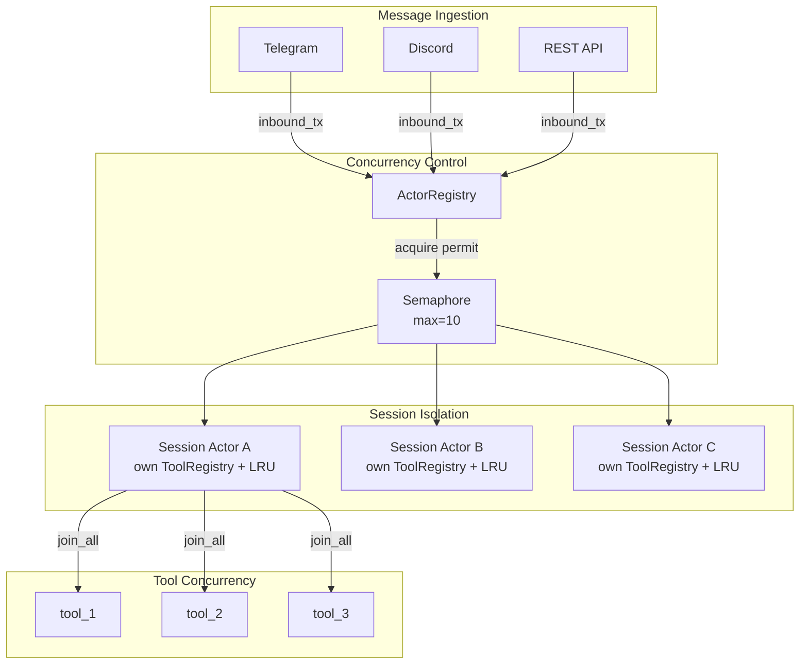
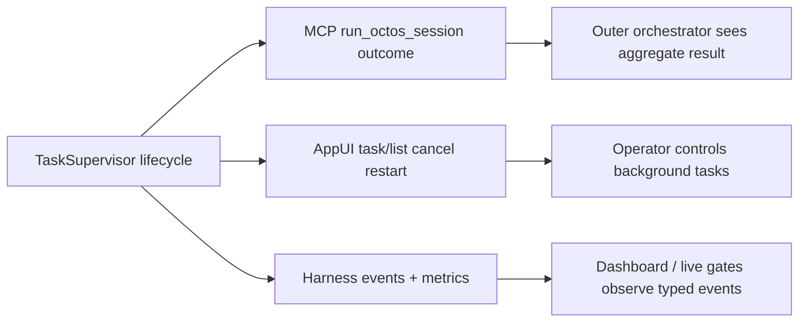

# Chapter 11: Concurrency Model: Tokio Async Architecture in Practice

> **Positioning**: This chapter shows how octos leverages the Tokio async runtime to achieve production-grade concurrency — from per-message task spawning to per-session Mutex serialization, from semaphore-based rate limiting to graceful shutdown. Prerequisites: Chapter 5, Chapter 10. Target audience: developers seeking to understand practical Rust async concurrency patterns (Reader B), and operators who need to tune concurrency parameters (Reader D).

In single-user CLI mode, the Agent executes sequentially on a single thread — no concurrency considerations are needed. But when octos runs in Gateway or Serve mode, multiple users send messages simultaneously, each message triggers an Agent iteration, and each iteration may invoke multiple tools in parallel. Concurrency correctness is no longer optional.

---

## 11.1 Per-message spawn: One Task per Message

When Gateway or Serve mode receives a user message, each message is spawned as an independent async task via `tokio::spawn()`. There are three spawn points in octos:

1. **Main message processing** (`loop_runner.rs:395`): User messages trigger Agent iterations
2. **Batch tool execution** (`execution.rs:50`): Multiple tools run in parallel within a single iteration
3. **Background sub-Agents** (`execution.rs:122`): Spawning long-running tasks derived from tools

Each spawned task has its own independent execution context. A task failure (panic) does not propagate to other tasks — Tokio's `JoinHandle` catches panics and converts them into `JoinError`.

## 11.2 Session Actor: Session-Level Serialization

While messages from different users are processed in parallel, **messages from the same user must be serialized**. If a user rapidly sends two messages in succession, the second must wait until the first finishes processing — otherwise both messages might simultaneously modify the same session state (message history, tool state), leading to data races.

octos uses the session actor pattern (`crates/octos-cli/src/session_actor.rs`) to implement serialization — each session is managed by an independent tokio task ("actor"):

```rust
// session_actor.rs key constants
const INBOX_CAPACITY: usize = 32;       // message queue capacity
const IDLE_TIMEOUT_SECS: u64 = 1800;   // reclaim after 30 minutes idle
const MAX_OVERFLOW_TASKS: usize = 5;    // max overflow tasks per session
const MAX_PENDING_MESSAGES: usize = 50; // max pending messages for inactive sessions
```

Each session actor owns its own tool registry (ToolRegistry) and message queue. This eliminates the race condition from the earlier design's `set_context()` — tool state is no longer shared across sessions.

### 11.2.1 ActorMessage: Type-Safe Message Dispatch

Session actors receive messages through the `ActorMessage` enum (`session_actor.rs:95-120`):

```rust
pub enum ActorMessage {
    /// User message — triggers Agent iteration
    Inbound {
        message: InboundMessage,
        image_media: Vec<String>,
    },
    /// Background sub-Agent result — injected as system message, does not trigger additional LLM calls
    BackgroundResult {
        task_label: String,
        content: String,
    },
    /// Background task status change — pushed to SSE
    TaskStatusChanged { task_json: String },
    /// Cancel current operation
    Cancel,
}
```

Rust's enum ensures message types are determined at compile time — it's impossible to send a message type that the actor doesn't understand. Go's channels typically pass `interface{}`, where type errors are only discovered at runtime.

### 11.2.2 ActorRegistry: Session Lifecycle Management

`ActorRegistry` (`session_actor.rs:140-175`) manages the lifecycle of all session actors:

```rust
pub struct ActorRegistry {
    actors: HashMap<String, ActorHandle>,        // active actor table
    factory: Arc<ActorFactory>,                  // default Agent factory
    profile_factories: HashMap<String, Arc<ActorFactory>>,  // profile-specific factories
    semaphore: Arc<Semaphore>,                   // concurrency limit
    out_tx: mpsc::Sender<OutboundMessage>,       // output channel
    pending_messages: PendingMessages,           // buffered messages
}
```

When a new message arrives, the `dispatch()` method checks whether the target session has an active actor:
- **Active and alive**: Sends the message to the actor's inbox via `actor.tx.send()`
- **Exists but finished** (idle timeout or panic): Creates a new actor, rebuilding context using the saved `system_prompt_override` and `sender_user_id`
- **None**: Acquires a semaphore permit, creates a new actor

`ActorHandle::is_finished()` checks `JoinHandle::is_finished()` to determine if the actor has exited — this is zero-overhead and requires no additional heartbeat mechanism.

### 11.2.3 Why Actor over Pure Mutex

Early octos used a "spawn-per-message + shared Mutex" pattern, but discovered a subtle issue: the LRU state in the tool registry (which tools were recently used, which were evicted) needs to be continuously maintained between message processing. Using a Mutex to protect only individual message processing causes LRU state to be lost between messages.

The session actor pattern gives each session persistent tool state — for the duration of the actor's lifetime (until the 30-minute idle timeout), tool LRU counters accumulate continuously.

### 11.2.2 Message Overflow Protection

`MAX_OVERFLOW_TASKS = 5`: If a session is processing a message and the same user rapidly sends more messages, at most 5 messages are allowed to queue. Excess messages are buffered in `PendingMessages` (`HashMap<SessionKey, Vec<OutboundMessage>>`) and delivered in batch after current processing completes.

`MAX_PENDING_MESSAGES = 50`: Inactive sessions (actor already reclaimed) buffer at most 50 pending messages. Excess messages are dropped and the user is notified. This prevents offline users from accumulating massive message queues that exhaust memory.

### 11.2.4 Concurrency Model Overview



**Figure 11-1: octos concurrency model overview.** Messages enter from channels → Semaphore rate limiting → ActorRegistry routes to session actors → tools execute in parallel within each actor. Each actor owns an independent ToolRegistry; LRU state is not shared across sessions.

---

## 11.3 Semaphore Rate Limiting

Unlimited concurrent sessions would exhaust system resources (CPU, memory, LLM API quotas). `Arc<Semaphore>` limits the number of simultaneously active sessions (default 10, configurable).

```rust
// Acquire permit — if 10 sessions are already active, new messages wait here
let permit = semaphore.acquire().await?;
// Process message...
drop(permit); // Release permit, allowing the next waiting message to proceed
```

Advantages of semaphore over a custom counter: `acquire().await` automatically suspends waiting tasks without consuming CPU; when a task completes or panics, the permit is automatically released (RAII), preventing leaks.

## 11.4 Tool Concurrency: join_all

Within a single Agent iteration, the LLM may request multiple tool calls (e.g., reading 3 files simultaneously). These tool calls are spawned in parallel via `tokio::spawn()`, then `join_all()` is used to wait for all results:

```rust
let handles: Vec<_> = tool_calls.iter()
    .map(|tc| tokio::spawn(execute_tool(tc)))
    .collect();
let results = futures::future::join_all(handles).await;
```

Parallel tool execution is a critical performance optimization for Agents — if 3 file reads each take 10ms, serial execution takes 30ms, while parallel execution takes only ~10ms.

## 11.5 Sub-Agent Dual Modes

octos supports two sub-Agent execution modes:

### 11.5.1 Synchronous Blocking Mode

When the Agent invokes a tool requiring a sub-Agent (such as `deep_search`) in the main loop, the tool synchronously waits for the sub-Agent to complete within the current iteration. The main Agent's loop pauses until the sub-Agent returns its result.

This is suitable for scenarios where the result is needed immediately — for example, search results that need to be used in the next LLM call.

### 11.5.2 Background Async Mode (spawn tool)

The `spawn` tool creates a completely independent background Agent task. The main Agent continues execution immediately without waiting for the background task to complete. The background Agent has its own token budget and iteration limits.

```rust
// Simplified logic of the spawn tool
tokio::spawn(async move {
    let sub_agent = Agent::new(config);
    sub_agent.run_task(task).await;
    // Results notify the user via messages, not returned to the main Agent
});
// Main Agent continues immediately
```

The background task's token usage is accumulated into the total via `TokenTracker`'s atomic counters, even if the main Agent has already finished its own work.

### 11.5.3 TaskSupervisor and Lifecycle Projection

`spawn_only` is not just `tokio::spawn`. Its hard problem is giving the frontend, parent Agent, control API, MCP server, and operator dashboard one consistent lifecycle truth. The current runtime centralizes that in `TaskSupervisor`.

The same lifecycle projects to different control surfaces. `octos mcp-serve` exposes `run_octos_session`, but it does not stream internal tool calls to the outer MCP caller. Instead, its lifecycle observer marks `Running`, `Verifying`, and finally `Ready` or `Failed`; the caller receives the aggregate session outcome (`crates/octos-cli/src/commands/mcp_serve.rs:13-35`; `crates/octos-agent/src/mcp_server.rs:1-34`).



The boundary is intentional: MCP Serve is coarse-grained session dispatch, not direct exposure of the internal octos tool catalog. Harness events are the operator observation surface, not the task result protocol.

---

## 11.6 Graceful Shutdown

When octos receives SIGTERM (or the user presses Ctrl-C), it needs to gracefully complete in-progress Agent conversations rather than terminating abruptly.

```rust
// Main thread: set the flag after receiving the signal
shutdown.store(true, Ordering::Release);

// Agent Loop: check the flag at each iteration
if self.shutdown.load(Ordering::Acquire) {
    return BudgetStop::Shutdown;
}
```

`Release` / `Acquire` semantics ensure: after the main thread writes `true`, any Agent task will see this value when reading. `Relaxed` semantics are insufficient — they don't guarantee cross-thread visibility ordering.

The graceful shutdown flow:
1. Stop accepting new messages
2. Wait for in-progress iterations to complete their current step
3. Save session state
4. Exit

### 11.6.1 Four Phases of Shutdown

Graceful shutdown is not a simple `process::exit()` — it's an ordered resource release process:

1. **Stop accepting new messages**: Close all Channels' inbound senders. BusPublisher's `recv()` returns `None`, and the message loop exits.
2. **Wait for active sessions to finish**: In-progress Agent iterations detect the `shutdown` flag at the next `check_budget()` call, completing the current step before exiting the loop.
3. **Save session state**: All active sessions' conversation histories are written to JSONL files.
4. **Release resources**: Close database connections (redb), disconnect channels (Telegram long poll stops, Discord WebSocket closes).

### 11.6.2 Why Ordering Semantics Matter

```rust
// Wrong: Using Relaxed
shutdown.store(true, Ordering::Relaxed);   // Main thread
if shutdown.load(Ordering::Relaxed) { ... } // Agent thread
// Agent thread might see a stale value — on multi-core CPUs, the store might still be in the write buffer
```

The `Release` / `Acquire` pairing ensures a happens-before relationship: all writes by the main thread before `store(true, Release)` (such as the "stopped accepting new messages" state change) are visible to the Agent thread's reads after `load(Acquire)`.

`Relaxed` is insufficient here — although `Relaxed` on x86 architecture is nearly equivalent to `Acquire/Release` (because x86 has a strong memory model), on ARM and other weak memory model architectures, `Relaxed` could cause the Agent thread to see stale message queue state even after detecting that shutdown is `true`.

---

## 11.7 Heartbeat and Cron

octos supports timed triggering of Agent sessions with three scheduling types:

| Type | Example | Precision |
|------|---------|-----------|
| Every | Every 5 minutes | Fixed interval |
| Cron | `0 9 * * 1-5` | Cron expression |
| At | Every day at 09:00 | Fixed time point |

Scheduled tasks parse expressions via the `cron` crate and register timers in the Tokio runtime. When triggered, a new session message is created and passes through the normal message processing pipeline.

---

> ### Engineering Decision Sidebar: From Per-session Mutex to Session Actor
>
> Earlier designs can be described as "per-session mutex + global semaphore": process messages concurrently across sessions, but serialize each session's mutable state with a lock.
>
> The current implementation has moved the core ownership boundary toward a **Session Actor**. Each active session owns its mutable state and processes commands through an actor-like task. This preserves the original invariant, one session is processed sequentially, but avoids letting unrelated tasks directly contend on a shared session mutex.
>
> The tradeoff is implementation complexity: replies, cancellation, restart, and lifecycle reporting now need explicit message shapes and response channels. The benefit is clearer state ownership and a better fit for AppUI task controls, MCP lifecycle projection, and background task supervision.

---

## 11.7 Chapter Summary

1. **Per-message spawn**: One tokio task per message, fully parallel across users.
2. **Session actor ownership**: Strict sequential processing within the same session is now expressed through actor-owned state rather than a plain shared mutex as the primary architecture.
3. **Semaphore rate limiting**: Default 10 concurrent sessions, RAII permits with automatic management.
4. **Tool concurrency**: `join_all` for parallel execution of multiple tool calls within a single iteration.
5. **Lifecycle projection**: MCP Serve, AppUI, and Harness events see different projections of the same task lifecycle: aggregate outcome for orchestrators, controls for operators, and typed events for dashboards.
6. **Graceful shutdown**: `AtomicBool` + Release/Acquire semantics, no loss of in-progress work.

---

## Further Reading

- **Tokio Tutorial**: https://tokio.rs/tokio/tutorial — Async Rust runtime
- **Rust Atomics and Locks**: Mara Bos's book, https://marabos.nl/atomics/ — Understanding Release/Acquire semantics
- **Structured Concurrency**: Nathaniel J. Smith, "Notes on structured concurrency" — Understanding spawn + join patterns

## Discussion Questions

1. **Mutex vs RwLock**: The current design uses Mutex to protect session state. If read operations (querying session history) far outnumber write operations (adding new messages), would RwLock be better? Consider Tokio's `RwLock` writer starvation problem.
2. **Semaphore fairness**: When all 10 concurrency slots are occupied, in what order do waiting messages receive permits? Is Tokio's Semaphore FIFO?

---

> **Version Evolution Note**
> This chapter follows the current source. If older design notes mention "per-session Mutex" as the core model, prefer the `session_actor.rs` implementation: the main concurrency boundary has evolved toward session actor ownership plus explicit lifecycle projection.
