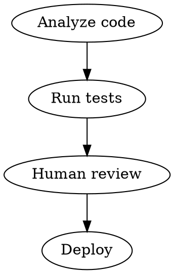
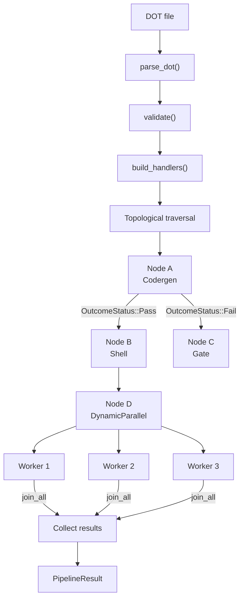

# Chapter 12: octos-pipeline: A DOT Graph-Driven Workflow Engine

> **Positioning**: This chapter dives into the octos-pipeline crate (~9,100 lines), showing how Graphviz DOT syntax is used to define workflow topologies, and how 5 Handler types support diverse workflow nodes. Prerequisites: Chapter 5. Target audience: AI application developers seeking to understand Agent workflow orchestration (Reader C), and developers who need to build complex Pipelines (Reader B/D).

When a task exceeds the capability of a single Agent iteration — such as "analyze codebase → generate design document → write implementation → run tests → review results" — you need a workflow engine to orchestrate multi-step execution. octos-pipeline lets users define these workflows using Graphviz DOT syntax.

---

## 12.1 DOT Graph Parsing

### 12.1.1 Why DOT

octos chose DOT over YAML/JSON for workflow definitions because DOT is an inherently visual format — the same `.dot` file is both a machine-readable workflow definition and can be directly rendered as a diagram using Graphviz tools.



### 12.1.2 Parser Implementation

octos uses a hand-written recursive descent parser (`crates/octos-pipeline/src/parser.rs:18`), without depending on external DOT parsing libraries. `DotParser` (`parser.rs:24`) maintains internal state (input buffer and position tracking) and parses DOT syntax character by character.

Syntax elements handled by the parser:
- **digraph declaration**: `digraph name { ... }`
- **Node declaration**: `node_name [key="value", ...]`
- **Edge declaration**: `A -> B [condition="expr"]`
- **Comments**: `//` single-line comments and `/* */` block comments

An important fault-tolerance design: when an edge declaration references a node that hasn't been explicitly declared (e.g., `A -> B`, but B has no standalone node declaration), the parser automatically creates a default definition for B (`parser.rs:77-96`). This lets users declare attributes only for key nodes, while simple nodes can be referenced only in edges.

The parse result is a `PipelineGraph`, containing a node HashMap and an edge Vec.

---

## 12.2 Five Handler Types

The Handler trait (`crates/octos-pipeline/src/handler.rs:76-80`) defines the execution interface for nodes:

```rust
#[async_trait]
pub trait Handler: Send + Sync {
    async fn execute(&self, node: &PipelineNode, ctx: &HandlerContext) -> Result<NodeOutcome>;
}
```

Where `HandlerContext` (`handler.rs:67-74`) passes execution context:

```rust
pub struct HandlerContext {
    pub input: String,                           // concatenated output from predecessor nodes
    pub completed: HashMap<String, NodeOutcome>,  // results of all completed nodes
    pub working_dir: PathBuf,                     // working directory
}
```

`NodeOutcome` (`graph.rs:221-233`) records a node's execution result:

```rust
pub struct NodeOutcome {
    pub node_id: String,
    pub status: OutcomeStatus,          // Pass / Fail / Error
    pub content: String,                // text produced by the node
    pub token_usage: TokenUsage,        // Agent token consumption
    pub files_modified: Vec<PathBuf>,   // modified files
}
```

| Handler Type | Function | Typical Scenario |
|-------------|----------|-----------------|
| **Codergen** | Spawns an Agent for code generation/analysis | Code review, documentation generation |
| **Gate** | Human approval (5-minute timeout) | Pre-release review, sensitive operation confirmation |
| **Shell** | Executes shell commands | Testing, building, deploying |
| **Noop** | No-op placeholder | Workflow structural markers |
| **DynamicParallel** | Dynamic fan-out parallel execution | Batch processing, multi-target deployment |

### 12.2.1 Codergen Handler

Codergen is the most commonly used Handler type — it spawns a complete Agent instance for each node to perform code generation, analysis, or modification tasks. The node's DOT attributes are converted to Agent configuration:

```dot
analyze [handler="codergen"
         prompt="Analyze this repository's architecture and generate a design document"
         model="claude-sonnet-4-20250514"
         max_iterations="20"]
```

The Codergen handler creates an Agent and calls `run_task()`, passing the predecessor nodes' output as task context to the new Agent. This gives each Pipeline node full Agent capabilities — including tool calling, loop detection, and context compression.

### 12.2.2 Human Gate

The Gate handler (`human_gate.rs:14-80`) pauses the Pipeline at the specified node, broadcasting a `HumanRequest` via an mpsc channel and waiting for human input. Three input types are supported:

| Input Type | Use Case | Example |
|-----------|----------|---------|
| Approval | Yes/no decision | "Approve deployment to production?" |
| FreeText | Open-ended input | "Please provide additional requirements" |
| Choice | Multiple choice | "Select target environment: staging / production / canary" |

The default timeout is 5 minutes — this is the safety valve for the "human-in-the-loop" pattern. If the approver doesn't respond within 5 minutes, the Gate times out and fails, and the Pipeline stops. The timeout-rather-than-infinite-wait design is pragmatic — an unattended Pipeline should not hang forever waiting for an approval that may never come.

The Gate's response is collected via an async channel — the Gate handler `await`s on the channel, and the UI layer (Web Dashboard or CLI) sends the result to the channel after the user responds. This decoupling means the Gate doesn't need to know the specifics of how user interaction works.

### 12.2.3 Shell Handler: The Simplest Complete Implementation

The Shell handler (`handler.rs:386-459`) is the best entry point for understanding the Handler interface — it's simple enough but demonstrates all the key patterns:

```rust
#[async_trait]
impl Handler for ShellHandler {
    async fn execute(&self, node: &PipelineNode, ctx: &HandlerContext) -> Result<NodeOutcome> {
        // Command source: node's prompt attribute, or predecessor node's output
        let command = node.prompt.as_deref().unwrap_or(&ctx.input);
        let timeout = Duration::from_secs(node.timeout_secs.unwrap_or(300));

        // Subprocess execution with timeout
        let result = tokio::time::timeout(timeout, {
            tokio::process::Command::new("sh")
                .arg("-c")
                .arg(command)
                .current_dir(&self.working_dir)
                .output()
        }).await;

        match result {
            Ok(Ok(output)) => {
                let stdout = String::from_utf8_lossy(&output.stdout);
                let stderr = String::from_utf8_lossy(&output.stderr);
                Ok(NodeOutcome {
                    node_id: node.id.clone(),
                    status: if output.status.success() {
                        OutcomeStatus::Pass
                    } else {
                        OutcomeStatus::Fail  // non-zero exit code = Fail, not Error
                    },
                    content: if stderr.is_empty() {
                        stdout.to_string()
                    } else {
                        format!("{stdout}\n--- stderr ---\n{stderr}")
                    },
                    token_usage: TokenUsage::default(),
                    files_modified: vec![],
                })
            }
            Ok(Err(e)) => /* process failed to start → Error */,
            Err(_) => /* timeout → Error */,
        }
    }
}
```

Several design patterns worth learning:

**The distinction between `Fail` and `Error`.** A command that executes but returns a non-zero exit code is `Fail` (business failure — such as tests not passing), while a process that can't start or times out is `Error` (system error). Conditional edges can route differently based on this distinction — `test -> deploy [condition="pass"]` vs `test -> rollback [condition="fail"]`.

**Command source priority.** `node.prompt.as_deref().unwrap_or(&ctx.input)` means the node's own prompt takes priority; if there's no prompt, the predecessor node's output is used as the command. This lets Shell nodes execute both predefined commands and dynamically generated commands.

**Noop Handler** is even simpler — it's the minimal implementation reference for the Pipeline (`handler.rs:512-526`):

```rust
impl Handler for NoopHandler {
    async fn execute(&self, node: &PipelineNode, ctx: &HandlerContext) -> Result<NodeOutcome> {
        Ok(NodeOutcome {
            node_id: node.id.clone(),
            status: OutcomeStatus::Pass,
            content: ctx.input.clone(),  // pass through input directly
            token_usage: TokenUsage::default(),
            files_modified: vec![],
        })
    }
}
```

If you need to implement a custom Handler, starting from NoopHandler and modifying it is the fastest path.

### 12.2.4 DynamicParallel: Fan-out / Fan-in Source Code Walkthrough

DynamicParallel is the most complex Handler — it dynamically creates N parallel workers based on the predecessor node's output, each worker executing using a Codergen handler (`executor.rs:1089-1131`):

```rust
// 1. Create async tasks for each synthetic node
let mut futures = Vec::new();
for (task_id, mut synth_node) in synthetic_nodes {
    // Variable substitution: inject {input} and custom variables into node prompt
    if let Some(prompt) = synth_node.prompt.take() {
        let mut resolved = prompt.replace("{input}", "");
        for (k, v) in variables.iter() {
            resolved = resolved.replace(&format!("{{{k}}}"), v.as_str().unwrap_or(""));
        }
        synth_node.prompt = Some(resolved);
    }

    let ctx = HandlerContext {
        input: dp_input.clone(),
        completed: completed.clone(),
        working_dir: self.config.working_dir.clone(),
    };

    let handler = codergen_handler.clone();
    let done_count = completed_count.clone();

    futures.push(async move {
        let result = execute_with_retries_static(&handler, &synth_node, &ctx, max_retries).await;
        let n = done_count.fetch_add(1, Ordering::Relaxed) + 1;
        report_progress(&format!("{dp_label}: '{worker_label}' done ({n}/{total_workers})"));
        (task_id, result)
    });
}

// 2. Execute all tasks in parallel, waiting for all to complete
let results = futures::future::join_all(futures).await;
```

Several key design points:

**Variable template substitution.** `{input}` and custom variables (such as `{filename}`) are substituted into the worker's prompt before execution. This lets a single DynamicParallel node generate different prompts for each input file.

**Progress tracking.** An `AtomicUsize` counter increments when each worker completes, generating progress messages like `"deploy: 'staging' done (3/5)"`. Users can see the fan-out completion progress in real time.

**Retry support.** `execute_with_retries_static()` provides independent retry logic for each worker — one worker's failure doesn't affect other workers' execution.

**`join_all` semantics.** All futures execute in parallel, but `join_all` waits for all of them to complete before returning. If "any success is sufficient" semantics (`select!`) are needed, a different implementation would be required — the current design assumes all workers' results are needed.

This is the only Handler in Pipeline that involves dynamic concurrency — all other Handlers execute strictly sequentially. DynamicParallel lets Pipelines express "analyze N files and merge results" type fan-out / fan-in patterns.

### 12.2.5 Noop Handler

Noop performs no operations and is used for workflow structural markers — for example, as a merge point for multiple branches, or as the default path for conditional branches.

---

## 12.3 Execution Engine



**Figure 12-1: Pipeline execution engine flow.** DOT parsing → validation → Handler construction → topological traversal. Conditional edges route to different successors based on OutcomeStatus. DynamicParallel internally fans out to N workers.

### 12.3.1 PipelineExecutor

PipelineExecutor (`crates/octos-pipeline/src/executor.rs:505-579`) is the orchestration center for Pipelines. The `run()` method executes in five stages:

1. **Parsing**: Invokes the DOT parser to convert text to a `PipelineGraph`
2. **Validation**: Checks graph legality (no orphan nodes, valid Handler types, parseable condition expressions)
3. **Handler construction**: Creates the corresponding Handler instance for each node
4. **Topological execution**: Traverses the DAG in topological order
5. **Result collection**: Aggregates all nodes' outputs, token usage, and modified files

### 12.3.2 PipelineStatusBridge: Real-time Progress

PipelineStatusBridge (`executor.rs:48-84`) bridges Pipeline execution and external consumers (such as SSE streams):

```rust
pub struct PipelineStatusBridge {
    pub status_words: Arc<RwLock<Vec<String>>>,  // per-node progress text
    pub token_tracker: Arc<TokenTracker>,         // sub-Agent token aggregation
}
```

When a Codergen Handler's internal Agent executes tool calls, progress events flow through `PipelineNodeReporter` to the StatusBridge, and ultimately are pushed to the frontend via SSE. This decoupled design makes Pipeline progress reporting transport-agnostic.

### 12.3.3 Conditional Edges

Edges can carry condition attributes (`[condition="expr"]`). The condition engine (`condition.rs`) evaluates at runtime whether the predecessor node's output satisfies the condition. For example:

```dot
test -> deploy [condition="success"]
test -> rollback [condition="failure"]
```

Only when the `test` node's outcome is "success" will `deploy` execute; otherwise `rollback` executes.

### 12.3.4 Checkpoint Resume

Pipelines support checkpoint persistence (`checkpoint.rs`) — after each node completes, its outcome is saved to disk. If a Pipeline is interrupted due to timeout or error, execution can resume from the last checkpoint, skipping already-completed nodes.

### 12.3.5 ModelStylesheet

ModelStylesheet (`stylesheet.rs`) supports per-node model selection:

```dot
analyze [handler="codergen" model="claude-opus-4-20250514"]
review [handler="codergen" model="claude-haiku-4-5-20251001"]
```

This lets users assign different models to different nodes within the same Pipeline — compute-intensive nodes use high-end models, simple nodes use low-cost models, optimizing overall cost.

### 12.3.6 PipelineResult

After Pipeline execution completes, a `PipelineResult` is returned (`executor.rs:30-41`):

```rust
pub struct PipelineResult {
    pub output: String,                    // final output
    pub success: bool,                     // overall success
    pub token_usage: TokenUsage,           // total token usage
    pub node_summaries: Vec<NodeSummary>,  // per-node summaries
    pub files_modified: Vec<PathBuf>,      // all modified files
}
```

### 12.3.7 Pipeline File Structure

The octos-pipeline crate contains 18 source files, organized by responsibility:

| File | Responsibility |
|------|---------------|
| `parser.rs` | DOT syntax parsing |
| `graph.rs` | PipelineGraph data structure |
| `executor.rs` | Execution engine |
| `handler.rs` | Handler trait + 5 implementations |
| `human_gate.rs` | Human approval gate |
| `condition.rs` | Conditional edge evaluation |
| `checkpoint.rs` | Checkpoint persistence |
| `stylesheet.rs` | Per-node model selection |
| `artifact.rs` | Artifact management |
| `validate.rs` | Graph validation |
| `fidelity.rs` | Output fidelity control |
| `events.rs` | Pipeline event system |
| `server.rs` | Pipeline API server |
| `manager.rs` | Pipeline manager |
| `tool.rs` | Pipeline exposed as a tool |
| `discovery.rs` | Pipeline file discovery |
| `run_dir.rs` | Runtime directory management |
| `thread.rs` | Threading model |

---

> ### Engineering Decision Sidebar: Why DOT Instead of YAML/JSON for Workflow Definitions
>
> **Option 1: YAML (like GitHub Actions)**
>
> Advantages: Good human readability, community familiarity
> Disadvantages: Clumsy for expressing graph structures (requires `needs:` references), cannot be directly visualized
>
> **Option 2: JSON (like AWS Step Functions)**
>
> Advantages: Machine-friendly, mature Schema validation
> Disadvantages: Poor human readability, verbose brackets and quotes
>
> **Option 3: DOT (octos's choice)**
>
> Advantages:
> - Graph structure is DOT's native semantics — nodes and edges are expressed directly
> - The same file renders as a visual diagram with `dot -Tpng`, without needing a separate visualization tool
> - Flexible attribute system — node attributes `[handler="codergen"]` naturally map to Handler configuration
>
> Disadvantages:
> - The community is less familiar with DOT than with YAML
> - Requires implementing a custom parser (but DOT's grammar is far simpler than YAML's)

---

## 12.4 Chapter Summary

1. **DOT graph definition**: Graphviz syntax naturally expresses DAG topologies; the same file is both readable and visualizable.
2. **Five Handler types**: Codergen (Agent execution), Gate (human approval with 5-minute timeout), Shell (command execution), Noop (placeholder), DynamicParallel (dynamic fan-out).
3. **Execution engine**: Topological traversal + conditional edges + checkpoint resume + per-node model selection.

---

## Further Reading

- **Graphviz DOT Language**: https://graphviz.org/doc/info/lang.html — DOT syntax specification
- **DAG Scheduling**: Apache Airflow's DAG scheduling model — Understanding topological sorting in workflows

## Discussion Questions

1. **Cycle detection**: The DOT format allows defining cyclic graphs, but Pipeline only supports DAGs. If a user defines a cyclic graph (A→B→A), should the error be reported at parse time or at execution time?
2. **Human Gate timeout**: The 5-minute timeout is too short for some approval scenarios (such as cross-timezone teams). How would you design a configurable yet still safe timeout strategy?

---

> **Version Evolution Note**
> This chapter's analysis is based on octos v0.1.0, with the octos-pipeline crate located at `crates/octos-pipeline/src/`. As of this writing, the 5 Handler types and DOT parser's core design have not changed significantly.
