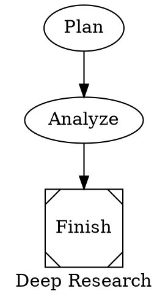
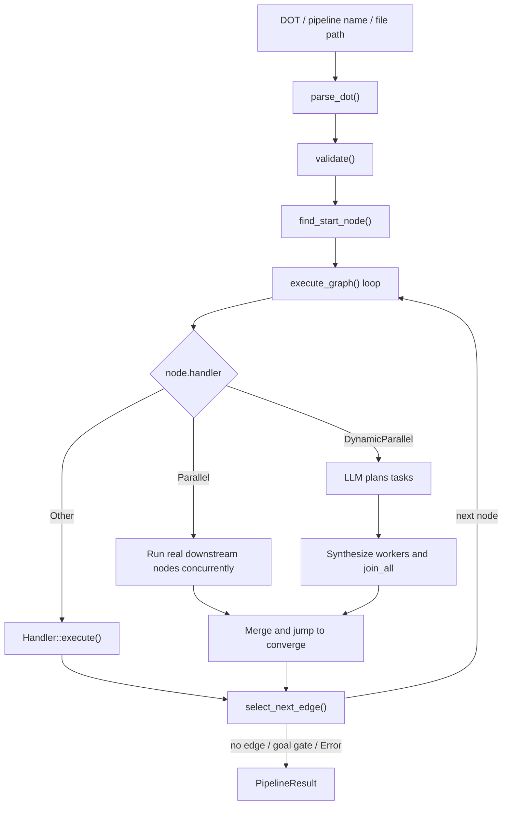

# Chapter 12: octos-pipeline: A DOT Graph-Driven Workflow Engine

> **Positioning**: This chapter reads `crates/octos-pipeline/src/` against the current implementation. It explains how octos parses Graphviz DOT into a typed `PipelineGraph`, and how the executor switches between sequential nodes, static parallelism, and dynamic parallelism. Prerequisite: Chapter 5. Use when you need to understand multi-step Agent orchestration.

When a task is too large for "one Agent loop plus a few tool calls", it needs explicit workflow orchestration. Typical examples include planning research angles, running searches in parallel, synthesizing analysis, and writing a final report. `octos-pipeline` solves this class of problem, but it is not a conventional static DAG scheduler. It combines graph structure, runtime edge selection, convergence, model routing, and inherited tool policy.

---

## 12.1 How DOT Enters the Runtime

### 12.1.1 Why DOT

octos uses Graphviz DOT rather than YAML or JSON because nodes and edges are first-class DOT concepts. The same file can be parsed by the executor and rendered directly by Graphviz.



This example demonstrates several current parser capabilities:

- Graph-level attributes: `graph [label=..., default_model=...]`
- Node attributes: `handler`, `model`, `tools`, `converge`, `planner_model`
- Edges: `A -> B`
- Shape-to-handler inference: `Msquare` maps to `Noop`

### 12.1.2 Hand-Written Parser

The entry point is `parse_dot()` in `crates/octos-pipeline/src/parser.rs:18-20`; the real work is `DotParser::parse()` (`crates/octos-pipeline/src/parser.rs:34-98`). This is a hand-written parser, not a wrapper around an external DOT parser.

Current support is broader than a minimal DOT subset:

- Optional digraph names. `digraph { ... }` becomes graph ID `"pipeline"` (`crates/octos-pipeline/src/parser.rs:42-48`).
- Graph attributes. `graph [label=..., default_model=...]` maps to `label` and `default_model` (`crates/octos-pipeline/src/parser.rs:104-113`, `crates/octos-pipeline/src/parser.rs:487-493`).
- Subgraphs. `subgraph name { ... }` stores nodes under `PipelineGraph.subgraphs` (`crates/octos-pipeline/src/parser.rs:115-230`, `crates/octos-pipeline/src/graph.rs:21-24`, `crates/octos-pipeline/src/graph.rs:244-253`).
- Edge chains. `a -> b -> c` expands into multiple edges, with attributes applied to each edge (`crates/octos-pipeline/src/parser.rs:233-267`).
- Comments. The parser accepts `//`, `/* */`, and `#` line comments; the last one is useful for LLM-generated DOT (`crates/octos-pipeline/src/parser.rs:446-483`).
- Auto-created nodes. If an edge references a node that was not declared, the parser creates a default node (`crates/octos-pipeline/src/parser.rs:76-96`).

The output is not a loose JSON tree. It is a typed `PipelineGraph` (`crates/octos-pipeline/src/graph.rs:10-24`, `crates/octos-pipeline/src/graph.rs:91-129`) with `id`, `label`, `default_model`, `nodes`, `edges`, and `subgraphs`. `PipelineNode` also carries runtime fields such as `model`, `context_window`, `max_output_tokens`, `tools`, `goal_gate`, `max_retries`, `timeout_secs`, `suggested_next`, `converge`, `worker_prompt`, `planner_model`, and `max_tasks`.

### 12.1.3 Attribute Mapping

Node construction happens in `build_node()` (`crates/octos-pipeline/src/parser.rs:524-562`). Three details matter:

- Handler resolution prefers explicit `handler=`, then `shape=` mapping, then `Codergen` as default (`crates/octos-pipeline/src/parser.rs:525-530`, `crates/octos-pipeline/src/graph.rs:204-216`).
- `tools="a,b,c"` becomes a string list. `tools=""` becomes a list containing an empty string, and the handler treats it as "explicitly disable all tools" (`crates/octos-pipeline/src/parser.rs:532-535`, `crates/octos-pipeline/src/handler.rs:219-236`).
- `timeout_secs` accepts integer seconds and suffixes such as `900s`, `15m`, and `2h` (`crates/octos-pipeline/src/parser.rs:496-513`).
- `goal_gate` accepts `true/false/yes/no/1/0` (`crates/octos-pipeline/src/parser.rs:515-522`).

DOT is therefore a lightweight workflow DSL in octos, not only a topology format.

---

## 12.2 Six Node Semantics, Not Five

`HandlerKind` lives in `crates/octos-pipeline/src/graph.rs:169-187`. The current implementation has six variants:

| Kind | Runtime location | Key attributes | Role |
|------|------------------|----------------|------|
| `Codergen` | `crates/octos-pipeline/src/handler.rs:193-383` | `prompt`, `model`, `tools`, `context_window`, `max_output_tokens` | Spawn a full child Agent |
| `Shell` | `crates/octos-pipeline/src/handler.rs:396-459` | `prompt`, `timeout_secs` | Run a shell command |
| `Gate` | `crates/octos-pipeline/src/handler.rs:466-509` | `prompt` | Evaluate a condition, not human approval |
| `Noop` | `crates/octos-pipeline/src/handler.rs:515-526` | none | Pass input through |
| `Parallel` | `crates/octos-pipeline/src/executor.rs:711-895` | `converge` | Static fan-out over real downstream nodes |
| `DynamicParallel` | `crates/octos-pipeline/src/executor.rs:897-1198` | `prompt`, `worker_prompt`, `planner_model`, `max_tasks`, `converge` | Plan tasks, then synthesize worker nodes |

Only four kinds implement the `Handler` trait directly: `Codergen`, `Shell`, `Gate`, and `Noop` (`crates/octos-pipeline/src/handler.rs:76-81`). `Parallel` and `DynamicParallel` are special branches inside `PipelineExecutor::execute_graph()` (`crates/octos-pipeline/src/executor.rs:711-1198`).

### 12.2.1 Codergen: A Node Is a Child Agent

`CodergenHandler` creates a complete `octos_agent::Agent`, not a simplified one-shot LLM call (`crates/octos-pipeline/src/handler.rs:193-383`). A node therefore inherits tool calls, loop execution, token accounting, file modification reporting, and progress events.

Key behaviors:

1. **Provider resolution**: If the node declares `model` and a `ProviderRouter` is configured, the handler calls `router.resolve()` and wraps the result in a capability-compatible fallback provider (`crates/octos-pipeline/src/handler.rs:157-190`).
2. **Context-window override**: `context_window` becomes a `ContextWindowOverride` (`crates/octos-pipeline/src/handler.rs:201-206`).
3. **Tool registry**: The initial registry comes from `ToolRegistry::with_builtins()`, then plugin tools are loaded if needed (`crates/octos-pipeline/src/handler.rs:208-217`).
4. **Tool policy**: Node-level `tools=` forms an allowlist, but the handler still denies `spawn`, `run_pipeline`, `send_file`, and `message` to avoid recursive or cross-channel runaway behavior (`crates/octos-pipeline/src/handler.rs:227-251`).
5. **Prompt and task input separation**: The executor strips `{input}` from the system-style prompt and passes predecessor output through `TaskKind::Code.instruction` (`crates/octos-pipeline/src/executor.rs:1226-1245`, `crates/octos-pipeline/src/handler.rs:333-342`).

Current DOT nodes do not have a `max_iterations` attribute. `CodergenHandler` fixes `AgentConfig.max_iterations` to 30 (`crates/octos-pipeline/src/handler.rs:311-317`). The tunable attributes are `timeout_secs`, `max_output_tokens`, `context_window`, `model`, `tools`, and `max_retries`.

`max_output_tokens` also does not default to a global 4096. If absent, the handler falls back to the provider's own output capability (`crates/octos-pipeline/src/handler.rs:304-316`).

### 12.2.2 Shell: Simple but Precise

`ShellHandler` (`crates/octos-pipeline/src/handler.rs:396-459`) is straightforward:

- Command source is `node.prompt`, or `ctx.input` if no prompt exists.
- Unix uses `sh -c`; Windows uses `cmd /C`.
- Default timeout is 300 seconds, overridable with `timeout_secs`.
- Non-zero exit code maps to `OutcomeStatus::Fail`.
- Process launch failure or timeout maps to `OutcomeStatus::Error`.

The `Fail` vs `Error` distinction matters because the executor retries only `Error` (`crates/octos-pipeline/src/executor.rs:1394-1417`). A test failure is a business failure; a command that cannot start is a system error.

### 12.2.3 Gate: Condition Node, Not Human Approval

This is the easiest part of the chapter to get wrong.

The executor registers `GateHandler` (`crates/octos-pipeline/src/executor.rs:626-653`). Its current behavior is:

- Treat `node.prompt` as a condition expression.
- Evaluate it against the last completed `NodeOutcome`.
- Return `Pass` or `Fail`.
- Pass through `content`; it does not ask a human (`crates/octos-pipeline/src/handler.rs:466-509`).

If the prompt is empty, the condition defaults to `"true"`, making it a pass-through gate (`crates/octos-pipeline/src/handler.rs:469-493`).

`human_gate.rs` does exist and defines `HumanInputProvider`, `ChannelInputProvider`, `HumanRequest`, and `HumanResponse`, with a default 5-minute timeout (`crates/octos-pipeline/src/human_gate.rs:14-140`). But it is not wired into `PipelineExecutor::build_handlers()` or `execute_graph()` (`crates/octos-pipeline/src/executor.rs:626-653`). The accurate statement is:

- `GateHandler` is the wired condition node.
- `human_gate.rs` is an adjacent human-input abstraction, not the default execution path.

### 12.2.4 Parallel: Static Fan-Out Over Real Downstream Nodes

`Parallel` runs existing downstream graph nodes concurrently (`crates/octos-pipeline/src/executor.rs:711-895`):

1. Collect outgoing edge targets as parallel workers (`crates/octos-pipeline/src/executor.rs:717-722`).
2. Require a valid `converge` node; validation fails without it (`crates/octos-pipeline/src/validate.rs:279-317`).
3. Clone each target `PipelineNode`, substitute variables, and fill `graph.default_model` if the node has no model (`crates/octos-pipeline/src/executor.rs:779-792`).
4. Find each target's handler and execute them concurrently (`crates/octos-pipeline/src/executor.rs:775-830`).
5. Merge content, tokens, summaries, and node outcomes with `process_worker_results()` (`crates/octos-pipeline/src/executor.rs:300-385`, `crates/octos-pipeline/src/executor.rs:832-845`).
6. Store the merged result as the current `Parallel` node result, then jump to `converge` (`crates/octos-pipeline/src/executor.rs:867-894`).

`Parallel` uses `ExecutorConfig.max_parallel_workers` and a `tokio::sync::Semaphore` to cap concurrency (`crates/octos-pipeline/src/executor.rs:762-767`). The executor also tracks `parallel_executed` so downstream nodes already run during fan-out are not run again during sequential traversal (`crates/octos-pipeline/src/executor.rs:668-709`, `crates/octos-pipeline/src/executor.rs:842-845`).

Merging is more than string concatenation. After `process_worker_results()`, the executor calls `resolve_search_result_files()` to inline `_search_results.md` files referenced by research workers (`crates/octos-pipeline/src/executor.rs:380-501`). The pipeline engine is already optimized for "research fan-out, synthesis converge" workflows.

### 12.2.5 DynamicParallel: Plan First, Then Synthesize Workers

`DynamicParallel` differs from `Parallel`: it first asks an LLM to plan tasks, then synthesizes temporary `Codergen` nodes (`crates/octos-pipeline/src/executor.rs:997-1055`).

Its main path (`crates/octos-pipeline/src/executor.rs:897-1198`) is:

1. Resolve planner provider through `planner_model -> node.model -> graph.default_model` (`crates/octos-pipeline/src/executor.rs:932-940`).
2. Use `node.prompt` as the planning prompt, or a built-in planner prompt if empty (`crates/octos-pipeline/src/executor.rs:942-947`).
3. Expect a pure JSON array. If parsing fails or fewer than two tasks are returned, fall back to `fallback_tasks()` (`crates/octos-pipeline/src/executor.rs:152-257`, `crates/octos-pipeline/src/executor.rs:961-989`).
4. Replace `{task}` inside `worker_prompt` and create synthetic `Codergen` nodes (`crates/octos-pipeline/src/executor.rs:997-1055`).
5. Execute synthetic nodes concurrently, merge results, and jump to `converge` (`crates/octos-pipeline/src/executor.rs:1089-1198`).

Two details are easy to miss:

- `node.model` can be a comma-separated model pool such as `"cheap,strong,cheap"`; workers are assigned round-robin (`crates/octos-pipeline/src/executor.rs:1002-1039`).
- `DynamicParallel` does not add a semaphore the way `Parallel` does. Its fan-out cap mainly comes from `max_tasks`, whose default is 8 (`crates/octos-pipeline/src/executor.rs:930`, `crates/octos-pipeline/src/executor.rs:1089-1131`).

Static `Parallel` therefore has the harder concurrency limit. `DynamicParallel` depends more on planner output and `max_tasks`.

### 12.2.6 Noop: Structural Pass-Through

`NoopHandler` returns `ctx.input` unchanged (`crates/octos-pipeline/src/handler.rs:512-526`). It is useful for start/finish markers and branch merge points.

---

## 12.3 The Executor Is a Routed Graph Walker



`PipelineExecutor` is not "topologically sort once and execute every node". It starts from a start node, branches by handler kind, and chooses the next edge at runtime.

### 12.3.1 `run()` Stages

`PipelineExecutor::run()` (`crates/octos-pipeline/src/executor.rs:514-624`) performs five stages:

1. Parse DOT with `parse_dot()`.
2. Validate the graph.
3. Build the regular handler registry.
4. Find the start node.
5. Enter `execute_graph()`.

After start-node selection, execution is driven by `current_node_id`, not by a precomputed topological traversal (`crates/octos-pipeline/src/executor.rs:655-1392`). That is why `suggested_next`, conditional edges, and edge-label matching can all affect runtime routing.

### 12.3.2 Validation and Start Node Selection

The validator (`crates/octos-pipeline/src/validate.rs:27-372`) currently has 15 rules. Important ones include:

- Rule 1: find a start node, either a node named `start` or the unique node with no incoming edges (`crates/octos-pipeline/src/validate.rs:52-71`, `crates/octos-pipeline/src/validate.rs:75-99`).
- Rule 2: unreachable nodes are warnings, not errors (`crates/octos-pipeline/src/validate.rs:101-140`).
- Rule 6: edge conditions must parse (`crates/octos-pipeline/src/validate.rs:188-203`).
- Rules 13 and 14: `parallel` and `dynamic_parallel` must have valid `converge` nodes (`crates/octos-pipeline/src/validate.rs:279-317`, `crates/octos-pipeline/src/validate.rs:329-372`).
- Rule 15: cycles are rejected during validation (`crates/octos-pipeline/src/graph.rs:26-88`, `crates/octos-pipeline/src/validate.rs:319-327`).

octos-pipeline still requires a DAG, but it executes that DAG as a routed graph walk rather than a static scheduler.

### 12.3.3 Condition Language and Edge Selection

The grammar is in `crates/octos-pipeline/src/condition.rs:1-18`. Stable current forms include:

- `outcome.status == "pass"`
- `outcome.status != "fail"`
- `outcome.contains("keyword")`
- `!expr`, `expr && expr`, `expr || expr`

Example:

```dot
test -> deploy   [condition="outcome.status == \"pass\""]
test -> rollback [condition="outcome.status == \"fail\""]
report -> refine [condition="outcome.contains(\"missing data\")"]
```

The old `success` / `failure` shorthand is not the current condition syntax.

`select_next_edge()` applies a five-step algorithm (`crates/octos-pipeline/src/executor.rs:1419-1478`):

1. Evaluate conditional edges.
2. If multiple conditions match, choose the highest `weight`.
3. If none match, check `node.suggested_next`.
4. Then check whether an edge label appears in outcome content.
5. Finally choose the highest-weight unconditional edge, falling back to lexicographic target order if needed.

The condition grammar also supports `context.key == "value"`, but the main path calls `evaluate()`, not `evaluate_with_context()` (`crates/octos-pipeline/src/condition.rs:64-85`, `crates/octos-pipeline/src/handler.rs:495-496`, `crates/octos-pipeline/src/executor.rs:1433-1439`). So `context.*` is grammar-defined but not fed by the current executor main path. The stable surface is `outcome.*`.

### 12.3.4 Progress, Statistics, and Termination

`PipelineStatusBridge` (`crates/octos-pipeline/src/executor.rs:43-83`) exposes:

- `status_words`: current node or worker status text
- `token_tracker`: aggregated token usage from child Agents

When a `CodergenHandler` child Agent emits `ProgressEvent`, `PipelineNodeReporter` converts it back into `run_pipeline` progress (`crates/octos-pipeline/src/handler.rs:20-64`). Frontends can therefore show more than "current node"; they can see worker-level progress.

Execution commonly stops in three ways:

- The current node has no outgoing edges (`crates/octos-pipeline/src/executor.rs:1368-1388`).
- A `goal_gate=true` node succeeds and ends the pipeline early (`crates/octos-pipeline/src/executor.rs:1315-1340`).
- A node returns `OutcomeStatus::Error`, stopping the whole pipeline (`crates/octos-pipeline/src/executor.rs:1343-1356`).

`PipelineResult` (`crates/octos-pipeline/src/executor.rs:28-41`) contains final output, success flag, token usage, node summaries, and deduplicated modified files.

### 12.3.5 Current Model Selection Path

The currently wired model path is:

- Graph default: `graph [default_model="cheap"]`
- Node override: `node [model="strong"]`

These fields become `PipelineGraph.default_model` and `PipelineNode.model` in the parser (`crates/octos-pipeline/src/parser.rs:487-493`, `crates/octos-pipeline/src/parser.rs:537-562`), and are applied jointly by `execute_graph()` and `CodergenHandler` (`crates/octos-pipeline/src/executor.rs:790-792`, `crates/octos-pipeline/src/executor.rs:1242-1245`, `crates/octos-pipeline/src/handler.rs:201-206`).

`ModelStylesheet` exists and supports selectors such as `*`, `handler:codergen`, and `node:critical_analysis` (`crates/octos-pipeline/src/stylesheet.rs:13-104`). But it is not called by `PipelineExecutor`, `RunPipelineTool`, or `PipelineDiscovery` in the current main path. Treat it as an exported adjacent capability, not the default model-routing mechanism.

### 12.3.6 `human_gate`, `checkpoint`, and `run_dir`

Three modules are easy to overstate:

- `human_gate.rs` provides channel-based human input abstractions with a default 5-minute timeout, but is not wired into `PipelineExecutor` (`crates/octos-pipeline/src/human_gate.rs:14-140`).
- `checkpoint.rs` provides `Checkpoint` and `CheckpointStore`, writing completed node outcomes to `{run_dir}/checkpoint.json` (`crates/octos-pipeline/src/checkpoint.rs:13-106`).
- `run_dir.rs` provides `RunDir`, `NodeStatus`, and `PipelineRunSummary`, with run directories under `{working_dir}/.octos/runs/{run_id}/...` (`crates/octos-pipeline/src/run_dir.rs:16-114`).

The current `PipelineExecutor::run()` path does not call these modules directly. So the book should not claim that default `run_pipeline` automatically checkpoints, writes a run directory, or performs human approval.

### 12.3.7 `run_pipeline` Tool Integration

Most users reach the engine through `RunPipelineTool` (`crates/octos-pipeline/src/tool.rs:17-322`).

Its wrapper behavior is practical:

- First parse input as inline DOT; if that fails, resolve it as a named preset (`crates/octos-pipeline/src/tool.rs:78-134`).
- Sanitize common LLM DOT mistakes such as `digraph{`, missing graph names, and fenced code blocks (`crates/octos-pipeline/src/tool.rs:324-356`).
- Resolve pipelines by name, path, or inline DOT. Search paths include project `.octos/pipelines`, user `data_dir/pipelines`, `data_dir/skills`, and optional `octos_home/skills` (`crates/octos-pipeline/src/discovery.rs:18-114`, `crates/octos-pipeline/src/tool.rs:50-56`).
- Clamp total pipeline timeout to 60-1800 seconds (`crates/octos-pipeline/src/tool.rs:150-152`, `crates/octos-pipeline/src/tool.rs:249-267`).

One subtle separation: `run_pipeline`'s `input_schema()` tells the model not to write explicit `model=` and says the system will choose a model (`crates/octos-pipeline/src/tool.rs:172-208`). The runtime engine still supports `default_model` and `node.model`. That is authoring guidance for the LLM, not a removal of engine capability.

---

> ### Engineering Sidebar: Why DOT Instead of YAML/JSON
>
> **YAML**, as in GitHub Actions, is familiar and mature, but graph structure is not a first-class concept; dependencies and convergence become awkward as flows grow.
>
> **JSON**, as in Step Functions, is strongly structured and schema-friendly, but becomes hard for humans and LLMs to author once nodes, attributes, and branch conditions accumulate.
>
> **DOT**, octos's choice, has native node and edge semantics, can be rendered directly, maps attributes naturally onto nodes, and is often easier for an LLM to generate as a graph. The cost is that octos must own a parser and validator, and DOT is less familiar than YAML for many teams.

---

## 12.4 Chapter Summary

1. `octos-pipeline` currently has six `HandlerKind` variants. `Parallel` and `DynamicParallel` are executor branches, not direct `Handler` implementations.

2. `Gate` is a condition node in the current wired path. `human_gate.rs` exists, but it is not the default human-approval path.

3. Current model selection is `graph.default_model + node.model`. `ModelStylesheet`, `CheckpointStore`, and `RunDir` exist, but should not be described as the default `PipelineExecutor` flow.

---

## Further Reading

- **Graphviz DOT Language**: https://graphviz.org/doc/info/lang.html
- **DAG scheduling**: compare static DAG schedulers such as Airflow or Prefect with octos's routed graph-walk model.

## Discussion Questions

1. `condition.rs` supports `context.*` grammar, but the executor does not feed a context map today. Should that semantic layer be wired into `select_next_edge()`, or should the engine remain outcome-only?

2. `DynamicParallel` currently relies mainly on `max_tasks` rather than an additional semaphore. Is that sufficient for high-cost providers?

---

> **Version Evolution Note**
> This chapter is based on the current `../octos/crates/octos-pipeline/src/` implementation. For `Gate`, `ModelStylesheet`, `CheckpointStore`, and `RunDir`, always verify whether the module is wired into `PipelineExecutor` before describing it as runtime behavior.
