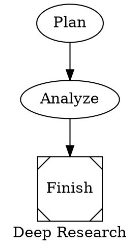
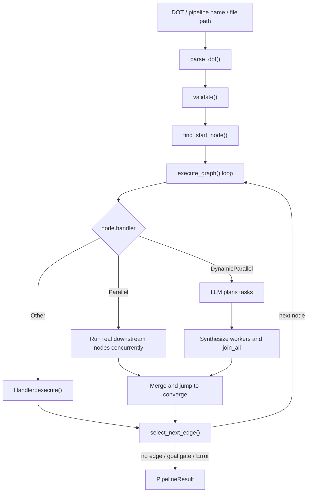

# Chapter 12: octos-pipeline: A DOT Graph-Driven Workflow Engine

> **Positioning**: This chapter reads `../octos/crates/octos-pipeline/src/` against the current implementation. It explains how octos parses Graphviz DOT into a typed `PipelineGraph`, and how the executor switches between sequential nodes, static parallelism, dynamic parallelism, checkpoint resume, deadline guards, and parent-session resource inheritance. Prerequisites: Chapter 5, Chapter 8, Chapter 11. Use when you need to understand multi-step Agent orchestration.

When a task is too large for "one Agent loop plus a few tool calls", it needs explicit workflow orchestration. Typical examples include planning research angles, running searches in parallel, synthesizing analysis, and writing a final report. `octos-pipeline` solves this class of problem, but it is not a conventional static DAG scheduler. It combines graph structure, runtime edge selection, convergence, model routing, inherited tool policy, and `PipelineHostContext`, which lets node workers inherit the parent session's file cache, subagent output router, task supervisor, and cost ledger.

---

## 12.1 How DOT Enters the Runtime

### 12.1.1 Why DOT

octos uses Graphviz DOT rather than YAML or JSON because nodes and edges are first-class DOT concepts. The same file can be parsed by the executor and rendered directly by Graphviz.



This example demonstrates several current parser capabilities:

- Graph-level attributes: `graph [label=..., default_model=...]`
- Node attributes: `handler`, `model`, `tools`, `converge`, `planner_model`
- Edges: `A -> B`
- Shape-to-handler inference: `Msquare` maps to `Noop`

### 12.1.2 Hand-Written Parser

The entry point is `parse_dot()` in `../octos/crates/octos-pipeline/src/parser.rs:21-23`; the real work is `DotParser::parse()` (`../octos/crates/octos-pipeline/src/parser.rs`). This is a hand-written parser, not a wrapper around an external DOT parser.

Current support is broader than a minimal DOT subset:

- Optional digraph names. `digraph { ... }` becomes graph ID `"pipeline"` (`../octos/crates/octos-pipeline/src/parser.rs`).
- Graph attributes. `graph [label=..., default_model=...]` maps to `label` and `default_model` (`../octos/crates/octos-pipeline/src/parser.rs`).
- Subgraphs. `subgraph name { ... }` stores nodes under `PipelineGraph.subgraphs` (`../octos/crates/octos-pipeline/src/parser.rs`, `../octos/crates/octos-pipeline/src/graph.rs:21-24`).
- Edge chains. `a -> b -> c` expands into multiple edges, with attributes applied to each edge (`../octos/crates/octos-pipeline/src/parser.rs`).
- Comments. The parser accepts `//`, `/* */`, and `#` line comments; the last one is useful for LLM-generated DOT (`../octos/crates/octos-pipeline/src/parser.rs`).
- Auto-created nodes. If an edge references a node that was not declared, the parser creates a default node (`../octos/crates/octos-pipeline/src/parser.rs`).

The output is not a loose JSON tree. It is a typed `PipelineGraph` (`../octos/crates/octos-pipeline/src/graph.rs:10-24`, `../octos/crates/octos-pipeline/src/graph.rs:91-140`) with `id`, `label`, `default_model`, `nodes`, `edges`, and `subgraphs`. `PipelineNode` also carries runtime fields such as `model`, `context_window`, `max_output_tokens`, `tools`, `goal_gate`, `max_retries`, `timeout_secs`, `suggested_next`, `converge`, `worker_prompt`, `planner_model`, `max_tasks`, `deadline_secs`, `deadline_action`, and `checkpoints`.

### 12.1.3 Attribute Mapping

Node construction happens in `build_node()` (`../octos/crates/octos-pipeline/src/parser.rs:527-576`). Several details matter:

- Handler resolution prefers explicit `handler=`, then `shape=` mapping, then `Codergen` as default (`../octos/crates/octos-pipeline/src/parser.rs:527-533`, `../octos/crates/octos-pipeline/src/graph.rs:204-230`).
- `tools="a,b,c"` becomes a string list. `tools=""` becomes a list containing an empty string, and the handler treats it as "explicitly disable all tools" (`../octos/crates/octos-pipeline/src/parser.rs:535-538`, `../octos/crates/octos-pipeline/src/handler.rs`).
- `timeout_secs` accepts integer seconds and suffixes such as `900s`, `15m`, and `2h` (`../octos/crates/octos-pipeline/src/parser.rs`).
- `goal_gate` accepts `true/false/yes/no/1/0` (`../octos/crates/octos-pipeline/src/parser.rs:520-524`).
- `deadline_secs` accepts `ms/s/m/h` suffixes and fractional seconds; `deadline_action` supports `abort`, `skip`, `escalate`, and `retry:N` / `retry(N)` (`../octos/crates/octos-pipeline/src/parser.rs:540-545`, `../octos/crates/octos-pipeline/src/parser.rs:579-627`).
- `checkpoint="true"` or `checkpoint="name1,name2"` parses into `MissionCheckpoint` declarations (`../octos/crates/octos-pipeline/src/parser.rs:629-667`).

DOT is therefore a lightweight workflow DSL in octos, not only a topology format.

---

## 12.2 Six Node Semantics, Not Five

`HandlerKind` lives in `../octos/crates/octos-pipeline/src/graph.rs:184-201`. The current implementation has six variants:

| Kind | Runtime location | Key attributes | Role |
|------|------------------|----------------|------|
| `Codergen` | `../octos/crates/octos-pipeline/src/handler.rs:186-758` | `prompt`, `model`, `tools`, `context_window`, `max_output_tokens` | Spawn a full child Agent |
| `Shell` | `../octos/crates/octos-pipeline/src/handler.rs:760-834` | `prompt`, `timeout_secs` | Run a shell command |
| `Gate` | `../octos/crates/octos-pipeline/src/handler.rs:836-949` | `prompt` | Evaluate a condition, not human approval |
| `Noop` | `../octos/crates/octos-pipeline/src/handler.rs:951-965` | none | Pass input through |
| `Parallel` | `../octos/crates/octos-pipeline/src/executor.rs:1439-1684` | `converge` | Static fan-out over real downstream nodes |
| `DynamicParallel` | `../octos/crates/octos-pipeline/src/executor.rs:1686-2033` | `prompt`, `worker_prompt`, `planner_model`, `max_tasks`, `converge` | Plan tasks, then synthesize worker nodes |

Only four kinds implement the `Handler` trait directly: `Codergen`, `Shell`, `Gate`, and `Noop`. `Parallel` and `DynamicParallel` are special branches inside `PipelineExecutor::execute_graph()` (`../octos/crates/octos-pipeline/src/executor.rs:1439-2033`).

### 12.2.1 Codergen: A Node Is a Child Agent

`CodergenHandler` creates a complete `octos_agent::Agent`, not a simplified one-shot LLM call (`../octos/crates/octos-pipeline/src/handler.rs:186-758`). A node therefore inherits tool calls, loop execution, token accounting, file modification reporting, and progress events.

Key behaviors:

1. **Provider resolution**: If the node declares `model` and a `ProviderRouter` is configured, the handler calls `router.resolve()` and wraps the result in a capability-compatible fallback provider (`../octos/crates/octos-pipeline/src/handler.rs`).
2. **Context-window override**: `context_window` becomes a `ContextWindowOverride` (`../octos/crates/octos-pipeline/src/handler.rs`).
3. **Tool registry**: The initial registry comes from `ToolRegistry::with_builtins()`, then a cached plugin registration is applied so every node does not repeat plugin hash verification and executable reads (`../octos/crates/octos-pipeline/src/handler.rs:21-124`).
4. **Tool policy**: Node-level `tools=` forms an allowlist, but the handler still denies `spawn`, `run_pipeline`, `send_file`, and `message` to avoid recursive or cross-channel runaway behavior. It also clears `spawn_only` flags so plugin tools run synchronously inside pipeline workers (`../octos/crates/octos-pipeline/src/handler.rs:520-545`).
5. **Parent-session resource inheritance**: If `run_pipeline` is invoked from a session actor, node workers inherit the parent session's `FileStateCache`, `SubAgentOutputRouter`, `AgentSummaryGenerator`, `CostAccountant`, and parent session key (`../octos/crates/octos-pipeline/src/host_context.rs:29-84`, `../octos/crates/octos-pipeline/src/handler.rs:662-683`).
6. **Prompt and task input separation**: The executor strips `{input}` from the system-style prompt and passes predecessor output through `TaskKind::Code.instruction` (`../octos/crates/octos-pipeline/src/executor.rs:2061-2075`, `../octos/crates/octos-pipeline/src/handler.rs:708-717`).

Current DOT nodes do not have a `max_iterations` attribute. `CodergenHandler` fixes `AgentConfig.max_iterations` to 30 (`../octos/crates/octos-pipeline/src/handler.rs:620-633`). The tunable attributes are `timeout_secs`, `max_output_tokens`, `context_window`, `model`, `tools`, and `max_retries`.

`max_output_tokens` also does not default to a global 4096. If absent, the handler falls back to the provider's own output capability (`../octos/crates/octos-pipeline/src/handler.rs:613-624`).

### 12.2.2 Shell: Simple but Precise

`ShellHandler` (`../octos/crates/octos-pipeline/src/handler.rs:760-834`) is straightforward:

- Command source is `node.prompt`, or `ctx.input` if no prompt exists.
- Unix uses `sh -c`; Windows uses `cmd /C`.
- Default timeout is 300 seconds, overridable with `timeout_secs`.
- Non-zero exit code maps to `OutcomeStatus::Fail`.
- Process launch failure or timeout maps to `OutcomeStatus::Error`.

The `Fail` vs `Error` distinction matters because the executor retries only `Error` (`../octos/crates/octos-pipeline/src/executor.rs:2473-2495`). A test failure is a business failure; a command that cannot start is a system error.

### 12.2.3 Gate: Condition Node, Not Human Approval

This is the easiest part of the chapter to get wrong.

The executor registers `GateHandler` (`../octos/crates/octos-pipeline/src/executor.rs:1299-1319`). Its current behavior is:

- Treat `node.prompt` as a condition expression.
- Evaluate it against direct predecessor outcomes. One predecessor preserves its exact status; multiple predecessors are aggregated by severity: `Error > Fail > Skipped > Pass`.
- Return `Pass` or `Fail`.
- Pass through `content`; it does not ask a human (`../octos/crates/octos-pipeline/src/handler.rs:836-949`).

If the prompt is empty, the condition defaults to `"true"`, making it a pass-through gate (`../octos/crates/octos-pipeline/src/handler.rs:907-949`).

`human_gate.rs` does exist and defines `HumanInputProvider`, `ChannelInputProvider`, `HumanRequest`, and `HumanResponse`, with a default 5-minute timeout (`../octos/crates/octos-pipeline/src/human_gate.rs:14-140`). But it is not wired into `PipelineExecutor::build_handlers()` or `execute_graph()` (`../octos/crates/octos-pipeline/src/executor.rs:1299-1319`). The accurate statement is:

- `GateHandler` is the wired condition node.
- `human_gate.rs` is an adjacent human-input abstraction, not the default execution path.

### 12.2.4 Parallel: Static Fan-Out Over Real Downstream Nodes

`Parallel` runs existing downstream graph nodes concurrently (`../octos/crates/octos-pipeline/src/executor.rs:1439-1684`):

1. Collect outgoing edge targets as parallel workers (`../octos/crates/octos-pipeline/src/executor.rs:1445-1450`).
2. Require a valid `converge` node; validation fails without it.
3. Refuse dispatch if the batch would exceed the pipeline-lifetime fan-out cap, `MAX_PIPELINE_FANOUT_TOTAL = 500` by default (`../octos/crates/octos-pipeline/src/executor.rs:55-68`, `../octos/crates/octos-pipeline/src/executor.rs:1488-1509`).
4. Clone each target `PipelineNode`, substitute variables, and fill `graph.default_model` if the node has no model (`../octos/crates/octos-pipeline/src/executor.rs:1536-1549`).
5. Reserve per-branch cost budget for LLM-call branches, then execute target handlers concurrently (`../octos/crates/octos-pipeline/src/executor.rs:1551-1560`, `../octos/crates/octos-pipeline/src/executor.rs:1588-1605`).
6. Merge content, tokens, summaries, and node outcomes with `process_worker_results()` (`../octos/crates/octos-pipeline/src/executor.rs:556-642`, `../octos/crates/octos-pipeline/src/executor.rs:1621-1634`).
7. Store the merged result as the current `Parallel` node result, then jump to `converge` (`../octos/crates/octos-pipeline/src/executor.rs:1647-1683`).

`Parallel` uses `ExecutorConfig.max_parallel_workers` and a `tokio::sync::Semaphore` to cap concurrency; `RunPipelineTool` defaults this to 8 (`../octos/crates/octos-pipeline/src/executor.rs:1513-1518`, `../octos/crates/octos-pipeline/src/tool.rs:325-347`). The executor also tracks `parallel_executed` so downstream nodes already run during fan-out are not run again during sequential traversal (`../octos/crates/octos-pipeline/src/executor.rs:1374-1393`, `../octos/crates/octos-pipeline/src/executor.rs:1631-1634`).

Merging is more than string concatenation. After `process_worker_results()`, the executor calls `resolve_search_result_files()` to inline `_search_results.md` files referenced by research workers; if no path is found in output, it scans recent `research/` directories under the working directory (`../octos/crates/octos-pipeline/src/executor.rs:636-758`). The pipeline engine is already optimized for "research fan-out, synthesis converge" workflows.

### 12.2.5 DynamicParallel: Plan First, Then Synthesize Workers

`DynamicParallel` differs from `Parallel`: it first asks an LLM to plan tasks, then synthesizes temporary `Codergen` nodes (`../octos/crates/octos-pipeline/src/executor.rs:1786-1844`).

Its main path (`../octos/crates/octos-pipeline/src/executor.rs:1686-2033`) is:

1. Resolve planner provider through `planner_model -> node.model -> graph.default_model` (`../octos/crates/octos-pipeline/src/executor.rs:1721-1729`).
2. Use `node.prompt` as the planning prompt, or a built-in planner prompt if empty (`../octos/crates/octos-pipeline/src/executor.rs:1731-1736`).
3. Expect a pure JSON array. If parsing fails or fewer than two tasks are returned, fall back to `fallback_tasks()` (`../octos/crates/octos-pipeline/src/executor.rs:404-553`, `../octos/crates/octos-pipeline/src/executor.rs:1750-1778`).
4. Replace `{task}` inside `worker_prompt` and create synthetic `Codergen` nodes (`../octos/crates/octos-pipeline/src/executor.rs:1786-1844`).
5. Apply the same pipeline-lifetime fan-out cap and per-worker cost reservation pattern (`../octos/crates/octos-pipeline/src/executor.rs:1873-1895`, `../octos/crates/octos-pipeline/src/executor.rs:1906-1924`).
6. Execute synthetic nodes concurrently, merge results, and jump to `converge` (`../octos/crates/octos-pipeline/src/executor.rs:1948-2033`).

Two details are easy to miss:

- `node.model` can be a comma-separated model pool such as `"cheap,strong,cheap"`; workers are assigned round-robin (`../octos/crates/octos-pipeline/src/executor.rs:1791-1816`).
- `DynamicParallel` does not add a semaphore the way `Parallel` does. Per-batch fan-out mainly comes from `max_tasks`, whose default is 8; the whole run is also bounded by `MAX_PIPELINE_FANOUT_TOTAL = 500` (`../octos/crates/octos-pipeline/src/executor.rs:1719`, `../octos/crates/octos-pipeline/src/executor.rs:1873-1895`).

Static `Parallel` therefore has the harder concurrency limit. `DynamicParallel` depends more on planner output and `max_tasks`.

### 12.2.6 Noop: Structural Pass-Through

`NoopHandler` returns `ctx.input` unchanged (`../octos/crates/octos-pipeline/src/handler.rs:951-965`). It is useful for start/finish markers and branch merge points.

---

## 12.3 The Executor Is a Routed Graph Walker



`PipelineExecutor` is not "topologically sort once and execute every node". It starts from a start node, branches by handler kind, and chooses the next edge at runtime.

### 12.3.1 `run()` Stages

`PipelineExecutor::run()` (`../octos/crates/octos-pipeline/src/executor.rs:801-979`) performs seven stages:

1. Parse DOT with `parse_dot()`.
2. Validate the graph.
3. Build the regular handler registry.
4. Find the start node.
5. Open a pipeline-level cost reservation when a `CostAccountant` is configured.
6. Enter `execute_graph()`.
7. On success, run terminal validators; only a successful final result commits the pipeline-level cost attribution, otherwise the reservation auto-refunds.

After start-node selection, execution is driven by `current_node_id`, not by a precomputed topological traversal (`../octos/crates/octos-pipeline/src/executor.rs:1322-2470`). That is why `suggested_next`, conditional edges, and edge-label matching can all affect runtime routing.

### 12.3.2 Validation and Start Node Selection

The validator (`../octos/crates/octos-pipeline/src/validate.rs`) checks more than whether conditions parse. Important rules include:

- Rule 1: find a start node, either a node named `start` or the unique node with no incoming edges (`../octos/crates/octos-pipeline/src/validate.rs`).
- Rule 2: unreachable nodes are warnings, not errors (`../octos/crates/octos-pipeline/src/validate.rs`).
- Rule 6: edge conditions must parse (`../octos/crates/octos-pipeline/src/validate.rs`).
- Rules 13 and 14: `parallel` and `dynamic_parallel` must have valid `converge` nodes (`../octos/crates/octos-pipeline/src/validate.rs`).
- Cycles are rejected during validation (`../octos/crates/octos-pipeline/src/graph.rs:26-88`).

octos-pipeline still requires a DAG, but it executes that DAG as a routed graph walk rather than a static scheduler.

### 12.3.3 Condition Language and Edge Selection

The grammar is in `../octos/crates/octos-pipeline/src/condition.rs`. Stable current forms include:

- `outcome.status == "pass"`
- `outcome.status != "fail"`
- `outcome.contains("keyword")`
- `!expr`, `expr && expr`, `expr || expr`

Example:

```dot
test -> deploy   [condition="outcome.status == \"pass\""]
test -> rollback [condition="outcome.status == \"fail\""]
report -> refine [condition="outcome.contains(\"missing data\")"]
```

The old `success` / `failure` shorthand is not the current condition syntax.

`select_next_edge()` applies a five-step algorithm (`../octos/crates/octos-pipeline/src/executor.rs:2597-2657`):

1. Evaluate conditional edges.
2. If multiple conditions match, choose the highest `weight`.
3. If none match, check `node.suggested_next`.
4. Then check whether an edge label appears in outcome content.
5. Finally choose the highest-weight unconditional edge, falling back to lexicographic target order if needed.

The condition grammar also supports `context.key == "value"`, but the main path calls `evaluate()`, not `evaluate_with_context()` (`../octos/crates/octos-pipeline/src/condition.rs`, `../octos/crates/octos-pipeline/src/handler.rs:907-914`, `../octos/crates/octos-pipeline/src/executor.rs:2611-2619`). So `context.*` is grammar-defined but not fed by the current executor main path. The stable surface is `outcome.*`.

### 12.3.4 Progress, Statistics, and Termination

`PipelineStatusBridge` (`../octos/crates/octos-pipeline/src/executor.rs:267-307`) exposes:

- `status_words`: current node or worker status text
- `token_tracker`: aggregated token usage from child Agents

When a `CodergenHandler` child Agent emits `ProgressEvent`, `PipelineNodeReporter` converts it back into `run_pipeline` progress, including per-node cost updates (`../octos/crates/octos-pipeline/src/handler.rs:126-184`). Frontends can therefore show more than "current node"; they can see worker-level progress and cost.

Execution commonly stops in three ways:

- The current node has no outgoing edges (`../octos/crates/octos-pipeline/src/executor.rs:2446-2467`).
- A `goal_gate=true` node succeeds and ends the pipeline early (`../octos/crates/octos-pipeline/src/executor.rs:2391-2417`).
- A node returns `OutcomeStatus::Error`, stopping the whole pipeline (`../octos/crates/octos-pipeline/src/executor.rs:2420-2433`).
- A node hits `deadline_secs`, and `deadline_action` chooses abort, skip, retry, or escalate (`../octos/crates/octos-pipeline/src/executor.rs:2498-2595`).

`PipelineResult` (`../octos/crates/octos-pipeline/src/executor.rs:248-265`) contains final output, success flag, token usage, node summaries, deduplicated modified files, and `node_costs` rows for LLM-call nodes.

### 12.3.5 Current Model Selection Path

The currently wired model path is:

- Graph default: `graph [default_model="cheap"]`
- Node override: `node [model="strong"]`

These fields become `PipelineGraph.default_model` and `PipelineNode.model` in the parser (`../octos/crates/octos-pipeline/src/parser.rs`, `../octos/crates/octos-pipeline/src/parser.rs:553-556`), and are applied jointly by `execute_graph()` and `CodergenHandler` (`../octos/crates/octos-pipeline/src/executor.rs:2077-2080`, `../octos/crates/octos-pipeline/src/handler.rs`).

`ModelStylesheet` exists and supports selectors such as `*`, `handler:codergen`, and `node:critical_analysis` (`../octos/crates/octos-pipeline/src/stylesheet.rs:28-104`). But it is not called by `PipelineExecutor`, `RunPipelineTool`, or `PipelineDiscovery` in the current main path. Treat it as an exported adjacent capability, not the default model-routing mechanism.

### 12.3.6 Parent-Session Inheritance, Cost Ledger, and Workspace Policy

Current `run_pipeline` no longer creates isolated resources for every pipeline run. The tool snapshots `PipelineHostContext` from `TOOL_CTX` and passes the parent session's shared resources into the executor (`../octos/crates/octos-pipeline/src/tool.rs:314-347`, `../octos/crates/octos-pipeline/src/host_context.rs:29-84`):

- `FileStateCache`: node workers reuse the parent session's file-state cache.
- `SubAgentOutputRouter` and `AgentSummaryGenerator`: background subagents created inside a pipeline node still route output and summaries through the parent session.
- `TaskSupervisor`: sequential nodes register as `pipeline:<node_id>` child tasks and update terminal state on completion, failure, or skip (`../octos/crates/octos-pipeline/src/executor.rs:1195-1221`, `../octos/crates/octos-pipeline/src/executor.rs:2120-2133`, `../octos/crates/octos-pipeline/src/executor.rs:2318-2343`).
- `CostAccountant`: a pipeline-level reservation opens at run start and commits aggregate usage only on success; per-node reservations gate dispatch and produce `node_costs` for UI/SSE projection (`../octos/crates/octos-pipeline/src/executor.rs:883-891`, `../octos/crates/octos-pipeline/src/executor.rs:981-1046`, `../octos/crates/octos-pipeline/src/executor.rs:1223-1258`, `../octos/crates/octos-pipeline/src/executor.rs:2290-2316`).

`RunPipelineTool` also reads workspace policy from the working directory and builds a `PipelineContext`. That lets node workers inherit compaction policy, lets terminal validators run after a successful pipeline, and lets per-node validator overrides demote a node to `Error` (`../octos/crates/octos-pipeline/src/tool.rs:77-125`, `../octos/crates/octos-pipeline/src/executor.rs:1075-1193`, `../octos/crates/octos-pipeline/src/executor.rs:2270-2288`).

This is the same engineering line as Chapter 8's context management and Chapter 11's `TaskSupervisor`: pipeline execution is now inside the session runtime's observability, budget, and workspace-contract boundary.

### 12.3.7 `human_gate`, `checkpoint`, and `run_dir`

Three modules are easy to overstate, so separate "module exists", "executor can be configured", and "default `RunPipelineTool` path":

- `human_gate.rs` provides channel-based human input abstractions with a default 5-minute timeout, but is not wired into `PipelineExecutor` (`../octos/crates/octos-pipeline/src/human_gate.rs:14-140`).
- `checkpoint.rs` provides `CheckpointStore` / `FileSystemCheckpointStore`. The executor now has optional `ExecutorConfig.checkpoint_store`; it builds a resume skip set at run start and persists declared DOT checkpoints after successful nodes (`../octos/crates/octos-pipeline/src/checkpoint.rs:127-224`, `../octos/crates/octos-pipeline/src/executor.rs:195-216`, `../octos/crates/octos-pipeline/src/executor.rs:330-336`, `../octos/crates/octos-pipeline/src/executor.rs:2363-2389`).
- `run_dir.rs` provides `RunDir`, `NodeStatus`, and `PipelineRunSummary`, but default `RunPipelineTool` does not wire it as an automatic run directory (`../octos/crates/octos-pipeline/src/run_dir.rs:17-114`, `../octos/crates/octos-pipeline/src/tool.rs:325-347`).

So checkpoint is no longer purely "not wired"; it is an executor optional capability. The accurate statement is: default `run_pipeline` does not automatically perform human approval, write a run directory, or enable checkpointing, but a custom executor config can enable checkpoint resume/persist.

### 12.3.8 `run_pipeline` Tool Integration

Most users reach the engine through `RunPipelineTool` (`../octos/crates/octos-pipeline/src/tool.rs:19-462`).

Its wrapper behavior is practical:

- First parse input as inline DOT; if that fails, resolve it as a named preset (`../octos/crates/octos-pipeline/src/tool.rs:152-211`).
- Sanitize common LLM DOT mistakes such as `digraph{`, missing graph names, and fenced code blocks (`../octos/crates/octos-pipeline/src/tool.rs:481-514`).
- Resolve pipelines by name, path, or inline DOT. Search paths include project `.octos/pipelines`, user `data_dir/pipelines`, `data_dir/skills`, and optional `octos_home/skills` (`../octos/crates/octos-pipeline/src/discovery.rs:14-114`, `../octos/crates/octos-pipeline/src/tool.rs:127-132`).
- Clamp total pipeline timeout to 60-1800 seconds, then set the shared shutdown flag after completion/timeout so workers stop (`../octos/crates/octos-pipeline/src/tool.rs:349-368`).
- If the pipeline returns text but no markdown file, synthesize a temporary `.md` report so the `spawn_only` delivery path has an attachment (`../octos/crates/octos-pipeline/src/tool.rs:386-443`).
- Project `node_costs` into `ToolResult.structured_metadata` so the session actor can include per-node cost in UI/API completion metadata (`../octos/crates/octos-pipeline/src/tool.rs:444-479`).

One subtle separation: `run_pipeline`'s `input_schema()` tells the model not to write explicit `model=` and says the system will choose a model (`../octos/crates/octos-pipeline/src/tool.rs:249-285`). The runtime engine still supports `default_model` and `node.model`. That is authoring guidance for the LLM, not a removal of engine capability.

---

> ### Engineering Sidebar: Why DOT Instead of YAML/JSON
>
> **YAML**, as in GitHub Actions, is familiar and mature, but graph structure is not a first-class concept; dependencies and convergence become awkward as flows grow.
>
> **JSON**, as in Step Functions, is strongly structured and schema-friendly, but becomes hard for humans and LLMs to author once nodes, attributes, and branch conditions accumulate.
>
> **DOT**, octos's choice, has native node and edge semantics, can be rendered directly, maps attributes naturally onto nodes, and is often easier for an LLM to generate as a graph. The cost is that octos must own a parser and validator, and DOT is less familiar than YAML for many teams.

---

## 12.4 Chapter Summary

1. `octos-pipeline` currently has six `HandlerKind` variants. `Parallel` and `DynamicParallel` are executor branches, not direct `Handler` implementations.

2. `Gate` is a condition node in the current wired path. `human_gate.rs` exists, but it is not the default human-approval path.

3. `PipelineHostContext` lets pipeline nodes inherit the parent session's cache, output routing, task supervision, and cost ledger. Pipeline execution is now part of the session runtime, not a side executor.

4. Current model selection is `graph.default_model + node.model`. `ModelStylesheet` is still not the default routing path. `CheckpointStore` is an executor optional capability but is not enabled by default in `RunPipelineTool`; `RunDir` remains adjacent.

---

## Further Reading

- **Graphviz DOT Language**: https://graphviz.org/doc/info/lang.html
- **DAG scheduling**: compare static DAG schedulers such as Airflow or Prefect with octos's routed graph-walk model.

## Discussion Questions

1. `condition.rs` supports `context.*` grammar, but the executor does not feed a context map today. Should that semantic layer be wired into `select_next_edge()`, or should the engine remain outcome-only?

2. `DynamicParallel` currently relies on `max_tasks` per fan-out and `MAX_PIPELINE_FANOUT_TOTAL` per run, but not a separate semaphore. Should dynamic workers use the same semaphore pattern as `Parallel` for high-cost providers?

---

> **Version Evolution Note**
> This chapter is based on the current `../octos` main implementation under `crates/octos-pipeline/src/`. For `Gate`, `ModelStylesheet`, `CheckpointStore`, `RunDir`, `PipelineHostContext`, cost accounting, and workspace policy, distinguish "module exists", "executor optional wiring", and "default `RunPipelineTool` path" before describing behavior as runtime default.
