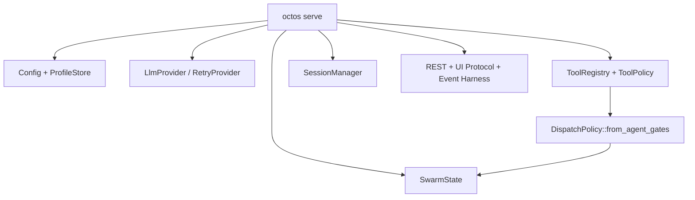
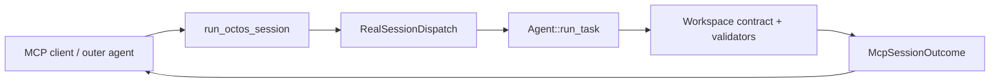
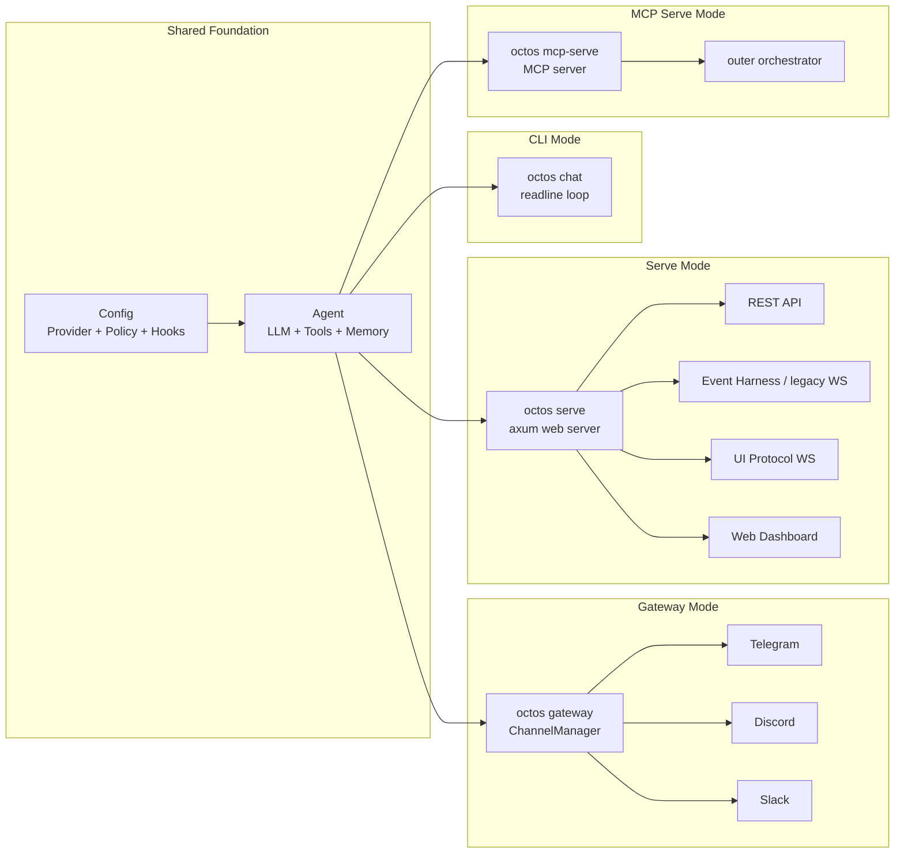

# Chapter 13: Four Runtime Modes and the Configuration System

> **Positioning**: This chapter presents octos's four runtime modes (CLI/Gateway/Serve/MCP Serve) and the configuration system's hierarchy and hot-reload boundaries. Prerequisites: Chapter 10 and Chapter 5. Target audience: operators and developers who need to deploy and configure octos (Reader D), and developers who want to understand runtime architecture choices (Reader B).

One codebase, four runtime postures — this is the core design philosophy of octos as an "Agent Operating System."

---

## 13.1 Four Runtime Modes

### 13.1.1 CLI Mode (`octos chat`)

The CLI mode is an interactive terminal conversation entry point (`crates/octos-cli/src/commands/chat.rs`). It starts a multi-threaded Tokio runtime with an 8MB thread stack (`crates/octos-cli/src/commands/chat.rs:69-74`) and provides a readline-style input interface.

```rust
let runtime = tokio::runtime::Builder::new_multi_thread()
    .enable_all()
    .thread_stack_size(8 * 1024 * 1024)
    .build()?;
```

The 8MB stack size, rather than Tokio's default 2MB, exists because Agent call chains can become deep, especially with nested sub-agents and recursive tool calls.

Exit commands support multiple forms: `exit`, `quit`, `/exit`, `/quit`, and `:q` (`crates/octos-cli/src/commands/chat.rs:66-67`).

CLI arguments (`crates/octos-cli/src/commands/chat.rs:22-64`) can override key configuration values: `--cwd`, `--provider`, `--model`, `--max-iterations`, and `--verbose`. Command-line arguments take priority over configuration files.

### 13.1.2 Gateway Mode (`octos gateway`)

Gateway mode is a background daemon (`crates/octos-cli/src/commands/gateway/`). It starts a `ChannelManager` that listens on multiple message channels and routes inbound messages to Agent processing.

**GatewayRuntime** (`crates/octos-cli/src/commands/gateway/gateway_runtime.rs:54-95`) holds the runtime state: messaging (`agent_handle`, `channel_mgr`), session dispatch (`actor_registry`, `session_dispatcher`, `active_sessions`), hot-reload state (`system_prompt`, `max_history`, `config_rx`), and background services such as persona, heartbeat, and cron.

Gateway supports Profile and sub-account mode. `UserProfile.parent_id` marks a sub-account. On the current main branch, sub-accounts inherit the parent's structured `config.llm` contract, inherit `search`, `deep_crawl`, `apps`, and `email` only when missing, and merge `env_vars` with the parent as the base and the sub-account taking precedence (`crates/octos-cli/src/profiles.rs:1236-1273`; `crates/octos-cli/src/commands/gateway/gateway_runtime.rs:221-245`). When launched by `ProcessManager`, the sub-account gateway process also receives `--parent-profile` and parent env vars (`crates/octos-cli/src/process_manager.rs:275-291`).

**GatewayDispatcher** (`crates/octos-cli/src/gateway_dispatcher.rs:35-44`) extracts testable command dispatch logic from the main loop and supports internal commands such as `/new` (create a new session) and `/switch` (switch profile).

### 13.1.3 Serve Mode (`octos serve`)

Serve mode is the web server (`crates/octos-cli/src/commands/serve.rs`). Its default port is 50080, and its default bind address is `127.0.0.1` (`crates/octos-cli/src/commands/serve.rs:214-222`). This is a secure default; external access requires explicitly passing `--host 0.0.0.0`.

Serve provides the Web Dashboard, REST endpoints, non-chat event/compatibility interfaces, and the UI Protocol WebSocket used by AppUI (`/api/ui-protocol/ws`). It is built with axum, and `AppState` holds global state such as providers, tool registries, and session management. The current main branch has deleted the chat SSE transport: `POST /api/chat?stream=true`, `GET /api/chat/stream`, and `GET /api/sessions/:id/events/stream` are no longer chat event channels. The standard chat transport is `/api/ui-protocol/ws` (`crates/octos-cli/src/api/router.rs:91-137`).

More precisely, Serve mode is now a control-plane aggregation point, not just "chat over HTTP". Startup composes Config / ProfileStore, LLM Provider / RetryProvider, ToolRegistry / ToolPolicy, SessionManager, REST/UI Protocol, compatibility WebSocket/event harness, and swarm dispatch state. The swarm state also projects `config.tool_policy` and injection-environment denylist into `DispatchPolicy::from_agent_gates(tool_policy, true)`, so swarm backends cannot bypass native tool policy (`crates/octos-cli/src/commands/serve.rs:1128-1156`).



### 13.1.4 MCP Serve Mode (`octos mcp-serve`)

`octos mcp-serve` is not a human chat entry point. It exposes octos itself as an MCP server for outer orchestrators (`crates/octos-cli/src/commands/mcp_serve.rs:1-5`). The default transport is `stdio`; HTTP transport is also supported and requires a bearer token through `OCTOS_MCP_SERVER_TOKEN` (`crates/octos-cli/src/commands/mcp_serve.rs:7-11`).

The key difference is that every `run_octos_session` call loads profile configuration, builds the LLM, marks the task as Running, constructs an Agent, runs the prompt, verifies the artifact, and transitions the task to Ready or Failed (`crates/octos-cli/src/commands/mcp_serve.rs:13-30`). MCP Serve therefore packages octos's Agent capability as a task execution interface for external systems, rather than maintaining a long-lived interactive UI.

Avoid one common misunderstanding: MCP Serve does not expose the internal octos tool catalog to the outer system. `mcp_server.rs` advertises exactly one session-level tool, `run_octos_session`; the outer caller receives an aggregate outcome and does not see internal tool calls, iteration events, or progress streams (`crates/octos-agent/src/mcp_server.rs:1-34`).



| Dimension | CLI | Gateway | Serve | MCP Serve |
|-----------|-----|---------|-------|-----------|
| Entry point | `octos chat` | `octos gateway` | `octos serve` | `octos mcp-serve` |
| User interaction | Terminal readline | Message channels | Web UI + REST API + UI Protocol | MCP client / orchestrator |
| Concurrency model | Single session | Multi-channel, multi-session | Multi-user, multi-session | Task calls driven by an outer orchestrator |
| Default port | — | — | 50080 | stdio; HTTP defaults to `127.0.0.1:4033` |
| Stack size | 8MB | Default | Default | Default |
| Use case | Development and debugging | Messaging bot | API integration and web deployment | IDEs, outer agents, automation systems |

### 13.1.5 Architectural Relationship of the Four Modes



**Figure 13-1: Four runtime modes sharing the Agent core.** Config and Agent form the common foundation; the four modes differ in ingestion layer and scheduling model.

### 13.1.6 Common Startup Pattern

The four modes share a similar startup pattern:

1. Parse CLI arguments (`clap` derive)
2. Load configuration files according to the priority chain
3. Initialize tracing logs (7-day rotation, optional JSON format)
4. Create Provider and Agent, or construct them per profile when a task call arrives
5. Enter the mode-specific run loop

---

## 13.2 Configuration System

### 13.2.1 Priority Hierarchy

```
<cwd>/.octos/config.json > <data_dir>/config.json (usually ~/.octos/config.json) > legacy platform config dir (such as ~/.config/octos/config.json) > built-in defaults
```

Project-local configuration takes priority over data-dir configuration, allowing different projects to use different providers, models, and tool policies. The caller resolves `<data_dir>` from `--data-dir > OCTOS_HOME > ~/.octos` before loading config. Platform config dirs such as `~/.config/octos/config.json` are legacy compatibility paths; loading them emits a migration hint to `~/.octos/config.json` (`crates/octos-cli/src/config.rs:845-873`).

### 13.2.2 Provider Auto-detection

When the user specifies a model name without specifying a provider, octos matches by model-name prefix (see Chapter 3 for the provider registry):

- `claude-*` → Anthropic
- `gpt-*` → OpenAI
- `gemini-*` → Google
- `deepseek-*` → DeepSeek

### 13.2.3 Hot Reload

Config Watcher (`crates/octos-cli/src/config_watcher.rs:1-5`) polls configuration files every 5 seconds (`crates/octos-cli/src/config_watcher.rs:51-68`) and detects changes using SHA-256 hashes.

`ConfigChange` (`crates/octos-cli/src/config_watcher.rs:15-25`) distinguishes hot-reloadable changes from restart-required changes:

| Type | Items | Implementation |
|------|-------|----------------|
| HotReload | `system_prompt` (`crates/octos-cli/src/config_watcher.rs:144-148`) | Replace through `RwLock<String>` |
| HotReload | `max_history` (`crates/octos-cli/src/config_watcher.rs:151-156`) | Atomic update |
| Not `RestartRequired` | `provider`, `model` | Watcher no longer classifies provider/model changes as restart-required; runtime switching still uses `model_check` / `SwappableProvider` |
| RestartRequired | `base_url`, `api_key_env` | Requires rebuilding the HTTP client (`crates/octos-cli/src/config_watcher.rs:117-121`) |
| RestartRequired | `sandbox`, `mcp_servers`, `hooks` | Requires rebuilding isolation or external connections (`crates/octos-cli/src/config_watcher.rs:123-130`) |
| RestartRequired | `gateway.queue_mode`, `gateway.channels` | Affects the message dispatch loop (`crates/octos-cli/src/config_watcher.rs:133-163`) |

### 13.2.4 SwappableProvider: Runtime Model Switching, Not File Hot Reload

Current implementation has two separate paths:

1. **Configuration-file hot reload**: Config Watcher sends only `system_prompt` and `max_history` as `HotReload`; Gateway writes them into `RwLock<String>` and `AtomicUsize` (`crates/octos-cli/src/config_watcher.rs:175-180`; `crates/octos-cli/src/commands/gateway/gateway_runtime.rs:1335-1355`).
2. **Runtime model switching**: Gateway wraps the current LLM as `SwappableProvider` on startup (`crates/octos-cli/src/commands/gateway/gateway_runtime.rs:256-257`). The `SwitchModelTool` calls `swappable.swap(new_chain)` when the user triggers a model switch through the `model_check` tool (`crates/octos-cli/src/tools/switch_model.rs:290-295`).

In other words, editing `config.json` on disk does **not** automatically switch a running Gateway's provider/model. The watcher no longer reports provider/model changes as `RestartRequired`, but it also does not include them in the `HotReload` payload. The safe mental model is: `system_prompt` and `max_history` can be file-hot-reloaded; provider/model can be switched explicitly inside a session; if you want provider/model changes in the file to become the new startup state, restart the process.

The core implementation of `SwappableProvider` lives in `crates/octos-llm/src/swappable.rs:16-23,50-56`:

```rust
pub fn swap(&self, new_provider: Arc<dyn LlmProvider>) {
    let model_id = leak_str(new_provider.model_id().to_string());
    let provider_name = leak_str(new_provider.provider_name().to_string());
    *self.inner.write().unwrap() = new_provider;
    *self.cached_model_id.write().unwrap() = model_id;
    *self.cached_provider_name.write().unwrap() = provider_name;
}
```

`Box::leak()` converts a `String` into a `&'static str`. The cost is a small amount of memory that is never freed on each model switch; the benefit is that `model_id()` and `provider_name()` can return string references without holding a read lock on `inner`. For a long-running service, this leak is acceptable.

**Config Watcher safety**: The watcher reads all configuration files and hashes them within a poll cycle, avoiding check-then-read TOCTOU races. If a file fails to parse, octos keeps the last valid configuration and logs a warning instead of crashing.

**Why polling instead of inotify?** Cross-platform compatibility. inotify is Linux-specific, macOS uses kqueue, and Windows uses ReadDirectoryChangesW. Five-second polling plus SHA-256 hashing works consistently across platforms with minimal overhead.

---

## 13.3 Feature Flags

octos uses Cargo feature flags for conditional compilation:

| Feature | Enabled content |
|---------|-----------------|
| `api` | Web API server, monitoring, OTP, user management |
| `admin-bot` | Admin bot capability on top of `api` |
| `telegram` | Telegram channel integration |
| `discord` | Discord channel integration |
| `slack` | Slack channel integration |
| `whatsapp` | WhatsApp bridge channel |
| `email` | Email send/receive integration |
| `feishu` | Feishu/Lark channel |
| `twilio` | Twilio webhook/API channel |
| `wecom` | WeCom webhook/API channel |
| `matrix` | Matrix AppService channel |
| `wecom-bot` | WeCom Bot WebSocket channel |
| `qq-bot` | QQ Bot WebSocket channel |
| `wechat` | WeChat WebSocket bridge channel |
| `git` | Git operation tools |
| `ast` | AST code structure analysis |

This lets users build a minimized octos binary. When only CLI functionality is needed, the web server and channel integrations do not have to be compiled in. `BrowserTool` is a default built-in tool and does not correspond to a separate Cargo feature; feature flags mostly control API capabilities, channel integrations, and heavier `octos-agent/git` / `octos-agent/ast` dependencies. See Appendix D for the complete feature dependency map.

---

> ### Engineering Decision Sidebar: Hot Reload vs Full Restart Boundaries
>
> The core question of hot reload is: what can be safely replaced, and what cannot?
>
> **System prompts** can be hot-reloaded because they are stateless text. The next LLM call simply uses the new prompt without affecting in-progress sessions.
>
> **Provider/model** must be split into two cases. Explicit in-session switching can be handled by `SwappableProvider`, but that path is triggered by the `model_check` tool. Directly editing provider/model in the configuration file is not automatically applied by `ConfigWatcher`, and is no longer reported as a required restart. In contrast, **base_url and api_key_env** are restart-required because they affect the construction of the underlying HTTP client, connection pool, and TLS setup.
>
> **Hooks** cannot be hot-reloaded because their circuit breaker state needs to be reinitialized. Replacing hook commands without resetting failure counters could leave a previously tripped hook permanently disabled.
>
> Simple rule: **file hot reload covers only fields explicitly wired into `ConfigWatcher`; connection-rebuilding fields still require restart; `SwappableProvider` solves controlled runtime switching, not general configuration hot update.**

---

## 13.4 Chapter Summary

1. **Four modes**: CLI (terminal interaction), Gateway (messaging bot), Serve (Web/API/AppUI), and MCP Serve (outer orchestrator calls).
2. **Configuration hierarchy**: Local > global > defaults; provider auto-detection simplifies configuration.
3. **Hot reload**: SHA-256 polling currently file-hot-reloads only `system_prompt` and `max_history`; provider/model runtime switching uses `SwappableProvider` plus `model_check`; `base_url`, hooks, and MCP still require restart.
4. **Serve control plane**: Serve aggregates REST, UI Protocol, event harness, profiles, tool policy, and swarm state; it is not merely a chat HTTP wrapper. Chat events use `/api/ui-protocol/ws`.
5. **MCP Serve boundary**: MCP Serve exposes only session-level `run_octos_session`; the outer orchestrator receives an aggregate outcome, not the internal tool event stream.
6. **Feature flags**: Compile on demand to minimize deployment size.

---

## Further Reading

- **12-Factor App**: https://12factor.net/ — especially the Config and Processes chapters
- **axum framework**: https://docs.rs/axum/latest/axum/ — the web framework used by octos Serve mode

## Discussion Questions

1. **Mode fusion**: If Gateway (messaging bot) and Serve (Web API) need to run in the same process, what architectural changes are required?
2. **Configuration validation**: If octos provided an offline `octos config validate` command, what should it check?

---

> **Version Evolution Note**
> This chapter is based on the current `../octos` main branch. The current runtime modes are CLI / Gateway / Serve / MCP Serve. Serve defaults to port 50080, and configuration priority is centered on `<cwd>/.octos/config.json` and `<data_dir>/config.json`; the legacy platform config dir is compatibility-only.
