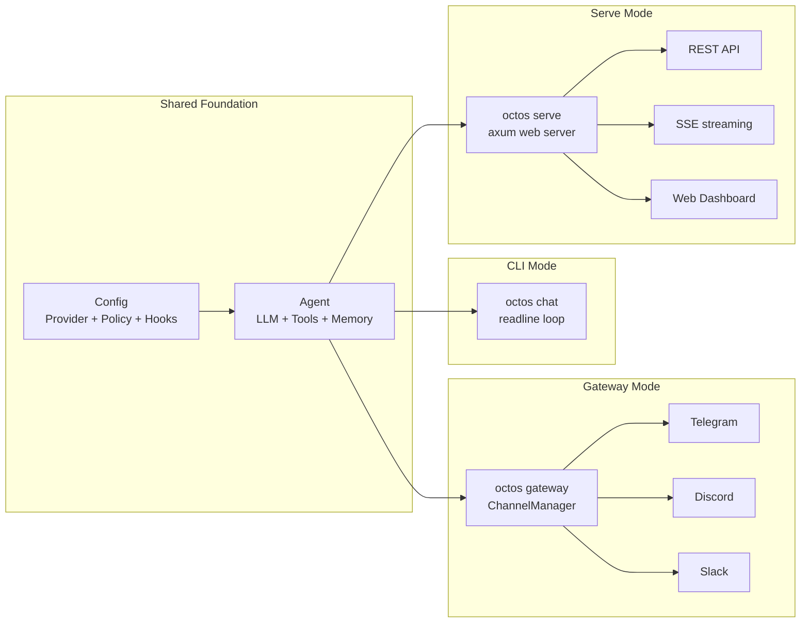

# Chapter 13: Three Runtime Modes and the Configuration System

> **Positioning**: This chapter presents octos's three runtime modes (CLI/Gateway/Serve) along with the configuration system's hierarchical structure and hot-reload mechanism. Prerequisites: Chapter 10, Chapter 5. Target audience: operators and developers who need to deploy and configure octos (Reader D), and developers who want to understand runtime architecture choices (Reader B).

One codebase, three runtime postures — this is the core design philosophy of octos as an "Agent Operating System."

---

## 13.1 Three Runtime Modes

### 13.1.1 CLI Mode (`octos chat`)

Interactive terminal conversation (`crates/octos-cli/src/commands/chat.rs`). Starts a multi-threaded Tokio runtime (8MB stack size, `chat.rs:73`), providing a readline-style input interface.

```rust
// chat.rs:69-78
let runtime = tokio::runtime::Builder::new_multi_thread()
    .enable_all()
    .thread_stack_size(8 * 1024 * 1024)  // 8MB stack — needed for deep recursion scenarios
    .build()?;
```

The 8MB stack size (rather than Tokio's default 2MB) is needed because the Agent's call chain can be very deep — particularly in nested sub-Agent and recursive tool call scenarios.

Exit commands support multiple formats: `exit`, `quit`, `/exit`, `/quit`, `:q` (`chat.rs:67`).

CLI arguments (`chat.rs:22-64`) allow overriding key settings from the configuration file: `--cwd`, `--provider`, `--model`, `--max-iterations`, `--verbose`. Command-line arguments take priority over configuration file values.

### 13.1.2 Gateway Mode (`octos gateway`)

Background daemon process (`crates/octos-cli/src/commands/gateway/`). Starts a ChannelManager that listens on multiple message channels and routes received messages to Agent processing.

**GatewayRuntime** (`gateway_runtime.rs:54-95`) holds the complete runtime state for the Gateway:

```rust
struct GatewayRuntime {
    // Message layer
    agent_handle: AgentHandle,
    channel_mgr: ChannelManager,
    // Voice support
    asr_binary: Option<PathBuf>,
    // Session dispatch
    actor_registry: ActorRegistry,
    gateway_dispatcher: GatewayDispatcher,
    // Hot reload
    system_prompt: RwLock<String>,
    config_rx: watch::Receiver<ConfigChange>,
    // Services
    persona: Option<Persona>,
    heartbeat: Option<Heartbeat>,
    cron: Option<CronScheduler>,
}
```

Gateway supports Profile mode (`gateway/mod.rs:54-56`) — multiple Gateway instances can run with different Profiles, each Profile having an independent system prompt, Provider, and tool policy. Parent profile inheritance (`mod.rs:95-96`) lets child Profiles inherit the parent Profile's base configuration and override specific fields.

**GatewayDispatcher** (`gateway_dispatcher.rs:35-44`) extracts testable command dispatch logic from the main loop, supporting internal commands like `/new` (create new session) and `/switch` (switch Profile).

### 13.1.3 Serve Mode (`octos serve`)

Web server (`crates/octos-cli/src/commands/serve.rs`). Default port 8080, default binding `127.0.0.1` (`serve.rs:25`) — a secure default; external access requires explicitly specifying `--host 0.0.0.0`.

Provides a Web Dashboard, REST endpoints, and SSE streaming output. Built with the axum framework, with AppState holding global state (Provider, tool registry, session manager, etc.).

| Dimension | CLI | Gateway | Serve |
|-----------|-----|---------|-------|
| Entry point | `octos chat` | `octos gateway` | `octos serve` |
| User interaction | Terminal readline | Message channels | Web UI + REST API |
| Concurrency model | Single session | Multi-channel multi-session | Multi-user multi-session |
| Default port | — | — | 8080 |
| Stack size | 8MB | Default | Default |
| Use case | Development & debugging | Messaging bot | API integration, web deployment |

### 13.1.4 Architectural Relationship of the Three Modes



**Figure 13-1: Three runtime modes sharing the Agent core.** Config and Agent form the common foundation; the three modes differ only in their ingestion layer.

### 13.1.5 Common Startup Pattern

All three modes share the same startup flow (Command Pattern):

1. Parse CLI arguments (`clap` derive)
2. Load configuration files (priority chain)
3. Initialize tracing logging (7-day rotation, optional JSON format)
4. Create Provider and Agent
5. Enter their respective run loops

---

## 13.2 Configuration System

### 13.2.1 Priority Hierarchy

```
Local .octos/config.json > Global ~/.config/octos/config.json > Built-in defaults
```

Local configuration takes priority over global configuration, allowing different projects to use different Providers, models, and tool policies.

### 13.2.2 Provider Auto-detection

When a user specifies only a model name without a Provider, octos automatically matches by model name prefix (see Chapter 3 for the Provider registry):

- `claude-*` → Anthropic
- `gpt-*` → OpenAI
- `gemini-*` → Google
- `deepseek-*` → DeepSeek

### 13.2.3 Hot Reload

Config Watcher (`crates/octos-cli/src/config_watcher.rs`) polls configuration files every 5 seconds (`config_watcher.rs:57`), detecting changes via SHA-256 hash (`config_watcher.rs:68`).

The `ConfigChange` enum (`config_watcher.rs:16-25`) distinguishes two categories of changes:

| Type | Hot-reloadable Items | Implementation |
|------|---------------------|----------------|
| HotReload | system_prompt (`config_watcher.rs:144-148`) | Direct replacement via `RwLock<String>` |
| HotReload | max_history (`config_watcher.rs:151-156`) | Atomic value update |
| HotReload | provider/model | Real-time swap via `SwappableProvider` (`config_watcher.rs:114-116`) |
| RestartRequired | base_url, api_key_env | Requires rebuilding the HTTP client |
| RestartRequired | sandbox, mcp_servers | Requires reinitializing subprocesses |
| RestartRequired | hooks | Requires resetting circuit breaker state |
| RestartRequired | gateway.channels | Requires reconnecting channels |

### 13.2.4 SwappableProvider: The Trick for Runtime Model Switching

**Provider/model changes are hot-reloadable** — octos achieves runtime Provider switching through `SwappableProvider` (`crates/octos-llm/src/swappable.rs`).

The problem: The `LlmProvider` trait has a `fn model_id(&self) -> &str` method that returns a `&str` reference. If the Provider is protected by a `RwLock`, the returned `&str` would hold the read lock — which could cause deadlocks in an async context.

octos's solution is a **string leak cache**:

```rust
pub struct SwappableProvider {
    inner: RwLock<Arc<dyn LlmProvider>>,
    cached_model_id: RwLock<&'static str>,    // leaked static string
    cached_provider_name: RwLock<&'static str>,
}

impl SwappableProvider {
    pub fn swap(&self, new_provider: Arc<dyn LlmProvider>) {
        // 1. Cache the new Provider's identifiers (leak as 'static str)
        let model_id: &'static str = Box::leak(new_provider.model_id().to_string().into_boxed_str());
        let name: &'static str = Box::leak(new_provider.provider_name().to_string().into_boxed_str());
        // 2. Atomic replacement
        *self.cached_model_id.write() = model_id;
        *self.cached_provider_name.write() = name;
        *self.inner.write() = new_provider;
    }

    // model_id() returns the cached &'static str, no need to hold inner's read lock
    fn model_id(&self) -> &str { *self.cached_model_id.read() }
}
```

`Box::leak()` converts a `String` to `&'static str` — the cost is a small amount of memory that is never freed (a few dozen bytes leaked per model switch), in exchange for `model_id()` and `provider_name()` being able to return string references without holding the `inner` read lock. For a long-running service, this tiny memory leak is entirely acceptable.

Users can switch models during a conversation via the `switch_model` tool without restarting. The Config watcher also calls `swap()` when it detects a model change, enabling hot updates.

**Config Watcher safety**: The watcher reads all configuration files and computes hashes in a single poll cycle, avoiding the check-then-read TOCTOU race condition. If a configuration file fails to parse, the last valid configuration is retained and a warning is printed — it will not crash.

**Why polling instead of inotify?** Cross-platform compatibility. inotify is Linux-specific, macOS uses kqueue, and Windows uses ReadDirectoryChangesW. Polling every 5 seconds with SHA-256 hashing works consistently across all platforms with minimal overhead (a single SHA-256 computation takes < 1 microsecond).

---

## 13.3 Feature Flags

octos controls conditional compilation through Cargo feature flags:

| Feature | Enabled Content |
|---------|----------------|
| `api` | Web API server, monitoring, OTP, user management |
| `telegram` | Telegram channel integration |
| `discord` | Discord channel integration |
| `slack` | Slack channel integration |
| `email` | Email send/receive integration |
| `browser` | Browser automation tools |
| `git` | Git operation tools |
| `ast` | AST code structure analysis |

This lets users compile a minimized octos build — when only CLI functionality is needed, web server and channel integration dependencies are not included.

---

> ### Engineering Decision Sidebar: The Boundary Between Hot Reload and Full Restart
>
> The core question of hot reload is "what can be safely replaced and what cannot."
>
> **System prompts** can be hot-reloaded because they are stateless text — the next LLM call simply uses the new prompt, without affecting in-progress sessions.
>
> **Provider/model** can be hot-reloaded via `SwappableProvider` — octos wraps the Provider in an atomically swappable reference. But **base_url and api_key_env** cannot be hot-reloaded because they affect the underlying HTTP client construction (connection pool, TLS configuration), and runtime replacement could cause in-flight requests to fail.
>
> **Hooks** cannot be hot-reloaded because the Hook's circuit breaker state (consecutive failure count) needs to be reinitialized. If hot reload only replaces the command without resetting the counter, a previously tripped Hook would never recover.
>
> Simple rule: **Things that can be atomically replaced can be hot-reloaded (text, references); things requiring connection rebuilding need a restart (HTTP clients, subprocesses, channel connections).** octos cleverly moves Providers into the "atomically replaceable" category through `SwappableProvider`.

---

## 13.4 Chapter Summary

1. **Three modes**: CLI (terminal interaction), Gateway (messaging bot), Serve (Web API) — one codebase, three entry points.
2. **Configuration hierarchy**: Local > Global > Defaults, with Provider auto-detection simplifying configuration.
3. **Hot reload**: SHA-256 polling detection. System prompts and Provider/model are hot-reloadable (via SwappableProvider); base_url/Hooks/MCP require restart.
4. **Feature Flags**: Compile on demand, minimizing deployment size.

---

## Further Reading

- **12-Factor App**: https://12factor.net/ — Particularly the Config and Processes sections
- **axum Framework**: https://docs.rs/axum/latest/axum/ — The web framework used by octos Serve mode

## Discussion Questions

1. **Mode fusion**: If you needed to run both Gateway (messaging bot) and Serve (Web API) in the same process, what architectural changes would be required?
2. **Configuration validation**: Currently, configuration files are parsed and validated at runtime. If you were to provide an `octos config validate` command for offline validation, what would you check?

---

> **Version Evolution Note**
> This chapter's analysis is based on octos v0.1.0. As of this writing, the entry points and configuration system for the three runtime modes have not changed significantly. The feature flags list may grow as functionality expands.
