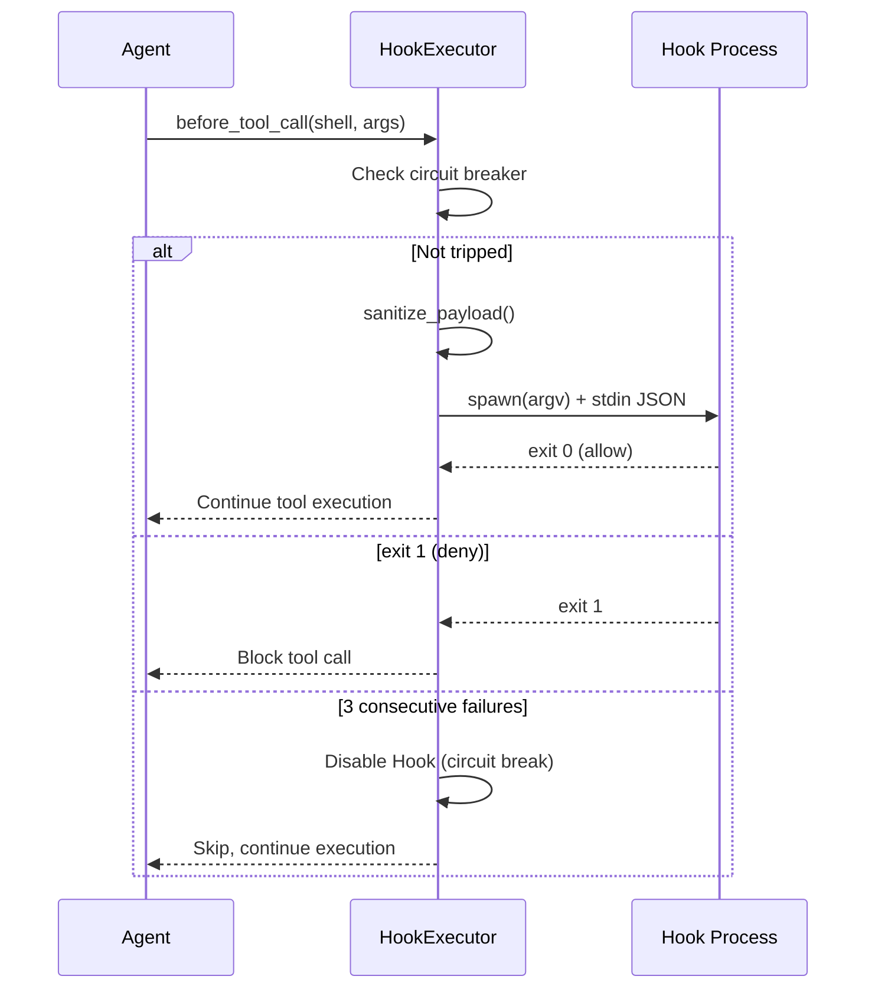

# Chapter 14: Production Readiness: Authentication, Monitoring, and Deployment

> **Positioning**: This chapter presents the final puzzle piece for taking octos from a development tool to a production system — authentication, Hooks lifecycle, monitoring, and multi-tenant configuration. Prerequisites: Chapter 13. Target audience: operators who need to deploy octos to production environments (Reader D), and developers who want to understand production-grade system design patterns (Reader B).

The distance between a system that "works" and one that's "production-ready" is often greater than the codebase size suggests. Authentication, monitoring, Hook systems, multi-tenant isolation — these aren't features; they're the infrastructure of trust.

---

## 14.1 Three Authentication Flows

### 14.1.1 OAuth PKCE

octos implements the PKCE (Proof Key for Code Exchange) flow for Providers that support OAuth, such as OpenAI (`crates/octos-cli/src/auth/oauth.rs`).

**The core idea of PKCE**: In the traditional OAuth authorization code flow, a malicious application can intercept the authorization code and impersonate the legitimate application. PKCE prevents this attack by embedding a "proof key" in the authorization request — only the application that knows the original verifier can exchange the code for a token.

**octos's PKCE implementation** (`oauth.rs:30-45`):

```rust
pub fn generate_pkce() -> PkceChallenge {
    // 1. Verifier = 2 UUID v4s concatenated = 64 hexadecimal characters
    let verifier = format!("{}{}", Uuid::new_v4().simple(), Uuid::new_v4().simple());

    // 2. Challenge = Base64-URL encoding (no padding) of SHA-256(verifier)
    let mut hasher = Sha256::new();
    hasher.update(verifier.as_bytes());
    let challenge = base64_url_encode(&hasher.finalize());

    PkceChallenge { verifier, challenge }
}
```

**Why concatenate 2 UUIDs?** RFC 7636 requires the verifier length to be between 43-128 characters. A single UUID v4 in simple format is 32 hexadecimal characters (not enough); two concatenated yield 64 (meeting the requirement).

The authorization flow in five steps:

1. Generate PKCE verifier + challenge pair
2. Generate a random state parameter (UUID v4, CSRF protection)
3. Open the browser to the Provider's authorization page (carrying the challenge)
4. Start a local HTTP server (`localhost:1455/auth/callback`, `oauth.rs:18-21`) to receive the callback
5. Exchange the authorization code + verifier for an access token

### 14.1.2 Device Code Flow

For browserless environments (such as remote servers), device code flow is supported — displaying a URL and code for the user to complete authentication on another device.

### 14.1.3 Paste-token

The simplest authentication method — the user directly pastes an API key. Suitable for Providers that don't support OAuth.

### 14.1.4 Credential Storage

Credentials are stored in `~/.octos/auth.json` with file permissions `0600` (owner read/write only). Bearer token comparison uses a constant-time algorithm (`subtle` crate) to prevent timing attacks.

### 14.1.5 API Security

The Serve mode HTTP server binds to `127.0.0.1` by default (local access only). External access requires explicitly enabling it via `--host 0.0.0.0` — the secure-by-default principle.

---

## 14.2 Hooks Lifecycle



**Figure 14-1: Hook execution sequence.** before_tool_call is the most commonly used Hook event. The circuit breaker automatically disables the Hook after 3 consecutive failures.

Hooks let users inject custom logic at critical points during Agent execution (`crates/octos-agent/src/hooks.rs`).

### 14.2.1 Four Events

| Event | Timing | Typical Use |
|-------|--------|------------|
| `before_tool_call` | Before tool invocation | Approval, argument modification, logging |
| `after_tool_call` | After tool invocation | Result filtering, auditing |
| `before_llm_call` | Before LLM invocation | Prompt modification, request interception |
| `after_llm_call` | After LLM invocation | Response filtering, monitoring |

### 14.2.2 HookConfig and HookPayload

Each Hook's configuration (`hooks.rs:36-47`):

```rust
pub struct HookConfig {
    pub event: HookEvent,        // lifecycle event to trigger on
    pub command: Vec<String>,    // argv array — no Shell interpretation
    pub timeout_ms: u64,         // timeout (default 5000ms)
    pub tool_filter: Option<String>, // optional: trigger only for specific tools
}
```

`tool_filter` lets users control precisely — for example, triggering an approval Hook only before `shell` tool calls, not for other tools.

**HookPayload** (`hooks.rs:55-105`) is the JSON data passed to the Hook process:

| Event Type | Payload Fields |
|-----------|---------------|
| before/after_tool_call | tool_name, arguments, tool_id, result |
| before/after_llm_call | model, stop_reason, has_tool_calls, token counts |
| All events | session_id, profile_id (from HookContext) |
| after_llm_call (additional) | cumulative_input_tokens, session_cost |

### 14.2.3 Shell Protocol

Hook commands are executed as argv arrays (**no Shell interpretation**, preventing injection), receiving JSON payloads via stdin, and returning decisions via exit codes:

| Exit Code | Meaning | Behavior |
|-----------|---------|----------|
| 0 | Allow | Continue execution |
| 1 | Deny | Block operation |
| 2+ | Modify | Replace original arguments with stdout JSON |

**Sensitive data protection** (`hooks.rs:107-150`):

```rust
const MAX_PAYLOAD_FIELD_BYTES: usize = 1024; // 1KB
const SENSITIVE_TOOLS: &[&str] = &["shell", "write_file", "read_file"];
```

- Sensitive tools' (shell, write_file, read_file) arguments are replaced with `{"redacted": true}`
- Other tools' arguments are truncated to 1KB (UTF-8 safe truncation)
- Prevents Hook processes (which may be third-party scripts) from seeing file contents or shell commands

Session context (`session_id`, `profile_id`) is injected into all payloads (`hooks.rs:85-88`), allowing Hooks to implement differentiated policies based on session or user.

### 14.2.4 Hook Execution Source Code Walkthrough

`execute_hook()` (`hooks.rs:478-557`) demonstrates the complete pattern for safely executing external processes:

```rust
async fn execute_hook(&self, hook: &HookConfig, payload_json: &str) -> Result<(i32, String)> {
    let (program, args) = hook.command.split_first()
        .ok_or_else(|| eyre!("empty hook command"))?;
    let program = expand_tilde(program);  // ~/script.sh -> /home/user/script.sh

    let mut cmd = tokio::process::Command::new(&program);
    cmd.args(args).stdin(Stdio::piped()).stdout(Stdio::piped()).stderr(Stdio::piped());
    for var in BLOCKED_ENV_VARS { cmd.env_remove(var); }
    let mut child = cmd.spawn()?;

    if let Some(mut stdin) = child.stdin.take() {
        let _ = stdin.write_all(payload_json.as_bytes()).await;
        let _ = stdin.shutdown().await;
    }

    match tokio::time::timeout(Duration::from_millis(hook.timeout_ms), child.wait()).await {
        Ok(Ok(status)) => Ok((status.code().unwrap_or(2), stdout)),
        Err(_) => {
            let _ = child.kill().await;  // kill on timeout to prevent zombie processes
            Err(eyre!("hook timed out after {}ms", hook.timeout_ms))
        }
    }
}
```

**argv array instead of shell string**: `Command::new(program).args(args)` passes arguments directly to `execve()`, bypassing shell interpretation. This closes the shell injection attack surface.

**Tilde expansion**: Since the shell is bypassed, `~/script.sh` won't expand automatically. `expand_tilde()` safely replaces `~` with `$HOME`.

### 14.2.5 Circuit Breaker

Each Hook maintains an `AtomicU32` failure counter. After 3 consecutive failures, it's automatically disabled, using `compare_exchange` (CAS) to ensure the warning is printed only once (`hooks.rs:376-396`):

```rust
let failures = hook_failures[i].fetch_add(1, Ordering::Relaxed) + 1;
if failures >= threshold {
    if hook_failures[i].compare_exchange(failures, threshold + 1, Ordering::Relaxed, Ordering::Relaxed).is_ok() {
        warn!("Hook {:?} disabled after {} failures", hook.command, threshold);
    }
    continue;
}
```

A successful call resets the counter to 0. This prevents buggy Hook processes from continuously crashing and slowing down the entire system.

---

## 14.3 Monitoring

### 14.3.1 Prometheus Metrics

Serve mode exposes a Prometheus metrics endpoint. Key metrics include:

- **Token usage**: Input/output tokens per iteration (reported via `TokenTracker`'s atomic counters)
- **Request latency**: Latency distribution of LLM calls and tool executions
- **Session count**: Number of active sessions

### 14.3.2 Tracing

octos uses the `tracing` crate for structured logging, supporting JSON format output (via `tracing-subscriber`'s json layer) and file rotation (via `tracing-appender`).

---

## 14.4 Multi-tenant Configuration

In multi-tenant scenarios, each tenant can have independent:
- Provider and model configuration
- Tool policies (ToolPolicy)
- System prompts
- Session storage paths

Tenant isolation is achieved through configuration-level separation — different tenants use different configuration files, and Agent instances create independent Providers, tool registries, and storage paths based on their configuration files.

---

> ### Engineering Decision Sidebar: Why Hooks Use Exit Codes Instead of JSON Responses
>
> **Option 1: JSON response (stdin/stdout all JSON)**
>
> Advantages: High expressiveness, can carry complex decision rationale and modified arguments
> Disadvantages: Hook authors need to output valid JSON — Shell scripts struggle to reliably generate JSON
>
> **Option 2: Exit code + optional stdout (octos's choice)**
>
> Advantages:
> - The simplest Hook only needs `exit 0` (allow) or `exit 1` (deny)
> - Shell scripts natively support exit codes
> - JSON stdout is only needed for exit 2+; most Hooks don't need to modify arguments
>
> Disadvantages:
> - Exit code semantics are limited (only allow/deny/modify)
> - Denial reasons cannot be conveyed via exit code (requires stderr logging)
>
> **Rationale:** The primary use cases for Hooks are approval and logging, where 90% of scenarios only need an allow/deny decision. Using exit codes makes the simplest Hook implementation extremely lightweight — a 3-line Shell script can implement approval logic. Only advanced scenarios requiring argument modification need JSON output.

---

## 14.5 Chapter Summary

1. **Three authentication flows**: OAuth PKCE (browser environments), Device Code (browserless), Paste-token (simplest). Credentials with 0600 permissions + constant-time comparison.
2. **Hooks**: 4 events x Shell protocol (argv execution, exit code decisions). Circuit breaker auto-disables after 3 failures. Sensitive arguments are automatically redacted.
3. **Monitoring**: Prometheus metrics + structured logging. Atomic counters enable lock-free token tracking.
4. **Multi-tenant**: Configuration-level isolation, with independent Providers, policies, and storage per tenant.

This concludes the 14 chapters of the book. The appendices will provide the complete crate dependency graph, tool reference guide, configuration reference, and contribution guide.

---

## Further Reading

- **OAuth 2.0 PKCE**: RFC 7636 "Proof Key for Code Exchange by OAuth Public Clients"
- **Prometheus**: https://prometheus.io/docs/introduction/overview/ — Monitoring system and time-series database
- **Circuit Breaker**: Martin Fowler, "CircuitBreaker" — Understanding the design rationale of the circuit breaker pattern
- **Constant-time comparison**: `subtle` crate documentation — Preventing timing side-channel attacks

## Discussion Questions

1. **Hook security boundaries**: Currently Hooks execute via argv (no Shell), but the Hook command itself could be a malicious program. How would you verify the trustworthiness of Hook commands?
2. **Circuit Breaker recovery**: The current implementation resets the counter on successful calls. But if a Hook is disabled and never called again, it can never recover. How would you design a "tentative recovery" mechanism?
3. **Multi-tenant resource isolation**: Current multi-tenant isolation is at the configuration level, not the process level. If one tenant's Agent consumes excessive CPU or memory, it affects other tenants. How would you implement resource-level isolation?

---

> **Version Evolution Note**
> This chapter's analysis is based on octos v0.1.0. As of this writing, the OAuth PKCE flow and Hooks system have not changed significantly. The Prometheus metrics list may expand with future versions. Multi-tenant support may gain process-level isolation in subsequent versions.
