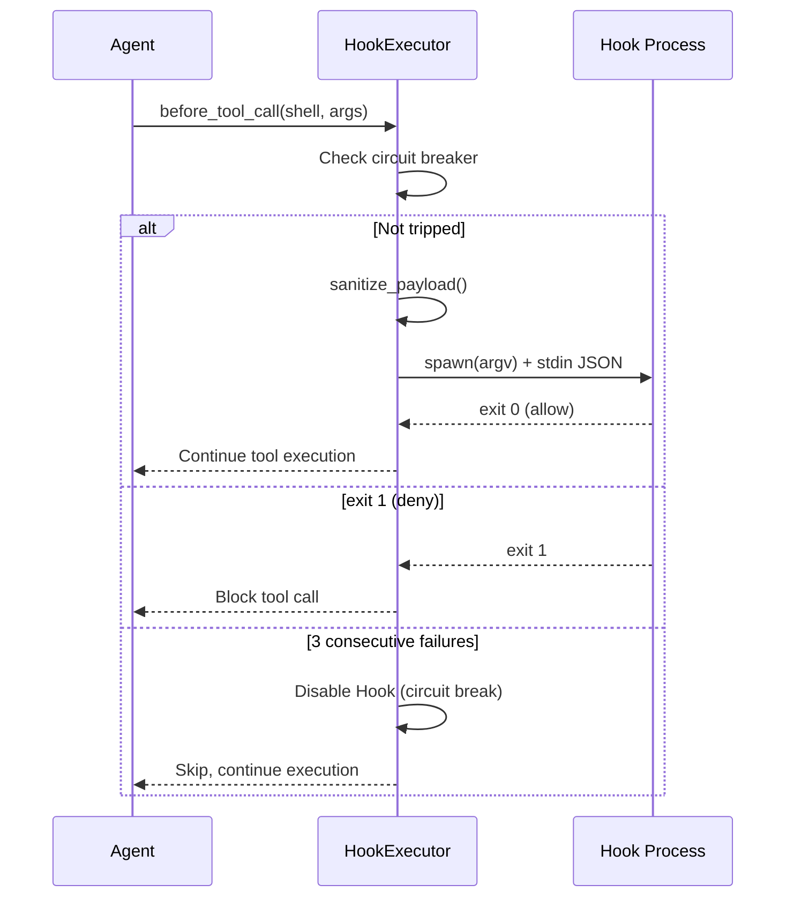
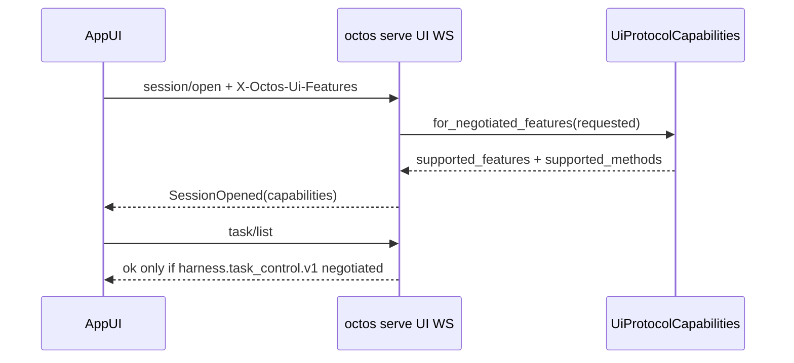
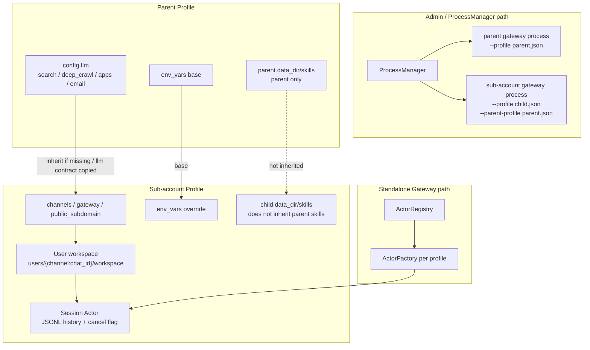

# Chapter 14: Production Readiness: Authentication, Monitoring, and Deployment

> **Positioning**: This chapter presents the final puzzle piece for taking octos from a development tool to a production system — authentication, Hooks lifecycle, monitoring, and multi-tenant configuration. Prerequisites: Chapter 13. Target audience: operators who need to deploy octos to production environments (Reader D), and developers who want to understand production-grade system design patterns (Reader B).

The distance between a system that "works" and one that's "production-ready" is often greater than the codebase size suggests. Authentication, monitoring, Hook systems, multi-tenant isolation — these aren't features; they're the infrastructure of trust.

---

## 14.1 Three Authentication Flows

### 14.1.1 OAuth PKCE

octos implements the PKCE (Proof Key for Code Exchange) flow for Providers that support OAuth, such as OpenAI (`crates/octos-cli/src/auth/oauth.rs`).

**The core idea of PKCE**: In the traditional OAuth authorization code flow, a malicious application can intercept the authorization code and impersonate the legitimate application. PKCE prevents this attack by embedding a "proof key" in the authorization request — only the application that knows the original verifier can exchange the code for a token.

**octos's PKCE implementation** (`oauth.rs:30-45`):

```rust
pub fn generate_pkce() -> PkceChallenge {
    // 1. Verifier = 2 UUID v4s concatenated = 64 hexadecimal characters
    let verifier = format!("{}{}", Uuid::new_v4().simple(), Uuid::new_v4().simple());

    // 2. Challenge = Base64-URL encoding (no padding) of SHA-256(verifier)
    let mut hasher = Sha256::new();
    hasher.update(verifier.as_bytes());
    let challenge = base64_url_encode(&hasher.finalize());

    PkceChallenge { verifier, challenge }
}
```

**Why concatenate 2 UUIDs?** RFC 7636 requires the verifier length to be between 43-128 characters. A single UUID v4 in simple format is 32 hexadecimal characters (not enough); two concatenated yield 64 (meeting the requirement).

The authorization flow in five steps:

1. Generate PKCE verifier + challenge pair
2. Generate a random state parameter (UUID v4, CSRF protection)
3. Open the browser to the Provider's authorization page (carrying the challenge)
4. Start a local HTTP server (`localhost:1455/auth/callback`, `oauth.rs:18-21`) to receive the callback
5. Exchange the authorization code + verifier for an access token

### 14.1.2 Device Code Flow

For browserless environments (such as remote servers), device code flow is supported — displaying a URL and code for the user to complete authentication on another device.

### 14.1.3 Paste-token

The simplest authentication method — the user directly pastes an API key. Suitable for Providers that don't support OAuth.

### 14.1.4 Credential Storage

Credentials are stored in `~/.octos/auth.json` with file permissions `0600` (owner read/write only). Bearer token comparison uses a constant-time algorithm (`subtle` crate) to prevent timing attacks.

### 14.1.5 API Security

The Serve mode HTTP server binds to `127.0.0.1` by default (local access only). External access requires explicitly enabling it via `--host 0.0.0.0` — the secure-by-default principle.

---

## 14.2 Hooks Lifecycle



**Figure 14-1: Hook execution sequence.** before_tool_call is the most commonly used Hook event. The circuit breaker automatically disables the Hook after 3 consecutive failures.

Hooks let users inject custom logic at critical points during Agent execution (`crates/octos-agent/src/hooks.rs`).

### 14.2.1 Four Events

| Event | Timing | Typical Use |
|-------|--------|------------|
| `before_tool_call` | Before tool invocation | Approval, argument modification, logging |
| `after_tool_call` | After tool invocation | Result filtering, auditing |
| `before_llm_call` | Before LLM invocation | Prompt modification, request interception |
| `after_llm_call` | After LLM invocation | Response filtering, monitoring |

### 14.2.2 HookConfig and HookPayload

Each Hook's configuration (`hooks.rs:36-47`):

```rust
pub struct HookConfig {
    pub event: HookEvent,        // lifecycle event to trigger on
    pub command: Vec<String>,    // argv array — no Shell interpretation
    pub timeout_ms: u64,         // timeout (default 5000ms)
    pub tool_filter: Option<String>, // optional: trigger only for specific tools
}
```

`tool_filter` lets users control precisely — for example, triggering an approval Hook only before `shell` tool calls, not for other tools.

**HookPayload** (`hooks.rs:55-105`) is the JSON data passed to the Hook process:

| Event Type | Payload Fields |
|-----------|---------------|
| before/after_tool_call | tool_name, arguments, tool_id, result |
| before/after_llm_call | model, stop_reason, has_tool_calls, token counts |
| All events | session_id, profile_id (from HookContext) |
| after_llm_call (additional) | cumulative_input_tokens, session_cost |

### 14.2.3 Shell Protocol

Hook commands are executed as argv arrays (**no Shell interpretation**, preventing injection), receiving JSON payloads via stdin, and returning decisions via exit codes:

| Exit Code | Meaning | Behavior |
|-----------|---------|----------|
| 0 | Allow | Continue execution |
| 1 | Deny | Block operation |
| 2+ | Modify | Replace original arguments with stdout JSON |

**Sensitive data protection** (`hooks.rs:107-150`):

```rust
const MAX_PAYLOAD_FIELD_BYTES: usize = 1024; // 1KB
const SENSITIVE_TOOLS: &[&str] = &["shell", "write_file", "read_file"];
```

- Sensitive tools' (shell, write_file, read_file) arguments are replaced with `{"redacted": true}`
- Other tools' arguments are truncated to 1KB (UTF-8 safe truncation)
- Prevents Hook processes (which may be third-party scripts) from seeing file contents or shell commands

Session context (`session_id`, `profile_id`) is injected into all payloads (`hooks.rs:85-88`), allowing Hooks to implement differentiated policies based on session or user.

### 14.2.4 Hook Execution Source Code Walkthrough

`execute_hook()` (`hooks.rs:478-557`) demonstrates the complete pattern for safely executing external processes:

```rust
async fn execute_hook(&self, hook: &HookConfig, payload_json: &str) -> Result<(i32, String)> {
    let (program, args) = hook.command.split_first()
        .ok_or_else(|| eyre!("empty hook command"))?;
    let program = expand_tilde(program);  // ~/script.sh -> /home/user/script.sh

    let mut cmd = tokio::process::Command::new(&program);
    cmd.args(args).stdin(Stdio::piped()).stdout(Stdio::piped()).stderr(Stdio::piped());
    for var in BLOCKED_ENV_VARS { cmd.env_remove(var); }
    let mut child = cmd.spawn()?;

    if let Some(mut stdin) = child.stdin.take() {
        let _ = stdin.write_all(payload_json.as_bytes()).await;
        let _ = stdin.shutdown().await;
    }

    match tokio::time::timeout(Duration::from_millis(hook.timeout_ms), child.wait()).await {
        Ok(Ok(status)) => Ok((status.code().unwrap_or(2), stdout)),
        Err(_) => {
            let _ = child.kill().await;  // kill on timeout to prevent zombie processes
            Err(eyre!("hook timed out after {}ms", hook.timeout_ms))
        }
    }
}
```

**argv array instead of shell string**: `Command::new(program).args(args)` passes arguments directly to `execve()`, bypassing shell interpretation. This closes the shell injection attack surface.

**Tilde expansion**: Since the shell is bypassed, `~/script.sh` won't expand automatically. `expand_tilde()` safely replaces `~` with `$HOME`.

### 14.2.5 Circuit Breaker

Each Hook maintains an `AtomicU32` failure counter. After 3 consecutive failures, it's automatically disabled, using `compare_exchange` (CAS) to ensure the warning is printed only once (`hooks.rs:376-396`):

```rust
let failures = hook_failures[i].fetch_add(1, Ordering::Relaxed) + 1;
if failures >= threshold {
    if hook_failures[i].compare_exchange(failures, threshold + 1, Ordering::Relaxed, Ordering::Relaxed).is_ok() {
        warn!("Hook {:?} disabled after {} failures", hook.command, threshold);
    }
    continue;
}
```

A successful call resets the counter to 0. This prevents buggy Hook processes from continuously crashing and slowing down the entire system.

---

## 14.3 Observability and Control Plane: Three Monitoring Layers + AppUI

octos observability is not a single metrics endpoint. It is composed of Prometheus metrics, structured tracing, and SSE event streams, each covering a different operational need. The current main branch also adds a stronger interactive control plane: the UI Protocol WebSocket used by AppUI. It does not merely observe events; it lets the frontend operate sessions, approvals, diffs, and background tasks within explicit capability boundaries.

### 14.3.1 Prometheus Metrics

Serve mode exposes Prometheus metrics (`crates/octos-cli/src/api/metrics.rs:1-76`). `MetricsReporter` decorates the Agent's `ProgressReporter` trait: it records metrics while forwarding events downstream.

| Metric | Type | Labels | Purpose |
|--------|------|--------|---------|
| `octos_tool_calls_total` | Counter | `tool`, `success` | Tool call count and success rate |
| `octos_tool_call_duration_seconds` | Histogram | `tool` | Tool execution latency distribution |
| `octos_llm_tokens_total` | Counter | `direction` | Cumulative session token trend from `CostUpdate` |

These metrics answer the core production questions: which tool is slow, whether LLM activity is anomalous, and which tools are unreliable.

One implementation detail matters: `MetricsReporter` currently adds `session_input_tokens` / `session_output_tokens` into the counter, and these fields are already cumulative for the current session (`crates/octos-cli/src/api/metrics.rs:63-70`, `crates/octos-agent/src/agent/streaming.rs:242-257`). This is useful for trend monitoring, but it should not be treated as exact billing truth.

### 14.3.2 Structured Tracing

octos uses `tracing` for structured logs (`crates/octos-cli/src/main.rs:64-131`):

- **Log rotation**: daily logs with 7-day retention
- **JSON mode**: `OCTOS_LOG_JSON=1` switches the console layer to JSON for ELK/Loki-style ingestion
- **Compact mode**: the default human-readable format includes timestamp, level, and span context
- **Log directory**: Serve mode can write logs under `~/.octos/logs/serve.YYYY-MM-DD.log`

The current implementation uses explicit `tracing::info!` / `warn!` / `debug!` calls rather than pervasive `#[instrument]` annotations. Distributed tracing and cross-service trace-ID propagation are not yet implemented.

### 14.3.3 SSE Event Streams: Frontend Observability

SSE in octos is more than token streaming. It is a runtime observability channel. There are two implementation paths:

- **Serve/API path**: `POST /api/chat` streams per-request SSE events through `ChannelReporter` + `event_to_json()`; `GET /api/chat/stream` is the legacy broadcast path through `SseBroadcaster` (`crates/octos-cli/src/api/sse.rs:35-98`, `crates/octos-cli/src/api/handlers.rs:205-209`, `crates/octos-cli/src/api/handlers.rs:284-305`).
- **Gateway/channel path**: gateway-backed API requests use `ChannelStreamReporter` to convert discrete progress events into raw SSE JSON and send them back through `send_raw_sse()` (`crates/octos-cli/src/stream_reporter.rs:56-125`, `crates/octos-cli/src/stream_reporter.rs:457-460`, `crates/octos-cli/src/api/handlers.rs:72-84`).

The most useful shared events include:

| SSE event | When it fires | Payload shape |
|-----------|---------------|---------------|
| `tool_start` | A tool starts | `{"type":"tool_start","tool":"shell"}` |
| `tool_end` | A tool finishes | `{"type":"tool_end","tool":"shell","success":true}` |
| `tool_progress` | Tool progress | `{"type":"tool_progress","tool":"shell","message":"..."}` |
| `thinking` | LLM thinking starts | `{"type":"thinking","iteration":3}` |
| `response` | LLM response starts | `{"type":"response","iteration":3}` |
| `cost_update` | Token/cost update | `{"type":"cost_update","input_tokens":1234,"output_tokens":567,"session_cost":0.02}` |

This lets the dashboard show which iteration the Agent is in, which tool is running, how far tool execution has progressed, and how much cost has accumulated.

The current main branch also exposes dedicated harness event SSE at `GET /api/events/harness`. This is not a generic log stream; it is a typed event stream for dashboards, validators, and live gates. The `kinds` filter normalizes spellings such as `SwarmDispatch`, `swarm_dispatch`, and `swarm-dispatch`, and it accepts both top-level `kind` and nested `payload.kind` frame shapes (`crates/octos-cli/src/api/events_harness.rs:32-130`).

| Layer | Entry point | Operational question |
|-------|-------------|----------------------|
| tracing | structured logs | developer debugging and incident reconstruction |
| Prometheus | `/metrics` | aggregate statistics, alerts, capacity trends |
| harness events | `/api/events/harness` | typed realtime task / sub-agent / swarm events |

### 14.3.4 AppUI / UI Protocol: From Observation to Control

Serve mode also exposes `/api/ui-protocol/ws` (`crates/octos-cli/src/api/router.rs:95-101`). This is not a replacement for REST or SSE. It is AppUI's bidirectional control channel: the frontend sends JSON-RPC-style requests over WebSocket, and the backend returns structured results and session events.

`session/open` is the protocol entry point. The backend returns `SessionOpened`, including active profile, workspace root, cursor, pane snapshots, and negotiated capabilities (`crates/octos-core/src/ui_protocol.rs:1570-1597`; `crates/octos-cli/src/api/ui_protocol.rs:1450-1475`).

The negotiation details matter. If the client sends no feature header, the backend returns `first_server_slice` so older clients can still discover the server surface. If the client sends a feature header, the backend returns only the intersection of requested and supported features; unknown features are dropped. `task/list`, `task/cancel`, and `task/restart_from_node` appear in `supported_methods` only after `harness.task_control.v1` is negotiated (`crates/octos-core/src/ui_protocol.rs:748-825`; `crates/octos-cli/src/api/ui_protocol.rs:479-534`).



Two pieces are especially important:

- **Capability negotiation**: schema version is currently 2, and feature flags include `approval.typed.v1`, `pane.snapshots.v1`, `session.workspace_cwd.v1`, and `harness.task_control.v1` (`crates/octos-core/src/ui_protocol.rs:24-41`, `crates/octos-core/src/ui_protocol.rs:712-825`).
- **Method-level gates**: `task/list`, `task/cancel`, and `task/restart_from_node` require `harness.task_control.v1`; otherwise the backend returns unsupported capability instead of silently degrading (`crates/octos-core/src/ui_protocol.rs:55-69`).

This shifts production operation from "seeing what happened" to "intervening within explicit capability boundaries." For example, AppUI can list background tasks, cancel tasks, or restart from a node; the backend maps cancellation to `UiTaskRuntimeState::Cancelled` rather than merely writing a log line (`crates/octos-cli/src/api/ui_protocol.rs:2510-2650`).

---

## 14.4 Multi-tenancy: Profile + Account + User + Session Isolation

octos multi-tenancy is not a single `tenant_id` field. It is a layered model built from profiles, sub-accounts, user workspaces, and session actors. The current main branch also requires distinguishing two runtime paths:

- **Standalone Gateway path**: one Gateway process manages multiple profiles/sessions through `ActorRegistry` and `ActorFactory`.
- **Admin/process-manager path**: `ProcessManager` starts an `octos gateway` child process per profile and passes `--profile`, `--parent-profile`, `--data-dir`, and `--cwd` into that child (`crates/octos-cli/src/process_manager.rs:241-283`).

In other words, configuration and data directories are profile/account scoped; whether the boundary is also process-level depends on the entry point.

### 14.4.1 Profile / Account Layer: Tenant Configuration and Sub-accounts

`UserProfile` (`crates/octos-cli/src/profiles.rs:18-40`) is the top-level tenant abstraction:

```rust
pub struct UserProfile {
    pub id: String,
    pub name: String,
    pub enabled: bool,
    pub data_dir: Option<String>,
    pub public_subdomain: Option<String>,
    pub parent_id: Option<String>,
    pub config: ProfileConfig,
    pub created_at: DateTime<Utc>,
    pub updated_at: DateTime<Utc>,
}
```

Each profile can have independent LLM contracts, tool policies, system prompts, and channel bindings.

**Sub-account creation**: `create_sub_account()` requires the parent profile to exist and rejects a sub-account owning further sub-accounts. Sub-account IDs use the `{parent_id}--{sub_account_id}` form and public subdomains are checked for conflicts (`crates/octos-cli/src/profiles.rs:1180-1228`). Admin API exposes `GET /api/admin/profiles/:id/accounts` for listing sub-accounts and `POST /api/admin/profiles/:id/accounts` for creating them (`crates/octos-cli/src/api/admin.rs:1290-1385`).

**Sub-account inheritance**: the inherited unit is no longer a set of old top-level `provider/model/base_url/api_key_env` fields. `resolve_effective_profile()` copies the parent's full `config.llm` contract; `search`, `deep_crawl`, `apps`, and `email` are inherited only when missing; `env_vars` are merged with the parent as base and sub-account values taking precedence (`crates/octos-cli/src/profiles.rs:1236-1273`). When process-manager starts a sub-account gateway, it also passes `--parent-profile` and injects parent env vars, while preserving sub-account override priority (`crates/octos-cli/src/process_manager.rs:275-291`).

The mental model is: **the parent account provides shared capability contracts; the sub-account provides its own entry points and overrides**.

**Customer-installed skills are not inherited**: sub-account skills/plugin directories are scoped strictly to the current account. `skills_scope.rs` explicitly states that sub-accounts do not inherit parent profile customer skills; `resolve_account_skills_dir()` and `build_account_plugin_dirs()` only return the current account's `data_dir/skills` (`crates/octos-cli/src/skills_scope.rs:1-38`).

### 14.4.2 User Layer: File-System Isolation

Inside a profile, each user identified by `channel:chat_id` has an independent workspace. The session actor builds per-user paths when created (`crates/octos-cli/src/session_actor.rs:518-534`):

```
{data_dir}/users/{encoded_base_key}/
├── workspace/
├── sessions/
│   ├── default.jsonl
│   └── research.jsonl
```

The important detail is that `workspace/` and `sessions/` are per-user. Long-term memory and memory bank still live under profile/global `data_dir/memory/`, not under a separate memory directory for each user (`crates/octos-memory/src/memory_store.rs:20-26`, `crates/octos-cli/src/commands/gateway/gateway_runtime.rs:386-392`).

Path isolation has two layers:

1. **Application layer**: file tools resolve paths into the user's `workspace/`.
2. **Kernel layer**: macOS `sandbox-exec` SBPL can restrict file-system access to the same workspace.

### 14.4.3 Session Layer: Runtime State Ownership

Below the user layer, each session has its own runtime state (see Chapter 11 for Session Actor details):

- **ToolRegistry**: each session actor has its own registry and LRU counters
- **Conversation history**: managed through `SessionHandle` and per-session JSONL files
- **Cancellation flag**: one session's `AtomicBool` cancellation does not cancel other sessions for the same user

`sender_user_id` propagates from the channel layer through `DispatchParams::sender_user_id` into the actor and outbound message metadata, allowing channels such as Matrix AppService to send as the user rather than only as the bot.

### 14.4.4 Isolation Summary



**Figure 14-2: Profile / sub-account / user / session isolation.** The parent account provides shared capability contracts. The sub-account inherits structured configuration but keeps its own channels, public subdomain, data directory, and customer skills. The production admin path can start a gateway child process per profile; standalone Gateway keeps actor/factory isolation inside one process.

The isolation boundaries are:

- **Profile / Account**: LLM contract, policies, channels, env, skills, and data directories are scoped by profile/account.
- **Process**: process-manager can start per-profile gateway child processes; standalone Gateway remains actor isolation inside one process.
- **User**: `workspace/` and `sessions/` are per-user, while long-term memory is still profile/global.
- **Session**: ToolRegistry, JSONL history, cancellation flag, and actor runtime state are per-session.

Resource isolation is still not container-level isolation. Even with process-manager splitting profiles into child processes, CPU and memory limits require cgroups, containers, or other system-level controls.

---

> ### Engineering Decision Sidebar: Why Hooks Use Exit Codes Instead of JSON Responses
>
> **Option 1: JSON response (stdin/stdout all JSON)**
>
> Advantages: High expressiveness, can carry complex decision rationale and modified arguments
> Disadvantages: Hook authors need to output valid JSON — Shell scripts struggle to reliably generate JSON
>
> **Option 2: Exit code + optional stdout (octos's choice)**
>
> Advantages:
> - The simplest Hook only needs `exit 0` (allow) or `exit 1` (deny)
> - Shell scripts natively support exit codes
> - JSON stdout is only needed for exit 2+; most Hooks don't need to modify arguments
>
> Disadvantages:
> - Exit code semantics are limited (only allow/deny/modify)
> - Denial reasons cannot be conveyed via exit code (requires stderr logging)
>
> **Rationale:** The primary use cases for Hooks are approval and logging, where 90% of scenarios only need an allow/deny decision. Using exit codes makes the simplest Hook implementation extremely lightweight — a 3-line Shell script can implement approval logic. Only advanced scenarios requiring argument modification need JSON output.

---

## 14.5 Chapter Summary

1. **Three authentication flows**: OAuth PKCE (browser environments), Device Code (browserless), Paste-token (simplest). Credentials use 0600 permissions and constant-time comparison.
2. **Hooks**: 4 events x shell protocol (argv execution, exit code decisions). Circuit breaker auto-disables after repeated failures. Sensitive arguments are redacted.
3. **Observability**: Prometheus metrics, structured tracing, SSE event streams, and `/api/events/harness` typed events cover different operational needs.
4. **AppUI control plane**: UI Protocol WebSocket brings background tasks, approvals, and diff operations into a structured capability-gated control plane.
5. **Multi-tenancy**: Profile/Account, User, and Session boundaries are separate. Sub-accounts inherit structured capability contracts but not customer-installed skills; process-level isolation depends on the process-manager path.
6. **Production control plane**: admin token, setup state, SMTP secret, profile config, and gateway/serve/process manager form the operational entry points after deployment.

This concludes the 14 chapters of the book. The appendices will provide the complete crate dependency graph, tool reference guide, configuration reference, and contribution guide.

---

## Further Reading

- **OAuth 2.0 PKCE**: RFC 7636 "Proof Key for Code Exchange by OAuth Public Clients"
- **Prometheus**: https://prometheus.io/docs/introduction/overview/ — Monitoring system and time-series database
- **Circuit Breaker**: Martin Fowler, "CircuitBreaker" — Understanding the design rationale of the circuit breaker pattern
- **Constant-time comparison**: `subtle` crate documentation — Preventing timing side-channel attacks

## Discussion Questions

1. **Hook security boundaries**: Currently Hooks execute via argv (no Shell), but the Hook command itself could be a malicious program. How would you verify the trustworthiness of Hook commands?
2. **Circuit Breaker recovery**: The current implementation resets the counter on successful calls. But if a Hook is disabled and never called again, it can never recover. How would you design a "tentative recovery" mechanism?
3. **Multi-tenant resource isolation**: process-manager can split profiles into gateway child processes, but resource limits are not automatic. If one profile consumes excessive CPU or memory, it can still affect other profiles on the same host. How would you implement resource-level isolation?

---

> **Version Evolution Note**
> This chapter's analysis is based on octos v0.1.0. The current main branch advances sub-account inheritance to structured profile sections and supports per-profile gateway child processes through process-manager, but resource isolation still requires system-level limits.
