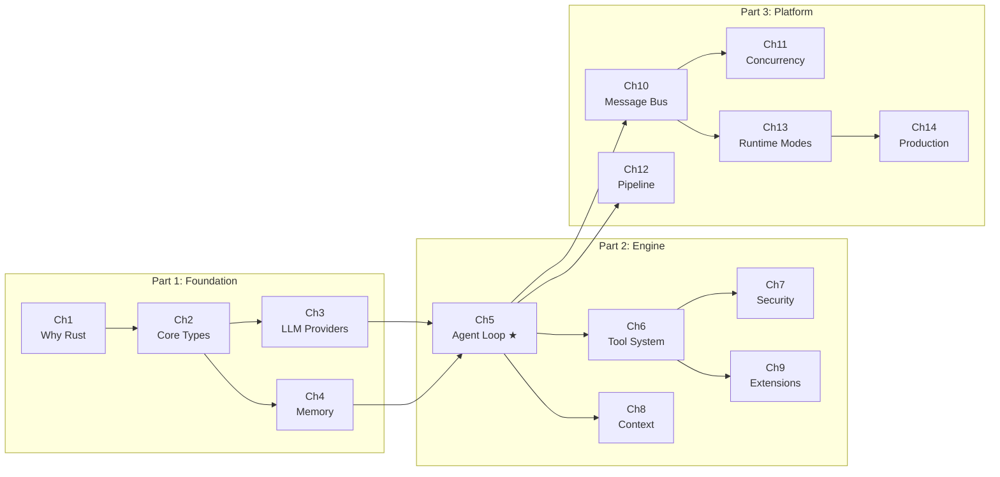

# Preface

## Why This Book

AI Agents are moving from labs to production. But when you open most Agent frameworks' source code, you see Python scripts, string-concatenated prompts, and `try: ... except: pass` error handling. This works for prototypes, but when your Agent needs to run 24/7 in production, serving multiple tenants while executing shell commands and file operations, you need more than a framework — you need operating-system-level infrastructure.

octos is an AI Agent operating system built in Rust. The current main branch has about 260K lines of Rust source, 11 octos-* core crates, and workspace-level `deny(unsafe_code)`. It's not "LangChain in Rust" — it was designed from line one for multi-tenancy, security isolation, and production reliability.

This book is not an octos user manual. It's an **engineering decision analysis** — each chapter dives into a subsystem's source code, showing "why this approach", "what alternatives were considered", and "what price was paid."

## Reading Preparation

### Prerequisites

- **Rust basics**: Understanding of ownership, borrowing, lifetimes, traits, enums
- **Async programming concepts**: Understanding of async/await, Future, event loops
- **AI/LLM concepts**: Understanding of what LLMs, tokens, context windows, and tool calling are
- **Not needed**: Compiler internals, OS kernel development, ML mathematics

### Recommended Reading Paths

**Path A: Rust Learner** (learning Rust through a real project)
> Ch1 → Ch2 → Ch4 → Ch5 → Ch6

**Path B: Senior Rust Developer** (learning large-scale AI system architecture)
> Ch1 → Ch3 → Ch5 → Ch7 → Ch11 → Ch13

**Path C: AI/LLM Application Developer** (understanding Agent OS design)
> Ch1 → Ch3 → Ch5 → Ch8 → Ch9

**Path D: octos Contributor** (deep dive into internals)
> All chapters in order + Appendix E

### Book Knowledge Map

**★ Ch5 (Agent Loop) is the book's hub** — the first four chapters are its foundation, the next nine are its extensions.
