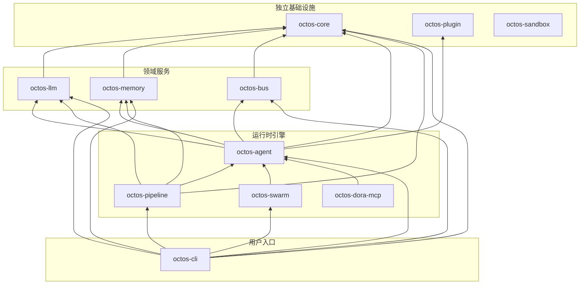

# 附录 A：octos 完整 Crate 依赖图

本附录以当前 `../octos` main 分支的 `Cargo.toml` 为准。图中展开 11 个 `octos-*` 核心 crate；`app-skills` 与 `platform-skills` 也是 workspace 成员，但它们是能力二进制程序，依赖形态更接近外部工具，故不展开到核心库依赖图中。

## 内部 Crate 依赖拓扑

箭头方向为"依赖于"。例如 `cli --> agent` 表示 `octos-cli` 的 `Cargo.toml` 依赖 `octos-agent`。`octos-sandbox` 是 Windows AppContainer 辅助 crate，当前不被其他核心 crate 直接依赖。

## 各 Crate 关键外部依赖

| Crate | 关键依赖 | 版本 | 用途 |
|-------|---------|------|------|
| **octos-core** | serde, serde_json, chrono, uuid, eyre | 1.x, 1.x, 0.4, 1.x, 0.6 | 序列化、时间、ID、错误 |
| **octos-llm** | reqwest, async-trait, futures, secrecy, redb, metrics | 0.12, 0.1, 0.3, 0.10, 2.x, 0.24 | HTTP、异步 trait、流式、密钥、凭据池状态、指标 |
| **octos-memory** | redb, hnsw_rs, bincode, tokio, uuid | 2.x, 0.3, 1.x, 1.x, 1.x | 嵌入式 DB、向量搜索、序列化、异步、ID |
| **octos-bus** | tokio, lru, cron, subtle, aes/cbc, teloxide*, serenity*, axum* | 1.x, 0.16, 0.15, 2.x, 0.8/0.1, 0.17, 0.12, 0.8 | 异步、缓存、定时、常量时间比较、加密、频道/API 集成 |
| **octos-agent** | tokio, async-trait, reqwest, chromiumoxide, gix*, tree-sitter* | 1.x, 0.1, 0.12, 0.9, 0.79, 0.24 | Agent 异步运行、工具 HTTP、浏览器自动化、Git/AST feature |
| **octos-pipeline** | async-trait, tokio, futures, regex, glob | 0.1, 1.x, 0.3, 1.x, 0.3 | Handler 抽象、异步执行、并发、模式匹配、文件匹配 |
| **octos-swarm** | async-trait, redb, uuid, metrics, tokio | 0.1, 2.x, 1.x, 0.24, 1.x | 子 Agent 编排、持久化、ID、指标、异步 |
| **octos-dora-mcp** | async-trait, tokio, serde, serde_json, eyre | 0.1, 1.x, 1.x, 1.x, 0.6 | Dora/MCP 工具桥接、异步、序列化、错误 |
| **octos-cli** | clap, rustyline, axum*, tower-http*, rust-embed*, keyring, metrics-exporter-prometheus* | 4.x, 15.x, 0.8, 0.6, 8.x, 3.x, 0.16 | CLI、交互输入、Web/API、静态资源、系统凭据、Prometheus |
| **octos-plugin** | serde, serde_json, eyre, which, tokio, metrics | 1.x, 1.x, 0.6, 7.x, 1.x, 0.24 | Manifest、错误、可执行文件发现、异步、指标 |
| **octos-sandbox** | clap, eyre, rappct**, windows** | 4.x, 0.6, 0.13, 0.62 | CLI、错误、Windows AppContainer |

`*` 表示 feature-gated 依赖；`**` 表示仅在 Windows target 下启用。

## Workspace 共享依赖

以下依赖在 `[workspace.dependencies]` 中统一定义，所有引用 workspace 依赖的 crate 使用相同版本：

- **tokio 1.x**（full features）：异步运行时
- **serde 1.x**（derive）/ **serde_json 1.x**：序列化框架
- **eyre 0.6 / color-eyre 0.6**：错误处理
- **tracing 0.1 / tracing-subscriber 0.3**：结构化日志
- **reqwest 0.12**（rustls-tls）：HTTP 客户端（纯 Rust TLS）
- **redb 2.x**：嵌入式持久化
- **axum 0.8 / tower-http 0.6**：可选 Web/API 入口
