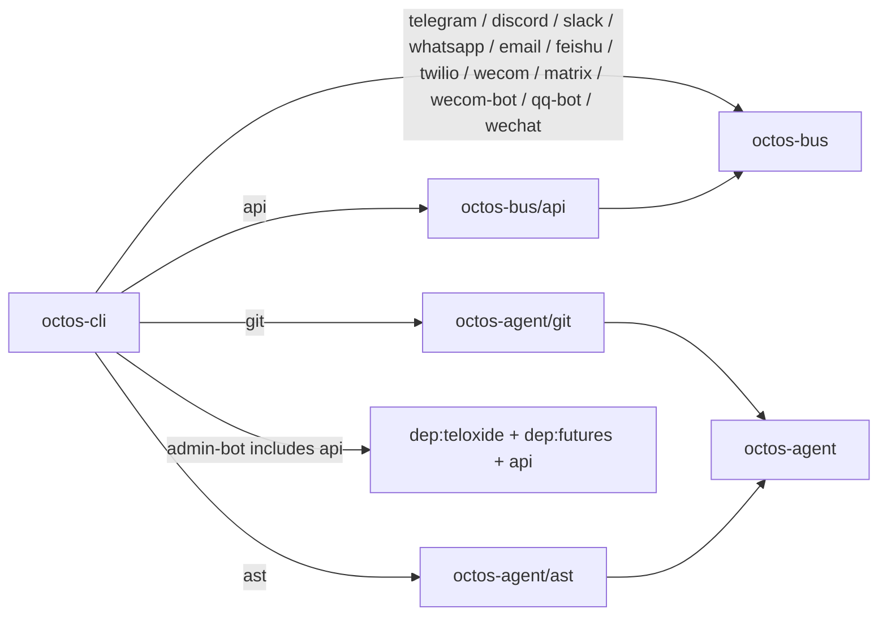

# 附录 D：Feature Flags 一览

本附录以当前 `../octos` main 分支的 Cargo workspace 为准。源码审查范围包括根 `Cargo.toml` 的 `members` 列表，以及 `octos-cli`、`octos-bus`、`octos-agent` 三个 crate 的 `[features]` 段。当前 workspace 采用 “默认最小、按需开启通道/工具” 的策略：`default = []`，生产部署通过显式 feature 组合选择 API、频道、admin bot 和可选工具能力。

## Feature 传播图



这张图体现了三个层次：

1. `octos-cli` 是最终二进制入口，负责把用户选择的 feature 转发到下游 crate。
2. `octos-bus` 承载多频道接入能力，频道相关 feature 基本都从 CLI 转发到 bus。
3. `octos-agent` 承载可选工具能力，`git` 与 `ast` 通过 CLI feature 暴露给最终构建。

## octos-cli Feature Flags

| Feature | 启用功能 | 额外依赖 / 下游 feature | 默认开启 |
|---------|---------|--------------------------|----------|
| `default` | 最小 CLI 构建 | — | 是，且为空 |
| `api` | Web API、dashboard、SSE/WebSocket、监控、OTP 登录、Prometheus exporter、用户与 profile 管理 | `dep:axum`、`dep:tower-http`、`dep:futures`、`dep:rust-embed`、`dep:metrics-exporter-prometheus`、`dep:lettre`、`dep:rand`、`dep:sysinfo`、`dep:subtle`、`octos-bus/api` | 否 |
| `admin-bot` | 管理 Bot；依赖 API 模式 | `dep:teloxide`、`dep:futures`、`api` | 否 |
| `telegram` | Telegram 频道集成 | `octos-bus/telegram` | 否 |
| `discord` | Discord 频道集成 | `octos-bus/discord` | 否 |
| `slack` | Slack 频道集成 | `octos-bus/slack` | 否 |
| `whatsapp` | WhatsApp 频道集成 | `octos-bus/whatsapp` | 否 |
| `email` | Email 频道集成 | `octos-bus/email` | 否 |
| `feishu` | 飞书频道集成 | `octos-bus/feishu` | 否 |
| `twilio` | Twilio 频道集成 | `octos-bus/twilio` | 否 |
| `wecom` | 企业微信回调频道 | `octos-bus/wecom` | 否 |
| `matrix` | Matrix 频道集成 | `octos-bus/matrix` | 否 |
| `wecom-bot` | 企业微信 Bot WebSocket 通道 | `octos-bus/wecom-bot` | 否 |
| `qq-bot` | QQ Bot WebSocket 通道 | `octos-bus/qq-bot` | 否 |
| `wechat` | WeChat WebSocket bridge 通道 | `octos-bus/wechat` | 否 |
| `git` | Agent Git 工具能力 | `octos-agent/git` | 否 |
| `ast` | Agent AST 代码结构分析能力 | `octos-agent/ast` | 否 |

## octos-bus Feature Flags

| Feature | 启用功能 | 额外依赖 | 默认开启 |
|---------|---------|----------|----------|
| `default` | 最小 bus 构建 | — | 是，且为空 |
| `api` | API/SSE/WebSocket 接入所需 bus 类型 | `axum` | 否 |
| `telegram` | Telegram channel 实现 | `teloxide` | 否 |
| `discord` | Discord channel 实现 | `serenity` | 否 |
| `slack` | Slack WebSocket channel 实现 | `tokio-tungstenite` | 否 |
| `whatsapp` | WhatsApp WebSocket channel 实现 | `tokio-tungstenite` | 否 |
| `feishu` | 飞书 channel 与回调接入 | `tokio-tungstenite`、`axum`、`rustls`、`rustls-native-certs` | 否 |
| `twilio` | Twilio webhook/API channel | `axum` | 否 |
| `wecom` | 企业微信 webhook/API channel | `axum` | 否 |
| `matrix` | Matrix webhook/API channel | `axum` | 否 |
| `wecom-bot` | 企业微信 Bot WebSocket channel | `tokio-tungstenite`、`rustls`、`rustls-native-certs` | 否 |
| `qq-bot` | QQ Bot WebSocket channel | `tokio-tungstenite`、`rustls`、`rustls-native-certs` | 否 |
| `wechat` | WeChat bridge WebSocket channel | `tokio-tungstenite` | 否 |
| `email` | Email channel，含 IMAP/SMTP 与邮件解析 | `async-imap`、`tokio-rustls`、`rustls`、`webpki-roots`、`lettre`、`mailparse` | 否 |

## octos-agent Feature Flags

| Feature | 启用功能 | 额外依赖 | 默认开启 |
|---------|---------|----------|----------|
| `git` | Git 操作与 diff 能力 | `dep:gix`、`dep:similar` | 否 |
| `ast` | AST 代码结构分析，覆盖 Rust/Python/JavaScript/TypeScript parser | `dep:tree-sitter`、`dep:tree-sitter-rust`、`dep:tree-sitter-python`、`dep:tree-sitter-javascript`、`dep:tree-sitter-typescript` | 否 |

`octos-agent` 当前没有显式 `default = []` 行；这表示没有默认 feature 被声明，`git` 和 `ast` 仍然只会在上游显式开启时编译。

## 当前没有 `[features]` 的 crate

这些 crate 目前没有 Cargo feature flags；它们要么始终作为核心库编译，要么作为独立 app-skill / platform-skill 二进制维护自己的依赖边界：

| 类别 | Crate |
|------|-------|
| 核心库 | `octos-core`、`octos-memory`、`octos-llm`、`octos-pipeline`、`octos-plugin`、`octos-swarm`、`octos-dora-mcp` |
| 平台/沙箱 | `octos-sandbox`、`platform-skills/voice` |
| App skills | `news`、`deep-search`、`deep-crawl`、`send-email`、`account-manager`、`time`、`weather`、`wechat-bridge`、`pipeline-guard`、`skill-evolve` |
| Harness starter skills | `harness-starter-generic`、`harness-starter-report`、`harness-starter-audio`、`harness-starter-coding` |

## 编译示例

```bash
# 最小 CLI：不启用 API、频道集成、Git/AST 工具
cargo build -p octos-cli --release

# CLI + Web API / Dashboard
cargo build -p octos-cli --release --features api

# API + 管理 Bot
cargo build -p octos-cli --release --features admin-bot

# Gateway 常见多频道组合
cargo build -p octos-cli --release --features "api,telegram,slack,email,feishu,wecom-bot,qq-bot,wechat"

# 开发者完整构建：包括 API、所有频道、Git/AST 工具
cargo build -p octos-cli --release --all-features
```

## 设计原则

Feature flags 的工程边界不是“功能分类标签”，而是“依赖树切割线”：

1. 频道集成放在 `octos-bus`，CLI 只做 feature 转发，避免 CLI 直接知道每个频道的底层依赖。
2. `api` 是服务端能力开关，不只启用 `axum`，还会连带 dashboard embedding、Prometheus exporter、OTP/email 相关依赖和 bus API 层。
3. `admin-bot` 显式依赖 `api`，因为它不是独立聊天频道，而是服务端管理面的入口。
4. `git` / `ast` 放在 `octos-agent`，通过 CLI 暴露，避免默认构建拉入较重的 Git 和 tree-sitter 依赖。
5. app-skill 二进制没有使用 Cargo features；它们通过 workspace member 和 skill manifest 管理分发边界，而不是通过主 CLI 的 feature flag 混编。
