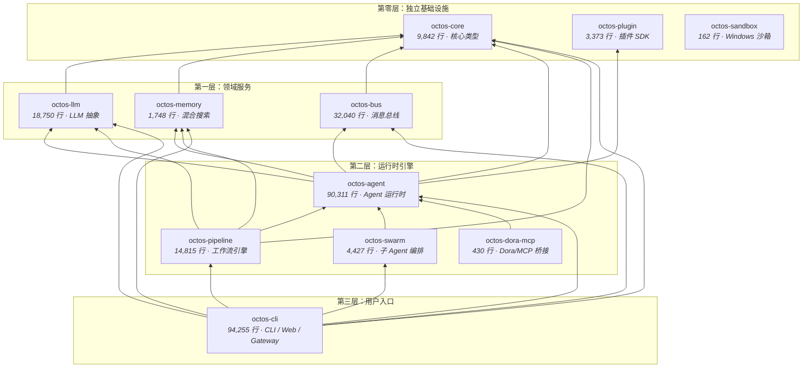

# 第 1 章：为什么是 Rust？为什么是 Agent OS？

> **定位**：本章是全书开篇，回答一个根本问题——为什么要用 Rust 构建多租户 AI Agent 平台？前置依赖：无。适用场景：任何想理解 octos 项目存在理由的读者，无论你是 Rust 初学者（读者 A）、资深 Rust 开发者（读者 B）、还是来自 Python/Go 生态的 AI 应用开发者（读者 C）。

当你第一次打开 octos 的代码仓库，看到接近 28 万行 Rust、400+ 个 Rust 源文件，以及一个由 11 个 octos-* 核心 crate、14 个 app skill、1 个 platform skill 组成的 Cargo workspace，心中难免浮现一个问题：为什么不用 Python？LangChain 和 AutoGen 不是已经很成熟了吗？为什么不用 Go？它的并发模型不是更简单吗？

这不是一个关于语言偏好的问题。当你把「AI Agent」从单用户玩具推向多租户生产平台时，你面对的是一组相互纠缠的工程约束：安全隔离、并发控制、性能预算。这三个约束中的任何一个都不难单独解决，但当它们同时出现在一个系统中时，语言选型就不再是品味问题，而是架构决策。

本章将从问题空间出发，解释这三大挑战为什么如此棘手，然后论证 Rust 为什么是目前最适合应对这组约束的语言，最后展开 octos 的 workspace 拓扑，为后续 13 章建立全局地图。

---

## 1.1 问题空间：多租户 AI Agent 平台的三大挑战

要理解 octos 的设计决策，首先要理解它试图解决的问题。octos 不是一个 chatbot 框架——它是一个多租户 AI Agent 操作系统，需要同时为多个用户、多个 Agent 实例提供服务，每个 Agent 都可以调用文件系统操作、Shell 命令、网络请求等具有副作用的工具。

### 1.1.1 挑战一：安全隔离

想象一个场景：租户 A 的 Agent 被 prompt 注入攻击，恶意指令试图读取租户 B 的会话历史，或者执行 `rm -rf /` 来破坏宿主机。在多租户环境中，这不是理论风险，而是日常威胁。

AI Agent 的安全隔离比传统 Web 服务更复杂，原因有三：

1. **工具调用是 Agent 的核心能力**。Agent 不只是生成文本——它执行 Shell 命令、读写文件、发起网络请求。每一次工具调用都是一个潜在的攻击面。octos 的默认工具注册表至少包含 Shell/File/Web/Browser 等内置工具；启用 `git` / `ast` feature，或进入 Gateway/Serve 运行时后，还会再注册记忆、模型切换、研究与管理类工具（`../octos/crates/octos-agent/src/tools/registry.rs`; `../octos/crates/octos-cli/src/commands/gateway/gateway_runtime.rs`）。每一类工具都需要独立的安全策略。

2. **Prompt 注入是新型攻击向量**。与传统 SQL 注入不同，prompt 注入发生在自然语言层面，更难用正则表达式或 WAF 规则拦截。攻击者可以在看似无害的文档中嵌入指令，诱导 Agent 执行越权操作。

3. **隔离粒度需要精细控制**。不同租户需要不同的权限边界：有的允许访问 Git 仓库，有的只允许只读文件操作，有的需要完全的沙箱隔离。一刀切的隔离策略要么太松（安全风险），要么太紧（功能受限）。

octos 的应对策略是纵深防御——从 Rust 语言层面消除内存安全漏洞，到 Linux bwrap / macOS sandbox-exec / Docker 三后端沙箱提供进程级隔离，再到工具级别的 deny-wins 策略引擎实现细粒度权限控制，构建了多层安全屏障（详见第 7 章）。

举一个具体例子：当 Agent 执行 Shell 命令时，octos 的 `ShellTool` 会先通过 `SafePolicy` 检查命令是否在危险命令黑名单中（如 `rm -rf /`、`dd`、`mkfs`、fork bomb 等），然后将命令提交到沙箱环境中执行。即使 prompt 注入成功诱导 LLM 生成了恶意命令，这两道防线仍然可以拦截。而沙箱本身的实现依赖 Rust 的类型系统确保资源句柄不会泄漏——文件描述符在 `Drop` 时自动关闭，不会出现 C/C++ 中常见的资源泄漏问题。

### 1.1.2 挑战二：并发控制

一个生产级 Agent 平台需要同时处理大量并发请求。考虑以下场景：

- 10 个用户同时与各自的 Agent 对话
- 每个 Agent 在一次迭代中可能并行调用 3-5 个工具
- 每个工具调用可能涉及异步 HTTP 请求、文件 I/O、子进程管理
- 后台还有 Cron 任务和 Heartbeat 定时触发新的 Agent 会话

这意味着系统中可能同时存在数百个异步任务。并发本身不是问题——问题是并发中的正确性：

- **会话级串行化**：同一个用户的消息必须按序处理，不能出现两条消息同时修改同一个会话状态的情况。Serve/API 路径把会话状态收敛到受 `Arc<tokio::sync::Mutex<_>>` 保护的共享管理器中，确保读写不会并发踩踏（`../octos/crates/octos-cli/src/commands/serve.rs`）。
- **工具级并行**：在单次 Agent 迭代内，多个不相关的工具调用应该并行执行以减少延迟。当前实现把工具任务句柄交给 `futures::future::join_all` 聚合，并在超时层外包一层 `tokio::time::timeout`（`../octos/crates/octos-agent/src/agent/execution.rs`）。
- **资源限流**：无限制的并发会耗尽系统资源。octos 通过 `tokio::sync::Semaphore` 限制最大并发会话数；默认值定义在配置层，Gateway 启动时再把它实例化成并发信号量（`../octos/crates/octos-cli/src/config.rs`; `../octos/crates/octos-cli/src/commands/gateway/gateway_runtime.rs`）。
- **优雅关停**：当收到 SIGTERM/CTRL-C 时，不能粗暴地杀死正在进行的 Agent 对话。octos 使用 `AtomicBool` 标志位实现优雅关停：Gateway 在信号处理路径上写入 shutdown flag，Agent Loop 在预算检查和流式消费路径上读取这个标志，让进行中的对话自然结束（`../octos/crates/octos-cli/src/commands/gateway/gateway_runtime.rs`; `../octos/crates/octos-agent/src/agent/budget.rs`; `../octos/crates/octos-agent/src/agent/streaming.rs`）。

Python 虽然可以通过 `multiprocessing` 或 `concurrent.futures.ProcessPoolExecutor` 实现 CPU 并行，但进程间通信的序列化开销使其不适合上述细粒度共享状态的并发模式。Go 的 goroutine 模型可以实现这些模式，但数据竞争只能通过 `-race` 运行时检测发现——尽管 Go 的 race detector 基于 happens-before 算法，在实际测试中相当有效，但它本质上依赖测试覆盖率，无法提供编译期的完备性保证。Rust 的 `Send`/`Sync` trait 则在编译期消除了整类数据竞争（详见第 11 章）。

### 1.1.3 挑战三：性能预算

AI Agent 的主要延迟瓶颈是 LLM API 调用（通常 1-10 秒），这让很多人认为 Agent 框架的性能无关紧要。这是一个危险的误解。

**首先，延迟是累积的。** 一次 Agent 执行可能包含多达 50 次迭代（octos 的默认上限），每次迭代涉及消息构建、工具调用、上下文压缩。如果框架层面每次迭代增加 50ms 开销，50 次迭代就是 2.5 秒——对于流式交互场景，这是用户可感知的延迟。

**其次，内存是多租户的硬约束。** 每个 Agent 会话需要维护对话历史、工具状态、上下文窗口。如果每个会话占用 100MB 内存（Python 应用中并不罕见），10 个并发会话就是 1GB，100 个就是 10GB。octos 的核心数据结构设计注重零拷贝和最小分配——例如 `truncate_utf8` 函数（`../octos/crates/octos-core/src/utils.rs`）通过 UTF-8 字符边界检测实现安全截断，避免不必要的字符串复制。

**最后，SSE 流式解析需要持续的 CPU 效率。** LLM 的流式响应以 Server-Sent Events（SSE）格式传输，框架需要在 token 到达的毫秒级时间内完成解析和转发。在多租户场景下，平台可能同时维护数十条 SSE 连接，每条连接持续数十秒。如果解析器每次事件都触发堆分配，高并发下的分配压力会导致延迟尖刺。

octos-llm 的有状态 SSE 解析器（`../octos/crates/octos-llm/src/sse.rs:5-72`）设置了 1MB 缓冲上限，采用增量解析策略——数据追加到字节缓冲区中，在完整事件边界处再做 UTF-8 转换。这种设计避免了 GC 语言中常见的"解析触发 GC、GC 阻塞所有连接"的级联效应，也避免中文等多字节字符被 chunk 边界切坏。

**一个容易被忽视的成本：上下文压缩。** 当对话历史接近 LLM 的上下文窗口限制时（通常 128K-200K tokens），octos 需要执行上下文压缩（Context Compaction）——将旧消息摘要化以腾出空间（详见第 8 章）。这个操作涉及大量字符串处理和 token 计数，在 GC 语言中容易产生大量临时对象和 GC 压力。octos 通过 `truncate_utf8`（`../octos/crates/octos-core/src/utils.rs`）等 UTF-8 安全工具函数，以及工具注册表里的 JSON size 估算路径（`../octos/crates/octos-agent/src/tools/registry.rs`），将这些热路径的内存开销降到最低。

---

## 1.2 语言选型：为什么是 Rust

理解了问题空间之后，我们可以在三个维度上比较候选语言：安全性、并发模型、运行时性能。

### 1.2.1 安全性维度

| 特性 | Python | Go | Rust |
|------|--------|----|------|
| 内存安全 | GC 保证，但 C 扩展不受保护 | GC 保证 | 所有权系统编译期保证 |
| 类型安全 | 动态类型，运行时错误 | 静态类型，但 `any` 绕过编译检查 | 强静态类型 + 枚举穷举匹配 |
| unsafe 控制 | 无此概念 | `unsafe` 包，但无编译器约束 | `unsafe` 块 + workspace 级 `deny(unsafe_code)` |
| 依赖安全 | PyPI 无签名验证 | go.sum 校验 | Cargo 校验 + `cargo-audit` |

octos 在 workspace 根 `Cargo.toml` 中设置了 `unsafe_code = "deny"`（`../octos/Cargo.toml` 的 `[workspace.lints.rust]`），这意味着整个 workspace 的核心 crate 和 skill 程序都继承同一个安全基线。这不是一个 lint 建议，而是一个编译期硬约束。任何包含 `unsafe` 块的代码都无法通过 `cargo build`。

对于一个需要执行 Shell 命令、读写文件系统的 Agent 平台，这个约束的意义在于：所有与操作系统的交互都通过标准库的安全抽象完成，消除了缓冲区溢出、use-after-free 等内存安全漏洞的可能性。

相比之下，Python 的 AI 框架大量使用 C 扩展（numpy、tokenizers 等），这些 C 代码不受 Python GC 保护。Go 虽然有内存安全保证，但 `unsafe` 包的使用没有编译器级别的全局禁止机制。

### 1.2.2 并发模型维度

| 特性 | Python | Go | Rust (Tokio) |
|------|--------|----|--------------|
| 并发原语 | asyncio（单线程事件循环） | goroutine + channel | async/await + Tokio 多线程运行时 |
| CPU 并行 | GIL 限制，需多进程 | 原生支持 | 原生支持 |
| 数据竞争检测 | 无 | `-race` 运行时检测 | `Send`/`Sync` 编译期保证 |
| 结构化并发 | 有限（`TaskGroup`） | 无内置支持 | `tokio::select!` + `JoinSet` |

Rust 的核心优势在于 `Send` 和 `Sync` trait 提供的编译期线程安全保证。考虑 octos 中的一个典型场景：Agent 配置（`AgentConfig`）需要在多个异步任务间共享。在 Go 中，你可能会用一个普通指针传递配置，直到某天在高并发下触发数据竞争。Go 的 race detector 虽然基于成熟的 happens-before 算法，能有效检测实际执行路径上的竞争，但它本质上是运行时工具——只有被测试覆盖到的代码路径才能被检测。

在 Rust 中，如果你试图在线程间共享一个非 `Send` 类型，编译器会直接拒绝：

```rust
// 示意代码——Rc 不是 Send，这段无法编译
let config = Rc::new(AgentConfig::default());
tokio::spawn(async move {
    let _ = config.max_iterations; // 编译错误：Rc<AgentConfig> cannot be sent between threads safely
});

// octos 的实际做法：使用 Arc 实现线程安全共享
let config = Arc::new(AgentConfig::default());
tokio::spawn(async move {
    let _ = config.max_iterations; // 编译通过：Arc<AgentConfig> 是 Send + Sync
});
```

这意味着整类并发 bug（数据竞争、use-after-free across threads）在 octos 中被编译器彻底消除，而不是依赖测试覆盖率和运行时检测。

### 1.2.3 性能维度

| 指标 | Python | Go | Rust |
|------|--------|----|------|
| 启动时间 | 200-500ms（导入开销）| 10-50ms | 5-20ms |
| 内存占用（典型 Agent 进程）| 50-150MB | 15-30MB | 5-15MB |
| GC 停顿 | 可预测但频繁 | 亚毫秒级（Go 1.19+） | 无 GC |

*以上数据为典型 AI Agent 场景下的量级估计，具体数值因实现、负载和硬件而异。Python 内存占用包含常见依赖（requests、json 等）的开销。*

对于 AI Agent 平台，最关键的性能指标不是峰值吞吐量，而是**尾延迟（P99 latency）**。Go 自 1.19 版本以来，GC 停顿已优化到亚毫秒级（通常 < 100 微秒），对大多数场景已经足够好。但在多租户高并发场景下——数十个 Agent 同时进行 SSE 流式解析和转发——即使亚毫秒级的 GC 停顿也会在 P99 尾延迟中累积放大。Rust 没有 GC，内存分配和释放完全确定性，这让 octos 在极端场景下的尾延迟保持稳定和可预测。

从内存效率的角度看，无 GC 意味着没有堆碎片化问题，也不需要预留 2-3 倍的堆空间给 GC 使用。对于需要同时维护大量会话状态的多租户系统，这直接影响单机可承载的并发会话数。

### 1.2.4 选型的代价

公平地说，选择 Rust 也有明确的代价：

- **学习曲线**：所有权和生命周期是 Rust 独有的概念，新开发者需要 2-4 周适应期。这不仅是语法问题——理解何时使用 `&`、`&mut`、`Box`、`Rc`、`Arc` 需要建立新的心智模型。
- **异步编程复杂度**：Rust 的 async/await 与所有权系统的交互产生了独特的复杂度。`Pin<Box<dyn Future>>`、async trait 中的生命周期标注、跨 `.await` 点持有引用的限制，这些在 Python 和 Go 的异步模型中不存在。octos 大量使用 `async-trait` crate 和 `Arc` 共享来绕过这些限制。
- **编译时间**：octos 的完整编译（clean build）需要数分钟，增量编译通常在 10-30 秒。对比 Go 的亚秒级编译，这在快速迭代阶段是明显的效率损失。
- **生态成熟度**：AI/ML 生态远不如 Python 丰富，octos 需要自行实现 BM25 搜索（`crates/octos-memory/`）和集成 HNSW 向量索引（`hnsw_rs` crate），而不是直接调用 scikit-learn 或 FAISS。
- **开发速度**：同样功能的 Rust 代码通常比 Python 多 30-50% 的行数，主要增加在错误处理（`Result`/`?` 链）和类型标注上。

octos 团队认为这些代价是值得的：对于一个需要长期运行的多租户生产平台，运行时的正确性和性能比开发时的便利性更重要。编译器在开发阶段多花的 30 秒，换来的是生产环境中不会出现的内存泄漏、数据竞争和未定义行为。而异步编程的复杂度虽然提高了入门门槛，但一旦代码通过编译，其并发正确性就有了编译期保证——这对一个 7×24 运行的 Agent 平台至关重要。

---

## 1.3 Workspace 拓扑：11 个核心 crate 的分层架构

octos 采用 Cargo workspace 组织代码。按当前主分支的主架构口径计算，可以把它拆成 11 个 octos-* 核心 crate；另外还有 14 个 app skill 和 1 个 platform skill，负责补充具体能力。workspace 根 `Cargo.toml` 是这个拓扑的事实来源。

### 1.3.1 四层架构

**第零层：独立基础设施**

这一层的 crate 没有内部依赖，提供独立的基础能力：

- **octos-core**（9,842 行）：核心类型定义——`Task`、`Message`、`MessageRole`、`AgentId`、`SessionKey` 等。这是整个系统的"领域语言"，所有其他 crate 共享这些类型定义。零内部依赖的设计确保了类型定义的稳定性。
- **octos-plugin**（3,373 行）：插件 SDK——manifest.json 解析、插件发现（目录扫描 + 优先级规则）、三重门控检查（binary/env/OS）。当前由 octos-agent 依赖，用于把插件发现与门控从主循环里拆出来。
- **octos-sandbox**（162 行）：Windows 平台的 AppContainer 沙箱辅助。极简实现，平台特定。

**第一层：领域服务**

依赖 octos-core，提供特定领域的能力：

- **octos-llm**（18,750 行）：LLM Provider 抽象层。统一了 Anthropic（Claude）、OpenAI（GPT-4）、Google Gemini、Ollama 等多种 Provider 的调用接口。包含三层容错链（RetryProvider → ProviderChain → AdaptiveRouter）、credential pool、content classifier、SSE 流式解析器、模型目录和定价计算。
- **octos-memory**（1,748 行）：混合搜索记忆系统。基于 redb 嵌入式数据库实现 BM25 全文搜索和 HNSW 向量索引，支持 Episode Store（任务完成摘要与 7 天窗口记忆）。
- **octos-bus**（32,040 行）：消息总线与频道集成。支持 Telegram、Discord、Slack、WhatsApp、飞书、邮件等消息频道，提供会话管理、多租户账号绑定、管理令牌和消息分片策略。

**第二层：运行时引擎**

依赖第零层和第一层，实现核心运行时逻辑：

- **octos-agent**（90,311 行）：Agent 运行时——这是整个系统的心脏。包含 Agent 主循环、工具注册与执行、命令审批策略、沙箱集成、MCP 客户端、Hook 系统、循环检测、上下文压缩等。依赖 octos-core、octos-llm、octos-memory、octos-bus、octos-plugin。
- **octos-pipeline**（14,815 行）：工作流引擎。基于 Graphviz DOT 语法定义工作流拓扑，当前主路径支持 `Codergen`、`Shell`、`Gate`、`Noop`、`Parallel`、`DynamicParallel` 等 handler。依赖 octos-core、octos-agent、octos-llm、octos-memory。
- **octos-swarm**（4,427 行）：多子 Agent 编排原语。它把 fan-out、sequence、pipeline 等模式封装为可持久化的 swarm plan，底层依赖 octos-agent 执行 MCP-backed sub-agent。
- **octos-dora-mcp**（430 行）：Dora-RS 到 MCP tool 的桥接层。它依赖 octos-agent，把外部数据流/节点能力包装成 Agent 可调用的 MCP 工具。

**第三层：用户入口**

- **octos-cli**（94,255 行）：CLI、Web 与 MCP Server 入口——整个系统的"前门"。提供 `chat`、`gateway`、`serve`、`mcp-serve` 等运行模式，并承载 Web Dashboard、REST/API/AppUI、生产控制面和 swarm 命令入口。通过 feature flags 控制各频道集成（telegram、discord、slack 等）的编译。依赖 octos-core、octos-agent、octos-llm、octos-memory、octos-pipeline、octos-bus、octos-swarm。

### 1.3.2 依赖拓扑图



**图 1-1：octos workspace 依赖拓扑。** 箭头方向为"依赖于"，即上层依赖下层。octos-cli 对 octos-bus 和 octos-swarm 是硬依赖，但 bus 内部的各频道集成（Telegram、Discord 等）通过 feature flags 按需启用。octos-plugin 已经进入 Agent 运行时依赖链；octos-sandbox 仍是平台辅助 crate，不被其他核心 crate 直接依赖。

### 1.3.3 代码规模一览

| Crate | 代码行数 | 占比 | 核心职责 |
|-------|---------|------|---------|
| octos-cli | 94,255 | 33.3% | 运行模式 + Web UI + REST API + MCP Serve + 控制面 |
| octos-agent | 90,311 | 31.9% | Agent 主循环 + 工具系统 + 安全策略 |
| octos-bus | 32,040 | 11.3% | 多频道集成 + 会话/账号管理 |
| octos-llm | 18,750 | 6.6% | 多 Provider 抽象 + 容错 + 流式 |
| octos-pipeline | 14,815 | 5.2% | DOT 工作流引擎 |
| octos-core | 9,842 | 3.5% | 核心类型定义 |
| octos-swarm | 4,427 | 1.6% | 子 Agent 编排原语 |
| octos-plugin | 3,373 | 1.2% | 插件发现与门控 |
| octos-memory | 1,748 | 0.6% | 嵌入式混合搜索 |
| octos-dora-mcp | 430 | 0.2% | Dora-RS / MCP 桥接 |
| octos-sandbox | 162 | 0.1% | Windows 沙箱 |
| app-skills + platform-skills | 12,844 | 4.5% | 15 个 skill 二进制程序 |
| **合计** | **282,997** | **100%** | 11 个 octos-* crate + 15 个 skill 程序 |

**表 1-1：octos 代码规模分布。** 总计 282,997 行 Rust 代码，444 个 Rust 源文件。行数用于建立规模感，不作为质量指标；随着 Web/API 控制面、swarm、harness starter skills 的加入，当前主分支已经明显大于 v0.1.0 时的规模。

除 11 个核心 crate 外，octos 还包含两类 skill 二进制程序：

- **app-skills**（14 个）：应用级能力——新闻聚合、深度搜索、深度爬虫、邮件发送、账号管理、时间查询、天气查询、微信桥接、Pipeline 审批、skill evolution，以及 generic/report/audio/coding harness starter。每个 skill 是一个独立的二进制程序，通过 stdin/stdout JSON 协议与 Agent 交互。
- **platform-skills**（1 个）：平台级能力——voice skill，提供 Apple Silicon 上的 ASR/TTS 模型管理。

---

> ### 工程决策侧栏：Mono-repo vs Multi-repo
>
> octos 选择了 Cargo workspace（mono-repo）而非将每个 crate 发布为独立仓库。这个决策值得展开分析。
>
> **方案一：Multi-repo（每个 crate 独立仓库）**
>
> 优势：
> - 每个 crate 可以独立发布到 crates.io，其他项目可以按需引用
> - 各 crate 有独立的 issue tracker 和 CI pipeline
> - 权限可以按仓库粒度控制
>
> 劣势：
> - 跨 crate 的重构变成多仓库协调，一个类型改名需要按依赖顺序发布 5+ 个 crate
> - 版本兼容性噩梦：octos-agent v0.3 依赖 octos-core v0.2，但 octos-cli v0.4 依赖 octos-core v0.3，导致菱形依赖
> - CI 测试无法原子性地验证跨 crate 变更
>
> **方案二：Mono-repo + Cargo workspace**
>
> 优势：
> - 跨 crate 重构是一个 commit、一个 PR，原子性保证
> - 所有 crate 共享统一的依赖版本（`[workspace.dependencies]`），消除版本碎片化
> - 一次 `cargo test --workspace` 验证全部 workspace 成员的兼容性
> - workspace 级别的 lint 配置（如 `deny(unsafe_code)`）自动应用到所有 crate
>
> 劣势：
> - 仓库体积随时间增长
> - 不适合外部用户单独引用某个 crate
>
> **octos 的选择：workspace，原因有三。**
>
> 第一，octos 的核心 crate 高度耦合——octos-agent 同时依赖 octos-core、octos-bus、octos-llm、octos-memory、octos-plugin，任何一个核心类型或事件协议的变更都会波及多个 crate。multi-repo 模式下，一个 `Message` 类型的字段变更可能需要按 core → bus/llm/memory/plugin → agent → pipeline/swarm/dora → cli 的顺序发布多轮版本，每个版本都需要等上游发布后才能开始。在 workspace 中，这是一个 commit。
>
> 第二，`[workspace.dependencies]` 确保所有 crate 使用完全相同版本的 tokio、serde、reqwest 等关键依赖，避免了同一个程序中链接多个版本的运行时。
>
> 第三，workspace 级别的 `[workspace.lints.rust]` 让 `deny(unsafe_code)` 策略自动覆盖所有继承 workspace lint 的 crate，无需在每个 crate 的 `lib.rs` 中重复声明。这确保了安全策略的一致性——不会有某个 crate 遗漏了这个约束。

---

## 1.4 本章回顾

本章从三个维度阐述了 octos 的设计基础：

1. **问题空间**：多租户 AI Agent 平台面临安全隔离、并发控制、性能预算三大相互纠缠的挑战。这三个约束的同时存在决定了语言选型不是品味问题。

2. **语言选型**：Rust 在安全性（`deny(unsafe_code)` + 所有权系统）、并发模型（`Send`/`Sync` 编译期保证）、性能（无 GC、确定性延迟）三个维度上最适合这组约束。代价是更陡峭的学习曲线和更长的编译时间。

3. **Workspace 拓扑**：11 个 octos-* 核心 crate 分为四层——独立基础设施（core/plugin/sandbox）→ 领域服务（llm/memory/bus）→ 运行时引擎（agent/pipeline/swarm/dora-mcp）→ 用户入口（cli）。依赖方向总体从上到下，app/platform skills 作为独立二进制程序补充具体能力，各频道集成通过 feature flags 按需启用。

从下一章开始，我们将自底向上，从 octos-core 的类型系统出发，逐层深入每个 crate 的设计与实现。

---

## 延伸阅读

- **Rust 所有权系统**：*The Rust Programming Language* 第 4 章 "Understanding Ownership"，https://doc.rust-lang.org/book/ch04-00-understanding-ownership.html
- **Cargo Workspace**：Cargo 官方文档 "Workspaces" 章节，https://doc.rust-lang.org/cargo/reference/workspaces.html
- **Tokio 异步运行时**：Tokio 官方教程，https://tokio.rs/tokio/tutorial
- **DDIA 设计哲学**：Martin Kleppmann, *Designing Data-Intensive Applications*（O'Reilly, 2017）——本书的写作风格参考了 DDIA 的"先讲问题，再讲方案"叙事结构
- **AI Agent 安全**：OWASP Top 10 for LLM Applications，https://owasp.org/www-project-top-10-for-large-language-model-applications/

## 思考题

1. **安全隔离的边界**：如果你正在设计一个多租户 Agent 平台，你会选择进程级隔离还是容器级隔离？各自的性能和安全 trade-off 是什么？

2. **GC vs 无 GC 的真实影响**：本章提到 Rust 无 GC 带来确定性延迟。但在 AI Agent 场景中，LLM API 调用延迟（1-10 秒）远大于 GC 停顿（毫秒级）。在什么情况下 GC 停顿会成为真正的问题？（提示：考虑多租户、高并发、SSE 流式转发场景。）

3. **Workspace 设计练习**：假设你要为 octos 添加一个新的存储后端（比如 PostgreSQL 替代 redb），你会把它放在哪个现有 crate 中，还是创建一个新的 crate？为什么？

4. **语言选型反思**：如果 octos 不需要多租户支持（只服务单个用户），语言选型的结论会改变吗？哪些约束会松弛，哪些仍然重要？

---

> **版本演化说明**
> 本章分析基于当前 `../octos` main 分支（workspace 定义见 `Cargo.toml`，edition = "2024"，rust-version = "1.85.0"）。相较 v0.1.0，核心拓扑已经加入 `octos-swarm` 与 `octos-dora-mcp`，skill 程序也扩展到 15 个；本章以当前 workspace 为准。
