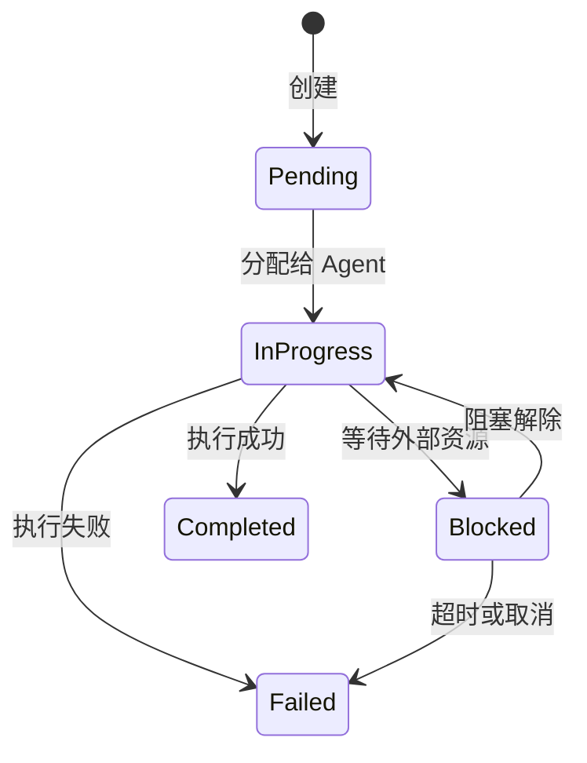

# 第 2 章：octos-core：用类型系统定义领域语言

> **定位**：本章深入 octos 最底层的 crate——octos-core（约 1,800 行），展示如何用 Rust 类型系统构建 AI Agent 平台的领域语言。前置依赖：第 1 章。适用场景：想理解 octos 类型基础的所有读者，尤其是希望通过实战项目学习 Rust 枚举和错误处理设计的读者（读者 A），以及想了解"零依赖 core crate"设计哲学的资深开发者（读者 B）。

如果把 octos 比作一座城市，octos-core 就是它的语言——不是建筑、不是道路，而是居民用来交流的词汇和语法。`Task`、`Message`、`MessageRole`、`Error`——这些类型定义了系统中所有组件如何描述自己的状态和意图。octos 的其他 8 个 crate 都依赖这些类型，但 octos-core 本身不依赖 workspace 中的任何其他 crate。

这个零依赖约束不是偶然的。它是一个刻意的架构决策，确保领域语言的稳定性：当 octos-llm 重构 Provider 实现或 octos-bus 新增频道时，核心类型不需要改变。本章将从 Task 状态机开始，逐个解析这些基础类型的设计，最后讨论这个零依赖策略的工程意义。

---

## 2.1 Task 状态机：用枚举编码合法状态

每个 AI Agent 执行的工作在 octos 中被建模为一个 `Task`。Task 是整个系统的工作单元——从"帮我写一段代码"到"审查这个 diff"，所有用户请求最终都被转化为 Task。

### 2.1.1 Task 结构体

Task 的定义位于 `crates/octos-core/src/task.rs:11-29`：

```rust
pub struct Task {
    pub id: TaskId,                      // UUID v7，自带时间排序
    pub parent_id: Option<TaskId>,       // 子任务层级
    pub status: TaskStatus,              // 当前状态
    pub kind: TaskKind,                  // 任务类型
    pub context: TaskContext,            // 执行上下文
    pub result: Option<TaskResult>,      // 完成后的结果
    pub created_at: DateTime<Utc>,
    pub updated_at: DateTime<Utc>,
}
```

几个值得注意的设计选择：

**`TaskId` 使用 UUID v7 而非 v4**（`crates/octos-core/src/types.rs:14`）。UUID v4 是纯随机的，而 v7 的前 48 位编码了毫秒级时间戳。这意味着 TaskId 天然按创建时间排序——在调试和日志分析中，你可以直接通过 ID 判断任务的先后顺序，无需额外查询 `created_at` 字段。

**`parent_id: Option<TaskId>`** 支持任务层级。当一个复杂任务需要分解为多个子任务时（例如，Pipeline 中的多步骤执行），每个子任务通过 `parent_id` 指向父任务，形成树状结构。

**`result: Option<TaskResult>`** 只在 Task 完成后存在。这利用了 Rust 的 `Option` 类型在编译期强制调用者处理"结果可能不存在"的情况——你无法在未检查的情况下访问一个 Pending 状态 Task 的结果。

### 2.1.2 TaskStatus：编译期防止非法转换

TaskStatus 是一个带数据的枚举（`crates/octos-core/src/task.rs:63-77`）：

```rust
pub enum TaskStatus {
    Pending,
    InProgress { agent_id: AgentId },
    Blocked { reason: String },
    Completed,
    Failed { error: String },
}
```

注意 `InProgress` 变体携带 `agent_id`——这不只是状态标记，还记录了谁在执行这个任务。同样，`Blocked` 携带阻塞原因，`Failed` 携带错误信息。这种"状态 + 上下文数据"的组合是 Rust 枚举相比其他语言的 enum（如 Go 的 `iota` 常量或 Java 的传统 enum）的核心优势。

在 Python 中，你可能会用一个字符串字段 `status: str` 加上几个可选字段 `agent_id: Optional[str]`、`error: Optional[str]` 来表达同样的语义。但这种设计允许非法状态——比如一个 `status="pending"` 但 `agent_id="agent-1"` 的 Task，或者 `status="completed"` 但 `error="something failed"` 的 Task。Rust 的枚举让这些状态在类型层面就不可能存在。

### 2.1.3 状态转换图

Task 的合法状态转换如下：



**图 2-1：Task 状态机。** 每个状态转换对应一个明确的业务事件。注意 Pending 只能转向 InProgress（不能直接跳到 Completed），InProgress 是唯一可以到达 Completed 的路径——这确保了每个完成的任务都经历过执行阶段。

### 2.1.4 TaskKind：五种任务类型

TaskKind 定义了五种工作类型（`crates/octos-core/src/task.rs:79-99`）：

```rust
pub enum TaskKind {
    Plan { goal: String },
    Code { instruction: String, files: Vec<PathBuf> },
    Review { diff: String },
    Test { command: String },
    Custom { name: String, params: serde_json::Value },
}
```

前四种是预定义的常见场景：规划（Plan）、编码（Code）、审查（Review）、测试（Test）。第五种 `Custom` 是扩展点——通过 `name` 标识任务类型，`params` 携带任意 JSON 数据。这种"有限预定义 + 开放扩展"的模式在 octos 中反复出现（详见第 6 章工具系统和第 9 章扩展机制）。

### 2.1.5 TaskContext 与 TaskResult

TaskContext（`crates/octos-core/src/task.rs:102-115`）是任务执行时的环境快照：

```rust
pub struct TaskContext {
    pub working_dir: PathBuf,
    pub git_state: Option<GitState>,      // 分支、未提交变更、HEAD commit
    pub working_memory: Vec<Message>,      // 近期对话轮次
    pub episodic_refs: Vec<EpisodeRef>,    // 过往 episode 引用
    pub files_in_scope: Vec<PathBuf>,
}
```

`working_memory` 和 `episodic_refs` 的区别值得关注：`working_memory` 是当前会话的短期记忆（最近几轮对话），而 `episodic_refs` 是从长期记忆中检索出的相关片段（详见第 4 章）。这种双记忆架构模仿了人类的工作记忆（working memory）和情景记忆（episodic memory）的区分。

TaskResult（`crates/octos-core/src/task.rs:126-138`）记录任务的产出：

```rust
pub struct TaskResult {
    pub success: bool,
    pub output: String,
    pub files_modified: Vec<PathBuf>,
    pub subtasks: Vec<TaskId>,
    pub token_usage: TokenUsage,
}
```

TokenUsage（`crates/octos-core/src/task.rs:141-154`）值得特别关注。它不只追踪 input/output tokens，还包含 `reasoning_tokens`（思维链 token，用于 o1、kimi-k2.5 等推理模型）和 `cache_read_tokens`/`cache_write_tokens`（Provider 缓存命中/写入）。这五个维度让上层可以精确计算成本和优化缓存策略。序列化时，为零的字段会被跳过，避免 JSON 膨胀。

---

## 2.2 Message 与 MessageRole：跨 Provider 的统一抽象

AI Agent 平台需要对接多个 LLM Provider——Anthropic 的 Claude、OpenAI 的 GPT-4、Google 的 Gemini、本地的 Ollama。每个 Provider 的 API 对消息角色的命名和语义略有不同。octos-core 定义了统一的 `Message` 和 `MessageRole` 类型，作为所有 Provider 的公约数。

### 2.2.1 Message 结构体

Message 的定义位于 `crates/octos-core/src/types.rs:55-70`：

```rust
pub struct Message {
    pub role: MessageRole,
    pub content: String,
    pub media: Vec<String>,                         // 图片/音频文件路径
    pub tool_calls: Option<Vec<ToolCall>>,           // LLM 请求的工具调用
    pub tool_call_id: Option<String>,                // 工具响应对应的调用 ID
    pub reasoning_content: Option<String>,           // 思维链内容
    pub timestamp: DateTime<Utc>,
}
```

`media` 字段（`types.rs:61`）支持多模态：当用户发送图片或语音时，文件路径存储在这里，由 octos-llm 在构建 API 请求时转换为对应 Provider 的格式（base64 编码或 URL 引用）。序列化时，空的 `media` 向量会被跳过。

`reasoning_content`（`types.rs:68`）是为推理模型（如 OpenAI o1、Kimi k2.5）设计的——这些模型会先输出一段内部推理过程，然后才给出最终回答。将推理内容与正式回答分离存储，让上层可以选择是否展示思维链。

### 2.2.2 MessageRole：as_str() 与 Display 的双重实现

MessageRole 只有四个变体（`crates/octos-core/src/types.rs:113-120`）：

```rust
pub enum MessageRole {
    System,
    User,
    Assistant,
    Tool,
}
```

关键在于它的两个方法实现。`as_str()`（`types.rs:124-131`）返回 `&'static str`：

```rust
impl MessageRole {
    pub fn as_str(self) -> &'static str {
        match self {
            Self::System => "system",
            Self::User => "user",
            Self::Assistant => "assistant",
            Self::Tool => "tool",
        }
    }
}
```

`Display` trait 实现（`types.rs:134-138`）直接委托给 `as_str()`：

```rust
impl fmt::Display for MessageRole {
    fn fmt(&self, f: &mut fmt::Formatter<'_>) -> fmt::Result {
        f.write_str(self.as_str())
    }
}
```

为什么要同时实现这两个？因为它们服务于不同场景：

- `as_str()` 接受 `self`（按值传递），返回 `&'static str`。这是可行的因为 `MessageRole` 实现了 `Copy` trait——枚举只有四个无数据变体，拷贝成本等同于拷贝一个字节。按值传递用于需要零分配的场景——比如构建 API 请求时设置 JSON 字段值。
- `Display` 用于格式化字符串（`format!()`、`println!()` 等），是 Rust 生态的标准接口。

这种模式确保了跨 Provider 的一致性：无论是发送给 Anthropic 还是 OpenAI，消息角色始终序列化为 `"system"`、`"user"`、`"assistant"`、`"tool"` 这四个小写字符串。各 Provider 的差异（比如 Anthropic 的 system message 是独立字段而非消息数组的一部分）在 octos-llm 中处理，不会泄漏到核心类型层。

### 2.2.3 ToolCall 与元数据扩展

ToolCall（`crates/octos-core/src/types.rs:140-148`）是 LLM 请求调用工具时的数据结构：

```rust
pub struct ToolCall {
    pub id: String,
    pub name: String,
    pub arguments: serde_json::Value,
    pub metadata: Option<serde_json::Value>,
}
```

`metadata` 字段（`types.rs:145`）是为 Provider 特定数据预留的扩展点。例如，Google Gemini 的工具调用会携带 `thought_signature` 字段，用于验证工具调用是否来自模型的推理过程。通过 `Option<Value>` 存储这些异构数据，核心类型无需为每个 Provider 添加特定字段。

### 2.2.4 便捷构造函数

Message 提供了三个便捷构造函数（`types.rs:73-111`）：

```rust
impl Message {
    pub fn user(content: impl Into<String>) -> Self { /* ... */ }
    pub fn assistant(content: impl Into<String>) -> Self { /* ... */ }
    pub fn system(content: impl Into<String>) -> Self { /* ... */ }
}
```

注意参数类型是 `impl Into<String>` 而非 `String` 或 `&str`。这让调用者可以传入 `String`、`&str`、甚至 `Cow<str>`，编译器会自动选择最高效的转换路径。这是 Rust 中常见的 API 设计模式——通过泛型减少调用者的类型转换负担。

---

## 2.3 Error 设计：为什么选 eyre 而不是 anyhow

Rust 生态中有两个主流的错误处理库：`anyhow` 和 `eyre`。它们都提供类型擦除的错误报告（`anyhow::Error` / `eyre::Report`），但 octos 选择了 `eyre`/`color-eyre`。这个选择值得深入分析。

### 2.3.1 octos 的错误类型

octos-core 的 Error 定义在 `crates/octos-core/src/error.rs:10-17`：

```rust
pub struct Error {
    pub kind: ErrorKind,
    pub context: Option<String>,
    pub suggestion: Option<String>,
}
```

这里的关键设计是**三层结构**：`kind` 分类错误类型，`context` 添加执行上下文，`suggestion` 提供可操作的修复建议。

ErrorKind 是一个 15 变体的枚举（`error.rs:20-56`），覆盖了系统中所有错误类别：

```rust
pub enum ErrorKind {
    TaskNotFound(String),
    AgentNotFound(String),
    InvalidStateTransition { from: String, to: String },
    LlmError { provider: String, message: String },
    ApiError { provider: String, status: u16, body: String },
    ToolError { tool: String, message: String },
    ConfigError(String),
    ApiKeyNotSet { provider: String, env_var: String },
    UnknownProvider(String),
    Timeout { operation: String, seconds: u64 },
    ChannelError { channel: String, message: String },
    SessionError(String),
    IoError(std::io::Error),
    SerializationError(String),
    Other(eyre::Report),
}
```

注意最后一个变体 `Other(eyre::Report)`——这里使用了 `eyre::Report` 而非 `anyhow::Error`。

### 2.3.2 eyre vs anyhow：选型理由

`anyhow` 和 `eyre` 的核心 API 几乎相同，但有两个关键差异：

**差异一：自定义错误报告器。** `eyre` 支持通过 `eyre::set_hook()` 安装自定义的错误报告器。`color-eyre` 就是这样一个报告器——它在错误发生时自动捕获 `std::backtrace::Backtrace` 和 `tracing_error::SpanTrace`，并以彩色格式输出。对于一个 CLI 工具来说，当 Agent 执行失败时，开发者能立即看到彩色高亮的错误链和调用栈，这比 anyhow 的纯文本输出提供了更好的调试体验。

**差异二：生态对齐。** octos 的 workspace 依赖声明中同时使用了 `eyre` 和 `color-eyre`（`Cargo.toml:71-72`）。这是因为 `color-eyre` 在 CLI 入口初始化（`main()` 中调用 `color_eyre::install()`），而 `eyre::Report` 作为通用错误类型在整个代码库中使用。如果混用 `anyhow::Error` 和 `eyre::Report`，需要在边界处做转换，增加不必要的复杂度。

### 2.3.3 可操作的错误消息

octos 的错误设计最值得学习的不是库的选择，而是"让错误消息可操作"的理念。看几个便捷构造函数的实现（`error.rs:80-173`）：

```rust
pub fn api_key_not_set(provider: impl Into<String>, env_var: impl Into<String>) -> Self {
    Self {
        kind: ErrorKind::ApiKeyNotSet {
            provider: provider.to_string(),
            env_var: env_var.to_string(),
        },
        context: None,
        suggestion: Some(format!(
            "Set the {} environment variable or configure it in config.json",
            env_var
        )),
    }
}
```

当用户忘记设置 API Key 时，错误消息不只告诉你"key 没设"，还告诉你"设置 `ANTHROPIC_API_KEY` 环境变量，或在 config.json 中配置"。同样，`api_error()` 会根据 HTTP 状态码给出不同的建议——401 提示检查 key，429 提示被限流，504 提示超时。

Display 实现（`error.rs:175-228`）将这三层信息格式化为用户友好的输出，并使用 `truncated_utf8()` 安全截断过长的 API 响应体，避免错误日志中出现巨大的 JSON dump。

---

## 2.4 truncate_utf8：一个小函数背后的 UTF-8 安全哲学

`truncate_utf8` 是 octos-core 中最小但最精巧的函数之一。它只有 10 行代码（`crates/octos-core/src/utils.rs:6-16`），却解决了一个在多语言 AI 应用中极其常见的问题：如何安全地截断可能包含中文、日文、emoji 等多字节字符的字符串。

### 2.4.1 问题：UTF-8 的多字节陷阱

UTF-8 是一种变长编码：ASCII 字符占 1 字节，中文字符占 3 字节，emoji 占 4 字节。当你需要将字符串截断到 N 个字节时，截断点可能正好落在一个多字节字符的中间。

```
"你好世界" 的 UTF-8 编码：
你 = [E4 BD A0]  (3 bytes)
好 = [E5 A5 BD]  (3 bytes)
世 = [E4 B8 96]  (3 bytes)
界 = [E7 95 8C]  (3 bytes)
总计 12 bytes

如果截断到 7 bytes：
[E4 BD A0] [E5 A5 BD] [E4]  ← 最后一个字节是 "世" 的第一个字节
                              这不是一个合法的 UTF-8 序列！
```

在 C/C++ 中，这种截断会产生无效的 UTF-8 字符串，可能导致下游解析崩溃。Python 的 `str[:7]` 按字符而非字节截断，避免了这个问题但无法精确控制字节预算。

### 2.4.2 两个变体：in-place 与 copying

octos 提供了两个截断函数：

**`truncate_utf8`**（`utils.rs:6-16`）——原地截断，修改原字符串：

```rust
pub fn truncate_utf8(s: &mut String, max_len: usize, suffix: &str) {
    if s.len() <= max_len {
        return;
    }
    let mut limit = max_len;
    while limit > 0 && !s.is_char_boundary(limit) {
        limit -= 1;
    }
    s.truncate(limit);
    s.push_str(suffix);
}
```

**`truncated_utf8`**（`utils.rs:21-30`）——返回新字符串，不修改原始数据：

```rust
pub fn truncated_utf8(s: &str, max_len: usize, suffix: &str) -> String {
    if s.len() <= max_len {
        return s.to_string();
    }
    let mut limit = max_len;
    while limit > 0 && !s.is_char_boundary(limit) {
        limit -= 1;
    }
    format!("{}{}", &s[..limit], suffix)
}
```

核心算法相同：从 `max_len` 位置向前回退，直到找到一个合法的 UTF-8 字符边界（`is_char_boundary()`）。截断后追加 suffix。注意这两个函数的 `max_len` 不包含 suffix 的长度——追加 suffix 后最终字符串可能超过 `max_len`。这是有意的设计：`max_len` 控制的是保留内容的上限，suffix 是额外的标记。调用者需要在设置 `max_len` 时预留 suffix 的空间。

两个变体的区别在于所有权语义：
- `truncate_utf8` 接受 `&mut String`，原地修改，零额外分配（除了 suffix 追加）
- `truncated_utf8` 接受 `&str`（不可变引用），返回新 `String`，需要一次堆分配

调用者根据场景选择：如果拥有字符串所有权且不再需要原始内容，用 in-place 版本；如果字符串是借用的（比如来自 API 响应的 `&str`），用 copying 版本。

### 2.4.3 truncate_head_tail：保留首尾的智能截断

对于工具输出和错误消息，仅保留开头往往不够——尾部的错误信息或结论同样重要。`truncate_head_tail`（`utils.rs:37-70`）解决了这个问题：

```rust
pub fn truncate_head_tail(s: &str, max_len: usize, head_ratio: f32) -> String
```

它按 `head_ratio`（默认 0.5，钳位到 [0.1, 0.9]）分配头部和尾部的字节预算，中间用 `\n\n... [N bytes omitted] ...\n\n` 连接。两端的截断点都通过 `is_char_boundary()` 保证 UTF-8 安全。

这个函数在 octos 的多个场景中使用：
- 工具输出截断（Shell 命令的 stdout/stderr）
- 错误消息中的 API 响应体截断（`error.rs`）
- 上下文压缩时的消息摘要（详见第 8 章）

### 2.4.4 tool_output_limit：按工具类型定制的截断策略

`tool_output_limit`（`utils.rs:73-85`）为不同工具设置了不同的字符上限：

| 工具 | 上限 | 理由 |
|------|------|------|
| `read_file` | 50,000 | 源码文件可能很大 |
| `shell`, `grep` | 30,000 | 命令输出通常更精简 |
| `web_fetch` | 40,000 | 网页内容适中 |
| `web_search` | 20,000 | 搜索结果是摘要 |
| `deep_search`, `deep_research`, `spawn` | 50,000 | 深度任务需要更多上下文 |
| 默认 | 50,000 | 安全上限 |

这些限制不是任意的——它们反映了不同工具输出的信息密度差异。搜索结果的信息密度高（每条结果都是有用的摘要），所以 20,000 字符足够；而源码文件的信息分布不均（可能需要看到完整的函数体），所以给 50,000 字符。这些限制与 LLM 的上下文窗口预算配合使用（详见第 8 章上下文管理）。

---

## 2.5 SessionKey：多租户会话标识的设计

SessionKey（`crates/octos-core/src/types.rs:159-236`）是多租户系统中会话路由的关键。它的设计演进反映了从单频道到多频道、从单 Profile 到多 Profile 的需求扩展。

### 2.5.1 格式演变

SessionKey 支持四种格式，向后兼容：

| 格式 | 示例 | 场景 |
|------|------|------|
| `channel:chat_id` | `telegram:12345` | 基础：单 Profile |
| `profile:channel:chat_id` | `work:telegram:12345` | 多 Profile 隔离 |
| `channel:chat_id#topic` | `telegram:12345#research` | 同一会话的多主题 |
| `profile:channel:chat_id#topic` | `work:telegram:12345#research` | 完整形式 |

`base_key()` 方法（`types.rs:195`）返回去掉 `#topic` 后缀的部分，用于会话持久化（同一个 base_key 的不同 topic 共享持久化文件）。`topic()` 方法（`types.rs:200`）提取主题后缀。

### 2.5.2 频道验证

SessionKey 的构造函数通过 `is_valid_channel()`（`types.rs:238-257`）验证频道名称是否在白名单中。这个白名单包含 15 个已知频道，覆盖了 octos 支持的所有集成：

```
api, cli, discord, email, feishu, matrix, qq-bot, slack,
system, telegram, test, twilio, wecom, wecom-bot, whatsapp
```

验证是在构造时进行的（而非使用时），这是 Rust 类型系统的常见模式——"让无效状态不可构造"。一旦你持有一个 `SessionKey`，就可以确信它的频道名是合法的。

---

## 2.6 AgentMessage：Agent 间协调协议

AgentMessage（`crates/octos-core/src/message.rs:10-29`）定义了 Agent 之间的协调协议：

```rust
pub enum AgentMessage {
    TaskAssign { task: Box<Task> },
    TaskUpdate { task_id: TaskId, status: TaskStatus },
    TaskComplete { task_id: TaskId, result: TaskResult },
    ContextRequest { task_id: TaskId, query: String },
    ContextResponse { task_id: TaskId, context: Vec<Message> },
}
```

五种消息类型涵盖了 Agent 协调的核心场景：分配任务、更新状态、完成通知、请求上下文、返回上下文。注意 `TaskAssign` 中的 `Box<Task>`——Task 结构体较大，使用 `Box` 堆分配避免了枚举变体之间的大小不均导致的内存浪费。

`task_id()` 方法（`message.rs:31-42`）返回 `Option<&TaskId>`，为所有变体提供统一的任务 ID 访问接口。调用者无需对每个变体做模式匹配就能获取关联的任务 ID——只需处理 `Option` 即可。

---

## 2.7 abort：多语言中断检测

一个有趣的小模块：`abort.rs` 实现了多语言的 Agent 中断检测。当用户在 Agent 执行过程中发送"停"、"stop"、"やめて"、"стоп"等中断信号时，系统需要立即识别并终止当前操作。

`ABORT_TRIGGERS` 数组（`abort.rs:32-71`）包含 9 种语言、30 个触发词。`is_abort_trigger()`（`abort.rs:6-13`）对输入进行 trim + lowercase 后精确匹配。`abort_response()`（`abort.rs:15-30`）返回与触发语言匹配的本地化取消确认。

值得注意的是**故意排除的词**：代码注释中记录了 "wait"、"exit"、"para" 等被排除的词——它们在正常对话中出现频率太高，会导致误判。这是一个务实的设计选择：宁可漏掉一些中断信号（用户可以再说一次），也不要在正常对话中误触发中断。

---

> ### 工程决策侧栏：为什么 core crate 零内部依赖
>
> octos-core 是 workspace 中唯一没有依赖其他 octos crate 的基础 crate（octos-plugin 和 octos-sandbox 也无内部依赖，但它们不被其他 crate 依赖）。这个"零内部依赖"约束是刻意的设计选择。
>
> **方案一：胖 core（把更多逻辑下沉到 core）**
>
> 优势：
> - 所有公共逻辑集中在一处，减少 crate 间的重复
> - 下游 crate 只需依赖 core 就能获得大部分能力
>
> 劣势：
> - core 的编译时间随功能膨胀而增加，影响所有依赖它的 crate 的增量编译速度
> - core 的变更频率增加，每次修改都触发全 workspace 重编译
> - 不相关的功能被耦合——修改 LLM 相关逻辑可能影响 Task 类型
>
> **方案二：瘦 core（只放类型定义和最基础的工具函数）**
>
> 优势：
> - 极少变更，提供稳定的类型基础
> - 编译快速（octos-core 仅 1,793 行）
> - 依赖图清晰：所有 crate 依赖 core 的类型，但 core 不依赖任何人
>
> 劣势：
> - 跨 crate 共享的逻辑需要放在其他地方（比如 octos-agent 中的工具函数）
> - 可能出现"本应在 core 中"的类型被定义在上层 crate 的情况
>
> **octos 的选择：瘦 core，理由如下。**
>
> octos-core 的外部依赖仅限于 `serde`、`serde_json`、`chrono`、`uuid`、`eyre` 这几个基础库——都是序列化、时间和错误处理的行业标准。这意味着 octos-core 的编译时间极短，而所有依赖它的 crate（octos-llm、octos-memory、octos-agent、octos-bus、octos-pipeline、octos-cli）都能从这个快速编译中获益。
>
> 更重要的是稳定性保证。在 octos 的开发历程中，octos-llm 经历了多次 Provider 重构，octos-agent 的工具系统不断扩展，octos-bus 新增了多个频道——但 octos-core 的核心类型（Task、Message、Error）保持了高度稳定。瘦 core 策略使得这种稳定性成为可能。

---

## 2.8 本章回顾

octos-core 用 1,793 行代码定义了整个系统的领域语言：

1. **Task 状态机**：用 Rust 枚举编码合法状态和转换，在类型层面消除非法状态组合。UUID v7 提供时间排序，五维 TokenUsage 支持精细的成本追踪。

2. **Message 抽象**：四角色统一模型（System/User/Assistant/Tool）+ `as_str()`/`Display` 双重实现，确保跨 Provider 的序列化一致性。`metadata` 扩展点容纳 Provider 特定数据。

3. **Error 设计**：选择 eyre/color-eyre 获取彩色错误报告和 SpanTrace 支持。三层结构（kind + context + suggestion）让错误消息可操作。

4. **UTF-8 安全工具**：`truncate_utf8` 的两个变体（in-place 和 copying）通过 `is_char_boundary()` 保证截断安全。`truncate_head_tail` 保留首尾信息。

5. **零依赖设计**：瘦 core 策略确保类型基础稳定、编译快速，支撑上层 crate 的独立演进。

下一章，我们将进入 octos-llm，看看这些核心类型如何被用来驯服多个 LLM Provider 的混乱接口。

---

## 延伸阅读

- **Rust 枚举与模式匹配**：*The Rust Programming Language* 第 6 章 "Enums and Pattern Matching"，https://doc.rust-lang.org/book/ch06-00-enums.html
- **eyre 错误处理**：eyre crate 文档，https://docs.rs/eyre/latest/eyre/
- **color-eyre**：color-eyre crate 文档，https://docs.rs/color-eyre/latest/color_eyre/
- **UUID v7 规范**：RFC 9562 "Universally Unique IDentifiers (UUIDs)"，Section 5.7
- **UTF-8 编码**：*The Unicode Standard* Chapter 3 "Conformance"——理解 UTF-8 变长编码对安全截断至关重要

## 思考题

1. **状态机扩展**：如果要为 Task 添加一个 `Cancelled` 状态（用户主动取消），它应该从哪些状态可达？添加这个状态会对现有的 `match` 表达式产生什么影响？

2. **胖 core vs 瘦 core**：假设 octos-core 把 `LlmProvider` trait 也放进来（因为所有上层 crate 都需要它），会带来什么问题？提示：考虑 `async-trait`、`reqwest` 等依赖的传递效应。

3. **错误设计权衡**：octos 的 `ErrorKind` 有 15 个变体。如果系统继续增长到 50 个变体，这种设计会遇到什么问题？你会如何重构？

4. **截断策略的替代方案**：`truncate_utf8` 按字节截断并回退到字符边界。另一种方案是按 Unicode 字素簇（grapheme cluster）截断。两种方案在处理 emoji 组合序列（如 👨‍👩‍👧‍👦）时有什么区别？哪种更适合 LLM 上下文管理场景？

---

> **版本演化说明**
> 本章分析基于 octos v0.1.0，octos-core crate 位于 `crates/octos-core/src/`。截至本书写作时，核心类型（Task、Message、Error）的结构无重大变化。TokenUsage 在后续版本中可能新增追踪维度（如 reasoning_tokens 的细分）。
