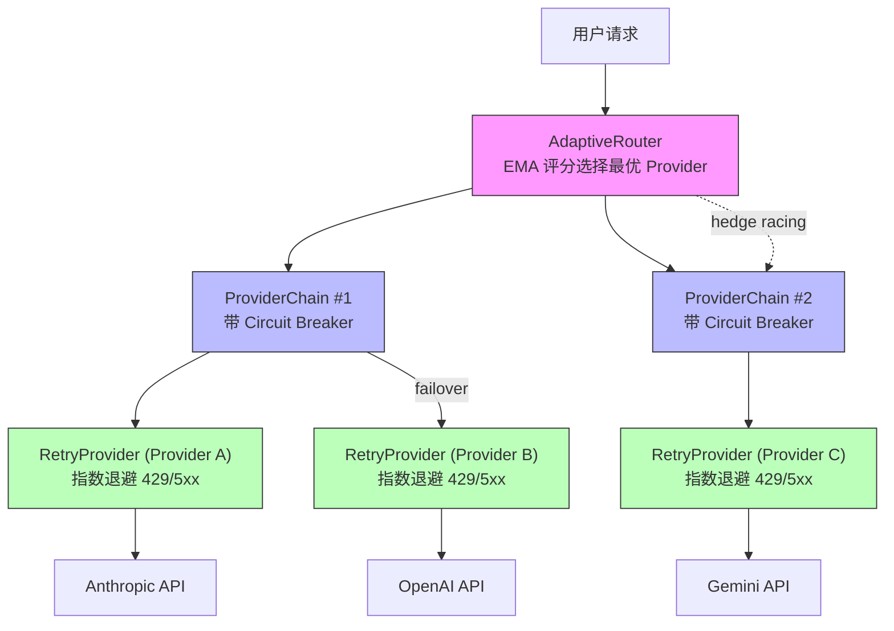

# 第 3 章：octos-llm：驯服 LLM Provider 的混乱

> **定位**：本章深入 octos-llm crate（约 15,700 行），展示如何用 Rust trait 抽象统一多种 LLM Provider 的混乱接口，以及如何构建三层容错链实现生产级可靠性。前置依赖：第 2 章。适用场景：想理解多 Provider 架构设计的 AI 应用开发者（读者 C），以及对 trait object 和异步容错模式感兴趣的 Rust 开发者（读者 B）。

每个 LLM Provider 都有自己的 API 风格：Anthropic 把 system message 作为独立字段，OpenAI 把它放在消息数组里；Gemini 的工具调用格式与其他两家完全不同；Ollama 是本地部署，延迟特征和错误模式截然不同。当你需要支持 4 种原生协议和 10+ 种 OpenAI 兼容 Provider 时，混乱是不可避免的——除非你在正确的层次建立正确的抽象。

octos-llm 的解决方案分三层：底层的 `LlmProvider` trait 统一调用接口，中层的 Provider 注册表实现模型名自动检测和工厂创建，顶层的三级容错链（RetryProvider → ProviderChain → AdaptiveRouter）提供生产级可靠性。本章将自底向上逐层展开。

---

## 3.1 LlmProvider trait：最小化的统一接口

### 3.1.1 trait 签名

`LlmProvider` 的定义位于 `crates/octos-llm/src/provider.rs:11-81`：

```rust
#[async_trait]
pub trait LlmProvider: Send + Sync {
    // 核心方法：非流式对话
    async fn chat(
        &self,
        messages: &[Message],
        tools: &[ToolSpec],
        config: &ChatConfig,
    ) -> Result<ChatResponse>;

    // 流式对话（有默认实现）
    async fn chat_stream(
        &self,
        messages: &[Message],
        tools: &[ToolSpec],
        config: &ChatConfig,
    ) -> Result<ChatStream>;

    // 元数据查询
    fn context_window(&self) -> u32;
    fn max_output_tokens(&self) -> u32;
    fn model_id(&self) -> &str;
    fn provider_name(&self) -> &str;

    // 可选：指标上报
    fn export_metrics(&self) -> Option<serde_json::Value> { None }
    fn report_late_failure(&self) {}
    fn report_stream_metrics(&self, _output_tokens: u32, _stream_duration_us: u64) {}
}
```

这个 trait 的设计遵循了"最小必要接口"原则（`provider.rs:13` 的注释明确说明了这一点）：只定义所有 Provider 共同的能力，差异在各实现中处理。

几个值得关注的设计选择：

**`Send + Sync` 约束。** trait 要求实现者是线程安全的，因为 Provider 实例会被多个异步任务通过 `Arc` 共享。这个约束在编译期保证了不会出现单线程 Provider 实现被意外用在多线程场景的错误。

**`chat_stream()` 的默认实现。** 不是所有 Provider 都原生支持流式响应。默认实现（`provider.rs:32-49`）调用非流式的 `chat()` 方法，然后将完整响应包装为一个单事件的合成流。这让新 Provider 只需实现 `chat()` 就能基本工作，流式支持可以后续优化。

**指标上报方法。** `export_metrics()`、`report_late_failure()`、`report_stream_metrics()` 三个方法都有空的默认实现。它们为 AdaptiveRouter 的 EMA 评分系统提供数据源（见 3.4 节），但不强制所有 Provider 实现。这种"可选钩子"模式避免了 trait 膨胀。

### 3.1.2 核心数据类型

`ChatConfig`（`crates/octos-llm/src/config.rs`）封装了所有可调参数：

- `model`: 模型 ID
- `temperature`: 采样温度
- `max_tokens`: 最大输出 token 数
- `system_prompt`: 系统提示
- `response_format`: 响应格式约束（文本/JSON/结构化输出）
- `tool_choice`: 工具选择策略（auto/required/none/指定工具）

`ChatResponse` 包含 LLM 返回的完整信息：内容、stop reason、工具调用请求、token 使用量。`ChatStream` 是一个异步流（`Pin<Box<dyn Stream<Item = Result<StreamEvent>>>>`），逐事件产出流式响应。

---

## 3.2 Provider 注册表：模型名自动检测

当用户配置 `model: "claude-sonnet-4"` 时，octos 需要自动确定使用 Anthropic Provider。这个映射由 Provider 注册表实现（`crates/octos-llm/src/registry/mod.rs`）。

### 3.2.1 检测机制

每个 Provider 注册时声明自己的检测模式（`registry/mod.rs:80`）：

```rust
struct ProviderEntry {
    name: &'static str,
    detect_patterns: &'static [&'static str],
    // ...
}
```

`detect_provider()` 方法（`registry/mod.rs:131-150`）按优先级顺序遍历所有 Provider，检查模型名是否包含检测模式：

| Provider | 检测模式 | 匹配示例 |
|----------|---------|---------|
| Anthropic | `"claude"` | claude-sonnet-4, claude-haiku-4-5 |
| OpenAI | `"gpt"`, `"chatgpt"` | gpt-4o, gpt-4-turbo |
| Gemini | `"gemini"` | gemini-2.5-flash, gemini-2.5-pro |
| DeepSeek | `"deepseek"` | deepseek-chat, deepseek-coder |
| Groq | `"groq"` | groq-llama-3 |
| Ollama | `"ollama"` | ollama-llama3 |
| OpenRouter | `"openrouter"` | openrouter/meta-llama |

**特殊处理：O 系列模型。** OpenAI 的 o1、o3、o4 系列需要前缀匹配而非子串匹配（`registry/mod.rs:137-140`），因为 "o1" 作为子串可能匹配到其他 Provider 的模型名中（如 `ro1and` 假设模型名）。

### 3.2.2 完整 Provider 注册表

octos 支持 15+ 个 Provider，按优先级排序检测（`registry/mod.rs:89-105`）：

| 优先级 | Provider | 协议 | 检测模式 | 示例模型 |
|--------|---------|------|---------|---------|
| 1 | Anthropic | 原生 | `claude` | claude-sonnet-4, claude-haiku-4-5 |
| 2 | OpenAI | 原生 | `gpt`, `chatgpt`, `o1`/`o3`/`o4`(前缀) | gpt-4o, o4-mini |
| 3 | Gemini | 原生 | `gemini` | gemini-2.5-flash, gemini-2.5-pro |
| 4 | R9s (Azure) | OpenAI 兼容 | `r9s` | r9s-gpt-4 |
| 5 | OpenRouter | 元路由 | `openrouter` | openrouter/meta-llama |
| 6 | DeepSeek | OpenAI 兼容 | `deepseek` | deepseek-chat |
| 7 | Groq | OpenAI 兼容 | `groq` | groq-llama-3 |
| 8 | Moonshot | OpenAI 兼容 | `moonshot` | moonshot-v1 |
| 9 | Dashscope | OpenAI 兼容 | `dashscope`, `qwen` | qwen-max |
| 10 | Minimax | OpenAI 兼容 | `minimax` | minimax-abab6 |
| 11 | Zhipu | OpenAI 兼容 | `zhipu`, `glm` | glm-4 |
| 12 | Zai | OpenAI 兼容 | `zai` | zai-llama |
| 13 | NVIDIA | OpenAI 兼容 | `nvidia` | nvidia/llama-3 |
| 14 | Ollama | OpenAI 兼容 | `ollama` | ollama-llama3 |
| 15 | vLLM | OpenAI 兼容 | `vllm` | vllm-mistral |

4 种原生协议（Anthropic、OpenAI、Gemini、Ollama），其余 10+ 种通过 OpenAI 兼容 API 接入（只需不同的 base_url 和认证方式）。这种"4 原生 + N 兼容"架构让新 Provider 的接入成本极低——大多数情况只需在注册表中添加一个条目。

### 3.2.3 Provider 工厂

检测到 Provider 后，注册表通过工厂函数创建具体实例。每个工厂函数读取对应的环境变量（`ANTHROPIC_API_KEY`、`OPENAI_API_KEY` 等）或配置文件中的凭据，构造带有正确 base URL 和认证头的 HTTP 客户端。

工厂返回的类型是 `Arc<dyn LlmProvider>`——这是动态分发的关键点。注册表不知道（也不需要知道）具体的 Provider 类型，只知道它实现了 `LlmProvider` trait。这让上层代码可以用统一的方式处理所有 Provider，包括将它们放入容错链中。

---

## 3.3 三层容错链

生产环境中，LLM API 调用可能因为多种原因失败：速率限制（429）、服务器过载（503/529）、认证失效（401）、网络超时。octos-llm 用三层容错链处理这些故障，每一层解决不同级别的问题。



**图 3-1：三层容错链架构。** 请求从 AdaptiveRouter 进入，经 ProviderChain 路由到具体 Provider，每个 Provider 包裹在 RetryProvider 中处理瞬时故障。

### 3.3.1 第一层：RetryProvider — 指数退避

RetryProvider（`crates/octos-llm/src/retry.rs:40-226`）处理单个 Provider 的瞬时故障。

**退避算法**（`retry.rs:149-154`）：

```rust
fn calculate_delay(&self, attempt: u32) -> Duration {
    let delay = self.config.initial_delay.as_secs_f64()
        * self.config.backoff_multiplier.powi(attempt as i32);
    let delay = Duration::from_secs_f64(delay);
    std::cmp::min(delay, self.config.max_delay)
}
```

默认配置（`retry.rs:28-37`）：最多重试 3 次，初始延迟 1 秒，退避乘数 2.0，最大延迟 60 秒。实际退避序列为 1s → 2s → 4s → 8s（但被 60s 上限钳位）。

**哪些错误可重试？**（`retry.rs:107-147`）

| HTTP 状态码 | 含义 | 是否重试 | 是否触发 failover |
|------------|------|---------|-----------------|
| 429 | 速率限制 | 是（解析 retry-after） | 是 |
| 500, 502, 503 | 服务器错误 | 是 | 是 |
| 529 | 过载 | 是 | 是 |
| 401, 403 | 认证错误 | 否 | 是（立即 failover） |
| 504 | Gateway 超时 | 是（服务器可能恢复） | 是 |
| 408 | 请求超时 | 看具体情况 | 是 |
| reqwest timeout | 网络超时 | 否（本地不重试） | 是（立即 failover） |
| 400 | 请求错误 | 看具体消息 | 部分情况 |

注意 reqwest 级别的网络超时（连接超时、读超时）的特殊处理：不在本地重试（因为同一个 Provider 大概率还是超时），而是立即向上层触发 failover，让 ProviderChain 切换到另一个 Provider。HTTP 504（Gateway Timeout）则被视为可重试——服务器可能在短暂过载后恢复。

**速率限制解析**（`retry.rs:159-185`）：当收到 429 响应时，RetryProvider 会尝试从错误消息中解析推荐的等待时间（如 "Please try again in 29.159s"），加上 1 秒缓冲后等待。如果无法解析，回退到 30 秒固定等待。

### 3.3.2 第二层：ProviderChain — 有序故障转移

ProviderChain（`crates/octos-llm/src/failover.rs:36-249`）管理一组 Provider 的故障转移顺序。

**Circuit Breaker 设计**（`failover.rs:23-26`）：

```rust
struct ProviderSlot {
    provider: Arc<dyn LlmProvider>,
    failures: AtomicU32,  // 连续失败计数器
}
```

每个 Provider 维护一个原子计数器记录连续失败次数。当失败次数达到阈值（默认 3），该 Provider 被标记为"降级"（degraded）。成功调用后计数器重置为 0（`failover.rs:104`）。

**故障转移逻辑**（`failover.rs:85-99`）：

1. 首先尝试第一个未降级的 Provider
2. 如果所有 Provider 都降级了，选择失败次数最少的那个
3. 跳过已降级的 Provider，除非它是最后的选择

**延迟故障上报**（`failover.rs:245-248`）：`report_late_failure()` 处理一种微妙的场景——Provider 返回了 200 响应，但流式解析后发现内容为空或格式错误。这时需要回溯性地惩罚该 Provider，增加其失败计数，让后续请求优先选择其他 Provider。

### 3.3.3 第三层：AdaptiveRouter — EMA 评分与对冲竞赛

AdaptiveRouter（`crates/octos-llm/src/adaptive.rs:470-1200+`）是容错链的最高层，实现了智能路由。

**三种模式**（`adaptive.rs:416-449`）：

- **Off (0)**：静态优先级排序 + circuit breaker，最简单可靠
- **Hedge (1)**：基于评分选择 + 对冲竞赛（hedge racing）
- **Lane (2)**：基于评分的车道切换，比 hedge 更节省成本

#### EMA 评分系统

AdaptiveRouter 为每个 Provider 维护一个实时评分，基于四个因子的加权组合（`adaptive.rs:886-951`）：

| 因子 | 权重 | 含义 | 数据来源 |
|------|------|------|---------|
| 稳定性 (error_rate) | 30% | 错误率 | 实时统计 + 目录基线混合 |
| 质量 (latency) | 30% | 输出质量 | 60% 深度搜索 token 数 + 40% 吞吐量 |
| 优先级 (priority) | 20% | 配置顺序 | 用户配置 |
| 成本 (cost) | 20% | 价格 | 模型目录 |

**混合权重设计**（`adaptive.rs:886-920`）：稳定性因子使用"目录基线 + 实时数据"的混合计算。混合权重按调用次数递增：`min(total_calls / 20.0, 0.5)`，这意味着目录基线始终至少占 50% 的影响力。这个设计防止了"冷启动"问题——新 Provider 只有少量调用时，不会因为一两次偶然失败就被判为不可靠。

#### 对冲竞赛（Hedge Racing）

在 Hedge 模式下，AdaptiveRouter 会同时向两个 Provider 发起请求，取先返回的结果（`adaptive.rs:1059-1158`）：

```rust
// 简化后的逻辑
tokio::select! {
    result = primary_future => {
        // 主 Provider 先返回
        // 备选 Provider 的 future 被 drop（取消）
        result
    }
    result = alternate_future => {
        // 备选 Provider 先返回
        // 主 Provider 的 future 被 drop（取消）
        result
    }
}
```

备选 Provider 的选择（`adaptive.rs:1086-1105`）优先选最便宜的（减少冗余成本），且必须与主 Provider 不同名（避免向同一 API 发重复请求）。

对冲竞赛的代价是双倍的 API 调用成本（输掉竞赛的请求仍然消耗 token，即使被取消，Provider 通常已经开始处理）。因此 Hedge 模式适用于延迟敏感、成本不敏感的场景。Lane 模式则通过评分排序实现类似的路由优化，但不发送冗余请求。

#### 探针策略（Probe）

为了保持备用 Provider 的评分数据新鲜，AdaptiveRouter 以一定概率（默认 10%）向非最优 Provider 发送"探针"请求（`adaptive.rs:1013-1028`），刷新其性能指标。探针间隔默认 60 秒，避免频繁探测带来的成本。

---

## 3.4 SSE 流式解析：字节安全的有状态解析器

LLM 的流式响应以 Server-Sent Events（SSE）协议传输。SSE 看似简单——每个事件以 `\n\n` 分隔，每行以 `data:` 前缀标记数据——但在生产环境中，有几个工程挑战需要解决。

### 3.4.1 为什么需要有状态解析

HTTP 响应的 body 以任意大小的字节块（chunk）到达。一个 SSE 事件可能跨越多个 chunk，一个 chunk 也可能包含多个事件。更微妙的是，chunk 的边界可能正好切开一个 UTF-8 多字节字符。

考虑以下场景：

```
Chunk 1: data: {"text": "任务完
Chunk 2: 成后请检查结果"}\n\n
```

"完" 和 "成" 之间不会有问题（它们各自是完整的 UTF-8 字符），但如果 chunk 边界恰好落在"完"字的三个字节中间：

```
Chunk 1: data: {"text": "任务\xe5\xae
Chunk 2: \x8c成后请检查结果"}\n\n
```

此时 Chunk 1 末尾的 `\xe5\xae` 是"完"字的前两个字节，不是合法的 UTF-8。如果逐 chunk 做 `String::from_utf8()`，就会得到一个解析错误或替换字符（U+FFFD）。

### 3.4.2 octos 的字节安全解析器

octos-llm 的 SSE 解析器（`crates/octos-llm/src/sse.rs:21-72`）采用字节级缓冲策略：

1. **原始字节累积**：将每个 chunk 的原始字节追加到 `Vec<u8>` 缓冲区，不做 UTF-8 转换
2. **事件边界检测**：在原始字节中搜索 `\n\n` 或 `\r\n\r\n` 分隔符
3. **按事件转换**：找到完整事件后，才将该事件的字节块转换为 UTF-8 字符串
4. **剩余字节保留**：未形成完整事件的尾部字节保留在缓冲区中

这种设计保证了 UTF-8 转换只发生在完整事件上——SSE 协议保证事件边界不会落在 UTF-8 字符中间（因为 `\n` 是 ASCII 单字节字符）。

解析器使用 `stream::unfold()` 构建为一个异步流，保持状态（字节流 + 缓冲区）在 yield 事件之间传递。

### 3.4.3 1MB 缓冲上限

安全考量：如果恶意或异常的 LLM Provider 发送一个永远不包含 `\n\n` 的超长响应，缓冲区会无限增长。`MAX_BUFFER_SIZE`（`sse.rs:6-7`）设为 1MB，超过后解析器发出错误事件并清空缓冲区。

```rust
const MAX_BUFFER_SIZE: usize = 1024 * 1024; // 1MB
```

1MB 对于单个 SSE 事件来说绰绰有余——正常的 LLM 流式响应中，每个事件通常只有几十到几百字节（一个 token 的 JSON 表示）。

### 3.4.4 UTF-8 分割测试：为什么字节级缓冲不可省略

`sse.rs` 的测试（`sse.rs:261-281`）构造了一个精确的多字节分割场景：

```
"完成后" 的 UTF-8 编码：
完 = [E5 AE 8C]   (3 bytes)
成 = [E6 88 90]   (3 bytes)
后 = [E5 90 8E]   (3 bytes)

故意在"成"字中间切开：
Chunk 1: data: {"text": "完[E6 88          ← "成"的前 2 字节
Chunk 2: 90]后"}\n\n                       ← "成"的第 3 字节 + "后"
```

如果逐 chunk 做 `String::from_utf8()`，Chunk 1 末尾的 `[E6 88]` 不是合法 UTF-8——会被替换为 `U+FFFD`（替换字符），"成"字永久丢失。

字节级缓冲策略避免了这个问题：两个 chunk 的原始字节被拼接后，在 `\n\n` 边界整体转换，"完成后" 被正确重组。

这不是一个理论风险——当 LLM 流式输出中文回复时，每个 SSE 事件通常只包含 1-3 个 token。HTTP 的 chunked transfer encoding 可能在任何字节位置切割，与 token 边界无关。对于一个服务中文、日文、韩文用户的 Agent 平台，字节级缓冲是**必需的**而非优化。

---

## 3.5 模型目录与成本追踪

ModelCatalog（`crates/octos-llm/src/catalog.rs:48-275`）为每个已知模型维护元数据：

```rust
pub struct ModelInfo {
    pub id: String,
    pub name: String,
    pub provider: String,
    pub context_window: u32,
    pub capabilities: ModelCapabilities,  // vision, tool_use, streaming, reasoning
    pub cost: ModelCost,                  // input/output/cache 每百万 token 价格
    pub aliases: Vec<String>,
}
```

**别名系统**：除了完整的模型 ID（如 `claude-sonnet-4-20250514`），目录还支持别名查找（如 `sonnet` → `claude-sonnet-4-20250514`）。查找顺序（`catalog.rs:72-74`）：精确 ID 匹配 → 别名匹配 → None。

**成本追踪**：`ModelCost` 记录输入、输出、缓存读取三种 token 类型的百万 token 价格。AdaptiveRouter 的评分系统使用这些数据计算成本因子（见 3.3.3 节），在延迟和成本之间做权衡。

---

> ### 工程决策侧栏：Arc\<dyn Trait\> vs 泛型 vs 枚举分发
>
> octos-llm 在 Provider 抽象层大量使用 `Arc<dyn LlmProvider>`。这个选择值得与两种替代方案对比。
>
> **方案一：泛型（`impl LlmProvider` / `T: LlmProvider`）**
>
> 优势：
> - 零运行时开销——编译器在每个调用点生成特化代码（单态化）
> - 方法调用可被内联优化
>
> 劣势：
> - RetryProvider、ProviderChain 等包装器需要泛型参数传染：`RetryProvider<T: LlmProvider>`
> - 容错链的组合会产生类型爆炸：`AdaptiveRouter<ProviderChain<RetryProvider<AnthropicProvider>>, ProviderChain<RetryProvider<OpenAIProvider>>>`
> - 无法在运行时基于用户配置动态选择 Provider——泛型在编译期就确定了具体类型
>
> **方案二：枚举分发（`enum Provider { Anthropic(...), OpenAI(...), ... }`）**
>
> 优势：
> - 编译期确定所有变体，分支预测更友好
> - 无 vtable 间接调用开销
>
> 劣势：
> - 每增加一个 Provider 就需要修改枚举定义和所有 match 表达式
> - 对于 15+ 个 Provider，match 块会非常庞大
> - 无法支持用户自定义 Provider（除非用 `Custom` 变体退化回 trait object）
>
> **octos 的选择：`Arc<dyn LlmProvider>`，原因如下。**
>
> 在 AI Agent 场景中，LLM 调用的网络延迟（100ms-10s）远大于 vtable 间接调用的开销（<1ns）。动态分发的性能代价在这里完全可以忽略。
>
> 更重要的是组合性。octos 的容错链本质上是装饰器模式的嵌套组合：RetryProvider 包装任意 Provider，ProviderChain 管理一组 Provider，AdaptiveRouter 在多个 Chain 之间路由。`Arc<dyn LlmProvider>` 让这些包装器可以自由组合，不受泛型参数的限制。
>
> 最后，Provider 的种类在运行时才确定——用户通过配置文件指定使用哪些 Provider，注册表工厂根据配置动态创建实例。这种"运行时多态"正是 trait object 的核心使用场景。

---

## 3.6 本章回顾

octos-llm 用 15,728 行代码解决了 LLM Provider 集成的核心挑战：

1. **LlmProvider trait**：最小化的统一接口，`chat()` + `chat_stream()` 双方法设计，`Send + Sync` 约束保证线程安全。默认实现让新 Provider 快速接入。

2. **Provider 注册表**：模型名子串匹配自动检测 Provider，工厂模式动态创建 `Arc<dyn LlmProvider>` 实例。特殊处理 O 系列模型的前缀匹配。

3. **三层容错链**：
   - RetryProvider：指数退避（1s→2s→4s），智能解析 429 响应的 retry-after 头
   - ProviderChain：有序故障转移 + circuit breaker（3 次连续失败触发降级）
   - AdaptiveRouter：四因子 EMA 评分（稳定性 30% + 质量 30% + 优先级 20% + 成本 20%）+ 对冲竞赛 + 探针策略

4. **SSE 流式解析**：字节级缓冲避免 UTF-8 分割问题，1MB 上限防止内存耗尽，`stream::unfold()` 构建有状态异步流。

5. **`Arc<dyn Trait>` 选择**：网络延迟远大于 vtable 开销，动态分发换来的组合性和运行时灵活性物超所值。

下一章将进入 octos-memory，看看混合搜索（BM25 + HNSW 向量索引）如何为 Agent 提供长期记忆能力。

---

## 延伸阅读

- **async-trait crate**：https://docs.rs/async-trait/latest/async_trait/ — 了解 `#[async_trait]` 宏如何将 async 方法编译为 trait object 兼容的形式
- **SSE 协议规范**：HTML Living Standard "Server-Sent Events" 章节，https://html.spec.whatwg.org/multipage/server-sent-events.html
- **指数退避算法**：Google Cloud 的 "Truncated exponential backoff" 文档，https://cloud.google.com/storage/docs/exponential-backoff
- **Circuit Breaker 模式**：Martin Fowler, "CircuitBreaker"，https://martinfowler.com/bliki/CircuitBreaker.html
- **Rust 动态分发**：*The Rust Programming Language* 第 17 章 "Using Trait Objects That Allow for Values of Different Types"

## 思考题

1. **容错层次设计**：octos 的三层容错链中，如果把 RetryProvider 和 ProviderChain 合并为一层会怎样？分离的好处是什么？

2. **对冲竞赛的成本模型**：假设你有两个 Provider：Provider A 价格 $10/M tokens、平均延迟 500ms；Provider B 价格 $3/M tokens、平均延迟 1500ms。在什么条件下开启 hedge racing 是划算的？

3. **SSE 解析器的替代方案**：如果不用字节级缓冲，而是用 `String::from_utf8_lossy()` 处理每个 chunk，会产生什么问题？在什么场景下这些问题会变得可观测？

4. **泛型 vs trait object 的边界**：如果 octos 只需要支持 3 个 Provider（Anthropic、OpenAI、Gemini），枚举分发是否是更好的选择？支持多少个 Provider 时动态分发才开始胜出？

---

> **版本演化说明**
> 本章分析基于 octos v0.1.0，octos-llm crate 位于 `crates/octos-llm/src/`。截至本书写作时，Provider 注册表的检测模式和 AdaptiveRouter 的评分权重可能随新 Provider 的加入而调整，但三层容错架构本身无重大变化。
