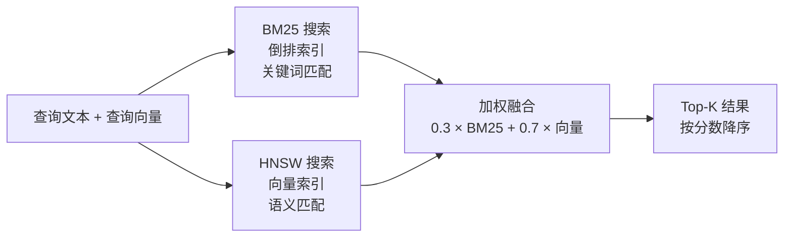

# 第 4 章：octos-memory：混合搜索的工程实现

> **定位**：本章深入 octos-memory crate（约 1,750 行），展示如何用纯 Rust 构建嵌入式 BM25 + HNSW 混合搜索引擎，为 Agent 提供长期记忆能力。前置依赖：第 2 章。适用场景：想理解 RAG（检索增强生成）底层实现的 AI 应用开发者（读者 C），以及对嵌入式数据库和搜索算法感兴趣的 Rust 开发者（读者 B）。

AI Agent 和 chatbot 的根本区别之一在于记忆。chatbot 的每次对话都是独立的——上一次帮你写的代码、做过的决策、踩过的坑，下一次全部忘记。Agent 需要记忆来积累经验：上次用户偏好什么代码风格？这个仓库最近修改了哪些文件？三天前解决一个类似 bug 时采取了什么策略？

octos-memory 用 1,750 行代码实现了这个记忆系统。它不依赖任何外部服务——没有 Qdrant，没有 Milvus，没有 PostgreSQL。一个 redb 嵌入式数据库文件加一个内存中的混合搜索索引，就是全部。本章将从存储层开始，逐步深入 BM25 全文搜索、HNSW 向量索引和混合排名融合的工程实现。

---

## 4.1 存储选型：redb 嵌入式数据库

### 4.1.1 为什么是 redb

octos-memory 的持久化层使用 redb（`crates/octos-memory/src/store.rs`），一个纯 Rust 实现的嵌入式键值数据库。在选型时，最直接的替代方案是 SQLite——Rust 生态中有成熟的 `rusqlite` 绑定。

redb 相比 SQLite 的优势在 octos 的场景中非常明确：

**零 C 依赖。** SQLite 是 C 实现的，`rusqlite` 需要编译 C 代码或链接系统库。这与 octos workspace 级别的 `deny(unsafe_code)` 策略冲突——虽然 SQLite 的 C 代码质量极高，但它不受 Rust 编译器的安全检查。redb 是纯 Rust 实现，完全在 `deny(unsafe_code)` 的保护范围内。

**ACID 事务。** redb 提供完整的 ACID 事务支持（读事务和写事务分离），足以满足 episode 存储的持久化需求。octos 不需要 SQL 查询——所有搜索都在内存中的混合索引上进行。

**单文件部署。** redb 数据库是一个文件（`episodes.redb`），不需要额外的 WAL 文件或 SHM 文件。这简化了部署和备份。

### 4.1.2 三张表结构

Episode Store 在 redb 中定义了三张表（`store.rs:14-20`）：

| 表名 | Key 类型 | Value 类型 | 用途 |
|------|---------|-----------|------|
| `EPISODES_TABLE` | `&str` (episode_id) | `&str` (JSON) | Episode 元数据 |
| `CWD_INDEX_TABLE` | `&str` (工作目录路径) | `&str` (JSON 数组) | 目录→Episode 索引 |
| `EMBEDDINGS_TABLE` | `&str` (episode_id) | `&[u8]` (bincode) | 向量嵌入 |

这个设计把 Episode 数据和向量嵌入分开存储。好处是当不需要向量搜索时（比如 embedding provider 不可用），Episode 的存取不受影响。向量嵌入使用 `bincode` 序列化（比 JSON 紧凑得多），减少存储和 I/O 开销。

`CWD_INDEX_TABLE` 是一个辅助索引，按工作目录聚合 Episode ID。当 Agent 在某个项目目录下工作时，优先检索该目录下的历史 episode，提高相关性。

---

## 4.2 Episode：Agent 的经验记录

### 4.2.1 Episode 结构体

Episode 是 Agent 完成一个任务后的经验摘要（`crates/octos-memory/src/episode.rs:21-43`）：

```rust
pub struct Episode {
    pub schema_version: u32,     // 数据格式版本
    pub id: String,              // UUID v7
    pub task_id: TaskId,
    pub agent_id: AgentId,
    pub working_dir: PathBuf,    // 任务执行目录
    pub summary: String,         // 任务摘要
    pub outcome: EpisodeOutcome, // 结果
    pub key_decisions: Vec<String>,  // 关键决策记录
    pub files_modified: Vec<PathBuf>,
    pub created_at: DateTime<Utc>,
}
```

**EpisodeOutcome**（`episode.rs:72-81`）定义了内存层可表达的四种结果：`Success`、`Failure`、`Blocked`、`Cancelled`。它和 Task 的几类终态语义相近，但不能反推"系统一定会把所有终态都写成 Episode"；是否落库取决于上层调用点。当前主 Agent loop 实际只会写入 `Success` episode。

**`schema_version`** 字段（`episode.rs:24`）是前向兼容的关键。当 Episode 的格式需要升级时（比如新增字段），旧版本的数据仍然可以通过版本号正确解析。默认值为 `1`（`episode.rs:16-17`），反序列化时如果 JSON 中没有这个字段，自动填充默认值。

### 4.2.2 写入时机

在当前主 Agent 路径里，Episode 只会在 LLM 响应以 `StopReason::EndTurn` 或 `StopSequence` 正常结束，且 `save_episodes` 打开时创建并存储（`crates/octos-agent/src/agent/loop_runner.rs:368-395`，落库逻辑位于 `crates/octos-memory/src/store.rs:87-151`）。写入过程：

1. 将 Episode 序列化为 JSON，存入 `EPISODES_TABLE`
2. 更新 `CWD_INDEX_TABLE`，将 Episode ID 追加到对应工作目录的列表中
3. 更新内存中的混合搜索索引（文本部分）

向量并不是在 `store()` 中同步写入的。当前实现把 episode 文本和 embedding 分成两个阶段：`store()` 先写 JSON 和 BM25 索引；`store_embedding()` 再把 `Vec<f32>` 用 bincode 写入 `EMBEDDINGS_TABLE`，并调用 `HybridIndex::add_embedding()` 给已有文档补上 HNSW 向量。这让 episode 落库不依赖 embedding provider 的可用性。

启动时，`EpisodeStore::open()` 会扫描 `EPISODES_TABLE` 和 `EMBEDDINGS_TABLE`，重建内存中的 `HybridIndex`。这意味着 redb 是唯一持久源，HNSW 和倒排索引都是可重建缓存。

**腐败恢复**（`store.rs:109-127`）：`CWD_INDEX_TABLE` 中的值是 JSON 数组（`["id1", "id2", ...]`）。如果之前的写入因为崩溃被中断，JSON 可能是损坏的。代码会尝试从损坏的 JSON 中按引号分割抢救 Episode ID，而不是丢弃整个索引。这种防御性编程确保了即使在非正常关闭后也不会丢失索引数据。

**删除路径**（`store.rs:291-370`）：`delete_by_id()` 会从 `EPISODES_TABLE`、`CWD_INDEX_TABLE` 和 `EMBEDDINGS_TABLE` 中删除对应数据；内存索引侧调用 `HybridIndex::remove()`，但它不会重排 HNSW 的内部 doc index，而是把 `ids[pos]` 清空作为 tombstone，搜索时过滤空 ID。这是一个典型的 ANN 索引工程取舍：删除快、索引稳定，代价是需要在未来重建索引来清理 tombstone。

---

## 4.3 BM25 全文搜索

BM25（Best Matching 25）是信息检索领域最经典的排名算法之一。octos-memory 在内存中维护一个倒排索引来实现 BM25 搜索（`crates/octos-memory/src/hybrid_search.rs`）。

### 4.3.1 倒排索引结构

```rust
// hybrid_search.rs:8-28（简化）
struct HybridIndex {
    inverted: HashMap<String, Vec<(usize, u32)>>,  // 词项 → [(文档ID, 词频)]
    doc_lengths: Vec<usize>,                         // 每个文档的长度
    total_len: usize,                                // 所有文档长度之和
    avg_dl: f64,                                     // 平均文档长度
    ids: Vec<String>,                                // Episode ID 列表
    // ... HNSW 相关字段
}
```

`inverted` 是倒排索引的核心：给定一个词项（如"重构"），可以快速找到包含该词项的所有文档及其出现频率。

**分词策略**（`hybrid_search.rs:288-295`）：

```rust
fn tokenize(text: &str) -> Vec<String> {
    text.to_lowercase()
        .split(|c: char| !c.is_alphanumeric())
        .filter(|s| s.len() >= 2)
        .map(String::from)
        .collect()
}
```

采用最简单的分词方式——转小写后按非字母数字字符分割，过滤掉长度小于 2 的词项。对于中文，这并不会自动按单字切开：连续中文（如 `中文测试`）会保留成一个 token，只有遇到空格、标点等非字母数字字符才会断开，所以 `中文 测试` 会分成 `中文` 和 `测试` 两个 token；中英混写串（如 `重构parser模块`）也会连成一个 token。效果不如专业分词器（如 jieba），但胜在零依赖，适合摘要式经验检索。

### 4.3.2 BM25 评分公式

BM25 的核心公式（`hybrid_search.rs:251-285`）：

```
score(q, d) = Σ IDF(qi) × (tf(qi, d) × (K1 + 1)) / (tf(qi, d) + K1 × (1 - B + B × |d| / avgdl))
```

octos 使用的参数（`hybrid_search.rs:31-32`）：

| 参数 | 值 | 含义 |
|------|-----|------|
| K1 | 1.2 | 词频饱和度控制。值越大，高频词的权重越高 |
| B | 0.75 | 文档长度归一化。B=0 时忽略长度差异，B=1 时完全按长度归一化 |

这两个参数值是信息检索领域经过数十年实践验证的经典默认值（源自 TREC 评测实验），octos 直接采用而非自行调优。

**IDF 计算**（`hybrid_search.rs:259`）：

```rust
let idf = ((n as f64 - df as f64 + 0.5) / (df as f64 + 0.5) + 1.0).ln();
```

IDF（逆文档频率）衡量一个词项的区分度：出现在越多文档中的词（如"代码"、"修改"）IDF 越低，出现在越少文档中的词（如"deadlock"、"HNSW"）IDF 越高。

### 4.3.3 epsilon 防 NaN

BM25 的评分归一化步骤（`hybrid_search.rs:271-284`）中有一个微妙的工程细节：

```rust
let max_score = bm25_scores.values().cloned().fold(f64::NEG_INFINITY, f64::max);
if max_score < 1e-10 {
    return HashMap::new(); // 所有分数接近零，直接返回空结果
}
// 归一化到 [0, 1]
let normalized = score / max_score;
```

`1e-10` 阈值检查的作用是防止除以接近零的数。当所有文档的 BM25 分数都极小时（比如查询词没有出现在任何文档中），直接除以 `max_score` 会放大浮点噪声。通过提前返回空结果，避免了这个问题。

这看起来是一个微不足道的细节，但 NaN 的传播性极强——一旦出现 NaN，后续的排序和融合都会产生错误结果，且不会报错（浮点运算中 NaN 与任何值比较都返回 false），这类 bug 极难定位。

---

## 4.4 HNSW 向量索引

### 4.4.1 HNSW 算法简介

HNSW（Hierarchical Navigable Small World）是目前最流行的近似最近邻（ANN）搜索算法之一。它构建一个多层图结构：

- **底层（Layer 0）**：包含所有数据点，每个点连接到最多 M 个最近邻
- **上层（Layer 1, 2, ...）**：只包含部分数据点，形成"高速公路"——搜索从最高层开始，快速定位到目标区域，然后逐层下降进行精细搜索

这种分层结构让搜索复杂度从线性 O(N) 降低到对数 O(log N)。

### 4.4.2 octos 中的 HNSW 配置

octos 使用 `hnsw_rs` crate 构建向量索引（`hybrid_search.rs:41-47`）：

| 参数 | 值 | 含义 |
|------|-----|------|
| `max_nb_connection` | 16 | 每个节点的最大边数（M 参数） |
| `capacity` | 10,000 | 预分配的槽位数 |
| `ef_construction` | 200 | 构建时的搜索宽度（越大越准确但越慢） |
| `max_layer` | 16 | 最大层数 |

10,000 的容量对于 Agent 的经验存储来说绰绰有余——即使每天执行 10 个任务，也需要近 3 年才会达到上限。索引在容量达到 80% 和 100% 时会打印警告（`hybrid_search.rs:86-98`）。

### 4.4.3 L2 归一化与 cosine similarity

向量搜索的距离度量使用 cosine similarity（余弦相似度），但 HNSW 内部使用的是 `DistCosine` 距离（`hybrid_search.rs:137`）。两者的关系是：

```
similarity = 1.0 - distance
```

为了确保 cosine similarity 的正确性，所有嵌入向量在插入索引前都经过 L2 归一化（`hybrid_search.rs:297-305`）：

```rust
fn l2_normalize(v: &[f32]) -> Option<Vec<f32>> {
    let norm: f32 = v.iter().map(|x| x * x).sum::<f32>().sqrt();
    if norm < f32::EPSILON {
        return None;  // 零向量无法归一化
    }
    Some(v.iter().map(|x| x / norm).collect())
}
```

**零向量保护**：`norm < f32::EPSILON` 检查（`hybrid_search.rs:301`）防止除以零。当 embedding provider 返回全零向量时（可能因为模型错误或空输入），归一化函数返回 `None`，该文档不会被加入向量索引（但仍然可以通过 BM25 搜索到）。

---

## 4.5 混合排名融合

混合搜索的核心价值在于结合 BM25 的精确关键词匹配和向量搜索的语义理解。octos 采用简单的加权融合策略。

### 4.5.1 融合流程



**图 4-1：混合搜索流程。** 查询同时走 BM25 和 HNSW 两路，结果通过加权求和融合。

### 4.5.2 权重配置

默认权重（`hybrid_search.rs:35-37`）：

```rust
const DEFAULT_VECTOR_WEIGHT: f32 = 0.7;
const DEFAULT_BM25_WEIGHT: f32 = 0.3;
```

向量搜索权重（0.7）高于 BM25（0.3），因为语义相似性在 Agent 经验检索中通常比精确关键词匹配更有价值。例如，查询"如何解决并发死锁"应该能找到之前记录的"用 Mutex 排序避免循环等待"的 episode，即使两者没有共同的关键词。

权重可通过 `with_weights()` 方法配置（`hybrid_search.rs:72-76`），适应不同场景需求。

### 4.5.3 融合算法

融合逻辑（`hybrid_search.rs:221-237`）：

```rust
// 对每个候选文档，计算最终分数
for doc_id in all_candidates {
    let vec_score = vector_scores.get(doc_id).unwrap_or(&0.0);
    let bm25_score = bm25_scores.get(doc_id).unwrap_or(&0.0);
    let score = self.vector_weight * vec_score + self.bm25_weight * bm25_score;
    results.push((doc_id, score));
}
```

候选集是两路搜索结果的并集——即使一个文档只出现在 BM25 结果中（向量分数为 0），它仍然可以通过 BM25 分数进入最终排名。这确保了精确关键词匹配不会被语义搜索完全淹没。

当前实现还有一个细节：只有当 `vector_scores` 非空时才使用 `vector_weight` / `bm25_weight` 做加权融合；如果没有可用向量结果，则直接采用归一化后的 BM25 分数，而不是把 BM25 再乘以 0.3。这避免了 BM25-only 降级时所有分数被人为压低。

### 4.5.4 无 embedding 时的降级策略

当 embedding provider 不可用时（未配置 API key，或 provider 暂时不可达），系统自动降级为纯 BM25 搜索：

1. **插入时**：`insert()` 接受 `embedding: Option<&[f32]>`，为 None 时只更新倒排索引
2. **搜索时**：`query_embedding` 为 None 时，向量分数全部为 0，最终分数完全由 BM25 决定
3. **索引为空时**：如果混合索引中没有任何文档，退回到直接扫描 redb 数据库（`store.rs:171-187`），通过 CWD 索引和词项匹配提供基础检索

这种三级降级（混合搜索 → BM25 only → DB 扫描）确保了记忆系统在任何条件下都能提供结果，只是精度逐级降低。

---

## 4.6 MemoryStore：Markdown 持久化记忆

除了 Episode Store 的结构化记忆，octos-memory 还提供了 MemoryStore（`crates/octos-memory/src/memory_store.rs`）——一个基于 Markdown 文件的简单记忆系统。

### 4.6.1 三种记忆形式

| 形式 | 文件 | 特点 |
|------|------|------|
| 长期记忆 | `MEMORY.md` | 单文件，全量替换 |
| 每日笔记 | `YYYY-MM-DD.md` | 按天分文件，追加写入 |
| 实体库 | `bank/entities/<slug>.md` | 按主题分文件，支持摘要注入与按需全文召回 |

### 4.6.2 7 天窗口记忆

`get_memory_context()`（`memory_store.rs:102-147`）构建 Agent 的记忆上下文时，读取最近 7 天的笔记（`memory_store.rs:110`）：

```rust
let recent = self.read_recent(7).await?;
```

7 天窗口是一个务实的选择：太短（如 1 天）会丢失近期上下文；太长（如 30 天）会引入过多噪音并占用 LLM 的上下文窗口。7 天大致对应一个工作周，覆盖了大部分"上次我做过类似的事"的记忆需求。

超过 7 天的经验不会消失——它们仍然存在于 Episode Store 中，可以通过混合搜索检索到。7 天窗口只影响自动注入到系统提示中的上下文量。

### 4.6.3 Memory Bank：二级检索

当前 MemoryStore 还有一层 entity bank（`memory_store.rs:153-241`）。它把稳定事实按实体拆成 Markdown 文件，路径为 `memory/bank/entities/<slug>.md`。这套机制不是全文搜索，而是两级提示注入：

1. **Level 1：摘要索引。** `get_bank_summary()` 遍历所有 entity 文件，跳过 YAML frontmatter，提取第一个非空、非标题行作为最多 100 字符的摘要，然后把 `- **name**: abstract` 注入系统提示。`chat` 和 `gateway` 都会在长期记忆/每日笔记之后追加这段 Memory Bank 摘要。
2. **Level 2：按需全文。** 当摘要不够时，Agent 调用 `recall_memory` 工具读取完整 entity 页面。工具会把用户传入的名字 trim、转小写、空格替换成 `-`，再从 `read_entity()` 读取对应 Markdown。

写入由 `save_memory` 工具完成。它要求内容以标题和一行摘要开头；更新已有 entity 时会先读出旧内容，在工具结果中返回旧版本，提醒调用方不要覆盖掉已有事实。`save_memory` 的并发等级是 `Exclusive`，避免同一批工具调用中读写 Memory Bank 产生半写状态。

---

> ### 工程决策侧栏：为什么不用 Qdrant/Milvus 等外部向量数据库
>
> 在 AI 应用领域，Qdrant、Milvus、Pinecone 等向量数据库是主流选择。octos 放弃它们而选择嵌入式方案，理由如下。
>
> **方案一：外部向量数据库（Qdrant/Milvus/Pinecone）**
>
> 优势：
> - 支持百万甚至亿级向量规模
> - 丰富的索引类型和查询能力（过滤、多向量、稀疏向量）
> - 分布式扩展能力
> - 成熟的运维工具和监控
>
> 劣势：
> - 增加部署复杂度——用户需要额外运行一个服务
> - 网络延迟（即使本地部署也有 IPC 开销）
> - 运维成本（备份、升级、监控）
> - 启动依赖——向量库不可用时整个 Agent 无法工作
>
> **方案二：嵌入式方案（redb + hnsw_rs）**
>
> 优势：
> - 零部署依赖——`cargo install` 或下载二进制即可使用
> - 零网络延迟——搜索在进程内完成
> - 零运维——数据库是一个文件，随 Agent 一起备份和迁移
> - 优雅降级——即使没有 embedding provider，BM25 搜索仍然可用
>
> 劣势：
> - 规模上限（10,000 个向量，单机内存限制）
> - 搜索功能有限（无过滤、无多向量支持）
> - 非分布式（单实例）
>
> **octos 的选择：嵌入式方案。**
>
> 关键洞察是规模需求的差异。RAG 应用需要在百万文档中搜索——这是外部向量库的主战场。但 Agent 的经验记忆是增量积累的：每天几个到几十个 episode，一年下来可能只有几千个。10,000 的容量上限对于绝大多数使用场景绰绰有余。
>
> 更重要的是部署体验。octos 的目标用户包括个人开发者和小团队——他们可能只想用一个命令启动 Agent，而不是先部署一套向量数据库基础设施。嵌入式方案让 octos 保持了"下载即用"的简洁性。

---

## 4.7 本章回顾

octos-memory 用 1,748 行代码构建了一个自包含的 Agent 记忆系统：

1. **redb 嵌入式存储**：三张表（Episodes/CWD 索引/向量嵌入），纯 Rust 实现，ACID 事务保证，单文件部署。

2. **BM25 全文搜索**：经典 K1=1.2/B=0.75 参数，倒排索引 + IDF 加权，epsilon 防 NaN 归一化。

3. **HNSW 向量索引**：`hnsw_rs` crate 提供分层图搜索，L2 归一化保证 cosine similarity 正确性，零向量保护防止索引污染。

4. **混合排名融合**：0.7 向量 + 0.3 BM25 加权求和，候选集取并集，三级降级（混合→BM25→DB 扫描）确保任何条件下都能返回结果。

5. **Markdown + Memory Bank**：`MEMORY.md`、每日笔记和 entity bank 共同组成提示侧记忆；entity 摘要自动注入，全文通过 `recall_memory` 按需加载。

下一章将进入 octos-agent，看看 Agent 主循环如何利用这些类型和记忆能力编排一次完整的对话。

---

## 延伸阅读

- **BM25 算法**：Robertson & Zaragoza, "The Probabilistic Relevance Framework: BM25 and Beyond"（Foundation and Trends in IR, 2009）
- **HNSW 算法**：Malkov & Yashunin, "Efficient and Robust Approximate Nearest Neighbor using Hierarchical Navigable Small World Graphs"（IEEE TPAMI, 2020）
- **redb**：https://docs.rs/redb/latest/redb/ — 纯 Rust 嵌入式数据库
- **hnsw_rs**：https://docs.rs/hnsw_rs/latest/hnsw_rs/ — Rust HNSW 实现
- **混合搜索**：Anthropic 的 "Contextual Retrieval" 博文讨论了 BM25 + 向量搜索的互补价值

## 思考题

1. **BM25 参数调优**：如果 Agent 主要处理中文任务，K1 和 B 参数需要调整吗？中文的分词粒度（单字 vs 词组）如何影响 BM25 的检索效果？

2. **向量维度选择**：octos 默认使用 1536 维向量（OpenAI text-embedding-3-small）。如果切换到 384 维的轻量模型，对检索质量和内存占用的影响分别是什么？

3. **混合权重的动态调整**：固定的 0.7/0.3 权重是否最优？设想一种根据查询类型动态调整权重的策略——关键词精确查询偏向 BM25，开放式语义查询偏向向量搜索。这需要在架构上做什么修改？

4. **规模瓶颈**：如果 octos 需要支持企业级部署（10 万个 episode），当前的嵌入式方案需要做哪些改造？有没有介于"嵌入式"和"外部数据库"之间的中间方案？

---

> **版本演化说明**
> 本章分析基于当前 `../octos` main 分支，octos-memory crate 位于 `crates/octos-memory/src/`，共 1,748 行。相比早期版本，MemoryStore 的 entity bank 已经接入 `save_memory` / `recall_memory` 工具和系统提示摘要注入；EpisodeStore 也支持 embedding 后写入与 tombstone 删除。
