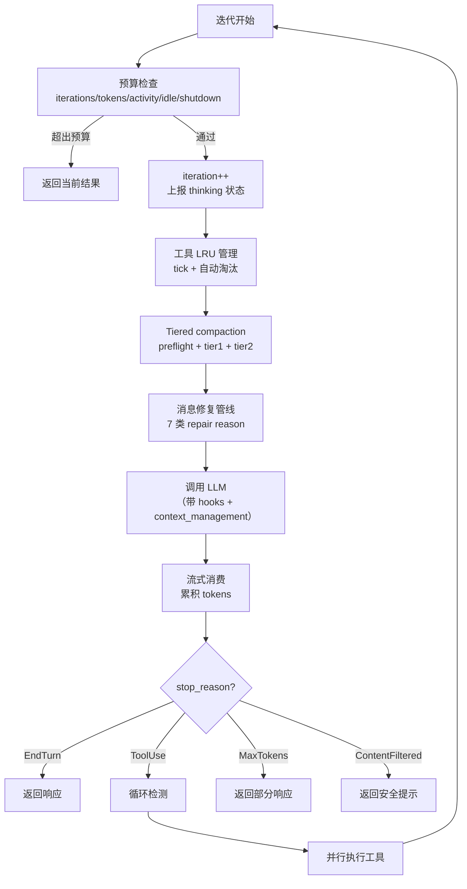
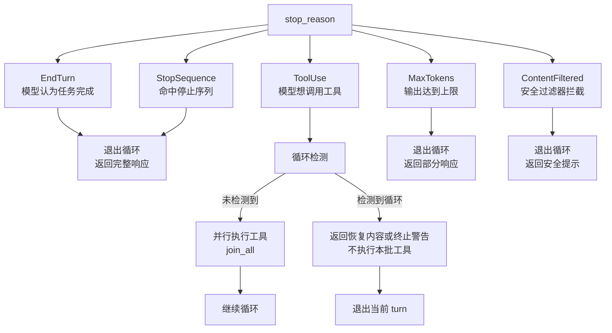
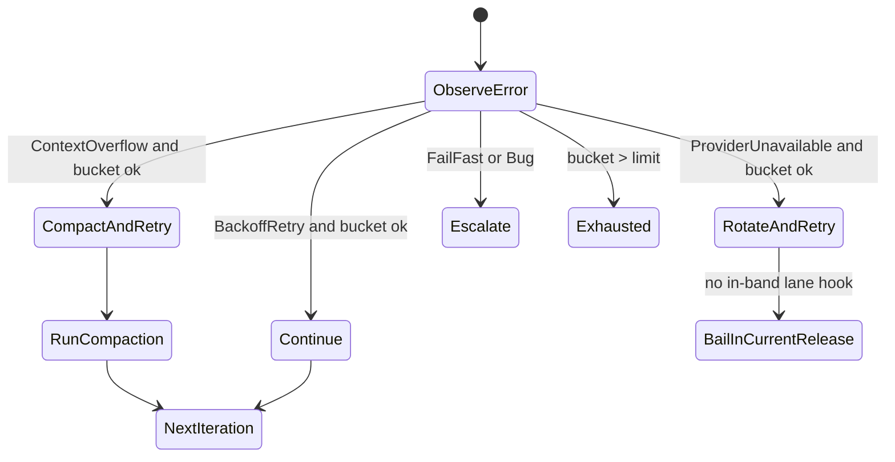

# 第 5 章：Agent Loop：一次对话的完整生命周期

> **定位**：本章是全书最核心的一章——深入 octos-agent 的配置与主循环（`crates/octos-agent/src/agent/mod.rs` + `crates/octos-agent/src/agent/loop_runner.rs`），逐段走读从消息构建到工具调用、上下文压缩、错误恢复再到返回结果的完整流程。前置依赖：第 3 章（LLM Provider）、第 4 章（记忆系统）。适用场景：任何想理解 AI Agent 运行时机制的读者，尤其是 AI 应用开发者（读者 C）和想贡献 octos 核心代码的开发者（读者 D）。

理解了 octos-core 的类型系统（第 2 章）、octos-llm 的 Provider 抽象（第 3 章）和 octos-memory 的记忆系统（第 4 章）之后，我们终于来到了整个系统的心脏——Agent Loop。

一个 AI Agent 的"智能"本质上是一个循环：接收用户消息 → 调用 LLM → 解析 LLM 的意图 → 如果 LLM 想用工具就执行工具 → 把工具结果反馈给 LLM → 重复，直到 LLM 认为任务完成。这个循环看似简单，但生产级实现需要处理大量边界情况：迭代上限、token 预算、idle progress timeout、上下文窗口溢出、消息格式修复、循环检测、优雅关停、provider/harness 错误恢复。

本章将走读 `crates/octos-agent/src/agent/` 目录下的核心代码，用约 200 行关键代码展示 Agent Loop 的完整生命周期。

---

## 5.1 Agent 结构体与配置

### 5.1.1 Agent 的组成

Agent 结构体（`crates/octos-agent/src/agent/mod.rs:143-230`）持有执行一次对话所需的全部资源：

```rust
pub struct Agent {
    pub id: AgentId,                              // Agent 唯一标识
    pub llm: Arc<dyn LlmProvider>,                // LLM Provider（详见第 3 章）
    pub tools: Arc<ToolRegistry>,                 // 工具注册表（详见第 6 章）
    pub memory: Arc<EpisodeStore>,                // 长期记忆（详见第 4 章）
    pub embedder: Option<Arc<dyn EmbeddingProvider>>,
    pub system_prompt: RwLock<String>,            // 系统提示（支持热加载）
    pub config: AgentConfig,                      // 执行配置
    pub reporter: RwLock<Arc<dyn ProgressReporter>>, // 进度上报
    pub hooks: Option<Arc<HookExecutor>>,         // 钩子系统（详见第 14 章）
    pub harness_event_sink: Option<String>,
    pub shutdown: Arc<AtomicBool>,                // 优雅关停标志
    pub persistent_retry_state: Option<Arc<Mutex<LoopRetryState>>>,
    pub tiered_compaction: Option<Arc<TieredCompactionRunner>>,
    pub file_state_cache: Option<Arc<FileStateCache>>,
    pub profile: Option<Arc<ProfileDefinition>>,
    // ...
}
```

几个设计要点值得注意：`llm` 和 `tools` 使用 `Arc` 包装，因为 Agent 可能在多个异步任务间共享（工具并行执行时）。`system_prompt` 使用 `RwLock<String>` 而非普通 `String`，支持配置热加载（详见第 13 章）——运行中的 Agent 可以在不重启的情况下更新系统提示。`shutdown: Arc<AtomicBool>` 是一个跨线程共享的原子布尔标志。当收到 SIGTERM 信号时，主线程将其设为 `true`，Agent Loop 在每次迭代开始时检查这个标志，如果为 `true` 就优雅退出而非粗暴终止（详见第 11 章）。

当前主分支的 Agent 还显式携带几类运行时状态：`persistent_retry_state` 保存跨 turn 的 retry bucket，`tiered_compaction` 驱动三层上下文压缩，`file_state_cache` 让文件工具读写可以共享缓存，`profile` 记录启动时应用的 profile envelope。这些字段说明 Agent 已经不是“LLM + tools”的薄包装，而是一个把 prompt-visible state、runtime control state 和 durable evidence state 连接起来的运行时对象。

### 5.1.2 AgentConfig

AgentConfig（`crates/octos-agent/src/agent/mod.rs:45-94`）控制 Agent 的执行边界：

| 字段 | 默认值 | 含义 |
|------|--------|------|
| `max_iterations` | 50 | 最大迭代次数 |
| `max_tokens` | None（无限制） | token 预算上限 |
| `max_timeout` | 1800 秒（30 分钟） | activity timeout：只有在没有近期进展时才触发 |
| `tool_timeout_secs` | 1800 | 单个工具调用默认超时，上限同为 1800 秒 |
| `save_episodes` | true | 是否保存经验到记忆 |
| `chat_max_tokens` | None | 单次 LLM 输出 token override |
| `suppress_auto_send_files` | false | 背景 worker 是否跳过通用 files_to_send 自动发送 |

50 次迭代上限（`crates/octos-agent/src/agent/mod.rs:82-94`）是一个安全阀。一个典型的代码修改任务通常在 5-15 次迭代内完成（读文件 → 分析 → 修改 → 测试）。如果 Agent 在 50 次迭代后仍未完成，几乎可以确定它陷入了某种低效循环。

---

## 5.2 主循环：逐段走读

主循环位于 `crates/octos-agent/src/agent/loop_runner.rs:578-1057`（对话模式）和 `loop_runner.rs:1060-1325`（任务模式）。让我们逐段走读。

### 5.2.1 入口点

Agent 有两个入口点（`crates/octos-agent/src/agent/loop_runner.rs:33-41,293-474`）：

- **`process_message()`**：对话模式——接收用户消息和历史，返回 `ConversationResponse`
- **`run_task()`**：任务模式——接收 Task 定义，返回 `TaskResult`

两者最终都调用同一个内部循环 `process_message_inner()`。

### 5.2.2 迭代流程

每次迭代的完整流程如下：



**图 5-1：Agent Loop 单次迭代流程。** 关键路径是 ToolUse 分支——它是唯一导致循环继续的 stop_reason。

### 5.2.3 预算检查

每次迭代最先执行的是预算检查（`crates/octos-agent/src/agent/budget.rs:42-80`）：

```rust
pub(super) fn check_budget(
    &self,
    iteration: u32,
    start: Instant,
    total_usage: &TokenUsage,
    activity: &LoopActivityState,
) -> Option<BudgetStop> {
    // 1. 优雅关停——原子读取，O(1)
    if self.shutdown.load(Ordering::Acquire) {
        return Some(BudgetStop::Shutdown);
    }
    // 2. 迭代次数——简单比较
    if iteration >= self.config.max_iterations {
        return Some(BudgetStop::MaxIterations);
    }
    // 3. idle progress timeout——无可观察进展
    if activity.has_timed_out(idle_timeout) {
        return Some(BudgetStop::IdleProgressTimeout { limit: idle_timeout });
    }
    // 4. activity timeout——只有没有近期进展时才触发
    if let Some(timeout) = self.config.max_timeout {
        if start.elapsed() > timeout && !activity.recently_active_within(timeout) {
            return Some(BudgetStop::ActivityTimeout { limit: timeout });
        }
    }
    // 5. token 预算——需要加法
    if let Some(max_tokens) = self.config.max_tokens {
        let used = total_usage.input_tokens + total_usage.output_tokens;
        if used >= max_tokens {
            return Some(BudgetStop::MaxTokens { used, limit: max_tokens });
        }
    }
    None
}
```

五道检查的优先级经过精心排序：

1. **Shutdown** 最先——原子加载是 ~1 CPU 周期的操作，且用户主动中断必须立即响应
2. **迭代次数**次之——简单整数比较，是最常见的停止原因
3. **Idle progress timeout** 第三——默认 300 秒无任何 reporter 进展，说明 loop 可能卡死
4. **Activity timeout** 第四——`max_timeout` 不是无条件墙钟 kill；只在总时长超限且最近无进展时触发
5. **Token 预算**最后——需要加法运算，且大部分配置不设置 token 上限（`None`）

每种停止原因携带不同的上下文数据（`BudgetStop` 枚举，`crates/octos-agent/src/agent/budget.rs:11-17`）：

```rust
pub(super) enum BudgetStop {
    Shutdown,
    MaxIterations,
    MaxTokens { used: u32, limit: u32 },     // 包含已用和上限
    ActivityTimeout { limit: Duration },      // 总时长超限且无近期活动
    IdleProgressTimeout { limit: Duration },  // 默认 300s 无进展
}
```

这些上下文数据被传递给 `report_budget_stop()` 方法（`crates/octos-agent/src/agent/budget.rs:82-123`），生成对应的进度事件通知用户——"Reached max iterations"、"Token budget exceeded (1000 of 500)"、"Activity timeout" 等具体信息。`ActivityTrackingReporter` 会在每个 progress event 时刷新 `last_activity_at`（`crates/octos-agent/src/agent/activity.rs:60-82`），所以长任务只要持续产出进展，不会因为单纯墙钟增长被误杀。

### 5.2.4 消息修复管线

在每次 LLM 调用前，消息历史需要经过一条集中在 `prepare_conversation_messages()` 的准备管线（`crates/octos-agent/src/agent/loop_compaction.rs:17-53`），并把每类变更记录到 `LoopRepairReason`（`crates/octos-agent/src/agent/turn_state.rs:47-56`）：

1. **`trim_to_context_window()`**：截断过长的历史消息以适应模型的上下文窗口
2. **`normalize_system_messages()`**：合并多个系统消息，确保系统提示的正确位置
3. **`repair_message_order()`**：修复消息顺序（某些 Provider 要求严格的 user→assistant→user 交替）
4. **`repair_tool_pairs()`**：确保每个工具调用都有对应的工具结果
5. **`synthesize_missing_tool_results()`**：为缺失的工具结果生成占位响应（如 `"[result unavailable]"`）
6. **`truncate_old_tool_results()`**：截断过早的工具结果以节省上下文空间
7. **`normalize_tool_call_ids()`**：统一跨 Provider 的 tool_call_id 前缀与字符集合

为什么需要这么多修复？原因有三：

**上下文压缩和并发写入的副作用。** 当对话历史经过 compaction（详见第 8 章）或 speculative / overflow 分支并发写入 session 时，工具调用和工具结果的配对关系可能被打散。`repair_message_order()` 会从整个消息列表收集匹配 tool result 并放回 assistant 后面，`repair_tool_pairs()` 和 `synthesize_missing_tool_results()` 则处理孤立或缺失结果。

**Provider 格式差异。** Anthropic 要求 tool result 紧跟在包含 tool_call 的 assistant 消息之后，不能插入其他消息。OpenAI 则允许 tool result 与 tool_call 之间有间隔。`repair_message_order()` 根据当前 Provider 的要求重排消息。

**LLM 的不可靠输出。** LLM 有时会生成重复的 tool_call_id，或返回格式不完整的工具调用。`normalize_tool_call_ids()` 在 LLM 调用前清理这些问题，避免 Provider API 因为重复 ID 而报错。

### 5.2.5 工具数量警告

在第一次迭代中，如果注册的工具数超过 25 个（`crates/octos-agent/src/agent/loop_runner.rs:735-740`），系统会打印警告。这是因为大多数 LLM 在工具列表过长时表现下降——可能出现"空响应"或选择困难。建议通过 `always: false` 策略或 `tool_policy` deny 列表减少活跃工具数。

### 5.2.6 LLM 调用与空响应重试

LLM 调用（`crates/octos-agent/src/agent/loop_runner.rs:754-814`）经过 hooks 系统，并包含智能重试：

```rust
let response = match self.call_llm_with_hooks(&messages, &tools, &config).await {
    Ok(r) => r,
    Err(e) if e.to_string().contains("empty response after") => {
        // 空响应——重试一次，AdaptiveRouter 可能切换到其他 Provider
        self.call_llm_with_hooks(&messages, &tools, &config).await?
    }
    Err(e) => return Err(e),
};
```

这个重试逻辑处理一个特殊场景：LLM 返回了空响应（没有文本、没有工具调用、没有错误）。这通常发生在 Provider 过载或模型处理失败时。重试一次让 AdaptiveRouter 有机会选择不同的 Provider（详见第 3 章）。

Hooks 允许用户在 LLM 调用前后注入自定义逻辑（详见第 14 章）。before-hook 可以拒绝调用（返回 exit code 1），after-hook 可以观察响应。

### 5.2.7 流式消费与自适应超时

流式响应消费（`crates/octos-agent/src/agent/streaming.rs:32-239`）使用 `tokio::select!` 同时等待三个事件：

```rust
let event = tokio::select! {
    event = stream.next() => event,           // 流事件到达
    _ = self.wait_for_shutdown() => {         // 优雅关停信号
        break;
    }
    _ = tokio::time::sleep(timeout) => {      // 超时
        break;
    }
};
```

三个 future 竞争，先完成的决定执行路径。如果 shutdown 信号在流式传输过程中到达，Agent 立即停止消费，不等待流结束。

流式响应的事件类型：

- **TextDelta**：逐 token 的文本输出，实时转发给用户
- **ReasoningDelta**：推理模型的思维链输出（如 o1 的内部推理）
- **ToolCallDelta**：工具调用参数的增量构建——工具名和参数 JSON 逐块到达
- **Usage**：token 使用量更新
- **Done**：流结束信号

**自适应超时**（`crates/octos-agent/src/agent/streaming.rs:61-75`）使用两阶段策略：

```rust
let ttft_secs = (30 + input_tokens_estimate as u64 / 1000).min(180);
let timeout = if got_first_chunk {
    Duration::from_secs(30)       // Phase 2: token 间隔 30s
} else {
    Duration::from_secs(ttft_secs) // Phase 1: TTFT = 30s + 1s/1K tokens
};
```

| 阶段 | 计算公式 | 100K tokens 输入 | 理由 |
|------|---------|-----------------|------|
| TTFT | `30 + tokens/1000`（max 180s） | 130s | 模型处理大输入需要时间 |
| Inter-chunk | 固定 30s | 30s | 流一旦开始应持续到达 |

TTFT 的自适应设计至关重要：如果对一个包含整个代码库上下文（100K+ tokens）的请求使用固定 30 秒超时，几乎必然触发误判。`1s/1K tokens` 的线性增长让超时与输入大小成正比。

---

## 5.3 stop_reason 决策树

LLM 响应的 `stop_reason` 决定了循环的走向。octos 定义了五种 stop_reason（`crates/octos-llm/src/types.rs:26-41`）：



**图 5-2：stop_reason 决策树。** ToolUse 是唯一触发循环继续的分支。

### 5.3.1 EndTurn / StopSequence

模型自然结束（`crates/octos-agent/src/agent/loop_runner.rs:849-865`）。这是最常见的退出路径——LLM 认为任务已完成，返回最终文本。

### 5.3.2 ToolUse — 工具执行

这是 Agent Loop 的核心路径（`crates/octos-agent/src/agent/loop_runner.rs:866-1013`）。当 LLM 返回工具调用请求时：

1. **循环检测**：检查工具调用模式是否重复（见 5.4 节）
2. **并行执行**：交给 `handle_tool_use()` 统一执行、记录 files、token、structured metadata
3. **结果注入**：将工具结果作为 Tool 角色的消息添加到历史中
4. **spawn_only fast return**：如果本轮启动的是后台任务，当前 turn 返回“后台工作已启动”
5. **继续循环**：普通工具结果进入消息历史后，回到迭代开始

### 5.3.3 MaxTokens

LLM 的输出达到了 `max_output_tokens` 限制（`crates/octos-agent/src/agent/loop_runner.rs:1014-1029`）。这通常意味着 LLM 的回答被截断了。循环退出，返回截断的内容。

### 5.3.4 ContentFiltered

LLM 的安全过滤器拦截了输出（`crates/octos-agent/src/agent/loop_runner.rs:1030-1051`）。这可能因为用户请求涉及敏感内容，或 LLM 的输出触发了 Provider 的内容策略。循环退出，返回安全提示消息。

---

## 5.4 循环检测：防止 Agent 陷入死循环

### 5.4.1 问题场景

Agent 可能陷入死循环：反复读取同一个文件、反复执行同一个失败的命令、或者在"修改→测试→失败→修改"的循环中无法收敛。如果不加检测，50 次迭代会全部浪费在无意义的重复上。

### 5.4.2 检测算法

LoopDetector（`crates/octos-agent/src/loop_detect.rs:11-16`）使用哈希签名检测工具调用模式的重复：

```rust
pub struct LoopDetector {
    signatures: Vec<u64>,  // 工具调用哈希的环形缓冲区
    window: usize,         // 最大窗口大小（默认 12）
}
```

每次工具调用时，将 `工具名 + 参数 JSON` 哈希为 `u64` 签名，追加到缓冲区。然后检查最近的签名序列是否存在长度为 1、2 或 3 的重复模式（`crates/octos-agent/src/loop_detect.rs:29-60`）。

**检测条件**（`crates/octos-agent/src/loop_detect.rs:74-81`）：同一模式连续出现 **3 次以上**才触发检测。例如：

- 模式长度 1：`[A, A, A]` → 检测到（同一个工具调用重复 3 次）
- 模式长度 2：`[A, B, A, B, A, B]` → 检测到（AB 对重复 3 次）
- 模式长度 3：`[A, B, C, A, B, C, A, B, C]` → 检测到（ABC 序列重复 3 次）

### 5.4.3 检测后的处理

检测到循环后（`crates/octos-agent/src/agent/loop_runner.rs:866-920`），当前 `process_message` 不会继续执行同一批工具。它先尝试 `dispatch_shell_retry_recovery()`：如果这是反复 shell 尝试导致的 spiral，运行时会通过 `LoopRetryState` 返回最近可用的 shell 输出；否则返回一个去重后的 terminal warning：

```
⚠️ Loop detected: you appear to be repeating the same tool calls.
Please try a different approach.
```

这个消息是当前 turn 的返回内容，而不是写入消息历史后继续执行。`loop_detected_recently` 会保证同一 burst 里不会反复发出相同 warning；如果再次触发，会升级成 terminal error（`crates/octos-agent/src/agent/mod.rs:168-173`）。

这个改变比旧版“注入警告后继续”更保守：检测到重复工具模式时先停住本轮，避免继续消耗工具调用和 token；真正合理的轮询应通过后台任务、spawn_only 或显式状态查询建模，而不是让主 loop 无界重复。

---

## 5.5 Token 预算管理

### 5.5.1 累积追踪

每次 LLM 调用后，token 使用量通过 `LoopTurnState::record_usage()` 累积到 `total_usage`（`crates/octos-agent/src/agent/turn_state.rs:103-120`，调用点见 `loop_runner.rs:843-847`）：

```rust
turn.record_usage(
    response.usage.input_tokens,
    response.usage.output_tokens,
    tracker,
);
```

工具执行产生的 token（如果工具内部调用了子 Agent 或 LLM）也会先由 `execute_tools()` 聚合，再在 `handle_tool_use()` 中调用同一个 `turn.record_usage()` 累加（`crates/octos-agent/src/agent/execution.rs:1328-1348`; `crates/octos-agent/src/agent/loop_runner.rs:1428-1469`）。

### 5.5.2 实时上报

`TokenTracker`（`crates/octos-agent/src/agent/mod.rs:93-112`）使用原子计数器实时更新 token 使用量：

```rust
pub struct TokenTracker {
    pub input_tokens: AtomicU32,
    pub output_tokens: AtomicU32,
}
```

这些原子计数器被进度上报器（`ProgressReporter`）读取，用于在 CLI 或 Web UI 中显示实时的 token 消耗。`Ordering::Relaxed` 足够——token 计数不需要严格的顺序保证，最终一致性即可。

### 5.5.3 成本计算

流式消费完成后（`crates/octos-agent/src/agent/streaming.rs:242-258`），系统使用 octos-llm 的定价模块计算本次响应和累计会话的成本，并通过 reporter 上报。这让用户在交互过程中实时看到 API 成本。

---

## 5.6 流式消费的自适应超时

流式响应的超时策略（`streaming.rs`）比简单的固定超时更加精细：

| 超时类型 | 计算公式 | 最大值 | 场景 |
|---------|---------|--------|------|
| 首 token (TTFT) | `30s + 1s/1K input tokens` | 180s | 等待 LLM 开始响应 |
| token 间隔 | 固定 30s | 30s | 正常流式传输中 |

TTFT 的自适应设计考虑到了一个现实问题：输入越长（比如包含大量源码上下文），LLM 处理所需的时间越长。固定的 30 秒超时在处理 100K+ tokens 的输入时会频繁触发误判。`1s/1K tokens` 的线性增长让超时与输入大小成正比，180s 上限防止无限等待。

---

## 5.7 源码走读：核心 200 行

将主循环的关键路径提炼为约 200 行（来自 `loop_runner.rs`），带中文注释：

```rust
// === process_message_inner 的关键路径（简化版）===
loop {
    // 1. 预算检查：iteration / token / activity / idle / shutdown
    if let Some(stop) = turn.check_budget(self, activity.as_ref()) {
        if !self.try_budget_grace_call(&stop, &mut retry_state, turn.iteration()) {
            turn.record_budget_stop(&stop);
            return Ok(ConversationResponse { content: stop.message(), /* ... */ });
        }
    }

    let iteration = turn.advance_iteration();
    self.beat_heartbeat(iteration)?;
    self.reporter().report(ProgressEvent::Thinking { iteration });

    // 2. 工具 LRU 与三层 compaction
    self.tools.tick();
    self.tools.auto_evict();
    if iteration == 1 {
        self.maybe_run_preflight_compaction(&mut messages);
    }
    let protected_ids = collect_protected_tool_call_ids(&messages);
    self.run_tier1_compaction(&mut messages, &protected_ids);

    // 3. 消息准备：trim + system normalize + tool pair/order repair + id normalize
    prepare_conversation_messages(self, &mut messages, &mut turn);
    self.maybe_run_turn_compaction(&mut messages, iteration);

    // 4. 调用 LLM。Anthropic 可带 tier-2 context_management payload。
    let call_config = with_tier2_context_management(&config, self);
    let (mut response, streamed) = match self
        .call_llm_with_hooks(&messages, &tools_spec, &call_config, iteration, &total_usage, &mut turn)
        .await
    {
        Ok(r) => r,
        Err(e) => match self.handle_loop_error_with_dispatch(&e, &mut retry_state, iteration, &mut messages) {
            LoopErrorAction::Retry => continue,
            LoopErrorAction::Bail => return Err(e),
        },
    };
    Self::normalize_inline_invokes(&mut response);

    // 5. 累积 token 使用量，并同步 TokenTracker。
    turn.record_usage(response.usage.input_tokens, response.usage.output_tokens, tracker);

    // 6. stop_reason 决策
    match response.stop_reason {
        StopReason::EndTurn | StopReason::StopSequence => {
            self.emit_cost_update(turn.total_usage(), &response.usage);
            return Ok(ConversationResponse { /* ... */ });
        }
        StopReason::ToolUse => {
            // 检测到重复工具模式时，不再继续执行这一批工具。
            for tc in &response.tool_calls {
                if let Some(warning) = loop_detector.record(&tc.name, &tc.arguments) {
                    if let Some(recovered) =
                        self.dispatch_shell_retry_recovery(&messages, &mut retry_state, iteration)
                    {
                        return Ok(ConversationResponse { content: recovered, /* ... */ });
                    }
                    return Ok(ConversationResponse {
                        content: self.dedup_loop_warning(warning)?,
                        /* ... */
                    });
                }
            }

            if let Err(e) = self.handle_tool_use(&response, &mut messages, /* ... */).await {
                match self.handle_loop_error_with_dispatch(&e, &mut retry_state, iteration, &mut messages) {
                    LoopErrorAction::Retry => continue,
                    LoopErrorAction::Bail => return Err(e),
                }
            }

            if self.tools.spawn_only_was_invoked() {
                return Ok(ConversationResponse { content: "Background work started...".into(), /* ... */ });
            }
        }
        StopReason::MaxTokens => {
            return Ok(ConversationResponse { /* ... */ });
        }
        StopReason::ContentFiltered => {
            return Ok(ConversationResponse { content: safety_message(response), /* ... */ });
        }
    }
}
```

*注：以上代码经过简化以突出核心逻辑，实际实现包含更多错误处理、日志和边界条件。完整代码见 `crates/octos-agent/src/agent/loop_runner.rs`。*

---

> ### 工程决策侧栏：为什么 Agent Loop 本身不是 Actor Model
>
> 很多并发系统（如 Akka、Erlang/OTP）使用 Actor Model——每个 Agent 是一个 Actor，通过消息传递通信。octos 的会话层确实由 `SessionActor` 串行化同一 session 的输入，但 Agent Loop 本身选择了更直接的“typed async loop + 显式 runtime state”模型。
>
> **方案一：Actor Model**
>
> 优势：
> - 天然的状态隔离——每个 Actor 封装自己的状态
> - 消息传递避免共享状态——不需要锁
> - 成熟的错误恢复模式（supervision tree）
>
> 劣势：
> - 引入 Actor 框架（如 `actix`）增加依赖和学习成本
> - 工具执行需要请求-响应语义，Actor 的异步消息传递会增加复杂度
> - Agent 的状态本质上是线性的（消息历史 + 迭代计数），不需要 Actor 的并发状态管理
>
> **方案二：typed async loop + session actor 边界（octos 的选择）**
>
> 优势：
> - 直观的顺序逻辑——循环的每一步自然对应 Agent 的行为阶段
> - Tokio 的异步运行时已经提供了并发能力（`join_all` 并行执行工具）
> - 会话层负责串行化同一 session 的消息，Agent Loop 内部专注于 turn-local 状态机
>
> 劣势：
> - 跨 Agent 协调需要显式的 channel 通信
> - 没有内置的 supervision tree
>
> **octos 的理由：** Agent Loop 的核心是顺序的——接收→思考→行动→观察→思考→...。在这个链条中，并发只出现在"行动"阶段（多个工具并行执行、后台 spawn_only 任务独立交付）。把主路径保持为 `loop` + typed state machine，可以让预算、compaction、retry bucket、harness event 这些控制面保持可审计，而不是被 Actor 消息协议分散。

---

## 5.8 主干演进：typed recovery state machine

当前主分支里的 Agent Loop 已经不只是“循环调用 LLM、执行工具、继续下一轮”。运行时把错误恢复建模成一条 typed control flow：`HarnessError` 先把原始 `eyre::Report` 归类成稳定 variant，再由 `RecoveryHint` 映射到 `LoopDecision`，最后由 loop 决定继续、压缩、升级或退出（`crates/octos-agent/src/harness_errors.rs:93-233`; `crates/octos-agent/src/agent/loop_state.rs:126-148`）。

| 失败类型 | RecoveryHint | LoopDecision | 运行时含义 |
|----------|--------------|--------------|------------|
| `RateLimited` / `Network` / `Timeout` | `BackoffRetry` | `Continue` | 暂态失败，下一轮可继续 |
| `ContextOverflow` | `CompactContext` | `CompactAndRetry` | 先压缩上下文，再重试 |
| `ProviderUnavailable` | `SwitchProvider` | `RotateAndRetry` | 语义上应换 provider lane |
| `Authentication` / `InvalidRequest` / `ContentFiltered` | `FailFast` | `Escalate` | 配置或请求本身不可恢复 |
| `DelegateDepthExceeded` | `FailFast` | `Escalate` | 防止子任务递归扩散 |
| `Internal` | `Bug` | `Escalate` | 运行时 invariant broken |

这里有一个容易写错的边界：`ProviderUnavailable` 的语义是 `RotateAndRetry`，但当前 `handle_loop_error_with_dispatch` 里没有 agent 内部的 provider lane 切换 hook；代码会记录 warning 并 bail，把 lane rotation 留给外层 provider chain 或调用者处理（`crates/octos-agent/src/agent/loop_runner.rs:336-350`）。所以书中不能把它描述成“当前 loop 内自动切换 provider”。

`LoopRetryState` 也不是一个全局 retry counter。它为每个 `HarnessError` variant 维护独立 bucket 和 hard limit；超过 limit 返回 `Exhausted`，不会无限重试（`crates/octos-agent/src/agent/loop_state.rs:70-104`, `crates/octos-agent/src/agent/loop_state.rs:171-253`）。`ContextOverflow` 默认只允许有限次 compact，`DelegateDepthExceeded` 默认一次后收敛，shell spiral 虽然不是 `HarnessError`，也通过同一 retry ledger 记录为 `shell_spiral`。



这条路径已经实际接入主循环：`CompactAndRetry` 分支会调用 turn compaction helper，然后返回 `Retry` 继续外层循环（`crates/octos-agent/src/agent/loop_runner.rs:321-339`）。因此 Ch8 中的上下文压缩不只是 token 预算优化，而是 Agent Loop 的错误恢复机制之一。

最后，retry bucket 还可以跨 turn 存活。`PersistentRetryStateGuard` 构造时从共享 `Arc<Mutex<LoopRetryState>>` hydrate，drop 时写回；未配置持久化 handle 的 session 则保持旧的“每轮新状态”行为（`crates/octos-agent/src/agent/loop_runner.rs:126-170`）。这给本章一个重要分层：消息、summary 和 workspace contract 是 prompt-visible state；retry bucket、grace eligibility 和 task lifecycle 是 runtime control state；validator ledger、harness event sink、cost ledger 则是 durable evidence state。

## 5.9 本章回顾

Agent Loop 是 octos 的灵魂——一个精心编排的 while 循环：

1. **预算检查**：五道门禁（shutdown → iterations → idle progress timeout → activity timeout → tokens），确保 Agent 不会无限运行，也不会误杀仍在持续上报进展的长任务。50 次迭代上限是默认安全阀。

2. **消息修复**：7 类 repair reason 在每次 LLM 调用前规范化消息历史，处理上下文压缩、并发写入副作用和 Provider 间的格式差异。

3. **stop_reason 决策**：五种分支中只有 ToolUse 触发循环继续。EndTurn 是正常退出，MaxTokens 是截断退出，ContentFiltered 是安全退出。

4. **循环检测**：哈希签名 + 模式匹配（长度 1/2/3，重复 3 次），检测到后停止当前工具批次，优先返回 shell 恢复内容，否则返回去重后的 terminal warning。

5. **Token 追踪**：原子计数器实时更新，支持 CLI/Web UI 的成本显示。

6. **流式超时**：自适应 TTFT（与输入大小成正比），避免长上下文场景的误判。

7. **typed recovery**：`HarnessError`、`LoopRetryState` 和 `LoopDecision` 让错误恢复成为有界状态机；`CompactAndRetry` 已经接入主循环，provider lane rotation 则仍由外层 provider chain 承担。

下一章将深入工具系统——Agent Loop 中"行动"阶段的核心：内置工具、插件工具和 spawn_only 后台任务如何注册、调用和安全管控。

---

## 延伸阅读

- **ReAct 框架**：Yao et al., "ReAct: Synergizing Reasoning and Acting in Language Models"（2023）——Agent 循环的理论基础
- **Function Calling**：OpenAI "Function calling" 文档——理解 LLM 如何请求工具调用
- **Tokio select!**：Tokio 官方文档 "select" 章节——理解多 future 竞争的模式
- **Circuit Breaker 模式**：Michael Nygard, *Release It!*（Pragmatic Bookshelf）——生产系统的韧性模式

## 思考题

1. **迭代上限的权衡**：50 次迭代上限对于简单任务（如回答问题）太高，对于复杂任务（如大规模重构）可能太低。你会如何设计一个自适应的迭代上限？

2. **循环检测的局限**：当前的哈希签名方法只检测精确重复。如果 Agent 每次传递的参数略有不同（如文件名多一个空格），检测就会失效。你会如何改进？

3. **消息修复的必要性**：7 类 repair reason 处理了大量边界情况。如果 octos 只支持一个 Provider（如只支持 Anthropic），哪些修复可以省略？

4. **Actor Model 的场景**：本章的工程决策侧栏选择了简单循环而非 Actor Model。如果 octos 需要支持多个 Agent 协作（如一个规划 Agent 分配任务给多个执行 Agent），设计会如何改变？

---

> **版本演化说明**
> 本章按当前 `../octos/crates/octos-agent/src/agent/` 源码撰写。后续审查应重点核对 `loop_runner.rs`、`loop_state.rs`、`loop_compaction.rs`、`budget.rs`、`streaming.rs` 与 `harness_errors.rs` 的协同，因为 Agent Loop 的主要变化已经集中在 typed recovery、tiered compaction、idle progress timeout 和后台任务交付边界。
