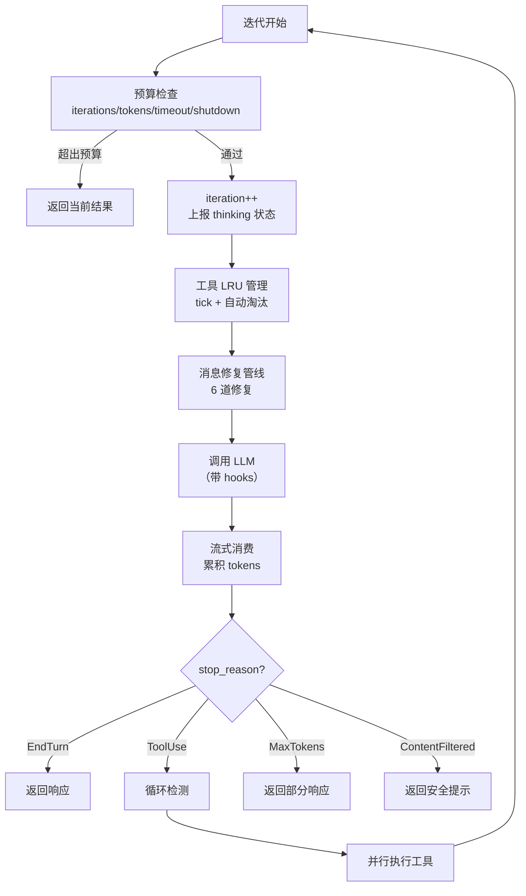
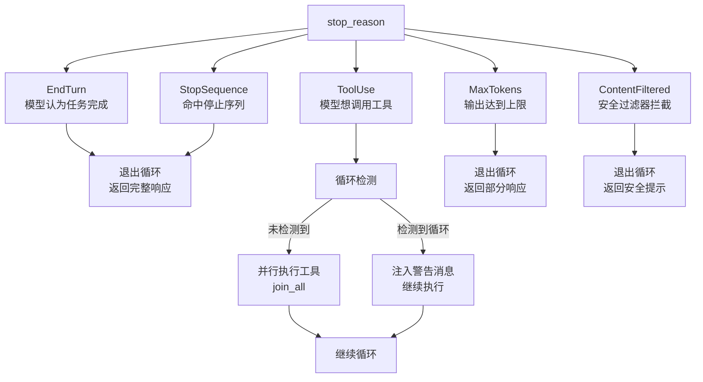

# 第 5 章：Agent Loop：一次对话的完整生命周期

> **定位**：本章是全书最核心的一章——深入 octos-agent 的配置与主循环（`crates/octos-agent/src/agent/mod.rs` + `crates/octos-agent/src/agent/loop_runner.rs`），逐段走读从消息构建到工具调用再到返回结果的完整流程。前置依赖：第 3 章（LLM Provider）、第 4 章（记忆系统）。适用场景：任何想理解 AI Agent 运行时机制的读者，尤其是 AI 应用开发者（读者 C）和想贡献 octos 核心代码的开发者（读者 D）。

理解了 octos-core 的类型系统（第 2 章）、octos-llm 的 Provider 抽象（第 3 章）和 octos-memory 的记忆系统（第 4 章）之后，我们终于来到了整个系统的心脏——Agent Loop。

一个 AI Agent 的"智能"本质上是一个循环：接收用户消息 → 调用 LLM → 解析 LLM 的意图 → 如果 LLM 想用工具就执行工具 → 把工具结果反馈给 LLM → 重复，直到 LLM 认为任务完成。这个循环看似简单，但生产级实现需要处理大量边界情况：迭代上限、token 预算、上下文窗口溢出、消息格式修复、循环检测、优雅关停。

本章将走读 `crates/octos-agent/src/agent/` 目录下的核心代码，用约 200 行关键代码展示 Agent Loop 的完整生命周期。

---

## 5.1 Agent 结构体与配置

### 5.1.1 Agent 的组成

Agent 结构体（`crates/octos-agent/src/agent/mod.rs:115-138`）持有执行一次对话所需的全部资源：

```rust
pub struct Agent {
    pub id: AgentId,                              // Agent 唯一标识
    pub llm: Arc<dyn LlmProvider>,                // LLM Provider（详见第 3 章）
    pub tools: Arc<ToolRegistry>,                 // 工具注册表（详见第 6 章）
    pub memory: Arc<EpisodeStore>,                // 长期记忆（详见第 4 章）
    pub system_prompt: RwLock<String>,            // 系统提示（支持热加载）
    pub config: AgentConfig,                      // 执行配置
    pub reporter: RwLock<Arc<dyn ProgressReporter>>, // 进度上报
    pub hooks: Option<Arc<HookExecutor>>,         // 钩子系统（详见第 14 章）
    pub shutdown: Arc<AtomicBool>,                // 优雅关停标志
    // ...
}
```

几个设计要点值得注意：`llm` 和 `tools` 使用 `Arc` 包装，因为 Agent 可能在多个异步任务间共享（工具并行执行时）。`system_prompt` 使用 `RwLock<String>` 而非普通 `String`，支持配置热加载（详见第 13 章）——运行中的 Agent 可以在不重启的情况下更新系统提示。`shutdown: Arc<AtomicBool>` 是一个跨线程共享的原子布尔标志。当收到 SIGTERM 信号时，主线程将其设为 `true`，Agent Loop 在每次迭代开始时检查这个标志，如果为 `true` 就优雅退出而非粗暴终止（详见第 11 章）。

### 5.1.2 AgentConfig

AgentConfig（`crates/octos-agent/src/agent/mod.rs:36-75`）控制 Agent 的执行边界：

| 字段 | 默认值 | 含义 |
|------|--------|------|
| `max_iterations` | 50 | 最大迭代次数 |
| `max_tokens` | None（无限制） | token 预算上限 |
| `max_timeout` | 600 秒（10 分钟） | 墙钟超时 |
| `tool_timeout_secs` | 600 | 单个工具调用超时 |
| `save_episodes` | true | 是否保存经验到记忆 |

50 次迭代上限（`crates/octos-agent/src/agent/mod.rs:64-68`）是一个安全阀。一个典型的代码修改任务通常在 5-15 次迭代内完成（读文件 → 分析 → 修改 → 测试）。如果 Agent 在 50 次迭代后仍未完成，几乎可以确定它陷入了某种低效循环。

---

## 5.2 主循环：逐段走读

主循环位于 `crates/octos-agent/src/agent/loop_runner.rs:108-290`。让我们逐段走读。

### 5.2.1 入口点

Agent 有两个入口点（`crates/octos-agent/src/agent/loop_runner.rs:33-41,293-474`）：

- **`process_message()`**：对话模式——接收用户消息和历史，返回 `ConversationResponse`
- **`run_task()`**：任务模式——接收 Task 定义，返回 `TaskResult`

两者最终都调用同一个内部循环 `process_message_inner()`。

### 5.2.2 迭代流程

每次迭代的完整流程如下：



**图 5-1：Agent Loop 单次迭代流程。** 关键路径是 ToolUse 分支——它是唯一导致循环继续的 stop_reason。

### 5.2.3 预算检查

每次迭代最先执行的是预算检查（`crates/octos-agent/src/agent/budget.rs:34-64`）：

```rust
pub(super) fn check_budget(
    &self,
    iteration: u32,
    start: Instant,
    total_usage: &TokenUsage,
) -> Option<BudgetStop> {
    // 1. 优雅关停——原子读取，O(1)
    if self.shutdown.load(Ordering::Acquire) {
        return Some(BudgetStop::Shutdown);
    }
    // 2. 迭代次数——简单比较
    if iteration >= self.config.max_iterations {
        return Some(BudgetStop::MaxIterations);
    }
    // 3. 墙钟超时——elapsed() 调用
    if let Some(timeout) = self.config.max_timeout {
        if start.elapsed() > timeout {
            return Some(BudgetStop::WallClockTimeout { limit: timeout });
        }
    }
    // 4. token 预算——需要加法
    if let Some(max_tokens) = self.config.max_tokens {
        let used = total_usage.input_tokens + total_usage.output_tokens;
        if used >= max_tokens {
            return Some(BudgetStop::MaxTokens { used, limit: max_tokens });
        }
    }
    None
}
```

四道检查的优先级经过精心排序：

1. **Shutdown** 最先——原子加载是 ~1 CPU 周期的操作，且用户主动中断必须立即响应
2. **迭代次数**次之——简单整数比较，是最常见的停止原因
3. **墙钟超时**第三——`Instant::elapsed()` 涉及系统调用，但仍然很快
4. **Token 预算**最后——需要加法运算，且大部分配置不设置 token 上限（`None`）

每种停止原因携带不同的上下文数据（`BudgetStop` 枚举，`crates/octos-agent/src/agent/budget.rs:11-17`）：

```rust
pub(super) enum BudgetStop {
    Shutdown,
    MaxIterations,
    MaxTokens { used: u32, limit: u32 },     // 包含已用和上限
    WallClockTimeout { limit: Duration },     // 包含配置的超时值
}
```

这些上下文数据被传递给 `report_budget_stop()` 方法（`crates/octos-agent/src/agent/budget.rs:67-101`），生成对应的进度事件通知用户——"Reached max iterations" 或 "Token budget exceeded (1000 of 500)" 等具体信息。

### 5.2.4 消息修复管线

在每次 LLM 调用前，消息历史需要经过 7 道修复（`crates/octos-agent/src/agent/loop_runner.rs:137-144`）：

1. **`trim_to_context_window()`**：截断过长的历史消息以适应模型的上下文窗口
2. **`normalize_system_messages()`**：合并多个系统消息，确保系统提示的正确位置
3. **`repair_message_order()`**：修复消息顺序（某些 Provider 要求严格的 user→assistant→user 交替）
4. **`repair_tool_pairs()`**：确保每个工具调用都有对应的工具结果
5. **`synthesize_missing_tool_results()`**：为缺失的工具结果生成占位响应（如 `"[result unavailable]"`）
6. **`truncate_old_tool_results()`**：截断过早的工具结果以节省上下文空间
7. **`normalize_tool_call_ids()`**：去重和清理工具调用 ID

为什么需要这么多修复？原因有三：

**上下文压缩的副作用。** 当对话历史经过 compaction（详见第 8 章），工具调用和工具结果的配对关系可能被破坏——一条工具调用消息的参数被压缩了，但对应的结果消息还在。`repair_tool_pairs()` 和 `synthesize_missing_tool_results()` 修复这类孤立消息。

**Provider 格式差异。** Anthropic 要求 tool result 紧跟在包含 tool_call 的 assistant 消息之后，不能插入其他消息。OpenAI 则允许 tool result 与 tool_call 之间有间隔。`repair_message_order()` 根据当前 Provider 的要求重排消息。

**LLM 的不可靠输出。** LLM 有时会生成重复的 tool_call_id，或返回格式不完整的工具调用。`normalize_tool_call_ids()` 在 LLM 调用前清理这些问题，避免 Provider API 因为重复 ID 而报错。

### 5.2.5 工具数量警告

在第一次迭代中，如果注册的工具数超过 25 个（`crates/octos-agent/src/agent/loop_runner.rs:146-152`），系统会打印警告。这是因为大多数 LLM 在工具列表过长时表现下降——可能出现"空响应"或选择困难。建议通过 `always: false` 策略或 deny 列表减少活跃工具数。

### 5.2.6 LLM 调用与空响应重试

LLM 调用（`crates/octos-agent/src/agent/loop_runner.rs:160-183`）经过 hooks 系统，并包含智能重试：

```rust
let response = match self.call_llm_with_hooks(&messages, &tools, &config).await {
    Ok(r) => r,
    Err(e) if e.to_string().contains("empty response after") => {
        // 空响应——重试一次，AdaptiveRouter 可能切换到其他 Provider
        self.call_llm_with_hooks(&messages, &tools, &config).await?
    }
    Err(e) => return Err(e),
};
```

这个重试逻辑处理一个特殊场景：LLM 返回了空响应（没有文本、没有工具调用、没有错误）。这通常发生在 Provider 过载或模型处理失败时。重试一次让 AdaptiveRouter 有机会选择不同的 Provider（详见第 3 章）。

Hooks 允许用户在 LLM 调用前后注入自定义逻辑（详见第 14 章）。before-hook 可以拒绝调用（返回 exit code 1），after-hook 可以观察响应。

### 5.2.7 流式消费与自适应超时

流式响应消费（`crates/octos-agent/src/agent/streaming.rs:32-239`）使用 `tokio::select!` 同时等待三个事件：

```rust
let event = tokio::select! {
    event = stream.next() => event,           // 流事件到达
    _ = self.wait_for_shutdown() => {         // 优雅关停信号
        break;
    }
    _ = tokio::time::sleep(timeout) => {      // 超时
        break;
    }
};
```

三个 future 竞争，先完成的决定执行路径。如果 shutdown 信号在流式传输过程中到达，Agent 立即停止消费，不等待流结束。

流式响应的事件类型：

- **TextDelta**：逐 token 的文本输出，实时转发给用户
- **ReasoningDelta**：推理模型的思维链输出（如 o1 的内部推理）
- **ToolCallDelta**：工具调用参数的增量构建——工具名和参数 JSON 逐块到达
- **Usage**：token 使用量更新
- **Done**：流结束信号

**自适应超时**（`crates/octos-agent/src/agent/streaming.rs:61-75`）使用两阶段策略：

```rust
let ttft_secs = (30 + input_tokens_estimate as u64 / 1000).min(180);
let timeout = if got_first_chunk {
    Duration::from_secs(30)       // Phase 2: token 间隔 30s
} else {
    Duration::from_secs(ttft_secs) // Phase 1: TTFT = 30s + 1s/1K tokens
};
```

| 阶段 | 计算公式 | 100K tokens 输入 | 理由 |
|------|---------|-----------------|------|
| TTFT | `30 + tokens/1000`（max 180s） | 130s | 模型处理大输入需要时间 |
| Inter-chunk | 固定 30s | 30s | 流一旦开始应持续到达 |

TTFT 的自适应设计至关重要：如果对一个包含整个代码库上下文（100K+ tokens）的请求使用固定 30 秒超时，几乎必然触发误判。`1s/1K tokens` 的线性增长让超时与输入大小成正比。

---

## 5.3 stop_reason 决策树

LLM 响应的 `stop_reason` 决定了循环的走向。octos 定义了五种 stop_reason（`crates/octos-llm/src/types.rs:26-41`）：



**图 5-2：stop_reason 决策树。** ToolUse 是唯一触发循环继续的分支。

### 5.3.1 EndTurn / StopSequence

模型自然结束（`crates/octos-agent/src/agent/loop_runner.rs:221-231`）。这是最常见的退出路径——LLM 认为任务已完成，返回最终文本。

### 5.3.2 ToolUse — 工具执行

这是 Agent Loop 的核心路径（`crates/octos-agent/src/agent/loop_runner.rs:233-256`）。当 LLM 返回工具调用请求时：

1. **循环检测**：检查工具调用模式是否重复（见 5.4 节）
2. **并行执行**：使用 `futures::future::join_all` 并行执行所有工具调用
3. **结果注入**：将工具结果作为 Tool 角色的消息添加到历史中
4. **继续循环**：回到迭代开始

### 5.3.3 MaxTokens

LLM 的输出达到了 `max_output_tokens` 限制（`crates/octos-agent/src/agent/loop_runner.rs:258-268`）。这通常意味着 LLM 的回答被截断了。循环退出，返回截断的内容。

### 5.3.4 ContentFiltered

LLM 的安全过滤器拦截了输出（`crates/octos-agent/src/agent/loop_runner.rs:270-288`）。这可能因为用户请求涉及敏感内容，或 LLM 的输出触发了 Provider 的内容策略。循环退出，返回安全提示消息。

---

## 5.4 循环检测：防止 Agent 陷入死循环

### 5.4.1 问题场景

Agent 可能陷入死循环：反复读取同一个文件、反复执行同一个失败的命令、或者在"修改→测试→失败→修改"的循环中无法收敛。如果不加检测，50 次迭代会全部浪费在无意义的重复上。

### 5.4.2 检测算法

LoopDetector（`crates/octos-agent/src/loop_detect.rs:11-16`）使用哈希签名检测工具调用模式的重复：

```rust
pub struct LoopDetector {
    signatures: Vec<u64>,  // 工具调用哈希的环形缓冲区
    window: usize,         // 最大窗口大小（默认 12）
}
```

每次工具调用时，将 `工具名 + 参数 JSON` 哈希为 `u64` 签名，追加到缓冲区。然后检查最近的签名序列是否存在长度为 1、2 或 3 的重复模式（`crates/octos-agent/src/loop_detect.rs:29-60`）。

**检测条件**（`crates/octos-agent/src/loop_detect.rs:74-81`）：同一模式连续出现 **3 次以上**才触发检测。例如：

- 模式长度 1：`[A, A, A]` → 检测到（同一个工具调用重复 3 次）
- 模式长度 2：`[A, B, A, B, A, B]` → 检测到（AB 对重复 3 次）
- 模式长度 3：`[A, B, C, A, B, C, A, B, C]` → 检测到（ABC 序列重复 3 次）

### 5.4.3 检测后的处理

检测到循环后（`crates/octos-agent/src/agent/loop_runner.rs:235-247`），系统不会终止循环，而是注入一条系统警告消息：

```
⚠️ Loop detected: you appear to be repeating the same tool calls.
Please try a different approach.
```

这个消息被 LLM 在下一次迭代中看到，通常足以让模型改变策略。如果模型继续重复，50 次迭代上限会最终终止循环。

"提示而非强制"的设计是务实的——某些场景下的重复是合理的（比如轮询一个尚未完成的后台任务），强制终止会导致误杀。

---

## 5.5 Token 预算管理

### 5.5.1 累积追踪

每次 LLM 调用后，token 使用量被累积到 `total_usage`（`crates/octos-agent/src/agent/loop_runner.rs:211-212`）：

```rust
total_usage.input_tokens += response.usage.input_tokens;
total_usage.output_tokens += response.usage.output_tokens;
```

工具执行产生的 token（如果工具内部调用了子 Agent 或 LLM）也被累加（`crates/octos-agent/src/agent/loop_runner.rs:550-554`）。

### 5.5.2 实时上报

`TokenTracker`（`crates/octos-agent/src/agent/mod.rs:93-112`）使用原子计数器实时更新 token 使用量：

```rust
pub struct TokenTracker {
    pub input_tokens: AtomicU32,
    pub output_tokens: AtomicU32,
}
```

这些原子计数器被进度上报器（`ProgressReporter`）读取，用于在 CLI 或 Web UI 中显示实时的 token 消耗。`Ordering::Relaxed` 足够——token 计数不需要严格的顺序保证，最终一致性即可。

### 5.5.3 成本计算

流式消费完成后（`crates/octos-agent/src/agent/streaming.rs:242-258`），系统使用 octos-llm 的定价模块计算本次响应和累计会话的成本，并通过 reporter 上报。这让用户在交互过程中实时看到 API 成本。

---

## 5.6 流式消费的自适应超时

流式响应的超时策略（`streaming.rs`）比简单的固定超时更加精细：

| 超时类型 | 计算公式 | 最大值 | 场景 |
|---------|---------|--------|------|
| 首 token (TTFT) | `30s + 1s/1K input tokens` | 180s | 等待 LLM 开始响应 |
| token 间隔 | 固定 30s | 30s | 正常流式传输中 |

TTFT 的自适应设计考虑到了一个现实问题：输入越长（比如包含大量源码上下文），LLM 处理所需的时间越长。固定的 30 秒超时在处理 100K+ tokens 的输入时会频繁触发误判。`1s/1K tokens` 的线性增长让超时与输入大小成正比，180s 上限防止无限等待。

---

## 5.7 源码走读：核心 200 行

将主循环的关键路径提炼为约 200 行（来自 `loop_runner.rs`），带中文注释：

```rust
// === 主循环入口 ===
loop {
    // 1. 预算检查——超出任何限制立即返回
    if let Some(stop) = self.check_budget(iteration, start, &total_usage) {
        return self.build_budget_response(stop, &messages);
    }

    iteration += 1;
    self.reporter.report_thinking();

    // 2. 工具 LRU 管理——淘汰不活跃的工具
    self.tools.tick();

    // 3. 消息修复——确保格式符合 Provider 要求
    normalize_system_messages(&mut messages);
    repair_message_order(&mut messages);
    repair_tool_pairs(&mut messages);
    synthesize_missing_tool_results(&mut messages);
    truncate_old_tool_results(&mut messages);
    normalize_tool_call_ids(&mut messages);

    // 4. 调用 LLM（经过 hooks 管线）
    let response = self.call_llm_with_hooks(&messages, &tools, &config).await?;

    // 5. 累积 token 使用量
    total_usage.input_tokens += response.usage.input_tokens;
    total_usage.output_tokens += response.usage.output_tokens;

    // 6. stop_reason 决策
    match response.stop_reason {
        StopReason::EndTurn | StopReason::StopSequence => {
            // 任务完成，退出循环
            messages.push(Message::assistant(&response.content));
            return Ok(ConversationResponse { /* ... */ });
        }
        StopReason::ToolUse => {
            // 将 LLM 的响应加入历史
            messages.push(assistant_message_with_tool_calls);

            // 循环检测
            for tc in &response.tool_calls {
                if let Some(warning) = loop_detector.record(&tc.name, &tc.arguments) {
                    messages.push(Message::system(warning));
                }
            }

            // 并行执行所有工具
            let tool_results = futures::future::join_all(
                response.tool_calls.iter().map(|tc| self.execute_tool(tc))
            ).await;

            // 将工具结果加入消息历史
            for result in tool_results {
                messages.push(Message::tool(result));
            }
            // 继续循环
        }
        StopReason::MaxTokens => {
            messages.push(Message::assistant(&response.content));
            return Ok(ConversationResponse { /* ... */ });
        }
        StopReason::ContentFiltered => {
            return Ok(ConversationResponse::safety_message());
        }
    }
}
```

*注：以上代码经过简化以突出核心逻辑，实际实现包含更多错误处理、日志和边界条件。完整代码见 `crates/octos-agent/src/agent/loop_runner.rs`。*

---

> ### 工程决策侧栏：为什么主循环不是 Actor Model
>
> 很多并发系统（如 Akka、Erlang/OTP）使用 Actor Model——每个 Agent 是一个 Actor，通过消息传递通信。octos 选择了更简单的"异步循环 + Mutex 保护"模型。
>
> **方案一：Actor Model**
>
> 优势：
> - 天然的状态隔离——每个 Actor 封装自己的状态
> - 消息传递避免共享状态——不需要锁
> - 成熟的错误恢复模式（supervision tree）
>
> 劣势：
> - 引入 Actor 框架（如 `actix`）增加依赖和学习成本
> - 工具执行需要请求-响应语义，Actor 的异步消息传递会增加复杂度
> - Agent 的状态本质上是线性的（消息历史 + 迭代计数），不需要 Actor 的并发状态管理
>
> **方案二：异步循环 + Mutex（octos 的选择）**
>
> 优势：
> - 直观的顺序逻辑——循环的每一步自然对应 Agent 的行为阶段
> - Tokio 的异步运行时已经提供了并发能力（`join_all` 并行执行工具）
> - 会话级 Mutex 确保同一用户的消息按序处理，不需要复杂的消息队列
>
> 劣势：
> - 跨 Agent 协调需要显式的 channel 通信
> - 没有内置的 supervision tree
>
> **octos 的理由：** Agent Loop 的核心是顺序的——接收→思考→行动→观察→思考→...。在这个链条中，并发只出现在"行动"阶段（多个工具并行执行）。用一个 `loop` + `join_all` 就能优雅地表达这个逻辑，不需要 Actor 的抽象开销。

---

## 5.8 本章回顾

Agent Loop 是 octos 的灵魂——一个精心编排的 while 循环：

1. **预算检查**：四道门禁（shutdown → iterations → timeout → tokens），确保 Agent 不会无限运行。50 次迭代上限是默认安全阀。

2. **消息修复**：6 道修复管线在每次 LLM 调用前规范化消息历史，处理上下文压缩的副作用和 Provider 间的格式差异。

3. **stop_reason 决策**：五种分支中只有 ToolUse 触发循环继续。EndTurn 是正常退出，MaxTokens 是截断退出，ContentFiltered 是安全退出。

4. **循环检测**：哈希签名 + 模式匹配（长度 1/2/3，重复 3 次），检测到后注入警告而非强制终止。

5. **Token 追踪**：原子计数器实时更新，支持 CLI/Web UI 的成本显示。

6. **流式超时**：自适应 TTFT（与输入大小成正比），避免长上下文场景的误判。

下一章将深入工具系统——Agent Loop 中"行动"阶段的核心：14 个内置工具如何注册、调用和安全管控。

---

## 延伸阅读

- **ReAct 框架**：Yao et al., "ReAct: Synergizing Reasoning and Acting in Language Models"（2023）——Agent 循环的理论基础
- **Function Calling**：OpenAI "Function calling" 文档——理解 LLM 如何请求工具调用
- **Tokio select!**：Tokio 官方文档 "select" 章节——理解多 future 竞争的模式
- **Circuit Breaker 模式**：Michael Nygard, *Release It!*（Pragmatic Bookshelf）——生产系统的韧性模式

## 思考题

1. **迭代上限的权衡**：50 次迭代上限对于简单任务（如回答问题）太高，对于复杂任务（如大规模重构）可能太低。你会如何设计一个自适应的迭代上限？

2. **循环检测的局限**：当前的哈希签名方法只检测精确重复。如果 Agent 每次传递的参数略有不同（如文件名多一个空格），检测就会失效。你会如何改进？

3. **消息修复的必要性**：6 道消息修复管线处理了大量边界情况。如果 octos 只支持一个 Provider（如只支持 Anthropic），哪些修复可以省略？

4. **Actor Model 的场景**：本章的工程决策侧栏选择了简单循环而非 Actor Model。如果 octos 需要支持多个 Agent 协作（如一个规划 Agent 分配任务给多个执行 Agent），设计会如何改变？

---

> **版本演化说明**
> 本章分析基于 octos v0.1.0，核心循环位于 `crates/octos-agent/src/agent/loop_runner.rs`。截至本书写作时，主循环的迭代结构和 stop_reason 决策逻辑无重大变化。消息修复管线可能随新 Provider 的加入而扩展。
