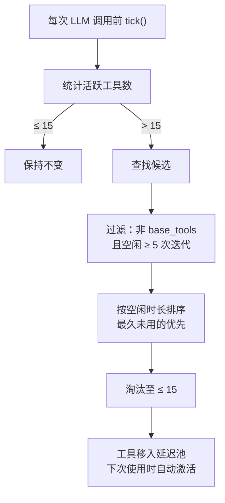
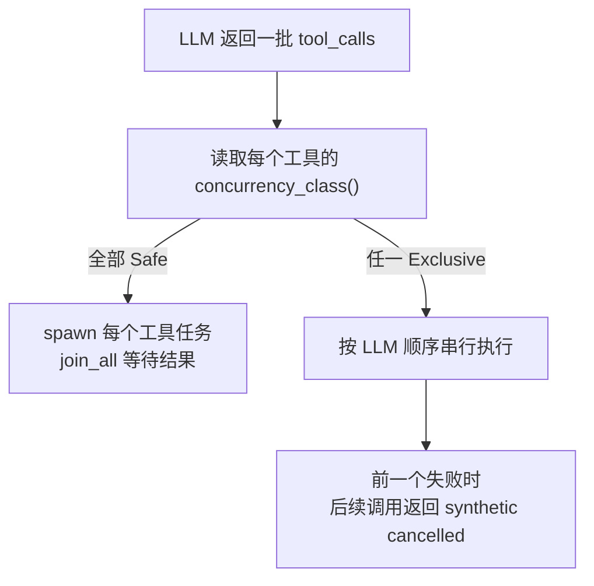

# 第 6 章：工具系统：内置工具的设计模式

> **定位**：本章深入 Agent Loop 中"行动"阶段的核心——工具系统。展示 `Tool` trait 的设计、ToolRegistry 的注册与 LRU 淘汰机制、ToolPolicy 的 deny-wins 安全语义，以及参数安全措施。前置依赖：第 5 章。适用场景：想理解 Agent 工具架构的 AI 应用开发者（读者 C），以及想为 octos 贡献新工具的开发者（读者 D）。

Agent 的"智能"来自 LLM，但 Agent 的"能力"来自工具。没有工具，Agent 只能生成文本；有了工具，Agent 可以读写文件、执行命令、搜索网页、管理 Git 仓库。当前源码里并不存在一个稳定的"总工具数"：`ToolRegistry::with_builtins_and_sandbox()` 注册 15 个基础工具，`git` 和 `code_structure` 受 Cargo feature 控制，`configure_tool` 由配置层追加，`spawn`、`message`、`send_file`、`read_task_output`、`deep_search`、`manage_skills`、`model_check` 等则由 chat、gateway、session actor 在不同运行模式下继续注入。理解这个分层注册模型，比记住一个固定数字更重要（`../octos/crates/octos-agent/src/tools/registry.rs:907-930`，`../octos/crates/octos-agent/src/tools/registry.rs:1003-1018`，`../octos/crates/octos-cli/src/commands/chat.rs:197-315`，`../octos/crates/octos-cli/src/commands/gateway/gateway_runtime.rs:615-698`，`../octos/crates/octos-cli/src/session_actor.rs:2122-2310`）。

但工具带来能力的同时也带来风险：每个工具调用都是一个潜在的攻击面。如何在开放能力的同时控制风险？octos 的答案是三道防线：ToolPolicy 控制哪些工具可用，参数验证控制输入安全，symlink-safe I/O 控制文件系统访问边界。

---

## 6.1 Tool trait：最小化的工具接口

Tool trait（`../octos/crates/octos-agent/src/tools/mod.rs:436-492`）定义了所有工具的统一接口：

```rust
pub trait Tool: Send + Sync {
    fn name(&self) -> &str;
    fn description(&self) -> &str;
    fn input_schema(&self) -> serde_json::Value;
    fn tags(&self) -> &[&str] { &[] }
    async fn execute(&self, args: &serde_json::Value) -> Result<ToolResult>;
    async fn execute_with_context(
        &self,
        _ctx: &ToolContext,
        args: &serde_json::Value,
    ) -> Result<ToolResult> { self.execute(args).await }
    fn as_any(&self) -> &dyn std::any::Any { &() }
    fn concurrency_class(&self) -> ConcurrencyClass { ConcurrencyClass::Safe }
}
```

设计上，`Tool` trait 有三层职责：

**声明部分**（`name()` + `description()` + `input_schema()`）构成 `ToolSpec`，发送给 LLM 让它知道有哪些工具可用以及如何调用。`input_schema()` 返回 JSON Schema 格式的参数描述。

**执行部分**（`execute()`）接收 LLM 传来的参数 JSON，执行实际操作，返回 `ToolResult`：

```rust
pub struct ToolResult {
    pub output: String,              // 返回给 LLM 的文本输出
    pub success: bool,               // 是否成功
    pub file_modified: Option<PathBuf>, // 修改的文件
    pub files_to_send: Vec<PathBuf>,  // 需要发送给用户的文件
    pub tokens_used: Option<TokenUsage>, // 子 Agent 工具的 token 消耗
    pub structured_metadata: Option<serde_json::Value>, // 给宿主/UI 的结构化侧信道
}
```

**集成部分** 由四个扩展点承载：`execute_with_context()` 让迁移后的工具读取 `ToolContext`，而不破坏旧的 `execute()` 签名；`tags()` 为工具打能力标签；`as_any()` 允许框架在极少数情况下向下转型访问具体工具，例如 `activate_tools` 需要在 Agent 构造完成后注入 `ToolRegistry` 回指（`../octos/crates/octos-agent/src/agent/mod.rs:384-394`）；`concurrency_class()` 则把工具标记为 `Safe` 或 `Exclusive`，供批量执行器决定并发还是串行。

`structured_metadata` 是另一个近期新增的宿主侧通道。它不会改变传统的文本输出，但允许 `run_pipeline` 这类工具把 per-node cost rows 带回 session actor，再通过 UI/API completion metadata 交给成本面板渲染（`../octos/crates/octos-agent/src/tools/mod.rs:392-415`）。

`tags()` 不只是"分类标签"。当前源码里它至少影响两层过滤：

- `ToolPolicy::require_tags` 通过 `is_allowed_with_tags()` 过滤 provider 视角可见的工具。
- `ToolRegistry::set_context_filter()` 通过上下文标签裁剪 `specs()` 输出。

这两层都把"空标签工具"视为 universal tool，也就是默认放行（`../octos/crates/octos-agent/src/tools/policy.rs:91-113`，`../octos/crates/octos-agent/src/tools/registry.rs:410-443`，`../octos/crates/octos-agent/src/tools/registry.rs:585-593`）。

还有一个容易忽略的细节：迁移期的工具上下文有两条路径。新工具可以通过 `execute_with_context()` 显式读取 `ToolContext`；旧插件仍可通过 `TOOL_CTX` task-local 读取同一份上下文。这让 trait 演进保持向后兼容，同时允许长任务工具异步上报进度、携带附件、权限、文件缓存和 subagent 路由信息（`../octos/crates/octos-agent/src/tools/mod.rs:3-30`，`../octos/crates/octos-agent/src/tools/mod.rs:214-307`，`../octos/crates/octos-agent/src/agent/execution.rs:963-1002`）。

---

## 6.2 ToolRegistry：注册与 LRU 淘汰

### 6.2.1 注册机制

ToolRegistry（`../octos/crates/octos-agent/src/tools/registry.rs:57-1018`）是工具的中央管理器。更准确地说，它不是"一次性注册所有工具"，而是提供一个**基础注册表**，然后让 chat、gateway、session actor 在此之上叠加各自需要的工具。

`with_builtins_and_sandbox()` 注册 15 个基础工具（另加两个 feature-gated 工具）：

| 工具名 | 类型 | 功能 |
|--------|------|------|
| `shell` | ShellTool | 执行 Shell 命令（带沙箱） |
| `read_file` | ReadFileTool | 读取文件内容 |
| `write_file` | WriteFileTool | 写入文件 |
| `edit_file` | EditFileTool | 编辑文件（精确替换） |
| `diff_edit` | DiffEditTool | Diff 格式编辑 |
| `glob` | GlobTool | 文件模式搜索 |
| `grep` | GrepTool | 内容搜索 |
| `list_dir` | ListDirTool | 目录列表 |
| `web_search` | WebSearchTool | 网页搜索 |
| `web_fetch` | WebFetchTool | 获取网页内容 |
| `browser` | BrowserTool | 浏览器自动化 |
| `check_workspace_contract` | CheckWorkspaceContractTool | 检查工作区契约 |
| `workspace_log` | WorkspaceLogTool | 查询工作区历史日志 |
| `workspace_show` | WorkspaceShowTool | 展示工作区记录 |
| `workspace_diff` | WorkspaceDiffTool | 比较工作区变更 |
| `git` | GitTool | Git 操作（feature: git） |
| `code_structure` | CodeStructureTool | AST 代码结构（feature: ast） |

真正的运行时注册是分层的：

| 层次 | 注册位置 | 典型工具 |
|------|----------|----------|
| 基础层 | `../octos/crates/octos-agent/src/tools/registry.rs:907-930` | `shell`、`read_file`、`web_search`、`browser`、workspace 工具 |
| 配置层 | `../octos/crates/octos-agent/src/tools/registry.rs:1003-1018` | `configure_tool`，以及带配置的 `web_search`/`web_fetch`/`browser` |
| Chat 模式追加 | `../octos/crates/octos-cli/src/commands/chat.rs:217-315` | `spawn`、`synthesize_research`、`recall_memory`、`save_memory`、`run_pipeline`、插件/MCP 工具 |
| Gateway 基础追加 | `../octos/crates/octos-cli/src/commands/gateway/gateway_runtime.rs:615-698` | 带账号目录的插件/MCP 工具、configured web/browser、provider policy |
| Per-session 追加 | `../octos/crates/octos-cli/src/session_actor.rs:2122-2310` | `read_task_output`、`message`、`send_file`、`spawn`、`cron`、per-session `run_pipeline` |

这也是为什么只看 `tools/mod.rs` 的模块导出会产生错觉：那里列出的是"框架可用的工具类型"，不是"当前进程默认已经注册的工具集合"（`../octos/crates/octos-agent/src/tools/mod.rs:575-663`）。

ToolRegistry 还做了两件容易被忽略的工作：

- `specs()` 结果会缓存，只有注册表发生变动时才失效，避免每轮都重建整份 ToolSpec 列表（`../octos/crates/octos-agent/src/tools/registry.rs:66-68`，`../octos/crates/octos-agent/src/tools/registry.rs:410-443`）。
- cwd 绑定工具和非 cwd 绑定工具被分开处理。切换到 per-user workspace 时，`rebind_cwd()` 只重建前者，后者共享原来的 `Arc<dyn Tool>`；当前 cwd-bound 集合也包含 `check_workspace_contract` 和 workspace history/diff 工具（`../octos/crates/octos-agent/src/tools/registry.rs:933-980`）。

### 6.2.2 LRU 淘汰机制

LLM 的工具调用是通过在请求中包含 ToolSpec 实现的，每个 ToolSpec 都占用上下文窗口 token。当前 octos 不是靠单一机制控制工具膨胀，而是采用了三层组合：

1. 启动时按组预延迟（`defer_group()`），先把低频工具从 `specs()` 中拿掉。
2. 运行时用 LRU 把长时间不用的非核心工具移入 `deferred` 集合。
3. 真正执行某个 deferred 工具时，再自动激活对应组，不要求 LLM 先显式调用 `activate_tools`。

其中第二层由 `ToolLifecycle` 驱动（`../octos/crates/octos-agent/src/tools/mod.rs:498-560`）：

```rust
pub struct ToolLifecycle {
    pub(crate) last_used: HashMap<String, u32>,  // 工具名 → 最后使用的迭代号
    pub(crate) iteration: u32,                   // 当前迭代计数器
    pub(crate) base_tools: HashSet<String>,      // 永不淘汰的核心工具
    pub(crate) max_active: usize,                // 默认 15
    pub(crate) idle_threshold: u32,              // 默认 5
}
```

| 参数 | 默认值 | 含义 |
|------|--------|------|
| `max_active` | 15 | 同时活跃的最大工具数 |
| `idle_threshold` | 5 | 空闲 N 次迭代后可被淘汰 |



**图 6-1：LRU 工具淘汰流程。** 被淘汰的工具不会被删除，而是移入 `deferred` 集合；`specs()` 不再暴露它们，但 registry 仍保留其实现对象。

### 6.2.3 淘汰算法源码走读

`tick()` 很简单，但它的调用位置很关键：Agent 主循环会在每轮请求 LLM 之前先 `tick()`，再 `auto_evict()`。这意味着淘汰发生在**下一轮工具声明构造之前**，而不是在工具调用结束时异步清理（`../octos/crates/octos-agent/src/agent/loop_runner.rs:703-708`，`../octos/crates/octos-agent/src/tools/registry.rs:755-797`）。

选择候选的核心逻辑在 `find_evictable()`（`../octos/crates/octos-agent/src/tools/mod.rs:547-570`）：

```rust
pub fn find_evictable(&self, active_tools: &[&str]) -> Vec<String> {
    if active_tools.len() <= self.max_active {
        return Vec::new();  // 未超限，不淘汰
    }

    let mut candidates: Vec<(&str, u32)> = active_tools.iter()
        .filter(|name| !self.base_tools.contains(**name))   // 排除核心工具
        .map(|name| (*name, self.last_used.get(*name).copied().unwrap_or(0)))
        .filter(|(_, last)| self.iteration.saturating_sub(*last) >= self.idle_threshold)
        .collect();                                          // 只取空闲 ≥ 5 的

    candidates.sort_by_key(|(_, last)| *last);              // 最旧的优先淘汰
    let to_evict = active_tools.len().saturating_sub(self.max_active);
    candidates.into_iter().take(to_evict)                   // 只淘汰超出部分
        .map(|(name, _)| name.to_string()).collect()
}
```

三个关键设计选择：

**`base_tools` 过滤。** `shell`、`read_file` 等核心工具永远不是淘汰候选——即使所有 15 个槽位都被核心工具占满。

**`idle_threshold` 保护。** 只有空闲 ≥ 5 次迭代的工具才被考虑。这防止了"刚用完就被淘汰"的抖动。

**最小淘汰量。** 只淘汰 `active_count - max_active` 个——恰好让活跃数降回 15，而非激进清理所有候选。

**被淘汰的工具去哪了？** `ToolRegistry::auto_evict()` 会把这些名字写入 `deferred` 集合，并让 `specs()` 缓存失效（`../octos/crates/octos-agent/src/tools/registry.rs:763-797`）。

**重新激活发生在哪里？** 不是一个单独的 `activate_on_demand()` 方法，而是直接写在 `ToolRegistry::execute_with_context()` 里：如果要执行的工具当前在 `deferred` 集合中，就先找到其所属分组并调用 `activate()`，然后再进入参数检查和实际执行（`../octos/crates/octos-agent/src/tools/registry.rs:823-897`）。

**`activate_tools` 的角色是什么？** 它是一个可选的"元工具"，用于把 deferred 工具列表显式展示给 LLM 并支持批量加载，不是自动激活的唯一入口。只有在 registry 里确实存在 deferred 工具时，gateway/profile factory 才会注册它；注册之后还要在 Agent 构造完成后调用 `wire_activate_tools()` 填回 `ToolRegistry` 的弱引用（`../octos/crates/octos-cli/src/commands/gateway/gateway_runtime.rs:1025-1050`，`../octos/crates/octos-cli/src/commands/gateway/profile_factory.rs:743-755`，`../octos/crates/octos-agent/src/tools/activate_tools.rs:8-107`，`../octos/crates/octos-agent/src/agent/mod.rs:384-394`，`../octos/crates/octos-cli/src/session_actor.rs:2499-2500`）。

**LRU 状态是 per-session 的。** 在 Gateway/Serve 模式下，每个 session actor 持有自己的 ToolRegistry（详见第 11 章），LRU 计数器在会话之间完全独立。

**`spawn_only` 和 deferred 是两套不同语义。** `spawn_only` 不是 LRU 延迟池的一部分。PluginLoader 只是给工具打上 `spawn_only` 标记；注释里还保留了早期"hidden from specs"的说法，但当前实现明确**不 defer**，而是让工具继续对 LLM 可见，由执行循环在调用点自动后台化（`../octos/crates/octos-agent/src/plugins/loader.rs:145-176`，`../octos/crates/octos-agent/src/plugins/loader.rs:362-456`）。

主会话里如果命中 `spawn_only`，`agent/execution.rs` 会先执行 provider policy 拦截，然后注册 supervised background task，并优先向 LLM 返回一个小型 `task_handle` JSON envelope；只有当 `read_task_output` 当前不可见时，才退回旧式文本消息。完整输出仍由 `SubAgentOutputRouter`/`BackgroundResultSender` 送到 UI，LLM 若要查看中间结果，应调用 `read_task_output(task_handle, mode=...)`，避免把大段后台输出重新塞回上下文（`../octos/crates/octos-agent/src/agent/execution.rs:220-307`，`../octos/crates/octos-agent/src/agent/execution.rs:924-960`，`../octos/crates/octos-agent/src/tools/registry.rs:165-209`，`../octos/crates/octos-cli/src/session_actor.rs:2122-2139`）。

而在 subagent 场景里，`SpawnTool` 会主动 `clear_spawn_only()`，让这些工具按普通工具同步执行，因为子代理本身就已经是后台上下文（`../octos/crates/octos-agent/src/tools/spawn.rs:2148-2150`，`../octos/crates/octos-agent/src/tools/spawn.rs:2453-2455`）。

还有一个实现层面的细节值得注意：gateway 在 base registry 上先把 `message`、`send_file`、`spawn`、`activate_tools` 这些名字加入 `base_tools`，虽然这些工具实例要等到 session actor 内部才真正注册。这样做依赖的是 `ToolLifecycle` 的"按名称 pin 住"语义，以及 `snapshot_excluding()` 会把 base set 复制到子 registry，从而让后续 per-session 注入的这些工具天然不会被 LRU 淘汰；`read_task_output` 则在 session actor 注册后再追加进 base set，确保 `task_handle` envelope 指向的读取工具不会在长会话中被淘汰（`../octos/crates/octos-cli/src/commands/gateway/gateway_runtime.rs:1001-1023`，`../octos/crates/octos-agent/src/tools/registry.rs:595-640`，`../octos/crates/octos-cli/src/session_actor.rs:2122-2139`）。

### 6.2.4 并发调度：Safe 并发，Exclusive 串行

工具系统现在还把"能不能并发执行"提升为 trait 级语义。`ConcurrencyClass::Safe` 表示只读或无副作用工具，可以和其他 Safe 工具并发；`ConcurrencyClass::Exclusive` 表示会写文件、启动 shell、更新状态或有其它可观察副作用，必须串行执行（`../octos/crates/octos-agent/src/tools/mod.rs:392-492`）。

Agent 收到一批 tool calls 后，会先检查这一批里是否存在 Exclusive 工具：



这比"所有工具都并发"更保守，也比"所有工具都串行"更高效。文件读取、搜索等 Safe 工具仍可并行；涉及写入、shell、状态变更的工具则通过 Exclusive 防止同一 turn 内互相踩踏（`../octos/crates/octos-agent/src/agent/execution.rs:1192-1272`）。

---

## 6.3 ToolPolicy：deny-wins 安全语义

ToolPolicy（`../octos/crates/octos-agent/src/tools/policy.rs:26-224`）控制哪些工具可用、哪些被禁止。当前实现不只是 allow/deny 两列，而是三维策略：

```rust
pub struct ToolPolicy {
    pub allow: Vec<String>,
    pub deny: Vec<String>,
    pub require_tags: Vec<String>,
}
```

其中 `allow` / `deny` 决定名字级别可见性，`require_tags` 决定标签级别可见性；两者组合时仍然遵循 deny-wins，并且 deny 会带上 `policy_deny` 或 `robot_tier_gate` 这类 metrics reason（`../octos/crates/octos-agent/src/tools/policy.rs:26-118`）。

### 6.3.1 deny-wins 规则

```rust
pub fn is_allowed(&self, tool_name: &str) -> bool {
    // 1. 先检查 deny 列表——deny 始终优先
    for entry in &self.deny {
        if entry_matches(entry, tool_name) {
            return false;
        }
    }
    // 2. 空 allow 列表 = 允许所有未被 deny 的工具
    if self.allow.is_empty() {
        return true;
    }
    // 3. 非空 allow 列表 = 只允许列表中的工具
    self.allow.iter().any(|entry| entry_matches(entry, tool_name))
}
```

deny-wins 意味着：如果一个工具同时出现在 allow 和 deny 列表中，它会被禁止。这是安全策略的基本原则——明确禁止的规则不应被任何允许规则覆盖。

### 6.3.2 通配符与分组

策略支持三种匹配扩展：

**通配符**：`web_*` 匹配 `web_search`、`web_fetch`。只支持尾部通配符（前缀匹配）。

**分组**：`group:fs` 展开为 `["read_file", "write_file", "edit_file", "diff_edit"]`。

**标签要求**：当 `require_tags` 非空时，工具必须至少命中一个要求标签；但空标签工具仍然放行，作为"通用工具"存在（`../octos/crates/octos-agent/src/tools/policy.rs:91-113`）。

当前预定义分组包括：

| 分组 | 包含工具 |
|------|---------|
| `group:fs` | read_file, write_file, edit_file, diff_edit |
| `group:runtime` | shell |
| `group:web` | web_search, web_fetch, browser |
| `group:search` | glob, grep, list_dir |
| `group:sessions` | spawn |
| `group:memory` | recall_memory, save_memory |
| `group:research` | deep_search, synthesize_research, deep_crawl |
| `group:admin` | manage_skills, configure_tool, model_check |
| `group:media` | mofa_comic, mofa_slides, mofa_infographic, mofa_cards, fm_tts, fm_voice_list |
| `group:delegated` | delegate_task, spawn, send_message, message, save_memory, execute_code |

这里有个容易误解的点：分组是**全局策略词汇表**，不是"当前模式下肯定已经注册的工具表"。例如 `group:admin` 里同时列了 `manage_skills`、`configure_tool`、`model_check`，但在 chat 模式里通常只有 `configure_tool`，在 gateway 模式才可能同时具备三者。`group:delegated` 则是 delegate child 的 canonical deny list，用来阻断再委派、后台 spawn、用户消息、memory write 和任意代码执行这类越权面。`defer_group()` 和 `activate()` 都会先检查工具名是否真的存在于当前 registry，不存在的名字会被静默跳过（`../octos/crates/octos-agent/src/tools/policy.rs:153-224`，`../octos/crates/octos-agent/src/tools/registry.rs:656-690`）。

### 6.3.3 Provider 级策略

当前配置字段不是 `tools.byProvider`，而是顶层的 `tool_policy_by_provider`。它按"精确 model ID 优先，其次 provider 名"做匹配（`../octos/crates/octos-cli/src/config.rs:62-69`，`../octos/crates/octos-cli/src/commands/chat.rs:688-701`）。例如：

```json
{
  "tool_policy_by_provider": {
    "claude-sonnet-4-20250514": {
      "deny": ["browser", "deep_search"]
    },
    "gemini": {
      "allow": ["group:fs", "group:search"],
      "require_tags": ["code"]
    }
  }
}
```

这里要区分两套 API：

- `apply_policy()` 是"硬裁剪"。它直接 `retain()`，把不允许的工具从 registry 里物理删除。
- `set_provider_policy()` 是"软过滤"。工具对象仍然保留，但 `specs()` 会把它们藏起来，`execute()` 也会再次检查并拒绝调用。

这种分层很重要：全局配置里的 `tool_policy` 适合做系统级最小权限，`tool_policy_by_provider` 则适合针对不同模型做差异化曝光，而不破坏底层 registry 的完整性。`retain()` 还会同步清理 stale `spawn_only`、`spawn_only_messages` 和 `deferred` 状态，避免策略裁剪后还残留后台化或激活入口（`../octos/crates/octos-agent/src/tools/registry.rs:460-498`，`../octos/crates/octos-agent/src/tools/registry.rs:567-582`，`../octos/crates/octos-agent/src/tools/registry.rs:839-896`）。

---

## 6.4 参数安全：1MB 限制与非分配估算

### 6.4.1 1MB 参数大小限制

工具调用的参数大小被限制在 1MB（`../octos/crates/octos-agent/src/tools/registry.rs:876-886`）：

```rust
const MAX_ARGS_SIZE: usize = 1_048_576; // 1 MB
```

这防止了 LLM 生成巨大的参数（比如将整个文件内容作为 `edit_file` 的参数），避免内存耗尽或下游处理超时。

### 6.4.2 estimate_json_size：零分配的大小估算

参数大小检查不通过 `serde_json::to_string()` 序列化后计算长度，而是通过递归遍历 JSON 值树估算大小（`../octos/crates/octos-agent/src/tools/registry.rs:26-54`）：

```rust
fn estimate_json_size(value: &serde_json::Value) -> usize {
    match value {
        serde_json::Value::Null => 4,
        serde_json::Value::Bool(true) => 4,
        serde_json::Value::Bool(false) => 5,
        serde_json::Value::Number(n) => n.to_string().len(),
        serde_json::Value::String(s) => {
            let escapes = s.bytes()
                .filter(|&b| matches!(b, b'\"' | b'\\' | b'\n' | b'\r' | b'\t'))
                .count();
            s.len() + escapes + 2
        }
        serde_json::Value::Array(arr) => {
            2 + arr.iter().map(estimate_json_size).sum::<usize>() + arr.len().saturating_sub(1)
        }
        serde_json::Value::Object(obj) => {
            2 + obj.iter().map(|(k, v)| k.len() + 3 + estimate_json_size(v)).sum::<usize>()
                + obj.len().saturating_sub(1)
        }
    }
}
```

这个估算是 O(N) 时间、O(depth) 栈空间——不做堆分配，只遍历已有的 JSON 树。对于 1MB 级别的检查，精确到字节的准确性不重要，量级正确即可。

### 6.4.3 Symlink-safe I/O：O_NOFOLLOW

文件系统防护其实分成两层：

- `resolve_path()` 只做**路径规范化和 `..`/绝对路径阻断**，不访问文件系统，也不解决符号链接。
- 真正的文件读写则交给 `read_no_follow()` / `write_no_follow()`，在 Unix 上通过 `O_NOFOLLOW` 原子地拒绝符号链接；目录类操作如 `list_dir` 才会单独使用 `reject_symlink()` 做防御补丁。

对应实现见 `../octos/crates/octos-agent/src/tools/mod.rs:680-813`。文件读写工具本身只是调用这些 helper，例如 `read_file` 在解析完路径后走 `read_no_follow()`（`../octos/crates/octos-agent/src/tools/read_file.rs:97-150`），`write_file` / `edit_file` 则分别调用 `write_no_follow()`（`../octos/crates/octos-agent/src/tools/write_file.rs:86-107`，`../octos/crates/octos-agent/src/tools/edit_file.rs:90-138`）。

在 Unix 平台上，关键代码只有一行：

```rust
// Unix 平台
opts.custom_flags(libc::O_NOFOLLOW);
```

`O_NOFOLLOW` 让 `open()` 系统调用在目标是符号链接时直接返回 `ELOOP` 错误，而不是跟随链接打开目标文件。这消除了 TOCTOU（Time-of-Check-Time-of-Use）竞态条件：

没有 `O_NOFOLLOW` 的场景：
1. 检查 `/workspace/config.json` 是否在允许范围内 ✓
2. 攻击者将 `/workspace/config.json` 替换为指向 `/etc/passwd` 的符号链接
3. 打开 `/workspace/config.json`，实际读取了 `/etc/passwd`

有 `O_NOFOLLOW`：
1. 打开 `/workspace/config.json`，如果是符号链接，立即返回 `ELOOP` ✗

检查和打开合并为一个原子操作，消除了竞态窗口。

---

> ### 工程决策侧栏：为什么是"预延迟 + LRU"的混合策略
>
> 工具管理有三种策略可选：
>
> **方案一：全量注册（所有工具始终可见）**
>
> 优势：
> - 简单——不需要淘汰逻辑
> - LLM 始终能调用任何工具
>
> 劣势：
> - 30+ 工具的 ToolSpec 可能消耗 3,000-5,000 token 的上下文窗口
> - 对于 128K 窗口的模型，5,000 token 的工具声明占比虽小，但对于 8K 窗口的小模型是不可接受的
> - 过多选项可能导致 LLM 选择困难（"工具过载"）
>
> **方案二：纯手动按需加载（只有 `activate_tools`，没有自动激活）**
>
> 优势：
> - 最节省上下文窗口
>
> 劣势：
> - LLM 无法请求它不知道的工具，需要额外的发现机制
> - 很容易出现"先猜一个不存在的工具名，再被迫重试"的额外轮次
>
> **方案三：预延迟 + LRU + 自动激活（当前 octos 的选择）**
>
> Gateway/ProfileFactory 在初始可见工具过多时，会先把 `admin`、`sessions`、`web`、`runtime`、`media` 等低频分组预先 `defer_group()`；这样进入第一轮 LLM 调用前，工具面板就已经被压缩到较小规模（`../octos/crates/octos-cli/src/commands/gateway/gateway_runtime.rs:1025-1050`，`../octos/crates/octos-cli/src/commands/gateway/profile_factory.rs:743-755`）。
>
> 接下来，运行中的 `tick() + auto_evict()` 再负责回收长期闲置的非核心工具；如果 LLM 直接请求了一个 deferred 工具，`execute()` 会自动把它所属的整组重新激活。`activate_tools` 仍然保留，但它更像一个"批量发现和预热工具"，而不是唯一通道。
>
> 这套混合策略的关键，不是把一切都藏起来，而是尽量减少"为了解锁工具而多跑一轮模型"的概率。

---

## 6.5 本章回顾

工具系统是 Agent 能力的载体：

1. **Tool trait**：`name()`/`description()`/`input_schema()` 构成 LLM 可见的 ToolSpec，`execute()`/`execute_with_context()` 执行实际操作，`tags()`/`as_any()`/`concurrency_class()` 则承担过滤、框架集成与并发 admission 这几类扩展职责。

2. **ToolRegistry**：真正的重点不是固定工具数量，而是分层注册。基础 registry、配置注入、chat/gateway 追加、per-session 追加共同决定当前模式下的工具面。

3. **工具曝光控制**：当前实现是"预延迟 + LRU + 自动激活"的混合模型，不是单纯的 LRU。`activate_tools` 是显式发现入口，但直接执行 deferred 工具也会自动唤醒对应分组；`spawn_only` 不属于 deferred，而是主会话自动后台化并通过 `task_handle`/`read_task_output` 做上下文隔离。

4. **ToolPolicy**：deny-wins 语义确保安全策略不被覆盖。除了 allow/deny，还支持 `require_tags`。`apply_policy()` 和 `set_provider_policy()` 分别对应硬裁剪与软过滤。

5. **参数与文件安全**：1MB 大小限制 + 零分配估算防止 DoS。路径规范化负责阻断 traversal，`O_NOFOLLOW` 负责原子拒绝符号链接，从而消除读写文件时的 TOCTOU 竞态。

下一章将深入安全体系的其他层次——从沙箱隔离到 prompt 注入防御（详见第 7 章）。

---

## 延伸阅读

- **JSON Schema**：https://json-schema.org/ — 理解 `input_schema()` 返回的工具参数描述格式
- **TOCTOU 竞态**：CWE-367 "Time-of-check Time-of-use" — 理解 `O_NOFOLLOW` 防御的攻击模式
- **LLM 工具调用**：Anthropic "Tool use" 文档 — 理解 LLM 如何选择和调用工具
- **LRU 缓存算法**：经典的最近最少使用淘汰策略

## 思考题

1. **工具声明的 token 成本**：假设每个 ToolSpec 平均消耗 150 token，15 个活跃工具消耗 2,250 token。如果上下文窗口只有 8K token，工具声明就占了 28%。你会如何进一步压缩 ToolSpec 的 token 占用？

2. **deny-wins 的局限**：deny-wins 策略能防止工具被直接调用，但如果 Agent 通过 `shell` 工具执行 `curl` 命令来替代被禁的 `web_fetch`，策略就被绕过了。你会如何应对这种间接调用？

3. **自定义工具的安全审查**：如果用户通过 MCP 或 Plugin 添加自定义工具，这些工具不受 octos 的 `O_NOFOLLOW` 保护。你会如何设计一个工具沙箱来隔离第三方工具？

---

> **版本演化说明**
> 本章按当前源码撰写。阅读后续版本时，优先核对 `../octos/crates/octos-agent/src/tools/registry.rs:907-1018`、`../octos/crates/octos-cli/src/commands/chat.rs:197-315`、`../octos/crates/octos-cli/src/commands/gateway/gateway_runtime.rs:615-698`、`../octos/crates/octos-cli/src/commands/gateway/gateway_runtime.rs:1001-1068` 和 `../octos/crates/octos-cli/src/session_actor.rs:2122-2310` 这几处真实注册点，而不是只看 `tools/mod.rs` 的导出列表。工具类型会继续扩展，但"分层注册、软硬两级策略、预延迟与运行时激活并存"这三条主线更稳定。
