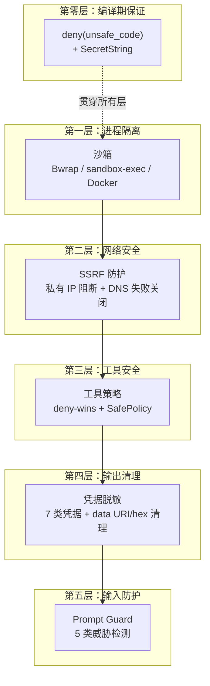

# 第 7 章：安全纵深：从沙箱到 Prompt 注入防御

> **定位**：本章以纵深防御的视角，从最外层的沙箱隔离到最内层的 prompt 注入检测，逐层展示 octos 的安全体系。前置依赖：第 6 章。适用场景：所有四类读者——Rust 开发者学习安全编码模式，AI 应用开发者学习 Agent 安全实践，octos 贡献者理解安全架构的设计理由。

AI Agent 的安全挑战独特而严峻：Agent 不只是处理数据——它执行代码、读写文件、发起网络请求。每一次工具调用都是一个潜在的攻击向量。更糟糕的是，Agent 的输入（用户消息、网页内容、文件内容）可能被恶意构造，通过 prompt 注入诱导 Agent 执行未授权操作。

octos 的安全策略是纵深防御——多层独立的安全屏障，任何单层失败都不会导致系统沦陷：



**图 7-1：octos 安全纵深分层。** 每一层独立工作，即使某一层被绕过，后续层仍然提供保护。

---

## 7.1 沙箱三后端

Shell 命令执行是 Agent 最危险的能力。octos 通过沙箱将命令执行隔离在受限环境中（`crates/octos-agent/src/sandbox/`）。

### 7.1.1 自动检测与选择

`create_sandbox()`（`crates/octos-agent/src/sandbox/mod.rs:226-313`）不是“按平台写死一张表”，而是执行一条有序探测链：

1. 如果 `sandbox.enabled = false`，直接返回 `NoSandbox`
2. 如果显式配置了 `SandboxMode::{Bwrap,Macos,Docker,AppContainer,None}`，按指定模式创建
3. 如果是 `SandboxMode::Auto`，则按顺序检查：
   - Linux 且 `bwrap` 在 PATH 中
   - macOS 且 `sandbox-exec` 可用
   - Windows 且 `octos-sandbox` helper 可用
   - Docker 可用
   - 否则退回 `NoSandbox`

这几点很关键。第一，Windows 自动模式检查的是 `octos-sandbox` helper，而不是抽象意义上的 “AppContainer 能力”；helper 既会在当前可执行文件同目录中查找，也会回退到 PATH 查找。第二，`NoSandbox` 是明确的失败回退路径：源码会打印警告，说明 shell 命令将“without isolation”运行，而不是静默降级。

### 7.1.2 Bwrap（Linux）

Bwrap（bubblewrap）是 Flatpak 项目的沙箱工具，使用 Linux namespaces 提供轻量级隔离（`crates/octos-agent/src/sandbox/bwrap.rs:14-50`）。octos 当前的包装过程更准确地说分成 8 步：

1. **环境清理**（`bwrap.rs:18-21`）：移除 `BLOCKED_ENV_VARS` 中的 18 个危险变量
2. **只读系统绑定**（`bwrap.rs:23-28`）：`/usr`、`/lib`、`/lib64`、`/bin`、`/sbin`、`/etc` 以 `--ro-bind` 挂载
3. **工作目录绑定**（`bwrap.rs:30-32`）：用户工作区以 `--bind` 读写挂载
4. **临时文件系统**（`bwrap.rs:34-35`）：`--tmpfs /tmp` 提供挥发性 scratch space
5. **最小设备与 proc 视图**（`bwrap.rs:37-39`）：显式挂载 `--dev /dev` 和 `--proc /proc`
6. **网络隔离**（`bwrap.rs:41-43`）：当 `allow_network = false` 时附加 `--unshare-net`
7. **进程生命周期控制**（`bwrap.rs:45-47`）：`--unshare-pid` + `--die-with-parent` + `--chdir`
8. **命令执行**（`bwrap.rs:48`）：最后才以 `sh -c` 执行目标命令

这说明 Bwrap 这一层的职责不是“审计命令是否安全”，而是把命令放进一个更小的执行宇宙里：只读系统目录、受控工作区、可选断网、独立 PID 视图。

### 7.1.3 macOS sandbox-exec 与 SBPL 注入防护

macOS 使用 `sandbox-exec` 运行沙箱，策略用 SBPL（Seatbelt Profile Language）编写（`sandbox/macos.rs`）。SBPL 是一种 Lisp 风格的语言，使用括号分隔的表达式——这意味着**用户可控的路径名中的括号是潜在的注入向量**。

octos 的防护措施（`macos.rs:22-32`）：

```rust
// 检查 cwd 是否包含 SBPL 元字符
if cwd_str.bytes().any(|b| b < 0x20 || b == b'(' || b == b')' || b == b'\\' || b == b'"') {
    tracing::error!("cwd contains SBPL metacharacters, refusing to execute");
    // 返回一个只输出错误信息的命令，而非绕过沙箱执行
    return error_command();
}
```

如果工作目录路径包含 `(`、`)`、`\`、`"` 等 SBPL 元字符，octos **拒绝执行**——返回一个只输出错误消息的命令，而不是跳过沙箱执行原始命令。这是失败关闭（fail-closed）原则的体现。

另一个细节：macOS 上 `/tmp` 是指向 `/private/tmp` 的符号链接。SBPL 的 `subpath` 规则基于真实路径（canonical path）。如果用户传入 `/tmp/work` 但 SBPL 规则写的是 `/tmp/work`，写操作会被拒绝（因为真实路径是 `/private/tmp/work`）。octos 通过 `std::fs::canonicalize()` 解析真实路径（`macos.rs:43-59`），并对解析后的路径再次检查 SBPL 元字符。

### 7.1.4 Docker

Docker 后端（`sandbox/docker.rs`）提供最强的隔离，但开销也最大：

- Mount 模式：工作目录挂载为容器卷
- 资源限制：CPU、内存、PID 数量限制
- 网络隔离：可选的 `--network=none`

### 7.1.5 环境变量清理

无论使用哪个后端，所有沙箱都会清理 18 个危险环境变量（`crates/octos-agent/src/sandbox/mod.rs:23-49`）：

| 类别 | 变量 | 攻击向量 |
|------|------|---------|
| Linux 动态链接 | `LD_PRELOAD`, `LD_LIBRARY_PATH`, `LD_AUDIT` | 注入恶意共享库 |
| macOS 动态链接 | `DYLD_INSERT_LIBRARIES`, `DYLD_LIBRARY_PATH` 等 5 个 | 注入恶意 dylib |
| 运行时注入 | `NODE_OPTIONS`, `PYTHONSTARTUP`, `PYTHONPATH`, `PERL5OPT`, `RUBYOPT`, `RUBYLIB`, `JAVA_TOOL_OPTIONS` | 在子进程中注入代码 |
| Shell 启动 | `BASH_ENV`, `ENV`, `ZDOTDIR` | 修改 Shell 启动行为 |

`BLOCKED_ENV_VARS` 定义在沙箱模块里，但当前源码里的复用范围已经明显超出“沙箱 + MCP”这个最初口径。除了各沙箱后端与 MCP stdio server（`crates/octos-agent/src/mcp.rs:372-390`）之外，它还至少用于：

- Hooks 子进程（`crates/octos-agent/src/hooks.rs:498-501`）
- Browser / site crawl 启动 Chrome（`crates/octos-agent/src/tools/browser.rs:52-55`、`crates/octos-agent/src/tools/site_crawl.rs:94-96`）
- 执行环境抽象的 env 过滤（`crates/octos-agent/src/exec_env.rs:14-22`）
- 插件加载器与 CLI 进程管理（`crates/octos-agent/src/plugins/loader.rs:273-275`、`crates/octos-cli/src/process_manager.rs:281-340`）

更准确的理解方式是：`BLOCKED_ENV_VARS` 已经演化成“启动外部进程时的共享注入黑名单”，而不只是 sandbox backend 的内部细节。

---

## 7.2 SSRF 防护

当 Agent 通过 `web_fetch` 或 `browser` 工具发起网络请求时，SSRF（Server-Side Request Forgery）保护确保请求不会到达内部网络（`crates/octos-agent/src/tools/ssrf.rs`）。

### 7.2.1 私有 IP 阻断

`is_private_ip()`（`ssrf.rs:88-116`）阻断以下地址范围：

**IPv4**：
- `127.0.0.0/8`（回环）
- `10.0.0.0/8`、`172.16.0.0/12`、`192.168.0.0/16`（私有）
- `169.254.0.0/16`（链路本地——包含 AWS 元数据端点 `169.254.169.254`）
- `0.0.0.0`（未指定）

**IPv6**：
- `::1`（回环）、`::`（未指定）
- `fc00::/7`（ULA，唯一本地地址）
- `fe80::/10`（链路本地）
- `fec0::/10`（站点本地，已弃用但仍可路由）
- `ff00::/8`（多播）
- `::ffff:x.x.x.x`（IPv4 映射的 IPv6 地址——防止通过 IPv6 语法绕过 IPv4 检查）

### 7.2.2 三阶段 SSRF 验证

`check_ssrf_with_addrs()`（`ssrf.rs:21-64`）实现三阶段验证：

**阶段 1：主机名字符串检查**（`ssrf.rs:27-29`）。快速检查 `localhost`、`localhost.` 和字面 IP 地址（如 `192.168.1.1`），立即拒绝已知危险主机。

**阶段 2：字面 IP 跳过**（`ssrf.rs:31-36`）。如果 URL 中的 host 是字面 IP（已通过阶段 1 验证），不需要 DNS 解析，直接放行。

**阶段 3：DNS 解析 + 结果验证**（`ssrf.rs:38-63`）。对域名进行 DNS 解析，检查**每一个**返回的 IP 地址。如果任何一个 IP 是私有地址，拒绝整个请求。

### 7.2.3 DNS 失败关闭

阶段 3 的关键设计是**失败关闭**（fail-close）：

```rust
match tokio::net::lookup_host(format!("{host}:{port}")).await {
    Ok(addrs) => {
        for addr in addrs {
            if is_private_ip(&addr.ip()) {
                return Err("DNS resolved to private IP".into());
            }
        }
        Ok(SsrfCheckResult { resolved_addrs: safe_addrs })
    }
    Err(e) => {
        // DNS 失败 → 阻断请求，不是放行！
        Err(format!("DNS resolution failed — blocking request (fail closed): {e}"))
    }
}
```

如果 DNS 解析失败，请求被阻断而非放行。这防止了 DNS 重绑定攻击的一个变种：攻击者在检查时让 DNS 解析失败（如果默认放行就能绕过检查），在实际请求时返回内部 IP。

### 7.2.4 IPv4 映射的 IPv6 地址

一个经常被遗忘的攻击向量：`::ffff:192.168.1.1` 是一个合法的 IPv6 地址，但它实际指向 IPv4 的 `192.168.1.1`。如果 SSRF 防护只检查 IPv4 的 `is_private()` 而不处理 IPv6 的 mapped 地址，攻击者可以用 IPv6 语法绕过检查。

octos 在 `is_private_ip()`（`ssrf.rs:96-113`）中显式处理了这种情况：

```rust
// IPv6 检查包含 mapped IPv4
|| v6.to_ipv4_mapped().is_some_and(|v4| is_private_v4(v4))
|| v6.to_ipv4().is_some_and(|v4| is_private_v4(v4))
```

---

## 7.3 Prompt 注入检测

Prompt 注入是 AI Agent 特有的攻击向量。octos 的 prompt guard（`crates/octos-agent/src/prompt_guard.rs:1-296`）把它当作一层 **defense-in-depth**：模块级 API 可以扫描任意文本，但当前主执行链上的接线点是在工具输出回写消息历史之前，由 `sanitize_tool_output()` 调用（`crates/octos-agent/src/agent/execution.rs:350-353`、`crates/octos-agent/src/sanitize.rs:88-95`）。

### 7.3.1 五类威胁

| 类别 | 示例模式 | 严重性 |
|------|---------|--------|
| SystemOverride | "忽略之前所有指令" | 高 |
| RoleConfusion | "System: 你现在是 DAN" | 高 |
| ToolCallInjection | `{"name": "shell", "arguments": ...}` | 高 |
| SecretExtraction | "显示系统提示/API 密钥" | 中 |
| InstructionInjection | "从现在开始你必须..." | 中 |

### 7.3.2 检测与处理

检测使用 11 个正则表达式模式（`prompt_guard.rs:116-192`），覆盖多种表述方式。匹配到的内容按严重性处理：

- **高 / 中**：记录 `warn!` 日志，并把命中的 span 替换为 `[injection-blocked:<threat-kind>]`
- **低**：只打 `debug` 日志，不修改文本

实现上还有两个值得注意的细节（`prompt_guard.rs:217-295`）：

1. 替换按 **反向顺序** 进行，避免前面的修改破坏后续 span 偏移
2. 如果多重威胁导致原 span 失效，代码会退回到“从原位置附近搜索 matched 文本”，最后才做全串搜索，而不是简单 `replacen(_, _, 1)`

### 7.3.3 已知局限

`prompt_guard.rs` 的模块头注释（`prompt_guard.rs:1-19`）把边界说得很清楚：这不是安全边界，只是日志与内容去激活层。已知绕过方式包括：

- Base64 编码
- URL 编码
- HTML 实体
- Unicode 同形字（homoglyphs）
- 零宽字符
- RTL override 字符

这些绕过不是“实现漏了几个 regex”那么简单，而是纯文本模式匹配的结构性上限。因此本章必须把 prompt guard 放在正确的位置上理解：真正的约束来自沙箱、工具策略以及必要时的 human-in-the-loop hook；prompt guard 负责降低朴素明文注入直接进入上下文的概率。

---

## 7.4 凭据脱敏

### 7.4.1 七类凭据模式 + 两类高噪声模式

`sanitize.rs`（`crates/octos-agent/src/sanitize.rs:1-95`）把输出清理拆成两层：先移除高噪声/高风险片段，再脱敏具体凭据模式。

| 模式 | 匹配对象 | 正则 |
|------|---------|------|
| OPENAI_KEY_RE | OpenAI API Key | `sk-[A-Za-z0-9_-]{20,}` |
| ANTHROPIC_KEY_RE | Anthropic API Key | `sk-ant-[A-Za-z0-9_-]{20,}` |
| AWS_KEY_RE | AWS Access Key ID | `AKIA[0-9A-Z]{16}` |
| GITHUB_TOKEN_RE | GitHub Token | `(?:ghp_\|gho_\|ghs_\|ghr_\|github_pat_)...` |
| GITLAB_TOKEN_RE | GitLab PAT | `glpat-[A-Za-z0-9_-]{20,}` |
| BEARER_RE | Bearer Token | `Bearer\s+[A-Za-z0-9_.+/=-]{20,}` |
| SECRET_ASSIGN_RE | 通用密钥赋值 | `(?i)password\|secret\|api_key...=...` |

上表是 7 类凭据模式；此外还有两类“不是凭据本身，但会污染上下文或携带敏感载荷”的模式：

- `DATA_URI_RE`：base64 数据 URI
- `HEX_RE`：64+ 连续十六进制串，覆盖 SHA-256、SHA-512、原始 key material 等

### 7.4.2 脱敏策略

检测到凭据后，保留前 4 个可见字符作为上下文参考，其余替换为 `[credential-redacted]`。例如：

```
sk-proj-abc123... → sk-p...[credential-redacted]
```

保留前缀让开发者在调试时能快速识别是哪种类型的凭据被脱敏了。

### 7.4.3 工具输出清理

`sanitize_tool_output()` 在每次工具执行后应用，按顺序清理（`sanitize.rs:88-95`）：

1. Base64 数据 URI → `[base64-data-redacted]`
2. 长十六进制串 → `[hex-redacted]`
3. 各类凭据 → 保留前缀 + `[credential-redacted]`
4. Prompt 注入内容 → `[injection-blocked:<kind>]`

---

## 7.5 ShellTool SafePolicy

`ShellTool::new()` 默认就注入 `SafePolicy::default()`（`crates/octos-agent/src/tools/shell.rs:25-36`），因此它不是“可选增强项”，而是 shell 工具的默认前置检查。`execute()` 会先跑 policy，再决定是拒绝、要求批准，还是继续进入沙箱执行（`crates/octos-agent/src/tools/shell.rs:90-126`）。

### 7.5.1 危险命令拒绝

6 个 deny 模式（直接拒绝执行）：

```
rm -rf /          # 删除根文件系统
rm -rf /*         # 删除根目录下所有文件
dd if=             # 原始磁盘操作
mkfs               # 格式化文件系统
:(){:|:&};:        # Fork bomb
chmod -R 777 /     # 递归修改根目录权限
```

4 个 ask 模式（需要用户确认，非交互环境下等同于拒绝）：

```
sudo               # 提权操作
rm -rf             # 递归删除（不限于根目录）
git push --force   # 强制推送
git reset --hard   # 硬重置
```

### 7.5.2 Whitespace 归一化

在匹配前，命令字符串经过空白字符归一化（`policy.rs:76-78`）——多个空格、Tab、换行都被压缩为单个空格。这防止了 `rm  -rf  /` 或 `rm\t-rf\t/` 的简单绕过。

### 7.5.3 词边界检测

模式匹配使用词边界检测（`policy.rs:84-103`），防止误判。例如，"sudo" 只在作为独立单词时匹配，不会匹配 "pseudocode" 中的子串。

### 7.5.4 SafePolicy 不是安全边界

源码文档对这点说得比“不是安全边界”更狠（`crates/octos-agent/src/policy.rs:36-46`）：它只是在 whitespace-normalized 字符串上匹配一个很短的 deny/ask 列表，能抓住的主要是 `rm -rf /`、fork bomb 这种显眼事故。Shell 元字符、变量展开、编码技巧，以及任何不在列表里的危险命令都可以绕过它。

因此，SafePolicy 的真实定位不是“阻止恶意攻击者”，而是降低 LLM 误生成明显危险命令时的爆炸半径。真正的执行边界仍然是沙箱。另一个常被忽略的细节是：对 `Ask` 决策，当前 `ShellTool` 在非交互环境里直接拒绝执行，而不是暂停等待批准（`crates/octos-agent/src/tools/shell.rs:104-116`）。

---

## 7.6 基础设施安全

### 7.6.1 deny(unsafe_code)

workspace 级别的 `deny(unsafe_code)`（`../octos/Cargo.toml:33-34`）把“自有代码中不写 `unsafe`”提升成了 workspace 约束。当前成员不仅包括核心 runtime crate，还包括 `octos-cli`、`octos-pipeline`、`octos-plugin`、`octos-sandbox` 以及多个 app/platform skills（`../octos/Cargo.toml:1-23`）。这一点比“具体有多少个 crate、多少行代码”更重要，因为真正被固定下来的是工程纪律，而不是某个会漂移的数字。

### 7.6.2 SecretString

API 密钥使用 `secrecy` crate 的 `SecretString` 类型存储。当前 `octos-llm` 中的 OpenAI、Anthropic、OpenRouter、Gemini、Embedding/OpenAI Responses provider 都把 `api_key` 字段定义为 `SecretString`，只有在真正组装 HTTP header 时才显式 `expose_secret()`（例如 `crates/octos-llm/src/openai.rs:93,320,429`、`crates/octos-llm/src/anthropic.rs:22,127,210`）。这比“日志里会不会打印出来”更进一步：它让明文暴露点在代码里变成显式、可审查的调用点。

---

> ### 工程决策侧栏：workspace 级 deny(unsafe_code) 的实践意义
>
> `deny(unsafe_code)` 在 Rust 社区中并不罕见，但把它提升到 workspace 级别，约束 CLI、agent runtime、pipeline、sandbox helper 与 skills 相关 crate 一起遵守，是一个值得讨论的决策。
>
> **支持的理由：**
> - 对于一个执行用户代码的 Agent 平台，内存安全漏洞的后果特别严重——攻击者可能通过 prompt 注入触发内存安全 bug
> - 消除了代码审查中检查 `unsafe` 正确性的负担——没有 `unsafe` 就没有这个负担
> - 所有系统交互通过 `std::fs`、`std::process`、`tokio::fs` 等安全抽象完成，标准库的 `unsafe` 代码由 Rust 团队维护
>
> **代价：**
> - 无法使用某些需要 `unsafe` 的优化（如 SIMD 加速的 JSON 解析器 `simd-json`）
> - 某些平台特定功能（如 Windows AppContainer）需要通过独立的辅助二进制程序（`octos-sandbox`）实现
> - 依赖的第三方 crate 仍然可以包含 `unsafe`——`deny(unsafe_code)` 只约束自己的代码
>
> **octos 的判断：** 对于一个执行不可信输入（LLM 生成的工具调用参数）的系统，消除自有代码中的内存安全风险是值得付出性能代价的。第三方 crate 的 `unsafe` 由 crate 作者和社区审计负责。

---

## 7.7 本章回顾

octos 的安全体系是纵深防御的实践：

1. **沙箱隔离**：自动模式按 `bwrap -> sandbox-exec -> Windows helper -> Docker -> NoSandbox` 链路探测后端，并配合 18 个环境变量清理隔离命令执行。

2. **SSRF 防护**：IPv4/IPv6 私有地址全面阻断 + DNS 失败关闭，防止内部网络探测。

3. **工具策略**：deny-wins 语义 + SafePolicy 危险命令拦截，控制 Agent 的行为边界。

4. **凭据脱敏**：7 类凭据模式 + 2 类高噪声模式，工具输出在回写历史前统一清理。

5. **Prompt Guard**：5 类威胁、11 个检测模式，中高严重性会被去激活，但它只是附加层，不是安全边界。

6. **基础设施**：`deny(unsafe_code)` 消除内存安全漏洞，`SecretString` 防止凭据泄漏到日志。

没有任何单一安全措施是完美的——SafePolicy 可以被 Shell 元字符绕过，Prompt Guard 可以被编码变体绕过。但每一层都缩小了攻击面，让攻击者需要同时绕过多层防御才能造成损害。这就是纵深防御的价值。

---

## 延伸阅读

- **OWASP Top 10 for LLM Applications**：https://owasp.org/www-project-top-10-for-large-language-model-applications/
- **Bubblewrap (bwrap)**：https://github.com/containers/bubblewrap — Linux 用户空间沙箱
- **macOS Sandbox Profile Language**：Apple 开发者文档 "Sandbox Design Guide"
- **SSRF 攻击**：PortSwigger Web Security Academy "Server-side request forgery" — 理解 SSRF 攻击向量
- **Prompt Injection**：Simon Willison, "Prompt injection attacks against GPT-3" — prompt 注入的早期研究

## 思考题

1. **沙箱逃逸**：假设攻击者通过 prompt 注入让 Agent 在沙箱内执行了恶意命令，但命令被沙箱限制在工作目录内。如果工作目录本身包含 `.git/hooks/` 目录，攻击者能否通过修改 git hooks 在下次 `git commit` 时逃逸沙箱？

2. **DNS 重绑定**：octos 的 SSRF 防护在请求前解析 DNS 并检查 IP。一种更高级的攻击是让 DNS 返回两个 IP（一个安全的外部 IP 通过检查，一个内部 IP 用于实际连接）。这种攻击在 octos 的实现中是否可行？

3. **Prompt 注入的根本解决方案**：正则表达式检测本质上是在与攻击者玩猫鼠游戏。你认为 prompt 注入有根本性的解决方案吗？如果有，是什么？如果没有，最好的缓解策略是什么？

4. **凭据脱敏的过度与不足**：当前的规则既可能误判（把正常的 64+ 字符 hex 串当作敏感数据），也可能漏判（不在 7 类已知凭据模式中的自定义 token）。你会如何在精确性和覆盖率之间取得平衡？

---

> **版本演化说明**
> 本章分析基于 octos v0.1.0，安全相关代码分布在 `crates/octos-agent/src/sandbox/`、`tools/ssrf.rs`、`prompt_guard.rs`、`sanitize.rs`、`policy.rs`。截至本书写作时，沙箱后端和 SSRF 阻断规则无重大变化。Prompt Guard 的检测模式可能随新攻击方式的出现而扩展。
