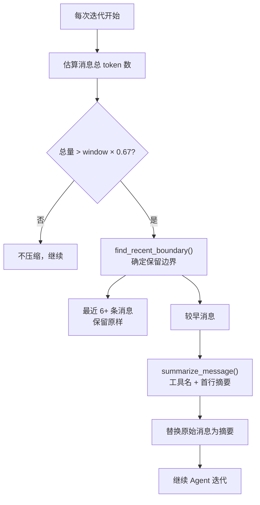
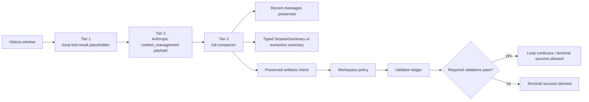

# 第 8 章：上下文管理：让 Agent 在有限窗口中高效工作

> **定位**：本章展示 octos 如何通过上下文压缩（compaction）、保真度分级（fidelity）、提示层构建（prompt layer）和系统提示防篡改（prompt guard）四种机制，在有限的 LLM 上下文窗口中高效工作。前置依赖：第 5 章。适用场景：想理解上下文窗口管理策略的 AI 应用开发者（读者 C），以及需要优化 Agent 上下文使用的开发者（读者 B/D）。

LLM 的上下文窗口是稀缺资源。即使是 200K token 的窗口，一个复杂任务也可能在 10-20 次迭代后耗尽——每次迭代的工具调用参数和结果都在累积。当窗口接近满时，有两个选择：停止（放弃未完成的任务），或压缩（丢弃部分信息但继续工作）。octos 选择了后者。

---

## 8.1 Context Compaction：80% 触发的压缩策略

### 8.1.1 触发条件

Compaction 的预算检查发生在 [`../octos/crates/octos-agent/src/agent/compaction.rs:11-41`]，它把上下文窗口先乘以 `0.8`，再除以 `SAFETY_MARGIN = 1.2`（[`../octos/crates/octos-agent/src/compaction.rs:42-49`]）。这等于一边预留 20% 的“新一轮对话空间”，一边再为 token 估算误差留出缓冲。

### 8.1.2 触发逻辑源码走读

80% 阈值的实际检查代码在 [`../octos/crates/octos-agent/src/agent/compaction.rs:19-24`]：

```rust
let window = self.llm.context_window();
let budget = (window as f64 * 0.8 / SAFETY_MARGIN) as u32;

let total: u32 = messages.iter().map(estimate_message_tokens).sum();
if total <= budget {
    return;  // 未超出预算，不压缩
}
```

注意实际预算是 `window * 0.8 / 1.2 ≈ window * 0.67`——80% 阈值再除以 1.2 的安全系数，因为 token 估算不完全精确。对于 128K 窗口的模型，实际触发点约在 85K tokens。

### 8.1.3 保留边界的确定

`find_recent_boundary()`（[`../octos/crates/octos-agent/src/compaction.rs:62-90`]）是压缩算法的核心——它决定了哪些消息保留原样、哪些被压缩：

```rust
pub(crate) fn find_recent_boundary(messages: &[Message], budget: u32, system_tokens: u32) -> usize {
    let mut recent_tokens = 0u32;
    let mut count = 0usize;
    let mut split = messages.len();

    // 从最后一条消息向前扫描
    for i in (1..messages.len()).rev() {
        let msg_tokens = estimate_message_tokens(&messages[i]);
        count += 1;

        // 保留至少 6 条，且不超过预算的一半
        if count >= MIN_RECENT_MESSAGES
            && system_tokens + recent_tokens + msg_tokens > budget / 2
        {
            break;
        }
        recent_tokens += msg_tokens;
        split = i;
    }

    // 关键：不在工具调用组中间切割
    while split > 1 && messages[split].role == MessageRole::Tool {
        split -= 1;  // 向前回退，包含 Tool 消息对应的 Assistant 消息
    }

    split
}
```

这段代码的核心洞察是**不对称保护**：最近 6 条消息无条件保留（`count >= MIN_RECENT_MESSAGES` 之前不检查预算），但同时不让最近消息超过预算的一半（`budget / 2`）。这确保了压缩后仍有足够空间给旧消息的摘要。

**工具组不可分割。** 最后一个 `while` 循环向前回退，确保 split 点不会落在 Tool 消息上。如果 split 指向 Tool 消息，它属于一个 Assistant→Tool 的配对组——切割会导致孤立的 Tool 消息让 LLM 困惑。

### 8.1.3 压缩策略

压缩目标是将旧消息压缩到预算的 40%（`BASE_CHUNK_RATIO = 0.4`，[`../octos/crates/octos-agent/src/compaction.rs:48-49`]）。对每条旧消息调用 `summarize_message()`（[`../octos/crates/octos-agent/src/compaction.rs:135-181`]）：

| 消息类型 | 压缩方式 |
|---------|---------|
| User | `"> User: {content}"` + `[media omitted]` |
| Assistant（有工具调用） | `"Called {tool_name}"` |
| Assistant（纯文本） | 首行摘要（200 字符截断） |
| Tool 结果 | 状态（ok/error）+ 输出前 100 字符 |
| System | 保留为上下文摘要 |

### 8.1.4 Compaction 触发流程



**图 8-1：Compaction 触发流程。** 80% × 1/1.2 ≈ 67% 是实际触发点。保留边界不会在工具调用组中间切割。

### 8.1.5 压缩策略源码走读

`summarize_message()`（[`../octos/crates/octos-agent/src/compaction.rs:135-181`]）对每种消息类型采用不同的压缩策略：

```rust
fn summarize_message(msg: &Message, context: &[Message]) -> String {
    match msg.role {
        MessageRole::User => {
            // 用户消息：首行 + 媒体标记
            let media_note = if msg.media.is_empty() { "" } else { " [media omitted]" };
            format!("> User: {}{}", first_line(&msg.content, 200), media_note)
        }
        MessageRole::Assistant => {
            let mut parts = Vec::new();
            if let Some(ref calls) = msg.tool_calls {
                for call in calls {
                    // 关键：只保留工具名，完全丢弃参数
                    parts.push(format!("- Called {}", call.name));
                }
            }
            if !msg.content.is_empty() {
                let prefix = if msg.tool_calls.is_some() { "  " } else { "> Assistant: " };
                parts.push(format!("{}{}", prefix, first_line(&msg.content, 200)));
            }
            parts.join("\n")
        }
        MessageRole::Tool => {
            let tool_name = find_tool_name(msg, context);
            let status = if msg.content.starts_with("Error:") { "error" } else { "ok" };
            // 工具结果：状态 + 前 100 字符
            format!("  -> {}: {} - {}", tool_name, status, first_line(&msg.content, 100))
        }
        MessageRole::System => {
            format!("> Context: {}", first_line(&msg.content, 200))
        }
    }
}
```

**工具参数剥离**是最有效的压缩手段。考虑一个 `write_file` 工具调用——参数可能包含几百行的代码文件内容（上千 token）。压缩后变成一行 `"- Called write_file"`（约 5 token），压缩比高达 200:1。

测试验证了这个行为（[`../octos/crates/octos-agent/src/compaction.rs`] 的 `test_compact_strips_tool_arguments`）：

```rust
fn test_compact_strips_tool_arguments() {
    let messages = vec![
        assistant_tool_call("write_file", "tc1"),  // 参数包含 "/secret/file"
        tool_result("tc1", "File written."),
    ];
    let summary = compact_messages(&messages, 10000);
    assert!(summary.contains("Called write_file"));    // 工具名保留
    assert!(!summary.contains("/secret/file"));        // 参数完全消失
}
```

**首行摘要**（[`../octos/crates/octos-agent/src/compaction.rs:183-196`]）：`first_line()` 函数提取消息的第一行非空文本，UTF-8 安全截断到指定字符数（用户消息 200 字符，工具结果 100 字符）。信息密度在首行最高——LLM 的回复通常以结论或摘要开头。

还有一个容易漏掉的细节：如果“最近消息区”本身就已经超过预算，代码不会强行生成摘要，而是退回到 `fallback_truncate()`，从尾部向前保留消息，并继续避免把 tool-call group 拆开（[`../octos/crates/octos-agent/src/agent/compaction.rs:39-41`]、[`../octos/crates/octos-agent/src/agent/compaction.rs:218-230`]）。这说明 compaction 不是无条件的“摘要优先”，而是“能摘要就摘要，摘要也放不下就退化为截断”。

### 8.1.4 Fidelity 四档模式

压缩后的消息保真度可以分为四个级别：

| 档位 | 保留内容 | 丢弃内容 | 适用场景 |
|------|---------|---------|---------|
| Full | 完整消息 | 无 | 最近 6 条消息 |
| Truncate | 内容截断到 N 字符 | 尾部内容 | 中等重要的历史消息 |
| Compact | 首行 + 工具名称 | 参数、详细输出 | 远期历史 |
| Summary | typed `SessionSummary` 或自然语言摘要 | 原始消息细节 | 远期历史、跨压缩轮次的任务状态 |

实际实现要分两层看：legacy extractive helper 默认仍主要使用 Compact 级别（首行摘要 + 工具名）；但当前主分支已经有 `LlmIterativeSummarizer`，可以生成 typed `SessionSummary`，并在连续 3 次 LLM summary 失败后锁定回 extractive fallback（[`../octos/crates/octos-agent/src/summarizer.rs:7-17`]、[`../octos/crates/octos-agent/src/summarizer.rs:155-180`]）。因此 Summary 不再是“未来预留”，而是一个可由 compaction policy 选择的更高保真状态层。

---

## 8.2 Prompt Layer：分层系统提示构建

系统提示不是一个静态字符串——它由多个层次的信息组合而成。PromptLayerBuilder（[`../octos/crates/octos-agent/src/prompt_layer.rs:21-122`]）负责这个组装过程。

### 8.2.1 自动发现

`discover()` 方法（[`../octos/crates/octos-agent/src/prompt_layer.rs:56-80`]）从工作目录自动发现项目指令文件，但它的语义是**按类别命中第一个可用文件**，不是把目录中所有候选文件全部叠加：

| 文件名 | 用途 |
|--------|------|
| `CLAUDE.md` → `.octos/instructions.md` → `.claude/instructions.md` | 项目指令层；按顺序查找，命中第一个非空文件就停止 |
| `AGENTS.md` → `.octos/agents.md` → `agents.md` | Agent 描述层；同样只取第一个命中的文件 |

真正被“层叠”的，是 `build()` 里的四类内容：基础 prompt、项目指令、AGENTS 描述，以及通过 `with_extra()` 注入的额外运行时层（[`../octos/crates/octos-agent/src/prompt_layer.rs:82-102`]）。换句话说，项目目录里不会同时把 `CLAUDE.md` 和 `.octos/instructions.md` 都装进去；但它们之上仍然可以继续叠加 runtime extra layers。

### 8.2.2 大小限制

`MAX_PROMPT_FILE_SIZE = 64 * 1024`（[`../octos/crates/octos-agent/src/prompt_layer.rs:10-19`]）——单个提示文件最大 64KB。这防止了恶意或意外的巨大文件耗尽上下文窗口。

---

## 8.3 Steering：会话中消息注入

Steering 模块（[`../octos/crates/octos-agent/src/steering.rs:1-45`]）定义了一套“会话中途注入消息”的原语：

```rust
pub enum SteeringMessage {
    FollowUp(Message),      // 注入用户追加问题
    SystemReminder(String), // 系统级提醒
    RequestPause,           // 暂停等待用户输入
    Cancel,                 // 取消当前任务
}
```

它通过异步 channel（默认缓冲 16，[`../octos/crates/octos-agent/src/steering.rs:31-45`]）实现，接口包括 `channel()`、`SteeringMessage` 和非阻塞的 `drain_pending()`。

但这里必须和当前实现状态区分开：`steering.rs` 文件头部的 TODO 明确写着“还需要把 `SteeringReceiver` 接进 Agent Loop，才能在迭代间 drain 待处理消息并处理 Cancel/RequestPause”（[`../octos/crates/octos-agent/src/steering.rs:1-7`]）。也就是说，**这个接口已经定义并有测试，但当前源码里还不是主循环的已接线能力**。

因此，像“用户在任务执行中途追加一句话”“系统在超时前注入提醒”这些都是 steering 的目标场景，而不是今天这个版本已经稳定走通的运行时路径。

---

## 8.4 Prompt Guard：系统提示防篡改

Prompt Guard 已在第 7 章介绍了其 prompt 注入检测功能。在上下文管理的视角下，更准确的说法是：它为“把外部文本重新送回上下文”这一步提供一个额外的 defang 层。

`scan()` 会按正则匹配五类威胁：系统覆盖、角色混淆、工具调用注入、秘密提取、通用指令注入（[`../octos/crates/octos-agent/src/prompt_guard.rs:27-213`]）。`sanitize_injection()` 则只对 `Medium`/`High` 命中的 span 做替换，替换结果是 `[injection-blocked:{kind}]` 这样的标记；`Low` 级别只记录 debug 日志，不改写文本（[`../octos/crates/octos-agent/src/prompt_guard.rs:215-295`]）。

更关键的是接线位置。当前源码里，Prompt Guard 的已验证主路径是 `sanitize_tool_output()`：先移除 base64 data URI、长 hex 和常见凭据，再调用 `sanitize_injection()`，最后才把工具结果回灌到对话历史（[`../octos/crates/octos-agent/src/sanitize.rs:88-95`]、[`../octos/crates/octos-agent/src/agent/execution.rs:1161-1165`]）。所以它**现在主要保护的是工具输出回流这条链路**；模块本身当然能扫描任意文本，但书里不应把它写成“当前已经统一改写所有用户输入”。

最后还要记住它的边界：源码注释明确写着 “Not a security boundary”。它能拦住朴素的明文注入，却挡不住 base64、Unicode 同形字、零宽字符等绕过；真正的安全控制仍然是 sandbox、tool policy 和 human-in-the-loop hook（[`../octos/crates/octos-agent/src/prompt_guard.rs:1-19`]）。

---

> ### 工程决策侧栏：为什么 80% 而非动态阈值
>
> **方案一：动态阈值（根据任务复杂度调整）**
>
> 优势：
> - 简单任务可以推迟压缩（比如问答场景不需要保留太多历史）
> - 复杂任务提前压缩（为后续迭代预留更多空间）
>
> 劣势：
> - 需要预测任务剩余迭代数——而这几乎不可能准确预测
> - 复杂度评估本身消耗上下文和计算资源
> - 可调参数增加了配置负担和不可预测性
>
> **方案二：预测式压缩（基于历史 token 增长率）**
>
> 优势：
> - 根据实际增长趋势动态调整
>
> 劣势：
> - token 增长率不稳定（工具调用的输出大小高度可变）
> - 预测错误可能导致提前压缩（丢失信息）或延迟压缩（溢出风险）
>
> **方案三：固定 80% 阈值（octos 的选择）**
>
> 80% 是一个经过实践验证的平衡点：20% 的预留空间足以容纳一次典型迭代（系统提示 + 用户消息 + LLM 响应 + 一次工具调用结果），同时不会过早触发压缩导致不必要的信息损失。
>
> 固定阈值的核心优势是可预测性——开发者和用户可以准确知道什么时候会发生压缩，不需要理解复杂的动态逻辑。在 AI Agent 这种本身就充满不确定性的系统中，基础设施层面的确定性是珍贵的。

---

## 8.5 主干演进：contract-gated compaction

Ch5 已经看到，`ContextOverflow` 不再只是一个普通错误：它会进入 `LoopDecision::CompactAndRetry`，由主循环先触发 turn compaction helper，再继续下一轮。也就是说，compaction 已经从“节省 token 的优化”变成了 Agent Loop 的恢复路径之一（[`../octos/crates/octos-agent/src/agent/loop_runner.rs:318-343`]）。

这也改变了上下文管理的边界。压缩后的状态不能只是一段自然语言摘要，否则很容易丢掉任务约束、artifact 约束或 validator 结果。当前源码把状态分成三层：

| 状态层 | 例子 | 是否应该写进 prompt |
|--------|------|--------------------|
| prompt-visible state | messages、typed `SessionSummary`、workspace contract 摘要 | 是 |
| runtime control state | `LoopRetryState`、grace eligibility、task lifecycle | 否 |
| durable evidence state | validator ledger、harness event sink、cost ledger | 不直接写入，但必须可回放 |

`SessionSummary` 因此不是长期记忆，也不是普通聊天摘要；它是 typed compaction summary，用来在有限窗口内保留 goal、constraints、decisions、files 和 next steps（[`../octos/crates/octos-agent/src/summarizer.rs:104-180`]、[`../octos/crates/octos-core/src/task.rs:217-263`]）。长期记忆仍由 Ch4 的 memory 系统负责。

当前主分支的 compaction 已经是三层结构，而不是单一摘要函数：

| 层级 | 源码位置 | 作用 | 关键边界 |
|------|---------|------|----------|
| Tier 1 MicroCompaction | `../octos/crates/octos-agent/src/compaction_tiered.rs:38-181` | 每轮本地清理 stale/oversized tool result，把内容替换为 typed `ToolResultPlaceholder` | 保留 `tool_call_id`，并允许 `protected_tool_call_ids` 跳过仍被 retry/artifact 引用的结果 |
| Tier 2 API MicroCompaction | `../octos/crates/octos-agent/src/compaction_tiered.rs:185-290` | 为 Anthropic-compatible provider 构造 `context_management.clear_tool_uses_20250919` payload | 只是 request-time decoration；非 Anthropic provider 不发送 |
| Tier 3 FullCompactor | `../octos/crates/octos-agent/src/compaction_tiered.rs:292-429`、`../octos/crates/octos-agent/src/compaction.rs:550-671` | 触发完整 summary + contract artifact preservation 检查 | 复用 `CompactionRunner`，并在 tier3 后可清空 file-state cache，避免 `[FILE_UNCHANGED]` stale identity |

Agent loop 的接线也对应这三层：preflight compaction 在第一轮 LLM 调用前执行；Tier 1 在每轮调用前运行；Tier 2 在构造 `ChatConfig` 时注入；TurnEnd full compaction 在消息修复和系统消息归一化之后执行（[`../octos/crates/octos-agent/src/agent/compaction.rs:83-179`]、[`../octos/crates/octos-agent/src/agent/loop_runner.rs:715-754`]、[`../octos/crates/octos-agent/src/agent/loop_runner.rs:1136-1145`]）。



validator preservation 是这套机制的关键。`validators.rs` 里的 outcome 会以 schema version JSONL 形式持久化；required validator 的失败会阻止 terminal success，optional validator 的失败只产生 warning（[`../octos/crates/octos-agent/src/validators.rs:107-144`]、[`../octos/crates/octos-agent/src/workspace_git.rs:662-755`]）。所以压缩策略不是“尽可能短”，而是“在变短的同时保住可验证契约”。这也是后续 Ch9 讨论 Harness validator runner、Ch12 讨论 workflow artifact gate 的基础。

## 8.6 本章回顾

1. **Context Compaction**：80% 触发，保留最近 6 条完整消息，旧消息压缩到 40% 预算。工具参数剥离和首行摘要是主要压缩手段。

2. **Fidelity 四档**：Full（完整）→ Truncate（截断）→ Compact（首行摘要）→ Summary（typed `SessionSummary` / 摘要），从近到远递减保真度；当前已有 LLM iterative summary，但默认仍可回退到 extractive。

3. **Prompt Layer**：按类别发现首个可用的项目指令文件和 AGENTS 文件，再与 base prompt、extra layers 组装成最终系统提示；单文件上限 64KB。

4. **Steering**：当前源码已经定义了消息注入通道与消息类型，但主循环尚未正式接线；它更像一个已设计好的运行时扩展点。

5. **contract-gated compaction**：当前主分支把 compaction 接入 `CompactAndRetry`，并通过 Tier 1/2/3、typed `SessionSummary`、workspace policy 和 validator ledger 保证压缩后仍能维持任务约束。

5. **Prompt Guard**：一个 regex-based 的 defense-in-depth 层。当前主要接在工具输出清洗链上，对 `Medium/High` 风险做 defang，而不是把它当成完整安全边界。

---

## 延伸阅读

- **Context Window 管理**：Anthropic "Long context window tips" — 长上下文使用的最佳实践
- **RAG vs 长上下文**：比较检索增强生成与大窗口直接输入的 trade-off
- **信息检索中的摘要**：Luhn 的自动文摘方法——理解首行摘要的理论基础

## 思考题

1. **压缩信息的恢复**：当前的 compaction 是不可逆的——被压缩的消息无法恢复原始内容。如果在压缩后 Agent 需要回顾早期工具调用的详细参数，应该怎么办？

2. **智能摘要 vs 提取式摘要**：当前的压缩是提取式的（首行、工具名）。如果使用 LLM 生成抽象式摘要，能否在同等 token 预算下保留更多信息？代价是什么？

3. **多 Agent 上下文共享**：如果两个 Agent 协作处理同一个任务，它们的上下文窗口如何共享？独立压缩还是协调压缩？

---

> **版本演化说明**
> 本章按当前 `octos` 主分支源码更新。后续阅读时，优先核对 `../octos/crates/octos-agent/src/agent/compaction.rs`、`../octos/crates/octos-agent/src/compaction.rs`、`../octos/crates/octos-agent/src/compaction_tiered.rs`、`../octos/crates/octos-agent/src/summarizer.rs`、`../octos/crates/octos-agent/src/prompt_layer.rs`、`../octos/crates/octos-agent/src/steering.rs`、`../octos/crates/octos-agent/src/prompt_guard.rs` 和 validator/workspace contract 相关入口。
