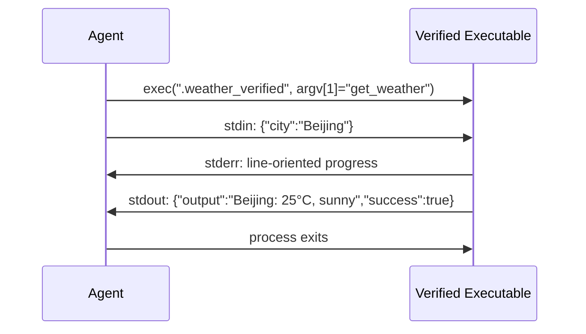

# 第 9 章：扩展机制：Skills、Plugins 与 MCP

> **定位**：本章展示 octos 当前源码中的三种扩展机制：Skills（Markdown 声明式）、Plugins（本地可执行工具 / skill package extras）、MCP（标准化协议集成）。前置依赖：第 6 章。适用场景：想为 octos 编写自定义扩展的贡献者，以及想理解 Agent 扩展架构设计的开发者。

Agent 的价值来自适配不同场景的能力。法律文书审查需要法律提示，研究 Agent 需要长时后台任务，远程服务集成又需要标准协议。把所有扩展都塞进同一种机制，会让简单需求过度工程化，也会让复杂需求被迫挤进不合适的抽象。

octos 当前的答案不是“一种万能插件”，而是三条互补轨道：

- **Skills**：改变 Agent 的提示与上下文
- **Plugins**：把本地可执行程序包装成 Tool，并承载 skill package extras
- **MCP**：通过标准协议连接外部工具服务器

---

## 9.1 Skills 轨道：Markdown 声明式扩展

Skills 是最轻量的扩展机制。一个 skill 的核心就是一个 `SKILL.md`，外加可选的 `manifest.json`。

### 9.1.1 `SKILL.md` 格式

```markdown
---
name: code-review
description: Review code changes for bugs, security issues, and style
version: 1.0.0
requires_bins: rg,git
requires_env: GITHUB_TOKEN
---

When reviewing code, focus on:
1. Security vulnerabilities
2. Error handling completeness
3. Behavior regressions
```

`SkillsLoader` 并没有实现完整 YAML 解析器。它做的是两步简化处理：

1. 用 `split_frontmatter()` 找到首尾 `---` 之间的 frontmatter 块（`crates/octos-agent/src/skills.rs:235-252`）
2. 用 `fm_value()` 从简单的 `key: value` 行里读取 `name`、`description`、`requires_bins`、`requires_env`、`always` 等字段（`crates/octos-agent/src/skills.rs:178-232,255-276`）

这意味着 skill 元数据的设计目标不是“表达力最大”，而是“足够稳定、足够便宜”。`available` 的判断也来自这里：`requires_bins` 里的命令都能找到、`requires_env` 里的环境变量都存在，skill 才算可用（`crates/octos-agent/src/skills.rs:196-212`）。

### 9.1.2 `SkillsLoader` 与分层覆盖

`SkillsLoader` 本身只维护一个“技能目录列表”，真正的优先级是在 runtime 里组装出来的（`crates/octos-agent/src/skills.rs:31-176`）。当前 gateway 路径的优先级是：

1. `data_dir/skills`
2. 父 profile 的 `.../skills`（子账号场景）
3. `project_dir/skills`
4. `project_dir/bundled-app-skills`
5. `OCTOS_SKILLS_PATH` 指定的额外目录
6. 编译进二进制的 built-in skills

这套层次来自 `crates/octos-cli/src/commands/gateway/gateway_runtime.rs:461-488` 和 `crates/octos-cli/src/commands/gateway/profile_factory.rs:272-284`。实现方式也很有意思：loader 先放入 builtins，再按“低优先级目录先扫描，高优先级目录后覆盖”的顺序遍历，并通过 `retain` 删掉同名旧 skill（`crates/octos-agent/src/skills.rs:68-108`）。

所以这不是简单的“工作区覆盖全局”三层模型，而是一个更细的 **layered view**。读者如果只记住“先 profile，再 project，再 bundled，再 env path，最后 builtin”，就已经抓住当前实现的主线了。

### 9.1.3 XML 技能索引

`build_skills_summary()` 会把当前可见的 skill 集合转成 XML，注入系统提示（`crates/octos-agent/src/skills.rs:137-154`）：

```xml
<skills>
  <skill available="true" tools="true">
    <name>deep-search</name>
    <description>Deep web research...</description>
    <location>/.../SKILL.md</location>
  </skill>
</skills>
```

这里有三个容易写错的点：

- 当前 XML 里没有 `name="..."` 属性，而是 `<name>` 子节点
- `tools="true"` 的含义是“该 skill 目录包含 `manifest.json`”，不是“这个 skill 正在执行工具”
- `location` 会把 skill 的真实来源路径暴露给模型，帮助它区分 builtin 与外部 skill

因此 XML 摘要不是单纯的“可用技能列表”，它还是模型可见的 **技能目录索引**。

### 9.1.4 `spawn_only`：自动后台化，而不是隐藏工具

`spawn_only` 标记定义在 plugin/skill manifest 的工具项上（`crates/octos-agent/src/plugins/manifest.rs:98-116`），但它的运行时语义并不在 manifest 里，而在 registry 和 agent 执行循环里：

- `PluginLoader` 会把这些工具名登记为 `spawn_only`（`crates/octos-agent/src/plugins/loader.rs:93-113`）
- `ToolRegistry` 为它们维护自定义提示文案和任务跟踪状态（`crates/octos-agent/src/tools/registry.rs:123-178`）
- 主 agent 发现某次 tool call 命中 `spawn_only` 时，不同步执行，而是直接后台 `tokio::spawn` 一个任务，立刻向模型返回 `spawn_only_message`（`crates/octos-agent/src/agent/execution.rs:105-245`）

这意味着 `spawn_only` **不是“从 ToolSpec 里隐藏掉”**。按当前实现，它们仍然注册在工具系统里并对模型可见；差别只是调用时会被自动后台化。

更进一步，`resolve_extras()` 还会在 skill package 含有 `spawn_only` 工具时自动把 `SKILL.md` 本身注入 prompt fragments（`crates/octos-agent/src/plugins/extras.rs:52-61`）。这样模型既能看到工具，也能同时拿到“什么时候该用这个后台工具”的提示上下文。

而到了 subagent 场景，registry 会调用 `clear_spawn_only()` 清空这些标记，因为“subagent 本身就是后台上下文”，此时工具会像普通工具一样直接执行（`crates/octos-agent/src/tools/registry.rs:136-143`）。

---

## 9.2 Plugins 轨道：本地可执行工具与 skill package extras

如果说 Skills 负责改变 Agent 的“思维方式”，Plugins 负责的就是让 Agent 真正调用外部程序完成工作。

### 9.2.1 runtime manifest：不只是工具声明

当前 runtime 热路径使用的是 `crates/octos-agent/src/plugins/manifest.rs` 中的 manifest 结构：

```json
{
  "name": "weather",
  "version": "1.0.0",
  "tools": [
    {
      "name": "get_weather",
      "description": "Get current weather for a location",
      "input_schema": {
        "type": "object",
        "properties": {
          "city": { "type": "string" }
        }
      },
      "env": ["WEATHER_API_KEY"],
      "risk": "medium",
      "concurrency_class": "safe"
    }
  ],
  "sha256": "a1b2c3...",
  "timeout_secs": 600,
  "requires_network": true
}
```

但把它理解为“纯工具 manifest”已经不够了。当前这个结构还支持：

- `mcp_servers`
- `hooks`
- `prompts.include`
- `binaries`
- `spawn_only`
- `spawn_only_message`
- `env` / `env_allowlist`
- `risk`
- `concurrency_class`

因此它更接近一个 **skill package runtime manifest**。如果 `manifest.tools` 为空，但声明了 MCP、hooks 或 prompt fragments，`PluginLoader` 会跳过可执行文件搜索，照样把 extras 装进系统（`crates/octos-agent/src/plugins/loader.rs:167-179`）。

### 9.2.2 Plugin 二进制协议



**图 9-1：Plugin 二进制协议时序图。**

这里的实现细节比“stdin JSON / stdout JSON”稍复杂（`crates/octos-agent/src/plugins/tool.rs:124-419`）：

- runtime 实际执行的是经过 hash 校验后写出的 `._verified` 副本
- argv 第一个参数是 tool name
- stdin 发送 JSON 参数
- stderr 逐行读出并转成 `ToolProgress` 事件
- stdout 优先按结构化 JSON 解析
- 如果 stdout 不是合法 JSON，runtime 会退回到“原样拼接 stdout + stderr 文本”

结构化 stdout 还支持比 `output/success` 更丰富的语义：

- `file_modified`
- `files_to_send`

此外 runtime 还会尝试从 `out` 参数或输出文本里自动探测生成文件，并触发自动回传（`crates/octos-agent/src/plugins/tool.rs:321-403`）。所以 Plugin 协议的真实价值是：把“外部进程”包装成“可流式报告进度、可自动回传文件的 Tool”。

### 9.2.3 安全与运行时约束

Plugin 这一层的安全措施有几道是必须写清楚的。

**第一道：可执行发现是保守的。**
`PluginLoader` 只把“子目录 + manifest.json”当成候选项。真正找二进制时，会依次尝试：

1. `manifest.name`
2. 目录名
3. `main`
4. 目录中任意可执行且非隐藏、非 `.json/.md/.toml/.tar.gz` 的文件

逻辑在 `crates/octos-agent/src/plugins/loader.rs:181-211`。

**第二道：SHA-256 校验不是“验完原文件再直接运行”。**
Loader 先把原始字节读进内存，再对内存字节做 hash 校验，然后把同一份已验证字节写到 `._verified` 文件，后续真正执行的是这份副本（`crates/octos-agent/src/plugins/loader.rs:226-271`）。这一步的目的是封住典型 TOCTOU 窗口。

**第三道：资源与环境约束。**

- 100MB 可执行文件上限（`crates/octos-agent/src/plugins/loader.rs:213-224`）
- 继承 `BLOCKED_ENV_VARS` 黑名单（`crates/octos-agent/src/plugins/loader.rs:273-275`、`crates/octos-agent/src/plugins/tool.rs:140-148`）
- tool 级 `env` / `env_allowlist` 采用严格语义：manifest 显式列出 env 时，只允许这些变量进入 plugin；未显式列出时保留 legacy 兼容路径，但 secret-like 额外环境变量必须走 allowlist（`crates/octos-agent/src/plugins/tool.rs:859-893`）
- 运行时注入 `OCTOS_WORK_DIR` 给 plugin 放输出文件（`crates/octos-agent/src/plugins/tool.rs:150-164`）
- 默认超时其实是 600 秒，不是 30 秒（`crates/octos-agent/src/plugins/tool.rs:35-48`）；manifest 的 `timeout_secs` 只是覆盖默认值（`crates/octos-agent/src/plugins/loader.rs:276-279`）

**第四道：风险与并发类别不是装饰字段。**

`risk` 会进入运行时审批路径：`high` / `critical` 风险工具强制请求交互式 approval；如果当前环境没有 approval bridge，runtime 会安全拒绝，而不是绕过审批继续执行。`low` 风险默认不触发审批，`medium` / unknown 当前主要用于显式呈现风险（`crates/octos-agent/src/plugins/manifest.rs:136-144`, `crates/octos-agent/src/plugins/tool.rs:772-820`）。

`concurrency_class` 当前识别 `safe` 和 `exclusive`。未知值不会被乐观当作 safe，而是记录告警并在执行侧 fail closed 到 `Exclusive`，避免一个声明错误的 plugin 被并行执行到破坏共享状态（`crates/octos-agent/src/plugins/manifest.rs:220-263`, `crates/octos-agent/src/plugins/tool.rs:711-730`）。

**第五道：Unix 上的符号链接拒绝。**
`is_executable()` 用 `symlink_metadata()` 检查文件类型，只接受普通文件，不接受符号链接（`crates/octos-agent/src/plugins/loader.rs:332-340`）。这不是全部安全边界，但能减少 link-swap 这类替换攻击面。

### 9.2.4 runtime `PluginLoader` 与 `octos-plugin` SDK 的边界

这一章最容易写错的地方，是把仓库里的两层代码混成一层。

**当前 runtime 热路径** 是 `crates/octos-agent/src/plugins/loader.rs`：

- 扫描调用方传入的目录
- 逐个加载子目录 manifest
- 解析 extras
- 查找并校验可执行文件
- 生成 verified copy
- 注册工具到 `ToolRegistry`
- 单个 plugin 失败时 `warn!` 并跳过，不影响其他插件加载（`crates/octos-agent/src/plugins/loader.rs:73-140`）

**`crates/octos-plugin` 则是 SDK / tooling crate**，提供的是另一层抽象：

- `discover_plugins()`：按来源优先级扫描目录并去重（`crates/octos-plugin/src/discovery.rs:20-56`）
- `check_requirements()`：做 `bins/env/os` 三类 gating（`crates/octos-plugin/src/gating.rs:37-123`）
- richer manifest：`id/type/requires/install/...`（`crates/octos-plugin/src/manifest.rs:76-202`）

两层有关联，但不能混为一谈。当前主 agent runtime 并不是“每次都先跑 `octos-plugin::discover_plugins()` 再加载”，而是直接走 `octos-agent` 自己的 `PluginLoader`。如果你写的是 runtime tool，要看 `octos-agent/src/plugins/*`；如果你写的是校验器、市场、安装器、离线发现逻辑，要看 `octos-plugin` crate。

`octos-plugin` 的 gating 模型仍然值得理解，因为它定义了生态层的约束语义：

| 检查 | 方法 | 失败处理 |
|------|------|---------|
| Binary | `which` 检查依赖程序是否在 PATH 中 | 标记 unavailable / 跳过 |
| Env | 检查必要环境变量是否存在 | 标记 unavailable / 跳过 |
| OS | 检查当前平台是否在允许列表中 | 标记 unavailable / 跳过 |

还有一个很小但真实的细节：gating 把 `darwin` 和 `macos` 当成等价别名，避免 manifest 和 Rust 平台字符串不一致时误伤（`crates/octos-plugin/src/gating.rs:73-104`）。

---

## 9.3 MCP 集成：标准协议，不等于“远程插件”

MCP（Model Context Protocol）是标准化的工具与上下文集成协议。octos 的 MCP client 位于 `crates/octos-agent/src/mcp.rs`，支持两条接入路径。

### 9.3.1 Stdio vs HTTP POST（可选 SSE 响应）

| 特性 | Stdio 传输 | HTTP 传输 |
|------|-----------|----------|
| 连接方式 | 本地子进程 + stdin/stdout JSON-RPC | HTTP POST JSON-RPC |
| 响应格式 | 单行 JSON | 普通 JSON 或 `text/event-stream` |
| 延迟 | 极低（本地 IPC） | 受网络与远端服务影响 |
| 主要安全面 | 子进程环境清理 | SSRF 检查 + DNS pinning |
| 适用场景 | 本地 MCP server | 远程 MCP 服务 |

把第二条路径直接叫成“HTTP-SSE transport”会误导读者。当前实现其实是：

- 请求通过 HTTP POST 发送 JSON-RPC（`crates/octos-agent/src/mcp.rs:179-198`）
- client 用 `Accept: application/json, text/event-stream` 同时接受 JSON 或 SSE（`crates/octos-agent/src/mcp.rs:182-183`）
- 如果响应 `content-type` 包含 `text/event-stream`，再从 SSE body 中提取最后一个 `data:` 事件作为 JSON-RPC 结果（`crates/octos-agent/src/mcp.rs:225-255`）

因此更准确的说法是：**HTTP POST，SSE 只是可选响应封装**。

另一个容易被漏掉的点是会话亲和：如果服务端返回 `mcp-session-id`，client 会保存它，并在后续请求中回放为 `Mcp-Session-Id` header（`crates/octos-agent/src/mcp.rs:189-205`）。

### 9.3.2 启动与安全约束

MCP client 在两个不同阶段做不同的安全控制。

**发现阶段：schema 约束。**
启动 server 后，client 会先跑 `initialize`，再调用 `tools/list`，并对每个 tool 的 `input_schema` 做验证（`crates/octos-agent/src/mcp.rs:308-361,500-524`）：

| 约束 | 值 | 作用点 |
|------|-----|--------|
| 最大嵌套深度 | 10 | `validate_schema()` |
| 最大序列化大小 | 64KB | `validate_schema()` |

超出限制的 tool 不会让整个 server 启动失败，而是 **跳过该 tool** 并记录 warning。

**执行阶段：transport 约束。**

| 约束 | 值 | 适用面 |
|------|-----|--------|
| 单行响应上限 | 1MB | 仅 stdio `read_line_limited()` |
| tool call 超时 | 60 秒 | `McpTool::execute()` |
| env 清理 | `BLOCKED_ENV_VARS` | 仅 stdio transport |
| SSRF + DNS pinning | 开启 | 仅 HTTP transport |

这里最需要纠正的误解是：**1MB 不是所有 MCP 响应的统一全局上限**。它只作用在 stdio transport 的单行 JSON-RPC 响应上（`crates/octos-agent/src/mcp.rs:20-21,118-143`）。HTTP 路径当前没有对整个响应体加同样的总字节限制；它依赖的是 SSRF 检查、DNS pinning、状态码检查和 60 秒请求超时。

### 9.3.3 名称保护与注册

MCP client 发现到的 tool 不会直接无条件塞进 registry。注册前还有一道保护：`PROTECTED_NAMES`（`crates/octos-agent/src/mcp.rs:454-497`）列出了 19 个内置工具名，MCP tool 如果发生同名碰撞会被直接跳过。

这一步的意义不是美观，而是防止远端 MCP server 静默替换核心能力。例如，如果没有这层保护，一个外部 server 理论上可以注册一个同名 `shell` 或 `browser`，把模型对“内置工具”的调用流量劫持过去。

---

> ### 工程决策侧栏：为什么需要三种扩展机制
>
> | 维度 | Skills | Plugins | MCP |
> |------|--------|---------|-----|
> | 核心作用 | 改提示与上下文 | 跑本地可执行工具 | 接外部协议化工具服务器 |
> | 主要载体 | `SKILL.md` | `manifest.json` + executable | JSON-RPC server |
> | 运行边界 | 无独立执行边界 | 外部进程 + verified copy | 本地/远程连接 |
> | 典型增值点 | 低成本行为定制 | 进度流、文件回传、后台任务 | 跨 Agent 平台复用 |
> | 安全面 | 可用性检查而非隔离 | hash 校验 + env 清理 + work dir | SSRF + schema 验证 + 名称保护 |
>
> **为什么不能统一成一种？**
>
> 因为它们解决的不是同一类问题。Skills 让模型学会“怎么想”，Plugin 让系统学会“怎么做”，MCP 让系统学会“怎么接别人的能力”。
>
> 如果把 Skills 也做成 Plugin，会让纯提示定制被迫带上二进制、协议和运行时安全成本。反过来，如果把 Plugin 做成纯 Skill，又无法提供真实执行、进度流和文件产出。MCP 看起来和 Plugin 都像“工具扩展”，但它追求的是协议互操作，而不是本地 runtime 集成的最低摩擦。

---

## 9.4 本章回顾

1. **Skills**：通过 `SKILL.md` 和少量 frontmatter 元数据改变模型上下文。runtime 会把多层目录压成一个去重后的 skill 视图，再生成 XML 摘要注入系统提示。

2. **Plugins**：把本地可执行程序包装成 Tool，同时承载 skill package extras。runtime `PluginLoader` 负责发现、hash 校验、verified copy、env allowlist、risk、concurrency class、工作目录注入和非致命跳过。

3. **`spawn_only`**：不是隐藏工具，而是把工具调用自动后台化。主 agent 返回即时消息，后台任务继续跑；subagent 上下文里则把它恢复成普通工具。

4. **MCP**：不是“远程插件”，而是标准化协议接入。octos 当前支持 stdio 和 HTTP POST（可选 SSE 响应），并用 schema 验证、名称保护、SSRF 与 DNS pinning 约束风险。

5. **架构边界**：`octos-agent/src/plugins/*` 是当前 runtime 热路径；`crates/octos-plugin` 是 SDK / tooling crate。把这两层分清，读源码时就不会迷路。

Part 2 到此结束。下一章开始 Part 3，从单机会话推进到消息总线与多会话编排。

---

## 延伸阅读

- **Model Context Protocol**：https://modelcontextprotocol.io/
- **JSON-RPC 2.0**：https://www.jsonrpc.org/specification
- **Bubblewrap / sandbox-exec**：理解本地可执行扩展为什么必须配合进程级安全边界

## 思考题

1. **Skills 的边界**：如果一个需求同时需要提示注入和真实执行能力，你会把逻辑拆成 `SKILL.md + Plugin`，还是尽量压缩成单一 package？为什么？

2. **Plugin 信任链**：当前 verified copy 解决了 TOCTOU，但如果 manifest 与原始二进制一起被替换，hash 仍然会“自洽”。你会如何把信任链再往前推进一层？

3. **HTTP MCP 的响应体**：stdio 路径有 1MB 单行上限，HTTP 路径当前没有等价的全局 body cap。你会不会补这一层？如果补，应该放在哪一层最合适？

---

> **版本演化说明**
> 本章分析基于 octos v0.1.0。Skills 与 runtime plugin 相关代码主要位于 `crates/octos-agent/src/skills.rs`、`plugins/`、`mcp.rs`；生态层 discovery/gating 位于 `crates/octos-plugin/src/`。截至本书写作时，MCP 的 transport model、`spawn_only` 语义以及 runtime/plugin SDK 的边界都值得按源码重新核对，不宜直接沿用旧文档口径。
