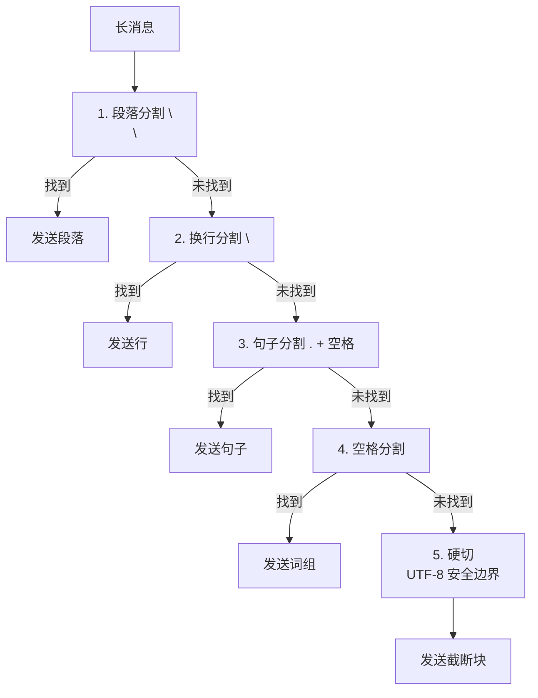

# 第 10 章：octos-bus：14 频道的统一消息抽象

> **定位**：本章深入 octos-bus crate（约 19,600 行），展示如何用 `Channel` trait 抽象统一 14 种消息频道，以及会话管理和消息分片的工程实现。前置依赖：第 5 章。适用场景：想理解多频道消息平台架构的开发者（读者 B），以及需要接入新频道的贡献者（读者 D）。

当 Agent 从单用户 CLI 走向多用户平台时，消息接入层的复杂度急剧上升。Telegram 的消息长度限制是 4,000 字符，Discord 是 1,900；Slack 用 Block Kit 格式化消息，飞书用 Rich Text；邮件是异步的，WhatsApp 需要模板消息。octos-bus 用一个 `Channel` trait 统一了这些差异。

---

## 10.1 Channel trait：统一消息接口

Channel trait（[`crates/octos-bus/src/channel.rs:17-190`]）定义了所有频道的统一接口：

当前版本的 Channel trait 一共有 23 个方法，但真正**没有默认实现**的只有 3 个：`name()`、`start()`、`send()`。其余能力都以默认实现挂在 trait 上，真实频道按需覆盖：

```rust
#[async_trait]
pub trait Channel: Send + Sync {
    fn name(&self) -> &str;
    async fn start(&self, inbound_tx: mpsc::Sender<InboundMessage>) -> Result<()>;
    async fn send(&self, msg: &OutboundMessage) -> Result<()>;
    fn max_message_length(&self) -> usize;  // 默认 4000，可覆盖
    fn is_allowed(&self, _sender_id: &str) -> bool { true }
    async fn send_typing(&self, _chat_id: &str) -> Result<()> { Ok(()) }
    fn supports_edit(&self) -> bool { false }
    async fn send_with_id(&self, msg: &OutboundMessage) -> Result<Option<String>> { ... }
    async fn edit_message(&self, ...) -> Result<()> { ... }
    async fn finish_stream(&self, ...) -> Result<()> { ... }
    // + 更多默认方法：stop, send_typing_as, stop_typing, send_listening,
    //   delete_message, edit_message_with_metadata, send_raw_sse, ...
}
```

这是一种典型的“大 trait + 多默认实现”设计：简单频道只实现 3 个基础方法就能工作；成熟频道则会继续覆盖 `max_message_length()`、`supports_edit()`、`send_with_id()`、`edit_message()`、`format_outbound()`、`health_check()` 等扩展点。这样做的代价是 trait 面会比较宽，但收益是所有平台能力都能通过一个统一抽象暴露给 Gateway。

关键方法：`start()` 接收一个 `mpsc::Sender<InboundMessage>`，频道将收到的用户消息通过这个 sender 发送给 Agent 处理层；`send()` 负责把 Agent 响应发送回目标频道；`max_message_length()` 虽然有默认值 4000，但 Discord、Slack、Twilio、WeCom 等真实实现都会覆盖它（例如 Discord=1900，Slack=3900，Twilio=1600）。

`send_with_id()` 返回消息 ID，支持后续编辑（流式输出场景下先发送占位消息，再逐步更新内容）。默认实现委托给 `send()` 并返回 `None`。

### 10.1.1 流式编辑三步法

对于支持消息编辑的频道（`supports_edit()` 返回 `true`），octos 使用三步法实现流式输出：

1. **`send_with_id()`**：发送初始消息（可能只有几个 token），返回平台消息 ID
2. **`edit_message()`**：随着 LLM 流式输出，不断更新同一条消息的内容（[`crates/octos-bus/src/channel.rs:85-107`]）
3. **`finish_stream()`**：流结束后发送最终版本；默认实现仍回退到 `edit_message()`（[`crates/octos-bus/src/channel.rs:95-107`]）

这种模式让用户看到 Agent 的回复逐渐生成，而不是等待完整响应后一次性显示。Telegram 和 Discord 都支持这种模式。对于不支持编辑的频道（如邮件），退回到等待完整响应后一次性发送。

### 10.1.2 AgentHandle 对称设计

消息总线使用 `AgentHandle` / `BusPublisher`（[`crates/octos-bus/src/bus.rs:8-77`]）连接频道和 Agent 处理层：

```rust
// AgentHandle 包含双向通道
struct AgentHandle {
    in_rx: Receiver<InboundMessage>,      // Agent 从这里接收消息
    out_tx: Sender<OutboundMessage>,      // Agent 从这里发送响应
}

struct BusPublisher {
    in_tx: Sender<InboundMessage>,         // 频道从这里发送消息给 Agent
    out_rx: Receiver<OutboundMessage>,     // 频道从这里接收 Agent 响应
}
```

这种对称设计的优势是：当所有 Channel 关闭时（所有 `inbound_tx` 被 drop），`inbound_rx.recv()` 返回 `None`，Agent 处理层自动感知到没有更多消息，可以优雅退出。不需要额外的 shutdown 信号。

### 10.1.3 is_allowed：发送者鉴权

`is_allowed()`（[`crates/octos-bus/src/channel.rs:27-30`]）在消息路由到 Agent 之前检查发送者是否有权使用 Agent。默认实现返回 `true`（允许所有人），各频道可以覆盖实现自定义鉴权逻辑，例如 Telegram 可以限制只有特定 chat_id 的用户才能访问。

---

## 10.2 消息 Coalescing：5 级切割策略

当 Agent 的回复超过频道的字符限制时，需要将长消息分割为多个短消息。octos-bus 的 coalescing 算法（[`crates/octos-bus/src/coalesce.rs:26-120`]）按 5 个优先级尝试切割：



**图 10-1：5 级消息切割策略。** 优先在语义边界切割，硬切是最后手段。

**MAX_CHUNKS = 50**：防止极长消息被分割为数百个小消息导致 DoS。超过上限时，代码不会继续在最后一块后面追加文本，而是单独插入一个 `"[message truncated - N chars omitted]"` 的截断块（[`crates/octos-bus/src/coalesce.rs:46-57`]）。

**UTF-8 安全**：硬切时使用 `is_char_boundary()` 回退到安全的字符边界（与 octos-core 的 `truncate_utf8` 使用相同的策略，详见第 2 章）。

**平台特定限制**（[`crates/octos-bus/src/coalesce.rs:5-24`]）：

| 频道 | 字符限制 | 配置方法 |
|------|---------|---------|
| Telegram | 4,000 | `ChunkConfig::telegram()` |
| Discord | 1,900 | `ChunkConfig::discord()` |
| Slack | 3,900 | `ChunkConfig::slack()` |
| Email | 无限制 | 不调用 coalescing |
| 默认 | 4,000 | `ChunkConfig::default_limit()` |

### 10.2.1 find_break_point：核心分割逻辑

`find_break_point()`（[`crates/octos-bus/src/coalesce.rs:84-120`]）是切割的核心——但真正的切割过程分两步：先在 `max_chars` 以内找一个 UTF-8 安全的搜索窗口，再在这个窗口内寻找最自然的断点。

```rust
let mut limit = config.max_chars.min(remaining.len());
while limit > 0 && !remaining.is_char_boundary(limit) {
    limit -= 1;
}
let search = &remaining[..limit];
let break_at = find_break_point(search);

chunks.push(remaining[..break_at].trim_end().to_string());
remaining = remaining[break_at..].trim_start_matches('\n');
if remaining.starts_with(' ') && !remaining.starts_with("  ") {
    remaining = &remaining[1..];
}
```

`find_break_point(search)` 内部依次对 `\n\n`、`\n`、`. `、空格做 `rfind()`（从右向左搜索），只有完全找不到自然边界时才硬切。这保证断点尽量靠近上限，同时避免把多字节字符切坏。`trim_end()`、`trim_start_matches('\n')` 和“最多跳过一个前导空格”的小处理，则让最终发出去的块看起来更干净，不会把原始分隔符原样带到下一条消息开头。

---

## 10.3 Session 管理

### 10.3.1 Session 结构体

Session（[`crates/octos-bus/src/session.rs:66-79`]）是对话的持久化单元：

```rust
pub struct Session {
    pub key: SessionKey,               // 会话标识（channel:chat_id）
    pub parent_key: Option<SessionKey>, // fork 来源
    pub topic: Option<String>,          // 多主题支持
    pub messages: Vec<Message>,         // 对话历史
    pub summary: Option<String>,        // 会话摘要
    pub created_at: DateTime<Utc>,
    pub updated_at: DateTime<Utc>,
}
```

### 10.3.2 JSONL 持久化与文件命名

当前源码的 Session 持久化比“一个 JSONL 文件”稍复杂一些，核心有两个事实。

第一，**JSONL 文件的第一行不是消息，而是 `SessionMeta` 元数据**，后续每一行才是 `Message`（[`crates/octos-bus/src/session.rs:47-64`]、[`crates/octos-bus/src/session.rs:389-423`]、[`crates/octos-bus/src/session.rs:467-480`]）。所以它不是“纯消息流”，而是“头一行 schema/meta + 后续消息行”的轻量日志格式。

第二，**当前代码同时支持旧布局和新布局**：

1. `SessionManager` 仍支持 legacy flat layout：`data/sessions/{encoded-key}[_{hash}]?.jsonl`（[`crates/octos-bus/src/session.rs:148-217`]、[`crates/octos-bus/src/session.rs:269-319`]）
2. `SessionActor` 使用的 `SessionHandle` 优先采用 per-user layout：`data/users/{encoded_base_key}/sessions/{topic_or_default}.jsonl`，并在打开时自动迁移旧文件（[`crates/octos-bus/src/session.rs:685-756`]）

只有在 legacy flat 布局里，文件名才由下面这两部分构成：

1. **Percent-encoded SessionKey**（[`crates/octos-bus/src/session.rs:29-40`]）：将 SessionKey 中的路径不安全字符（`/`、`:`、`#`）编码为 `%2F`、`%3A`、`%23`
2. **FNV-1a 64-bit hash 后缀**（[`crates/octos-bus/src/session.rs:16-27`]、[`crates/octos-bus/src/session.rs:290-319`]）：当编码后的名字过长、需要截断时，追加稳定哈希，避免“截断后同名前缀”碰撞

例如，旧布局中的长 key 可能落成 `telegram%3A12345_0123ABCD....jsonl`；而新布局则更像 `users/telegram%3A12345/sessions/default.jsonl`。

**Schema 版本**：`CURRENT_SESSION_SCHEMA = 1`（[`crates/octos-bus/src/session.rs:13-18`]），为未来格式迁移预留。

写入也分两类：
- 日常追加消息走 `append_to_disk()`，新文件先写 metadata，再逐条 append message 行（[`crates/octos-bus/src/session.rs:430-487`]）
- 需要重写整个会话时走 `rewrite()`，使用 write-then-rename 的原子替换模式（[`crates/octos-bus/src/session.rs:489-533`]）

**10MB 文件限制**：单个会话文件最大 10MB，防止失控的对话历史耗尽磁盘（[`crates/octos-bus/src/session.rs:117-118`]、[`crates/octos-bus/src/session.rs:376-385`]、[`crates/octos-bus/src/session.rs:455-464`]）。

### 10.3.3 `/new` Fork 机制

用户发送 `/new` 命令创建新会话时，底层对应的是 `fork(parent_key, new_chat_id, copy_messages)`（[`crates/octos-bus/src/session.rs:536-572`]）。它不是“新建一个空白会话”，而是：

1. 从父会话复制最近 `copy_messages` 条消息
2. 记录 `parent_key`
3. 为新 key 重写一个新的 session 文件

这意味着 `/new` 在当前实现里更接近“带最近上下文的分支”，而不是“只继承配置、不带历史”。

### 10.3.4 SessionManager 与 LRU 缓存

SessionManager（[`crates/octos-bus/src/session.rs:120-146`]）管理 admin/命令侧看到的会话缓存；而真正在线处理消息时，`SessionActor` 会转而持有自己的 `SessionHandle`，避免所有活跃会话共用一个大锁（[`crates/octos-bus/src/session.rs:687-756`]）。

- **LRU 内存缓存**：活跃会话在内存中保持，减少磁盘 I/O
- **惰性加载**：不活跃的会话按需从磁盘加载
- **布局兼容**：同时扫描 legacy flat layout 和 per-user layout

---

## 10.4 Coalescing 源码走读

让我们深入 `split_message()` 的完整实现（[`crates/octos-bus/src/coalesce.rs:34-82`]），理解它如何在安全性和可读性之间取得平衡：

```rust
pub fn split_message(text: &str, config: &ChunkConfig) -> Vec<String> {
    if text.len() <= config.max_chars {
        return if text.is_empty() { vec![] } else { vec![text.to_string()] };
    }

    let mut chunks = Vec::new();
    let mut remaining = text;

    while !remaining.is_empty() {
        if chunks.len() >= MAX_CHUNKS {
            chunks.push(format!(
                "[message truncated - {} chars omitted]",
                remaining.len()
            ));
            break;
        }

        if remaining.len() <= config.max_chars {
            chunks.push(remaining.to_string());
            break;
        }

        let mut limit = config.max_chars.min(remaining.len());
        while limit > 0 && !remaining.is_char_boundary(limit) {
            limit -= 1;
        }
        let search = &remaining[..limit];
        let break_at = find_break_point(search);

        chunks.push(remaining[..break_at].trim_end().to_string());
        remaining = remaining[break_at..].trim_start_matches('\n');
        if remaining.starts_with(' ') && !remaining.starts_with("  ") {
            remaining = &remaining[1..];
        }
    }

    chunks
}
```

关键设计点：

1. **提前返回**：空字符串直接返回空 `Vec`，短消息返回单块
2. **先做 UTF-8 安全窗口，再找语义断点**：避免把 `find_break_point()` 变成“逻辑断点 + 编码边界”双重职责
3. **边界清洗**：`trim_end()`、去掉前导换行、最多跳过一个空格，让 chunk 之间的视觉边界更自然
4. **MAX_CHUNKS 保护**：超过上限时插入独立截断块，而不是静默丢尾部

### 10.4.1 Unicode 安全的边界检测

`find_break_point()` 的硬切分支（第 5 级）使用了与 octos-core `truncate_utf8` 相同的字符边界回退算法：

```rust
// 硬切——从 max_len 向前回退到安全的 UTF-8 字符边界
let mut limit = max_len;
while limit > 0 && !text.is_char_boundary(limit) {
    limit -= 1;
}
limit
```

这保证了即使在中文、日文、emoji 等多字节字符的任意位置切割，也不会产生无效的 UTF-8 序列。考虑一个包含中文和 emoji 的消息在 Telegram（4000 字符限制）中的切割场景——没有这个保护，切割点可能恰好落在一个 4 字节的 emoji 中间，导致后续的 API 调用因为无效 UTF-8 而失败。

---

## 10.5 频道实现概览

octos-bus 通过 feature flags 按需编译各频道实现。每个频道实现 `Channel` trait 的具体方法：

| 频道 | 连接方式 | 特殊能力 |
|------|---------|---------|
| Telegram | Long polling (teloxide) | 消息编辑、`AtomicBool` 优雅关停 |
| Discord | WebSocket gateway (serenity) | 消息去重（MessageDedup） |
| Slack | WebSocket (tokio-tungstenite) | Block Kit 格式支持 |
| 飞书 | HTTP webhook | 加密消息验证 |
| WhatsApp | HTTP API | 模板消息 |
| Email | IMAP/SMTP (async-imap + lettre) | 异步收发、附件 |
| Matrix | HTTP API | AppService 模式、多用户桥接 |
| 企业微信 | HTTP webhook | 加密消息 |
| CLI | 终端 stdin/stdout | readline 交互 |
| API | REST/SSE (axum) | 编程式接入 |

每个频道实现都是独立的——Telegram 频道的 bug 不会影响 Discord，因为它们是不同的代码路径，通过不同的 feature flag 编译。这种隔离设计是 octos-bus 19,600 行代码中大部分来自各频道独立实现的原因。

---

> ### 工程决策侧栏：为什么 JSONL 而非 SQLite / 单 JSON 文件
>
> **方案一：SQLite**
>
> 优势：结构化查询、索引、事务、跨会话分析方便
> 劣势：需要显式 schema / migration 层；会话文件不再能直接用文本工具检查；和当前“每个会话按 key 读写”的访问模式相比，抽象更重
>
> **方案二：单个 JSON 文件**
>
> 优势：实现最直观，序列化/反序列化简单
> 劣势：任何一次写入都要重写整个文件；崩溃恢复最脆弱；多会话下最容易形成热点锁
>
> **方案三：JSONL（octos 的选择）**
>
> 优势：
> - 第一行 metadata、后续逐行消息，既能 append，也能整会话 rewrite
> - 易于保留 legacy flat layout 与 per-user layout 两套路径
> - 每个会话一个文件，更贴合“按 session key 读写”的访问模式
> - 备份、迁移、排障都可以直接在文件系统层面完成
>
> 劣势：
> - 无索引，跨会话查询需要扫描所有文件
> - 没有数据库级事务；复杂查询能力弱
>
> **选择理由：** 从当前源码看，octos 的会话访问模式几乎总是“按 key 读取一个 session、append 新消息、必要时 rewrite 整个 session、按需迁移布局”。JSONL 正好覆盖这些路径，而且能自然配合 SessionActor 的 per-session file ownership。

---

## 10.6 Session 持久化的工程细节

### 10.6.1 FNV-1a 哈希

在 legacy flat layout 里，**当编码后的 SessionKey 需要截断时**，文件名会追加 FNV-1a 64-bit 哈希后缀（[`crates/octos-bus/src/session.rs:16-27`]、[`crates/octos-bus/src/session.rs:290-319`]）。这是一个非密码学哈希函数，优势在于实现极简且跨 Rust 版本稳定。它不用于安全目的（不防碰撞攻击），只用于“截断后文件名仍然可区分”。

```rust
fn fnv1a_64(data: &[u8]) -> u64 {
    let mut hash: u64 = 0xcbf29ce484222325;  // FNV offset basis
    for &byte in data {
        hash ^= byte as u64;
        hash = hash.wrapping_mul(0x100000001b3);  // FNV prime
    }
    hash
}
```

### 10.6.2 Percent-encoding

`encode_path_component()`（[`crates/octos-bus/src/session.rs:29-40`]）将 SessionKey 中的特殊字符编码为 URL 安全格式。这防止了 `telegram:12345` 这样的 key 被文件系统解释为目录路径（因为 `:` 在某些文件系统中是特殊字符）。

### 10.6.3 write-then-rename 原子性

整会话 `rewrite()` 路径的原子性通过两步操作实现：

1. 写入临时文件 `{session_file}.tmp`
2. `rename()` 临时文件为正式文件

在 Unix/Linux 上，`rename()` 是原子操作——要么完全成功（新文件替换旧文件），要么完全失败（旧文件保持不变）。即使进程在 `rename()` 之前崩溃，也只会留下一个孤立的 `.tmp` 文件，不影响正式会话文件。

---

## 10.7 本章回顾

1. **Channel trait**：当前是 23 方法接口，但只有 `name()`、`start()`、`send()` 没有默认实现；流式编辑、typing、embed、health check 都是按需覆盖的扩展层。
2. **Coalescing**：5 级语义切割（段落→换行→句子→空格→硬切），MAX_CHUNKS=50 防 DoS，UTF-8 安全，超限时会追加独立的 truncation chunk。
3. **Session**：JSONL 文件第一行是 metadata，不是消息；当前同时兼容 legacy flat layout 和 per-user layout，`/new`/fork 会复制最近 N 条消息并记录 `parent_key`。

---

## 延伸阅读

- **Server-Sent Events**：MDN "Using server-sent events" — 理解流式消息推送模式
- **Telegram Bot API**：https://core.telegram.org/bots/api — Telegram 频道的 API 细节
- **JSONL 格式**：https://jsonlines.org/ — 行分隔 JSON 格式规范

## 思考题

1. **频道抽象的边界**：某些频道支持富文本（Slack Block Kit、飞书 Rich Text），但 `Channel::send()` 只接受纯文本。你会如何扩展 trait 以支持富文本，同时保持向后兼容？
2. **会话恢复**：如果 octos 进程崩溃，JSONL 文件的最后一行可能不完整。你会如何实现崩溃恢复？

---

> **版本演化说明**
> 本章分析基于 octos v0.1.0，octos-bus crate 位于 `crates/octos-bus/src/`。截至本书写作时，支持的频道列表可能随版本更新而扩展，但 Channel trait 和 coalescing 算法的核心设计无重大变化。
