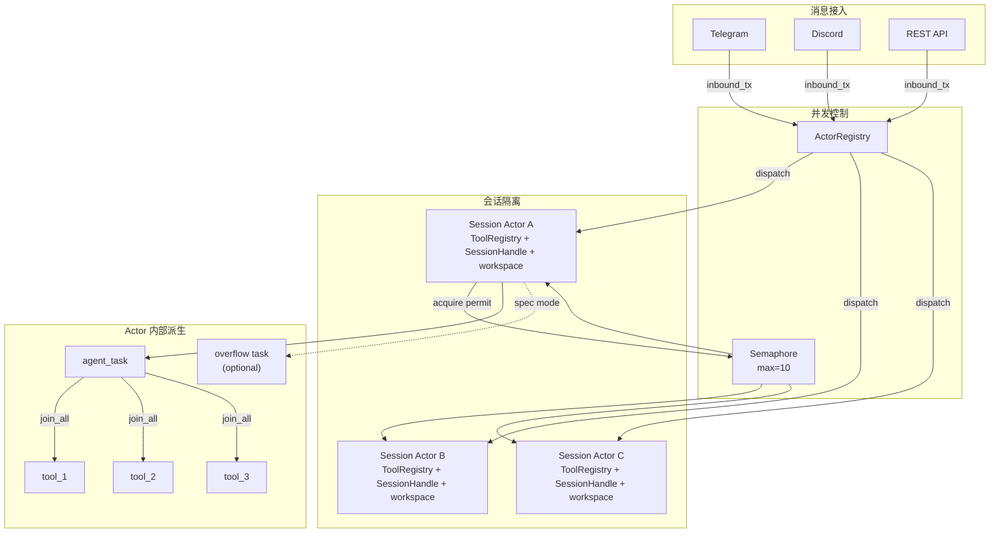

# 第 11 章：并发模型：Tokio 异步架构实战

> **定位**：本章展示 octos 如何利用 Tokio 异步运行时实现生产级并发——从 per-session actor 到 actor 内部的 per-message task 派生，从信号量限流到工具并发和优雅关停。前置依赖：第 5 章、第 10 章。适用场景：想理解 Rust 异步并发实战模式的开发者（读者 B），以及需要调优并发参数的运维人员（读者 D）。

单用户 CLI 模式下，Agent 是单线程顺序执行的——不需要考虑并发。但当 octos 作为 Gateway 或 Serve 模式运行时，多个用户同时发送消息，每个会话还可能夹杂取消、后台子任务结果、SSE 状态推送与溢出消息。当前源码已经不是早期“每条消息直接 spawn + shared Mutex”的简单模型，而是一个分层并发结构：Gateway 主循环负责接入，`ActorRegistry` 负责会话生命周期，每个 session actor 自己拥有工具、会话文件句柄和用户工作区，然后再在 actor 内部按需派生消息任务、工具任务和后台 subagent。

---

## 11.1 分层 Spawn：会话、消息、工具、子 Agent

当前 octos 的 `tokio::spawn()` 不是只出现在一个地方，而是分布在四个层级：

1. **会话级 actor**：`ActorRegistry` 为新 session 创建 actor，`ActorFactory::spawn()` 最终通过 `tokio::spawn(actor.run())` 启动一个长期存活的 per-session 任务（[`crates/octos-cli/src/session_actor.rs:198-309`]、[`crates/octos-cli/src/session_actor.rs:738-758`]）
2. **消息级 agent task**：在 API / speculative 路径下，actor 会再把当前消息的主 Agent 调用派生成独立任务，这样 actor 自己还能继续轮询 inbox，及时接收取消、overflow、后台结果和状态事件（[`crates/octos-cli/src/session_actor.rs:1920-1963`]）
3. **工具级任务**：单轮 LLM 返回多个 tool call 时，`execute_tools()` 会为每个工具各自 `tokio::spawn()`，然后用 `join_all()` 汇总结果（[`crates/octos-agent/src/agent/execution.rs:32-50`]、[`crates/octos-agent/src/agent/execution.rs:372-455`]）
4. **后台子 Agent / spawn_only**：`spawn` 工具的 background 模式会再起一个长期子 Agent；`spawn_only` 工具也会在工具执行层单独起后台任务（[`crates/octos-agent/src/tools/spawn.rs:399-470`]、[`crates/octos-agent/src/agent/execution.rs:105-245`]）

这种分层 spawn 的好处是并发边界清晰：会话级隔离保证状态所有权，消息级派生保证 actor 还能继续响应控制消息，工具级并发保证单轮性能，后台子 Agent 则把长任务从主对话流中剥离出去。Tokio 的 `JoinHandle` 还把 panic 封装为 `JoinError`，避免一个子任务直接把整条并发链路拖垮。

## 11.2 Session Actor：会话级状态所有权

虽然不同用户的消息并行处理，但**同一会话的核心状态必须有唯一 owner**。否则两条几乎同时到达的消息可能并发修改消息历史、工具注册表、sandbox 工作区和背景任务状态，结果就是经典的“状态没锁住，但语义已经乱了”。

octos 使用 session actor 模式（[`crates/octos-cli/src/session_actor.rs:1-149`]）实现这个 owner 语义——每个会话由一个独立的 tokio 任务（actor）管理：

```rust
// session_actor.rs 关键常量
const ACTOR_INBOX_SIZE: usize = 32;          // actor mailbox 容量
pub const DEFAULT_IDLE_TIMEOUT_SECS: u64 = 1800; // 空闲 30 分钟后回收
const MAX_OVERFLOW_TASKS: u32 = 5;           // speculative overflow 并发上限
const MAX_PENDING_PER_SESSION: usize = 50;   // 非活跃 session 的待发送缓冲上限
```

每个 session actor 不只是“有个队列”而已，它还拥有自己的 `ToolRegistry`、`SessionHandle`、per-user workspace 和取消标志（[`crates/octos-cli/src/session_actor.rs:520-736`]）。这正是文件头注释所说的：它取代了旧的 spawn-per-message gateway 模式，避免共享工具上的 `set_context()` 竞态（[`crates/octos-cli/src/session_actor.rs:1-5`]）。

### 11.2.1 ActorMessage：类型安全的消息分发

Session actor 通过 `ActorMessage` 枚举接收消息（[`crates/octos-cli/src/session_actor.rs:91-115`]）：

```rust
pub enum ActorMessage {
    /// 用户消息——触发 Agent 迭代
    Inbound {
        message: InboundMessage,
        image_media: Vec<String>,
    },
    /// 后台子 Agent 的结果——注入为系统消息，不触发额外 LLM 调用
    BackgroundResult {
        task_label: String,
        content: String,
    },
    /// 后台任务状态变化——推送到 SSE
    TaskStatusChanged { task_json: String },
    /// 取消当前操作
    Cancel,
}
```

Rust 的枚举让消息类型在编译期确定——不可能发送一个 actor 不理解的消息类型。Go 的 channel 通常传递 `interface{}`，类型错误只在运行时发现。

### 11.2.2 ActorRegistry：会话生命周期管理

`ActorRegistry`（[`crates/octos-cli/src/session_actor.rs:139-380`]）管理所有 session actor 的生命周期：

```rust
pub struct ActorRegistry {
    actors: HashMap<String, ActorHandle>,        // 活跃 actor 表
    factory: Arc<ActorFactory>,                  // 默认 Agent 工厂
    profile_factories: HashMap<String, Arc<ActorFactory>>,  // Profile 特定工厂
    semaphore: Arc<Semaphore>,                   // 并发限制
    out_tx: mpsc::Sender<OutboundMessage>,       // 输出通道
    pending_messages: PendingMessages,           // 缓冲消息
}
```

当新消息到达时，`dispatch()` 会先按 session key + profile 解析 actor key，再做三件事：
- **发现 actor 已结束**：先回收死 actor，避免向失效 mailbox 发消息（[`crates/octos-cli/src/session_actor.rs:213-218`]）
- **缺少 actor**：调用 `factory.spawn(...)` 创建一个新 actor，并把 `system_prompt_override` / `sender_user_id` 等上下文挂在 `ActorHandle` 上，供后续 respawn 使用（[`crates/octos-cli/src/session_actor.rs:220-242`]）
- **actor 已存在**：优先 `try_send()`；若 mailbox 已满，先给用户发一个“仍在处理中，你的消息已排队”的反馈，再退回到阻塞 `send()`（[`crates/octos-cli/src/session_actor.rs:245-269`]）

`ActorHandle::is_finished()` 通过检查 `JoinHandle::is_finished()` 判断 actor 是否已退出——这是零开销的，不需要额外的心跳机制。

### 11.2.3 Mailbox、背压与溢出不是一回事

这几个上限名字很像，但语义完全不同：

1. **`ACTOR_INBOX_SIZE = 32`**：这是 actor mailbox 容量。它限制的是“同一个 actor 还没来得及 `recv()` 的消息数”
2. **`MAX_PENDING_PER_SESSION = 50`**：这是**非活跃 session** 的待发送缓冲上限。缓冲的是 outbound reply，不是 inbound user message（[`crates/octos-cli/src/session_actor.rs:81-83`]、[`crates/octos-cli/src/session_actor.rs:361-375`]）
3. **`MAX_OVERFLOW_TASKS = 5`**：这不是排队长度，而是 speculative 模式下“同一个 session 允许并发跑多少个 overflow agent task”的上限。超过时 actor 会立即回一个 busy 响应，而不是继续排队（[`crates/octos-cli/src/session_actor.rs:2434-2466`]）

这三个阈值分别保护 mailbox、inactive-session buffering 和会话内受控并发。如果把它们都理解成“队列大小”，就会误读 octos 的真实背压设计。

### 11.2.4 并发模型全景图



**图 11-1：octos 并发模型全景。** 消息先进入 ActorRegistry，再由 session actor 持有状态；Semaphore 限制的是活跃处理数，不是 actor 数量。actor 内部再按需派生 agent_task、tool task 和 speculative overflow task。

---

## 11.3 信号量限流

无限制的并发会话会耗尽系统资源（CPU、内存、LLM API 配额）。`Arc<Semaphore>` 限制同时活跃的处理数，默认值来自 `GatewayConfig.max_concurrent_sessions = 10`（[`crates/octos-cli/src/config.rs:554-635`]），具体 semaphore 在 Gateway Runtime 里创建（[`crates/octos-cli/src/commands/gateway/gateway_runtime.rs:1272-1281`]）。

```rust
// 获取许可——如果已有 10 个活跃处理，新消息在此等待
let _permit = self.semaphore.acquire().await?;
// 处理消息...
drop(_permit); // 释放许可，允许下一个等待的消息进入
```

这个 permit 获取发生在 actor 真正开始处理消息时，而不是在 actor 创建时（[`crates/octos-cli/src/session_actor.rs:1803-1808`]、[`crates/octos-cli/src/session_actor.rs:2687-2691`]）。因此，一个空闲 actor 可以常驻内存，但不会占用并发槽位；只有正在跑 LLM / tool / overflow 逻辑的会话才会消耗 permit。

信号量而非自定义计数器的优势是：`acquire().await` 自动挂起等待任务，不消耗 CPU；任务完成或 panic 时 permit 会通过 RAII 自动释放，不容易泄漏。

## 11.4 工具并发：join_all

在单次 Agent 迭代内，LLM 可能请求多个工具调用（如同时读取 3 个文件）。`execute_tools()` 会为每个 tool call 分别 `tokio::spawn()`，然后用 `join_all()` 汇总结果（[`crates/octos-agent/src/agent/execution.rs:32-50`]、[`crates/octos-agent/src/agent/execution.rs:388-455`]）：

```rust
let handles: Vec<_> = tool_calls.iter()
    .map(|tc| tokio::spawn(execute_tool(tc)))
    .collect();
let results = futures::future::join_all(handles).await;
```

并行执行工具是 Agent 性能的关键优化——如果 3 个文件读取各需 10ms，串行执行需要 30ms，并行只需 ~10ms。

这里还有一个很有工程味的细节：`join_all()` 外面包了一层 `tokio::time::timeout()`，但超时后**不会 abort 已经 spawn 出去的工具任务**。源码注释给出的理由很直接：像 browser、shell 这类工具需要机会执行自己的 cleanup，否则会把 Chrome、子进程之类的资源孤儿化（[`crates/octos-agent/src/agent/execution.rs:32-37`]、[`crates/octos-agent/src/agent/execution.rs:416-425`]）。

## 11.5 子 Agent 双模式

octos 支持两种子 Agent 执行模式，而这两种模式都是并发边界设计的一部分：

### 11.5.1 同步阻塞模式

当 Agent 在主循环中调用需要子 Agent 的工具时，工具在当前迭代内同步等待子 Agent 完成。`spawn` 工具的 `mode = "sync"` 分支会直接 `worker.run_task(&subtask).await`，把结果作为当前 tool result 返回（[`crates/octos-agent/src/tools/spawn.rs:360-398`]）。

这适用于结果立即需要的场景——比如搜索结果需要在下一次 LLM 调用中使用。

### 11.5.2 后台异步模式（spawn 工具）

`spawn` 工具的 background 模式会 `tokio::spawn(async move { ... })` 起一个完全独立的后台 Agent。主 Agent 立即继续执行，不等待后台任务完成；完成后结果通过 background result sender 回到 session actor（[`crates/octos-agent/src/tools/spawn.rs:399-470`]、[`crates/octos-cli/src/session_actor.rs:574-612`]）。

```rust
// spawn 工具的简化逻辑
tokio::spawn(async move {
    let sub_agent = Agent::new(config);
    sub_agent.run_task(task).await;
    // 结果通过消息通知用户，不返回给主 Agent
});
// 主 Agent 立即继续
```

从用户体验看，后台结果又分两类：
- 简短的 `✓` / `✗` 生命周期通知会直接发给用户，不触发额外 LLM 回合（[`crates/octos-cli/src/session_actor.rs:984-999`]）
- 完整后台报告会先注入会话，再由 actor 触发一次 rewrite message，把原始报告改写成更适合用户阅读的输出（[`crates/octos-cli/src/session_actor.rs:998-1017`]）

---

## 11.6 优雅关停

当 octos 收到 Ctrl-C 时，当前源码里的关停链路其实有两层 flag，而不是一个全局布尔值走完整个系统：

1. **Gateway 级 shutdown flag**：Ctrl-C handler 置位，Gateway Runtime 主循环和 session actor 自己会看这个标志（[`crates/octos-cli/src/commands/gateway/gateway_runtime.rs:1187-1193`]、[`crates/octos-cli/src/commands/gateway/gateway_runtime.rs:1329-1333`]、[`crates/octos-cli/src/session_actor.rs:1040-1049`]）
2. **Per-session cancelled flag**：session actor 通过 `.with_shutdown(cancelled.clone())` 传给 Agent，本轮任务里的 `check_budget()` 和 `wait_for_shutdown()` 实际读的是这个 flag（[`crates/octos-cli/src/session_actor.rs:673-680`]、[`crates/octos-agent/src/agent/budget.rs:34-65`]、[`crates/octos-agent/src/agent/streaming.rs:14-29`]）

```rust
// session actor：取消当前任务
self.cancelled.store(true, Ordering::Release);

// agent：在预算检查时观察取消标志
if self.shutdown.load(Ordering::Acquire) {
    return BudgetStop::Shutdown;
}
```

`Release` / `Acquire` 语义确保：actor 写入取消标志后，Agent 线程在读取时不会看到旧值。Gateway 的 Ctrl-C flag 也使用同样的序关系（[`crates/octos-cli/src/commands/gateway/gateway_runtime.rs:1188-1193`]）。

优雅关停的流程：
1. Ctrl-C handler 置位 Gateway shutdown flag
2. Runtime 主循环会在下一次取到 inbound 后、真正 dispatch 之前停止继续处理新消息
3. 进入 shutdown 阶段，最多等待 30 秒让 `actor_registry.shutdown_all()` 收尾
4. 并发停止 persona / heartbeat / cron / channels 等后台服务（[`crates/octos-cli/src/commands/gateway/gateway_runtime.rs:1651-1669`]）

### 11.6.1 关停的四个阶段

优雅关停不是一个简单的 `process::exit()`——它是一个有序的资源释放过程：

1. **停止继续 dispatch 新消息**：Gateway Runtime 会在下一次从 inbound queue 取到消息后、dispatch 之前检查 shutdown flag 并跳出主循环（[`crates/octos-cli/src/commands/gateway/gateway_runtime.rs:1329-1333`]）
2. **等待 actor 结束**：`shutdown_all()` 会 drop actor senders，并等待 join handle 完成；最长等 30 秒（[`crates/octos-cli/src/session_actor.rs:344-359`]、[`crates/octos-cli/src/commands/gateway/gateway_runtime.rs:1651-1659`]）
3. **actor 内部完成本轮清理**：session actor 自己会在 loop 边界检查 `global_shutdown` / `cancelled`，随后退出（[`crates/octos-cli/src/session_actor.rs:1040-1053`]）
4. **停后台服务与频道**：最后并发 stop persona / heartbeat / cron / channel manager（[`crates/octos-cli/src/commands/gateway/gateway_runtime.rs:1661-1669`]）

### 11.6.2 Ordering 语义为什么重要

```rust
// 错误：使用 Relaxed
shutdown.store(true, Ordering::Relaxed);   // 主线程
if shutdown.load(Ordering::Relaxed) { ... } // Agent 线程
// Agent 线程可能看到 stale 值——在多核 CPU 上，store 可能还在写缓冲中
```

`Release` / `Acquire` 配对确保了 happens-before 关系：发起取消的一方先 `store(true, Release)`，执行任务的一方再 `load(Acquire)`，这样取消事件前的状态变更不会在另一个线程里乱序消失。

`Relaxed` 在这里不够——虽然 x86 架构上的 `Relaxed` 几乎等同于 `Acquire/Release`（因为 x86 的内存模型较强），但在 ARM 等弱内存模型架构上，`Relaxed` 可能导致 Agent 线程在检测到 shutdown 为 true 之后仍然看到 stale 的消息队列状态。

---

## 11.7 Heartbeat 与 Cron

octos 支持定时触发 Agent 会话，三种调度类型：

| 类型 | 示例 | 精度 |
|------|------|------|
| Every | 每 5 分钟 | 固定间隔 |
| Cron | `0 9 * * 1-5` | Cron 表达式 |
| At | 每天 09:00 | 固定时间点 |

定时任务通过 `cron` crate 解析表达式，在 Tokio 运行时中注册定时器。触发时创建新的会话消息，经过正常的消息处理管线。

---

> ### 工程决策侧栏：为什么从共享 Mutex 演化到 Session Actor
>
> **方案一：共享 `Mutex<SessionState>`**
>
> 优势：实现最直接，“同一时刻只能处理一条消息”的语义也很容易表达。
>
> 劣势：真正麻烦的不是锁本身，而是锁里到底该放什么。工具注册表、用户工作区、后台结果回流、SSE 状态推送、取消信号，这些状态如果散落在锁外，语义竞态依然存在。
>
> **方案二：完全无状态的 spawn-per-message**
>
> 优势：并行度高，消息来了就起任务，几乎不需要长期存活结构。
>
> 劣势：每次都要重建工具与会话上下文；后台结果路由、消息背压和 overflow 控制会散落在多个任务之间，难以形成一个稳定的 owner。
>
> **方案三：Session Actor（当前源码的选择）**
>
> 优势：mailbox、ToolRegistry、SessionHandle、用户工作区、取消标志、background result injection 都收敛到一个 owner 上；并发点从“谁都能改状态”变成“actor 内部何时显式派生子任务”。
>
> 代价：实现明显更复杂，必须处理 inbox 满载、actor respawn、overflow 并发和 shutdown 协调。但对于 octos 这种长会话、多工具、可中断的 Agent，这个复杂度换来了更稳的运行时边界。

---

## 11.8 本章回顾

1. **分层并发**：octos 现在是“Gateway dispatch → session actor → actor 内部消息任务 / 工具任务 / 子 Agent”这套分层 spawn 结构，不是单一的 per-message spawn 模型。
2. **Session Actor**：每个会话都有自己的 ToolRegistry、SessionHandle、workspace 和 mailbox，状态所有权清晰。
3. **Semaphore 限流**：默认 10 个活跃处理槽位；permit 在真正处理消息时获取，而不是在 actor 创建时占坑。
4. **工具与后台任务**：`join_all` 负责单轮工具并发，`spawn` / `spawn_only` 负责把长任务从主回路拆出去。
5. **优雅关停**：Gateway shutdown flag 和 per-session cancelled flag 分层配合，配上 Release/Acquire 语义，让接入停止、任务取消、actor 回收和服务 stop 有明确边界。

---

## 延伸阅读

- **Tokio 教程**：https://tokio.rs/tokio/tutorial — 异步 Rust 运行时
- **Rust Atomics and Locks**：Mara Bos 的书，https://marabos.nl/atomics/ — 理解 Release/Acquire 语义
- **结构化并发**：Nathaniel J. Smith, "Notes on structured concurrency" — 理解 spawn + join 的模式

## 思考题

1. **Actor 内部还需要多少锁？** 当前 actor 已经提供了状态 owner，但 `SessionHandle`、`PendingMessages` 等局部资源仍然用了 `Mutex`。如果未来要支持更复杂的跨会话共享缓存，锁应该留在 actor 内，还是再抽出独立协调层？
2. **信号量的公平性**：当 10 个并发槽位全部占满时，等待的消息按什么顺序获得许可？Tokio 的 Semaphore 是 FIFO 的吗？

---

> **版本演化说明**
> 本章分析基于 octos v0.1.0 当前源码。若你在更早的设计文档或旧书稿里见过“per-session Mutex 是核心模型”的说法，应以现在的 `session_actor.rs` 实现为准：核心并发边界已经演化为 session actor + per-actor state ownership。
