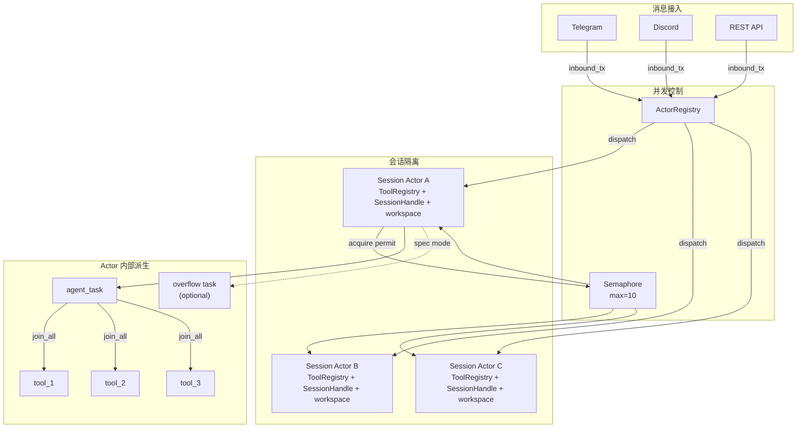
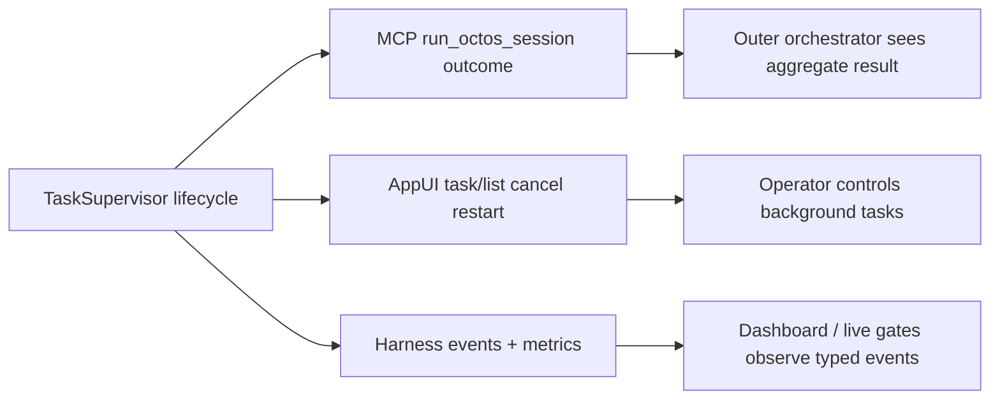

# 第 11 章：并发模型：Tokio 异步架构实战

> **定位**：本章展示 octos 如何利用 Tokio 异步运行时实现生产级并发——从 per-session actor 到 actor 内部的 per-message task 派生，从信号量限流到工具并发和优雅关停。前置依赖：第 5 章、第 10 章。适用场景：想理解 Rust 异步并发实战模式的开发者（读者 B），以及需要调优并发参数的运维人员（读者 D）。

单用户 CLI 模式下，Agent 是单线程顺序执行的——不需要考虑并发。但当 octos 作为 Gateway 或 Serve 模式运行时，多个用户同时发送消息，每个会话还可能夹杂取消、后台子任务结果、UI/API 状态投递与溢出消息。当前源码已经不是早期“每条消息直接 spawn + shared Mutex”的简单模型，而是一个分层并发结构：Gateway 主循环负责接入，`ActorRegistry` 负责会话生命周期，每个 session actor 自己拥有工具、会话文件句柄和用户工作区，然后再在 actor 内部按需派生消息任务、工具任务和后台 subagent。

---

## 11.1 分层 Spawn：会话、消息、工具、子 Agent

当前 octos 的 `tokio::spawn()` 不是只出现在一个地方，而是分布在四个层级，外加一层专门管理 `spawn_only` 生命周期的状态监督器：

1. **会话级 actor**：`ActorRegistry` 为新 session 创建 actor，`ActorFactory::spawn()` 最终通过 `tokio::spawn(actor.run())` 启动一个长期存活的 per-session 任务（`../octos/crates/octos-cli/src/session_actor.rs:1494-1608`、`../octos/crates/octos-cli/src/session_actor.rs:2505-2559`）
2. **消息级 agent task**：在 API / speculative 路径下，actor 会再把当前消息的主 Agent 调用派生成独立任务，这样 actor 自己还能继续轮询 inbox，及时接收取消、overflow、后台结果和状态事件（`../octos/crates/octos-cli/src/session_actor.rs:4280-4535`）
3. **工具级任务**：单轮 LLM 返回多个 tool call 时，`execute_tools()` 会为每个工具各自 `tokio::spawn()`，然后用 `join_all()` 汇总结果（`../octos/crates/octos-agent/src/agent/execution.rs:44-60`、`../octos/crates/octos-agent/src/agent/execution.rs:105-245`）
4. **后台子 Agent / spawn_only**：`spawn` 工具的 background 模式会再起一个长期子 Agent；`spawn_only` 工具也会在工具执行层单独起后台任务（`../octos/crates/octos-agent/src/tools/spawn.rs:2282-3024`、`../octos/crates/octos-agent/src/agent/execution.rs:220-455`）

这种分层 spawn 的好处是并发边界清晰：会话级隔离保证状态所有权，消息级派生保证 actor 还能继续响应控制消息，工具级并发保证单轮性能，后台子 Agent 则把长任务从主对话流中剥离出去。`spawn_only` 不是 fire-and-forget；它的可见状态由 `TaskSupervisor` 维护。Tokio 的 `JoinHandle` 还把 panic 封装为 `JoinError`，避免一个子任务直接把整条并发链路拖垮。

## 11.2 Session Actor：会话级状态所有权

虽然不同用户的消息并行处理，但**同一会话的核心状态必须有唯一 owner**。否则两条几乎同时到达的消息可能并发修改消息历史、工具注册表、sandbox 工作区和背景任务状态，结果就是经典的“状态没锁住，但语义已经乱了”。

octos 使用 session actor 模式（`../octos/crates/octos-cli/src/session_actor.rs`）实现这个 owner 语义——每个会话由一个独立的 tokio 任务（actor）管理：

```rust
// session_actor.rs 关键常量
const ACTOR_INBOX_SIZE: usize = 32;          // actor mailbox 容量
pub const DEFAULT_IDLE_TIMEOUT_SECS: u64 = 1800; // 空闲 30 分钟后回收
const MAX_OVERFLOW_TASKS: u32 = 5;           // speculative overflow 并发上限
const MAX_PENDING_PER_SESSION: usize = 50;   // 非活跃 session 的待发送缓冲上限
```

每个 session actor 不只是“有个队列”而已，它还拥有自己的 `ToolRegistry`、`SessionHandle`、per-user workspace、取消标志、流式 reporter 和后台任务接线（`../octos/crates/octos-cli/src/session_actor.rs:2428-2560`）。这正是 session actor 模式的核心：共享状态不再散落到每条消息任务里，而是由 actor 作为 owner 持有。

### 11.2.1 ActorMessage：类型安全的消息分发

Session actor 通过 `ActorMessage` 枚举接收消息（`../octos/crates/octos-cli/src/session_actor.rs:1412-1468`）：

```rust
pub enum ActorMessage {
    /// 用户消息——触发 Agent 迭代
    Inbound {
        message: InboundMessage,
        image_media: Vec<String>,
        attachment_media: Vec<String>,
        attachment_prompt: Option<String>,
    },
    /// 后台子 Agent 的结果——注入为系统消息，不触发额外 LLM 调用
    BackgroundResult {
        task_label: String,
        content: String,
        kind: BackgroundResultKind,
        media: Vec<String>,
        originating_thread_id: Option<String>,
        ack: Option<oneshot::Sender<bool>>,
    },
    /// 后台任务状态变化——推送到 SSE
    TaskStatusChanged { task_json: String },
    /// 取消当前操作
    Cancel,
    /// spawn_only 失败恢复提示
    RecoveryHint { /* task_id, tool_name, prompt, originating_client_message_id */ },
}
```

Rust 的枚举让消息类型在编译期确定——不可能发送一个 actor 不理解的消息类型。当前 `ActorMessage` 也说明了并发模型的演进：除了用户输入和取消，它还承载 background result、任务状态变更、附件上下文和 spawn_only 失败恢复提示。

### 11.2.2 ActorRegistry：会话生命周期管理

`ActorRegistry`（`../octos/crates/octos-cli/src/session_actor.rs:1494-1735`）管理所有 session actor 的生命周期：

```rust
pub struct ActorRegistry {
    actors: HashMap<String, ActorHandle>,        // 活跃 actor 表
    factory: Arc<ActorFactory>,                  // 默认 Agent 工厂
    profile_factories: HashMap<String, Arc<ActorFactory>>,  // Profile 特定工厂
    semaphore: Arc<Semaphore>,                   // 并发限制
    out_tx: mpsc::Sender<OutboundMessage>,       // 输出通道
    pending_messages: PendingMessages,           // 缓冲消息
}
```

当新消息到达时，`dispatch()` 会先按 session key + profile 解析 actor key，再做三件事：
- **发现 actor 已结束**：先回收死 actor，避免向失效 mailbox 发消息（`../octos/crates/octos-cli/src/session_actor.rs:1568-1573`）
- **缺少 actor**：调用 `factory.spawn(...)` 创建一个新 actor，并把 `system_prompt_override` / `sender_user_id` / profile factory key 等上下文挂在 `ActorHandle` 上，供后续 respawn 使用（`../octos/crates/octos-cli/src/session_actor.rs:1575-1598`）
- **actor 已存在**：优先 `try_send()`；若 mailbox 已满，先给用户发一个“仍在处理中，你的消息已排队”的反馈，再退回到阻塞 `send()`（`../octos/crates/octos-cli/src/session_actor.rs:1608-1626`）

`ActorHandle::is_finished()` 通过检查 `JoinHandle::is_finished()` 判断 actor 是否已退出——这是零开销的，不需要额外的心跳机制。

### 11.2.3 Mailbox、背压与溢出不是一回事

这几个上限名字很像，但语义完全不同：

1. **`ACTOR_INBOX_SIZE = 32`**：这是 actor mailbox 容量。它限制的是“同一个 actor 还没来得及 `recv()` 的消息数”
2. **`MAX_PENDING_PER_SESSION = 50`**：这是**非活跃 session** 的待发送缓冲上限。缓冲的是 outbound reply，不是 inbound user message（`../octos/crates/octos-cli/src/session_actor.rs:80-102`、`../octos/crates/octos-cli/src/session_actor.rs:2608-2616`）
3. **`MAX_OVERFLOW_TASKS = 5`**：这不是排队长度，而是 speculative 模式下“同一个 session 允许并发跑多少个 overflow agent task”的上限。超过时 actor 会立即回一个 busy 响应，而不是继续排队（`../octos/crates/octos-cli/src/session_actor.rs:5268-5300`）

这三个阈值分别保护 mailbox、inactive-session buffering 和会话内受控并发。如果把它们都理解成“队列大小”，就会误读 octos 的真实背压设计。

### 11.2.4 并发模型全景图



**图 11-1：octos 并发模型全景。** 消息先进入 ActorRegistry，再由 session actor 持有状态；Semaphore 限制的是活跃处理数，不是 actor 数量。actor 内部再按需派生 agent_task、tool task 和 speculative overflow task。

---

## 11.3 信号量限流

无限制的并发会话会耗尽系统资源（CPU、内存、LLM API 配额）。`Arc<Semaphore>` 限制同时活跃的处理数，默认值来自 `GatewayConfig.max_concurrent_sessions = 10`（`../octos/crates/octos-cli/src/config.rs:720-777`），具体 semaphore 在 Gateway Runtime 里创建（`../octos/crates/octos-cli/src/commands/gateway/gateway_runtime.rs:1401-1406`）。

```rust
// 获取许可——如果已有 10 个活跃处理，新消息在此等待
let _permit = self.semaphore.acquire().await?;
// 处理消息...
drop(_permit); // 释放许可，允许下一个等待的消息进入
```

这个 permit 获取发生在 actor 真正开始处理消息时，而不是在 actor 创建时（`../octos/crates/octos-cli/src/session_actor.rs:4307-4310`、`../octos/crates/octos-cli/src/session_actor.rs:5814-5818`）。因此，一个空闲 actor 可以常驻内存，但不会占用并发槽位；只有正在跑 LLM / tool / overflow 逻辑的会话才会消耗 permit。

信号量而非自定义计数器的优势是：`acquire().await` 自动挂起等待任务，不消耗 CPU；任务完成或 panic 时 permit 会通过 RAII 自动释放，不容易泄漏。

## 11.4 工具并发：join_all

在单次 Agent 迭代内，LLM 可能请求多个工具调用（如同时读取 3 个文件）。工具执行层会为每个 tool call 分别 `tokio::spawn()`，然后用 `join_all()` 风格的 fan-in 汇总结果（`../octos/crates/octos-agent/src/agent/execution.rs:44-60`、`../octos/crates/octos-agent/src/agent/execution.rs:105-245`）：

```rust
let handles: Vec<_> = tool_calls.iter()
    .map(|tc| tokio::spawn(execute_tool(tc)))
    .collect();
let results = futures::future::join_all(handles).await;
```

并行执行工具是 Agent 性能的关键优化——如果 3 个文件读取各需 10ms，串行执行需要 30ms，并行只需 ~10ms。

这里还有一个很有工程味的细节：工具任务不是只传 tool name 和 args；`spawn_tool_task()` 会把 reporter、hooks、file_state_cache、agent definitions、subagent output router、cost accountant、parent session key 和 spawn depth 一起克隆进任务上下文（`../octos/crates/octos-agent/src/agent/execution.rs:108-158`）。这让并发工具仍然继承本轮 Agent 的权限、观测和工作区边界。

## 11.5 子 Agent 双模式

octos 支持两种子 Agent 执行模式，而这两种模式都是并发边界设计的一部分：

### 11.5.1 同步阻塞模式

当 Agent 在主循环中调用需要子 Agent 的工具时，工具在当前迭代内同步等待子 Agent 完成。`spawn` 工具的 `mode = "sync"` 分支会构造子 Agent、继承父会话的工具策略/缓存/输出路由/压缩策略，然后通过 `run_task_with_m8_9_recovery()` 执行子任务，并在成功路径上继续跑 completion-phase validators，最后把子 Agent 输出作为当前 tool result 返回（`../octos/crates/octos-agent/src/tools/spawn.rs:2133-2280`）。

这适用于结果立即需要的场景——比如搜索结果需要在下一次 LLM 调用中使用。

### 11.5.2 后台异步模式（spawn 工具）

`spawn` 工具的 background 模式会 `tokio::spawn(async move { ... })` 起一个完全独立的后台 Agent。主 Agent 立即继续执行，不等待后台任务完成；后台闭包会快照父任务的 task id、originating thread id、hooks、workspace policy、父缓存和 spawn depth，再在完成后优先通过 direct background result sender 回到 session actor（`../octos/crates/octos-agent/src/tools/spawn.rs:2308-2354`、`../octos/crates/octos-agent/src/tools/spawn.rs:2550-2570`、`../octos/crates/octos-agent/src/tools/spawn.rs:2961-3024`、`../octos/crates/octos-cli/src/session_actor.rs:1138-1168`）。

```rust
// spawn 工具的简化逻辑
tokio::spawn(async move {
    let sub_agent = Agent::new(config);
    sub_agent.run_task(task).await;
    // 结果通过消息通知用户，不返回给主 Agent
});
// 主 Agent 立即继续
```

从用户体验看，后台结果又分两类：
- `BackgroundResultKind::Notification` 会作为后台通知直接发给用户，并携带可选媒体和 originating thread id
- `BackgroundResultKind::Report` 会先经过 `prepare_background_report_result()` 整理；长报告会落到 memory bank，再把可读摘要作为后台通知发出（`../octos/crates/octos-cli/src/session_actor.rs:3888-3930`）

### 11.5.3 TaskSupervisor：spawn_only 的状态真相

`spawn_only` 工具的难点不在于“能不能 `tokio::spawn` 一个任务”，而在于后台任务启动后如何让前端、父 Agent 和控制 API 都看到同一份生命周期真相。当前源码把这部分抽成了 `TaskSupervisor`（`../octos/crates/octos-agent/src/task_supervisor.rs:1-9`）。

`TaskSupervisor` 维护后台任务 ledger：任务创建后进入 `Spawned`，执行时进入 `Running`，最后落到 `Completed`、`Failed` 或 `Cancelled` 这类终态（`../octos/crates/octos-agent/src/task_supervisor.rs:88-123`）。更细的运行时阶段还包括 `ExecutingTool`、`ResolvingOutputs`、`VerifyingOutputs`、`DeliveringOutputs`、`CleaningUp`，最终再映射到对外可见的 `Queued`、`Running`、`Verifying`、`Ready`、`Failed`、`Cancelled`（`../octos/crates/octos-agent/src/task_supervisor.rs:152-262`）。

这里有两个容易被低估的生产约束：

- **fan-out 上限**：单个父任务默认最多 200 个子任务，环境变量 `OCTOS_MAX_CHILDREN_PER_PARENT` 可以覆盖；超过上限后，supervisor 不会继续无界派生，而是 poison parent 并把仍活跃的孩子标成 failed（`../octos/crates/octos-agent/src/task_supervisor.rs:29-52`、`../octos/crates/octos-agent/src/task_supervisor.rs:1390-1484`）。
- **workspace contract 先于状态更新**：工作区边界、输出声明和 artifact 验证在 `execution.rs` 热路径中完成后，supervisor 才接收状态更新；也就是说它记录的是已经通过执行层约束检查的状态，而不是任意后台线程自报的状态。
- **终态不被迟到事件复活**：`mark_running()`、`mark_runtime_state()`、`mark_completed()`、`mark_failed()` 都先检查 terminal state，避免用户 cancel 后迟到 worker 再把任务改回 Running / Completed / Failed（`../octos/crates/octos-agent/src/task_supervisor.rs:1543-1745`）。

这解释了为什么 AppUI 可以安全地提供 task list / cancel / restart 这类控制能力：它读写的是 supervisor 维护的受控状态机，而不是从日志里猜测后台任务进度。

### 11.5.4 Lifecycle projection：MCP 与 Harness 看到同一套状态

`TaskSupervisor` 的价值还在于它把后台任务状态投射给不同控制面。`octos mcp-serve` 暴露的 `run_octos_session` 并不会把内部工具调用逐条流给外层 MCP caller；它通过 lifecycle observer 标记 `Running`、`Verifying`，最后把 session aggregate outcome 转成 `Ready` 或 `Failed`（`../octos/crates/octos-cli/src/commands/mcp_serve.rs:16-35`、`../octos/crates/octos-agent/src/mcp_server.rs:9-34`、`../octos/crates/octos-agent/src/mcp_server.rs:410-493`）。

这意味着外层 orchestrator 看到的是“一个 octos session 的终态和 artifact”，而不是内部 loop 的每个 token 或工具事件。相反，operator dashboard 和 `/api/events/harness` 可以通过 harness events / metrics 观察 background spawn、sub-agent dispatch、swarm dispatch 和 cost attribution。并发状态因此有两种投影：



这个边界很重要：MCP Serve 是 coarse-grained session dispatch，不是把 octos 内部工具目录直接暴露出去；Harness events 是 operator 观察面，不是任务结果协议。

---

## 11.6 优雅关停

当 octos 收到 Ctrl-C 时，当前源码里的关停链路其实有两层 flag，而不是一个全局布尔值走完整个系统：

1. **Gateway 级 shutdown flag**：Ctrl-C handler 置位，Gateway Runtime 主循环和 session actor 自己会看这个标志（`../octos/crates/octos-cli/src/commands/gateway/gateway_runtime.rs:1320-1328`、`../octos/crates/octos-cli/src/commands/gateway/gateway_runtime.rs:1458-1488`、`../octos/crates/octos-cli/src/session_actor.rs:3060-3064`）
2. **Per-session cancelled flag**：session actor 通过 `.with_shutdown(cancelled.clone())` 传给 Agent，本轮任务里的 `check_budget()` 和 `wait_for_shutdown()` 实际读的是这个 flag（`../octos/crates/octos-cli/src/session_actor.rs:2441-2448`、`../octos/crates/octos-agent/src/agent/budget.rs:34-65`、`../octos/crates/octos-agent/src/agent/streaming.rs:14-29`）

```rust
// session actor：取消当前任务
self.cancelled.store(true, Ordering::Release);

// agent：在预算检查时观察取消标志
if self.shutdown.load(Ordering::Acquire) {
    return BudgetStop::Shutdown;
}
```

`Release` / `Acquire` 语义确保：actor 写入取消标志后，Agent 线程在读取时不会看到旧值。Gateway 的 Ctrl-C flag 也使用同样的序关系（`../octos/crates/octos-cli/src/commands/gateway/gateway_runtime.rs:1320-1328`）。

优雅关停的流程：
1. Ctrl-C handler 置位 Gateway shutdown flag
2. Runtime 主循环会在下一次取到 inbound 后、真正 dispatch 之前停止继续处理新消息
3. 进入 shutdown 阶段，最多等待 1 秒让 `actor_registry.shutdown_all()` 收尾；超时后交给 runtime teardown，避免 CLI 长时间卡住
4. 并发停止 persona / heartbeat / cron / channels 等后台服务（`../octos/crates/octos-cli/src/commands/gateway/gateway_runtime.rs:1830-1848`）

### 11.6.1 关停的四个阶段

优雅关停不是一个简单的 `process::exit()`——它是一个有序的资源释放过程：

1. **停止继续 dispatch 新消息**：Gateway Runtime 会在 shutdown notify 或下一条 inbound 到来时检查 shutdown flag 并跳出主循环（`../octos/crates/octos-cli/src/commands/gateway/gateway_runtime.rs:1458-1488`）
2. **等待 actor 结束**：`shutdown_all()` 会 drop actor senders，并等待 join handle 完成；Gateway Runtime 当前只等 1 秒，防止 hung actor 阻塞 CLI 退出（`../octos/crates/octos-cli/src/session_actor.rs:1720-1735`、`../octos/crates/octos-cli/src/commands/gateway/gateway_runtime.rs:1830-1839`）
3. **actor 内部完成本轮清理**：session actor 自己会在 loop 边界检查 `global_shutdown` / `cancelled`，随后退出（`../octos/crates/octos-cli/src/session_actor.rs:3037-3068`）
4. **停后台服务与频道**：最后并发 stop persona / heartbeat / cron / channel manager（`../octos/crates/octos-cli/src/commands/gateway/gateway_runtime.rs:1841-1848`）

### 11.6.2 Ordering 语义为什么重要

```rust
// 错误：使用 Relaxed
shutdown.store(true, Ordering::Relaxed);   // 主线程
if shutdown.load(Ordering::Relaxed) { ... } // Agent 线程
// Agent 线程可能看到 stale 值——在多核 CPU 上，store 可能还在写缓冲中
```

`Release` / `Acquire` 配对确保了 happens-before 关系：发起取消的一方先 `store(true, Release)`，执行任务的一方再 `load(Acquire)`，这样取消事件前的状态变更不会在另一个线程里乱序消失。

`Relaxed` 在这里不够——虽然 x86 架构上的 `Relaxed` 几乎等同于 `Acquire/Release`（因为 x86 的内存模型较强），但在 ARM 等弱内存模型架构上，`Relaxed` 可能导致 Agent 线程在检测到 shutdown 为 true 之后仍然看到 stale 的消息队列状态。

---

## 11.7 冷启动优势：常驻进程 vs fork/exec

传统的 per-request fork/exec 模型会为每条消息重复创建进程、加载运行时、初始化 Provider 与工具注册表，然后处理完就退出。octos 的 Gateway/Serve 模式采用**常驻进程 + Tokio 异步运行时**，把这类初始化尽量前移到启动阶段：

```
┌──────────────────────────────────────────────────────────┐
│ fork/exec 模型（每条消息）                                  │
│                                                          │
│  fork → load runtime → init provider → build tools →     │
│  process message → exit                                  │
│  ~~~~~~~~~~~~~~~~~~~~~~~~~~~~~~~~~~~~~~~~~~~~~~~~~~~~~~~~ │
│  每条消息都重复做初始化                                      │
└──────────────────────────────────────────────────────────┘

┌──────────────────────────────────────────────────────────┐
│ octos 常驻进程模型                                         │
│                                                          │
│  一次启动：init main provider stack + build tools + start │
│            channels/services                             │
│  ──────────────────────────────────────────────────────── │
│  每条消息：dispatch → actor.send() → process              │
│  重复开销缩小为 actor 查找/创建与排队                       │
└──────────────────────────────────────────────────────────┘
```

具体来说，Gateway 启动时会先为**主 profile**构建默认的 LLM/provider stack；如果配置了 fallback models，会在这一阶段一并构造 `RetryProvider`、`ProviderChain` 或 `AdaptiveRouter` 所需的候选链路，然后再包进 `SwappableProvider` 供主 profile 会话复用（`../octos/crates/octos-cli/src/commands/gateway/gateway_runtime.rs:288-355`）。

目标 profile 则走另一条路径：首次消息分发到某个 profile 时，Gateway 按需构建该 profile 的 `ActorFactory`，并缓存到 `ActorRegistry::profile_factories`；后续同一 profile 的新会话复用这个工厂，而不是每条消息都重新初始化（`../octos/crates/octos-cli/src/session_actor.rs:1521-1549`、`../octos/crates/octos-cli/src/commands/gateway/profile_factory.rs`）。

`PROFILE_PROMPT_CACHE_CAP = 128` 的 prompt cache 也是同类优化，但它只用于“目标 profile 尚未注册独立 factory”的 fallback 路径：这时 Gateway 会把从 profile store 读取到的 system prompt 临时缓存在内存里，避免反复访问磁盘（`../octos/crates/octos-cli/src/commands/gateway/gateway_runtime.rs:58`、`../octos/crates/octos-cli/src/commands/gateway/gateway_runtime.rs:1758-1770`）。

之后每条消息的处理路径只有：

1. `ActorRegistry::dispatch()` 查找或创建 session actor
2. `actor.tx.send(message)` 将消息发到 actor 的 mailbox
3. Actor 开始真正处理消息时才获取 Semaphore permit，然后进入 Agent 迭代

空闲 actor 常驻内存但不占用并发槽位（详见 11.3 信号量限流）——Semaphore permit 在 actor 真正开始处理消息时才获取，不在 actor 创建时获取（`../octos/crates/octos-cli/src/session_actor.rs:4307-4310`）。这意味着 1000 个会话可以同时存在，但只有 10 个在活跃处理。

这类优势可以从源码确认，但**不能仅凭源码推出固定的毫秒级收益**。真实延迟仍取决于 Provider、工具链、网络和部署环境；本章能确定的是“初始化被前移并按 profile/session 复用”，而不是某个通用的 benchmark 数字。

常驻模型的另一个实际收益是**会话级短期状态可以持续累积**。同一会话的 actor 默认存活 30 分钟（`DEFAULT_IDLE_TIMEOUT_SECS = 1800`），因此该 actor 持有的工具注册表和 LRU 热度统计能在会话生命周期内持续更新；fork/exec 模型则天然做不到这种跨消息的短期状态保留。

---

## 11.8 Heartbeat 与 Cron

octos 支持定时触发 Agent 会话，三种调度类型：

| 类型 | 示例 | 精度 |
|------|------|------|
| Every | 每 5 分钟 | 固定间隔 |
| Cron | `0 9 * * 1-5` | Cron 表达式 |
| At | 每天 09:00 | 固定时间点 |

定时任务通过 `cron` crate 解析表达式，在 Tokio 运行时中注册定时器。触发时创建新的会话消息，经过正常的消息处理管线。

---

> ### 工程决策侧栏：为什么从共享 Mutex 演化到 Session Actor
>
> **方案一：共享 `Mutex<SessionState>`**
>
> 优势：实现最直接，“同一时刻只能处理一条消息”的语义也很容易表达。
>
> 劣势：真正麻烦的不是锁本身，而是锁里到底该放什么。工具注册表、用户工作区、后台结果回流、UI/API 状态投递、取消信号，这些状态如果散落在锁外，语义竞态依然存在。
>
> **方案二：完全无状态的 spawn-per-message**
>
> 优势：并行度高，消息来了就起任务，几乎不需要长期存活结构。
>
> 劣势：每次都要重建工具与会话上下文；后台结果路由、消息背压和 overflow 控制会散落在多个任务之间，难以形成一个稳定的 owner。
>
> **方案三：Session Actor（当前源码的选择）**
>
> 优势：mailbox、ToolRegistry、SessionHandle、用户工作区、取消标志、background result injection 都收敛到一个 owner 上；并发点从“谁都能改状态”变成“actor 内部何时显式派生子任务”。
>
> 代价：实现明显更复杂，必须处理 inbox 满载、actor respawn、overflow 并发和 shutdown 协调。但对于 octos 这种长会话、多工具、可中断的 Agent，这个复杂度换来了更稳的运行时边界。

---

## 11.8 本章回顾

1. **分层并发**：octos 现在是“Gateway dispatch → session actor → actor 内部消息任务 / 工具任务 / 子 Agent”这套分层 spawn 结构，不是单一的 per-message spawn 模型。
2. **Session Actor**：每个会话都有自己的 ToolRegistry、SessionHandle、workspace 和 mailbox，状态所有权清晰。
3. **Semaphore 限流**：默认 10 个活跃处理槽位；permit 在真正处理消息时获取，而不是在 actor 创建时占坑。
4. **工具与后台任务**：`join_all` 负责单轮工具并发，`spawn` / `spawn_only` 负责把长任务从主回路拆出去；`TaskSupervisor` 负责 `spawn_only` 的状态 ledger、取消态和 fan-out 上限。
5. **Lifecycle projection**：MCP Serve、AppUI 和 Harness events 看到的是同一套任务生命周期的不同投影：外层 orchestrator 收 aggregate outcome，operator 控制后台任务，dashboard 观察 typed events。
6. **优雅关停**：Gateway shutdown flag 和 per-session cancelled flag 分层配合，配上 Release/Acquire 语义，让接入停止、任务取消、actor 回收和服务 stop 有明确边界。

---

## 延伸阅读

- **Tokio 教程**：https://tokio.rs/tokio/tutorial — 异步 Rust 运行时
- **Rust Atomics and Locks**：Mara Bos 的书，https://marabos.nl/atomics/ — 理解 Release/Acquire 语义
- **结构化并发**：Nathaniel J. Smith, "Notes on structured concurrency" — 理解 spawn + join 的模式

## 思考题

1. **Actor 内部还需要多少锁？** 当前 actor 已经提供了状态 owner，但 `SessionHandle`、`PendingMessages` 等局部资源仍然用了 `Mutex`。如果未来要支持更复杂的跨会话共享缓存，锁应该留在 actor 内，还是再抽出独立协调层？
2. **信号量的公平性**：当 10 个并发槽位全部占满时，等待的消息按什么顺序获得许可？Tokio 的 Semaphore 是 FIFO 的吗？

---

> **版本演化说明**
> 本章分析基于 `../octos` 当前 main 分支源码。若你在更早的设计文档或旧书稿里见过“per-message spawn / per-session Mutex 是核心模型”的说法，应以现在的 `session_actor.rs`、`TaskSupervisor`、MCP lifecycle observer 和 harness event surfaces 为准：核心并发边界已经演化为 session actor + per-actor state ownership + supervised background lifecycle。
