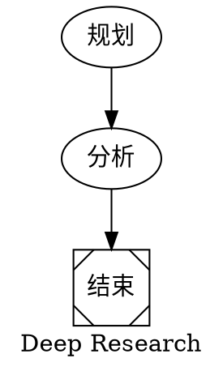
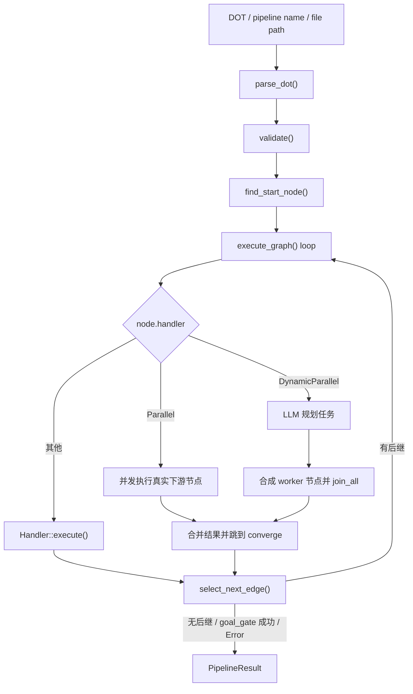

# 第 12 章：octos-pipeline：DOT 图驱动的工作流引擎

> **定位**：本章对照 `crates/octos-pipeline/src/`，解释 octos 如何把 Graphviz DOT 图解析成带类型的 `PipelineGraph`，以及执行器如何在顺序节点、静态并行、动态并行之间切换。前置依赖：第 5 章。适用场景：需要理解多步骤 Agent 编排机制的开发者。

当任务已经不是“单个 Agent 循环 + 几次工具调用”能解决的问题时，就需要显式的工作流编排。典型例子是：先规划研究角度，再并发检索，再汇总分析，最后生成报告。`octos-pipeline` 解决的就是这类问题，但它的当前实现和“传统 DAG 调度器”的直觉并不完全一样：它既有图结构，也有运行时分支选择、并发汇合、模型路由和工具策略继承。

---

## 12.1 DOT 图如何进入运行时

### 12.1.1 为什么是 DOT

octos 用 Graphviz DOT 定义工作流，而不是 YAML/JSON。原因不是“DOT 更潮”，而是它天然把节点和边作为一等语义：同一个文件既能被执行器解析，也能直接被 Graphviz 渲染成图。



这个例子已经体现了当前 parser 支持的几类关键能力：

- 图级属性：`graph [label=..., default_model=...]`
- 节点属性：`handler`、`model`、`tools`、`converge`、`planner_model` 等
- 边：`A -> B`
- 形状到 Handler 的隐式映射，例如 `Msquare` 会映射到 `Noop`

### 12.1.2 手写 parser，而不是第三方 DOT 库

入口是 `crates/octos-pipeline/src/parser.rs:18-20` 的 `parse_dot()`，真实工作发生在 `DotParser::parse()`（`crates/octos-pipeline/src/parser.rs:34-98`）。这是一个手写 parser，不依赖外部 DOT 解析库。

当前实现比“只支持一小撮语法”的简化说法要丰富一些：

- `digraph` 名称是可选的；如果模型生成了 `digraph { ... }`，parser 会把图 ID 设成 `"pipeline"`（`crates/octos-pipeline/src/parser.rs:42-48`）
- 支持图级属性 `graph [key=value]`，目前会落到 `label` 和 `default_model`（`crates/octos-pipeline/src/parser.rs:104-113`, `crates/octos-pipeline/src/parser.rs:487-493`）
- 支持 `subgraph name { ... }`，并把子图中的节点归档到 `PipelineGraph.subgraphs`（`crates/octos-pipeline/src/parser.rs:115-230`, `crates/octos-pipeline/src/graph.rs:21-24`, `crates/octos-pipeline/src/graph.rs:244-253`）
- 支持边链式写法 `a -> b -> c`，属性会应用到链上的每一条边（`crates/octos-pipeline/src/parser.rs:233-267`）
- 支持 `//`、`/* */`，以及额外的 `#` 行注释；后者明显是在为 LLM 生成的 DOT 做容错（`crates/octos-pipeline/src/parser.rs:446-483`）
- 如果边引用了未显式声明的节点，parser 会自动补出默认节点定义（`crates/octos-pipeline/src/parser.rs:76-96`）

这一层的结果不是“松散的 JSON 树”，而是带语义的 `PipelineGraph`。其核心结构在 `crates/octos-pipeline/src/graph.rs:10-24` 和 `crates/octos-pipeline/src/graph.rs:91-129`：

- `PipelineGraph` 有 `id`、`label`、`default_model`、`nodes`、`edges`、`subgraphs`
- `PipelineNode` 除了 `prompt` 和 `handler`，还包含 `model`、`context_window`、`max_output_tokens`、`tools`、`goal_gate`、`max_retries`、`timeout_secs`、`suggested_next`、`converge`、`worker_prompt`、`planner_model`、`max_tasks`

### 12.1.3 属性到节点语义的映射

节点构建发生在 `build_node()`（`crates/octos-pipeline/src/parser.rs:524-562`）。这里有几个实现细节决定了 DOT 的“作者体验”：

- Handler 解析顺序是：显式 `handler=` 优先，其次是 `shape=` 到 Handler 的映射，最后默认 `Codergen`（`crates/octos-pipeline/src/parser.rs:525-530`, `crates/octos-pipeline/src/graph.rs:204-216`）
- `tools="a,b,c"` 会被拆成字符串列表；如果用户写了 `tools=""`，解析结果会是一个只含空字符串的列表，后面执行器会把它当成“显式禁用所有工具”处理（`crates/octos-pipeline/src/parser.rs:532-535`, `crates/octos-pipeline/src/handler.rs:219-236`）
- `timeout_secs` 不只接受整数秒，也接受 `900s`、`15m`、`2h` 这类后缀写法（`crates/octos-pipeline/src/parser.rs:496-513`）
- `goal_gate` 允许用 `true/false/yes/no/1/0` 表达（`crates/octos-pipeline/src/parser.rs:515-522`）

这意味着 DOT 在 octos 里不是“纯拓扑描述”，而是一个轻量的工作流 DSL。

---

## 12.2 六种节点语义，而不是五种

`HandlerKind` 的真实枚举在 `crates/octos-pipeline/src/graph.rs:169-187`。当前源码是 6 种，不是 5 种：

| 类型 | 运行时落点 | 关键属性 | 作用 |
|------|-----------|---------|------|
| `Codergen` | `crates/octos-pipeline/src/handler.rs:193-383` | `prompt` `model` `tools` `context_window` `max_output_tokens` | 派生完整子 Agent |
| `Shell` | `crates/octos-pipeline/src/handler.rs:396-459` | `prompt` `timeout_secs` | 执行 shell 命令 |
| `Gate` | `crates/octos-pipeline/src/handler.rs:466-509` | `prompt` | 计算条件，不做人机等待 |
| `Noop` | `crates/octos-pipeline/src/handler.rs:515-526` | 无 | 透传输入 |
| `Parallel` | `crates/octos-pipeline/src/executor.rs:711-895` | `converge` | 对已有下游节点做静态 fan-out |
| `DynamicParallel` | `crates/octos-pipeline/src/executor.rs:897-1198` | `prompt` `worker_prompt` `planner_model` `max_tasks` `converge` | 先规划任务，再动态 fan-out |

还有一个容易忽略但很重要的事实：并不是 6 种都对应一个 `Handler` 实现。真正实现了 `Handler` trait 的只有 `Codergen`、`Shell`、`Gate`、`Noop`（`crates/octos-pipeline/src/handler.rs:76-81`）。`Parallel` 和 `DynamicParallel` 不是独立 handler 类型，而是 `PipelineExecutor::execute_graph()` 里的专门分支（`crates/octos-pipeline/src/executor.rs:711-1198`）。

### 12.2.1 Codergen：节点就是一个子 Agent

`CodergenHandler` 会为节点创建一个完整的 `octos_agent::Agent`，而不是做一次简化版 LLM 调用（`crates/octos-pipeline/src/handler.rs:193-383`）。这意味着节点天然继承了主 Agent 的很多能力：工具调用、循环式执行、token 统计、文件修改回传、进度事件上报。

它的关键行为有几层：

1. **Provider 解析。** 如果节点声明了 `model`，并且执行器配置了 `ProviderRouter`，handler 会走 `router.resolve()`，然后再包一层 capability-compatible fallback provider（`crates/octos-pipeline/src/handler.rs:157-190`）。这不是单纯的“model name -> provider”映射，而是带回退链的解析。
2. **上下文窗口覆盖。** `context_window` 会包装成 `ContextWindowOverride`（`crates/octos-pipeline/src/handler.rs:201-206`）。
3. **工具注册。** 节点初始工具集来自 `ToolRegistry::with_builtins()`，然后按需加载 plugin tools（`crates/octos-pipeline/src/handler.rs:208-217`）。
4. **工具策略。** 节点自己的 `tools=` 决定 allowlist；但即便允许了很多工具，handler 仍会额外 deny `spawn`、`run_pipeline`、`send_file`、`message`，避免子节点递归失控（`crates/octos-pipeline/src/handler.rs:227-251`）。
5. **系统提示词与任务输入分离。** 执行器会先把 `{input}` 从 `prompt` 中移除，只保留角色/约束类说明；真正的前驱输出通过 `TaskKind::Code.instruction` 传给子 Agent（`crates/octos-pipeline/src/executor.rs:1226-1245`, `crates/octos-pipeline/src/handler.rs:333-342`）。

一个和旧稿差异很大的点是：当前节点并没有 `max_iterations` 这种 DOT 属性。`CodergenHandler` 内部把 `AgentConfig.max_iterations` 固定成 30（`crates/octos-pipeline/src/handler.rs:311-317`）。真正可调的是：

- `timeout_secs`
- `max_output_tokens`
- `context_window`
- `model`
- `tools`
- `max_retries`

另外，`max_output_tokens` 的默认行为也不是“全局 4096”。如果节点没写这个属性，handler 会退回到 provider 自身的最大输出能力（`crates/octos-pipeline/src/handler.rs:304-316`）。这对长报告生成很关键。

### 12.2.2 Shell：最简单，但语义很清楚

`ShellHandler` 是最容易完整理解的一种实现（`crates/octos-pipeline/src/handler.rs:396-459`）：

- 命令来源是 `node.prompt`，没有就退回 `ctx.input`
- 非 Windows 下执行 `sh -c`，Windows 下执行 `cmd /C`
- 默认超时 300 秒，可由 `timeout_secs` 覆盖
- 非零退出码映射成 `OutcomeStatus::Fail`
- 进程启动失败或超时映射成 `OutcomeStatus::Error`

这个区分很重要，因为执行器只会对 `Error` 做重试（`crates/octos-pipeline/src/executor.rs:1394-1417`）。也就是说：

- “测试跑了但失败”是业务失败，不重试
- “命令根本没起来”或“超时”才是系统错误，可重试

### 12.2.3 Gate：当前是条件节点，不是人工审批节点

这是 `Ch12` 里最容易写错的一块。

当前执行器注册的是 `GateHandler`（`crates/octos-pipeline/src/executor.rs:626-653`），而 `GateHandler` 的真实语义是：

- 把 `node.prompt` 当成条件表达式
- 对“最后一个已完成节点”的 `NodeOutcome` 求值
- 返回 `Pass` 或 `Fail`
- `content` 直接透传，不发起人机交互（`crates/octos-pipeline/src/handler.rs:466-509`）

如果 `prompt` 为空，它默认把条件视为 `"true"`，于是变成一个 pass-through gate（`crates/octos-pipeline/src/handler.rs:469-493`）。

`human_gate.rs` 的确存在，而且提供了 `HumanInputProvider`、`ChannelInputProvider`、`HumanRequest`、`HumanResponse`，默认超时 5 分钟（`crates/octos-pipeline/src/human_gate.rs:14-140`）。但我对照当前源码后可以明确说：这些抽象**没有接进** `PipelineExecutor::build_handlers()` 或 `execute_graph()` 主路径（`crates/octos-pipeline/src/executor.rs:626-653`）。所以“Gate = 人工审批节点”已经不是当前实现的准确说法。

更准确的表述应该是：

- `GateHandler` 是已接线的条件节点
- `human_gate.rs` 是 crate 已提供、但尚未接入默认执行器的人机输入抽象

### 12.2.4 Parallel：静态 fan-out，执行真实下游节点

`Parallel` 是当前章节里最值得补深度的一种类型，因为它不是“动态生成 worker”，而是把图里已经存在的下游节点并发跑掉（`crates/octos-pipeline/src/executor.rs:711-895`）。

它的执行过程是：

1. 收集当前节点所有 outgoing edges 的 target，作为并发目标（`crates/octos-pipeline/src/executor.rs:717-722`）
2. 要求当前节点必须声明 `converge`，否则验证阶段直接报错（`crates/octos-pipeline/src/validate.rs:279-317`）
3. 为每个目标节点克隆 `PipelineNode`，做变量替换，并在未显式声明模型时填入 `graph.default_model`（`crates/octos-pipeline/src/executor.rs:779-792`）
4. 为每个目标节点查它自己的 handler，然后并发执行（`crates/octos-pipeline/src/executor.rs:775-830`）
5. 用 `process_worker_results()` 合并内容、token、summary 和 node outcome（`crates/octos-pipeline/src/executor.rs:300-385`, `crates/octos-pipeline/src/executor.rs:832-845`）
6. 把汇总后的文本写回“当前 parallel 节点”的 `completed` 结果，再跳到 `converge` 节点（`crates/octos-pipeline/src/executor.rs:867-894`）

这里有两个实现细节值得记住：

- `Parallel` 的并发度受 `ExecutorConfig.max_parallel_workers` 限制，靠 `tokio::sync::Semaphore` 实现（`crates/octos-pipeline/src/executor.rs:762-767`）
- 执行器会用 `parallel_executed` 记住那些已经在 fan-out 阶段跑过的真实图节点，后续顺序遍历遇到它们时只选边，不重复执行（`crates/octos-pipeline/src/executor.rs:668-709`, `crates/octos-pipeline/src/executor.rs:842-845`）

此外，结果合并并不只是简单字符串拼接。`process_worker_results()` 之后还会调用 `resolve_search_result_files()`，自动扫描 worker 输出里提到的研究目录，把 `_search_results.md` 的内容内联进 merge 结果（`crates/octos-pipeline/src/executor.rs:380-501`）。这说明当前 Pipeline 已经针对“研究型 fan-out -> 汇总型 converge”做了专门优化。

### 12.2.5 DynamicParallel：先规划，再合成 worker 节点

`DynamicParallel` 和 `Parallel` 的根本区别是：它不直接跑现成的图节点，而是先让 LLM 规划出任务列表，再为每个任务合成一个临时 `PipelineNode`（`crates/octos-pipeline/src/executor.rs:997-1055`）。

主流程在 `crates/octos-pipeline/src/executor.rs:897-1198`：

1. 解析 `planner_model -> node.model -> graph.default_model` 的 planner provider 选择链（`crates/octos-pipeline/src/executor.rs:932-940`）
2. 用 `node.prompt` 作为规划提示词；若为空则退回内置 planner prompt（`crates/octos-pipeline/src/executor.rs:942-947`）
3. 期望模型返回纯 JSON 数组；若少于 2 个任务或解析失败，则退回 `fallback_tasks()`（`crates/octos-pipeline/src/executor.rs:152-257`, `crates/octos-pipeline/src/executor.rs:961-989`）
4. 把 `worker_prompt` 里的 `{task}` 替换为具体任务说明，生成一批 synthetic `Codergen` 节点（`crates/octos-pipeline/src/executor.rs:997-1055`）
5. 并发执行这些 synthetic 节点，合并结果后跳到 `converge` 节点（`crates/octos-pipeline/src/executor.rs:1089-1198`）

它还有两个旧稿完全没写到的行为：

- `node.model` 可以写成逗号分隔的 model pool，例如 `"cheap,strong,cheap"`；执行器会把 worker 轮询分配到不同模型上（`crates/octos-pipeline/src/executor.rs:1002-1039`）
- 当前 `DynamicParallel` **没有**像 `Parallel` 那样再套一层 semaphore；它的 fan-out 上限主要依赖 `max_tasks`，默认值是 8（`crates/octos-pipeline/src/executor.rs:930`, `crates/octos-pipeline/src/executor.rs:1089-1131`）

所以如果你问“当前实现里哪种并发更受控”，答案其实是：静态 `Parallel` 的并发度控制更硬，`DynamicParallel` 更依赖 planner 输出和 `max_tasks` 自我约束。

### 12.2.6 Noop：占位，但也很实用

`NoopHandler` 就是把 `ctx.input` 原样返回（`crates/octos-pipeline/src/handler.rs:512-526`）。它有两个常见用途：

- 作为 start / finish 这类结构节点
- 作为某些条件分支的汇合点或透传点

---

## 12.3 执行引擎不是“拓扑排序器”，而是带路由的图遍历器



**图 12-1：当前 `PipelineExecutor` 的真实主路径。** 它不是先做一次全图拓扑排序，再机械执行所有节点；而是从 start node 出发，在循环里按节点类型分流，并在每一步重新决定下一条边。

### 12.3.1 `run()` 的实际阶段

`PipelineExecutor::run()` 在 `crates/octos-pipeline/src/executor.rs:514-624`，可以概括成五步：

1. `parse_dot()` 解析 DOT
2. `validate()` 跑 lint 规则
3. `build_handlers()` 构建常规 handler registry
4. `find_start_node()` 决定入口节点
5. `execute_graph()` 进入主循环

这里最重要的纠偏是：第四步之后不是“拓扑遍历整个 DAG”，而是 `current_node_id` 驱动的增量遍历（`crates/octos-pipeline/src/executor.rs:655-1392`）。这也是为什么 `suggested_next`、条件边、label 匹配这些运行时路由策略都能生效。

### 12.3.2 验证规则和 start node 选择

验证器在 `crates/octos-pipeline/src/validate.rs:27-372`，当前有 15 条规则，而不只是“检查一下条件能不能 parse”。

比较重要的几条：

- Rule 1：必须能找到 start node（`start` 节点，或唯一一个无入边节点）（`crates/octos-pipeline/src/validate.rs:52-71`, `crates/octos-pipeline/src/validate.rs:75-99`）
- Rule 2：不可达节点只是 warning，不是 error（`crates/octos-pipeline/src/validate.rs:101-140`）
- Rule 6：边条件必须能被 condition parser 解析（`crates/octos-pipeline/src/validate.rs:188-203`）
- Rule 13 / 14：`parallel` 和 `dynamic_parallel` 都必须声明有效的 `converge`（`crates/octos-pipeline/src/validate.rs:279-317`, `crates/octos-pipeline/src/validate.rs:329-372`）
- Rule 15：图中不能有环；环检测发生在 validate 阶段，不等执行时才爆炸（`crates/octos-pipeline/src/graph.rs:26-88`, `crates/octos-pipeline/src/validate.rs:319-327`）

这意味着 octos-pipeline 当前仍然要求 DAG，但执行方式不是“静态 DAG 调度器”，而是“受 DAG 约束的动态图遍历器”。

### 12.3.3 条件语言和边选择顺序

条件表达式的 grammar 写在 `crates/octos-pipeline/src/condition.rs:1-18`。当前运行时真正支持的核心写法是：

- `outcome.status == "pass"`
- `outcome.status != "fail"`
- `outcome.contains("keyword")`
- `!expr`、`expr && expr`、`expr || expr`

例如：

```dot
test -> deploy   [condition="outcome.status == \"pass\""]
test -> rollback [condition="outcome.status == \"fail\""]
report -> refine [condition="outcome.contains(\"missing data\")"]
```

旧稿里那种 `success` / `failure` 简写已经不符合当前 parser。

更值得写清楚的是，执行器选边不是“第一个命中就走”，而是一个 5 步算法（`crates/octos-pipeline/src/executor.rs:1419-1478`）：

1. 先评估所有带条件的边
2. 如果有多个条件命中，按 `weight` 选最高权重
3. 若无条件命中，检查节点的 `suggested_next`
4. 再看 edge label 是否出现在 outcome content 里
5. 最后才在无条件边里按权重选；如果还没有，就退回目标名最小的边

还有一个微妙但重要的实现现状：`condition.rs` 的 grammar 虽然支持 `context.key == "value"`，但 `select_next_edge()` 和 `GateHandler` 走的是 `evaluate()`，不是 `evaluate_with_context()`（`crates/octos-pipeline/src/condition.rs:64-85`, `crates/octos-pipeline/src/handler.rs:495-496`, `crates/octos-pipeline/src/executor.rs:1433-1439`）。也就是说，`context.*` 目前是“语法已定义、主路径未喂值”的状态；真正稳定可用的还是 `outcome.*` 相关条件。

### 12.3.4 进度、统计和终止条件

`PipelineStatusBridge` 定义在 `crates/octos-pipeline/src/executor.rs:43-83`，桥接了两类外部可见状态：

- `status_words`：当前节点或 fan-out worker 的状态文案
- `token_tracker`：所有子 Agent 的 token 聚合

当 `CodergenHandler` 内部子 Agent 产出 `ProgressEvent` 时，`PipelineNodeReporter` 会把事件重新转成 `run_pipeline` 的进度消息（`crates/octos-pipeline/src/handler.rs:20-64`）。所以前端看到的 pipeline 进度，不只是“现在在第几个节点”，而是能继续细到“某个 worker 正在调用哪个工具”。

执行终止有三种常见路径：

- 当前节点没有 outgoing edges（`crates/octos-pipeline/src/executor.rs:1368-1388`）
- 某个 `goal_gate=true` 节点成功，提前结束 pipeline（`crates/octos-pipeline/src/executor.rs:1315-1340`）
- 某节点返回 `OutcomeStatus::Error`，整个 pipeline 直接停止（`crates/octos-pipeline/src/executor.rs:1343-1356`）

最终返回的是 `PipelineResult`（`crates/octos-pipeline/src/executor.rs:28-41`），其中除了 `output` / `success` / `token_usage`，还有：

- `node_summaries`：每个节点的 `model`、耗时、token 和 success
- `files_modified`：所有节点写出的文件，去重后汇总

### 12.3.5 当前生效的模型选择路径

当前主路径真正生效的模型选择机制有两层：

- 图级默认：`graph [default_model="cheap"]`
- 节点覆盖：`node [model="strong"]`

这两层分别在 parser 中落到 `PipelineGraph.default_model` 和 `PipelineNode.model`（`crates/octos-pipeline/src/parser.rs:487-493`, `crates/octos-pipeline/src/parser.rs:537-562`），然后在执行时由 `execute_graph()` 和 `CodergenHandler` 联合应用（`crates/octos-pipeline/src/executor.rs:790-792`, `crates/octos-pipeline/src/executor.rs:1242-1245`, `crates/octos-pipeline/src/handler.rs:201-206`）。

`ModelStylesheet` 模块本身是存在的，支持 `*` / `handler:codergen` / `node:critical_analysis` 这类 selector（`crates/octos-pipeline/src/stylesheet.rs:13-104`）。但我对照当前源码后，没有找到它被 `PipelineExecutor`、`RunPipelineTool` 或 `PipelineDiscovery` 调用的路径。换句话说：

- `ModelStylesheet` 是 crate 已导出的能力
- 当前默认执行路径用的仍然是 `default_model + node.model`

如果书里把 ModelStylesheet 写成主路径，会高估它在当前版本里的实际地位。

### 12.3.6 `human_gate`、`checkpoint`、`run_dir` 的真实位置

这一章还有三个容易被写成“默认能力”的模块，但当前更准确的定位是“相邻库能力”：

- `human_gate.rs`：提供 channel-based human input 抽象，默认超时 5 分钟，但未接入 `PipelineExecutor`（`crates/octos-pipeline/src/human_gate.rs:14-140`）
- `checkpoint.rs`：提供 `Checkpoint` / `CheckpointStore`，能把已完成节点 outcome 写到 `{run_dir}/checkpoint.json`（`crates/octos-pipeline/src/checkpoint.rs:13-106`）
- `run_dir.rs`：提供 `RunDir`、`NodeStatus`、`PipelineRunSummary`，约定运行目录是 `{working_dir}/.octos/runs/{run_id}/...`（`crates/octos-pipeline/src/run_dir.rs:16-114`）

但我对照当前 crate 的调用关系后，没有看到它们被 `PipelineExecutor::run()` 主路径直接使用。也就是说，这些模块已经存在，但“默认 `run_pipeline` 就会自动 checkpoint / 自动写 run_dir / 自动做人机审批”并不是当前源码能支持的结论。

### 12.3.7 `run_pipeline` 工具如何把 pipeline 暴露给 Agent

对最终用户来说，最常见的入口不是直接 new `PipelineExecutor`，而是 `RunPipelineTool`（`crates/octos-pipeline/src/tool.rs:17-322`）。

它有几层很实际的工程化包装：

- 先尝试把输入当成 inline DOT；若 parse 失败，再尝试把图名解析成预置 pipeline（`crates/octos-pipeline/src/tool.rs:78-134`）
- 会自动修正常见的 LLM DOT 错误，比如 `digraph{`、缺图名、代码围栏包裹（`crates/octos-pipeline/src/tool.rs:324-356`）
- 可按名称、路径或内联 DOT 解析 pipeline；搜索路径包括项目级 `.octos/pipelines`、用户级 `data_dir/pipelines`、`data_dir/skills`，额外还能挂 `octos_home/skills`（`crates/octos-pipeline/src/discovery.rs:18-114`, `crates/octos-pipeline/src/tool.rs:50-56`）
- 对整个 pipeline 施加 60-1800 秒的总超时钳制（`crates/octos-pipeline/src/tool.rs:150-152`, `crates/octos-pipeline/src/tool.rs:249-267`）

这里还有一个值得写进书里的“实现与提示词分离”现象：`run_pipeline` 的 `input_schema()` 会明确告诉模型“不要显式写 `model=`，系统会自动选择模型”（`crates/octos-pipeline/src/tool.rs:172-208`），但运行时引擎本身依然支持 `default_model` / `node.model`。也就是说：

- 这是对 LLM authoring 的建议
- 不是底层引擎能力被移除了

---

> ### 工程决策侧栏：为什么选 DOT 而不是 YAML/JSON
>
> **YAML（例如 GitHub Actions）**
>
> 优势：人类熟悉，生态成熟。
> 劣势：图结构不是一等语义，`needs:` 这类依赖写法在分支和汇合场景下会越来越别扭。
>
> **JSON（例如 Step Functions）**
>
> 优势：结构化强，schema 友好。
> 劣势：对人类作者不友好，特别是当节点属性和分支条件越来越多时。
>
> **DOT（octos 的选择）**
>
> 优势：
> - 节点和边本身就是 DOT 的原生概念
> - 同一份定义可直接被 Graphviz 渲染
> - `handler` / `model` / `tools` / `converge` 这类属性自然落在节点上
> - 对 LLM 来说，生成一张图往往比生成层层嵌套的 YAML/JSON 更稳定
>
> 代价：
> - 需要自己实现 parser 和验证器
> - DOT 不是大多数工程团队的日常配置语言，学习成本略高

---

## 12.4 本章回顾

1. `octos-pipeline` 当前不是“5 种 handler”，而是 6 种 `HandlerKind`；其中 `Parallel` 和 `DynamicParallel` 其实是执行器分支，不是独立 `Handler` 实现。
2. `Gate` 在当前版本里是条件节点，不是默认接线的人机审批节点；`human_gate.rs` 只是已存在但尚未接入执行主路径的抽象。
3. 真正生效的模型选择路径是 `graph.default_model + node.model`；`ModelStylesheet`、`CheckpointStore`、`RunDir` 都存在，但不应被写成 `PipelineExecutor` 默认主流程的一部分。

---

## 延伸阅读

- **Graphviz DOT Language**：https://graphviz.org/doc/info/lang.html
- **DAG 调度**：可以对照 Airflow / Prefect 看“静态 DAG 调度器”和 octos 这种“带运行时路由的图遍历器”之间的差异

## 思考题

1. `condition.rs` 已经支持 `context.*` grammar，但执行器当前没有把上下文 map 接进去。你会把这层语义接到 `select_next_edge()`，还是保留 outcome-only 的简单模型？
2. `DynamicParallel` 当前没有额外 semaphore，只靠 `max_tasks` 控制 fan-out 上限。对于高成本 provider，这个设计是否足够稳妥？

---

> **版本演化说明**
> 本章分析基于当前 `../octos` 源码中 `crates/octos-pipeline/src/` 的实现。书中凡是涉及 `Gate`、`ModelStylesheet`、`CheckpointStore`、`RunDir` 的地方，都应以“当前是否接入 `PipelineExecutor` 主路径”为准，而不是仅凭模块是否存在来下结论。
