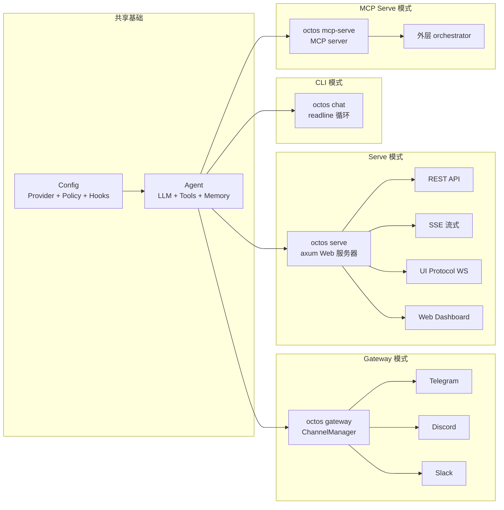

# 第 13 章：四种运行模式与配置体系

> **定位**：本章展示 octos 的四种运行模式（CLI/Gateway/Serve/MCP Serve）以及配置体系的层次结构和热加载机制。前置依赖：第 10 章、第 5 章。适用场景：需要部署和配置 octos 的运维人员和开发者（读者 D），以及想理解运行时架构选择的开发者（读者 B）。

同一套代码，四种运行姿态——这是 octos 作为"Agent 操作系统"的核心设计理念。

---

## 13.1 四种运行模式

### 13.1.1 CLI 模式（`octos chat`）

交互式终端对话（`crates/octos-cli/src/commands/chat.rs`）。启动 multi-threaded Tokio 运行时（8MB 栈大小，`crates/octos-cli/src/commands/chat.rs:69-74`），提供 readline 风格的输入界面。

```rust
// chat.rs:69-78
let runtime = tokio::runtime::Builder::new_multi_thread()
    .enable_all()
    .thread_stack_size(8 * 1024 * 1024)  // 8MB 栈——深递归场景需要
    .build()?;
```

8MB 栈大小（而非 Tokio 默认的 2MB）是因为 Agent 的调用链可能很深——特别是嵌套子 Agent 和递归工具调用场景。

退出命令支持多种格式：`exit`、`quit`、`/exit`、`/quit`、`:q`（`crates/octos-cli/src/commands/chat.rs:66-67`）。

CLI 参数（`crates/octos-cli/src/commands/chat.rs:22-64`）支持覆盖配置文件中的关键设置：`--cwd`、`--provider`、`--model`、`--max-iterations`、`--verbose`。命令行参数优先于配置文件。

### 13.1.2 Gateway 模式（`octos gateway`）

后台守护进程（`crates/octos-cli/src/commands/gateway/`）。启动 ChannelManager 监听多个消息频道，将收到的消息路由到 Agent 处理。

**GatewayRuntime**（`crates/octos-cli/src/commands/gateway/gateway_runtime.rs:54-95`）持有 Gateway 的核心运行时状态：消息层（`agent_handle`、`channel_mgr`）、会话分发（`actor_registry`、`session_dispatcher`、`active_sessions`）、热加载状态（`system_prompt`、`max_history`、`config_rx`）以及 persona/heartbeat/cron 等后台服务。

Gateway 支持 Profile / 子账号模式。`UserProfile.parent_id` 用来标记子账号；当前主分支会让子账号继承父 Profile 的结构化 `config.llm` contract，并在缺省时继承 `search`、`deep_crawl`、`apps`、`email`，同时把父级 `env_vars` 作为 base、子账号同名变量覆盖父级（`crates/octos-cli/src/profiles.rs:1236-1273`; `crates/octos-cli/src/commands/gateway/gateway_runtime.rs:221-245`）。如果 Gateway 由 `ProcessManager` 启动，子账号进程还会收到 `--parent-profile` 参数和父级 env vars 注入（`crates/octos-cli/src/process_manager.rs:275-291`）。

**GatewayDispatcher**（`crates/octos-cli/src/gateway_dispatcher.rs:35-44`）从主循环中提取出可测试的命令分发逻辑，支持 `/new`（新建会话）、`/switch`（切换 Profile）等内部命令。

### 13.1.3 Serve 模式（`octos serve`）

Web 服务器（`crates/octos-cli/src/commands/serve.rs`）。默认端口 50080，默认绑定 `127.0.0.1`（`crates/octos-cli/src/commands/serve.rs:214-222`）——安全默认值，外部访问需要显式指定 `--host 0.0.0.0`。

提供 Web Dashboard、REST 端点、SSE 流式输出，以及 AppUI 使用的 UI Protocol WebSocket（`/api/ui-protocol/ws`）。通过 axum 框架构建，AppState 持有全局状态（Provider、工具注册表、会话管理器等）。

### 13.1.4 MCP Serve 模式（`octos mcp-serve`）

`octos mcp-serve` 不是给人直接聊天的入口，而是把 octos 暴露成 MCP server，供外层 orchestrator 调用（`crates/octos-cli/src/commands/mcp_serve.rs:1-5`）。默认 transport 是 `stdio`，也支持 HTTP transport；HTTP 模式要求通过 `OCTOS_MCP_SERVER_TOKEN` 配置 bearer token（`crates/octos-cli/src/commands/mcp_serve.rs:7-11`）。

这个入口的关键差异是：每次 `run_octos_session` 调用都会加载 profile 配置，构造 LLM，标记任务 Running，创建 Agent，运行 prompt，验证 artifact，最后把任务转成 Ready 或 Failed（`crates/octos-cli/src/commands/mcp_serve.rs:13-30`）。换句话说，MCP Serve 的职责不是维护一个长期交互 UI，而是把 octos 的 Agent 能力包装成可由外部系统调度的任务执行接口。

| 维度 | CLI | Gateway | Serve | MCP Serve |
|------|-----|---------|-------|-----------|
| 入口 | `octos chat` | `octos gateway` | `octos serve` | `octos mcp-serve` |
| 用户交互 | 终端 readline | 消息频道 | Web UI + REST API + UI Protocol | MCP client / orchestrator |
| 并发模型 | 单会话 | 多频道多会话 | 多用户多会话 | 外部调度驱动的任务调用 |
| 默认端口 | — | — | 50080 | stdio；HTTP 默认 `127.0.0.1:4033` |
| 栈大小 | 8MB | 默认 | 默认 | 默认 |
| 适用场景 | 开发调试 | 消息 bot | API 集成、Web 部署 | 被上层 agent / IDE / 自动化系统编排 |

### 13.1.5 四种模式的架构关系



**图 13-1：四种运行模式共享 Agent 核心。** Config 和 Agent 是共同基础，四种模式只在接入层和调度方式上不同。

### 13.1.6 共同的启动模式

四种模式共享相似的启动流程（Command Pattern）：

1. 解析 CLI 参数（`clap` derive）
2. 加载配置文件（优先级链）
3. 初始化 tracing 日志（7 天轮转，JSON 格式可选）
4. 创建 Provider 和 Agent，或在任务调用时按 profile 构造 Provider 和 Agent
5. 进入各自的运行循环

---

## 13.2 配置体系

### 13.2.1 优先级层次

```
本地 .octos/config.json > 全局 ~/.config/octos/config.json > 内置默认值
```

本地配置优先于全局配置，允许不同项目使用不同的 Provider、模型和工具策略。

### 13.2.2 Provider 自动检测

当用户只指定模型名而未指定 Provider 时，octos 通过模型名前缀自动匹配（详见第 3 章 Provider 注册表）：

- `claude-*` → Anthropic
- `gpt-*` → OpenAI
- `gemini-*` → Google
- `deepseek-*` → DeepSeek

### 13.2.3 热加载

Config Watcher（`crates/octos-cli/src/config_watcher.rs:1-5`）每 5 秒轮询配置文件（`crates/octos-cli/src/config_watcher.rs:51-68`），通过 SHA-256 hash 检测变更。

`ConfigChange` 枚举（`crates/octos-cli/src/config_watcher.rs:15-25`）区分两类变更：

| 类型 | 可热加载项 | 实现方式 |
|------|-----------|---------|
| HotReload | system_prompt（`crates/octos-cli/src/config_watcher.rs:144-148`） | `RwLock<String>` 直接替换 |
| HotReload | max_history（`crates/octos-cli/src/config_watcher.rs:151-156`） | `AtomicUsize` 原子更新 |
| 不触发 RestartRequired | provider, model | Watcher 不再把 provider/model 变更归类为重启项；运行中切换仍走 `model_check`/`SwappableProvider` |
| RestartRequired | base_url, api_key_env | 需要重建 HTTP 客户端（`crates/octos-cli/src/config_watcher.rs:117-121`） |
| RestartRequired | sandbox, mcp_servers, hooks | 需要重建隔离环境或外部连接（`crates/octos-cli/src/config_watcher.rs:123-130`） |
| RestartRequired | gateway.queue_mode, gateway.channels | 影响消息分发主循环（`crates/octos-cli/src/config_watcher.rs:133-163`） |

### 13.2.4 SwappableProvider：运行时模型切换，而不是文件热加载

当前实现需要区分两条路径：

1. **配置文件热加载**：Config Watcher 只会把 `system_prompt` 和 `max_history` 作为 `HotReload` 发给主循环；Gateway 收到后分别写入 `RwLock<String>` 和 `AtomicUsize`（`crates/octos-cli/src/config_watcher.rs:175-180`; `crates/octos-cli/src/commands/gateway/gateway_runtime.rs:1335-1355`）。
2. **运行时模型切换**：Gateway 启动时把当前 LLM 包装为 `SwappableProvider`（`crates/octos-cli/src/commands/gateway/gateway_runtime.rs:256-257`）；当用户调用 `model_check` 工具执行切换时，`SwitchModelTool` 才会显式调用 `swappable.swap(new_chain)`（`crates/octos-cli/src/tools/switch_model.rs:290-295`）。

换句话说，**编辑磁盘上的 `config.json` 并不会让正在运行的 Gateway 自动切换 provider/model**。当前版本里，Watcher 已经不会把 provider/model 变更当作 `RestartRequired` 报警，但也不会把它们包含在 `HotReload` payload 里自动应用。安全的心智模型是：`system_prompt`/`max_history` 可以文件热加载；provider/model 可以在会话内显式切换；如果你希望磁盘配置里的 provider/model 成为新的启动态，仍应重启进程，让新配置在启动路径中重新构造 Provider 链。

`SwappableProvider` 本身的关键实现位于 `crates/octos-llm/src/swappable.rs:16-23,50-56`：

```rust
pub fn swap(&self, new_provider: Arc<dyn LlmProvider>) {
    let model_id = leak_str(new_provider.model_id().to_string());
    let provider_name = leak_str(new_provider.provider_name().to_string());
    *self.inner.write().unwrap() = new_provider;
    *self.cached_model_id.write().unwrap() = model_id;
    *self.cached_provider_name.write().unwrap() = provider_name;
}
```

`Box::leak()` 将 `String` 转换为 `&'static str`——代价是一小段永不释放的内存（每次模型切换泄漏几十个字节），换来的是 `model_id()` 和 `provider_name()` 可以在不持有 `inner` 读锁的情况下返回字符串引用。对于一个长期运行的服务，这点内存泄漏完全可接受。

**Config Watcher 的安全性**：Watcher 在一次轮询中读取所有配置文件并计算 hash，避免了先检查-再读取的 TOCTOU 竞态。如果配置文件解析失败，保留上一次的有效配置并打印警告，不会崩溃。

**为什么用轮询而非 inotify？** 跨平台兼容性。inotify 是 Linux 特有的，macOS 用 kqueue，Windows 用 ReadDirectoryChangesW。5 秒轮询 + SHA-256 hash 在所有平台上一致工作，且开销极小（一次 SHA-256 计算 < 1 微秒）。

---

## 13.3 Feature Flags

octos 通过 Cargo feature flags 控制条件编译：

| Feature | 启用内容 |
|---------|---------|
| `api` | Web API 服务器、监控、OTP、用户管理 |
| `admin-bot` | 管理 Bot 能力，在 `api` 之上附加 Telegram 管理接口 |
| `telegram` | Telegram 频道集成 |
| `discord` | Discord 频道集成 |
| `slack` | Slack 频道集成 |
| `email` | 邮件收发集成 |
| `git` | Git 操作工具 |
| `ast` | AST 代码结构分析 |

这让用户可以编译最小化的 octos 版本——只需 CLI 功能时，不引入 Web 服务器和频道集成的依赖。需要注意的是，`BrowserTool` 是默认内置工具，不对应单独的 Cargo feature；按需编译主要控制的是 API 能力和各频道集成。

---

> ### 工程决策侧栏：热加载 vs 全重启的边界划分
>
> 热加载的核心问题是"什么可以安全替换，什么不可以"。
>
> **系统提示**可以热加载，因为它是无状态的文本——下一次 LLM 调用使用新提示即可，不影响进行中的会话。
>
> **Provider/模型**需要区分两种情形：对话内显式切换可以通过 `SwappableProvider` 完成，但这条路径由 `model_check` 工具触发；直接编辑配置文件里的 provider/model，当前 `ConfigWatcher` 不会自动应用到运行中的 Gateway，也不会再把这类变更报成必须重启。与之相对，**base_url 和 api_key_env** 明确属于重启项，因为它们影响底层 HTTP 客户端的构造（连接池、TLS 配置），运行时替换可能导致进行中的请求失败。
>
> **Hooks**不能热加载，因为 Hook 的 circuit breaker 状态（连续失败计数）需要重新初始化。如果热加载只替换命令但不重置计数器，一个之前被熔断的 Hook 永远不会恢复。
>
> 简单规则：**文件热加载只覆盖已经接入 `ConfigWatcher` 的字段（目前是文本和历史窗口），需要重建连接的仍然重启；`SwappableProvider` 解决的是受控的运行时切换，不是通用配置热更新。**

---

## 13.4 本章回顾

1. **四种模式**：CLI（终端交互）、Gateway（消息 bot）、Serve（Web/API/AppUI）、MCP Serve（外部 orchestrator 调用），同一代码库四种入口。
2. **配置层次**：本地 > 全局 > 默认，Provider 自动检测简化配置。
3. **热加载**：SHA-256 轮询检测。文件热加载当前只覆盖 `system_prompt` 和 `max_history`；provider/model 的运行时切换走 `SwappableProvider` + `model_check` 工具；`base_url`、`hooks`、`MCP` 等仍需重启。
4. **Feature Flags**：按需编译，最小化部署体积。

---

## 延伸阅读

- **12-Factor App**：https://12factor.net/ — 特别是 Config 和 Processes 章节
- **axum 框架**：https://docs.rs/axum/latest/axum/ — octos Serve 模式的 Web 框架

## 思考题

1. **模式融合**：如果需要在同一进程中同时运行 Gateway（消息 bot）和 Serve（Web API），架构需要做什么改变？
2. **配置验证**：当前配置文件在运行时解析和验证。如果提供一个 `octos config validate` 命令做离线验证，你会检查哪些内容？

---

> **版本演化说明**
> 本章分析基于 octos v0.1.0。当前主分支已经在 CLI/Gateway/Serve 之外增加 `octos mcp-serve` 入口，并将 Serve 默认端口固定为 50080。Feature flags 列表可能随功能扩展而增加。
