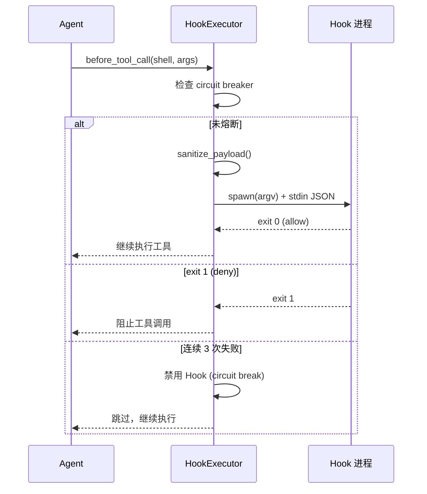

# 第 14 章：生产化：认证、监控与部署

> **定位**：本章展示 octos 从开发工具到生产系统需要的最后一块拼图——认证、Hooks 生命周期、监控和多租户配置。前置依赖：第 13 章。适用场景：需要将 octos 部署到生产环境的运维人员（读者 D），以及想理解生产级系统设计模式的开发者（读者 B）。

一个系统从"能跑"到"能上线"之间的距离，往往比代码量暗示的更大。认证、监控、Hook 系统、多租户隔离——这些不是功能，而是信任的基础设施。

---

## 14.1 认证三流

### 14.1.1 OAuth PKCE

octos 对 OpenAI 等支持 OAuth 的 Provider 实现了 PKCE（Proof Key for Code Exchange）流程（`crates/octos-cli/src/auth/oauth.rs`）。

**PKCE 的核心思想**：传统的 OAuth 授权码流程中，恶意应用可以拦截 authorization code 并冒充合法应用。PKCE 通过在授权请求中嵌入一个"证明密钥"来防止这种攻击——只有知道原始 verifier 的应用才能用 code 换取 token。

**octos 的 PKCE 实现**（`oauth.rs:30-45`）：

```rust
pub fn generate_pkce() -> PkceChallenge {
    // 1. Verifier = 2 个 UUID v4 拼接 = 64 个十六进制字符
    let verifier = format!("{}{}", Uuid::new_v4().simple(), Uuid::new_v4().simple());

    // 2. Challenge = SHA-256(verifier) 的 Base64-URL 编码（无 padding）
    let mut hasher = Sha256::new();
    hasher.update(verifier.as_bytes());
    let challenge = base64_url_encode(&hasher.finalize());

    PkceChallenge { verifier, challenge }
}
```

**为什么用 2 个 UUID 拼接？** RFC 7636 要求 verifier 长度在 43-128 字符之间。单个 UUID v4 的 simple 格式是 32 个十六进制字符（不够），两个拼接得到 64 个（满足要求）。

授权流程的五个步骤：

1. 生成 PKCE verifier + challenge 对
2. 生成随机 state 参数（UUID v4，防 CSRF）
3. 打开浏览器跳转到 Provider 的授权页面（携带 challenge）
4. 本地启动 HTTP 服务器（`localhost:1455/auth/callback`，`oauth.rs:18-21`）接收回调
5. 用 authorization code + verifier 换取 access token

### 14.1.2 Device Code Flow

对于无浏览器环境（如远程服务器），支持 device code flow——显示一个 URL 和代码，用户在另一台设备上完成认证。

### 14.1.3 Paste-token

最简单的认证方式——用户直接粘贴 API key。适用于不支持 OAuth 的 Provider。

### 14.1.4 凭据存储

凭据存储在 `~/.octos/auth.json`，文件权限 `0600`（仅所有者可读写）。Bearer token 比较使用常量时间算法（`subtle` crate），防止时序攻击。

### 14.1.5 API 安全

Serve 模式的 HTTP 服务器默认绑定 `127.0.0.1`（仅本地访问）。需要外部访问时通过 `--host 0.0.0.0` 显式开启——安全默认值原则。

---

## 14.2 Hooks 生命周期



**图 14-1：Hook 执行时序。** before_tool_call 是最常用的 Hook 事件。Circuit breaker 在 3 次连续失败后自动禁用 Hook。

Hooks 让用户在 Agent 执行的关键节点注入自定义逻辑（`crates/octos-agent/src/hooks.rs`）。

### 14.2.1 四个事件

| 事件 | 时机 | 典型用途 |
|------|------|---------|
| `before_tool_call` | 工具调用前 | 审批、参数修改、日志 |
| `after_tool_call` | 工具调用后 | 结果过滤、审计 |
| `before_llm_call` | LLM 调用前 | 提示修改、请求拦截 |
| `after_llm_call` | LLM 调用后 | 响应过滤、监控 |

### 14.2.2 HookConfig 与 HookPayload

每个 Hook 的配置（`hooks.rs:36-47`）：

```rust
pub struct HookConfig {
    pub event: HookEvent,        // 触发的生命周期事件
    pub command: Vec<String>,    // argv 数组——无 Shell 解释
    pub timeout_ms: u64,         // 超时（默认 5000ms）
    pub tool_filter: Option<String>, // 可选：只对特定工具触发
}
```

`tool_filter` 让用户可以精确控制——例如，只在 `shell` 工具调用前触发审批 Hook，其他工具不触发。

**HookPayload**（`hooks.rs:55-105`）是传递给 Hook 进程的 JSON 数据：

| 事件类型 | Payload 字段 |
|---------|-------------|
| before/after_tool_call | tool_name, arguments, tool_id, result |
| before/after_llm_call | model, stop_reason, has_tool_calls, token 计数 |
| 所有事件 | session_id, profile_id（来自 HookContext） |
| after_llm_call（额外） | cumulative_input_tokens, session_cost |

### 14.2.3 Shell 协议

Hook 命令以 argv 数组执行（**无 Shell 解释**，防止注入），通过 stdin 接收 JSON payload，通过 exit code 返回决策：

| Exit Code | 含义 | 行为 |
|-----------|------|------|
| 0 | Allow | 继续执行 |
| 1 | Deny | 阻止操作 |
| 2+ | Modify | 使用 stdout 的 JSON 替换原始参数 |

**敏感数据保护**（`hooks.rs:107-150`）：

```rust
const MAX_PAYLOAD_FIELD_BYTES: usize = 1024; // 1KB
const SENSITIVE_TOOLS: &[&str] = &["shell", "write_file", "read_file"];
```

- 敏感工具（shell、write_file、read_file）的参数被替换为 `{"redacted": true}`
- 其他工具参数截断到 1KB（UTF-8 安全截断）
- 防止 Hook 进程（可能是第三方脚本）看到文件内容或 Shell 命令

Session 上下文（`session_id`、`profile_id`）注入到所有 Payload 中（`hooks.rs:85-88`），让 Hook 可以实现基于会话或用户的差异化策略。

### 14.2.4 Hook 执行源码走读

`execute_hook()`（`hooks.rs:478-557`）展示了安全执行外部进程的完整模式：

```rust
async fn execute_hook(&self, hook: &HookConfig, payload_json: &str) -> Result<(i32, String)> {
    let (program, args) = hook.command.split_first()
        .ok_or_else(|| eyre!("empty hook command"))?;
    let program = expand_tilde(program);  // ~/script.sh -> /home/user/script.sh

    let mut cmd = tokio::process::Command::new(&program);
    cmd.args(args).stdin(Stdio::piped()).stdout(Stdio::piped()).stderr(Stdio::piped());
    for var in BLOCKED_ENV_VARS { cmd.env_remove(var); }
    let mut child = cmd.spawn()?;

    if let Some(mut stdin) = child.stdin.take() {
        let _ = stdin.write_all(payload_json.as_bytes()).await;
        let _ = stdin.shutdown().await;
    }

    match tokio::time::timeout(Duration::from_millis(hook.timeout_ms), child.wait()).await {
        Ok(Ok(status)) => Ok((status.code().unwrap_or(2), stdout)),
        Err(_) => {
            let _ = child.kill().await;  // 超时 kill 防止僵尸进程
            Err(eyre!("hook timed out after {}ms", hook.timeout_ms))
        }
    }
}
```

**argv 数组而非 shell 字符串**：`Command::new(program).args(args)` 直接传递参数给 `execve()`，不经过 shell 解释。这关闭了 shell 注入攻击面。

**tilde 展开**：因为不经过 shell，`~/script.sh` 不会自动展开。`expand_tilde()` 安全地将 `~` 替换为 `$HOME`。

### 14.2.5 Circuit Breaker

每个 Hook 维护一个 `AtomicU32` 失败计数器。连续 3 次失败后自动禁用，使用 `compare_exchange`（CAS）确保警告只打印一次（`hooks.rs:376-396`）：

```rust
let failures = hook_failures[i].fetch_add(1, Ordering::Relaxed) + 1;
if failures >= threshold {
    if hook_failures[i].compare_exchange(failures, threshold + 1, Ordering::Relaxed, Ordering::Relaxed).is_ok() {
        warn!("Hook {:?} disabled after {} failures", hook.command, threshold);
    }
    continue;
}
```

成功调用重置计数器为 0。这防止了有 bug 的 Hook 进程持续崩溃拖慢整个系统。

---

## 14.3 监控

### 14.3.1 Prometheus 指标

Serve 模式暴露 Prometheus 指标端点，主要指标包括：

- **Token 使用量**：每次迭代的 input/output tokens（通过 `TokenTracker` 的原子计数器上报）
- **请求延迟**：LLM 调用和工具执行的延迟分布
- **会话计数**：活跃会话数量

### 14.3.2 Tracing

octos 使用 `tracing` crate 实现结构化日志，支持 JSON 格式输出（通过 `tracing-subscriber` 的 json layer）和文件轮转（通过 `tracing-appender`）。

---

## 14.4 多租户配置

多租户场景下，每个租户可以有独立的：
- Provider 和模型配置
- 工具策略（ToolPolicy）
- 系统提示
- 会话存储路径

租户隔离通过配置级别的分离实现——不同租户使用不同的配置文件，Agent 实例根据配置文件创建独立的 Provider、工具注册表和存储路径。

---

> ### 工程决策侧栏：为什么 Hooks 用 exit code 而非 JSON 响应
>
> **方案一：JSON 响应（stdin/stdout 全部 JSON）**
>
> 优势：表达力强，可以携带复杂的决策理由和修改后的参数
> 劣势：Hook 作者需要输出合法 JSON——Shell 脚本很难做到可靠的 JSON 生成
>
> **方案二：Exit code + 可选 stdout（octos 的选择）**
>
> 优势：
> - 最简单的 Hook 只需要 `exit 0`（允许）或 `exit 1`（拒绝）
> - Shell 脚本天然支持 exit code
> - 只在 exit 2+ 时才需要 JSON stdout，大部分 Hook 不需要修改参数
>
> 劣势：
> - exit code 语义有限（只有 allow/deny/modify 三种）
> - 拒绝原因无法通过 exit code 传达（需要 stderr 日志）
>
> **选择理由：** Hook 的主要用途是审批和日志，90% 的场景只需要 allow/deny 决策。用 exit code 让最简单的 Hook 实现极其轻量——一个 3 行的 Shell 脚本就能实现审批逻辑。只有需要修改参数的高级场景才需要 JSON 输出。

---

## 14.5 本章回顾

1. **认证三流**：OAuth PKCE（浏览器环境）、Device Code（无浏览器）、Paste-token（最简）。凭据 0600 权限 + 常量时间比较。
2. **Hooks**：4 事件 × Shell 协议（argv 执行、exit code 决策）。Circuit breaker 3 次失败自动禁用。敏感参数自动脱敏。
3. **监控**：Prometheus 指标 + 结构化日志。原子计数器实现锁无关的 token 追踪。
4. **多租户**：配置级隔离，每租户独立的 Provider、策略和存储。

全书 14 章到此结束。附录将提供完整的 Crate 依赖图、工具速查表、配置参考和贡献指南。

---

## 延伸阅读

- **OAuth 2.0 PKCE**：RFC 7636 "Proof Key for Code Exchange by OAuth Public Clients"
- **Prometheus**：https://prometheus.io/docs/introduction/overview/ — 监控系统和时序数据库
- **Circuit Breaker**：Martin Fowler, "CircuitBreaker" — 理解熔断器模式的设计理由
- **常量时间比较**：`subtle` crate 文档 — 防止时序侧信道攻击

## 思考题

1. **Hook 的安全边界**：当前 Hooks 通过 argv 执行（无 Shell），但 Hook 命令本身可能是一个恶意程序。你会如何验证 Hook 命令的可信度？
2. **Circuit Breaker 的恢复**：当前的实现在成功调用时重置计数器。但如果 Hook 被禁用后永远不再调用，它就永远无法恢复。你会如何设计一个"试探性恢复"机制？
3. **多租户的资源隔离**：当前的多租户隔离是配置级的，不是进程级的。如果一个租户的 Agent 消耗了过多 CPU 或内存，会影响其他租户。你会如何实现资源级别的隔离？

---

> **版本演化说明**
> 本章分析基于 octos v0.1.0。截至本书写作时，OAuth PKCE 流程和 Hooks 系统无重大变化。Prometheus 指标列表可能随版本扩展。多租户支持可能在后续版本中增加进程级隔离。
