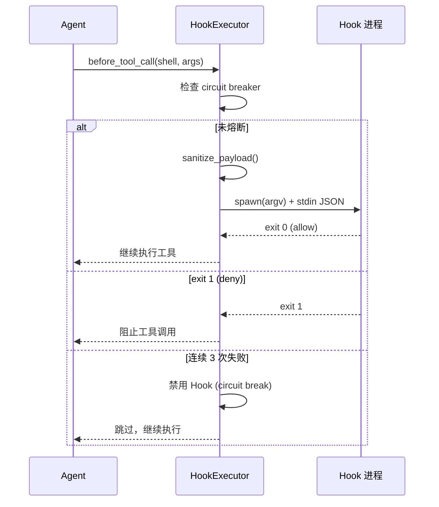
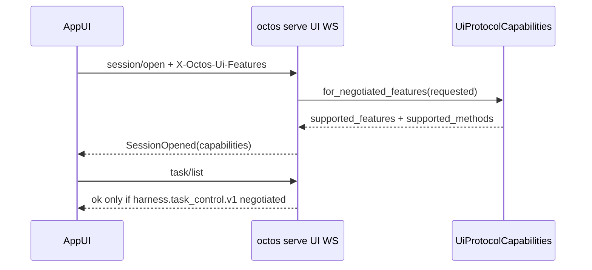
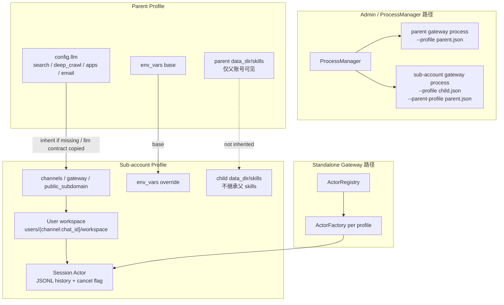
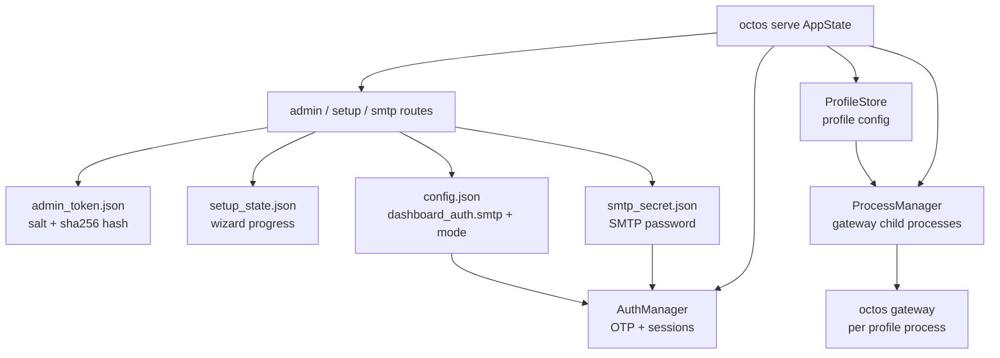

# 第 14 章：生产化：认证、监控与部署

> **定位**：本章展示 octos 从开发工具到生产系统需要的最后一块拼图——认证、Hooks 生命周期、监控和多租户配置。前置依赖：第 13 章。适用场景：需要将 octos 部署到生产环境的运维人员（读者 D），以及想理解生产级系统设计模式的开发者（读者 B）。

一个系统从"能跑"到"能上线"之间的距离，往往比代码量暗示的更大。认证、监控、Hook 系统、多租户隔离——这些不是功能，而是信任的基础设施。

---

## 14.1 认证三流

### 14.1.1 OAuth PKCE

octos 当前只为 **OpenAI** 实现了 PKCE（Proof Key for Code Exchange）流程；其他 Provider 仍走 paste-token 路径（`../octos/crates/octos-cli/src/auth/oauth.rs`, `../octos/crates/octos-cli/src/commands/auth.rs`）。

**PKCE 的核心思想**：传统的 OAuth 授权码流程中，恶意应用可以拦截 authorization code 并冒充合法应用。PKCE 通过在授权请求中嵌入一个"证明密钥"来防止这种攻击——只有知道原始 verifier 的应用才能用 code 换取 token。

**octos 的 PKCE 实现**（`../octos/crates/octos-cli/src/auth/oauth.rs:25-44`）：

```rust
fn generate_pkce() -> PkceChallenge {
    // 1. Verifier = 2 个 UUID v4 拼接 = 64 个十六进制字符
    let verifier = format!("{}{}", Uuid::new_v4().as_simple(), Uuid::new_v4().as_simple());

    // 2. Challenge = SHA-256(verifier) 的 Base64-URL 编码（无 padding）
    let mut hasher = Sha256::new();
    hasher.update(verifier.as_bytes());
    let challenge = base64_url_encode(&hasher.finalize());

    PkceChallenge { verifier, challenge }
}
```

**为什么用 2 个 UUID 拼接？** RFC 7636 要求 verifier 长度在 43-128 字符之间。单个 UUID v4 的 simple 格式是 32 个十六进制字符（不够），两个拼接得到 64 个（满足要求）。

授权流程的五个步骤：

1. 生成 PKCE verifier + challenge 对
2. 生成随机 state 参数（UUID v4，防 CSRF）
3. 打开浏览器跳转到 Provider 的授权页面（携带 challenge）
4. 本地启动 HTTP 服务器（`localhost:1455/auth/callback`，`../octos/crates/octos-cli/src/auth/oauth.rs:18-21`）接收回调
5. 用 authorization code + verifier 换取 access token

### 14.1.2 Device Code Flow

对于无浏览器环境（如远程服务器），OpenAI 还支持 device code flow——显示一个 URL 和代码，用户在另一台设备上完成认证。

### 14.1.3 Paste-token

最简单的认证方式——用户直接粘贴 API key。适用于不支持 OAuth 的 Provider。

### 14.1.4 凭据存储

凭据存储在 `~/.octos/auth.json`，Unix 下以 `0600` 权限写入（仅所有者可读写）。Serve 主路由里的 admin/test token 校验使用常量时间比较，避免明显的时序侧信道（`../octos/crates/octos-cli/src/auth/store.rs:1-20`, `../octos/crates/octos-cli/src/auth/store.rs:79-116`, `../octos/crates/octos-cli/src/api/router.rs:639-669`）。

### 14.1.5 API 安全

Serve 模式的 HTTP 服务器默认绑定 `127.0.0.1`（仅本地访问）。需要外部访问时通过 `--host 0.0.0.0` 显式开启——安全默认值原则。

---

## 14.2 Hooks 生命周期



**图 14-1：Hook 执行时序。** before_tool_call 是最常用的 Hook 事件。Circuit breaker 在 3 次连续失败后自动禁用 Hook。

Hooks 让用户在 Agent 执行的关键节点注入自定义逻辑（`../octos/crates/octos-agent/src/hooks.rs`）。

### 14.2.1 核心事件与扩展事件

最常用的是 4 个 Agent 热路径事件：

| 事件 | 时机 | 典型用途 |
|------|------|---------|
| `before_tool_call` | 工具调用前 | 审批、参数修改、日志 |
| `after_tool_call` | 工具调用后 | 结果过滤、审计 |
| `before_llm_call` | LLM 调用前 | 提示修改、请求拦截 |
| `after_llm_call` | LLM 调用后 | 响应过滤、监控 |

但当前 `HookEvent` 不止 4 种。源码还包含 `on_resume`、`on_turn_end`、`before_spawn_verify`、`on_spawn_verify`、`on_spawn_complete`、`on_spawn_failure`，用于会话恢复、回合结束和后台/子任务生命周期（`../octos/crates/octos-agent/src/hooks.rs:28-42`）。因此书里可以把 4 个事件作为核心模型讲解，但不能把 `HookEvent` 描述成只有 4 个枚举值。

### 14.2.2 HookConfig 与 HookPayload

每个 Hook 的配置（`../octos/crates/octos-agent/src/hooks.rs:44-57`）：

```rust
pub struct HookConfig {
    pub event: HookEvent,        // 触发的生命周期事件
    pub command: Vec<String>,    // argv 数组——无 Shell 解释
    pub timeout_ms: u64,         // 超时（默认 5000ms）
    pub tool_filter: Vec<String>, // 仅对这些工具触发；空数组 = 所有工具
}
```

`tool_filter` 不是单个可选字符串，而是**工具名列表**。例如 `["shell", "write_file"]` 表示只在这两个工具上触发；空数组则表示所有工具都匹配。

**HookPayload**（`../octos/crates/octos-agent/src/hooks.rs:70-145`）是传递给 Hook 进程的 JSON 数据：

| 事件类型 | Payload 字段 |
|---------|-------------|
| before_tool_call | `tool_name`, `arguments`（已脱敏/截断）, `tool_id` |
| after_tool_call | `tool_name`, `result`（已脱敏/截断）, `tool_id`, `success`, `duration_ms` |
| before_llm_call | `model`, `message_count`, `iteration` |
| after_llm_call | `model`, `iteration`, `stop_reason`, `has_tool_calls`, `input_tokens`, `output_tokens`, `provider_name`, `latency_ms`, `cumulative_input_tokens`, `cumulative_output_tokens`, `session_cost`, `response_cost` |
| resume/turn/spawn 事件 | `turn_summary`, `task_id`, `task_label`, `parent_session_key`, `child_session_key`, `workflow_kind`, `current_phase`, `output_files`, `failure_action` |
| 所有事件 | `session_id`, `profile_id`（来自 `HookContext`） |

`schema_version` 是 Hook payload 的持久 ABI 版本；另外 `HookPayloadEnricher` 可以在序列化前注入 domain-specific `domain_data`，超长 JSON 会被替换成 `{"truncated": true}` 标记（`../octos/crates/octos-agent/src/hooks.rs:63-75`, `../octos/crates/octos-agent/src/hooks.rs:538-557`, `../octos/crates/octos-agent/src/hooks.rs:607-635`）。这让机器人、硬件或企业策略集成可以在不扩展核心枚举的情况下附加自己的上下文。

### 14.2.3 Shell 协议

Hook 命令以 argv 数组执行（**无 Shell 解释**，防止注入），通过 stdin 接收 JSON payload，通过 exit code 返回决策：

| Exit Code | 含义 | 行为 |
|-----------|------|------|
| 0 | Allow | 继续执行 |
| 1 | Deny | 仅在 `before_tool_call` / `before_llm_call` / `before_spawn_verify` 上阻止操作；after-hook 中视为错误 |
| 2 | Modify | 仅 `before_tool_call` / `before_spawn_verify` 可用；将 stdout 解析为新的 payload JSON |
| 其他 | Error | 计入失败次数，可能触发 circuit breaker |

**敏感数据保护**（`../octos/crates/octos-agent/src/hooks.rs:148-183`）：

```rust
const MAX_PAYLOAD_FIELD_BYTES: usize = 1024; // 1KB
const SENSITIVE_TOOLS: &[&str] = &["shell", "write_file", "read_file"];
```

- 敏感工具（shell、write_file、read_file）的参数被替换为 `{"redacted": true}`
- 其他工具参数截断到 1KB（UTF-8 安全截断）
- 防止 Hook 进程（可能是第三方脚本）看到文件内容或 Shell 命令

Session 上下文（`session_id`、`profile_id`）注入到所有 Payload 中（`../octos/crates/octos-agent/src/hooks.rs:104-108`, `../octos/crates/octos-agent/src/hooks.rs:492-496`），让 Hook 可以实现基于会话或用户的差异化策略。

### 14.2.4 Hook 执行源码走读

`execute_hook()`（`../octos/crates/octos-agent/src/hooks.rs:767-848`）展示了安全执行外部进程的完整模式。下面这段是**按当前实现压缩后的等价摘录**：

```rust
async fn execute_hook(&self, hook: &HookConfig, payload_json: &str) -> Result<(i32, String)> {
    let (program, args) = hook.command.split_first()
        .ok_or_else(|| eyre!("empty hook command"))?;
    let program = expand_tilde(program);  // ~/script.sh -> /home/user/script.sh
    let expanded_args: Vec<String> = args.iter().map(|a| expand_tilde(a)).collect();

    let mut cmd = tokio::process::Command::new(&program);
    cmd.args(&expanded_args).stdin(Stdio::piped()).stdout(Stdio::piped()).stderr(Stdio::piped());
    for var in BLOCKED_ENV_VARS { cmd.env_remove(var); }
    let mut child = cmd.spawn()?;

    if let Some(mut stdin) = child.stdin.take() {
        let _ = stdin.write_all(payload_json.as_bytes()).await;
        let _ = stdin.shutdown().await;
    }

    let stdout_handle = child.stdout.take();
    let stderr_handle = child.stderr.take();

    match tokio::time::timeout(Duration::from_millis(hook.timeout_ms), child.wait()).await {
        Ok(Ok(status)) => {
            let stdout = read_stdout(stdout_handle).await;
            log_stderr(stderr_handle, &hook.command).await;
            Ok((status.code().unwrap_or(2), stdout))
        }
        Err(_) => {
            let _ = child.kill().await;  // 超时 kill 防止僵尸进程
            Err(eyre!("hook timed out after {}ms", hook.timeout_ms))
        }
    }
}
```

为便于阅读，这里把源码中内联展开的 stdout/stderr 读取与日志逻辑折叠成了 `read_stdout()` / `log_stderr()` 两步；实际实现没有这两个独立函数。

**argv 数组而非 shell 字符串**：`Command::new(program).args(args)` 直接传递参数给 `execve()`，不经过 shell 解释。这关闭了 shell 注入攻击面。

**tilde 展开**：因为不经过 shell，`~/script.sh` 不会自动展开。`expand_tilde()` 安全地将 `~` 替换为 `$HOME`。

### 14.2.5 Circuit Breaker

每个 Hook 维护一个 `AtomicU32` 失败计数器。默认阈值是 3，也可以通过 `HookExecutor::with_threshold()` 配置；达到阈值后自动跳过该 Hook，并用 `compare_exchange`（CAS）确保警告只打印一次（`../octos/crates/octos-agent/src/hooks.rs:575-590`, `../octos/crates/octos-agent/src/hooks.rs:657-677`）：

```rust
let failures = hook_failures[i].fetch_add(1, Ordering::Relaxed) + 1;
if failures >= threshold {
    if hook_failures[i].compare_exchange(failures, threshold + 1, Ordering::Relaxed, Ordering::Relaxed).is_ok() {
        warn!("Hook {:?} disabled after {} failures", hook.command, threshold);
    }
    continue;
}
```

成功调用重置计数器为 0。这防止了有 bug 的 Hook 进程持续崩溃拖慢整个系统；但如果 Hook 已被熔断并持续被跳过，当前实现没有后台半开探测，需要配置变更或进程重启才能重新尝试。

---

## 14.3 可观测性与控制面：三层监控 + AppUI

octos 的可观测性不是一个单一的 metrics endpoint——它由 Prometheus 指标、结构化 tracing 和 SSE 实时事件流三层组成，各自覆盖不同的观测需求。当前主分支还增加了一条更强的交互控制面：AppUI 使用的 UI Protocol WebSocket。它不只是“看见事件”，还允许前端对会话、审批、diff 和后台任务执行受控操作。

### 14.3.1 Prometheus 指标

Serve 模式暴露 Prometheus 指标端点（`crates/octos-cli/src/api/metrics.rs:1-76`）。`MetricsReporter` 装饰了 Agent 的 `ProgressReporter` trait，在转发事件的同时记录指标：

| 指标名 | 类型 | 标签 | 用途 |
|--------|------|------|------|
| `octos_tool_calls_total` | Counter | `tool`, `success` | 每个工具的调用次数和成功率 |
| `octos_tool_call_duration_seconds` | Histogram | `tool` | 每个工具的执行时间分布 |
| `octos_llm_tokens_total` | Counter | `direction` (input/output) | 记录 `CostUpdate` 上报的累计 session token 值，更适合趋势观察 |

这三个指标看似简单，但组合使用可以回答生产环境中最关键的问题：

- **哪个工具最慢？** `octos_tool_call_duration_seconds` 按 tool 标签分桶，P99 延迟一目了然
- **LLM 活跃度是否异常？** `octos_llm_tokens_total` 的变化趋势可以帮助发现高消耗会话或流量尖峰
- **哪个工具最不可靠？** `octos_tool_calls_total{success="false"}` / `octos_tool_calls_total` = 工具失败率

`MetricsReporter`（`metrics.rs:40-75`）的设计值得注意——它不是独立的采集器，而是 Agent 事件流的**装饰器**。每次工具调用完成时，Agent 通过 `ProgressReporter` trait 上报事件，`MetricsReporter` 拦截事件、记录指标、然后将事件透传给下游（如 SSE 流）。这避免了在 Agent 热路径中添加额外的采集逻辑。

但这里有一个实现细节必须说清：`MetricsReporter` 当前直接把 `CostUpdate` 里的 `session_input_tokens/session_output_tokens` 累加进 Counter，而这两个字段本身就是“当前会话的累计值”，不是“本次调用新增的 delta”（`crates/octos-cli/src/api/metrics.rs:63-70`, `crates/octos-agent/src/agent/streaming.rs:242-257`）。因此它更适合做**趋势监控**，不适合直接拿来当精确账单或实时成本真值。

### 14.3.2 结构化 Tracing

octos 使用 `tracing` crate 实现结构化日志（`crates/octos-cli/src/main.rs:64-131`）：

- **日志轮转**：7 天滚动日志（`tracing-appender` 的 `daily` rotation），自动清理旧文件
- **JSON 模式**：`OCTOS_LOG_JSON=1` 将控制台 layer 切成 JSON 格式，适合接入 ELK/Loki 等日志聚合系统
- **Compact 模式**：默认人类可读的紧凑格式，包含时间戳、级别、span 上下文
- **日志目录**：Serve 模式可写入 `~/.octos/logs/serve.YYYY-MM-DD.log`；文件 layer 仍是 compact 格式

当前实现中，tracing 主要通过 `tracing::info!`/`warn!`/`debug!` 宏在关键路径上打点，而非系统性的 `#[instrument]` 标注。这意味着**分布式 tracing（跨服务 trace ID 传播）尚未实现**——这是图表中标注的"缺分布式 tracing"差距。对于单进程部署，结构化日志已经足够；但在多 Gateway 实例或 Gateway + 外部 MCP 服务器的部署架构中，缺少 trace ID 会让跨组件的请求追踪变得困难。

### 14.3.3 SSE 实时事件流：前端可观测性

SSE（Server-Sent Events）在 octos 中不只是"流式输出 token"——它是一个完整的**运行时可观测性通道**。这里有两条实现路径：

- **Serve/API 路径**：`POST /api/chat` 的流式响应使用 `ChannelReporter` + `event_to_json()` 把 `ProgressEvent` 序列化成 per-request SSE 事件；`GET /api/chat/stream` 则是 legacy broadcast，走 `SseBroadcaster`（`crates/octos-cli/src/api/sse.rs:35-98`, `crates/octos-cli/src/api/handlers.rs:205-209`, `crates/octos-cli/src/api/handlers.rs:284-305`）
- **Gateway/channel 路径**：如果请求被代理到带 `ApiChannel` 的 gateway，相同的离散事件会由 `ChannelStreamReporter` 转成 raw SSE JSON，再通过 `send_raw_sse()` 发回前端（`crates/octos-cli/src/stream_reporter.rs:56-125`, `crates/octos-cli/src/stream_reporter.rs:457-460`, `crates/octos-cli/src/api/handlers.rs:72-84`）

下面列的是这两条路径**共享的、最有观测价值的离散事件**：

| SSE 事件 | 触发时机 | Payload |
|---------|---------|---------|
| `tool_start` | 工具开始执行 | `{"type":"tool_start","tool":"shell"}` |
| `tool_end` | 工具完成 | `{"type":"tool_end","tool":"shell","success":true}` |
| `tool_progress` | 工具中间进度 | `{"type":"tool_progress","tool":"shell","message":"..."}` |
| `thinking` | LLM 开始思考 | `{"type":"thinking","iteration":3}` |
| `response` | LLM 开始响应 | `{"type":"response","iteration":3}` |
| `cost_update` | 累计 token/成本更新 | `{"type":"cost_update","input_tokens":1234,"output_tokens":567,"session_cost":0.02}` |

这让前端 Dashboard 可以实时显示：Agent 当前在第几轮迭代、正在调用哪个工具、工具执行到哪一步、累计花了多少 token/钱。这种细粒度的过程可见性是 AI Agent 可观测性的独特需求——传统 Web 服务的 metrics 只关注请求级别的延迟和吞吐量，而 Agent 的用户需要看到**思考过程**。

`cost_update` 事件（`api/sse.rs:74-85`, `stream_reporter.rs:108-120`）特别有运营价值：它在每次 LLM 调用后推送累计的 `session_cost`，让管理员和用户实时感知成本消耗。这比事后查看 Prometheus 指标更及时——用户可以在对话过程中就决定是否继续。

当前主分支还提供专门的 harness event SSE：`GET /api/events/harness`。它不是通用日志流，而是面向 dashboard、validator 和 live gate 的 typed event stream。`kinds` 参数支持 `SwarmDispatch`、`swarm_dispatch`、`swarm-dispatch` 这类写法归一化，并兼容 top-level `kind` 与 nested `payload.kind` 两种 frame（`crates/octos-cli/src/api/events_harness.rs:32-130`）。

| 观测层 | 入口 | 解决的问题 |
|--------|------|------------|
| tracing | 结构化日志 | 开发者调试与故障定位 |
| Prometheus | `/metrics` | 聚合统计、告警、容量趋势 |
| harness events | `/api/events/harness` | task / sub-agent / swarm 的结构化实时事件 |

### 14.3.4 AppUI / UI Protocol：从观察到控制

Serve 模式还暴露 `/api/ui-protocol/ws`（`crates/octos-cli/src/api/router.rs:95-101`）。这条路径不是 REST 或 SSE 的替代品，而是 AppUI 的双向控制通道：前端通过 WebSocket 发送 JSON-RPC 风格请求，后端返回结构化结果并推送会话事件。

`session/open` 是这条协议的入口。后端会返回 `SessionOpened`，其中包含当前 profile、workspace root、cursor、pane snapshots 和协商后的 capabilities（`crates/octos-core/src/ui_protocol.rs:1570-1597`; `crates/octos-cli/src/api/ui_protocol.rs:1450-1475`）。这比普通 SSE 多了两个关键能力：

- **能力协商**：协议 schema version 当前为 2，并通过 feature flags 暴露 `approval.typed.v1`、`pane.snapshots.v1`、`session.workspace_cwd.v1`、`harness.task_control.v1` 等能力（`crates/octos-core/src/ui_protocol.rs:24-41`, `crates/octos-core/src/ui_protocol.rs:712-825`）。
- **方法级门控**：`task/list`、`task/cancel`、`task/restart_from_node` 这类后台任务控制方法必须具备 `harness.task_control.v1` capability，否则返回 unsupported capability，而不是静默降级（`crates/octos-core/src/ui_protocol.rs:55-69`）。

这条控制面把生产运维从“观察 Agent 发生了什么”推进到“在明确能力边界内干预 Agent”。例如 AppUI 可以列出后台任务、取消任务或从某个节点重启任务；后端对应的 handler 会把取消结果映射成 `UiTaskRuntimeState::Cancelled`，而不是只在日志里记录一行文本（`crates/octos-cli/src/api/ui_protocol.rs:2510-2650`）。

能力协商的细节也很重要：如果客户端没有发送 feature header，后端返回 `first_server_slice`，让旧客户端仍能 discovery；如果客户端发送了 feature header，后端只返回“客户端请求且服务端支持”的交集，未知 feature 会被丢弃。`task/list`、`task/cancel`、`task/restart_from_node` 只有在协商到 `harness.task_control.v1` 时才出现在 `supported_methods`（`crates/octos-core/src/ui_protocol.rs:748-825`; `crates/octos-cli/src/api/ui_protocol.rs:479-534`）。



需要注意的是，UI Protocol 不应该被当成“浏览器可以随便调用的内部总线”。它的价值正在于结构化能力协商和方法门控：前端能做什么由后端 capability 决定，新增控制能力时也应先进入 capability schema，而不是直接暴露临时 WebSocket 命令。

---

## 14.4 多租户：Profile + Account + User + Session 隔离

octos 的多租户不是单一层面的"租户 ID"字段，而是 Profile、子账号、用户工作区和会话 actor 共同组成的隔离模型。当前主分支还需要区分两条运行路径：

- **standalone Gateway 路径**：一个 Gateway 进程内通过 `ActorRegistry` 和 `ActorFactory` 管理多个 profile/session。
- **admin/process-manager 路径**：`ProcessManager` 会为每个 profile 启动独立的 `octos gateway` 子进程，并通过 `--profile`、`--parent-profile`、`--data-dir`、`--cwd` 等参数把 profile 配置和数据目录传给子进程（`crates/octos-cli/src/process_manager.rs:241-283`）。

因此本节的"多租户隔离"要分成两层看：配置和数据目录是 profile/account 级的；是否进程级隔离取决于运行入口。生产管理面通常走 process-manager 模式，单独的 `octos gateway` 则仍是同进程 actor 模型。

### 14.4.1 Profile / Account 层：租户配置与子账号

UserProfile（`crates/octos-cli/src/profiles.rs:18-40`）是租户的顶层抽象：

```rust
pub struct UserProfile {
    pub id: String,                    // 唯一标识（slug 格式）
    pub name: String,                  // 显示名称
    pub enabled: bool,                 // 是否自动启动
    pub data_dir: Option<String>,      // 数据目录覆盖
    pub public_subdomain: Option<String>, // 子账号公开子域
    pub parent_id: Option<String>,     // 子账号继承
    pub config: ProfileConfig,         // 内联 LLM/工具/频道配置
    pub created_at: DateTime<Utc>,
    pub updated_at: DateTime<Utc>,
}
```

每个 Profile 可以有独立的：
- **LLM contract 和模型路由**：Profile A 用 Claude，Profile B 用 GPT-4o 或 fallback chain
- **工具策略**：Profile A 允许 shell，Profile B 禁止
- **系统提示**：不同 Profile 的 Agent 行为完全不同
- **频道绑定**：Profile A 接入 Telegram，Profile B 接入 Discord

**子账号创建规则**：`create_sub_account()` 要求父 profile 存在，并且父 profile 本身不能已经是子账号；子账号 ID 采用 `{parent_id}--{sub_account_id}` 形式，还会校验公开子域不冲突（`crates/octos-cli/src/profiles.rs:1180-1228`）。Admin API 提供 `GET /api/admin/profiles/:id/accounts` 列出子账号，以及 `POST /api/admin/profiles/:id/accounts` 创建子账号（`crates/octos-cli/src/api/admin.rs:1290-1385`）。

**子账号继承**：当前主分支的继承粒度已经不是旧的顶层 `provider/model/base_url/api_key_env`。`resolve_effective_profile()` 会让子账号继承父 profile 的完整 `config.llm` contract；`search`、`deep_crawl`、`apps`、`email` 只有在子账号未配置时才继承；`env_vars` 以父级为 base，再由子账号覆盖同名变量（`crates/octos-cli/src/profiles.rs:1236-1273`）。process-manager 启动子账号 gateway 时还会传入 `--parent-profile`，并把父级 env vars 注入子进程，子账号自己的 env vars 优先（`crates/octos-cli/src/process_manager.rs:275-291`）。

这带来的心智模型是：**父账号提供共享能力契约，子账号提供接入面和差异化覆盖**。例如父账号统一配置 LLM、搜索和邮件，子账号只配置自己的频道凭据、公开子域和少量 env override。

**不继承 customer-installed skills**：子账号的 skills/plugin 目录是严格按当前 account 解析的。`skills_scope.rs` 明确说明 sub-account 不继承父 profile 安装的 customer skills；`resolve_account_skills_dir()` 和 `build_account_plugin_dirs()` 都只返回当前账号自己的 `data_dir/skills`（`crates/octos-cli/src/skills_scope.rs:1-38`）。这避免了父账号安装的本地可执行扩展在子账号里静默获得执行边界。

`ActorRegistry` 为命中 profile factory 的会话复用同一个 `ActorFactory`（`crates/octos-cli/src/session_actor.rs:145,168-178`）。这个工厂内部持有共享的 `Arc<dyn LlmProvider>`，因此同一 profile 的会话会复用同一套 provider stack；不同 profile 可以有不同工厂——这是 Provider 级隔离的实现方式。

### 14.4.2 User 层：文件系统隔离

在 Profile 内部，每个用户（由 SessionKey 中的 `channel:chat_id` 标识）拥有独立的文件系统工作区。Session actor 在创建时构建 per-user 路径（`crates/octos-cli/src/session_actor.rs:518-534`）：

```
{data_dir}/users/{encoded_base_key}/
├── workspace/          # 工具的工作目录
├── sessions/
│   ├── default.jsonl   # 默认会话历史
│   └── research.jsonl  # #research 主题的会话
```

需要注意：当前**按 user 隔离的是 `workspace/` 和 `sessions/`**。长期记忆与 memory bank 仍然挂在 profile/global `data_dir/memory/` 下，不是每个用户单独一个 `memory/` 目录（`crates/octos-memory/src/memory_store.rs:20-26`, `crates/octos-cli/src/commands/gateway/gateway_runtime.rs:386-392`）。

**路径隔离是双重保障**：

1. **应用级**：`resolve_path()` 将所有工具的文件操作限制在 `workspace/` 目录内
2. **内核级**：macOS 的 sandbox-exec SBPL 配置文件将文件系统访问限制在同一路径——即使工具代码有 bug 试图读取其他用户的目录，操作系统也会拒绝

每个 session actor 创建独立的沙箱实例（`session_actor.rs:545`），沙箱的 `cwd` 指向该用户的 `workspace/`。这意味着用户 A 的 `shell` 工具在用户 A 的工作目录中执行，即使在同一个 Gateway 进程中，也无法访问用户 B 的文件。

### 14.4.3 Session 层：会话级状态所有权

在 User 层之下，每个会话（同一用户可能有多个主题的会话）拥有独立的运行时状态（详见第 11 章 Session Actor）：

- **ToolRegistry**：每个 session actor 持有自己的工具注册表（含独立的 LRU 计数器）
- **对话历史**：通过 `SessionHandle` 管理，per-session JSONL 文件
- **取消标志**：`cancel_flag: AtomicBool`，一个会话的取消不影响同一用户的其他会话

**`sender_user_id` 传播**：频道层的用户 ID 通过 `DispatchParams::sender_user_id`（`session_actor.rs:43`）传递到 actor，再通过 `METADATA_SENDER_USER_ID` 常量（`session_actor.rs:17`）注入到所有出站消息的 metadata 中。这让 Matrix AppService 等支持多用户代理的频道可以"以用户身份发送消息"，而非以 bot 身份发送。

### 14.4.4 隔离层次总结



**图 14-2：Profile / 子账号 / User / Session 的隔离关系。** 父账号提供共享能力契约，子账号继承结构化配置但保持自己的频道、公开子域、数据目录和 customer skills。生产管理面可以为每个 profile 启动 gateway 子进程；standalone Gateway 则在同一进程里用 actor/factory 维护会话隔离。

当前隔离的边界可以概括为：

- **Profile / Account**：隔离 LLM contract、策略、频道、env、skills 和数据目录；子账号只继承明确允许的结构化配置。
- **Process**：process-manager 模式下按 profile 启动 gateway 子进程；standalone Gateway 模式下仍是同进程 actor 隔离。
- **User**：隔离 `workspace/` 和 `sessions/`，但长期 memory 仍挂在 profile/global data dir 下。
- **Session**：隔离 ToolRegistry、JSONL history、取消标志和运行时 actor 状态。

资源隔离仍不是完整的容器级隔离：即使 process-manager 将 profile 拆成子进程，如果没有 cgroup/container/系统级限额，一个 profile 的 CPU 或内存压力仍可能影响同一宿主机上的其他 profile。

---

## 14.5 生产控制面：setup、admin token、SMTP secret 与 profile 进程

如果把前面的认证、AppUI、多租户和 process-manager 放在一起看，Serve 模式在生产环境里的角色其实是**控制面**。它不只是提供 `/api/chat`，还持有一组和部署生命周期相关的状态对象：`AdminTokenStore`、`SetupStateStore`、`ProfileStore`、`ProcessManager`、`UserStore`、`AuthManager` 和配置文件路径（`../octos/crates/octos-cli/src/api/mod.rs:123-149`, `../octos/crates/octos-cli/src/commands/serve.rs:487-496`）。



**图 14-3：生产控制面总图。** Serve 聚合 setup wizard、admin token rotation、SMTP 配置、profile 配置和 gateway 子进程管理；真正执行消息处理的 gateway 可以由 process-manager 按 profile 启停。

几个边界要写清：

- `admin_token.json` 不是明文 token，而是带 16 字节随机 salt 的 `sha256(salt || token)` 记录；保存时使用临时文件 + rename，并在 Unix 下设为 `0600`（`../octos/crates/octos-cli/src/admin_token_store.rs:13-54`, `../octos/crates/octos-cli/src/admin_token_store.rs:86-105`）。
- 一旦 `admin_token.json` 存在，它就成为 admin auth 的权威来源；bootstrap `auth_token` 被忽略，直到 operator 执行 reset-token 清掉该文件。文件损坏时 admin 分支 fail closed（`../octos/crates/octos-cli/src/api/router.rs:639-655`）。
- setup wizard 状态保存在 `setup_state.json`，记录 `wizard_completed_at`、`wizard_skipped` 和 `wizard_last_step_reached`，用于 dashboard 跨会话恢复或跳过首次配置流程（`../octos/crates/octos-cli/src/setup_state_store.rs:1-21`, `../octos/crates/octos-cli/src/api/admin_setup.rs:83-155`）。
- SMTP 配置被拆成两层：host/port/username/from_address 写进 `config.json` 的 `dashboard_auth.smtp`，密码写入 `{data_dir}/smtp_secret.json`；API 从不返回密码明文，只返回 `password_configured`（`../octos/crates/octos-cli/src/api/admin_setup.rs:335-350`, `../octos/crates/octos-cli/src/api/admin_setup.rs:384-438`）。
- `smtp_secret.json` 优先解决“把 SMTP_PASSWORD 明文写进 launchd/systemd 环境”的问题；启动时如果环境变量不存在，Serve 还会尝试从匹配的 profile email 配置、profile env_vars 或 keychain 解析密码作为 fallback（`../octos/crates/octos-cli/src/smtp_secret_store.rs:1-10`, `../octos/crates/octos-cli/src/commands/serve.rs:162-200`, `../octos/crates/octos-cli/src/commands/serve.rs:405-413`）。
- setup/admin/smtp/deployment-mode 的 HTTP 路由都在 admin API 下，由 router 统一挂载（`../octos/crates/octos-cli/src/api/router.rs:312-341`）。这就是为什么这些状态应被视为生产控制面，而不是普通会话数据。

这个设计的取舍是：octos 没有把所有部署状态都塞进一个大配置文件。长期配置仍在 `config.json` / profile store；敏感凭据和一次性 setup 状态拆成专门的小 store。好处是权限、轮转和 fail-closed 语义更清楚；代价是运维备份时必须把 `{data_dir}` 下这些 store 一并纳入，而不能只备份 profile JSON。

---

> ### 工程决策侧栏：为什么 Hooks 用 exit code 而非 JSON 响应
>
> **方案一：JSON 响应（stdin/stdout 全部 JSON）**
>
> 优势：表达力强，可以携带复杂的决策理由和修改后的参数
> 劣势：Hook 作者需要输出合法 JSON——Shell 脚本很难做到可靠的 JSON 生成
>
> **方案二：Exit code + 可选 stdout（octos 的选择）**
>
> 优势：
> - 最简单的 Hook 只需要 `exit 0`（允许）或 `exit 1`（拒绝）
> - Shell 脚本天然支持 exit code
> - 只在 `before_tool_call` 返回 `exit 2` 时才需要 JSON stdout，大部分 Hook 不需要修改参数
>
> 劣势：
> - exit code 语义有限（只有 allow/deny/modify 三种）
> - 拒绝原因无法通过 exit code 传达（需要 stderr 日志）
>
> **选择理由：** Hook 的主要用途是审批和日志，90% 的场景只需要 allow/deny 决策。用 exit code 让最简单的 Hook 实现极其轻量——一个 3 行的 Shell 脚本就能实现审批逻辑。只有需要修改参数的高级场景才需要 JSON 输出。

---

## 14.6 本章回顾

1. **认证三流**：OpenAI 支持 OAuth PKCE（浏览器环境）和 Device Code（无浏览器）；其他 Provider 当前主要走 Paste-token。凭据写入 `~/.octos/auth.json`，Serve 主路由对 admin/test token 使用常量时间比较。
2. **Hooks**：核心 tool/LLM 事件加 resume/turn/spawn 生命周期事件，共用 Shell 协议（argv 执行、stdin JSON、exit code 决策）。Circuit breaker 默认 3 次失败自动禁用。敏感参数自动脱敏。
3. **监控**：Prometheus 指标 + 结构化日志 + SSE 事件流；其中 token 指标当前更适合趋势监控，不是精确计费真值。`/api/events/harness` 进一步提供 task / sub-agent / swarm 的 typed event stream。
4. **AppUI 控制面**：UI Protocol WebSocket 通过 `SessionOpened.capabilities` 和方法级 capability gate，把后台任务、审批和 diff 操作纳入结构化控制面。
5. **多租户**：Profile/Account、User、Session 分层隔离；子账号继承父账号结构化能力契约，但不继承 customer-installed skills；是否进程级隔离取决于 process-manager 还是 standalone Gateway 入口。
6. **生产控制面**：admin token、setup state、SMTP secret、profile config 和 gateway/serve/process manager 共同构成部署后的运维入口；敏感 secret 应走专用 store，而不是散落在日志或临时环境变量中。

全书 14 章到此结束。附录将提供完整的 Crate 依赖图、工具速查表、配置参考和贡献指南。

---

## 延伸阅读

- **OAuth 2.0 PKCE**：RFC 7636 "Proof Key for Code Exchange by OAuth Public Clients"
- **Prometheus**：https://prometheus.io/docs/introduction/overview/ — 监控系统和时序数据库
- **Circuit Breaker**：Martin Fowler, "CircuitBreaker" — 理解熔断器模式的设计理由
- **常量时间比较**：`subtle` crate 文档 — 防止时序侧信道攻击

## 思考题

1. **Hook 的安全边界**：当前 Hooks 通过 argv 执行（无 Shell），但 Hook 命令本身可能是一个恶意程序。你会如何验证 Hook 命令的可信度？
2. **Circuit Breaker 的恢复**：当前的实现在成功调用时重置计数器。但如果 Hook 被禁用后永远不再调用，它就永远无法恢复。你会如何设计一个"试探性恢复"机制？
3. **多租户的资源隔离**：process-manager 可以把 profile 拆成 gateway 子进程，但资源限额仍不是自动获得的。如果一个 profile 的 Agent 消耗了过多 CPU 或内存，会影响同宿主机的其他 profile。你会如何实现资源级别的隔离？

---

> **版本演化说明**
> 本章分析基于当前 `../octos` main 分支。相比早期版本，当前实现已经加入 UI Protocol capability negotiation、`/api/events/harness` typed SSE、setup/admin token store、SMTP secret store、结构化子账号继承和 process-manager per-profile gateway；但资源级隔离仍需要额外的系统级限制。
