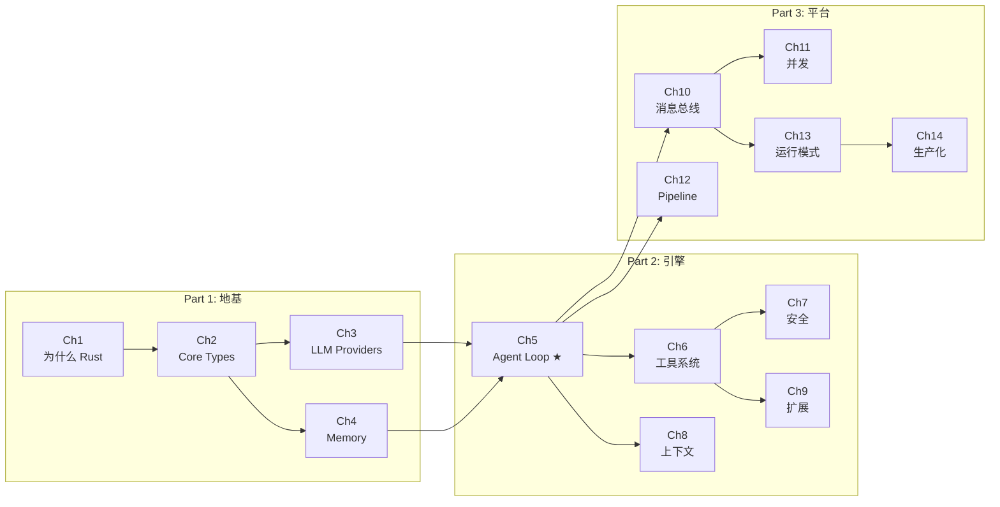

# 前言

## 为什么写这本书

AI Agent 正在从实验室走向生产。但当你翻开大多数 Agent 框架的源码，看到的是 Python 脚本、字符串拼接的 prompt、和 `try: ... except: pass` 式的错误处理。这在原型阶段没有问题，但当你需要让 Agent 在生产环境中 7x24 运行、服务多个租户、执行 Shell 命令和文件操作时，你需要的不是一个框架，而是一个操作系统级别的基础设施。

octos 是一个用 Rust 构建的 AI Agent 操作系统。13 万行代码，9 个核心 crate，零 `unsafe` 代码。它不是"Rust 写的 LangChain"——它是从第一行代码就为多租户、安全隔离、生产可靠性设计的系统。

这本书不是 octos 的用户手册。它是一本**工程决策解析**——每一章深入一个子系统的源码，展示"为什么这样做"、"考虑过什么替代方案"、"付出了什么代价"。如果你想理解如何用 Rust 的类型系统消除运行时错误、如何用三层容错链实现 LLM 调用的生产级可靠性、如何在不引入外部向量数据库的情况下构建混合搜索——这本书为你而写。

## 阅读准备

### 前置知识

- **Rust 基础**：理解所有权、借用、生命周期、trait、枚举。不需要精通，但需要能读懂 Rust 代码
- **异步编程概念**：理解 async/await、Future、事件循环。不需要 Tokio 经验
- **AI/LLM 概念**：理解什么是 LLM、token、上下文窗口、工具调用。不需要 prompt engineering 经验
- **不需要**：编译器原理、操作系统内核开发、机器学习数学

### 推荐阅读路径

本书 14 章 + 5 附录，根据你的背景选择最适合的路径：

**路径 A：Rust 学习者（通过实战项目学 Rust）**
> Ch1 → Ch2 → Ch4 → Ch5 → Ch6
> 重点关注类型系统设计（Ch2）、枚举状态机、错误处理模式

**路径 B：资深 Rust 开发者（学习大型 AI 系统架构）**
> Ch1 → Ch3 → Ch5 → Ch7 → Ch11 → Ch13
> 重点关注 trait object 选型（Ch3）、并发模型（Ch11）、安全纵深（Ch7）

**路径 C：AI/LLM 应用开发者（理解 Agent OS 设计）**
> Ch1 → Ch3 → Ch5 → Ch8 → Ch9
> 重点关注 Provider 容错（Ch3）、Agent Loop（Ch5）、上下文管理（Ch8）

**路径 D：octos 贡献者（深入内部实现）**
> 全部章节按序阅读 + 附录 E（贡献指南）

### 全书知识地图

**★ Ch5（Agent Loop）是全书枢纽**——理解了它，前四章是它的基础，后九章是它的延伸。

### 阅读标记说明

- **源码引用**：`crates/octos-core/src/task.rs:63-77` 格式，可直接在源码仓库中定位
- **工程决策侧栏**：每章一个，用 `>` 引用格式高亮，分析 2-3 种替代方案的利弊
- **Mermaid 图表**：架构图、状态机图、流程图，可用 Mermaid Live Editor 渲染
- **思考题**：每章结尾 3-4 道开放式问题，适合团队讨论或面试准备
